# 操作系统

ssr整理，参考资料为老师提供的骨架、ppt、课本（第三版），如有错误希望指正

## 概论

### 操作系统设计的主要目标

- 方便性
- 有效性
- 便于设计、实现和维护

### 操作系统管理系统资源

- 处理机管理：进程管理
- 存储器管理：内存管理
- 设备管理：对输入、输出设备的管理和控制
- 文件管理

### 多道程序系统

多道程序设计是指在主存中同时存放多个作业同时处于运行状态，共享系统中的各种资源，可以提高CPU利用率。

通道、缓冲机制等技术的出现，使计算机转为以主存为中心，使多道程序设计成为可能

宏观上多作业并行（时间段），微观上串行（时刻）。

### 操作系统基本功能

- 进程管理
- 内存管理
- 对输入、输出设备的管理和控制
- 文件管理

### 各类系统的特性

- 批处理系统，适合计算量大、自动化程度高的成熟作业

  优点：系统吞吐量大，资源利用率高

  缺点：不能直接控制作业运行，周转时间长

- 分时系统，适合短小作业，特点如下

  - 同时性：若干用户同时使用一台计算机
  - 独立性：用户各占有一台终端，彼此独立操作互不干扰
  - 交互性
  - 及时性

- 实时系统，适合实时过程控制与信息处理

  - 实时性
  - 可靠性
  - 确定性

### 操作系统的特性

- 并发性：系统中存在多个逻辑上相互独立的程序，都已启动，竞争系统资源，注意是时间段内存在
- 共享性：系统中资源可供系统中多个并发执行的进程共同使用
- 虚拟性：共享资源的一个物理实体变为若干个逻辑上的对应物
- 异步性：各进程的推进具有随机性

### 操作系统的性能指标

- 资源利用率：在给定时间内某一资源实际使用时间占比
- 吞吐量：单位时间内系统处理的信息量
- 周转时间：作业进入系统到退出系统所用时间
- 响应时间：从用户发出请求到系统开始响应所需的时间

### 嵌入式系统

以实际应用为中心、以计算机技术为基础、软硬件可裁剪的专用计算机系统。

软件要求固化存储。通常是一个多任务可抢占式的实时操作系统，只有满足实际需要的有限功能，如任务调度、同步与通信、主存管理、时钟管理等。

### 对称多处理

- 非对称多处理ASMP：主处理机运行操作系统，其他处理机运行用户作业，主处理机分配和调度任务
- 对称多处理SMP：操作系统和用户作业可以在任何处理机上运行，多处理机紧密耦合，共享主存

### CPU工作状态

- 核心态：允许执行处理机的全部指令集，访问所有寄存器和存储区
- 用户态：只允许执行处理机的非特权指令，访问指定的寄存器和存储区。

通过**硬件**从用户态转向核心态，在操作程序执行完后转回用户态

### 系统调用

操作系统内核提供的子程序，用户通过系统调用接口，向操作系统提出资源请求或系统服务。

特权指令：关系系统全局的指令，只能操作系统（核心态）调用，不允许用户使用

### 对用户提供的接口

- 操作接口：命令语言或窗口界面（GUI）
- 编程接口：系统调用

## 进程管理

### 程序顺序执行的特点

一次只运行一道程序，特点为：

- 封闭性：程序运行时独占全机资源
- 可再现性：只要初始条件相同，程序执行结果不变

封闭性与可再现性给程序调试带来方便，但系统资源利用效率低

### 进程的组成的概念

进程（process）是程序的一次执行过程

进程是程序在一个数据集合上顺序执行时发生的活动，是系统进行资源分配和调度的一个独立单位

总之，**进程是可以和其他程序并行执行的程序关于某个数据集合的一次执行过程**

进程的特性：

- 动态性：进程是程序的一次执行过程，是临时的
- 独立性：是系统进行资源分配和调度的一个独立单位
- 并发性：多个进程可在处理机上交替执行
- 结构性：系统为每个进程建立一个进程控制块PCB

进程与程序的区别：

- 进程是动态的，程序是静态的，因此通常进程不可在计算机间迁移，但程序可以
- 进程是暂时的，程序是永久的
- 进程包括程序、数据和进程控制块（**进程的组成部分**）
- 通过多次执行，一个程序可对应多个进程；通过调用，一个进程可包括多个程序。进程可创建其他进程，程序不能形成新的程序

### 进程控制块

进程控制块（PCB），也称为进程描述符，是进程的**唯一标识**

PCB的基本信息包括：

- 进程标识数，唯一标志进程的整数
- 进程的状态、调度、存储器管理信息
- 进程使用的资源信息
- CPU现场保护区，通常为各类指针信息，包括程序计数器，程序状态字，堆栈指针等
- 记账信息：CPU使用量，账号等
- 进程之间的家族关系：类UNIX系统，进程之间存在着家族关系，父/子进程。Windows 进程之间不具有父子关系。
- 进程的链接指针：链接相同状态的进程

### 进程的基本状态的转换

基本状态：

- 运行态：在CPU上运行，单CPU系统同时只有一个运行进程
- 阻塞态：又称等待态，缺少多于CPU的资源不能运行
- 就绪态：已获得除了CPU外所有的资源

状态转换：


进程的组织：

- 线性表：把所有进程数组存放在一个数组中

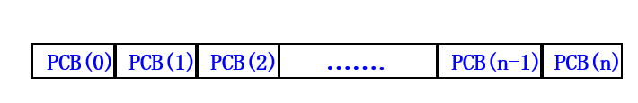

- 链接表：把具有相同状态的PCB组成一个队列，比如就绪态进程排成就绪队列，阻塞态进程根据阻塞原因排成多个阻塞队列


### 原语与进程控制

**原语**：由若干指令组成的完成某种特定功能的一段程序，具有**不可分割性**

**进程控制：**是指系统使用一些具有特定功能的程序段来创建、撤销进程，以及完成进程各状态间的转换，是通过操作系统内核来实现的，属于原语一级的操作，不可被中断

#### 创建原语

创建进程的时机：

- 批处理系统中会为每个提交的作业创建一个进程
- 分时系统中，系统会为每个登陆的用户创建一个终端进程
- 交互式系统中，键入一个命令或点击一个图标都会开始一个新进程。
- 在UNIX和Windows系统中，用户可以同时打开多个窗口，每个窗口都对应一个进程
- 已存在的进程可以通过系统调用的形式创建进程

创建原语的功能：

- 扫描进程表，找到空闲的PCB
- 为新进程的程序、数据、用户栈分配内存
- 初始化PCB，把调用者提供的参数填入PCB
- 将PCB插入就绪队列

#### 撤消原语

进程执行完成或因故障不能继续运行

功能：

- 在PCB集合中寻找所需要撤销的进程
- 若有子进程，撤销子进程
- 将占用的系统资源归还系统
- 撤销PCB

#### 阻塞原语

进程内部自己执行阻塞原语

功能：

- 中断CPU，将运行现场保存在PCB中
- 将PCB状态置为阻塞态，插入相应事件的阻塞队列中
- 转进程调度

#### 唤醒原语

分两种，唤醒后会从阻塞态进入就绪态

- 若进程等待的事件是I/O完成，I/O完成后设备会产生中断，CPU响应中断，在**中断处理**中将等待进程唤醒
- 若等待发送进程发送消息，由**发送进程**调动唤醒原语将等待进程唤醒

#### 挂起原语

根据需要将进程挂起一段时间，将进程由活动状态变为静止状态(静止就绪、静止阻塞)，对于分时系统，会将其从内存转换到外存

#### 解挂原语

当挂起进程的原因被解除时，系统调用解挂原语将指定的进程解挂，使其由静止状态变为活动状态。

当被解挂的进程变为活动就绪时，通常立即转进程调度。

### 处理机调度

进程数往往大于处理机数，需要多进程竞争处理机

处理机调度的级别（从高到低）：

- 作业调度：高级调度，在多道批处理系统中，用户作业被提交到**外存**，形成后备作业队列，被作业调度选中进入**内存**后处于运行态
- 交换调度：中级调度，引入的目的是使系统资源利用更合理，将主存中暂时不具备运行条件的进程换出到**外存交换区**，或将外存交换区中已具备运行条件的进程换入主存（挂起、解挂）
- 进程调度：低级调度，为进程分配处理机

#### 进程调度

进程调度的功能：

- 管理系统中各进程的执行状况，管理PCB
- 选择就绪进程占有CPU
- 进行进程的上下文切换，进程的上下文保存在PCB中，包括进程的运行环境和物理实体，分三级
  - 用户级上下文：进程的程序和数据、用户栈
  - 寄存器级上下文：CPU现场信息，主要为各类寄存器
  - 系统级上下文：包括进程的PCB、系统环境、核心栈等

进程调度的方式：

- 非抢先方式：某进程一直占用CPU直到运行完成或不能运行，用在批处理系统
- 抢先方式：调度程序基于某种策略剥夺运行进程的CPU给其他进程，用在分时系统、实时系统

进程调度的时机：

- 进程完成或错误中止
- 提出I/O请求，等待I/O完成时
- 在分时系统，按照时间片轮转，分给进程的时间片用完
- 优先级调度中，高优先级进程就绪
- 进程自身执行了原语操作

进程调度的算法：

- 先来先服务FCFS：系统维护FIFO队列，进程先进先出，简单，但大作业占用时间长，使平均周转时间延长
- 最短作业优先SJF：选取运行时间最短的作业运行，平均周转时间最佳，但长作业没有机会运行，会出现饥饿现象
- 响应比高者优先HRN：


​		选择相应比较高的作业运行，算法较复杂

- 优先级调度法：将CPU分配给就绪队列中优先级最高的进程，分为静态优先级和动态优先级，静态优先级在进程创建时确定，系统进程有较高优先级，资源量少的进程也有较高优先级，动态优先级随进程推进而改变

- 轮转法RR：用于分时系统，利用定时闹钟定时发出中断，时钟中断处理程序在设置新的时钟常量后，立即转入进程调度程序

- 多级反馈队列轮转法：优先级不同的进程排在不同的就绪队列，刚创建的进程和因IO请求未用完时间片的进程排在较高的优先级队列，高优先级队列时间片较短，低优先级较长，运行时间较长的进程降级

  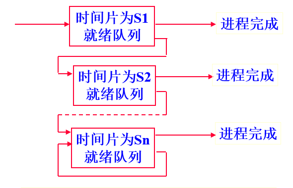

  总是先调度优先级较高的队列，只有当该队列为空时，才调度次高优先级队列，队列内采取轮转法RR

### 线程

线程是进程中的一个可执行实体，一个进程可以有多个线程，线程共享该进程的所有资源

以进程为单位**分配资源**，以线程为单位**调度执行**

包含线程的进程组成结构如下


线程控制块的组成：

- 唯一标识符
- 表示处理机状态和运行现场的一组寄存器
- 两个堆栈，分别用于用户态和核心态调用时进行参数传递
- 独立的程序计数器
- 关联的进程和线程指针

进程和线程的比较：

- 拥有的资源：进程拥有一个独立的地址空间，用于存放代码和数据段，进程内的多线程共享该进程的所有资源，线程自己拥有很少资源，进程至少包含一个线程
- 调度：进程调度的上下文切换开销较大，同一进程内的线程切换仅变换较小的资源，效率高速度快。
- 并发性：进程之间、进程内的多线程之间均可并发执行
- 安全性：进程安全性更高

系统对线程的支持：

- 用户级线程：有关线程的所有管理工作都由用户程序通过调用在**用户态运行的线程库**完成，系统内核不知道线程的存在，内核以进程为单位进行调度，一个线程阻塞，其所在的进程也阻塞。用户态多线程对应核心态一个进程，为**多对一模型**
- 核心级线程：有关线程的所有管理工作通过内核完成，应用程序通过**系统调用**来创建或撤销线程，线程阻塞不影响同一进程内其他线程的执行，用户态单线程对应核心态一个进程，为**一对一模型**
- 两级组合：既支持用户级线程，也支持核心级线程，多个用户线程可以对应等量或少量的核心级线程，称为**多对多模型**

### 并发执行的进程的关系

- 对资源共享引起的**互斥关系**，间接制约关系

- 协作完成同一任务引起的**同步关系**，直接制约关系

- 进程之间的**前序关系**，以下为几种可能的前序关系

  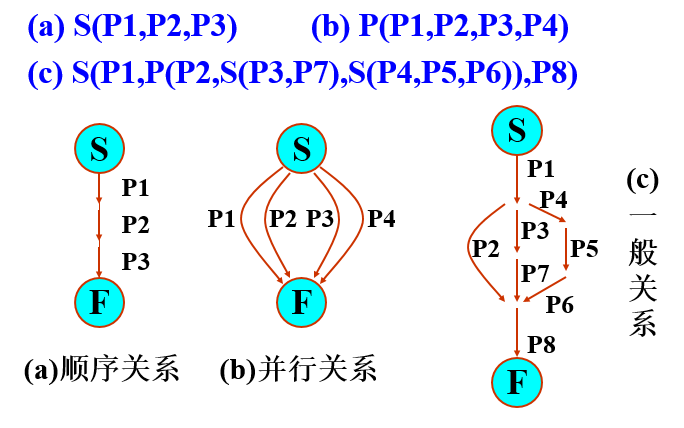

  S表示必须顺序执行的关系，P表示可以并行执行的关系

### 临界资源与临界区

临界资源：一次仅允许一个进程使用的系统中共享资源

临界区：并发进程访问临界资源的那段必须互斥执行的程序

并发进程进入临界区需要遵循的四个准则：

- 互斥使用：不能同时有两个进程在临界区执行
- 让权等待：等待进入临界区的进程，应释放处理机后阻塞等待
- 有空让进：在临界区外运行的进程不可阻止其他进程进入临界区
- 有限等待：不应使要进入临界区的进程无限期等待在临界区外

### 解决进程间互斥的硬件实现方法

#### 关中断

因为CPU只有在发生中断时才会进行进程切换，在进程刚进入临界区时立即禁止所有中断，离开前再打开中断

#### 测试和设置硬件指令

为每个临界区设置锁位变量w，为0表示资源空闲可用，为1表示资源已被占用

测试和设置是一条机器指令，不会被中断，可以定义如下


在进程中循环调用该指令可以检测临界资源是否为空，但这浪费了CPU的时间，所以被称为“忙等待”

### 信号量

信号量是一种用于进程合作完成一项任务的同步机制

信号量Semaphore的类型描述


对该结构只允许执行P、V原语操作


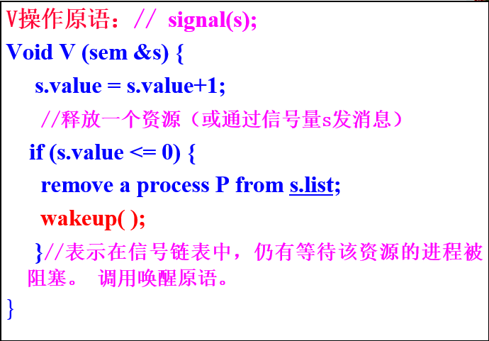

信号量S值直观表示空闲资源数，P操作表示请求资源，该值减1，V操作表示释放资源，该值加1

- S>0，空闲资源有S个
- S=0，无空闲资源也没有进程在等待资源
- S<0，有-S个进程在等待资源

### 经典IPC问题

#### 生产者消费者问题

设置三个信号量：

- empty：表示空缓冲区的个数，初值为k
- full：有数据的缓冲区个数，初值为0
- mutex：互斥访问临界区的信号量，初值为1

伪码参考如下：

```c
int  mutex=1, empty=k, full=0,  i=0, j=0;    
DataType  array[k];    
Producer：
        … 
        produce a product x;
        P(empty);    	//申请一个空缓冲
        P(mutex); 	//申请进入缓冲区
        array[i] = x;   	//放入产品
        i = (i+1)mod k;
        V(full);  	// 有数据的缓冲区个数加1
        V(mutex); 	//退出缓冲区

 Consumer：
          …
          P(full); 	//申请一个产品
          P(mutex); 	//申请进入缓冲区
          y = array[j]; 	//取产品
          j = (j+1)mod k;
	     V(empty); 	//释放1个空缓冲
         V(mutex); 	//退出缓冲区

```

注意P操作必须将互斥访问信号量放在之后，否则会发生死锁

#### 读者和写者问题

要求：

- 多个读进程可以同时读这个数据区
- 一次只有一个写进程可以往数据区中写
- 若一个写进程在写，禁止任何进程读

#### 理发师问题

设置两个信号量：

- 用s1制约理发师，初值为0，表示有0个顾客
- 用s2制约顾客，表示可用椅子数，初值为n


#### 哲学家进餐问题

为保证不发生死锁，除了五个代表叉子的信号量外，还需要一个互斥信号量mutex

伪码参考如下

```c
int fork[0]=fork[1]=…=fork[4]=1;
第i个哲学家所执行的程序：
do{ 	
		P(mutex);
 		P(fork[i]);
 		P(fork[(i+1)mod5]);
 		V(mutex);
   		 吃饭
 		V(fork[i]);
 		V(fork[(i+1)mod5]);
	} while(1)；

```

### 进程高级通信的实现机制

高级通信是指进程采用**操作系统提供**的多种通信方式实现通信，如消息缓冲、信箱、管道、共享主存区等

发送进程和接收进程采用消息通信方式时可能的组合

- 非阻塞发送，阻塞接收。发送进程发送完成后继续前进，接收进程未收到消息时阻塞等待。单向通信。
- 非阻塞发送，非阻塞接收。单向通信
- 阻塞发送，阻塞接收，发送者在发送完消息后阻塞等待接收者进程发送回答消息，接收者进程在接收消息前阻塞等待，收到消息后发送回答消息。双向通信

#### 消息缓冲通信

属于直接通信方式，实现方法：

- 系统设置消息缓冲池，包含多个缓冲区，每个缓冲区可以存放一个消息
- 当进程欲发送消息时，向系统申请一个缓冲区，将消息存入缓冲区，然后将该缓冲区链接到接收进程的**消息队列**上，消息队列通常位于接收进程的PCB上

发送原语：send (接收者，被发送消息始址)

接收原语：receive (发送者，接收区始址)

发送者先在自己的地址空间形成一个消息发送区，将消息写入其中。然后调用发送原语，从系统缓冲区申请一个消息缓冲区，将消息从发送区送入其中，然后挂到接收进程的消息队列

接收者调用接收原语，将消息队列内的消息接受到自己的接收区

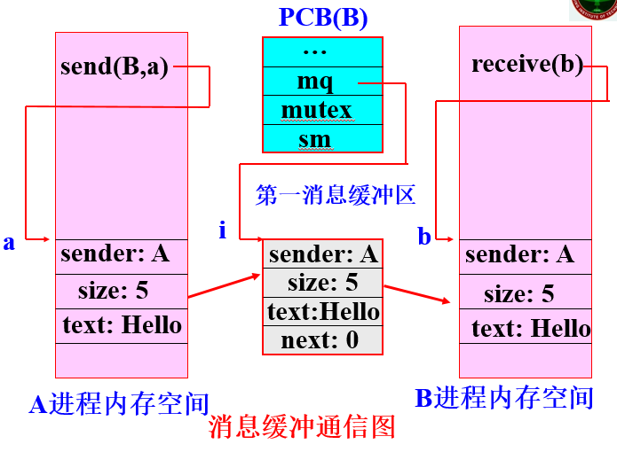

#### 信箱通信

间接通信方式，发送进程将消息发送到中间媒介——信箱，接收进程从中取得消息

发送原语：send(A, Msg)，将一个消息Msg发送到信箱A

接收原语：receive(A,Msg)，从信箱A中接收一个消息Msg

#### 管道通信

是指用于连接一个读进程和一个写进程的共享文件，通过操作系统管理的环形缓冲区，先进先出

#### 共享存储区

进程申请一块共享存储器，将共享存储区映射到各自地址空间，通过读或写共享存储区的数据通信

### 死锁产生的必要条件与解决方法

死锁是指一组中的每个进程都在等待该组中其他进程所占用资源的现象

死锁产生的必要条件

- 互斥条件，每个资源不可共享使用
- 保持和等待条件，进程因请求资源而阻塞时，对已经获得的资源保持不放
- 不剥夺条件，已分配给进程的资源不可剥夺
- 循环等待条件，存在进程**循环链**，链中每个进程都在等待链中的下一个进程所占用的资源。

根本原因：

- 对独占资源的共享
- 并发执行进程同步关系不当

解决死锁的方法

- 鸵鸟算法，忽略死锁
- 死锁的预防，破坏死锁产生的必要条件之一
- 死锁的避免，在资源动态分配过程中防止系统进入不安全状态
- 死锁的检测和恢复

#### 死锁的预防

- 破坏互斥条件。不可破坏，可以采用spooling技术打造虚拟设备，但适用范围有限
- 破坏保持和请求条件：在进程开始前就获得全部所需系统资源，资源利用率低，且无法精确提出所需资源
- 破坏非剥夺条件：当一个进程进入阻塞申请资源而得不到满足时，强行释放其占有的资源，之后再申请，这样恢复现场要付出很高的代价
- 破坏循环等待条件：将系统全部资源按类进行全局编号排序，进程对资源的请求必须按照资源的序号递增顺序进行，但找到能满足所有进程要求的编号是不可能的

目前没什么预防的好方法

#### 死锁的避免

基本思想：允许进程动态申请资源，系统在进行资源分配之前，先计算资源分配的安全性，若此次分配会导致系统进入不安全状态，则进程等待，否则分配资源

- 进程--资源轨迹图：示例如下

  有两个进程A、B和两个资源（打印机和绘图仪）

  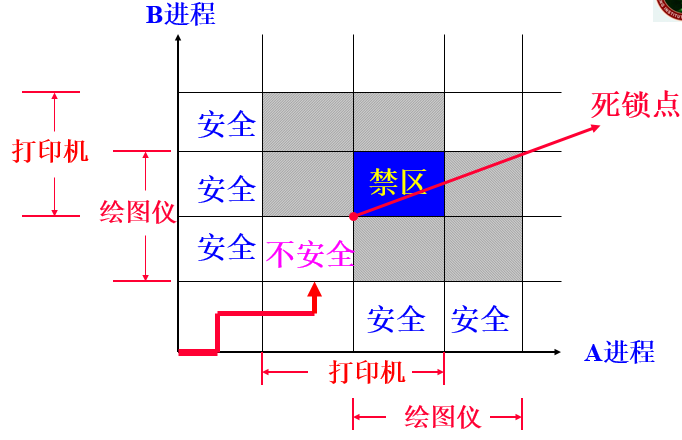

  水平坐标表示进程A执行的指令序列；垂直坐标表示进程B执行的指令序列。两个进程不可同时进入阴影区域，为防止死锁，应避免进入不安全区域

  

- 银行家算法，之后详细说明

#### 死锁的检测与恢复

定期启动一个软件检测系统状态，若发现死锁存在，则采取措施恢复

用**进程资源图**检测死锁：检查由进程和资源构成的有向图是否包含一个或多个环路，若是，则存在死锁，否则不存在。例如下

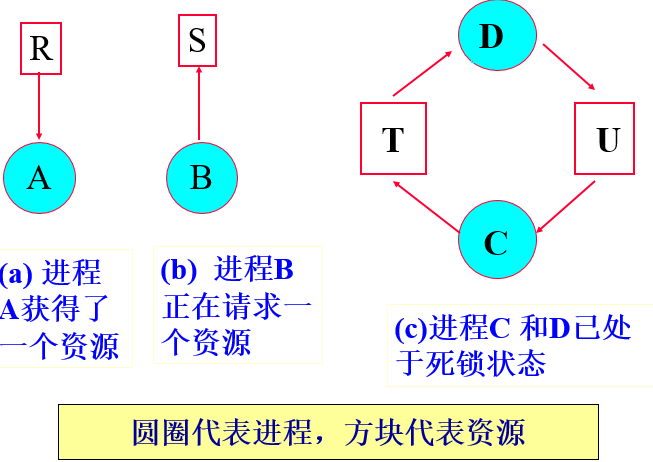

死锁的恢复：

- 故障终止一些进程
  - 故障终止所有死锁进程
  - 故障中止一个死锁进程
- 资源剥夺
  - 夺走一个进程的资源
  - 将一死锁进程回滚至获得资源之前的执行点

### 银行家算法

安全状态：系统能按照某种顺序，来为每个进程分配其所需资源，直至最大需求，使每个进程都可顺利完成

检查状态的方法：

- 检查剩余请求矩阵R是否有一行，其**剩余请求向量**小于等于系统**剩余资源向量**，若不存在，则系统会死锁
- 若找到这样一行，则可以假设它获得所需资源并运行结束，将资源还给系统
- 重复两个步骤直到所有进程都标记为终止

多做些题才能方便理解

## 存储器管理

### 存储器管理的功能

主要功能包括：

- 存储器分配：多进程使用主存
- 地址转换或重定位：研究各种地址变换方法以及相应的地址变换机构
- 存储器保护：防止故障程序破坏OS和其它信息
- 存储器扩充：采用多级存储技术实现虚拟存储器，交换技术
- 存储器共享：研究并发进程如何共享主存中的程序和数据。

需要注意的是，内存划分为用户空间和操作系统空间，**存储器管理是针对用户空间**进行管理的

几种概念：

- 符号名字空间：程序中各种符号名的集合所限定的空间
- 地址空间：由于程序在主存中的位置是未知的，程序段内所有地址都以0为起始地址顺序编码，把程序限定的空间称为逻辑地址空间
- 存储空间：物理存储器中所有物理单元的集合所限定的空间
- 逻辑地址：也称相对地址，由地址空间限定
- 物理地址：又称绝对地址，是物理存储器单元编号

程序只有从地址空间装入到存储空间才能运行

### 地址重定位

将程序地址空间的逻辑地址转换为存储空间的物理地址，分为静态重定位和动态重定位

#### 静态重定位

在进程执行**前**，由**装入程序**把用户程序中的逻辑地址转换为物理地址，特点为

- 不需要硬件支持
- 要求占用连续的区域
- 在程序执行期间不可移动，主存利用率低
- 难以进行程序和数据的共享
- 用于单道批处理系统


#### 动态重定位

装入程序将用户程序和数据原样装入主存区，**程序运行时**，将该主存区的起始地址送入**重定位寄存器**，需要**硬件地址转换机构**

- 需要硬件支持
- 不必占有连续的主存空间
- 程序在访问期间可移动，移动后只需修改重定位寄存器
- 方便共享主存中的程序和数据
- 用于多道批处理系统，分时系统

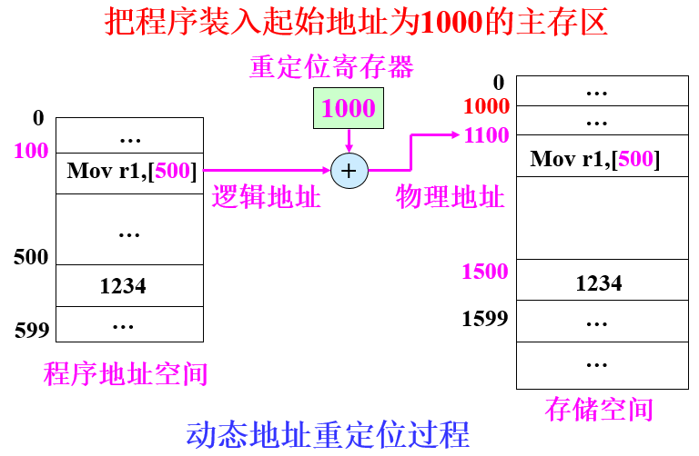

### 存储保护的目的

### 可变式分区管理

根据作业的大小动态划分存储器分区，使分区大小正好等于作业大小，分区大小与数量均不固定

管理分区所用**数据结构**分两种

- 分区说明表：分区说明表由两张表组成，分别是已分配区表、未分配区表，参考如下图

  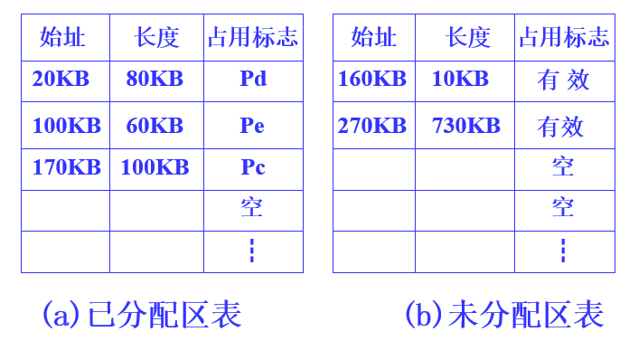

  分配主存：

  - 从未分配区表中找一个空闲区，将其一分为二，一部分分给作业另一部分留在表中
  - 在已分配区表中进行记录

  回收主存：

  - 将回收的主存登记在未分配区表中
  - 将该作业占用的已分配区表项置空

- 空闲区链

  将表格信息附加在每个已分配区和空闲区中，通常将表格信息放在每个分区的首字或尾字中

  已分配区记录在进程PCB中

  空闲区信息用空闲区链来记录

  表格信息结构如下

  

  - 状态位：为0表示空闲，为1表示已分配
  - 分区大小
  - 指针：形成双向链表

  链表形式参考如下

  

**分配算法**包括：

- 首次适应法：要求空闲区表或空闲区链中空闲区按地址从小到大排列，找到第一个能满足大小要求的空闲区
- 最佳适应法：找到能满足大小要求的**最小**空闲区，可通过从小到大排序空闲区的方式改进
- 最坏适应法：找到能满足大小要求的**最大**空闲区，可通过从大到小排序空闲区的方式改进

此外，回收一个释放区可能需要与邻接空闲区合并，可能情况有以下几种，假设释放区为R，可能的低地址空闲区为F1，可能的高地址空闲区为F2

- R与F1相邻接。

  

- R与F2相邻接。

  

- 先将R与F2合并，再将F2与F1合并。

  

- 若释放区R不邻接空闲区，则将其插入空闲区链的适当位置即可。

可变式分区通常采用**动态重定位**，系统设置**基址寄存器**和**限长寄存器**来进行存储器保护。进程运行时，将其分区的首地址装入基址寄存器，将其程序的大小装入限长寄存器。每个逻辑地址应小于限长寄存器内容。

### 覆盖与交换技术

覆盖与交换技术是解决**大进程**和**小主存**矛盾的两种存储器管理技术，其实质是对主存进行**逻辑扩充**

#### 覆盖

是指同一主存区可被不同程序段重读使用，具体来说是让**不会同时执行**的程序段共用同一个主存区覆盖段：可以相互覆盖的程序段。
覆盖区：可共享的主存区。


实现机制：

- 系统提供覆盖管理控制程序
- 用户提供覆盖结构，但这一结构往往难以建立

覆盖技术主要用于系统内部程序的主存管理上。

特点：打破了必须将进程全部信息装入主存后才可以运行的限制

#### 交换

系统根据需要把主存中暂时不运行的进程中的部分或全部信息移到外存，而把外存中的某个进程移到主存，并使其投入运行。

交换的时机：

- 进程要求扩充其占用的存储区而得不到满足时
- 分时系统中进程用完时间片或等待输入输出时

交换技术的关键是设法减少交换的信息量，常将进程的副本保留在外存，每次换出时仅换出修改信息

特点：打破了程序一旦进入主存，便一直运行到结束的限制

### 页式存储器管理

#### 基本结构原理

页式存储管理允许进程占用**不连续**的存储空间，从而克服了碎片

实现的数据结构

- 页框（物理）：主存分成的大小相等的若干块，块的大小一般为1024或4096字节等2的整次幂
- 页（逻辑）：进程的地址空间被划分成与主存块大小相等的页，可将进程中的页放到主存中任意页框中
- 页表：每个进程都有一张，记录逻辑页与物理页框（块）的映射关系，存放在主存中

对于CPU产生的逻辑地址结构为：


页式管理的结构示例如下


在页式管理中，系统为每个处理机设立一个**控制存储器**，记录现运行进程的页表实址和页表长度。

**硬件动态转换机构MMU**负责将逻辑地址转换为物理地址，CPU逻辑地址转换为物理的地址的过程示例如下：


#### 快表机制

在以上执行过程中，共需要访问两次主存（一次访问页表，一次执行指定操作），为提高速度，引入联想存储器和快表机制

**联想存储器**（TLB）：在地址变换机构MMU中增设的一个具有并行查找能力的硬件高速缓冲寄存器组，用来存放**最近访问过的页表项**

**快表**：存放在TLB中的页表，其格式参考如下


- 状态位：指示该**寄存器**是否被占用
- 访问位：指示该**页**最近是否被访问过

引入快表后，要同时开始两个变换：利用主存页表进行的正常变换；利用快表进行的快速变换。对于快速变换，

- 快表中有待查找的页号时，立即停止正常变换
- 快表中没有要查询的页，则继续进行正常变换，还要将主存页表中取出的块号和页号一起写入快表（先找状态位为0，再找访问位为0）


#### 页式管理主存分配

必须建立和管理三种表

- 页表：每个进程一个，在主存

- 进程控制块：存有页表在主存中的始址和页表长度

- 主存存储空间使用情况表：

  - 存储分块表：记录存储器中块的占用情况，第一项指出当前空闲块总数，第二项为指向第一个空闲块的指针，各空闲块通过单向链链接在一起，结构参考如下

    

    分配主存时，查询存储分块表，先查是否够用，再进行分配，同时为进程创建页表

    进程完成时，根据进程页表回收主存并将释放的空闲块链入

  - 位视图

    每个主存块对应位视图中的一位，0表示空闲，1表示被占用，结构参考如下

    

    主存块越小，块越多，位视图越大

#### 页式管理的存储器共享与保护

页式管理共享**困难**

可以在页表中添加对该页的操作方式位，以表示可读写/只读/只执行等权限

#### 页式管理的零头（P81）

### 段式存储器管理

进程通常由若干程序段和数据段组成，提出段式存储器管理以满足对程序段和数据段**共享**的需要

#### 基本原理结构

将每个进程按照程序自身的逻辑关系划分成若干段，每个段都有自己的段名，每个段都有从“0”开始编址的**一维地址空间**，进程的地址空间是**二维地址空间**，参考结构如下

逻辑地址：段号S和段内地址W。段名对应段号


以段为单位分配内存，每段分配一个**连续**的主存空间，各段之间可以**不连续**


其逻辑地址到物理地址的转换与页式管理基本相同，需要段表记录映射关系，系统为每个进程建立一个段表。进程运行时，系统将该进程段表始址和长度送入**控制寄存器**中，具体变换过程参考如下


#### 段式管理存储保护

- 一级保护：控制寄存器的段表长度>段号
- 二级保护：段表中的段长>段内地址
- 信息保护：在段表中添加操作方式字段，规定读、写、执行权限

#### 段的共享

易实现信息的共享。是通过使各进程的段表项指向**共享段的物理地址**来实现的。

#### 段的存储器分配

类似于可变式分区，不同点在于段式分配是以段为单位分配连续分区，可变式分区管理以进程为单位，不可避免碎片问题

#### 段式与页式管理的比较

- 段由用户划分；页由硬件划分，对用户透明
- 段大小不固定；页大小固定
- 段式采用二维地址；页式采用一维地址
- 段允许动态扩充；页大小固定不变
- 段可能产生碎片；页消除了碎片
- 段式管理便于实现动态链接；页式管理只能进行静态链接
- 同样开销大，表格多

### 虚拟存储器管理

进程运行时，其执行实体不必完全在内存中。程序可以比物理内存大。

虚拟存储器：是系统为了满足应用对存储器容量的巨大需求构造的巨大的地址空间，容量由计算机**地址结构**确定，系统的指令地址能覆盖的地址域大于实际主存容量

每一个进程都有自己对应的虚拟地址空间


注意虽然虚拟存储器对应的地址空间可以很大，但其容量无法大于主存和辅存容量之和

#### 程序的局部性原理

- 时间局部性：程序内部存在循环，在一段时间内会重复执行该部分
- 空间局部性：程序含有许多分支，再一次执行中，只有满足条件的代码运行

在进程运行过程中用到哪一部分程序或数据再由系统自动装入

#### 虚拟存储器的物质基础

- 大的CPU地址结构
- 多级存储结构（二级最流行）：大容量外存以及一定容量内存
- 地址转换机构MMU

### 请求页式管理

将进程信息的副本存放在辅存中，并为其建立一张**外页表**，指出各页对应的辅存地址。当进程被调度运行时，先将进程中的较少页装入主存，在执行过程中，访问不在主存页时，再将其调入。

调度策略

- 取页
  - 请求取页
  - 预调页：一次调入相邻的几个页，减少I/O次数
- 置页：把调入的页放入内存
- 置换：当主存无空闲空间，将哪些页置换出去

#### 页表结构

虚拟页式管理需要修改主存页表的页表项，修改后结构参考如下


- 有效位：指示某页是否在主存
  - 为1表示在主存，进行正常地址变换
  - 为0表示不在主存，由硬件发出**缺页中断**，进行缺页处理
- 修改位：指示该页调入主存后是否修改过
- 访问位：指示该页最近是否被访问过
- 保护码：指示该页的操作权限

CPU在一条指令执行期间可能产生多次缺页中断，每次相应缺页中断并处理后，应立即执行被中断的指令

#### 缺页处理过程

- 根据当前指令的逻辑地址查页表的状态位

- 状态位为0，缺页中断，CPU保护现场

- 操作系统处理缺页中断，寻找一个空闲的页框。

- 若有空闲块，则把从磁盘读入信息装入该页框。

  若无空闲块，则按页面置换算法选择一个已在内存的页面，暂时调出主存。若修改（修改位）过还要写磁盘。调入需要的页。

- 修改相应的页表和内存分配表。

- CPU恢复现场，重新执行被中断的指令

### 页面置换算法

抖动现象：页面频繁调入调出，降低了系统的处理效率。

Belady异常：当为进程分配的主存块多时，有时产生的缺页中断次数反而增多。

#### 最佳置换算法OPT

选择以后不再访问的页或经很长时间之后才可能访问的页进行置换

#### 先进先出算法FIFO

置换在主存驻留时间最长的那一页

有可能出现抖动，且可能产生Belady异常

#### 最近最少使用算法LRU

根据**局部性原理**（时间局部性），置换在最近一段时间里最少使用的页，即选择上次访问时间最久的页

使用**栈**记录页的使用，正在引用的页放在栈顶，最少使用的页放在栈底，采用**双向链**结构

不会产生Belady异常

#### 时钟页面置换算法

又称为二次机会算法，使用页表中的引用位

将进程访问的页放在循环链中，链中的节点就是分配的主存块，系统设有指针指向最早进入主存的页

淘汰时检查指针所指页，若引用位为0，则用新页置换，引用位置1；若引用位为1，清0，找到引用位为0的页；最后指针前移一位

#### 工作集模型

在进程运行前将工作集调入主存

### 请求页式管理应考虑的问题

#### 多级页表结构

使页表不再占用连续的主存空间。二级页表所用逻辑地址形式参考如下


不再在进程装入主存时创建页表，而是在访问页时才为包含该页的页表分配空间和建立页表页

#### 写时复制技术

两个进程读写共享主存页

- 若没有进程进行写操作，进程共享主存页
- 若某进程进行系操作，系统就把该页复制到另一个页框中，并更新该进程的页表

对于父子进程，子进程共享父进程所有页，采用写时复制技术

#### 页的共享

需要一个专门的数据结构来记录共享页（原型页表P312）。把共享页锁在内存，且在页表中增加引用计数项，仅当其引用计数为0时，才允许调出或释放盘空间。

## 文件系统

### 文件系统概述

文件，是存储在外部存储器上的具有符号名的相关信息的集合。由文件控制块和文件体组成

文件控制块FCB：包含文件说明信息和管理控制信息，保存在**目录文件**中

按用途的分类：

- 系统文件
- 库文件：系统提供给用户使用的各种标准过程、函数和应用程序等。用户可调用。
- 应用程序文件
- 用户文件

UNIX系统中文件的分类

- 普通文件
- 目录文件：由文件目录构成的一类文件，其读写等操作同不同文件
- 特别文件：输入输出设备（键盘、显示器等，字符型特别文件），输入输出型设备（磁盘等，块特别文件），管道文件。系统将对特别文件的操作转为对不同设备的操作

文件系统：OS中管理文件的软件机构。包括管理文件所需的**数据结构**、相应的**管理软件**和被管理的**文件**。

文件系统的功能：

- 管理文件存储器（磁盘等）
- 实现**按名存取**，可以快速定位文件
- 应具有灵活的文件结构和存取方法
- 提供方便简单的操作命令
- 保证文件信息安全性
- 便于文件共享

### 文件目录

文件目录表：存放文件控制块的一张表

文件目录可分为：

- 一级目录：文件系统中之间里一张目录表，简单但查找目录时间长且易重名

- 二级目录：为每个用户建立一张用户目录表，主目录表记录用户目录表所在的物理地址，一定程度上缓解了一级目录的问题，但没有解决

- 多级目录，树形目录结构

  绝对路径名：由根到文件通路上所有目录与该文件的符号名拼接而成的。

  当前目录：用户根据自己的工作需要，在一定时间内，指定某个目录为当前目录。

  相对路径名：从当前目录出发的路径。

  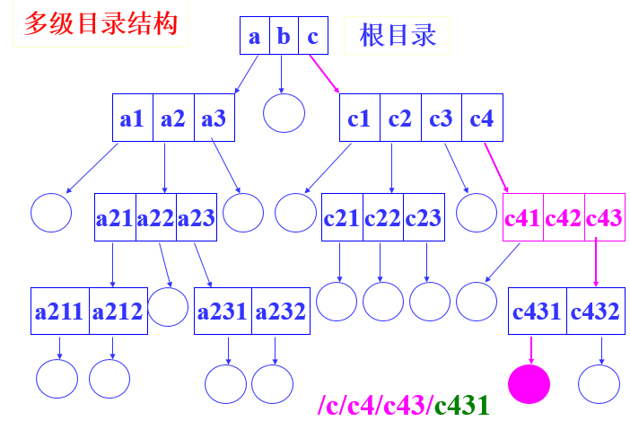

  优点：层次结构清晰，便于管理和保护，有利于文件分类，解决了重名问题，提高了检索速度，可控制存取权限

  缺点：需要多次访盘

  在树形目录结构下实现共享文件和目录的方法：

  - 软链接（符号链接文件）：创建新的目录项，存有指向另一个文件或目录的绝对路径名
  - 硬链接：在共享目录项中简单地重复被共享文件的信息

### 文件的逻辑结构

从用户观点出发看到的文件组织形式。与存储设备特性无关

文件的逻辑结构分为：

- 无结构的字节流式数据：由无结构的先后到达的相关字节组成
- 有结构的记录式文件：分为定长记录式文件和变长记录式文件


文件的存放方法：

- 顺序存取：按文件信息的逻辑顺序依次存取
- 直接存取（随机存取）：基于文件的磁盘模型，磁盘允许对任意文件块进行随机读和写。

变长记录文件通常是顺序存取，定长记录文件通常随机存取

### 文件的物理结构

文件在外存上的存放组织形式。与存储设备特性有关

物理块：把文件存储空间划分成若干大小相等的块。物理块是分配及传输信息的**基本单位**。一个物理块包括一个或几个连续扇区。

物理结构分为连续、链接、索引等

- 连续文件：文件内容连续存放。适合存储系统文件

  优点：简单，支持顺序存取和随机存取，存取速度快

  缺点：不灵活，必须先给出最大长度，且容易产生碎片

  

- 链接文件：不要求文件内容连续存放，把文件所占的物理块用链接指针连接起来

  优点：可解决外存碎片问题，提高利用率，允许文件动态增长

  缺点：只能按文件的指针链顺序存取，效率低

  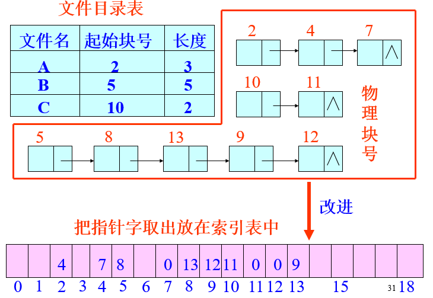

  可做出如上图所示改进，称该索引表为文件分配表（FAT），其长度为文件存储器可划分的块数，由于该表存放在主存，读取时随还需要沿链查找，但不需要再进入外存读取每一块的信息

- 索引文件：每个文件建立一张索引表，记录文件逻辑块号和物理块号之间对应关系

  访问文件时，先将索引表调入内存，若索引表长度超过一个磁盘块，需要建立**二级索引**

  优点：文件可动态修改；随机、顺序存取。
  缺点：索引表的使用增加了存储空间的开销；降低了文件的存取速度。

  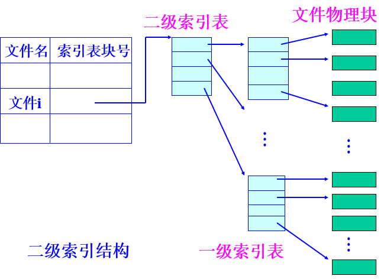

- 索引顺序文件：将顺序文件中的所有记录分成若干组，并为其建立索引表

 DOS系统的文件采用链接结构。

UNIX系统的文件采用多级索引结构。

Linux的Ext2采用多级索引结构。

Windows的NTFS采用索引顺序结构。

### 文件记录的组块与分解

一个物理块可以存放多个逻辑记录，一个逻辑记录可以放在多个物理块中

#### 记录的组块

把多个逻辑记录存放到一个物理块中，再物理块中存放的逻辑记录数叫块因子

先将记录写入主缓冲区，当缓冲区满时，再写磁盘

#### 记录的分解

使用记录时，先将包含该记录的物理块读入内存缓冲区，然后进行记录分解。

### 文件存储空间管理

常用方法有三种


#### 空白文件目录

系统为所有连续的空闲盘块区建立一张表，适合于文件的静态分配（连续结构）


#### 空闲块链表

将所有空闲块连接成一个链表，简单但工作效率低，分配和回收多个盘块时要多次访问磁盘才能完成。

改进为**空闲块成组链表**，UNIX系统采用这种方式

利用盘空闲块来管理盘上的空闲块，每个磁盘块记录尽可能多的空闲块成为一组，各组之间用指针链接

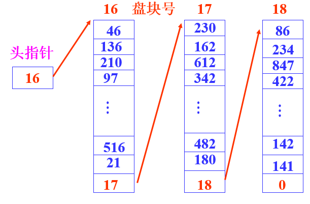

分配盘块时直接将第一组空闲块装入缓冲区

回收盘块时将盘块装入缓冲区，缓冲区满后取出并写入一个空闲块后置于链头

#### 位视图

是适合文件静态分配和动态分配的最简单方法

每一个二进制位对应一个物理盘块。为1时表示块已分配，为0时空闲。

Linux的ext2和Windows采用这种方式

### 常用文件操作命令

- 创建：在指定设备上为指定路径名的文件建立一个目录项，并设置文件的有关属性。

- 删除：根据文件的路径名找到指定的目录项，回收其占用的各个物理块，再将该目录项置为空。

- **打开**：建立进程和文件之间的联系

  找到文件FCB并录入内存，创建**文件对象**，文件对象记录了文件读/写位置指针、文件方法、共享进程数等信息

- **关闭**：切断进程与文件之间的联系

  释放文件在主存中的目录项，切断用户与文件的联系，若目录项或文件被修改过，则写回辅存

- 读：必须指出要读的数据个数，以及存放要读数据的主存地址

- 写：必须指出要写的数据个数，以及存放待写数据的主存地址

- 追加Append：将数据追加到文件尾

- 随机存取Seek：重定位读、写指针

- 得到文件属性Get_Attribute

- 设置文件属性Set_Attribute

- 重命名Rename

### 存取控制表ACL

应用于文件保护中，记录在文件FCB中

每一行为有序对（域，权集）

### 内存映射文件

存储器映射文件：将文件映射到进程私有地址空间的一个区域，返回起始虚地址，仅当**需要对文件存取时**，才传输文件数据。

存取机制类似于**请求页式虚存管理**，当访问的页不在主存时，产生**缺页中断**


## 设备管理

### I/O设备硬件组成

IO设备可分为：

- **字符设备**，以字符为单位传输数据，又叫人机交互设备，通信速度较慢
- **块设备**，以块为单位传输数据，又叫外部存储器，通信速度较快
- 网络通信设备
- 时钟

### 常用数据传输方式

#### 程序查询方式


由CPU执行程序完成I/O，CPU与设备完全**串行工作**，效率极低

#### 中断方式


CPU与设备可以**并行工作**

#### 直接存储器访问DMA方式

在正常情况下由**CPU**控制**地址总线**

引入DMA存储器，允许**DMA**接管地址总线，控制控制器内**数据缓冲区**与主存间进行数据交换，结构如下


DMA工作过程仅在数据传输开始和结束需要CPU干预

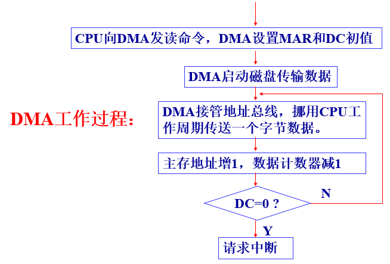

#### 通道控制方式

与DMA方式相比，通道是专用的**IO处理机**所需干预更少，且可以做到一个通道控制多台设备

### I/O软件层次

从底层到上层分为四层，主要功能为

- 中断处理程序
  - 进程在启动IO操作时阻塞，操作完成设备控制器产生中断
  - CPU响应中断，执行中断处理程序
  - 检查设备状态
  - 返回被中断进程，或转进程调度
- 设备驱动程序
  - 初始化设备
  - 启动设备例程
  - 中断处理例程
- 独立于设备的软件
  - 设备命名，将设备符号名映射到驱动程序
  - 设备保护
  - 提供与设备无关的块尺寸，向上层软件
  - 缓冲技术，以空间换时间，解决速度不匹配的矛盾
  - 负责设备分配和调度，根据**设备的使用方式**，可分为独占设备、共享设备、虚拟设备
  - 出错处理，实际上很多错误由设备驱动程序处理
- 用户层的IO接口：系统调用库函数

### 设备独立性

IO软件设计目标之一，是指用户及用户程序不受系统配置的设备类型和具体设备的台号的影响。用户只是使用**逻辑设备**，具体的映射由操作系统完成。

### 虚拟设备和SPOOLING技术

虚拟设备本身是**独占设备**，经过虚拟技术模拟改造成**共享设备**，供多个进程使用。

SPOOLING技术是实现虚拟设备的一种技术。它利用可共享的磁盘空间，来模拟独占的I/O设备。**以空间换时间**

以输出为例：进程要输出数据到设备时，系统不立刻为进程分配设备，而是将待输出的数据**缓存**，形成缓存队列，之后由Spooling系统一次一个将队列中的数据送往设备

### 磁盘信息编址方式

盘面号，磁道号，扇区号

柱面号，磁头号，扇区号

### 信息传输时间计算

寻道时间+旋转延迟时间+读写传输时间

通常寻道时间是磁盘访问最耗时的部分

### 常用磁盘调度算法

- 先来先服务FCFS
- 最短寻道时间优先SSTF：总是选择移动距离最短的磁道，总体未必最优
- 扫描法SCAN：磁头在一个方向上移动，访问所有未完成请求，直到到达最后的磁道，调换方向
  - 循环扫描法C-SCAN：仅在一个方向上扫描，扫描到终点后回到起点，比起SCAN请求等待时间更均匀，平均寻道时间更长
  - Look，扫描方向类似于SCAN，但只扫描到最后一个磁道访问请求位置就转向
  - C-Look，扫描方向类似于C-SCAN，处理同Look

## Linux进程管理

### 进程控制块（进程描述符）

PCB结构名：**task_struct**

关键字段

```c
struct task_struct
{
    pid_t pid;                          //进程标识符
    pid_t tgid;                         //线程组标识符
    struct thread_info *thread_info;    //指向当前进程基本信息结构
    struct thread_struct thread;        //进程硬件上下文
    struct signal_struct *signal;       //指向进程信号量
    struct mm_struct *mm;               //指向进程虚拟内存描述符，会在第8章用到
    struct file_struct *files;          //指向进程打开文件信息
    ……
}
```

#### thread_info

每个进程的**核心栈**和基本信息thread_info被存放在两个连续的页框（8kb）中，关系如下图所示


由于**esp**寄存器存放的是核心栈的栈顶指针，内核很容易从esp寄存器的值获得正在CPU上运行进程的thread_info结构的地址。进而获得进程描述符（PCB）的地址。

### 与进程创建有关的函数

- fork()：创建子进程，创建成功之后，子进程采用写时复制技术读共享父进程的全部地址空间
- vfork()：创建子进程，阻塞父进程直到子进程退出或执行了一个新程序为止。
- clone()：创建轻量级进程函数，实现对多线程应用程序的支持。共享进程在内核的很多数据结构

### 进程切换

进程切换只发生在**核心态**。在发生进程切换之前，用户态进程使用的所有寄存器值都已被保存在进程的**核心栈**中，切换前需将大部分寄存器值存放在PCB的类型为thread_struct的**thread**字段里，一小部分仍在核心栈中。

进程切换分两步：

- 切换**页目录表**以安装一个新的地址空间
- 切换**核心栈**和**硬件上下文**。由schedule()函数完成进程切换。

### 进程调度

系统采用**可抢先式的动态优先级调度方式**。

调度进程可分为：

- 先进先出的实时进程
- 时间片轮转的实时进程
- 普通的分时进程

实时进程的基本优先数为1～99，而分时进程和批处理进程的基本优先数为100～139。

### 内核线程

内核线程函数kernel_thread()

内核线程可处理一件特定的事情，其调度由内核负责，一个内核线程处于阻塞状态时不影响其他的内核线程，因为其是调度的**基本单位**。

#### 0号进程

实际上是内核**线程**，所有进程的祖先进程，又叫idle进程或swapper进程，每个CPU都有一个0号进程

#### 1号进程

是由0号进程创建的内核进程init，负责完成内核进程**初始化**工作

在系统关闭前一直存在，负责创建和监控操作系统外层执行的所有**用户态**进程

## Linux存储器管理

### 进程地址空间

对于x86下的linux系统，每个进程地址空间为4GB，其中进程**私有地址**空间为**用户空间**，占前3G，进程**公有地址**空间是**内核虚地址空间**，占后1G

- 前3G，进程私有空间
- 后1G，内核虚空间，只有核心态进程可以寻址
  - 前896M，映射物理内存前896M
  - 后128M，对超过896M的进程进行映射

总体划分如下图所示

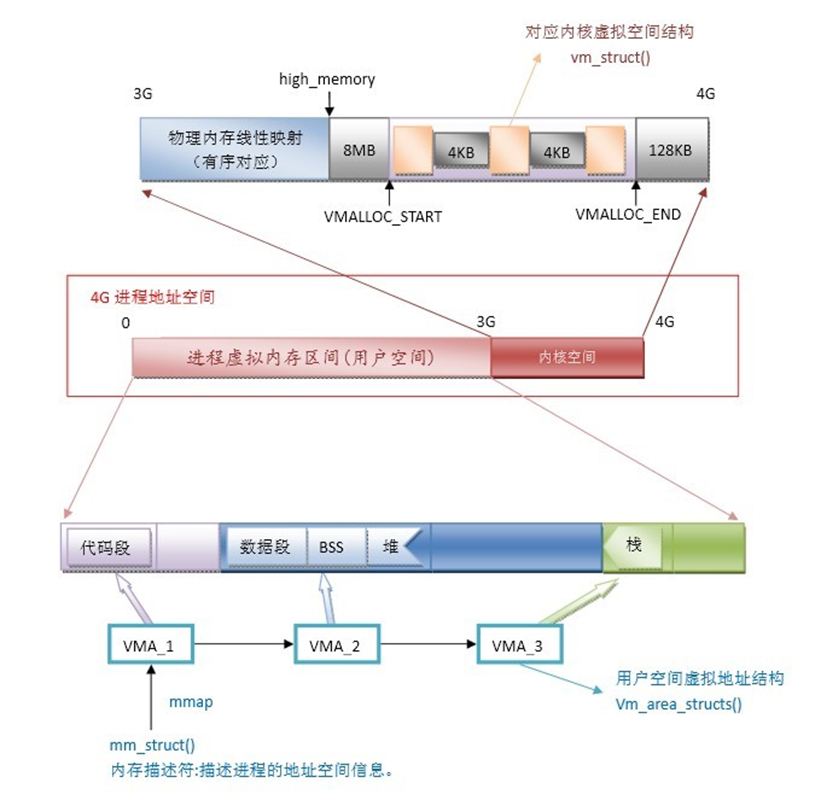

#### 进程虚拟内存区域

使用一组结构体**vm_area_struct**描述进程地址空间使用情况

```c
struct vm_area_struct {
	struct mm_struct * vm_mm;               //指向所属的虚拟内存描述符，之后说明
	unsigned long vm_start;                 //起始地址
	unsigned long vm_end;                   //结束地址
	struct vm_area_struct  *vm_next;        //单链表结构，指向下一vm_area_struct
	struct rb_node  vm_rb;                  //红-黑树
	struct file * vm_file;                  //映射文件时指向文件对象
	……
}
```

所有vm_area_struct结构体通过指针vm_next连接在一起，形成**单链表**结构

当进程的虚拟内存区数量变得很大时，单链表形式变得低效，引入**红黑树**结构

红黑树是平衡二叉树，若具有n个节点，其高度不会超过2*log(n+1)

#### 虚拟内存描述符

mm_struct管理进程地址空间中**所有**保留的虚拟内存区域的结构体，通过进程描述符task_struct的mm指针字段指向

```c
struct mm_struct {  
	struct vm_area_struct *mmap;         /*指向虚拟内存单向表表头*/ 
	struct rb_root  mm_rb;  			/*指向红-黑树的根*/
	pgd_t  *pgd;                   	 	 /*指向页目录表*/
	atomic_t mm_users;	 			    /*次使用计数器*/
	atomic_t mm_count; 	 			    /*主使用计数器*/
	struct list_head mmlist;             /*双向链表*/
	unsigned long start_code, end_code;  /*可执行代码所占用的地址区间*/
	……};
```

- mm_users记录**本进程内**共享mm_struct的轻量级进程数，mm_count记录**其他进程**对mm_struct的引用情况
- mm_struct的pgd为指向进程页目录表的指针
- vm_area_struct的vm_file为指向临时文件对象的指针

整体进程虚拟内存管理结构如下图所示


### 堆的管理

每个进程中都有的特殊虚拟内存区域，用于满足进程动态内存请求

在虚拟内存描述符中，start_brk字段指定堆的**起始地址**，brk字段指定堆的**结束地址**

- malloc(size)：请求大小为size字节的动态内存
- free(addr)：释放malloc分配的起始虚地址为addr的内存区

当用户态进程请求动态内存时，系统不立刻分配物理内存，而是先分配新的内存区域，当产生缺页中断时再分配

### 物理内存管理

页框大小为4KB，所有叶匡描述符**page**存放在**mem_map**数组中。页框0由BIOS使用

页框描述符结构如下

```c
struct page {
	unsigned long flags;           /*页框状态标志*/
	atomic_t  _count;	           /*页框的引用计数*/
	atomic_t  _mapcount;           /*对应的页表项数目*/
	unsigned long private;         /*空闲时由伙伴系统使用*/
	struct address_space *mapping; /*用于页高速缓存*/
	pgoff_t  index;                /*在页高速缓存中以页为单位偏移*/
	struct list_head lru;          /*链入的活动页框链表或非活动链表*/
	void *virtual;                 /*页框所映射的内核虚地址*/
}; 
```

页框描述符由内存描述符zone来管理，zone对应内存管理区，结构如下

```c
struct zone {  
	unsigned long  free_pages;  
    /*空闲页框数*/
	struct per_cpu_pageset  pageset[NR_CPUS]; 
    /*每CPU页框高速缓存,以满足CPU对单个页框的请求*/
	struct free_area  free_area[11]; 
	/*伙伴系统中的11个空闲页框链表*/
	struct list_head active_list;   
    /*活动页框链表，存放最近正被访问的页框*/
  	struct list_head inactive_list; 
    /*非活动页框链表，存放最近未被访问的页框*/
    spinlock_t lru_lock;
    /*自旋锁*/
	…….
};
```

Linux将内存划分为3个管理区

- ZONE_DMA：包含低于16MB的常规内存页框。
- ZONE_NORMAL：包含高于16MB且低于896MB的常规内存页框。
- ZONE_HIGHMEM：包含从896MB开始的高端物理页框。内核**不可直接访问**

#### 伙伴系统

Linux使用伙伴系统管理连续的空闲内存页框

将空闲页框组织成11个链表，分别链有大小为1，2，4，8，16，32，64，128，256，512和1024个**连续**空闲页框的**块**。 

整体结构如下图所示，private字段对应为2的x次方数量的连续页框，lru为双向指针结构体

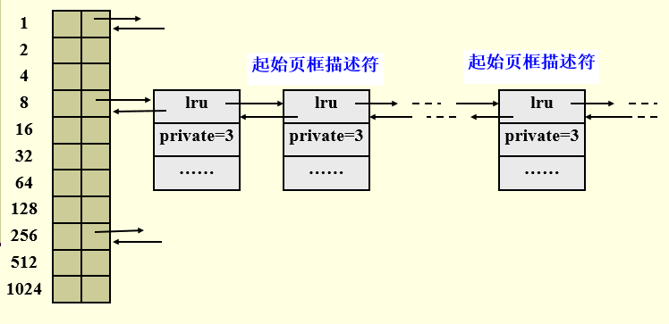

分区页框分配器分配页框过程（假设请求具有8个连续页框的块）：

- 先在8个连续页框块链表中查找是否有
- 如果没有，就在16个连续页框块的链表中找
- 如果依旧没有，在更大的链表中找直到找到

### slab管理

slab分配器为只有几十或几百个字节的小内存区分配内存，通常是各类**对象的描述符**

slab分配器从**页框分配器**获得几组连续空闲页框

slab为不同对象生成不同的**高速缓存**，以减少内存分配、初始化等的代价，当进程不需要该对象时，会将该对象放入高速缓冲区

每个高速缓存由一串slab构成，每个slab包含若干同类型的对象


### 地址转换

采用**二级**页表模式，每个进程都有一个页目录表，页表直到**访问该表中的页**时才建立

虚地址结构与地址转换过程


页表项包含的字段主要包括

| 字段               | 说明                                                     |
| ------------------ | -------------------------------------------------------- |
| Present标志        | 为1，表示页（或页表）在内存；为0，则不在内存。           |
| 页框物理地址(20位) | 页框大小为4096，占去12位。20+12=32                       |
| Accessed 标志      | 页框访问标志，为1表示访问过                              |
| Dirty标志          | 每当对一个页框进行写操作时就设置这个标志，之后要写回外存 |
| ……                 | ……                                                       |

#### 请求调页

当进程要访问的页不在内存时需要将页调入内存

页面置换策略是**最近最频繁使用算法LFU**

所缺页可能存放处

- 该页从未被进程访问过
- 该页已被进程访问过，但内容被保存到外存磁盘交换区上
- 该页在非活动页框中
- 该页在由其他进程进行I/O传输过程中

### 盘交换区空间管理

盘交换区由一组大小为4KB的**页槽**组成

内核尽力把换出的页存放在相邻的页槽中，减少访问交换区时磁盘的寻道时间。

## Linux文件系统

### Ext2文件卷

#### 文件卷布局

Ext2将磁盘块分为**组**，每组包含存放在相邻磁道的数据块和索引节点，组块大小相等且顺序安排

Ext2用“**块组描述符**”来描述块组本身的结构信息，同时将超级快和所有块组描述符重复存储于每个块组中，

Ext2用**位图**来管理每个块组中的磁盘块和索引节点


**引导块**用以读入并启动操作系统，只有**根文件系统**引导块才起作用

块组结构组成参考如下：

- 超级块：存放整个文件卷的资源管理信息（注意是文件卷而不是块组）
- 块组描述符：每个块组用一个块组描述符来记录结构信息
- 数据块位图：记录**文件数据区**盘块使用情况
- 索引节点位图：记录**索引节点区**各索引节点使用情况
- 索引节点区：索引节点存放文件的管理和控制信息
- 文件数据区：存放普通文件和数据文件

超级块和所有块组描述符**重复存放**于每个块组中，但只有**块组0**中的超级块和块组描述符由内核使用

#### 文件目录与索引节点结构

将文件目录项分成**简单目录项**和**索引节点**

简单目录项包含了文件名和索引节点号等字段，具体结构如下

```c
struct ext2_dir_entry_2{
__le32  inode;    //   索引节点号，为0表示已被删除
__le16  rec_len;  //  目录项长度，若下一目录项为0则需要在该处加上下一目录项的长度
__u8   name_len;  //实际文件名长度
__u8  file_type;  //   文件类型
char  name[255];  //文件名是4B的整数倍，变长数组
}
```

注意文件目录项是变长的，目录文件如下例所示，可以看到目录项长度不固定，inode为0表示该节点被删除，上一目录项的长度需要加上该目录项的长度

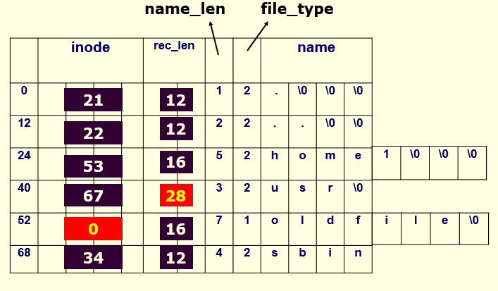

索引节点结构大小为128字节，存放在索引节点区，通过多条路径**共享**信息文件时，只保留一个索引节点（硬链接）

具体结构如下所示

```c
struct  ext2_inode {
__le16  i_mode;     //文件类型和访问权限
__le16  i_uid;         //拥有者的标识符
__le32  i_size;        //以字节为单位的文件长度
__le16  i_gid;         //组标识符
__le16  i_links_count;   //硬连接计数，为0前不可删除
__le32  i_block[15];      //	索引表，15×4B
__le32  i_blocks;         //  文件的数据块数
__le32  i_file_acl;       //   文件访问控制表ACL
……}； 
```

索引表为**四级**索引结构，是一个有15个元素的数组，每个元素占4B，元素共有4种类型（假设盘块占b个字节）

- 0-11索引是**直接索引项**，给出文件最初12个逻辑块对应的物理块号
- 12索引是**一次间接**索引块，对应文件逻辑块号从12到(b/4)+11
- 索引13是**二次间接**索引块，对应文件逻辑块号从(b/4)+12到(b/4)^2+(b/4)+11
- 索引14是**三次间接**索引块，对应文件逻辑块号从(b/4)^2+(b/4)+12到(b/4)^3+(b/4)^2+(b/4)+11


软链接（符号链接）与硬链接的区别

- 软链接：用软链接文件保存链接文件的绝对路径，当链接文件路径名小于60字符时存放在索引表i_block[]种，当大于60时，用单独数据块保存
- 硬链接：索引节点只存在一个，所有目录项inode指向同一索引节点

部分**特殊文件**，比如设备文件、管道文件、套接字文件，信息直接存放在索引节点中，**无需数据块**

整体文件卷结构如下图所示


分区>块组>索引节点>索引表>物理块

### 虚拟文件系统VFS

VFS引入了一个**通用的文件模型**，可表示其支持的所有文件系统，其涉及的所有数据结构在系统运行时才在内存建立，在磁盘中不存储，其与具体文件系统关系如下图所示

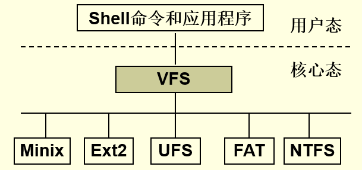

主要包含4个数据对象

- 超级块对象super_block：每个文件系统都有一个
- 索引节点对象inode：一个索引节点对应打开的磁盘上的文件
- 目录项对象dentry：代表目录项，存放目录项与索引节点的连接信息
- 文件对象file：记录进程与打开的文件之间的交互信息

对象之间关系如下


超级块对象：

```c
struct super_block { P205
	struct list_head s_list;         //VFS系统超级块双向链
	struct file_system_type *s_type; //系统类型指针
	struct super_operations *s_op;   //超级块方法指针
	struct dentry *s_root;           //根目录的目录项对象
	struct list_head s_inode;        //索引节点链表
	struct list_head s_files;        //文件对象链表
	void *s_fs_info;                 //指向一个具体文件系统的超级块结构    
……}
```

索引节点对象：

```c
struct inode { 
	unsigned long  i_ino;      //磁盘索引节点号
	atomic_t  i_count;         //  该对象的引用计数
	nlink_t  i_nlink;          //      硬链接计数
	struct inode_operations *i_op; //索引操作
	struct address_space *i_mapping; //地址映射
	……}
```

目录项对象：

```c
struct dentry {  P212
	atomic_t  d_count;          //引用计数
	struct inode *d_inode;      //指向inode对象
	struct dentry *d_parent;    //指向父目录项对象
	struct list_head d_alias;   //属于同一inode的dentry链表
	struct dentry_operations *d_op;   //方法
    /*无磁盘映像*/
……}
```

文件对象：

```c
struct file {  P212
	struct list_head f_list;         //文件对象链表
	struct dentry *f_dentry;         //指向目录项对象
	atomic_t f_count;                //该对象的引用计数
	loff_t  f_pos;                   //文件的当前读写位置
	struct file_operations *f_op;
	struct address_space *f_mapping; //映射
……}
```

当进程需要打开文件，需要以下几个相关的数据结构

```c
struct tast_struct{
	……
	struct files_struct *files; //指向进程打开文件信息
…}

struct files_struct {  P213
	struct file **fd;      //指向文件对象指针数组
	struct file *fd_array[ ]; //文件对象指针数组
	……}

```

每个进程最多可同时打开1024个文件，打开文件过程如下

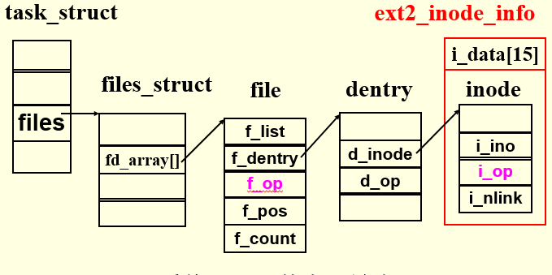

更详细过程可参考书上图10.2

#### 文件系统的注册与安装

注册分两步：

- 生成file_system_type对象，插入文件系统类型链表
- 调用register_filesystem()完成注册

安装需要通过mount函数实现，将文件系统安装到**根文件系统**的某个**目录节点**上，将安装点与被安装文件系统信息保存在已安装文件系统描述符vfsmount结构中，形成**链式安装表**

```c
struct vfsmount {
	struct dentry *mnt_mountpoint; 
		/*指向安装点的目录项对象*/
	struct dentry *mnt_root;
		/*指向被安装文件系统的根目录*/
	……
}
```

安装表功能是保存已安装文件系统描述符

## Windows操作系统模型

### Windows体系结构

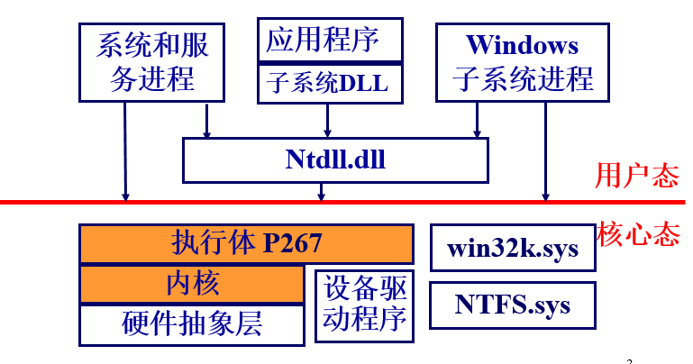

系统分为两种状态，**用户态**与**核心态**

- 用户态进程只能运行在受保护的地址空间，四种类型的用户态进程都有各自私有地址空间
- 核心态系统服务组件运行在统一的核心地址空间

### 硬件抽象层HAL的作用

直接操纵硬件，对上层隐藏于硬件有关的细节，使上层免受特殊硬件平台的影响。系统可移植性好

### Windows系统组件的基本机制

- 陷阱调度，包括中断、延迟过程调用、异步过程调用、异常调度和系统服务调度
- 执行体对象管理器
- 同步，包括自旋锁、内核调度程序对象等
- 本地过程调用LPC

重点会在之后详细介绍

### 陷阱调度

#### 陷阱处理程序

是处理意外事件的硬件机制，该模块接收**中断**和**异常**，检测类型并将控制转交给处理相应情况的代码

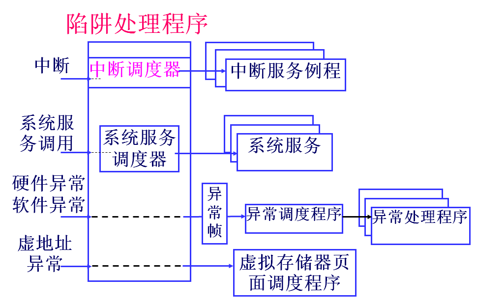

#### 中断调度

中断调度程序会将中断映射到**中断优先级**上，不同于线程调度优先级，中断优先级IRQL是中断源的属性


主要中断分为硬件中断和软件中断，软件中断分为延迟过程调用DPC和异步过程调用APC

#### 延迟过程调用DPC

有时内核在进行**系统嵌套调用**时，检测到应该进行线程调度。为了保证调度的正确性，内核用DPC来**延迟调度**的产生。

- 当需要同步访问共享的内核结构是，内核将处理机的IRQL提高到**大于等于DPC级**
- 检测到线程调度应该发生时，请求DPC级的中断，而处理机会**保存**该中断到**DPC队列**
- 内核完成前后活动后，将IRQL降到低于DPC，调度中断即可发生，依次执行DPC队列中的每个例程

DPC对象是内核控制对象，主要包含需调用的**系统函数地址**，DPC队列保存DPC例程

DPC主要为设备驱动程序和普通用户线程提供

#### 异步过程调用APC

APC为用户程序和系统代码提供了一种在特定用户线程环境中执行代码的方法。非常适合于**异步通知**事件

每个**线程**都有自己的**APC队列**，由内核管理，当线程被调度时，其APC会被依次执行

### 对象管理器

对象是一种**内核数据结构**，又对象管理器管理

#### 对象结构

分为**对象头**和**对象体**，结构如下

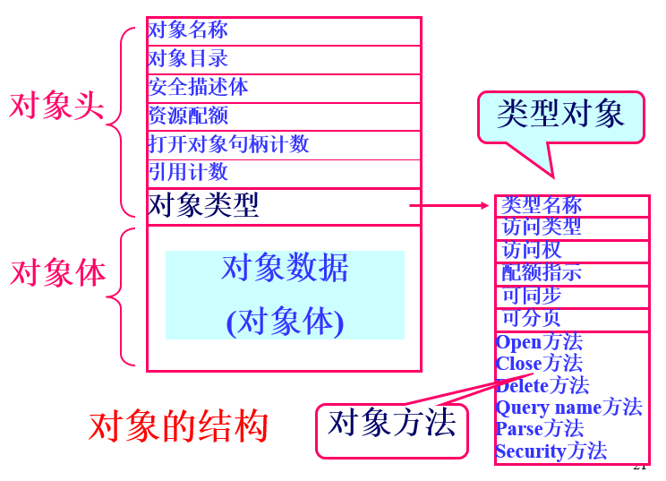

- 对象管理器控制对象头
- 各执行体组件控制对象体

#### 类型对象

存储特定类型对象**公共属性**的对象，windows支持31种类型对象

类型对象将所有同类型对象链接在一起，链接结构示例如下


对象也可以分为两种

- 内核对象：由内核实现的一个初级对象集，对用户态代码不可见，仅供执行体使用。
- 执行体对象：执行体各类组件实现的对象，如各类执行体组件，绝大多数封装了一个或多个内核对象

#### 管理对象

通过**对象名**创建对象，打开对象，返回**对象句柄**，放入**进程句柄表**中，然后使用存储在类型对象中的**对象方法**进行操作

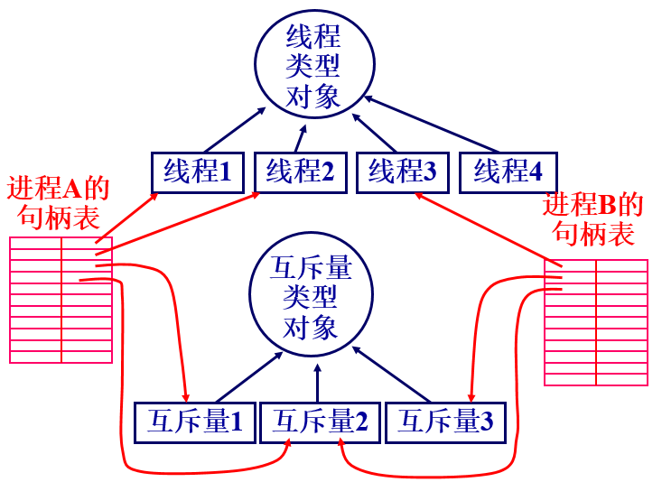

### 对象的同步

#### 内核同步

引入**自旋锁**实现多处理机互斥访问内核临界区

拥有自旋锁的线程不被剥夺处理机

#### 执行体同步

执行体组件需要同步访问全局数据结构，执行体提供了**用户态**的同步机制

**调度程序对象**，包括进程对象、线程对象、事件对象、信号量对象、互斥体对象、可等
待的定时器对象及文件对象等

每个同步对象有两种状态：“有信号”或“无信号”  

#### 线程实现等待同步对象的操作

线程程通过等待一个对象的句柄可以与调度程序对象同步 ，可使用**对象管理器**提供的WaitForSingLeObject 和 WaitForMultipleLeObject 

- 内核将线程挂起并把他的状态从运行态改变为等待态，且排列到等待对象的线程队列中  
- 线程一直处于等待状态，直到所等待的程序调度对象从有无信号状态变为有信号状态
- 内核将线程由等待态改为就绪态  

## Windows进程和线程管理

### 进程和线程

进程的特点：

- 对应一个可执行程序
- 具有一个独立的地址空间
- 可有多个线程

线程的特点

- 有一个线程标志
- 有一组代表CPU状态的寄存器
- 两个堆栈，分别在用户态和核心态时使用
- 一个私有的存储器域

进程对象的数据结构：执行体进程块EPROCESS，内核进程块KPROCESS

线程对象的数据结构：执行体线程块PTHREAD，内核线程块KTHREAD

#### 进程的创建

CreateProcess调用，创建新进程和其主线程

- 打开可执行文件，创建区域对象，建立可执行文件与虚拟内存间的映射关系
- 创建执行体进程对象EPROCESS
- 创建主线程
- 将进程和线程句柄通知Win32子系统，进行初始化
- 完成地址空间初始化，开始执行程序

线程的创建

CreateThread调用

- 在进程的地址空间为线程创建用户堆栈
- 初始化线程的CPU硬件描述表
- 调用NtCreateThread创建执行体线程对象，填写有关内容，并将线程置为挂起状态，返回线程标志和对象句柄

### 线程调度

基于**优先级**的**抢先式**的多处理器调度系统，优先级相同时按时间片轮转。

#### 优先级

进程优先级（由低到高）：

- 空闲优先级4：空闲状态执行的程序，比如屏保
- 普通优先级7-9：能升高或降低普通进程优先级
- 高优先级13：只在需要时使用，比如任务管理器
- 实时优先级24：核心态系统程序

线程优先级具有基本优先级和当前优先级，系统根据**当前优先级**调度

- 空闲优先级，0，仅用于系统0页线程
- 可变线程优先级，共15个，1-15
- 实时线程优先级，共16个，16-31

#### 线程的状态

- 就绪状态：除了处理机之外所有资源均已分配，等待获取处理机
- 备用状态：已选择好执行的处理机，等待描述表切换
- 运行状态
- 等待状态
- 传输状态：类似于就绪，但在等待时，核心栈被调到外存，核心栈调回主存时，线程就绪
- 终止状态：执行完成
- 初始化状态：正在创建过程中的线程状态

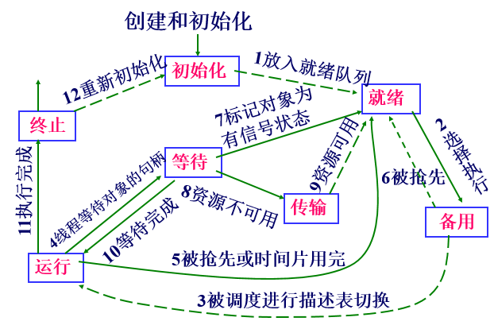

#### 线程调度程序的数据结构

- 32个就绪队列：每个优先级对应一个
- 32位掩码的就绪位图：每一位指示一个优先级就绪队列中是否有线程等待运行。
- 32位掩码的空闲位图：每一位指示一个处理机是否处于空闲状态。

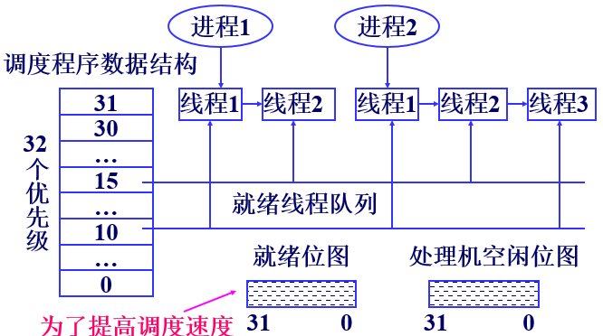

#### 线程优先级的提升时机

- IO操作完成的线程
- 信号量或事件等待结束的线程
- 前台进程中的线程完成了一个等待操作，改善交互性
- 由于窗口活动唤醒的GUI线程
- 线程处于就绪状态超过了一定时间（处理机饥饿）

## Windows存储器管理

### 进程虚拟地址空间

在32位系统的地址空间上，用户进程占4G虚存空间，低2G为用户的私有地址空间，高2G为进程的共有操作系统空间

#### 进程私有地址空间数据结构

采用段页式虚拟内存管理，采用两种描述方式，每种都对应一个数据结构

- 虚拟地址描述符VAD

  当线程要求分配一块**连续虚存**时，建立一个VAD结构，进程所有VAD结构形成**自平衡二叉树**，便于快速查找。VAD记录该地址空间相关信息，包括被分配的地址段、存取保护、共享或私有以及是否可继承

  注意，页表不会在请求分配时立即建立，而是在访问页时才建立

  

- 区域对象

  又称为**文件映射对象**，是一个可被多个进程**共享**的存储区，可以映射到**磁盘上的文件**，主要作用有：

  - **执行体**利用区域对象将映像装入主存，访问该文件就像访问主存数组，无需直接读写操作
  - **高速缓冲管理器**使用区域对象访问被缓冲文件中的数据
  - **进程**使用区域对象将**大于**进程地址空间的文件映射到进程地址空间，访问该文件就像访问数组

  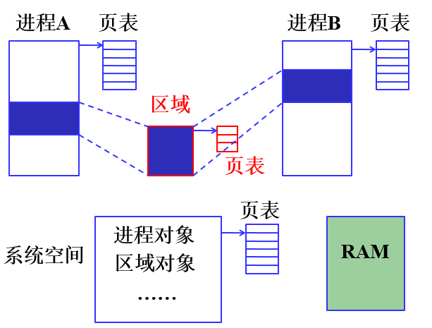

#### 虚存内存区域的分配

私有地址空间的地址域可能有三种状态

- 空闲
- 被保留：已预留虚存，未分配物理主存
- 被提交：已分配物理主存或交换区

分配主存时，可以先保留地址域，后提交物理主存；也允许保留和提交同时实现。

### 地址转换

采用二级页表结构，页目录表和页表，两者结构相同


32位虚拟地址被划分为3部分，其转换过程如下所示

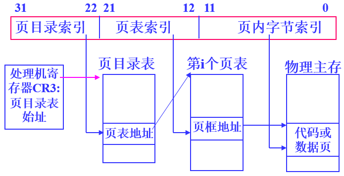

### 页框数据库

存储管理器用页框数据库PFN来跟踪物理内存的使用情况，是**一个数组**，每一项记录八种状态：

- 活动（有效）：进程工作集的一部分
- 转换：不在工作集中，内容还未被破坏，正在IO操作
- 备用：之前属于工作集，现在不属于的尚未被修改的页，
- 更改：之前属于工作集，现在不属于且被修改的页，但尚未修改磁盘
- 更改不写入：类似于更改，但不会修改磁盘
- 空闲：不属于任何一个用户进程，空闲
- 零初始化：页空闲，且已被**零页初始化线程**初始化
- 坏页框

页框状态转换图

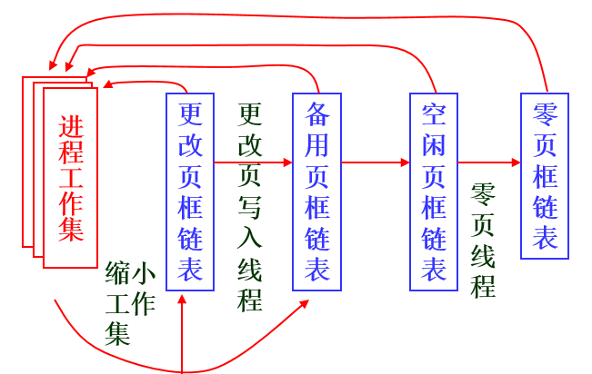

#### 原型页表项

当页框被两个或多个进程**共享**，存储管理器依靠**原型页表项PTE**映射

### 页调度策略

几个概念：

- 进程工作集：进程正在使用的物理页面的集合。
- 系统工作集：为可换页的系统代码和数据分配一定数量的页框。
- 平衡工作集管理器：一个系统线程，调整进程和系统工作集

策略

- 调页策略：将所缺页以及前后一些页装入贮存，局部性原理
- 置页策略：将页置于物理主存何处
- 置换策略：
  - 在多处理器系统中，采用**局部先进先出**置换策略
  - 在单处理器系统中，为**最近最久未使用策略LRU**

## Windows文件系统

### 概述

Windows支持FAT和NTFS文件系统

- 支持的FAT包括FAT12、FAT16、FAT32，数字表示描述磁盘块簇地址使用的位数
- NTFS规定可使用64位表示簇地址，但限制用32位

### 虚拟簇号和逻辑簇号

逻辑簇号**LCN**：FAT和NTFS将卷划分成若干簇，并进行编号

虚拟簇号**VCN**：NTFS支持的文件的物理结构是索引式的，通过**索引表**建立文件的VCN与磁盘LCN进行映射

### NTFS文件系统

NTFS文件卷结构如下图所示


- 分区引导扇区最多占用16个扇区，包含卷布局、文件系统结构以及引导代码等信息

- 主控文件表**MFT**是NTFS卷的管理控制中心，包含了卷上所有文件、目录以及空闲簇的管理信息

  MFT由若干记录构成，记录大小固定为**1K**，每个记录描述一个文件或目录

  前16个记录是为NTFS元数据文件保留，每个元数据文件有一个以“$”开头的文件名

- 文件数据区

NTFS文件物理结构：**索引顺序结构文件**

对于大目录，MFT记录没有足够空间保存，采用**B+树**，使查找特定文件访盘次数减到最小。大目录文件的索引根属性包含B+树的第一级并指向包含下一级的索引缓冲区。