# 汇编语言与接口设计

选择题：60分，单选（1×40+2×10）

编程题：15分，难度类似字符串比较

大题：

- 一题定时器、计数器8254、8259
- 保护模式下的存储管理


- 第一章

  带宽、逆序存放

- 第二章*

  保护模式下的寄存器组、分段管理、分页管理

- 第三章

  3.1

  3.2 数据传送指令mov

  p84-87 push pop in out L1A

  p88 二进制加法

  p89

  p92 无符号惩罚

  p94 无符号除法

  95表3-3 表3-5

  3.3.1

  3.3.2

  3.3.3

  3.3.4

  p111 表3-11

  113、114 两个例子

- 第四章

  浮点运算几个概念

- 第五章

  子程序、反汇编、参数传递方式

  到5.5为止

- 第6章

  概念性

- 第7章

  

- 第8章

- 第9章


## 微型计算机硬件系统

### 微处理器及其性能指标

速度指标

- 外频：指总线的工作频率
- 倍频
- 主频：主频=外频×倍频

前端总线是指处理器南桥北桥之间的总线，数据带宽=总线频率×数据位宽/8

### 内存

内存存放当前正在执行的程序和使用的数据，CPU可直接存取，断电后内容丢失

存储器容量：以Byte为单位，KB/MB/GB/TB/PB/EB

- 字节：内存存取信息的基本单位
- 字：
- 双字

#### 存储器访问

内存物理地址以字节为单位，对于字、双字等数据类型，在访问时只需要给出最低单元的地址号，依序存取后续字节即可。

采用**逆序存放（little endian）**方式，低地址中存放低字节数据，高地址中存放高字节数据。在没有特殊说明的情况下，均使用逆序存放方式。

## 微处理器管理模式

### CPU工作模式

从80386开始，32位CPU具有3种运行模式

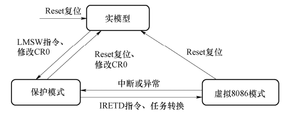

- 实模式

  CPU被复位（加电）时自动进入实模式，在实模式下，等同于16位8086处理器，**DOS操作系统**运行在实模式下

  - 使用1MB地址空间和16位“段首址：偏移”地址格式

  - 不支持硬件上多任务切换，不支持特权级，可执行所有特权命令

- 保护模式

  通过修改控制寄存器CR0的控制位PE实现实模式到保护模式的切换。linux、windows运行在保护模式下

  - 支持内存分页机制，提供段式和页式内存管理

  - 支持多任务和特权级，共有**4个特权级**，最高为0（操作系统），最低为3（应用程序）
  - 物理寻址空间达到4GB

- 虚拟8086模式

  又称V86模式，是为了在Windows、linux中执行Dos程序设计的，是经过"修改"的保护模式

  - 寻址方式与实模式相同
  
  在保护模式下，如果标志寄存器VM位被设置为1，则转换为虚拟模式，并且

### 寄存器

可分为

- 程序可见寄存器组：汇编语言程序员在设计应用程序时可以使用的寄存器
- 程序不可见寄存器组：应用程序设计不能直接使用，但系统程序或系统运行程序期间可能要用到的寄存器

#### 程序可见寄存器组

汇编语言程序员在设计应用程序时可以使用的寄存器

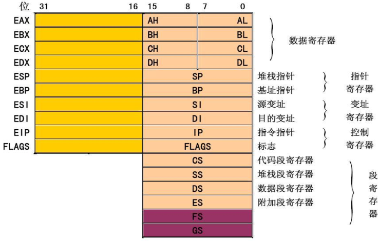

- 通用寄存器

  - 数据寄存器

    - 8位：  AL/AH BL/BH CL/CH DL/DH 
    - 16位：AX       BX        CX       DX
    - 32位：EAX      EBX    ECX     EDX

    部分特殊用途

    - AX：累加器，乘法除法等运算指令专用寄存器
    - BX：可做基址寄存器
    - CX：循环计数器
    - DX：乘法除法等运算指令专用寄存器

  - 指针寄存器

    - 堆栈指针：存放当前堆栈段堆栈顶偏移量，不可随意修改

      实模式使用SP；保护模式使用ESP；

    - 基址指针：存放地址的偏移量部分

      实模式使用BP；保护模式使用EBP；

  - 变址寄存器：存放地址偏移量部分或数据

    实模式使用SI、 DI；保护模式使用ESI、 EDI；

- 段寄存器：用于确定一个存储段在内存中的起始地址，存放的是当前正在运行程序的**段选择符**

  - 代码段寄存器CS
  - 堆栈段寄存器SS
  - 数据段寄存器DS
  - 附加数据段寄存器ES

- 标志寄存器

  注意：在程序中不能直接引用控制寄存器名。  

  - 指令指针寄存器IP/EIP

    与CS段寄存器配合指出下一条要执行指令的地址，其中存放**偏移量部分**。  

  - 标志寄存器FLAGS/EFLAGS） 

    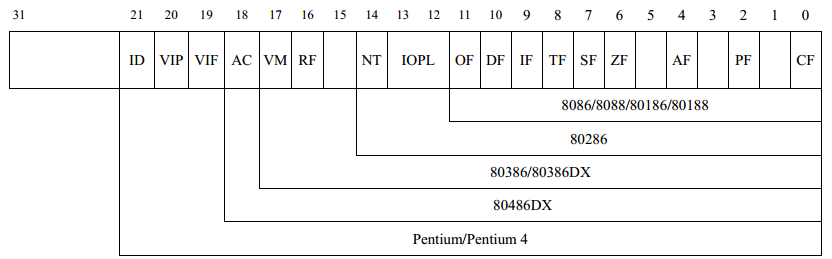

    - CF：进位标识符，用于检测**无符号数运算是否进位**
    - PF：奇偶标识符，记录计算结果最低8位中含1的个数（偶数为1）
    - AF：辅助进位标识符，检测运算结果最低4位溢出情况，用于十进制算数运算指令
    - ZF：零标志，运算结果为0时为1
    - SF：符号标志，运算结果为-时为1
    - TF：陷阱标志，用于程序调试，为1表示CPU处于单步方式
    - IF：中断允许标志，为1表示允许响应（INTR）
    - DF：方向标志，为1时串操作自动减址，为0时自动增址
    - OF：溢出标志，**带符号运算**超出了表示范围
    - IOPL：占两位，表示IO特权级，只有特权级高于IOPL的程序才可以执行IO指令
    - NT：只用于**保护模式**，为1表示当前任务嵌套在别的程序中
    - RF：在程序调试时使用
    - VM：为1时表示工作在v86模式，只能通过任务切换置位
    - AC：地址对齐检查标志，为1时进行检查
    - VIF：虚拟中断标志
    - VIP：虚拟中断挂起标志
    - ID

#### 保护模式下的寄存器

- 全局描述符表寄存器GDTR

  可被所有任务访问，GDTR存储了**全局描述符表GDT**在内存中的基址（32位线性地址）和限长（16位）

  可通过**LGDT指令**将描述符表起始位置装入GDTR

  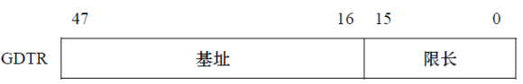

  全局描述符表GDT：用于定义全局存储空间，最多含8192个**段描述符**，位于存储器中，**唯一**

- 中断描述符表寄存器IDTR

  

  中断描述符表IDT：保存**中断门描述符**，做多含256个门描述符，门描述符含8个字节，指出中断服务程序的入口

注意GDTR和IDTR的值必须在进入保护模式之前装入，可使用LGDT和LIDT指令装入

- 局部描述符表寄存器LDTR

  16位寄存器，包含**LDT描述符在GDT中的索引**

  局部描述符表LDT，每个任务都有自己的局部描述符表，其中只含有与该任务相关的段描述符

- 任务寄存器TR

  在保护模式任务切换机制中使用，是16位选择符，在GDT中根据索引值选中TSS描述符

- 任务状态TSS

  每个任务都有自己的任务状态段，任务状态TSS在存储器的及地址和限长由TR指出，存放在GDT中

- 段选择符

  在保护模式下，段寄存器的内容是段选择符，这是一个索引值，可以从GDT或LDT中找到8字节的段描述符

  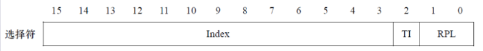

  - RPL：请求特权级，表示将要访问的段的特权级
  - TI：表指示符，为0时从GDT中选择，为1时从LDT中选择
  - Index：索引

- 控制寄存器CR0-CR3

### 内存管理

采用分段和分页结合的方式实现内存管理

#### 实模式下的分段管理

内存单元地址通过段基地址和偏移量两个逻辑地址来描述——“段基址：偏移量”

物理地址计算方式为：10H×段基址+偏移量

#### 保护模式下的分段管理

CS：EIP

- CS中存放16位段选择符，RPL与地址转换无关
- EIP存放32位偏移量
- 可认为虚拟地址空间为2^46

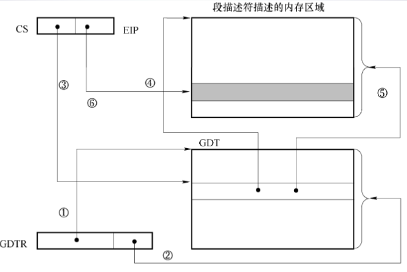

几个概念

- 段描述符

  用于描述代码段、堆栈段、数据段，位于GDT或LDT中，占8个字节

  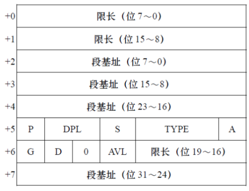

  - 段基址：32位
  - 限长：20位
  - 访问权限：8位
    - P：存在位，为1表示已经装入内存
    - DPL：描述符特权级，取值为0-3
    - S：描述符类型位，为0时表示是系统段描述符
    - E：可执行位，为1时表示是代码段后两位为C和R；为0时表示时数据段或堆栈段，后两位为ED和W
    - C：代码段特有，一致位，为1时表示是一致代码段
    - R：代码段特有，读允许位，为1时表示读允许
    - ED：数据段或堆栈段特有，扩展方向位，为1表示地址从高到低扩展
    - W：数据段或堆栈段特有，写允许位，为1表示允许写入
    - A：访问位，为1表示被访问过
  - 属性：4位
    - G：粒度位，为1时表示限长以页为单位，为0表示以字节为单位
    - D：默认操作数宽度，为1表示32位数据操作段，为0表示16位
    - AVL：可用位

- 段的地址转换

  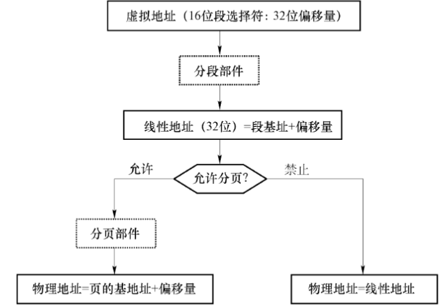

  - 虚拟地址

    程序指令中使用的地址，由段、偏移两部分组成

  - 线性地址

    线性地址为32位

    同一虚拟地址可能得到不同的线性地址

  - 物理地址

    物理地址是微处理器引脚输出的地址信号，CPU分页部件负责线性地址和物理地址的转换

#### 页式内存管理

页的长度固定为**4KB**，每个线性页面都映射到一个物理页面上，使用了页目录表和页表

线性地址32位，被划分为：


转化过程

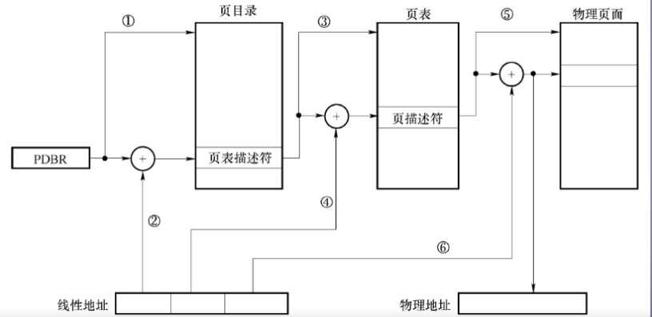

- 页目录基址寄存器+页目录索引 获得 页表描述符
- 页表基址+页表索引 获得 页描述符
- 页机制 + 页面索引 获得 物理地址

页表项即页表描述符和页面描述符，均为32位，其格式为

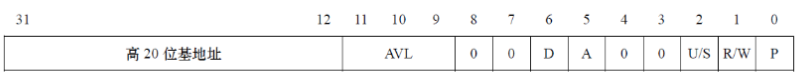

页表项的低12位提供保护和统计功能

页目录、页表和物理页的基地址的低12位全部为0，定位在页的边界上。

### 任务

任务是指完成某功能的多个程序的集合，系统中至少存在一个任务。任务以分时的方式使个程序轮流执行。保护模式下，任何时刻二都有一个当前任务，由TR寄存器指定。

每个任务由两部分组成

- 任务执行环境TES

  任务执行环境包括一个代码段、堆栈段和数据段等，任务在每一个特权级上执行时都有一个堆栈段。

  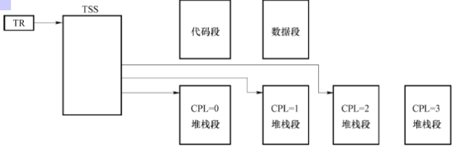

- 任务状态段TSS

  104个字节，保存了任务的各种状态信息，可以实现任务的挂起和回复，在任务切换过程中起重要作用。

  TSS描述符属于系统描述符，S位等于0，必须放在GDT表中，其类型位Type值为1001或1011，1011表示该任务正在执行或者被挂起

#### 门

一种转换机构，可以实现不同特权级别之间的控制传送

门描述符属于系统描述符，其格式为

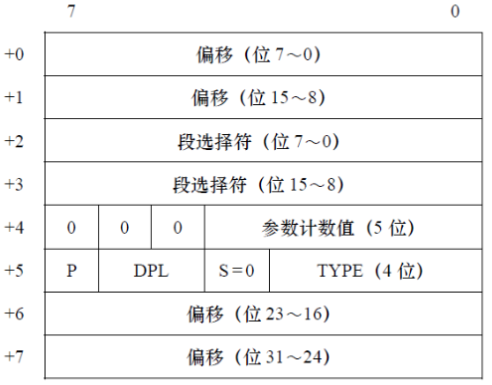

- 调用门

  用于控制传送，改变任务或者程序的特权级别

  类型为4或C时表示调用门

- 任务门

  用于执行任务切换，任务门内的选择符必须只是GDT中的TSS描述符

#### 任务切换

四种情况

- 执行远程JMP 或者CALL 指令，选择了GDT 中的TSS 描述符。
- 执行远程JMP 或者CALL 指令，从GDT 或者LDT 中选择了任务门。
- 发生了中断或异常，中断向量选择了IDT 中的任务门。
- 当FLAGS 中的NT=1 时，执行IRET 指令，目的任务选择符在执行IRET 任务的TSS链接域中。

任务切换可以分为

- 直接任务切换

  

  要求TSS的DPL ≥ MAX（CPL，RPL）

- 间接任务切换

  

  要求Gate的DPL ≥ MAX（CPL，RPL）

任务切换的步骤为

- 把寄存器现场保存到当前任务的TSS（任务A的TSS）。
- 把指示目标任务（任务B）TSS的选择符装入TR寄存器中，同时把对应TSS的描述符装入TR的高速缓冲寄存器中。
- 恢复当前任务（任务B）的寄存器现场。
- 进行链接处理。
- 把CR0中的TS标志置为1，这表示已发生过任务切换，在当前任务使用协处理器指令时，产生故障（向量号为7）。
- 把TSS中的CS选择符的RPL作为当前任务特权级，设置为CPL。
- 装载LDTR寄存器。
- 装载代码段寄存器CS、堆栈段寄存器SS和各数据段寄存器及其高速缓冲寄存器。

### 保护

保护模式下设置了0，1，2，3四个特权级，阻止了非法访问

#### 数据访问的保护

程序访问某段并将选择DS前，将会与段描述符进行验证

- 存在检查：P位如果为0表示还未装入主存

- 段类型是否一致：目标段的类型是否与待操作段寄存器类型一致，此外，读写操作也存在限制

- 限长检查

- 特权级检查

  要求：DPL ≥ MAX(CPL, RPL)

  - DPL：描述符特权级，位于描述符中
  - CPL：CS寄存器的最低两位
  - RPL：请求特权级

  

#### 对程序的保护

- 直接转移的保护

  同一代码段内部转移时只需要检查限长

  段间转移时，检查限长、特权级CPL和DPL

  - CPL=DPL，允许跳转和调用。
  - CPL<DPL，禁止。高特权级不能转移到低特权级
  - CPL>DPL，此时要检查段描述符的C位。如果C位为1，表示这是一致代码段,允许跳转和调用。

  一致代码段是指操作系统用于**共享的代码段**，被调用时特权级与调用者保持一致，转移前后CPL不变

  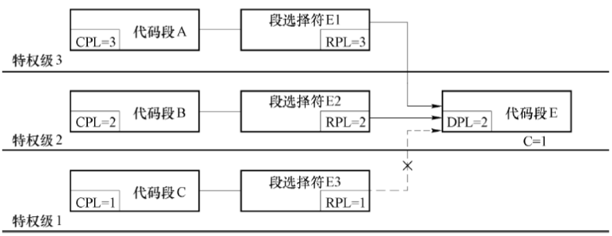

  非一致性代码段是指操作系统保护的系统代码段，只能允许特权级相同的程序间访问

  

- 间接转移的保护

  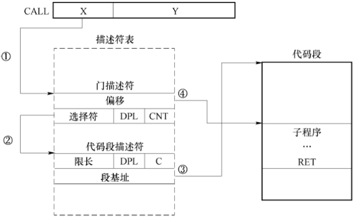

  需要满足两个条件

  - DPLgate ≥ MAX（CPL，RPL）
  - DPLcode ≤ CPL

#### 对输入输出的保护

CPU采用**I/O特权级IOPL**和**TSS段中I/O许可位图**的方法来控制输入/输出，实现输入/输出保护。

## 指令系统

### 数据寻址方式

MOV 目标,源

#### 立即寻址方式

操作数包含在指令中，紧跟在操作码之后。只能出现在源操作数位置

MOV  AX,1234H

#### 寄存器寻址方式

操作数直接包含在寄存器内

MOV  EBX,EAX

#### 直接寻址方式

操作数的有效地址EA包含在指令中，EA是操作数地址的**偏移量部分**，需要与段基址进行相加得到物理地址

MOV EAX, [00404011H]

MOV  AX,VAR	；VAR是内存的符号地址

#### 寄存器间接寻址方式

操作数有效地址在基址寄存器BX、BP或变址寄存器SI、DI中，而操作数在存储器中的寻址方式。

若指令中使用的是BX、SI、DI、EAX、EBX、ECX、EDX、ESI、EDI，则缺省情况操作数在数据段，即它们默认与DS段寄存器配合。

MOV  AL,[BX];（DS:[BX]）→AL

若使用的是BP、EBP、ESP,则缺省情况默认与SS段寄存器配合。

MOV  AX,[BP]  ;（SS:[BP]）→AX 

#### 寄存器相对寻址方式

操作数的有效地址是一个基址(BX、BP)或变址寄存器(SI、DI)的内容和指令中给定的一个**位移量（disp）**之和。

使用这种寻址方式可以访问一维数组

MOV  AL,8 [BX]	可以表示为：MOV  AL,[BX+8]

MOV  AL,TABLE[BX]	可以表示为：MOV  AL,[BX+TABLE]

#### 基址变址寻址方式

操作数的有效地址是一个基址寄存器和一个变址寄存器的内容之和。

基址寄存器确定缺省情况下的段寄存器


MOV  AL, [BX] [SI];（DS:[BX+SI]）→AL

#### 相对基址变址寻址方式

操作数的有效地址是一个基址和一个变址寄存器的内容和指令中给定的**一个位移量**之和

EA＝（基址寄存器）＋（变址寄存器）＋disp

MOV  AL, ARY[BX] [SI];（DS:[BX+SI+ARY]）→AL

#### 比例变址寻址方式

EA＝（基址寄存器）＋（变址寄存器）×比例因子＋disp 


### 数据运算指令

#### 数据传送指令

除了目的地址为标志寄存器的传送之外，其他指令不影响标志

- 传送指令MOV

  格式：MOV  DST，SRC

  功能：SRC（源）→DST（目标）

  注意：源操作数目标操作数类型必须匹配，传送方向必须遵循以下规则

  - 立即数不能作为目标操作数；
  - 立即数不能直接送段寄存器；
  - 目标寄存器不能是CS；
  - 两个段寄存器间不能直接传送；
  - 两个存储单元之间不能直接传送。

  对于立即数传送到存储单元中的情况，必须进行类型显示说明

  MOV    WORD PTR[BX],10

  此外，MOV还可以实现地址传送，借助SEG和OFFSET操作符

  - MOV AX,SEG TAB

    把TAB的**段基址**送给AX寄存器

  - MOV DI,OFFSET TAB

    把TAB的**偏移量**送给DI寄存器

- 堆栈操作指令

  - PUSH

    格式：

    PUSH  SRC

    功能：

    SP = SP - 2/4

    SS:SP = (SRC)

    注意：在80286以上的机器中，SRC还可以是立即数。

  - POP

    格式：

    POP  DST

    功能：

    (DST) = SS:SP 

    SP = SP + 2

- 交换指令XCHG

  格式：XCHG  OPR1,OPR2

  功能：交换两个操作数。

- 输入输出指令

  - IN

    格式：IN  ACR,PORT

    功能：把外设端口（PORT）的内容传送给累加器（ACR）。

    注意：累加器为AL、AX、EAX，对应8位、16位、32位数据。

  - OUT

    格式：OUT  PORT,AC

    R功能：把累加器的内容传送给外设端口。

- 地址传送指令LEA

  格式：LEA REG,SRC

  功能：把源操作数的有效地址送给指定的寄存器。

  注意：REG必须是寄存器，SRC必须是存储器操作数

- 标志传送指令

  - PUSHF

    格式:PUSHF

    功能: SP减2；FLAGS→栈顶单元。

  - POPF

    格式：POPF

#### 二进制运算指令

- 二进制加法指令

  - ADD

    格式：ADD  DST,SRC

    功能：（DST）＋（SRC）→ DST

    注意：对操作数的限定同MOV指令

    标志：影响OF、SF、ZF、AF、PF、CF标志。

    - 无符号数相加若使CF置1，表示溢出
    - 带符号数相加结果若使OF置1，表示溢出。

  - 带进位加法指令ADC

    格式:ADC  DST,SRC

    功能:（DST）＋（SRC）＋CF → DST

    注意，该指令适用于多字节或多字的加法运算

  - 加1指令INC

    格式：INC  DST

    功能：（DST）＋1→DST

    注意，不影响CF标志位

- 二进制减法指令

  - SUB

    格式：SUB  DST,SRC

    功能：（DST）－（SRC）→ DST

  - 带借位减法指令SBB

    格式: SBB  DST,SRC

    功能: (DST)－(SRC)－CF → DST

    该指令适用于多字节或多字的减法运算。

  - 减1指令DEC

    格式：DEC  DST

    功能：(DST)－1→DST

- 比较指令CMP

  格式:CMP  DST,SRC

  功能:(DST)－(SRC)，影响标志位

- 乘法指令

  - 无符号乘法指令MUL

    格式：MUL  SRC

    功能：实现两个无符号二进制数乘。

    注意，该指令只含一个源操作数，不能是立即数, 另一个乘数必须事前放在累加器中。可以实现8位、16位、32位无符号数乘。

    - 字节型乘法：(AL)×(SRC)8→AX
    - 字型乘法：(AX)×(SRC)16→DX:AX
    - 双字型乘法：(EAX)×(SRC)32→EDX:EAX

  - 带符号乘法指令IMUL

    格式1：IMUL  SRC

    格式2：IMUL  REG,SRC	；REG和SRC的长度必须相同，REG为目标

- 除法指令

  - 无符号除法指令 DIV

    格式：DIV  SRC

    功能：实现两个无符号二进制数除法。

    该指令只含一个源操作数，该操作数作为除数使用，注意它不能是立即数。被除数必须事前放在隐含的寄存器中。

    - 字节型除法：(AX)/(SRC)8→商AL,余数AH
    - 字型除法：(DX:AX)/(SRC)16→商AX,余数DX
    - 双字型除法：(EDX:EAX)/(SRC)32→商EAX,余数EDX

  - IDIV

#### 逻辑运算指令


#### 移位指令

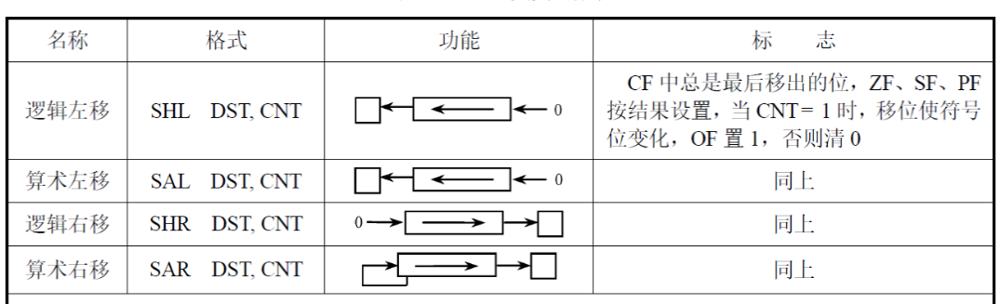

- 逻辑移位：无符号数
- 算数移位：带符号数

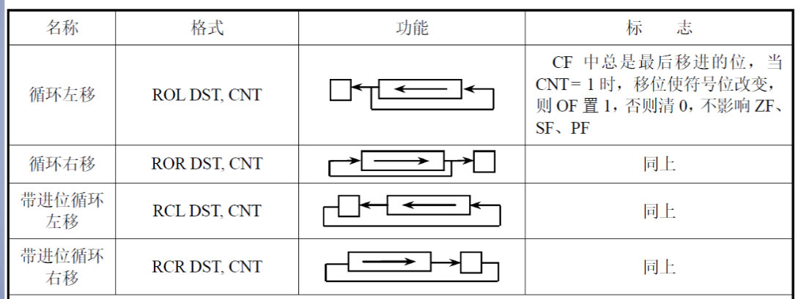

- 循环移位
- 带进位的循环移位

### 程序控制指令

- 转移指令

  - 无条件转移指令JMP

    格式：JMP 目标

    功能：无条件转移到目标处。

    目标的寻址方式可以分为

    - 段内转移

      只影响指针IP值

      - 段内直接转移

        - 短转移

          位移量为8位，格式：JMP  SHORT  LAB  

        - 近转移

          位移量为16/32位，格式：JMP  LAB 或 JMP  NEAR  PTR  LAB

      - 段内间接转移

        

    - 段间转移

      影响IP和CS。

      需要双字变量或6字节变量，变量由偏移量和段基址组成，注意是逆序存放

      - 段间直接转移

        格式：JMP  FAR  PTR  LAB 

      - 段间间接转移

        用一个双字内存变量中的低16位取代IP值，高16位取代CS值

        该双字变量的地址可以由除立即寻址和寄存器寻址方式以外的其它与数据有关的寻址方式获得。

  - 条件转移指令

    注意条件转移指令**只能段内转移**

    - 检测单个条件标志位转移指令表

    

    - 根据两个**带符号数**比较结果实现转移的条件转移指令
      - 大于 JG
      - 小于 JL
      - 大于等于 JGE
      - 小于等于 JLE
    - 根据两个无符号数比较结果实现转移的条件转移指令
      - 大于 JA
      - 小于 JB
      - 大于等于 JAE
      - 小于等于 JBE

- 循环指令

  - LOOP

    格式：LOOP  LABEL

    功能：(CX)－1→CX，若(CX)≠0，则转向标号处执行循环体，否则顺序执行下一条指令。

- 子程序指令

  - CALL

    格式：CALL  DST

    功能：调用子程序。执行时先把返回地址压入堆栈，再形成子程序入口地址，最后把控制权交给子程序。

    与JMP的相同点

    - 段内直接／间接调用、段间直接／间接调用、

    与JMP的不同点

    - CALL转移后要返回，所以要保存返回地址；
    - JMP转移后不再返回,所以不必保存返回地址。

  - RET

    格式1：RET

    功能：按照CALL指令入栈的逆序，从栈顶弹出返回地址（弹出一个字到IP，若子程序是FAR型还需再弹出一个字到CS），然后返回到主程序继续执行。

    格式2：RET 立即数

    功能：按照CALL指令入栈的逆序，从栈顶弹出返回地址（弹出一个字到IP，若子程序是FAR型还需再弹出一个字到CS）,返回到主程序，并修改栈顶指针SP＝(SP)＋imm16。

    注意：修改堆栈指针是为了废除堆栈中主程序传递给子程序的参数。

- 中断指令

  中断就是使计算机暂时挂起正在执行的进程而转去处理某种事件，处理完后再恢复执行原进程的过程。

  对某事件的处理实际上就是去执行**中断子程序**。

  中断向量是中断处理子程序的入口地址，FAR类型

  中断类型号是中断类型的编号，共计256种

  中断向量表，中断类型号与中断向量的对应关系

  - INT 

    格式：INT  n；n为中断类型号

    功能：中断当前正在执行的程序，把当前的FLAGS、CS、IP值依次压入堆栈(保护断点）,并从中断向量表的4n处取出n类中断向量.

  - IRET

    格式：IRET

    功能：从栈顶弹出三个字分别送入IP、CS、FLAGS寄存器,把控制返回到原断点继续执行。

### 处理机控制指令

#### 标志操作指令

直接对CF、DF、IF进行操作


- CL：清零
- ST：置一
- CM：取反

### 块操作指令

重要性存疑


## 汇编语言程序开发

### 常用伪指令

#### 数据定义伪指令

格式：[变量名] 助记符 操作数

功能：为变量分配单元，并为其初始化或者只预留空间


操作数类型

- 数字常量与数值表示

  二进制数以b结尾

  八进制数以Q或O结尾

  十六进制数以H结尾，若第1位为字母，则必须加0

- 字符串常量：用单括号包围

- 地址表达式：可以是地址符号

- ？：预留空间不赋值

- `<n> dup(操作数,...)`：重复多次括号内的数据

#### 符号定义伪指令

- 等值伪指令

  格式：符号名 EQU 表达式

  功能：用符号名代表表达式或表达式的值。

- 等号伪指令

  格式：符号名 = 数值表达式

  功能：用符号名代替数值表达式的值。

#### 操作符伪指令

- $ 操作符

  功能：$在程序中表示**当前地址计数器**的值。

- ORG 操作符

  格式：ORG 数值表达式

  功能：设置地址计数器内容为数值表达式的值。

- OFFSET操作符
  格式：OFFSET [变量|标号] 
  功能：OFFSET操作符用来取出变量或标号的地址（在段中的偏移量）。在32位编程环境中，地址是一个32位的数。

- 算术操作符

  加减乘除等，在编译时完成

- 关系操作符

  - EQ：等于；NE：不等于
  - LT：小于；LE：小于等于
  - GT：大于；GE：大于等于

#### 框架定义伪指令

微处理器伪指令


框架定义伪指令


### 汇编源程序格式

#### 控制台界面

```assembly
;模式定义
.386
.model flat,stdcall
option casemap:none

;库文件及函数声明
includelib msvcrt.lib
printf	PROTO C :ptr sbyte,:VARARG ;或者使用include
scanf PROTO C :dword,:vararg


;数据部分
.data
szMsg	byte	'Hello World',0ah,0

;代码部分
.code
start:
	invoke printf, offset szMsg
	ret
end start
```

- invoke伪指令

  用于调用函数

#### Windows界面

```assembly
;模式定义
.386
.model flat.stdcall
option casemap:none

;库文件及函数声明
includelib user32.lib
MessageBoxA PROTO stdcall :dword,:dword,:dword,:dword 
MessageBox equ <MessageBoxA>

;数据部分
.data
SzTitle	byte	'Hi!'
SzMsg	byte	'Hello World',0

;代码部分
.code
start:
	invoke MessageBox,
		   NULL,
		   offset szMsg,
		   offset szTitle,
		   MB_OK
	ret
end start
```

### 分支和循环程序设计

#### 分支程序设计

- IF_THEN_ELSE结构
- SWITCH_CASE结构

#### 循环程序设计

- DoWhile
- DoUntil

### 浮点运算

#### 浮点数表示与存储


#### 浮点寄存器

FPU不适用通用寄存器，寄存器栈，为8个独立寻址的80位寄存器，另有3个16位寄存器

- 控制寄存器
- 状态寄存器
- 标志寄存器

#### 浮点指令

- 数据定义

  - dd(dword)/32位/REAL4：定义单精度浮点数
  - dq(qword)/64位/REAL8：定义双精度浮点数
  - dt(tbyte)/80位/REAL10：定义扩展精度浮点数

- 浮点寻址方式

  - 寄存器寻址：操作数保存在指定的数据寄存器栈中，用ST(i)表示。
  - 存储器寻址：操作数在内存中，内存中的数据可以采用与数据有关的存储器寻址方式访问。

- 浮点指令

  

## 子程序设计

### 子程序基本知识

定义方式

```
子程序名	PROC	   [类型]
		   ……
			RET
子程序名	ENDP
```

设计注意点：

- 寄存器的保存与恢复
- 保持堆栈平衡
- 子程序说明

#### 堆栈

具有：临时性、快速性、动态扩展性

作用

- 保护或恢复现场

- 变量之间数据传递

- 临时数据区

- 子程序的调用与返回

  Call指令保存返回地址到堆栈中，RET指令从堆栈中取出返回地址

  子程序的局部变量也在堆栈中

  程序参数传递也使用堆栈

### 参数传递

C函数常见传递方式

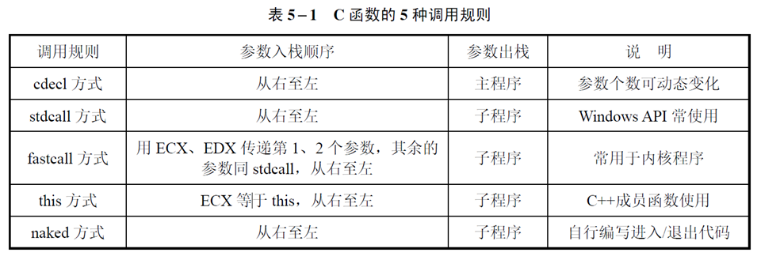

- cdecl方式

  使用堆栈传递参数，主程序从右向左的顺序将参数逐个压栈，最后一个参数先入栈

  使用[EBP+X]访问参数，例：[EBP+8]代表第一个参数，[EBP+12]代表第二个参数

  子程序使用RET指令返回，在主程序种执行ADD ESP,N来平衡堆栈，N为参数个数乘4

- stdcall方式

  从右到左使参数入栈

  堆栈平衡由子函数完成，使用RET n指令，n为参数个数乘4

- fastcall方式

  类似于stdcall方式，但是使用ecx传递第一个参数，edx传递第2个参数

- naked方式

  不会生成函数进入和退出代码（push ebp等）

#### 局部变量

在子程序内部使用，在进入子程序时，通过修改堆栈指针ESP来预留出需要的空间

在返回主程序之前恢复ESP来释放

可以使用LOCAL伪指令定义

```
LOCAL TEMP[3]:DWORD
```

### 子程序的特殊应用

#### 子程序嵌套

嵌套深度取决于堆栈容量，需要维持堆栈的平衡

#### 子程序递归

#### 缓冲区溢出

当程序向缓冲区内写入的数据超过了缓冲区的容量，缓冲区之外的内存单元被程序“非法”修改。


### 模块化程序设计

模块间通信方式

- 外部引用伪指令

  格式：EXTRN/EXTERN  变量名:类型 [,…]
  extrn   	result:dword

  说明本模块种用到的变量是另一个模块种定义的

- 全局符号说明伪指令

  格式：PUBLIC  名字 [,…]
  public	result

  说明本模块中定义的名字可以被其他模块使用

- 子程序声明伪指令

  格式：子程序名  PROTO  [C | stdcall] :[第一个参数类型] [,:后续参数类型]
  printf  PROTO C :dword,:vararg


## 存储系统与技术

### Cache工作原理

- 局部性原理

  时间局部性：Cache访问速度
  空间局部性：Cache访问容量

- 访问结构

  

  - 贯通查找式Look through

    cache平均访问时间 = cache访问时间+（1-命中率）×未命中时主存访问时间

  - 旁路读出式Look Aside

    cache平均访问时间 = 命中率×cache访问时间+（1-命中率）×未命中时主存访问时间

- Cache映射

  主存和Cache数据块**大小相同**，CPU访问主存的地址需要转换成访问Cache的地址

  - 全相联映像
  - 直接相联映像
  - 组相联映像

- Cache替换

  发生块冲突时需要进行替换

### 内部存储器


存储单元数量=行数×列数×数据深度（位宽）×L-Bank的数量

带宽=总线宽度×总线频率×一个时钟周期内交换的数据包个数

访问速度指标：–存储周期（MC）/访存时间（AC）

错误校验：奇偶校验（Parity）/ECC校验（即可纠错也可检错）

#### DDR读写时序

双倍速率同步动态随机存储器Double Date Rate SDRAM

一个时钟周期内传输两次数据，它能够在时钟的上升沿和下降沿各传输一次数据

读入时DQS信号由DDR芯片驱动

### 辅助存储器

#### ATA接口模型

- N个盘面对应2N个磁头，磁头：0.1.2…nH
- N个磁道对应N个柱面，柱面：0.1.2…nC
- 每个磁道又被分为多个扇区，扇区：1.2.3…nS
- 总nC×nH×nS个扇区
- 0柱面0磁头1扇区是整个硬盘的第1个扇区
- 每个扇区512字节

编制方式为

- LBA编址L

  L=[(C×nH + H)×nS]+S–1

- CHS编址<C,H,S>

  S =(L%nS)+1
  H =(L÷nS)%nH
  C =(L÷nS)÷nH

#### SATA

串行ATA，采用差分方式传输，采用了全速命令队列技术NCQ

## 总线技术

### 定义及分类

任何能够提供通讯逻辑功能的物理布局和设施

### PCI总线


## 接口技术

接口模块包括

- 控制端口：接受CPU指令
- 状态端口：提供状态信息给CPU
- 数据端口：匹配CPU和外设的速度差异
- 地址译码和读写控制逻辑
- 中断/DMA请求逻辑模块

### 串行接口及应用

串行通信：数据发送方将并行数据转换成按照二进制数据位排列的串行形式的数据送到传输线上。数据接收方的串行接口接收到这些二进制位后，再将它们转换成字节形式的并行数据。


传送方式可分为

- 单工
- 半双工
- 全双工

通信协议可以分为

- 异步：无时钟信号，面向字符，传送不连续

  存在开始位（0）和停止位（1），低位在前高位在后

  

- 同步：收发双方同一个时钟信号，面向比特，传送连续

#### RS-232C标准

RS-232C将

- -5～-15V规定为“1”（逻辑1电平）
- +5～+15V规定为“0”（逻辑0电平）

标准TTL（Transistor-Transistor Logic）

- 电平定义+2.4～+5V为高电平，表示逻辑1
- 0～0.4V为低电平，表示逻辑0。

#### 可编程串行通信接口

通用异步收发传输器UART，8250标准，最大通信速率可达19200b/s

- 共有11个寄存器

  - 发送保持寄存器THR（000）

    保存CPU发送的数据字节

  - 接收缓冲寄存器RBR（000）

    保存接收到的数据字节

  - 线路状态寄存器LSR（101，+5）

    存储串行数据传送的状态

    注意第0、5位

    - DR：第0位，为1时从RBR中接受的数据才是有效的，当读取了有效数据时需要将该位置1
    - THRE：第5位，为1时表示THR为空，CPU写到THR中的数据才是正确的，为0时不可写入

    参考书p295 例5

  - 线路控制寄存器LCR（011，+3）

    指定异步通信数据格式

    - D1、D0，指定传送数据帧中字符长度

      长度为5+D1D0

    - D2，设置停止位位数

      =0为1位，=1则为2位

    - D3，=0不使用奇偶校验

    - D5，需要D3=1，=1则校验位恒为1或0

      若D4=1，则恒为0，若D4=0则恒为1

    - D4，需要D3=1，D5=0

      =0则奇校验，=1则偶校验

    - D7，=1则会访问除数寄存器DLL，控制速率

    参考书p296 例6

  - 除数锁存器DLL/DLM

    控制传输速率

    *f*工作时钟 = *f*基准时钟 ÷ 除数锁存器 = 波特率 × 16 

    除数锁存器 = 115200 ÷ 波特率

    需要在对LCR最高位进行设置后再进行操作，将商的高字节写入DLM，低字节写入DLL，结束操作后需要恢复LCR最高位为0

    参考书p297 例7

初始化程序可以参考p301 例11

### 定时和计数及其应用

计数和定时本质上是一致的，但计数的信号随机，计时的信号具有周期性

- 软件定时
- 不可编程的硬件定时
- **可编程的硬件定时**：可编程定时器芯片8254


8254内部结构

- 数据总线缓冲器
- 读写逻辑
- 控制字寄存器
- 三个计数器，自带16位减法寄存器

寻址方式：共4个地址，分别代表计数器0、1、2和控制寄存器

#### 控制寄存器

- D7、D6：指定需要设置参数的计数器的序号
- D3、D2、D1设置指定计数器的工作方式
- D0设定计数模式，二进制计数模式为1，BCD技术模式（十进制）为0
- D5、D4读写计数器的位数
  - 00：锁存计数器当前值，用于读
  - 01：只写低计数位
  - 10：只写高计数位
  - 11：写16位

p307 例8.12和8.13分别是写和读操作

#### 8254应用

- 计数

  使用了方式0，在计数到达后会引起中断

- 分频

  8254工作在方式2/3时，输出频率为输入频率的1/n，N为计数初值

  提供一个频率为10kHz的时钟信号，要求每隔100ms采集一次数据。对于一个10kHz时钟信号，其周期为1/10kHz=0.0001s=0.1ms。需要对它进行分频，生成一个周期为100ms的信号，频率为10Hz。计数器初值应设置为1000

- 级联

  如果需要产生的分频信号的系数超过了最大技术范围（16位），需要对两个计数器进行级联，初值满足N1×N2

### 红外

#### Wi-Fi

## 中断技术

### 中断概述

基本原理：使CPU中止正在执行的程序而转去处理特殊事件的操作

中断源：引起中断的事件

Intel系列微处理器的对外中断引脚包括申请中断的引脚（INTR和NMI），一个响应中断的引脚（INTA）。

中断分类

- 中断（外部中断）

  - 可屏蔽中断：INTR引脚接收
  - 不可屏蔽中断：NMI引脚接收

- 异常

  不可屏蔽

  - 故障：特点是可排除，在引起异常的指令之前，把异常情况通知给系统的一种情况

  - 陷阱：在引起异常的指令执行之后触发，比如软中断INT n

    

  - 中止：系统出现严重不可恢复事件后触发，系统必须重启才可恢复正常

部分重要的软件中断

- 除法出错中断 00

  除数等于0，故障

- 单步中断 01

  TF标志为1，处于单步运行模式，没执行一步自动产生中断，陷阱

- 断点中断 03

  调试使用，INT3，陷阱

- 溢出中断 04

  OF标志置1，执行INTO指令时产生中断，陷阱

- 指令中断 INT n

### 实模式处理过程

#### 中断向量表

CPU根据获得中断类型号作为索引，在中断向量表中寻找中断服务程序的入口

中断向量表位于存储器00000H-003FFH单元，占据了1024个字节，每个中断向量占据4个字节，包含了中断服务程序的段地址和偏移量

#### 中断处理过程

- 标志寄存器内容压栈
- 清楚中断标志IF和陷阱标志TF，禁止可频闭中断等功能
- 查找中断向量表，获取中断服务程序段地址和偏移量，修改CS和IP
- 执行中断服务程序
- 执行到IRET时，恢复状态

#### 写中断向量表

可添加新的中断到中断向量表

### 保护模式中断处理

保护模式使用中断描述符表存储中断向量

#### 中断描述符表IDT

每个CPU核具有一个唯一的IDT，位置不定，IDTR指明了IDT的位置和限长

IDT包含的描述符是中断门、陷阱门和任务门，其格式参考如下，8个字节，其中段选择符和偏移指明了中断服务程序的入口地址


#### 中断和异常响应步骤


### 可编程控制器8259

可管理8个硬件中断


- 右侧8根中断请求线
- INT：连接微处理器INTR
- INTA：连接中断处理器INTA

#### 中断过程

- 当一条或多条中断请求线IR0～IR7变高时，设置相应的IRR位为1；
- 然后PR对中断优先权和中断屏蔽寄存器的状态进行判断，请求中断服务；
- CPU响应中断时，送出中断响应信号INTA，响应第一个INTA信号时，将当前中断服务寄存器中相应位置位，并把IRR中相应位复位。第二个INTA负脉冲期间，中断类型码被读入CPU。

工作流程示例（假设优先级从0-7由高到低）

- IR2出现中断请求，该引脚的对应的中断屏蔽字相应位为0，即没有被屏蔽。此时由于ISR全为0，没有比它的优先级更高的中断正在执行，发送中断请求INT，IR2的请求通过数据线被送往CPU。
- CPU响应中断时，8259将ISR的值变为00000100B，标志IR2正在被服务。

#### 级联
