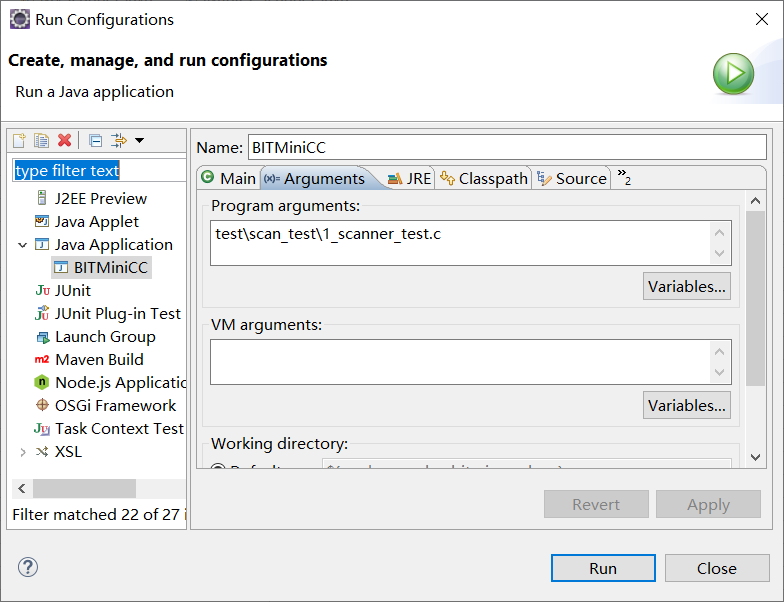
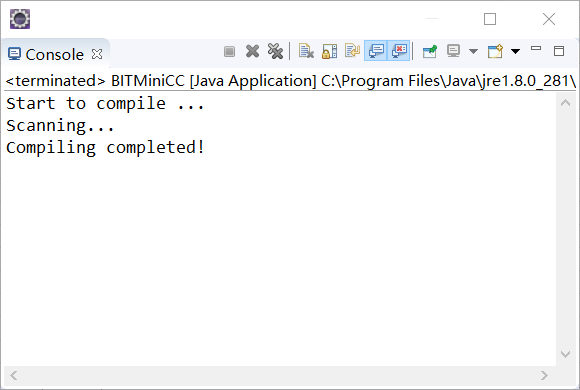
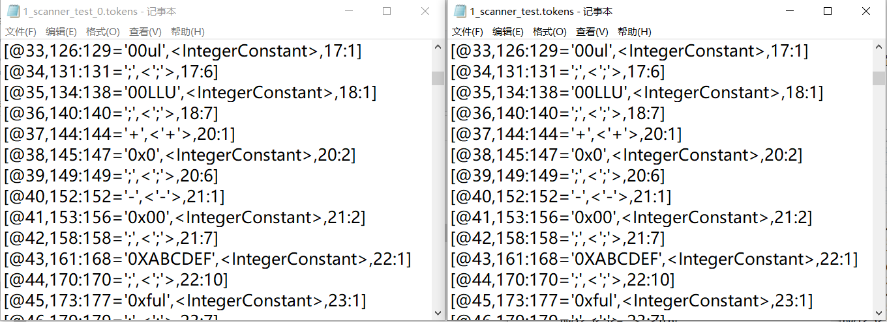
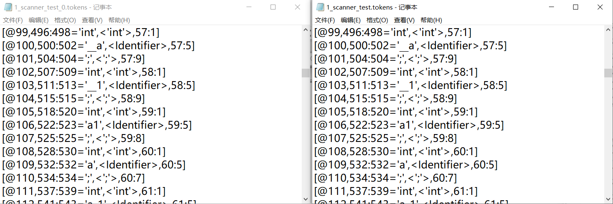

# Lab3  词法分析实验

姓名/学号：宋尚儒/1120180717

## 实验目的

（1） 熟悉 C 语言的词法规则， 了解编译器词法分析器的主要功能和实现技术，掌握典型词法分析器构造方法，设计并实现 C 语言词法分析器；
（2）了解 Flex 工作原理和基本思想，学习使用工具自动生成词法分析器；
（3） 掌握编译器从前端到后端各个模块的工作原理， 词法分析模块与其他模块之间的交互过程。  

## 实验内容

​	根据 C 语言的词法规则，设计识别 C 语言所有单词类的词法分析器的确定有限状态自动机，并使用 Java、 C\C++或者 Python 其中任何一种语言，采用程序中心法或者数据中心法设计并实现词法分析器。词法分析器的输入为 C 语言源程序，输出为属性字流。
​	学生可以选择编码实现词法分析器，也可以选择使用 Flex 自动生成词法分析器。需要注意的是， Flex 生成的是 C 为实现语言的词法分析器，如果需要生成 Java 为实现语言的词法分析器，可以尝试 JFlex 或者 ANTLR。由于框架是基于 Java 语言实现的，并且提供了相应的示例程序，建议学生使用 Java 语言在示例的基础上完成词法分析器。  

## 实验过程

### 实验环境

词法分析器语言

- Java

框架

- BIT MiniCC

### 实验思路

总体来说，程序需要实现以下功能

- 读C语言源程序文件
- 词法分析，识别单词
- 写属性字流tokens文件

对于C语言，我们需要识别以下种类的单词，具体种类之后还会进一步分析

- 标识符
- 常量 
  - 整形常量 
  - 浮点型常量  
- 字符
- 字符串
- 算符
  - 运算符
  - 界限符

对于以上功能和子功能，会在实验步骤中逐一体现

### 实验步骤

创建类`MyScanner`实现接口`IMiniCCScanner`，可以通过调用接口中的`run`函数实现词法分析过程。

在类`MyScanner`中，定义部分成员属性如下所示

```java
public class MyScanner implements IMiniCCScanner {
	
	private int lIndex = 0;     //当前行号，起始为0
	private int cIndex = 0;     //当前列号，起始为0
    private int charnum = 0;	//当前字符计数
    private boolean flagnote = true;    //是否开启忽略注释功能
	//保存源文件的字符串数组
    private ArrayList<String> srcLines;
    //关键词列表
    private HashSet<String> keywordSet;
	//字符前缀列表    
    private HashSet<String> charprefix;
    //字符串前缀列表
    private HashSet<String> Stringprefix;
    //转义符列表
    private String cEscSequence;
    //可作为多字算符开头的单字算符
    private String cMultiOp;
    //不可作为多字算符开头的单字算符
    private String cSinglOp;
    ...
        
}
```

本次实验的状态以及转换图比较复杂，会在之后子功能实现中分步给出

#### 读文件

`run`函数输入即为文件路径，在开始阶段通过`MiniCCUtil.readFile(iFile)`读取文件到`this.srcLines`，然后调用函数`getNextChar`逐字符处理文件内容，该函数主要功能是获取当前行号和列号对应的字符，并调整行号列号至下一字符，在此不详细展示实现细节，只是需要注意的是在读取到每一列末位时，`charnum`需要加1以表示读取了换行符

以下为`getNextChar`在`run`函数中具体用法

```java
	public String run(String iFile) throws Exception {
		
		...

		this.srcLines = MiniCCUtil.readFile(iFile);
        
		String lexme 	= "";		//需要保存的字符
		char c 			= ' ';		//获取的字符
		boolean keep 	= false;	//是否保留当前字符，不读取下一字符
		boolean end 	= false;    //是否已处理到文件尾
		
		while(!end) {				//循环扫描至文件尾部
			if(!keep) {
				c = getNextChar();
                charnum = charnum + 1;
			}
			keep = false;
			
            ...
            
		}
	}
```

#### 写文件

生成的tokens文件由属性字流token组成，其中每个token需要包括

- 序号，对应变量`iTknNum`
- 对应单词在全体字符内的起止位置`charnum`
- 单词具体文本，对应变量`lexme`
- 单词类型
- 起始行和起始列，对应属性`lIndex`和`cIndex`（需要进一步调整）

在`run`函数中设置变量`strTokens`保存文件文本

当某一单词识别完成，用以下函数生成token，并保存到`strTokens`中

```java
//当读取到单词终止字符，keep=false时，调用该函数，从当前位置开始保存
private String genToken(int num, String lexme, String type) {
    return genToken(1, num, lexme, type, this.cIndex - 1, this.lIndex);
}
//当读取到单词异常终止字符，即当前字符不属于单词，keep=true时，调用该函数，从前一位置开始保存
//注意，如果前一位置的字符是该行最后一位，还需要临时调整行列号
private String genToken2(int num, String lexme, String type) {
    if(this.cIndex == 1) {			
        int tcIndex = this.srcLines.get(lIndex-1).length();
        System.out.println(lexme);
        return genToken(3, num, lexme, type, tcIndex - 1, this.lIndex - 1);

    }else
        return genToken(2, num, lexme, type, this.cIndex - 2, this.lIndex);

}
//根据前两个函数提供的参数计算起止位置，形成正式的token式，并返回
private String genToken(int cn, int num, String lexme, String type, int cIndex, int lIndex) {
    String strToken = "";

    strToken += "[@" + num + "," + (charnum - cn - lexme.length() + 1) + ":" + (charnum - cn);
    strToken += "='" + lexme + "',<" + type + ">," + (lIndex + 1) + ":" + (cIndex - lexme.length() + 1) + "]\n";

    return strToken;
}
```

在具体的使用中，需要根据具体的状态选择使用`genToken`和`genToken2`函数

需要注意的是，文件末尾需要形成EOF的token式，其形式与其余token式不同，不调用以上函数，具体保存方式如下，具体使用位置会在之后说明

```java
String strToken = "";
strToken += "[@" + iTknNum + "," + (charnum - 2) + ":" + (charnum - 3);
strToken += "='<EOF>',<EOF>," + lIndex + ":" + (this.srcLines.get(lIndex-1).length()) + "]\n";
strTokens += strToken;
```

在`run`函数的最后，需要将`strTokens`写入文件

```java
String oFile = MiniCCUtil.removeAllExt(iFile) + MiniCCCfg.MINICC_SCANNER_OUTPUT_EXT;
MiniCCUtil.createAndWriteFile(oFile, strTokens);
```

#### 初始状态设置与状态转换方式

在`run`函数前部设置初始状态，在之后的循环扫描过程中进行识别与状态转换，在以下代码中实现了从初始状态向其他状态的转换

```java
	public String run(String iFile) throws Exception {
		...
		DFA_STATE state = DFA_STATE.DFA_STATE_INITIAL;		//设置初始状态
		...
		
		while(!end) {				//
			if(!keep) {
				c = getNextChar();
			}
			
			keep = false;

			switch(state) {
			case DFA_STATE_INITIAL:	
				lexme = "";
				if(isAlpha(c)) {
					state = DFA_STATE.DFA_STATE_ID;
					lexme = lexme + c;
				}else if(c == '+') {
					state = DFA_STATE.DFA_STATE_ADD_0;
					lexme = lexme + c;
				}
                
                ...
				//读取到文件尾部，形成特殊token式，并退出循环
            	}else if(c == Character.MAX_VALUE) {
					String strToken = "";
					strToken += "[@" + iTknNum + "," + (charnum - 2) + ":" + (charnum - 3);
					strToken += "='<EOF>',<EOF>," + lIndex + ":" + (this.srcLines.get(lIndex-1).length()) + "]\n";
					strTokens += strToken;
					end = true;
				}
				break;
                
			default:
				System.out.println("[ERROR]Scanner:line " + lIndex + ", column=" + cIndex + ", unreachable state!");
				break;
			}
		}
		...
	}

```

#### 识别标识符

标识符`Identifier`是由字母、下划线开头，后续可由字母、数字、下划线组成的，因此首先在`MyScanner`类中定义如下方法以识别`Identifier`的头部和后续

```java
private boolean isAlpha(char c) {
	return Character.isAlphabetic(c)||c=='_';
}	
private boolean isAlphaOrDigit(char c) {
	return Character.isLetterOrDigit(c)||c=='_';
}
```

可设计识别标识符的DFA图如下


此外，由于C语言存在关键字，需要特殊识别，在`MyScanner`类的初始化函数中对属性`keywordSet`初始化以保存，这里仅列举部分关键字保存过程

```java
public MyScanner(){
    ...
	this.keywordSet = new HashSet<String>();
	this.keywordSet.add("int");
	this.keywordSet.add("return");
    ...
}
```

同时需要注意的是，因为字符和字符串存在前缀，比如字符存在前缀`u|U|L`,字符串存在前缀`u|u8|U|L`，为方便识别前缀不至于分别识别成标识符和字符/字符串，需要在识别标识符的尾部进行特殊处理，初始化两个列表如下

```java
public MyScanner(){
    ...
    this.charprefix = new HashSet<String>();
    this.charprefix.add("u");
    this.charprefix.add("U");
    this.charprefix.add("L");

    this.Stringprefix = new HashSet<String>();
    this.Stringprefix.add("u");
    this.Stringprefix.add("U");
    this.Stringprefix.add("L");
    this.Stringprefix.add("u8");
}
```

因此可实现字符串识别如下如下

```java
switch(state) {
    case DFA_STATE_INITIAL:	
        lexme = "";
        if(isAlpha(c)) {
            //转换至ID状态
            state = DFA_STATE.DFA_STATE_ID;
            lexme = lexme + c;
        }
        ...
    case DFA_STATE_ID:
        if(isAlphaOrDigit(c)) {
            //维持在ID状态
            lexme = lexme + c;
        }else {
            //ID识别完成
            //首先判断是不是字符或字符串前缀，如果是则保存前缀分别进行状态跳转
            if(this.charprefix.contains(lexme) && c == '\'') {
                lexme = lexme + c;
                state = DFA_STATE.DFA_STATE_CHR_0;
            }else if(this.Stringprefix.contains(lexme) && c == '\"') {
                lexme = lexme + c;
                state = DFA_STATE.DFA_STATE_STR_0;
            }else {
                //不是字符或字符串前缀，判断是否是关键字，保存token，回到初始状态
                if(this.keywordSet.contains(lexme)) {
                    strTokens += genToken2(iTknNum, lexme, "'" + lexme + "'");
                }else {
                    strTokens += genToken2(iTknNum, lexme, "Identifier");
                }
                iTknNum++;
                state = DFA_STATE.DFA_STATE_INITIAL;
                keep = true;
            }
        }
```

#### 识别字符和字符串

字符串和字符识别的方法类似，但都需要处理前缀和转义字符，这里以字符为例

对于前缀的识别和状态转移，已在之前标识符识别中做了特别说明，在这一部分就不重复

对于转义字符，首先需要识别`\`字符，并判断之后的字符是否符合转义字符的正确形式

存在转义字符`\a`、`\b`、`\f`、`\n`、`\r`、`\t`、`\v`、`\\`、`\'`、`\"`、`\?`、`\0`、`\ddd`、`\xhh`

其中

- `\ddd`表示中d的位数为1-3，为任意八进制数
- `\xhh`中h位数不限，为16进制数

在本次实验中暂时不考虑存在字符`''`内存在多个字符的情况，即默认合法

因此设计识别字符的状态为

```java
enum DFA_STATE{
	...
	DFA_STATE_CHR_0,       //识别到'
	DFA_STATE_CHR_1,       //识别到\
	DFA_STATE_CHR_2,       //识别到\x
    DFA_STATE_CHR_3,       //再次识别到'，终止
    DFA_STATE_CHR_ILL,     //保存错误字符
	...
}
```

识别字符的DFA图为


状态转换方式实现参考如下

```java
switch(state) {
	case DFA_STATE_INITIAL:	
		...
		else if(c == '\'') {
			state = DFA_STATE.DFA_STATE_CHR_0;
			lexme = lexme + c;
		}
        ...
    case DFA_STATE_CHR_0:
        lexme = lexme + c;
        if(c == '\\') {
            //识别转义字符
            state = DFA_STATE.DFA_STATE_CHR_1;
        }else if(c == '\'') {
            //字符识别完成，保存token
            strTokens += genToken(iTknNum, lexme, "Character");
            iTknNum++;
            state = DFA_STATE.DFA_STATE_INITIAL;
        }
        break;
    case DFA_STATE_CHR_1:
        if(this.cEscSequence.indexOf(c) != -1) {
            //是转义字符之一
            lexme = lexme + c;
            state = DFA_STATE.DFA_STATE_CHR_0;
        }else if(isOctal(c)) {
            //为/ddd形式
            lexme = lexme + c;
            state = DFA_STATE.DFA_STATE_CHR_0;
        }else if(c == 'x') {
            //为/xhh形式
            lexme = lexme + c;
            state = DFA_STATE.DFA_STATE_CHR_2;
        }else {
            //无该转义字符，错误
            state = DFA_STATE.DFA_STATE_CHR_ILL;
            keep = true;
        }
        break;
    case DFA_STATE_CHR_2:
        if(isHex(c)) {
            //识别到16进制数
            lexme = lexme + c;
            state = DFA_STATE.DFA_STATE_CHR_0;
        }else {
            //无该转义字符，错误
            state = DFA_STATE.DFA_STATE_CHR_ILL;
            keep = true;
        }
        break;
    case DFA_STATE_CHR_ILL:
        lexme = lexme + c;
        if(c == '\'') {
            //保存该错误字符
            strTokens += genToken(iTknNum, lexme, "IllegalCharacter");
            iTknNum++;
            state = DFA_STATE.DFA_STATE_INITIAL;
        }
        break;
    ...
```

识别字符串的方法类似，不再重复说明

#### 识别常量

常量`Constant`可分为整型和浮点型

整型常量`Integer`特征

- 分为十进制、八进制、十六进制
  - 十进制以1-9开头
  - 八进制以0开头
  - 十六进制以0x开头
- 后缀字符可区分整形类型，注意u可以和 l 或 ll 兼容使用，但不可出现lul或Llu这类形式
  - u|U表示无符号整型
  - l|L表示long
  - {l|L}{l|L}表示long long

浮点型常量`Floating`特征

- 存在e|E则必为浮点型，不存在e|E但存在 . 也为浮点型
- 若存在e|E则之后跟整数或有正负号的整数
- 后缀字符可区分浮点型类型，注意以下类型不兼容使用
  - f|F表示float型
  - l|L表示长浮点型
- 若为0x开头，则为十六进制浮点数，对应的e|E需要换成p|P

在本实验中不考虑诸如`.1`或`1.`等状态

由此，设计状态如下

```java
enum DFA_STATE{
    ...
	DFA_STATE_CON_0,     //单个0，也可表示八进制开头，为整型终态
	DFA_STATE_CON_1,     //单个1-9，为整型终态
	DFA_STATE_CON_2,     //末位为.
	DFA_STATE_CON_3,	 //浮点数，为浮点型终态
	DFA_STATE_CON_4,     //0x前缀，16进制开头
	DFA_STATE_CON_5,     //八进制数，为整型终态
	DFA_STATE_CON_6,     //十六进制数，为整型终态
	DFA_STATE_CON_7,     //l后缀，为整型终态
	DFA_STATE_CON_8,     //ll后缀，为整型终态
	DFA_STATE_CON_9,     //(u|U)后缀，为整型终态
	DFA_STATE_CON_10,    //(u|U)l后缀，为整型终态
	DFA_STATE_CON_11,    //(u|U)L后缀，为整型终态
	DFA_STATE_CON_12,    //L后缀，为整型终态
	DFA_STATE_CON_13,    //LL后缀，为整型终态
	DFA_STATE_CON_14,    //不可再追加字符的整型，为整型终态
	DFA_STATE_CON_15,    //末位为(e|E)
	DFA_STATE_CON_16,    //表示(e|E)-的情况
    DFA_STATE_CON_17,    //表示出现过e，需要输入指数的情况，为浮点型终态
	DFA_STATE_CON_18,    //(f|F|l|L)后缀，为浮点型终态
    DFA_STATE_CON_19,	 //十六进制浮点数，末位为.
	DFA_STATE_CON_20,	 //十六进制浮点数，为浮点型终态
	DFA_STATE_CON_21,	 //十六进制浮点数指数形式，末位为p|P
	DFA_STATE_CON_22,	 //十六进制浮点数指数形式，末位为-
	DFA_STATE_CON_23,	 //十六进制浮点数指数形式，为浮点型终态
    DFA_STATE_CON_ILL,   //错误常量表示
	...	
}
```

由于整体结构比较复杂，用两个DFA图进行表示

- 整型常量识别自动机

  

- 浮点型常量识别自动机

  

需要引入以下函数

```java
//判断是否为10进制数
private boolean isDigit(char c) {
    return Character.isDigit(c);
}
//判断是否为8进制数
private boolean isOctal(char c) {
    return c >= '0' && c <= '7';
}
//判断是否为16进制数
private boolean isHex(char c) {
    return isDigit(c) || (c >= 'A' && c <= 'F') || (c >= 'a' && c <= 'f');
}
```

可设计程序如下（仅展示部分）

```java
switch(state) {
case DFA_STATE_INITIAL:	
	lexme = "";
	...
	else if(c == '0') {
        //0开头常量
		state = DFA_STATE.DFA_STATE_CON_0;
		lexme = lexme + c;
	}else if(isDigit(c) && c != '0') {
		//1-9开头常量
        state = DFA_STATE.DFA_STATE_CON_1;
		lexme = lexme + c;
	}
	...
case DFA_STATE_CON_0:
    if(c == 'x' || c == 'X') {
        lexme = lexme + c;
        state = DFA_STATE.DFA_STATE_CON_4;
    }else if(isOctal(c)) {
        lexme = lexme + c;
        state = DFA_STATE.DFA_STATE_CON_5;
    }else if(c == '.') {
        lexme = lexme + c;
        state = DFA_STATE.DFA_STATE_CON_2;
    }else if(c == 'e' || c == 'E') {
        lexme = lexme + c;
        state = DFA_STATE.DFA_STATE_CON_15;
    }else if(c == 'u' || c == 'U') {
        lexme = lexme + c;
        state = DFA_STATE.DFA_STATE_CON_9;
    }else if(c == 'l') {
        lexme = lexme + c;
        state = DFA_STATE.DFA_STATE_CON_7;
    }else if(c == 'L') {
        lexme = lexme + c;
        state = DFA_STATE.DFA_STATE_CON_12;
    }else {
        strTokens += genToken(iTknNum, lexme, "Constant");
        iTknNum++;
        state = DFA_STATE.DFA_STATE_INITIAL;
        keep = true;
    }
    break;
    ...
```

#### 识别算符

算符可划分为单字算符和多字算符，下表列举了可以作为多字算符开头的字符

| 运算符首字符 | 该首字符对应的多字运算符    |
| ------------ | --------------------------- |
| +            | ++    +=                    |
| -            | --      -=    ->            |
| *            | *=                          |
| /            | /=                          |
| %            | %=    %>    %:              |
| <            | <<    <=    <<=    <:    <% |
| >            | >>    >=    >>=             |
| =            | ==                          |
| !            | !=                          |
| &            | &=    &&                    |
| \|           | \|=     \|\|                |
| ^            | ^=                          |
| :            | :>                          |
| #            | ##                          |
| .            | ...                         |

因此可根据单字算符是否可以作为多字算符的首字符进行如下划分

```java
public MyScanner(){
    ...
	cMultiOp="+-*/%<>=!&|^:#.";
	cSinglOp="[]() {};,~?";
	...
}
```

设计如下状态，具体状态转移方式会在之后给出

```java
enum DFA_STATE{
    ...
	DFA_STATE_SOP,        //不可作为多字算符开头的单字算符
    DFA_STATE_ADD_0,      //识别到+
    DFA_STATE_ADD_1,      //识别到+=
    DFA_STATE_ADD_2,      //识别到++
    DFA_STATE_SUB_0,      //识别到-
    DFA_STATE_SUB_1,      //识别到-=
    DFA_STATE_SUB_2,      //识别到--
    DFA_STATE_SUB_3,      //识别到->
    DFA_STATE_MUL_0,      //识别到*
    DFA_STATE_MUL_1,      //识别到*=
    DFA_STATE_DIV_0,      //识别到/
    DFA_STATE_DIV_1,      //识别到/=
    DFA_STATE_MOD_0,      //识别到%
    DFA_STATE_MOD_1,      //识别到%=
    DFA_STATE_MOD_2,      //识别到%>
    DFA_STATE_MOD_3,      //识别到%:
    DFA_STATE_LEF_0,      //识别到<
    DFA_STATE_LEF_1,      //识别到<=
    DFA_STATE_LEF_2,      //识别到<<
    DFA_STATE_LEF_3,      //识别到<%
    DFA_STATE_LEF_4,      //识别到<:
    DFA_STATE_LEF_5,      //识别到<<=
    DFA_STATE_RIG_0,      //识别到>
    DFA_STATE_RIG_1,      //识别到>=
    DFA_STATE_RIG_2,      //识别到>>
    DFA_STATE_RIG_3,      //识别到>>=
    DFA_STATE_ASS_0,      //识别到=
    DFA_STATE_ASS_1,      //识别到==
    DFA_STATE_OPP_0,      //识别到!
    DFA_STATE_OPP_1,      //识别到!=
    DFA_STATE_AND_0,      //识别到&
    DFA_STATE_AND_1,      //识别到&=
    DFA_STATE_AND_2,      //识别到&&
    DFA_STATE_OR_0,       //识别到|
    DFA_STATE_OR_1,       //识别到|=
    DFA_STATE_OR_2,       //识别到||
    DFA_STATE_XOR_0,      //识别到^
    DFA_STATE_XOR_1,      //识别到^=
    DFA_STATE_COL_0,      //识别到:
    DFA_STATE_COL_1,      //识别到:=
    DFA_STATE_POU_0,      //识别到#
    DFA_STATE_POU_1,      //识别到##
    DFA_STATE_DOT_0,      //识别到.
    DFA_STATE_DOT_1,      //识别到..
    DFA_STATE_DOT_1,      //识别到...
	...	
}
```

对于不可作为多字算符开头的单字算符，由于是不可再转移的终态，可以在初始状态的转移条件中直接保存，无需进行状态跳转

```java
case DFA_STATE_INITIAL:	
	lexme = "";
	...
	else if(cSinglOp.indexOf(c) != -1) {
		lexme = lexme + c;
		strTokens += genToken(iTknNum, lexme, "'" + lexme + "'");
		iTknNum++;
		state = DFA_STATE.DFA_STATE_INITIAL;
	}
	...
```

对于每种多字算符都需要设计对应的状态转移，由于算符种类较多，且设计方法多有重复，故仅展示部分具有代表性的算符的实现细节

##### 以-开头的算符

设计DFA图如下所示


由于状态SUB1、SUB2、SUB3是不可再转移的终态，可以在SUB0的转移条件中直接保存，无需进行状态跳转，具体实现参考如下

```java
case DFA_STATE_INITIAL:	
	lexme = "";
	...
	else if(c == '-') {
		state = DFA_STATE.DFA_STATE_SUB_0;
		lexme = lexme + c;
	}
	...
case DFA_STATE_SUB_0:
	if(c == '-') {
    	strTokens += genToken(iTknNum, "--", "'--'");
    	iTknNum++;
	}else if(c == '=') {
    	strTokens += genToken(iTknNum, "-=", "'-='");
    	iTknNum++;
	}else if(c == '>') {
    	strTokens += genToken(iTknNum, "->", "'->'");
    	iTknNum++;
	}else {
    	strTokens += genToken2(iTknNum, "+", "'+'");
    	iTknNum++;
    	keep = true;
	}
	state = DFA_STATE.DFA_STATE_INITIAL;
	break;
	...
```

##### 以<开头的字符

设计DFA图如下所示


状态LEF1、LEF3、LEF4是不可再转移的终态，可以在LEF2的转移条件中直接保存，无需进行状态跳转

状态LEF5是不可再转移的终态，可以在LEF2的转移条件中直接保存，无需进行状态跳转

具体实现参考如下

```java
case DFA_STATE_INITIAL:	
	lexme = "";
	...
	else if(c == '<') {
		state = DFA_STATE.DFA_STATE_LEF_0;
		lexme = lexme + c;
	}
	...
case DFA_STATE_LEF_0:
    if(c == '%') {
        strTokens += genToken(iTknNum, "<%", "'<%'");
        iTknNum++;
        state = DFA_STATE.DFA_STATE_INITIAL;
    }else if(c == '=') {
        strTokens += genToken(iTknNum, "<=", "'<='");
        iTknNum++;
        state = DFA_STATE.DFA_STATE_INITIAL;
    }else if(c == ':') {
        strTokens += genToken(iTknNum, "<:", "'<:'");
        iTknNum++;
        state = DFA_STATE.DFA_STATE_INITIAL;
    }else if(c == '<') {
        state = DFA_STATE.DFA_STATE_LEF_2;
    }else {
        strTokens += genToken2(iTknNum, "<", "'<'");
        iTknNum++;
        keep = true;
        state = DFA_STATE.DFA_STATE_INITIAL;
    }
    break;
    case DFA_STATE_LEF_2:
    if(c == '=') {
        strTokens += genToken(iTknNum, "<<=", "'<<='");
        iTknNum++;
    }else {
        strTokens += genToken2(iTknNum, "<<", "'<<'");
        iTknNum++;
        keep = true;
    }
    state = DFA_STATE.DFA_STATE_INITIAL;
    break;
	...
```

#### 特殊-注释处理

因为内置预处理程序处理不力只能手动在词法分析阶段简单掠过注释，代码的添加与删除很方便，可以通过属性`flagnote`方便开启或关闭自动略过注释功能

注释分两种情况

- 单行注释，`//`开头，换行结束
- 多行注释，`/*`开头，`*/`结束

故构造状态

```java
enum DFA_STATE{
	...
	DFA_STATE_NOTE_1,	//单行注释
	DFA_STATE_NOTE_2,	//多行注释，扫到*
	DFA_STATE_NOTE_3,	//多行注释，扫到*/
	...
}
```

并修改`/`对应的状态转换条件如下

```java
case DFA_STATE_DIV_0:
	if(c == '=') {
		strTokens += genToken(iTknNum, "/=", "'/='");
		iTknNum++;
		state = DFA_STATE.DFA_STATE_INITIAL;
	}else if(c == '/' && flagnote) {
		state = DFA_STATE.DFA_STATE_NOTE_1;
	}else if(c == '*' && flagnote) {
		state = DFA_STATE.DFA_STATE_NOTE_2;
	}else {
		strTokens += genToken2(iTknNum, "/", "'/'");
		iTknNum++;
		keep = true;
		state = DFA_STATE.DFA_STATE_INITIAL;
	}
	break;
```

实现代码参考如下

```java
case DFA_STATE_NOTE_1:
	if(cIndex == this.srcLines.get(lIndex).length()) {
		state = DFA_STATE.DFA_STATE_INITIAL;
	}
	break;
case DFA_STATE_NOTE_2:
	if(c == '/') {
		state = DFA_STATE.DFA_STATE_INITIAL;
	}
	break;
```

### 实验结果

测试文件选用`\test\scan_test\1_scanner_test.c`，该程序各类词法规则设计完全，包含各种不同类型的单词。因为该程序是BIT-MiniCC项目内置测试程序，故不在报告中放出。

分别以内置程序和设计的程序进行词法分析处理，保存内置程序结果为`1_scanner_test_0.tokens`，实验设计的程序结果为`1_scanner_test.tokens`

对于实验设计程序的运行，首先设置`config.xml`文件中scanner对应的字段如下，其中`path`对应的值为实验设计的类，在本实验中设计的类名为`MyScanner`，如果想要运行内置程序，该值为空即可。其他字段`skip`值设置为true。


设置`BITMiniCC`运行参数如下，即可运行



实验设计程序运行结果如下，此时已完成tokens文件保存



对比两个程序产生的tokens文件，词法分析结果**完全一致**，摘取部分对比结果如下，左为内置程序生成的`1_scanner_test_0.tokens`，右为实验设计程序生成的`1_scanner_test.tokens`

- 开头

  

- 整型常量

  

- 浮点型常量

  

- 字符

  

- 字符串

  

- 标识符

  

- 关键字

  

- 算符

  

- 结尾

  


## 实验心得体会

本次实验工作量比较大，首先需要对不同类型的单词的DFA进行设计，由于一开始经验不足，设计失误和遗漏之处很多，结合测试与词法改了很多次，最终形成报告中相对清晰完整设计，但仍显得有些臃肿，且对于少部分不常用的语法没有加入考虑范围内。然后在代码实现的过程中，虽然清晰的设计使得状态转换代码编写非常容易，但对于单词位置的计算也耗费了不少功夫，因为一些疏忽使得测试过程有些繁琐，但最终还是顺利完成。

本次实验可以改进之处如下

- 完善错误处理
- 完善词法规则，比如进一步完善浮点常量词法，将`.1`、`1.e4`等情况纳入考虑范围

