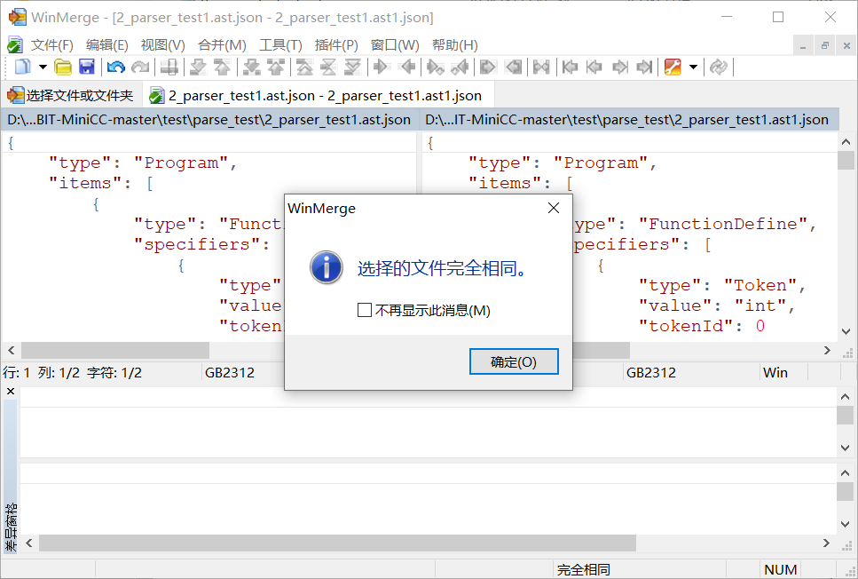

# Lab5  语法分析实验  

姓名/学号：宋尚儒/1120180717


## 实验目的

（1） 熟悉 C 语言的语法规则， 了解编译器语法分析器的主要功能；
（2）熟练掌握典型语法分析器构造的相关技术和方法，设计并实现具有一定复杂度和分析能力的 C 语言语法分析器；
（3）了解 ANTLR 的工作原理和基本思想，学习使用工具自动生成语法分析器；
（4） 掌握编译器从前端到后端各个模块的工作原理， 语法分析模块与其他模块之间的交互过程。 

 

## 实验内容

该实验选择 C 语言的一个子集，基于 BIT-MiniCC 构建 C 语法子集的语法分析器，该语法分析器能够读入词法分析器输出的存储在文件中的属性字符流，进行语法分析并进行错误处理，如果输入正确时输出 JSON 格式的语法树，输入不正确时报告语法错误。  


## 实验过程

本次实验采用递归下降分析法，手动编码实现语法分析器。


### 文法规范

将在实验4中的文法做进一步调整以适应本次实验说明中语法树定义的要求，最终完成非左递归文法的设计，详细文法可见附录，也可在源代码注释中查看，在此仅说明部分文法特性和关键点。


#### 主要特性

- 全局结构

  - 支持多函数定义声明，不支持全局变量声明

- 语句

  - 支持声明语句

  - 支持复合语句，由大括号包围
  - 支持选择语句，包括 if ,  if else, if else if ,不包括 switch
  - 支持循环语句，包括for语句的声明和赋值形式，不包括while和do while
  - 支持跳转语句，包括goto , break, continue, return 
  - 支持表达式语句

- 声明

  - 支持局部变量声明
  - 支持声明变量类型为多个，例如 signed int 
  - 不支持指针形式的变量声明
  - 支持普通变量声明
  - 支持数组变量声明，并且支持多维数组声明
  - 支持全局函数定义声明
  - 支持在一次声明中对多个变量进行声明与初始化
  - 支持初始化值为表达式
  - 支持初始化值为一维数组赋值式，但不支持多维数组赋值式

- 表达式

  - 支持 ’,‘ 分隔表达式为多个子表达式
  - 支持条件表达式
  - 支持不同优先级的二元表达式，具体算符优先级可以参考详细文法
  - 支持转换类型表达式
  - 支持一元表达式
  - 支持包含后缀的表达式，包括普通后缀、访问数组表达式、访问成员表达式、函数调用等，一个表达式可以支持多个后缀


#### 左递归性消除

以后缀表达式exp_postfix和声明符declarator为典型进行说明

- 声明符 declarator

  原存在左递归性的文法参考如下

  ```c
  declarator ->
  	identifier
      declarator '[' ']'
      declarator '[' exp_assign ']'
  ```

  消除左递归性后修改文法如下

  ```c
  declarator ->
  	 identifier post_declarator
  
  post_declarator ->
  	 e
  	|'[' ']' post_declarator
  	|'[' exp_assign ']' post_declarator
  ```

- 后缀表达式 exp_postfix

  原存在左递归性的文法参考如下

  ```c
  exp_postfix	->
  	 exp_pri
  	|exp_postfix '[' exp ']'
  	|exp_postfix '(' argument_exp_list ')'
  	|exp_postfix '(' ')'
  	|exp_postfix '.' identifier
  	|exp_postfix '->' identifier
  	|exp_postfix '++'
  	|exp_postfix '--'
  ```

  消除左递归性后修改文法如下

  ```c
  exp_postfix	->
  	exp_pri post_exp_postfix
  
  post_exp_postfix ->
       e
  	|'[' exp ']' post_exp_postfix
  	|'(' exp ')' post_exp_postfix
  	|'(' ')' post_exp_postfix
  	|'.' identifier post_exp_postfix
  	|'->' identifier post_exp_postfix
  	|'++' post_exp_postfix
  	|'--' post_exp_postfix
  ```


### 编码设计

需要设计可以输出规定格式的抽象语法树中间表示的语法分析器，具体的输出的表现形式时JSON格式分析文件和图形化的语法树。

关键实现类以及重要属性方法参考如下

```java
class ScannerToken{
	public String lexme;
	public String type;
	public int	  line;
	public int    column;
}

public class MyParser implements IMiniCCParser {
	//保存token结构的列表
	private ArrayList<ScannerToken> tknList;
	//记录当前扫描的token的id
    private int tokenIndex;
    //临时变量
	private ScannerToken nextToken;
	
    //主要运行函数
	@Override
	public String run(String iFile) 
	//判断是否是类型说明符
	private boolean IsSpecifier(String s) 
	//判断是否是赋值算符
	private boolean IsOperatorAssign(String s) 
	//判断是否是一元算符
	private boolean IsOperatorUnary(String s) 
	//载入tokens文件，生成tknList
	private ArrayList<ScannerToken> loadTokens(String tFile) 
	//根据当前的扫描到的token生成ASTToken节点，并指向下一token
    private ASTToken getToken() 
	//与终结符进行匹配，不匹配则报错
	public void matchToken(String type) 
	//生成根节点的递归子程序
	public ASTNode program() 
 	//若干递归子程序
    ...
}
```


#### 读取文件

需要读入词法分析生成的tokens文件，并将其转换成程序可以利用的形式。这一功能实际上已经在实例程序中很好地实现了，但是在对部分常量类型的终结符的值的转换上存在错误。比如对于整型常量 2 ，如果按照原程序的`loadTokens`函数进行识别，则对应的ScannerToken类的lexme属性会赋值为 "'2'"，实际上应该赋值为 "2"，故需要对`loadTokens`函数中一个语句做如下修改

```java
//原语句
st.lexme = segs[1].substring(segs[1].indexOf("=") + 1);
//修改后的语句
st.lexme = segs[1].substring(segs[1].indexOf("=") + 2,segs[1].length() - 1);
```


#### 语法树生成

语法树的生成与遍历依赖于antlr，实验要求的AST节点已经在`bit.minisys.minicc.parser.ast`中进行定义，但为了使得输出直观并且符合实验要求，需要修改已定义的AST节点，由于修改内容比较零散，故不在报告中说明，可在源码中详细查看。

完成AST节点的定义后，需要通过多个递归子程序来生成完整的语法树，生成完整语法树结构后即可通过antlr库的调用将该树以图形化的形式表现出来，并且生成规范的JSON格式文件，具体代码参考如下

```java
//通过program子程序生成语法树，并返回根节点
ASTNode root = program();
//遍历语法树并形成图形化界面
String[] dummyStrs = new String[16];
TreeViewer viewr = new TreeViewer(Arrays.asList(dummyStrs), root);
viewr.open();
//根据语法树生成输出文件
ObjectMapper mapper = new ObjectMapper();
mapper.writeValue(new File(oFile), root);
```


#### 代表性子程序

在之前的文法设计中消除了文法的做递归性，为递归下降分析器的设计提供了一定便利，但由于实验要求实现的语法树的节点定义与设计的文法存在一定的差异，最终生成的语法分析树和分析文件必须按照实验要求设计，故编码设计完成的对非终结符进行匹配的函数可能与递归下降分析器中的分析子程序存在一定差异。但就编码设计的大部分而言差异不大，设计思路存在共同之处，并且由于函数数量众多，仅挑选笔者认为有代表性的进行说明。

##### states

states作为复合语句中的语句序列，本应单由一系列语句生成，但是由于实验要求的节点定义中`ASTDeclartion`和`ASTStatement`都直接继承`ASTNode`，不方便将声明集成到语句中，故将语句分为普通语句和声明语句，根据句首是否是类型说明符判断语句类型。递归生成`ASTNode`列表的形式也非常符合递归下降分析器的特性。

```java
//states
//	state states
//	decl states
//	e
public ArrayList<ASTNode> states() {
	ArrayList<ASTNode> sl = new ArrayList<ASTNode>();
	nextToken = tknList.get(tokenIndex);
    //判断是否为复合语句末尾
	if(nextToken.type.equals("'}'")) {
		return null;
	}else {
		if(IsSpecifier(nextToken.type)) {
            //判断是声明语句
			ASTDeclaration s = decl();
			sl.add(s);
		}else {
            //判断是正常语句
			ASTStatement s = state();
			sl.add(s);
		}
        //递归生成后续的states
		ArrayList<ASTNode> sl2 = states();
		if(sl2 != null) {
			sl.addAll(sl2);
		}
		return sl;
	}
}
```

##### state

分支选择特征最为鲜明的子程序，并且由于大部分支首个非终结符的特征比较明显，整体结构非常清晰。

```java
//state
//	comp_state
//	select_state
//	iteration_state
//	return_state
//	break_state
//	continue_state
//	goto_state
//	exp_state
public ASTStatement state() {
    nextToken = tknList.get(tokenIndex);
    if(nextToken.type.equals("'{'")) {
        return compstate();
    }else if(nextToken.type.equals("'if'")) {
        return selectstate();
    }else if(nextToken.type.equals("'for'")) {
        return iterationstate();
    }else if(nextToken.type.equals("'return'")) {
        return returnstate();
    }else if(nextToken.type.equals("'goto'")) {
        return gotostate();
    }else if(nextToken.type.equals("'continue'")) {
        return continuestate();
    }else if(nextToken.type.equals("'break'")) {
        return breakstate();
    }else{
        return expstate();
    }
}
```

##### exp_assign

需要根据之后表达式范围中是否存在赋值运算符判断分支，但由于递归下降分析法存在的部分局限性，笔者在初次编写时面对诸如 exp_assign ’)‘ 这种形式无法做到准确识别，但类似形式由广泛存在于各类语句中（比如选择语句、循环语句），而exp_assign内部又是可以包含各类括号形式的，这一问题还未做到完美解决，但可以通过分别计算大括号、中括号、小括号的匹配数量来及时匹配exp_assign，对于常见情况（包括项目自带测试程序和笔者构建的部分极端用例）已经可以做到完全匹配。

以下方法虽然解决了问题，但也在一定程度上破坏了递归程序完整的美感。 

```java
//exp_assign
//	exp_con
//	exp_unary operator_assign exp_assign
public ASTExpression exp_assign() {
    int pos = 0;
    int cnt_small = 0;
    int cnt_middle = 0;
    int cnt_big = 0;
    while(tknList.size() > pos + tokenIndex &&
          !tknList.get(tokenIndex + pos).type.equals("','") &&
          !tknList.get(tokenIndex + pos).type.equals("';'")) {
        if(IsOperatorAssign(tknList.get(tokenIndex + pos).type)) {
            //判断是赋值运算符，则可认为是赋值语句
            ASTBinaryExpression be = new ASTBinaryExpression();
            //识别一元表达式
            ASTExpression exp1 = exp_unary();
            //识别算符
            ASTToken op = operator_assign();
            //识别下一层赋值表达式
            ASTExpression exp2 = exp_assign();
            be.expr1 = exp1;
            be.op = op;
            be.expr2 = exp2;
            be.children.add(exp1);
            be.children.add(exp2);
            be.children.add(op);
            return be;
        }else if(tknList.get(tokenIndex + pos).type.equals("'('")) {
            cnt_small++;
        }else if(tknList.get(tokenIndex + pos).type.equals("'['")) {
            cnt_middle++;
        }else if(tknList.get(tokenIndex + pos).type.equals("'{'")) {
            cnt_big++;
        }else if(tknList.get(tokenIndex + pos).type.equals("')'")) {
            cnt_small--;
        }else if(tknList.get(tokenIndex + pos).type.equals("']'")) {
            cnt_middle--;
        }else if(tknList.get(tokenIndex + pos).type.equals("'}'")) {
            cnt_big--;
        }
        if(cnt_small < 0 || cnt_middle < 0 || cnt_big < 0) {
            //任意一种括号出现不匹配情况
            break;
        }
        pos++;
    }
    //未能在语句范围内找到运算符，可认为是条件表达式递归
    return exp_con();
}
```

##### exp_logical_or / exp_logical_and

运算符存在优先级，exp_logical_or 和 exp_logical_and为二元运算中优先级最低和次低的表达式。为了根据优先级识别，防止出现二义性，需要对表达式进行分层递归匹配，以下方法很好地体现了对于一个表达式中存在不同算符时的匹配方式，更完整的优先级匹配方法可以在源码中查看。

```java
//exp_logical_or
//	exp_logical_and
//	exp_logical_and '||' exp_logical_or
public ASTExpression exp_logical_or() {
    //识别逻辑与表达式
    ASTExpression ela = exp_logical_and();
    if(tknList.get(tokenIndex).type.equals("'||'")) {
        //识别到 || ，可以认为该表达式为逻辑或表达式
        //匹配算符
        ASTToken op = getToken();
        ASTBinaryExpression elo = new ASTBinaryExpression();
        //匹配算符右侧的表达式，需要从逻辑或表达式开始匹配
        ASTExpression elo2 = exp_logical_or();
        elo.expr1 = ela;
        elo.expr2 = elo2;
        elo.op = op;
        elo.children.add(ela);
        elo.children.add(elo2);
        elo.children.add(op);
        //逻辑或表达式分支
        return elo;
    }else {
        //逻辑与表达式分支
        return ela;
    }
}

//exp_logical_and
//	exp_inclusive_or
//	exp_inclusive_or '&&' exp_logical_and
public ASTExpression exp_logical_and() {
    //识别兼或表达式
    ASTExpression eio = exp_inclusive_or();
    if(tknList.get(tokenIndex).type.equals("'&&'")) {
        //识别到 && ，可以认为该表达式为逻辑或表达式
        //匹配算符
        ASTToken op = getToken();
        ASTBinaryExpression ela = new ASTBinaryExpression();
        //匹配算符右侧的表达式，需要从逻辑与表达式开始匹配
        ASTExpression ela2 = exp_logical_and();
        ela.expr1 = eio;
        ela.expr2 = ela2;
        ela.op = op;
        ela.children.add(eio);
        ela.children.add(ela2);
        ela.children.add(op);
        //逻辑与表达式分支
        return ela;
    }else {
        //兼或表达式分支
        return eio;
    }
}	
```

##### exp_post / post_exp_postfix

后缀表达式原来的文法形式存在明显的左递归性，对左递归性消除后编码设计exp_post 和 post_exp_postfix子程序进行识别，可以完美实现递归识别过程。但是必须要注意的是，由于不同后缀的AST节点不同，并且存在不同属性，最终产生的语法树形式也不同与之前产生的列表形式，而是实际上是从后到前识别、从上到下生成节点，在实现上相对也比较困难。笔者最后调整了递归子程序的形式，允许向子程序传入参数，会在递归链的末端形成最终的后缀节点，将该结果作为返回值沿递归链传递给最初的函数，成功实现对后缀表达式的递归匹配算法。

```java
//exp_postfix
//	exp_pri post_exp_postfix
public ASTExpression exp_postfix() {
    //识别exp_pri
    ASTExpression epri = exp_pri();
    ASTExpression node = epri;
    //将exp_pre节点作为参数传给post_exp_postfix
    ASTExpression ep = post_exp_postfix(node);
    //将post_exp_postfix返回值作为最终识别结果
    return ep;
}

//post_exp_postfix
//	e
//	'[' exp ']' post_exp_postfix
//	'(' exp ')' post_exp_postfix
//	'(' ')' post_exp_postfix
//	'.' identifier post_exp_postfix
//	'->' identifier post_exp_postfix
//	'++' post_exp_postfix
//	'--' post_exp_postfix
public ASTExpression post_exp_postfix(ASTExpression node) {
    if(tknList.get(tokenIndex).type.equals("'['")) {
        //识别到 [ , 判断是数组访问表达式
        ASTArrayAccess aa = new ASTArrayAccess();
        ASTExpression arrayName = node;
        List<ASTExpression> elements = new ArrayList<ASTExpression>();
		
        matchToken("'['");
        //识别中括号内表达式
        elements = exp(); 
        matchToken("']'");
		
        //生成数组访问表达式节点
        //数组标识符为传入参数节点，成员为识别的中括号内表达式
        aa.arrayName = arrayName;
        aa.elements = elements;
        aa.children.add(arrayName);
        aa.children.addAll(elements);
		
        //将新生成的节点作为参数传入post_exp_postfix
        //将返回值返回上一级调用程序
        return post_exp_postfix(aa);
    }else if(tknList.get(tokenIndex).type.equals("'('")) {
        //识别到 ( , 判断是函数调用表达式
        ASTFunctionCall fc = new ASTFunctionCall();
        ASTExpression funcname = node;
        List<ASTExpression> argList = new ArrayList<ASTExpression>();

        matchToken("'('");
        if(!tknList.get(tokenIndex).type.equals("')'")) {
            //如果小括号内非空，识别小括号内表达式
            argList = exp(); 
        }

        matchToken("')'");

        //生成函数调用表达式节点
        //函数标识符为传入参数节点，成员为识别的小括号内表达式
        fc.funcname = funcname;
        fc.argList = argList;
        fc.children.add(funcname);
        if(argList != null)
            fc.children.addAll(argList);
		
        //将新生成的节点作为参数传入post_exp_postfix
        //将返回值返回上一级调用程序
        return post_exp_postfix(fc);
    }else if(tknList.get(tokenIndex).type.equals("'.'") ||
             tknList.get(tokenIndex).type.equals("'->'")) {
        //识别到 . 或 -> , 判断是成员访问表达式
        ASTMemberAccess ma = new ASTMemberAccess();
        ASTToken op = getToken();
        ASTExpression master = node;
        ASTIdentifier member = new ASTIdentifier();
		
        //识别属性标识符
        nextToken = tknList.get(tokenIndex);
        member.tokenId = tokenIndex;
        member.value = nextToken.lexme;
        matchToken("Identifier");
		
        //生成成员访问表达式节点
        //成员标识符为传入参数节点，属性为识别的属性标识符
        ma.master = master;
        ma.member = member;
        ma.op = op;
        ma.children.add(master);
        ma.children.add(master);
        ma.children.add(master);

        //将新生成的节点作为参数传入post_exp_postfix
        //将返回值返回上一级调用程序
        return post_exp_postfix(ma);
    }else if(tknList.get(tokenIndex).type.equals("'++'") ||
             tknList.get(tokenIndex).type.equals("'--'")) {
        //识别到 ++ 或 -- , 判断是普通后缀表达式
        ASTPostfixExpression pe = new ASTPostfixExpression();
        ASTExpression expr = node;
        ASTToken op = getToken();
		
        //生成普通后缀表达式节点
        //表达式标识符为传入参数节点，操作符为识别的操作符
        pe.expr = expr;
        pe.op = op;
        pe.children.add(expr);
        pe.children.add(op);

        //将新生成的节点作为参数传入post_exp_postfix
        //将返回值返回上一级调用程序
        return post_exp_postfix(pe);
    }else {
        //无法继续匹配
        //终止递归，将传入的参数返回给上级调用程序
        return node;
    }
}
```


### 实验结果

测试文件为`BIT-MiniCC/test/parse_test`目录下的多个c语言原文件，结果展示将分两步，首先以文件`3_parser_test2.c`为例展示实验语法分析程序产生的语法树和JSON文件部分形式；然后会使用文本对比工具WinMerge对比实验程序和内置程序生成的JSON文件。

运行实验程序时项目配置文件关键信息如下


#### 示例程序的语法树和JSON文件展示

下图为实验程序对`3_parser_test2.c`文件生成的语法树，该树型结构可以完整表达该文件的语法


下图展示生的JSON文件的部分内容


#### 对比分析

分别使用实验程序和内置程序对三个测试文件进行语法分析生成JSON文件，实验程序生成的文件保存后缀为`.ast1.json`，内置程序生成的文件保存后缀为`.ast.json`，使用WinMerge工具进行文本对比工作

结果如下（左为内置程序结果，右为实验程序结果）

- 2_parser_test1.c

  

- 3_parser_test2.c

  

- 4_parser_test3.c

  

可以看到，对于以上三个测试文件， 内置程序和实验设计的程序语法分析结果完全相同。


## 实验心得体会

在选择这次实验具体采用的分析方法时，笔者是非常矛盾的。如果直接采用antlr生成语法分析器，则不能充分利用之前编写的词法分析器；又比较缺乏构建LL、LR分析器的经验，难以将这类分析器很好地嵌入到实验的框架中；递归下降分析法主体思路成熟，但具体到细节的分析又显得芜杂，并非是一种通用的分析方法。经过多方面考虑最终选择递归下降分析法，完整地实现了语法分析的过程，并将实现的语法分析器与之前实现的词法分析器较好地对接。

本次实验实现的语法分析器还有很多可以完善的地方，首先就是更进一步完善文法并在此基础上做到更充分的语法分析，其次就是完善错误处理，在本实验中只实现了最基础的错误处理。


## 附录

### 详细文法

```java
program ->
	 func_list
    
func_list ->
	 def_func func_list
	|e
    
def_func ->
	 specs declarator '(' arguments ')' comp_state
    
specs ->
	 type_spec specs
	|e
    
type_spec ->
	 void | char | short | int | long | float | double | signed | unsigned
    
arguments ->
	 arg_list
	|e
    
arg_list ->
	 arg ',' arg_list
	|arg
    
arg ->
	 specs declarator
    
comp_state ->
	 '{' states '}'
    
states ->
	 state states
	|decl states
	|e
    
decl ->
	 specs init_declarator_list ';'
    
init_declarator_list ->
	 init_declarator
	|init_declarator ',' init_declarator_list
    
init_declarator ->
	 declarator
	|declarator '=' initializer
    
declarator ->
	 identifier post_declarator
    
post_declarator ->
	 e
	|'[' ']'	post_declarator
	|'[' exp_assign ']' post_declarator
    
initializer ->
	 exp_assign
	|'{' exp '}'
    
state ->
	 comp_state
	|select_state
	|iteration_state
	|return_state
	|break_state
	|continue_state
	|goto_state
	|exp_state
    
exp_state ->
	 exp ';'
	|';'
    
select_state ->
	 'if' '(' exp ')' state
	|'if' '(' exp ')' state else state
        
iteration_state ->
	 'for' '('   exp_state exp_state exp  ')' state
	|'for' '('   exp_state exp_state  ')' state
	|'for' '('   decl exp_state exp  ')' state
	|'for' '('   decl exp_state   ')' state
        
goto_state ->
	 'goto' identifier ';'
        
return_state ->
	 'return' assign_exp ';'
	|'return' ';'
        
continue_state ->
	 'continue' ';'
        
break_state ->
	 'break' ';'
        
exp ->
	 exp_assign , exp
	|exp_assign
        
exp_assign ->
	 exp_con
	|exp_unary operator_assign exp_assign
        
operator_assign ->
	 = | *= | /= | %= | += | -= | <<= | >>= | &= | ^= | |=
        
exp_con ->
	 exp_logical_or
	|exp_logical_or '?' exp ':' exp_con
        
exp_logical_or ->
	 exp_logical_and
	|exp_logical_and '||' exp_logical_or
        
exp_logical_and ->
	 exp_inclusive_or
	|exp_inclusive_or '&&' exp_logical_and
        
exp_inclusive_or ->
	 exp_exclusive_or
	|exp_exclusive_or '|' exp_inclusive_or
        
exp_exclusive_or ->
	 exp_and
	|exp_and '^' exp_exclusive_or
        
exp_and ->
	 exp_equality
	|exp_equality '&' exp_and
        
exp_equality ->
	 exp_relational
	|exp_relational '==' exp_equality
	|exp_relational '!=' exp_equality
        
exp_relational ->
	 exp_shift
	|exp_shift '<' exp_relational
	|exp_shift '>' exp_relational
	|exp_shift '<=' exp_relational
	|exp_shift '>=' exp_relational	
        
exp_shift ->
	 exp_additive
	|exp_additive '<<' exp_shift
	|exp_additive '>>' exp_shift
        
exp_additive ->
	 exp_multiplicative
	|exp_multiplicative '+' exp_additive
	|exp_multiplicative '-' exp_additive
        
exp_multiplicative ->
	 exp_cast
	|exp_cast '*' exp_multiplicative
	|exp_cast '/' exp_multiplicative
	|exp_cast '%' exp_multiplicative
        
exp_cast ->
	 exp_unary
	|'(' specs ')' exp_cast
        
exp_unary ->
	 exp_postfix
	|operator_unary exp_cast
        
operator_unary ->
     & | * | + | - | ~ | ! | ++ | -- | sizeof
        
exp_postfix ->
	 exp_pri post_exp_postfix
        
post_exp_postfix ->
	 e
    |'[' exp ']' post_exp_postfix
	|'(' exp ')' post_exp_postfix
	|'(' ')' post_exp_postfix
	|'.' identifier post_exp_postfix
	|'->' identifier post_exp_postfix
	|'++' post_exp_postfix
	|'--' post_exp_postfix
        
exp_pri ->
	|identifier
	|IntegerConstant
	|FloatingConstant
	|CharacterConstant
	|StringLiteral
	|'(' exp_assign ')'
```
