# 编译原理

## 绪论

主要讨论的内容：

- 程序设计语言与编译器
- 词法分析
- 语法分析
- 语义分析与中间代码生成
- 目标代码生成
- 代码优化
- 编译技术应用

## 编程语言

### 语言发展历史

> 程序语言是用于计算方法描述的表示和标识方法

1940年代，机器语言登上了历史舞台，它完全用0和1表示。1950年代早期，由于机器语言过于难以使用，汇编语言产生了。汇编语言和机器语言是等价的，并且完全对应于某一个指令系统。1950年代后期，高级程序设计语言诞生。最早的是语言FORTRAN，同期的还有COBOL、LISP等。

从演化上讲，语言分成很多代：

1. 第一代语言，机器语言
2. 第二代语言，汇编语言
3. 第三代语言，高级语言（Fortran, Cobol, Lisp, C, C++, C#, Java）
4. 第四代语言，特定领域语言（SQL）
5. 第五代语言，Prolog

### 语言分类

语言分类有很多标准。

（1）以描述方式分类

可以分为命令式语言和声明式语言：

- 命令式：编程告诉计算机要如何完成工作，如面向过程和面向对象语言
- 声明式：编程告诉计算机要完成哪些工作，如函数式语言和逻辑编程语言

（2）以类型分类

- 静态类型：运行前类型检查，如C++/Java
- 动态类型：运行时类型检查，如Python/Ruby
- 强类型：不允许隐式数据类型转换
- 弱类型：允许隐式数据类型转换

（3）以实现方式分类

- 编译型
- 解释型

（4）以应用领域分类

- 科学计算
- 商业应用
- 系统编程

## 编译器简介

### 编译器定义

> 将一种程序设计语言写的程序翻译成等价的另一种语言的程序的程序，称之为编译程序。

例如，C语言Hello World通过编译器转换为机器可识别的二进制代码。要注意的是，经过编译之后，功能与行为保持一致。

有如下定义：

- 源语言：编译器输入程序的描述语言，一般是高级程序设计语言
- 源程序：编译程序的输入程序
- 目标语言：目标语言的描述语言
- 目标程序：经过编译后生成的程序
- 宿主语言：编译器的实现语言
- 宿主机：编译器的运行环境

编译器有两类，解释执行和编译执行。


解释型的优点在于改动方便、运行迅速，但性能会更差；编译型的优点在于性能较强。

Java比较特殊。Java首先会编译为字节码，然后再由JVM进行解释，这主要是为了跨平台考量。因此JVM也使用了很多方式来优化，比如JIT将热代码进行预翻译再执行。类似的，微软为了在指令集之间的相互兼容，引入了.Net Framework，生成可执行程序之后实际上是类似java字节码的中间代码，进而匹配到机器特点取得更好的性能加速。

以C语言为例，C编译器的过程是

- 预处理阶段，例如头文件引入、注释删除等
- 编译阶段，形成汇编中间代码
- 链接阶段，合并、整合汇编程序

### 编译器表示

三种表示方法：

函数表示 $T=C(S)$，C是编译器


T形图可以联立表示。例如，A机器上已经存在的L语言的编译程序移植到B程序上，那么在A机器上有一个A语言的A语言到L语言编译器。现在构造一个L语言编译器，输入L语言，输出B语言。两个进行联立，就有一个L语言实现的A语言到B语言编译器。再拿L语言到B语言的编译器进行编译，就得到了L语言实现的B语言到B语言的编译器。


### 编译器典型结构


- 词法分析的任务是对输入的符号串进行加工处理，输入字符串，输出属性字流（token）
- 语法分析是依据语言的语法规则，对词法分析结果进行语法检查，并识别单词序列对应的语法范畴，结果表示为语法树（syntax tree）
- 语义分析是基于语言文本进行语义检查与处理，直到翻译成等价的某种中间代码或目标代码。
- 代码优化是为了改进目标代码质量，进行加工变化，得到更高效的目标代码，再运行时间和存贮空间上形成优化。
- 目标代码生成是考量机器本身的指令集，生成期望的目标代码程序。
- 表格管理是编译程序的公共辅助程序，对各种量进行管理，处理时查表
- 出错处理是编译程序的公共辅助程序，对错误检查、定位、定性、报告

### 遍的概念

对源程序或中间形成从头到尾扫描一遍，称为一遍。

### 常见编译器结构

（1）一遍扫描的编译程序结构模型

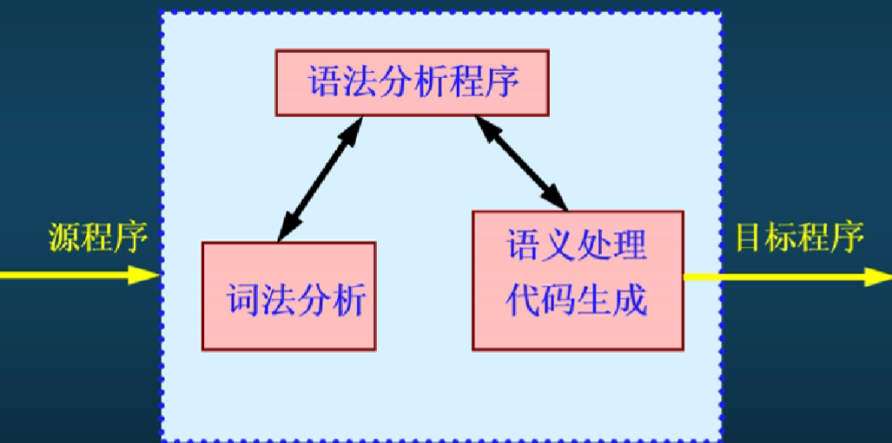

省略了中间代码生成和代码优化，一般是语法分析程序驱动的，词法分析和语义分析是被动的。

（2）AHPL模拟器（两遍扫描）

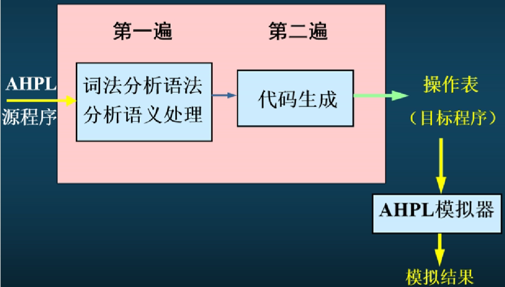

（3）PDP-11C 编译器结构模型

三段式的结构，优化主要针对目标机

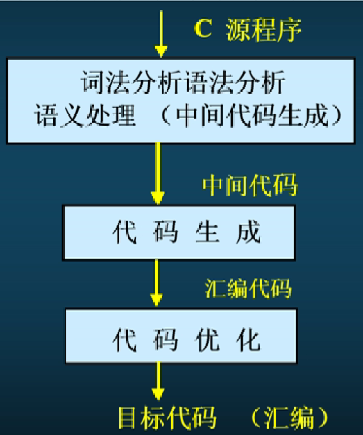

（4）GCC


高级程序都转换为RTL的中间语言，后端则支持很多的处理器架构。问题是GCC上堆积代码很多，后续优化比较困难。

（5）LLVM

三段处理结构


## 词法分析

### 概览

词法分析的基本功能是：

- 接收字符串形式的源程序
- 按照输入次序依次扫描源程序
- 扫描同时根据词法规则识别有独立意义的单词
- 产生与源程序等价的属性字（Token）流

比如下面的片段：

```c
[{]
    [int] [int1][;]
    [int1] [=] [33][;]
    [printf][(]"[int1 = %d\n]"[,] [int1][)][;]
[}]
```

就会分割成诸多单词。为了制造这种分割，必须从正规式出发建立有限自动机。

### 正规式与正规集

>  Definition 2.1 字母表
>
> 非空有穷集合，其元素称为符号，用希腊字母$\Sigma$表示。

> Definition 2.2 字符串
>
> 由字母表中的符号连接成的有穷序列。

> Definition 2.3 字符串的集合$\Sigma^*$
>
> i) $\varepsilon \in \Sigma^*$
>
> ii) $\alpha \in \Sigma^* \wedge a \in \Sigma \Rightarrow \alpha a \in \Sigma^*$
>
> iii) $\alpha \in \Sigma^*$当且仅当$\alpha$由有限步i)与ii)产生

> Definition 2.4 串长度
>
> $\alpha$有$m$个符号，称$\alpha$长度为$m$，记为$|\alpha|=m$。特殊的，$|\varepsilon|=0$。

> Definition 2.5 串的前缀、后缀、子串、真前缀、真后缀、真子串、子序列
>
> 略去

> Definition 2.6 语言上的运算
>
> - 并 $L \cup M = \{s \mid s \in L \vee s \in M\}$
> - 连接 $LM = \{st \mid s \in L \and t \in M\}$
> - Klenne闭包 $L^* = \bigcup^{\infty}_{i=0} L^i$ 
> - 正闭包 $L^+ = \bigcup_{i=1}^{\infty} L^i$ ，相当于 $L^* - \varepsilon$，除非$\varepsilon \in L$

这里要注意的是，$\emptyset \ne \{\varepsilon\}$。$\emptyset A = A\emptyset = \emptyset$，但$A\{\varepsilon\}=\{\varepsilon\}A=A$。

下面定义正则表达式。正则表达式是归纳定义的：

> Definition 2.7 正则表达式
>
> 归纳基础：
>
> 1. $\varepsilon$为正则表达式
> 2. $a$是$\Sigma$上的一个符号，则$\mathbf{a}$是正则表达式，且$L(\mathbf{a})=\{a\}$。
>
> 归纳步骤：假设$r,s$是正则表达式，表达语言$L(r)$与$L(s)$，那么
>
> 1. $(r) \mid (s)$是正则表达式，表达$L(r) \cup L(s)$
> 2. $(r)(s)$是正则表达式，表达$L(r)L(s)$
> 3. $(r)^*$是正则表达式，表示$(L(r))^*$
> 4. $(r)$是正则表达式，表示$L(r)$，也就是括号不改变正则表达式。

为了更方便的表示正则表达式，我们引入正则定义：

> Definition 2.8 正则定义
>
> $d_1 \to r_1, d_2 \to r_2 , \cdots , d_n \to r_n$
>
> 其中$d_i$是不在$\Sigma$上的新符号，$r_i$是$\Sigma \cup \{d_1\cdots d_{i-1}\}$的正则表达式。

例如，

```
letter_ -> A | B | ... | Z | a | b | ... | z |
digit -> 0 | 1 | ... | 9
id -> letter_ (letter_ | digit)*
```

这是C语义的标识符。再比如，

```
digits -> digit digit*
optionalFraction -> . digits | ε
optionalExponent -> ( E ( + | - | ε ) digits) | ε
number -> digits optionalFraction optionalExponent
```

在此基础上，正则表达式定义了一系列扩展：

- 一个或多个实例符号+，$r^* = r^+ \mid \epsilon$，$r^+=rr^*$
- 零个或一个实例符号?，$r?=r\mid \epsilon$
- 字符类，$[abc]$或$[a-c]$是 $a|b|c$ 的缩写

### DFA

略（

#### 最小化

DFA可能存在两个状态：

- 无关状态：从初始状态出发，任何输入序列都不能到达的状态
- 等价状态

例如，下面的情况：

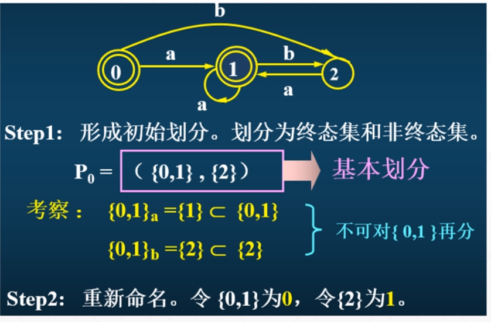

由于0、1两个状态对a和b的响应是相同的，输入a二者都进入终态，输入b二者都进入非终态。而串都是a和b构成的，所以任意长度字符串都不能区分0和1.这样建立的新DFA如下：


划分法的具体描述如下：

1. 形成初始划分$\pi = \{Z, K-Z\}$
2. 对于$\pi = \{I_1,\cdots,I_m\}$，每个状态集考察是否可以划分，可划分则形成新的划分
3. 直到不可划分为止

#### 正规式与FA等价性

有定理：

$\Sigma$上的单词集$V \in \Sigma^*$是正规的当且仅当存在$\Sigma$上的DFA M，使得$V = L(M)$。

其构造是使用一些特定规则。

从FA转RE：FA可以递归式的收缩，通过以下的三种子图


但是为了更好的描述，还需要进行拓广，加上辅助节点：

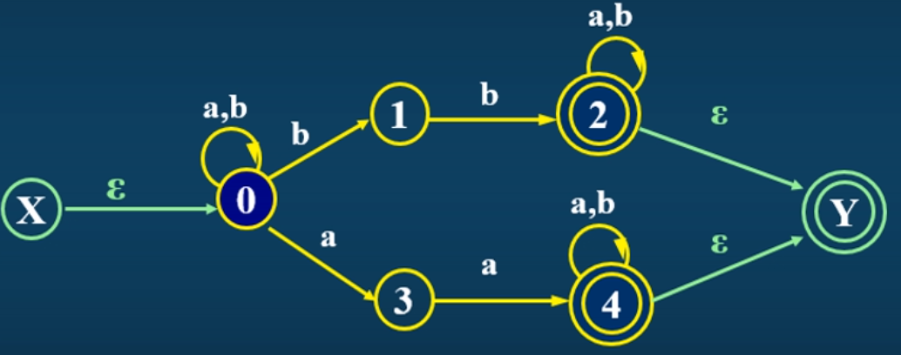

可以转换为$\varepsilon (a|b)^*((bb(a|b)^*\varepsilon)|(aa(a|b)^*\varepsilon))$，简化一下就是$(a|b)^*(aa|bb)(a|b)^*$。优先级顺序是闭包连接或。

正规式转FA的过程其实是完全倒过来的：

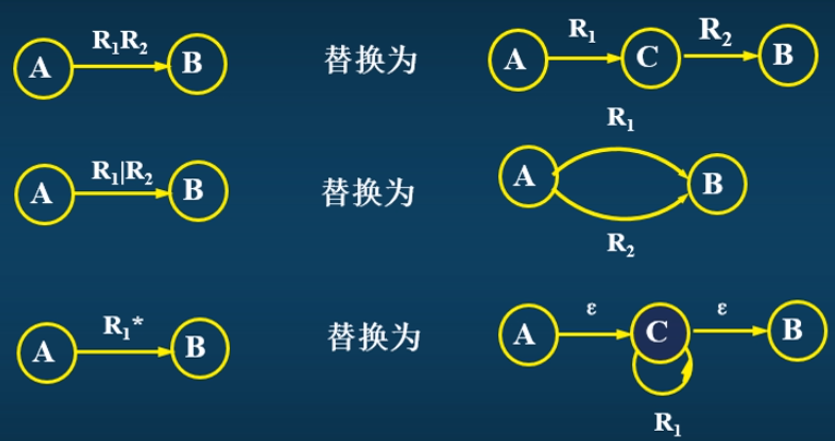

所以对于上面的例子，


当然还可以进行一些替换：


然后还需要把NFA转换为DFA，并进行最小化。

### 词法分析的设计与实现

在程序中，常见的单词有：

- 关键字，标识语句的特性
- 标识符，表示各类名字，如变量名、数组名、结构名、函数名
- 常量，如整型常数、实型常数、不同进制常数、布尔常数、字符串常数
- 运算符，如+-\*/\*\*\<=>=\<>++?:&%=
- 界限符，逗号、分号、括号、单双引号

此外，还有非单词成分和预处理成分，如include、define、注释等。

得到的结果我们用Token来表达。对于标识符和常量，需要一个类码和符号表；对于关键字、运算符和界限符，则主要是类码。

早期的输入组织使用对半互补缓冲区，这是由于内存不足导致的，现在一般不需要。

## 语法分析

### Overview

语法分析的主要作用是，从左往右扫描Token流，按照语法规则识别语句结构，输出语法树或语法错误信息。

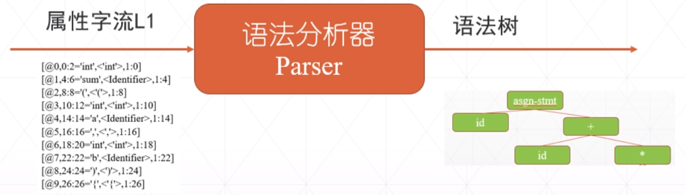

语法分析主要用到两个内容：

- 上下文无关文法，用来描述合法程序的结构
- LL、LR分析器，用来判别输入程序是否符合给出结构

语言有语法和语义两个要素，语法是句子的结构，语义是句子的含义。语言是单词按照规则组成句子，表达特定意思。

### 语法

我们先来一个感性理解。假设有一个语法规则：

```
<句子>  ->  <主语>  <谓语>
<主语>  ->  <形容词> <名词>
<谓语>  ->  <动词>  <宾语>
<宾语>  ->  <形容词>  <名词>
<形容词>  ->  小 | 大
<名词>  ->  八哥 | 花生
<动词>  ->  吃
```

这种表示方法就叫做巴科斯-诺尔范式（BNF）。这种范式有三种元语言符号：

- `<>`表示语法成分
- `-> / ::=` 表示定义
- `|` 表示相同左部产生的规则

这样，对于“小八哥吃大花生”规约如下：

```
<句子>	   =>  <主语><谓语>
			=>  <形容词><名词><谓语>
			=>  <小><名词><谓语>
			=>...
			=> 小八哥吃大<名词>
			=> 小八哥吃大花生
```

这就是自上而下的分析：


问题在于，我们的规则只有十条。但对于上百条规则，候选项可能很多，其全部组合也很多，那么对于多候选项的情况，效率就会受到影响。

也可以反过来，自下而上：


对于长句来说，我们必须找到子串来找到规则映射，这个时候就可能出现规则冲突，同时搜索子串的复杂度也很高。

下面我们形式化的定义文法。

> Definition 3.1 文法
>
> 一部文法$G$是一个四元组，$G=(V_N, V_T, S, P)$：
>
> - $V_N$：非空有限的非终结符号集，一般用大写字母表示
> - $V_T$：非空有限的终结符号集，一般用小写字母表示
> - $S$：文法的开始符号，也称公理，$S \in V_N$，代表语言最终的语法范畴
> - $P$：有限产生式集
>
> 设$V$是$G$的符号集，那么$V = V_T \cup V_N$，且$V_T \cap V_N = \emptyset$。

一部文法的实体称为产生式。产生式是一定格式书写的定义语法范畴的文法规则，有$P \to \alpha$的形式。

在上面的小八哥吃花生的例子中，$S$就是句子，$V_N$是句子、主语、谓语、并于、形容词、名词、动词，$V_T$是小、大、八哥、花生、吃，$P$则是定义式本身。

再比如，一个简单的算术表达式可以表示为下面的语法：
$$
\{\{E\}, \{i,+,\times,(,)\}, E, \{E\to i\mid i+i\mid i\times i \mid (E)\}\}
$$
根据文法，就可以形式性的定义语言：

> Definition 3.2 语言
>
> 给定文法$G$，从$G$的开始符号$S$出发，反复使用产生式对非终结符进行替换，最后得到的终结符号串的全体即为文法$G$所描述的语言$L(G)$。

例如，下面是一个文法和语言的例子：


> Definition 3.3 推导、推导序列、最左（右）推导
>
> 若$V=\alpha A\beta \Rightarrow \alpha\gamma \beta =W$，当且仅当$P$种存在规则$A \to \gamma$，称$V$直接推导出$W$，记作$V\Rightarrow W$
>
> 若$\exists V=a_0 \Rightarrow \alpha_1, \alpha_1 \Rightarrow \alpha_2, \cdots, \alpha_{n-1} \Rightarrow \alpha_n=W$，则$V$经过$n$步可以推导出$W$，记作$V\Rightarrow^+ W$；若$V\Rightarrow^+ W \vee V = W$，记作$V \Rightarrow^* W$。其中的$\alpha_0\cdots \alpha_n$称为直接推导序列。
>
> 设文法$G[S]$，若$S \Rightarrow^* \alpha (\alpha \in V^*)$，则$\alpha$为$G[S]$的句型；若$S \Rightarrow^* \alpha(\alpha \in V_T^*)$，则$\alpha$为$G[S]$的句子。
>
> 在推导过程中，总是对句型中的最左（右）非终结符进行替换，称为最左（右）推导。最右推导也称规范推导，仅由规范推导得到的句型是规范句型。其逆序为规范规约。

例如，


递归可以增强文法的表现能力。

> Definition 3.4 递归，左递归，右递归，直接递归，间接递归
>
> 若$A \to \gamma$是$G$的产生式，$\gamma \Rightarrow^* \alpha A \beta$，则称$G$是递归文法。特别的，若$\gamma = \alpha A \beta$，则为直接递归文法；若$\gamma \Rightarrow^+ \alpha A \beta$，则为间接递归文法。若$\alpha = \varepsilon$，则为左递归文法；$\beta = \varepsilon$，则$G$为右递归文法。

文法产生的是语言。

> Definition 3.5 语言、文法的等价
>
> 文法$G$产生的语言$L(G)$为
> $$
> L(G) = \{\alpha \mid \alpha \in V_T^* \wedge S \Rightarrow \alpha^+\}
> $$
> 若$L(G)=L(G')$，则称$G,G'$等价。

下面举一例。想要生成$\{a^mb^nb^na^m \mid m > 0, n \ge 0\}$，可以用下面的文法：
$$
S \to aSa \mid aBa, B \to bBb \mid \varepsilon
$$
在原来的BNF基础上，我们引入了EBNF来扩展BNF的表示能力。它引入了下面的元符号：

- 花括号。$\{S\}_a^b$表示$S$出现a到b次。
- 圆括号。例如，$xa | xb$可以表示为$x(a|b)$。
- 方括号。表示出现0-1次。

语言可以用语法树来表示。语法树和文法有下面对应关系：

- 根节点对应$S$
- 中间节点对应$V_N$
- 叶节点对应$V_T$
- 结点间关系为$G$的产生式规则

一棵语法树包含了一个队形所有的可能推导过程。例如，

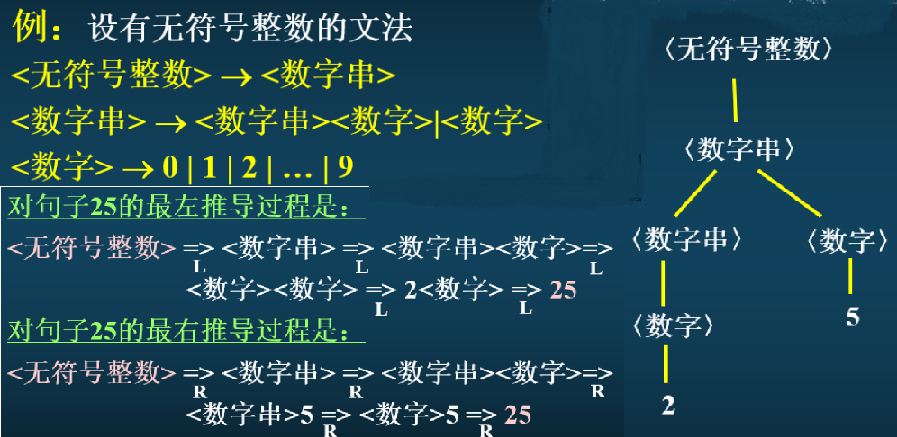

语言可能存在二义性。具体来说，

> Definition 3.6 二义性
>
> 对于文法$G$，存在一个句子有两棵不同的语法树，则称句子是二义的。

例如，下面的文法：

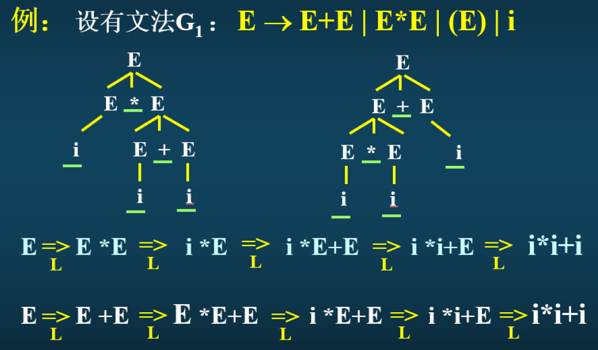

对于上面的分析树，可以通过构造运算律来消除二义性。

Chomsky把文法分成四类：

- 0型文法，不加任何限制

  $\alpha \to \beta, \alpha ,\beta \in (V_T \cup V_N)^*$。对应的语言是$L_0$，与图灵机等价。

- 1型文法，上下文有关文法

  $\alpha A \beta \to \alpha \gamma \beta$，$A \in V_N, \alpha,\beta \in (V_T\cup V_N)^*$，$\gamma \in (V_T \cup V_N)^+$。对应的语言是$L_1$，由线性有界自动机来识别。

- 2型文法，上下文无关文法

  $A \to \alpha, A \in V_N, \alpha \in (V_T \cup V_N)^*$。对应的语言是$L_2$，由非确定下推自动机识别。

- 3型文法，正则文法

  $A \to aB$或$A \to a$，$A,B \in V_N, a \in V_T$，由DFA识别。

### 语法分析器

语法分析器的功能是根据源语言的文法，识别出相应的语法范畴，同时进行语法检查。语法分析器有三个构造要素：

- 处理对象：源程序串
- 分析依据：源语言文法$G$
- 分析结果：识别出的语法范畴表示

语法分析方法也自然而然分为两雷：

- 自上而下的语法分析方法。给定$G$和源程序串\$，从G的开始符号S出发，反复用产生式对非终结符进行替换，逐步推导出$。对应的语法树就是从左到右的叶节点顺序。
- 自下而上的语法分析方法。从给定的输入串$开始，不断寻找子串与文法中某个产生式P的候选式进行匹配，并用P的左部代替，逐步规约到S。

### 自顶向下的分析方法

自顶向下的分析一般遵循递归法则。考虑下面的过程：

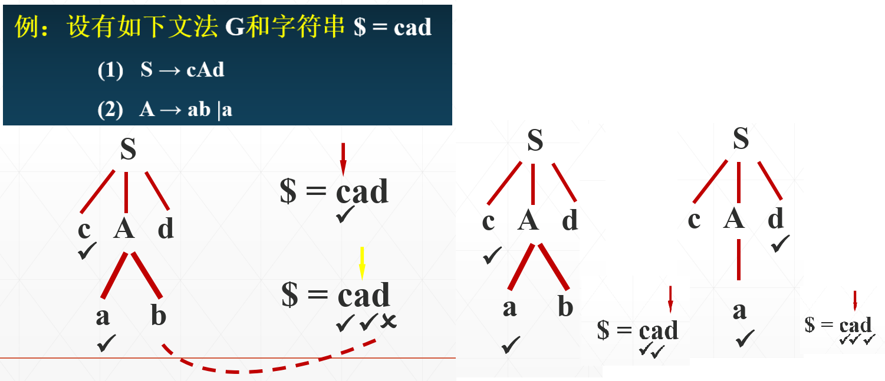

问题在于，考虑下面的文法：
$$
G: I \to I0 \mid Ia \mid a
$$
那么在产生语法分析树的时候，会产生死递归，不断产生新的左子树。类似于这种$A \to A\gamma$的文法我们就称为**直接左递归**，需要进行消除。一般地，对于下面的文法
$$
A \to A\gamma \mid \zeta
$$
那么对应的消除后左递归为
$$
\begin{aligned}
A & \to \zeta A'\\ A' &\to \gamma A' \mid \varepsilon 
\end{aligned}
$$

> 对于简单表达式文法$G(E)$，$E \to E + E \mid E * E \mid (E) \mid i$
>
> 首先消除二义性，得到
> $$
> \begin{aligned}
> E &\to E + T \mid T \\ T &\to T * F \mid F \\ F &\to (E)\mid i
> \end{aligned}
> $$
> 进一步的，消除左递归：
> $$
> \begin{aligned}
> E &\to TE' \mid T \\ E' &\to +TE' \mid \varepsilon \\ T &\to FT' \\ T' &\to * FT' \mid \varepsilon \\ F &\to (E)\mid i
> \end{aligned}
> $$

对上面的规则进行推广，对于规则
$$
P \to P\alpha_1 \mid P\alpha_2 \mid \cdots \mid P\alpha_n \mid \beta_1 \mid \beta_2 \mid \cdots \mid \beta_n
$$
其中，$\alpha_i \ne \varepsilon, \beta_i$不以$P$开头，则可以进行改写：
$$
\begin{aligned}
P & \to \beta_1 P' \mid \beta_2 P' \mid \cdots \mid \beta_n P'\\ P' &\to \alpha_1 P' \mid \alpha_2 P'\mid \cdots \mid \alpha_n P'  \mid \varepsilon 
\end{aligned}
$$
上面揭示的情形是直接左递归，但我们仍然存在间接左递归的情形。例如，
$$
A \to Ba \mid a, B \to Cb \mid b, C \to Ac\mid c
$$
我们可以做如下推导：
$$
A \Rightarrow Ba \Rightarrow Cba \Rightarrow Acba
$$
同理对B、C，这样就出现了直接左递归。

一般的，有如下算法可以消除掉所有的左递归：

```
① 对于G的非终结符，按照任一种顺序排列，例如A1,A2,...,An
② 进行遍历
for i = 1 .. n
	for j = 1 .. i-1
		对于Ai -> Aj γ，进行改写：
		Ai -> δ1γ | δ2γ | ... | δkγ
		其中，Aj -> δ1 | δ2 | ... | δn
		消除掉规则Ai的直接左递归
③ 去掉多余规则
```

> 例如，还是刚才的例子：
> $$
> A \to Ba \mid a, B \to Cb \mid b, C \to Ac\mid c
> $$
> 排序为$C,B,A$，那么对于$B$，将C带入后变为
> $$
> B \to Acb \mid cb \mid b
> $$
> 然后再带入$A$，得到
> $$
> A \to Acba\mid cba \mid ba \mid a
> $$
> 按照规则进行消除，得到
> $$
> A \to cbaA' \mid baA' \mid aA', A' \to cbaA' \mid \varepsilon
> $$

下一个任务是消除回溯。对于不含左递归的上下文无关文法，我们定义终结首符集FIRST($\alpha$)：
$$
\text{FIRST}(\alpha) = \{a \mid \alpha \Rightarrow a.* ,a \in V_T \}
$$
特别的，若$\alpha \Rightarrow \varepsilon$则$\varepsilon \in \text{FIRST}(\alpha)$。

如果$A \to \alpha_1 \mid \alpha_2 \mid \cdots \mid \alpha_n$，每个候选式不存在$\alpha_i \Rightarrow \varepsilon$且$\text{FIRST}(\alpha_i)$两两不相交，则不出现回溯。例如，下面的文法
$$
S \to Ap \mid Bq, A \to a \mid cA, B \to b \mid dB
$$
有
$$
\text{FIRST}(Ap) = \{a,c\}, \text{FIRST}(Bq) = \{b,d\}
$$
二者交集为空集。所以递归可以从S出发，这样不会出现冲突。

反过来，如果存在公共FIRST，即
$$
A \to \delta_1 \beta_1 \mid \cdots \mid \delta_1 \beta_n \mid \delta_2 \alpha_1 \mid \cdots \mid \delta_2 \alpha_n \mid \cdots
$$
那么，就把每个公因子提出，变换为
$$
\begin{aligned}
A &\to \delta_1 A' \mid \delta_2 A'' \mid \cdots \\
A' &\to \beta_1 \mid \cdots \mid \beta_n \\
A'' &\to \alpha_1 \mid \cdots \mid \alpha_m
\end{aligned}
$$
有上面作为基础，我们就可以建立递归下降分析器。下面以简单表达式的例子来说明它的变化过程。


这就是LL(1)方法。第一个L表示扫描自左向右，第二个L表示推导方式是最左推导，(1)表示分析中最多向前看1个输入字符。它的分析器是一个字符串输入，根据一个总控程序即LL(1)分析表，建立一个分析栈得到结果。

- 分析栈：存放分析过程中的文法符号
- 分析表：存放一系列预测分析函数，从$V_N$到$V_T$
- 总控程序

总控程序的过程如下：

1. 初始化
2. 如果当前分析栈顶$X$和$a_i$都是终结符号，
   - $X=a_i=\#$，分析成功
   - $X=a_i \ne \#$，将 $X$ 从分析栈退掉，$p$ 指向下一个字符
   - $X \ne a_i$，表示不匹配的出错情况
3. 若$X \in V_N$，则查分析表，此时对$M(X,a_i)$
   - 若$M(X,a_i)$是一个产生式规则，将$X$从栈中弹出并将规则右部符号按倒序推进栈
   - $M(X,a_i)$是空白，表示出错，调用语法出错处理子程序

举个例子。对于刚刚那个经典的表达式，我们可以构造表如下：

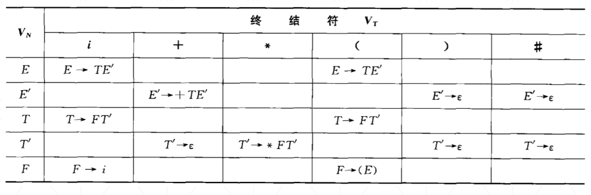

然后执行递归过程：


所以问题就来到了分析表：表是如何构建的？

**规则1** 对文法$G$，若$G$中产生式形如$A \to \alpha$且不存在$\alpha \Rightarrow \varepsilon$，则当$a \in \text{FIRST}(\alpha)$，$M(A,a) = \{A\to a\}$

例如，对于文法
$$
S \to Ap \mid Bq, A \to a \mid cA, B \to b \mid dB
$$
可以构建分析表如下：

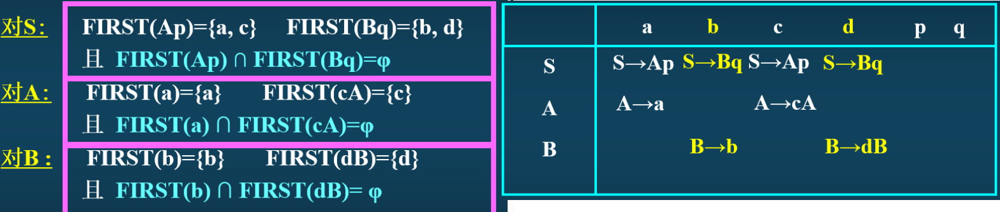

如果$\varepsilon \in \text{FIRST}(\alpha)$，这个时候可能$a \notin \text{FIRST}(\alpha)$并不一定导致出错。

但是如果$A \to \varepsilon$，也未必就不能继续——这个时候，这里匹配的应该是$A$可能到达的下一个符号。我们把这个符号记作FOLLOW，它的形式定义是
$$
\text{FOLLOW}(A) = \{a \mid S \Rightarrow \cdots Aa \cdots, a \in V_T^*\}
$$
特别的，若$S \Rightarrow \cdots A$，则$\# \in \text{FOLLOW}(A)$。

如何求解 FOLLOW 呢？有如下规则：

1. 对文法的开始符号$S$，$\# \in \text{FOLLOW}(A)$
2. 若文法$G$存在$A \to \alpha B\beta(\beta \notin \varepsilon)$，则将$\text{FIRST}(\beta)$中的非$\varepsilon$符号加入$\text{FOLLOW}(B)$
3. 若$G$中存在$A\to \alpha B$或$A \to \alpha B\beta$的规则，$\varepsilon \in \text{FIRST}(\beta)$，则$\text{FOLLOW}(A)$中的元素属于$\text{FOLLOW}(B)$


也可以用关系图法，每个符号和$\#$代表一个节点，终结符和$\#$的节点符号进行标记，非终结符节点用$\text{FOLLOW}(A)$和$\text{FIRST}(A)$标记。先从$\text{FOLLOW}(S)$到$\#$连接一条箭弧，如果存在$A \to \alpha B\beta X$且$\beta \Rightarrow \varepsilon$，则从$\text{FOLLOW}(B)$到$\text{FIRST}(X)$连接一条弧，当$X\in V_T$则与$X$相连；如果存在$A\to \alpha B\beta$且$\beta\Rightarrow \varepsilon$，则从$\text{FOLLOW}(B)$到$\text{FOLLOW}(A)$连一条箭弧；如果对$\text{FIRST}(A)$的节点存在$A \to \alpha X \beta$且$\alpha \Rightarrow \varepsilon$则从$\text{FIRST}(A)$到$\text{FIRST}(X)$连一条箭弧。如果存在路径从$\text{FOLLOW}(A)$到终结符或$\#$，则其为$\text{FOLLOW}(A)$的成员。


有了 FOLLOW 之后，我们就可以给出另一条规则：

**规则2** 若$\varepsilon \in \text{FIRST}(\alpha)$，$b \in \text{FOLLOW}(A)$，则$M(A,b)=A \to \alpha$。特别地，如果$\# \in \text{FOLLOW(A)}$，则$M(A,\#) = A\to \alpha$。

还是举那个表达式的例子：


如果能通过这两条规则构造出来一个分析表，就把这种文法称为LL(1)文法。然而，并非所有CFG都能表示为LL(1)文法，即便做过左递归消除和提取公因式。考虑下面的文法：
$$
S \to iCtSS' \mid a, S' \to eS \mid \varepsilon, C \to b
$$
我们知道，对$S$
$$
\text{FIRST}(iCtSS') = \{i\}, \text{FIRST}(a)=\{a\}
$$
对$S'$
$$
\text{FIRST}(eS) = \{e\}, \text{FIRST}(\varepsilon) = \{\varepsilon\}, \text{FOLLOW}(S') = \{\#, e\}
$$
那么我们考虑到，由于$\text{FIRST}(eS) = \{e\}$，所以$A(S',e)=S' \to eS$；由于$\text{FIRST}(\varepsilon) = \{\varepsilon\}$且$\text{FOLLOW}(S') = \{\#, e\}$，所以$A(S',e)=S' \to \varepsilon$。这就出现了多重定义，一个分析表无法确定唯一候选。

如何判断是否是LL(1)文法？有这样的规则：

- 不存在$A \to \alpha_1 \mid \alpha_2$，$\alpha_1,\alpha_2$同时推出$\varepsilon$
- $\text{FIRST}(\alpha_1) \cap (\text{FIRST}(\alpha_2)\cup \text{FOLLOW}(A)) = \Phi$

### 自下而上的分析

#### 引论

考虑下面的文法：
$$
S \to aABe, A \to Abc, A \to b, B \to d
$$
可以进行推导如下：


这种方法的推导就是自下而上的分析过程。

我们首先引入一些概念：

- 短语：$S$是$G$的开始符号，$\alpha \beta \delta$是一个句型，若$S \Rightarrow \alpha A \delta \wedge A \Rightarrow^+ \beta$，则$\beta$是句型$\alpha \beta \delta$相对于$A$的短语
- 直接短语：$A \Rightarrow \beta$的短语
- 句柄：句型的最左直接短语

> Example. 考虑下面的文法
> $$
> G: S \to aAcB, A \to P, P \to ab, B \to d
> $$
> 对于$\$:aabcd$，考虑推导
> $$
> S \Rightarrow aAcB \Rightarrow aPcB 
> $$
> 那么，在这个过程中，$P$是句型$aPcB$相对于$A$的短语，也是直接短语，也是句柄。
>
> $ab$是$aabcB$相对于$A$的短语，相对于$P$的直接短语和句柄。如果我们画出来分析树：
>
> 
>
> 可以发现短语和父子关系之间的关联。

由此我们定义LR(k)分析：

- L：自左向右扫描
- R：最右推导逆序
- k：每一步向前看k个输入字符

一个LR分析器有三个组成：

- 总控程序
- 分析栈，包括状态$S_i$（每一步的历史）和文法符号$X_i$（分析过程的移进和规约）
- LR分析表，分成分析动作表（ACTION）和状态转换表（GOTO）

对于动作表，$\text{goto}(S_i,X_i)$，$S_i$，$X_i$为当前栈顶和次栈顶，分成

1. j 移进：将第j个状态压入栈
2. error 出错：转出错处理程序

对于分析表，$\text{action}(S_i, a_i)$为

1. $S_j$ 移进：将$a_i$和第$j$个状态压入栈
2. $r_j$ 规约：用第$j$个产生式规约
3. acc：接收，分析成功
4. error：出错，调出错处理程序

建立如下的总控程序：

1. 分析开始，将$S_0$和左界符$\#$推入分析栈
2. 对于分析每一步，根据栈顶$S_m$，查action表：
   1. $S_j$，进行移进
   2. $r_j$，进行归约，并查goto表
   3. acc，分析成功
   4. error，出错处理
3. 转②

下面举一个例子。考虑文法
$$
L \to E.L\ ;\ L \to E\ ;\ E \to a \ ; \ E \to b
$$
假设有这样的一张表:

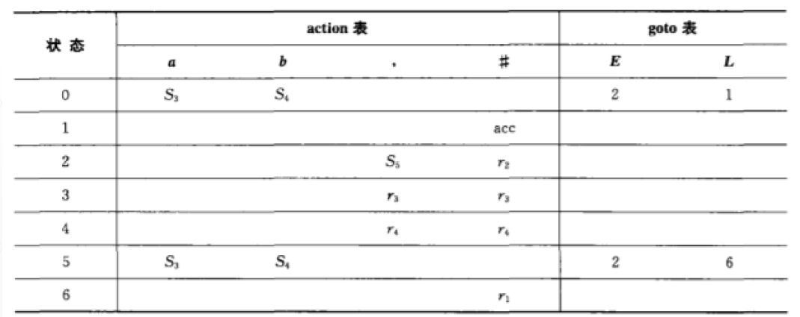

我们就可以如下规约：

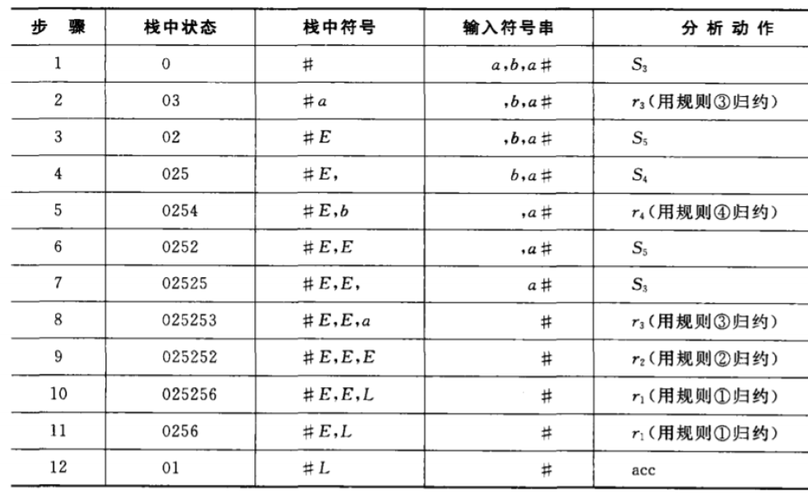

因此，关键就是构建分析表。 

#### LR(0)

继续定义一些概念。我们称

- 前缀：一个句型的任意首部
- 活前缀：规范句型的一个不含句柄之后任意符号的前缀

LR分析中，必须让栈中符号始终是活前缀，这也再读入符号后会构成正好包含句柄的活前缀，进而实施规约。

首先，我们在文法产生式的右部任何位置添加一个圆点，形成的产生式称为**项目**。特别的，$A\to \varepsilon$的项目是$A \to \cdot$。这里的圆点标识的实际上是栈的状态，圆点前的是栈内，圆点后的是栈外。

> Example. 文法
> $$
> S \to A \mid B, A \to aA \mid b \mid \varepsilon , B \to c
> $$
> 产生的项目有
> $$
> \begin{aligned}
> S &\to \cdot A, &S &\to A\cdot, &S &\to \cdot B, &S &\to B\cdot\\
> A &\to \cdot aA, &A &\to a \cdot A, &A &\to aA\cdot, \\ 
> A &\to \cdot b, &A &\to b \cdot , &A &\to \cdot, \\
> B &\to \cdot c, &B &\to c \cdot
> \end{aligned}
> $$

对于这一系列项目，我们分成四类：

1. 规约项目 $A\to \alpha\cdot$，表示句柄$\alpha$刚好在栈中，栈顶构成了期望的包含句柄的活前缀
2. 接受项目 $S'\to \alpha'$，$S'$是唯一的开始符号，表示分析栈恰好为$\alpha$，规约则分析成功
3. 移进项目 $A \to \alpha\cdot a\beta$，分析栈不完全包含活前缀，需要将$a$移入分析栈
4. 待约项目 $A \to \alpha \cdot B\beta$，需要将当前输入字符串相应内容归约到$B$以构成活前缀

> Example 对于上例，
>
> 接受项目是$S \to A\cdot$和$S \to B\cdot$，
>
> 规约项目是$A \to \cdot, A \to b\cdot, B \to c\cdot$和$A \to aA\cdot$
>
> 移进项目是$A \to \cdot aA, A \to \cdot b$和$B \to \cdot c$
>
> 待约项目是$S\to \cdot A, S \to \cdot B$和$A \to a \cdot A$

我们希望构建一个识别所有活前缀的NFA。过程如下：

1. 规定含有文法开始符号的产生式的第一个LR(0)项目（$S' \to \cdot A$）是NFA的唯一初态
2. 所有$LR(0)$项目对应NFA的一个状态，且LR(0)项目为规约项目的对应状态是终态
3. 状态$i,j$出自$G$的产生式出自同一项目且两个状态LR(0)项目的圆点只差一个位置，则从$i$引标记$X_i$的弧到$j$
4. 若状态$i$为待约项目（$X \to \alpha \cdot A\beta$），则$i$引$\varepsilon$弧到所有$A \to \cdot \gamma$的状态

> Example 对于上例，构造NFA如下：
>
> 
>
> 进行确定化，如下所示：
>
> 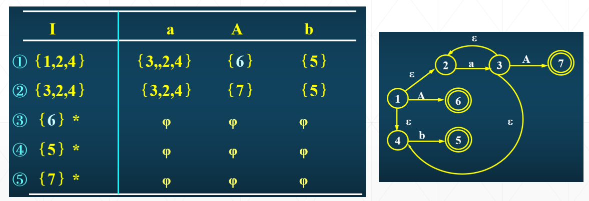
>
> 得到：
>
> 

根据最终的划分结果，我们定义项目集规范族：识别文法G活前缀的DFA项目集的全体称为文法G的LR(0)项目集规范族。例如，上例中就是那五个状态。

如果对上面的过程进行抽象，我们可以得到一种方法：

1. 构造文法G的LR(0)项目
2. 基于LR(0)项目，构造识别文法G的所有活前缀的NFA
3. NFA确定化为DFA，DFA各个状态包含的项目集合是G的LR(0)项目集规范族

但这个过程比较复杂，我们给出另一种略微简单一些的方法。

1. 拓广文法：将$S' \to S$加入文法中，其中$S$是开始符号
2. 构造文法项目集的闭包。其中，$I$为项目集，若$\zeta \in I$且$\zeta$形如$A \to \alpha \cdot B \beta$，则$B \to \cdot \gamma$属于$\text{closure}(I)$。不断重复此步骤。
3. 求状态转移函数$\text{GO}(I,X)$。若$I$是项目集，$X$是$G'$符号，则$\text{GO}(I,X) = \text{closure}(J)$。其中$J$是将$X$前的点后移一位形成的。
4. 构造文法$G$的LR(0)项目集规范族。

> Example. 已知文法
> $$
> S \to cA \mid ccB , B \to ccB \mid b, A \to cA \mid a
> $$
> 首先进行拓广：
> $$
> S' \to S,S \to cA \mid ccB , B \to ccB \mid b, A \to cA \mid a
> $$
> 首先，建立：
> $$
> I_0 = \{S' \to \cdot S, S' \to \cdot cA, S' \to \cdot ccB\}
> $$
> 对于第一项，
> $$
> I_1 = \{S' \to S\cdot\}
> $$
> 对于第二项，
> $$
> I_2 = \{S \to c\cdot A, S \to c \cdot cB, A \to \cdot cA, A \to \cdot a\}
> $$
> 对非终结符A求GO函数，
> $$
> I_3 =\{S \to cA\cdot\}
> $$
> 对c求GO函数，产生待约项，求闭包
> $$
> I_4 = \{S \to cc\cdot B, A \to c\cdot A, B \to \cdot ccB, B \to \cdot b,A \to \cdot cA, A \to \cdot a\}
> $$
> 对终结符a求GO函数，
> $$
> I_5 = \{A \to a\cdot\}
> $$
> 针对$I_4$，对B求GO函数，
> $$
> I_6 = \{S \to ccB\cdot\}
> $$
> 对A求GO函数，结果是$I_3$
>
> 对C求GO函数，
> $$
> I_7 = \{B \to c\cdot cB, A \to c\cdot A, A \to \cdot cA, A \to \cdot a\}
> $$
> 对b求GO函数，
> $$
> I_8 = \{B \to b\cdot\}
> $$
> 针对$I_7$，对$c$求GO函数，
> $$
> I_9 = \{B \to cc\cdot B, A \to c\cdot A, B \to \cdot ccB, B \to \cdot b,A \to \cdot cA, A \to \cdot a\}
> $$
> 对$a$求GO函数，结果是$I_5$
>
> 对$b$求GO函数，结果是$I_8$
>
> 后略。

接下来的一步是根据DFA构造分析表。我们给出如下规则：

- DFA中从状态$M$出发，经过$a$弧到达$N$，则$\text{action}(M,a)=S_N(a \in V_T)$
- DFA中为规约状态，文法产生式编号$n$，则$\text{action}(M,a)=r_N(a \in V_T)$
- DFA中从状态$M$出发，经过$B$弧到达$N$，则$\text{goto}(M,B)=N(B \in V_N)$
- action表中的acc对应DFA中唯一终态

根据这些规则，我们构建如下算法：

设$C = \{I_0, \cdots, I_n\}$，$I_k$的下标$k$是分析器状态，则

1. $\text{GO}(I_k, a) = I_j$，$A \to \alpha \cdot a\beta \in I_k$，则$\text{action}(K,a) = S_j$
2. $\text{GO}(I_k, A)=I_j(A \in V_N)$，则$\text{goto}(K,A) = j$
3. $A \to \alpha\cdot \in I_k$，则$\text{action}(K,a) = r_j$或$\text{action}(K, \#) = r_j$
4. $S' \to S \in I_k$，则$\text{action}(K,\#) = acc$
5. 空白表示出错位。

> Example. 考虑文法
> $$
> A \to aA \mid b
> $$
> 构建DFA如下：
>
> 
>
> 转换为分析表，
>
> 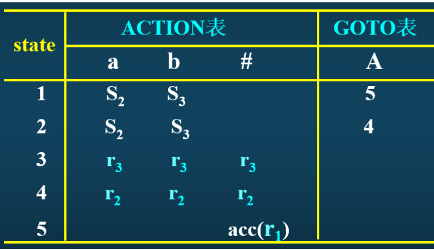

这样，我们就完成了LR(0)的分析过程。问题在于，是不是所有文法都可以拿LR(0)解决呢？考虑下面的例子。

> Example. 对于文法
> $$
> G: A \to aA \mid a
> $$
> 将其转换为DFA，得到
>
> 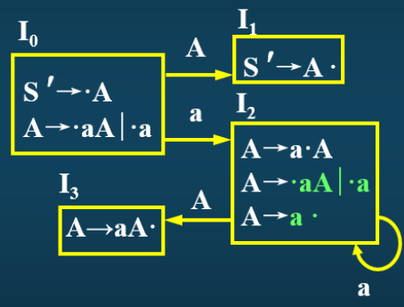
>
> 由于$A \to a\cdot$，所以$\text{action}(S_2,a) = r_3$；由于$\text{GO}(I_2, a) = I_2$，所以$\text{action}(I_2,a) = I_2$。这就产生了冲突！

从上面我们可以看到，冲突一般产生在规约，具体来说存在两种情况：如果DFA的某一个项目出现

1. 同时存在的移进项和规约项（移进-规约冲突）
2. 多个规约项（规约-规约冲突）

如果不存在任何冲突，则称为LR(0)文法。

#### SLR(1)

为了解决这一局限性，我们引入SLR(1)分析。SLR主要的改进在于，原先LR(0)当处理$A \to a\cdot$的时候不管输入符号为何，都把action子表的对应行都指定为$r_j$，而SLR则进行了改进。

对于冲突
$$
I_i = \{X \to \alpha \cdot b\beta, A \to \alpha\cdot, B \to \alpha \cdot\}
$$
若$\text{FOLLOW}(A), \text{FOLLOW}(B), \{b\}$两两不相交，则规定

1. $a=b$，选择移进
2. $a \in \text{FOLLOW}(A)$，选择$A \to \alpha$规约
3. $a \in \text{FOLLOW}(B)$，选择$B \to \alpha$规约
4. 当$a$不属于上述三种情况，置error

下面举一例。

> $$
> S \to SAB \mid BA, B \to b, A \to aA \mid B
> $$
>
> 构建DFA：
> $$
> I_0 = \{ S' \to \cdot S, S \to \cdot SAB, S \to \cdot BA, B \to \cdot b \}
> $$
> 那么，$\text{GO}(I_0, S)$
> $$
> I_1 = \{S' \to S\cdot, S \to S\cdot AB, A \to \cdot aA, A \to \cdot B, B \to \cdot b\}
> $$
> $\text{GO}(I_0,B)$
> $$
> I_2 = \{S \to B\cdot A,A \to \cdot aA, A \to \cdot B, B \to \cdot b\}
> $$
> $\text{GO}(I_0,b)$
> $$
> I_3 =\{B \to b\cdot\}
> $$
> $\text{GO}(I_1, A)$
> $$
> I_4 = \{S \to SA \cdot B, B \to \cdot b\}
> $$
> $\text{GO}(I_1, B)$
> $$
> I_5 = \{A \to B\cdot\}
> $$
> $\text{GO}(I_1, a)$
> $$
> I_6 = \{A \to a\cdot A,A \to \cdot aA, A \to \cdot B, B \to \cdot b\}
> $$
> $\text{GO}(I_1,b) = I_3$
>
> $\text{GO}(I_2,A)$
> $$
> I_7 = \{S \to BA\cdot\}
> $$
> $\text{GO}(I_2, B) = I_5$
>
> $\text{GO}(I_2, a) = I_6$
>
> $\text{GO}(I_2,b) = I_3$
>
> $\text{GO}(I_4,B)$
> $$
> I_8 = \{S \to SAB\cdot\}
> $$
> $\text{GO}(I_4,b) = I_3$
>
> $\text{GO}(I_6,A)$
> $$
> I_9 = \{A \to aA\cdot\}
> $$
> $\text{GO}(I_6,B) = I_5$
>
> $\text{GO}(I_6,a) = I_6$
>
> $\text{GO}(I_6,b) = I_3$
>
> 因此，建立分析表如下：
>
> | state | a     | b     | #    | S    | A    | B    |
> | ----- | ----- | ----- | ---- | ---- | ---- | ---- |
> | 0     |       | $S_3$ |      | 1    |      | 2    |
> | 1     | $S_6$ | $S_3$ |      |      | 4    | 5    |
> | 2     |       |       |      |      |      |      |
> | 3     |       |       |      |      |      |      |
> | 4     |       |       |      |      |      |      |
> | 5     |       |       |      |      |      |      |
> | 6     |       |       |      |      |      |      |
> | 7     |       |       |      |      |      |      |
> | 8     |       |       |      |      |      |      |
> | 9     |       |       |      |      |      |      |
>
> 

SLR有没有问题呢？有。考虑下面的文法：
$$
\begin{aligned}
S' &\to S & S &\to L =R & S & \to R \\
L &\to *R & L &\to i & R & \to L
\end{aligned}
$$
容易得到，
$$
I_0 = \{S' \to \cdot S, S \to \cdot L=R, S \to \cdot R, L \to \cdot*R, L \to \cdot i, R \to \cdot L\}
$$
如果求解$\text{GO}(I_0, L)$，得到
$$
I_2 = \{S \to L\cdot=R, R \to L\cdot\}
$$
这里就出现了移进-规约冲突。二者的区别实际上是选择赋值语句还是直接对右值规约，需要用SLR(1)方法进行分析。$\text{FOLLOW}(R) = \{=,\#\}$，而$\text{FOLLOW}(R) \cap \{=\} \ne \emptyset$，所以无法进行SLR(1)分析。

之所以会出现这种情况，是因为我们只考虑了右侧的限定条件，而忽视了左侧。换言之，可能不存在$\beta Aa$的规范句型，所以$A \to a$不一定有效。

#### LR(1)

我们进一步引入两类约束：

- LR(k) 项目，对于$[A \to \alpha \cdot \beta, a_1\cdots a_k]$，这里的$a_1\cdots a_k$称为搜索符串，给出的是后面可能存在的字符
- LR(1) 有效项目，$[A \to \alpha \cdot \beta, a]$ 对活前缀$\gamma$有效，当且仅当存在规范推导$S \Rightarrow \delta A\omega \Rightarrow \delta \alpha\beta\omega$，其中$\gamma = \delta \alpha$，$a \in \text{FIRST}(\omega)$或$a$为$\#$。
- LR(0) 有效项目，$[A \to \beta_1 \cdot \beta_2]$对活前缀$\alpha \beta_1$有效当且仅当存在规范推导$S \Rightarrow \alpha A\omega \Rightarrow \alpha \beta_1 \beta_2 \omega$

> 有文法$S \to BB$，$B \to aB \mid b$。那么LR(1)项目$[B \to a.B, a]$对活前缀aaa有效，这是因为存在一个规范推导$S \Rightarrow BB \Rightarrow BaB \Rightarrow Bab \Rightarrow aBab \Rightarrow aaaBab$。这里的第一个a是$\delta$，接下来的aa是$\alpha$，B是$\beta$，$\omega$是ab，$a \in \text{FIRST}(\omega)$。
>
> LR(1)项目$[B \to a\cdot B, \#]$对活前缀Baa有效，这是因为存在一个规范推导$S \Rightarrow BB \Rightarrow BaaB$，$\delta=B$，$\alpha = aa$，$\gamma = Baa$，$\beta = B$，$\# \in \text{FIRST}(\omega)$。

这就给出了项目集规范族的概念：

1. 求$\text{closure}(I)$。其求法为，对于$I$中的项目$[A \to \alpha \cdot B \beta, a]$，$G'$中产生式$B \to \gamma$和$\text{FIRST}(\beta a)$的每个终结符$b$，如果$[B \to \cdot \gamma]$不$I$中，则把$B \to \cdot \gamma, b$加到$I$中。持续到闭包为止。
2. 求$\text{GO}$函数。若$J$是项目$[A \to \alpha X \cdot \beta, a]$的集合，使得$[A \to \alpha \cdot X\beta, a] \in I$，那么$\text{GO}(I, X) = \text{closure}(J)$。
3. 用items构造LR(1)的项目集规范族$C$。将$C$初始化为$\text{closure}(\{S' \to \cdot S, \#\})$，对于C中的项目I和符号X，如果$\text{GO}(I,X)$非空且不在C中就加入$\text{GO}(I,X)$。

有了项目集规范族，我们就可以建立LR(1)分析表：

假设$G'$的项目集规范族$C = \{I_0, I_1, \cdots, I_n\}$，那么

1. 对于$I_i$中形如$[A \to \alpha\cdot X\beta,b]$的项目，如果$\text{GO}(I_i, X) = I_j$且$X = a$，那么$\text{action}(I_i, a) = S_j$；如果$X \in V_N$，则$\text{GOTO}(I_i, X) = j$。
2. 对于规约项目$[A \to \alpha\cdot ,a] \in I_i$，$A \to a$为文法第$j$个产生式，那么$\text{action}(I_i, a) = r_j$
3. 如果$[S'\to S\cdot, \#] \in I_i$，则$\text{action}(I_i, \#) = acc$
4. 如果无法分析，则置出错

下面我们举一个例子。

> $$
> A' \to A, A \to BB, B \to aB, B \to b
> $$
>
> 则
> $$
> I_0 = \{A' \to \cdot A, \# \mid A \to \cdot BB, \# \mid B \to \cdot aB ,a/b \mid B \to \cdot b, a/b\}
> $$
> 求解$\text{GO}(I_0, A)$得到
> $$
> I_1 = \{A' \to A\cdot, \#\}
> $$
> 求解$\text{GO}(I_0, B)$得到
> $$
> I_2 = \{A \to B\cdot B,\# \mid B \to \cdot aB ,\# \mid B \to \cdot b, \#\}
> $$
> 求解$\text{GO}(I_0, a)$得到
> $$
> I_3 = \{B \to a\cdot B, a/b \mid B \to \cdot aB ,a/b \mid B \to \cdot b, a/b\}
> $$
> 求解$\text{GO}(I_0, b)$得到
> $$
> I_4 = \{B \to b\cdot, a/b\}
> $$
> 求解$\text{GO}(I_2, B)$得到
> $$
> I_5 = \{A \to BB\cdot, \#\}
> $$
> 求解$\text{GO}(I_2, a)$得到
> $$
> I_6 = \{B \to a\cdot B, \#\mid B \to \cdot aB ,\# \mid B \to \cdot b, \#\}
> $$
> 求解$\text{GO}(I_2, b)$得到
> $$
> I_7 = \{B \to b\cdot, \#\}
> $$
> 求解$\text{GO}(I_3, B)$得到
> $$
> I_8 = \{B \to aB\cdot, a/b\}
> $$
> 求解$\text{GO}(I_3, a)$得到$I_3$，求解$\text{GO}(I_3, b)$得到$I_4$
>
> 求解$\text{GO}(I_6, B)$得到
> $$
> I_9 = \{B \to aB\cdot, \#\}
> $$
> 求解$\text{GO}(I_6, a)$得到$I_6$，求解$\text{GO}(I_6, b)$得到$I_7$.因此，建立图：
>
> 
>
> 根据图建立分析表：
>
> 

#### LALR(1)

容易知道，在分析能力上，$LR(0) \sub SLR(1) \sub LR(1)$，但从开销上来说，LR(1)开销非常高。LALR(1)则进行了综合，它的分析表状态数是LR(0)的C，分析功能是LR(1)的子集。

从一个例子入手。设有文法
$$
A' \to A, A \to BB, B \to aB, B \to b
$$
其LR(0)的项目集规范族是

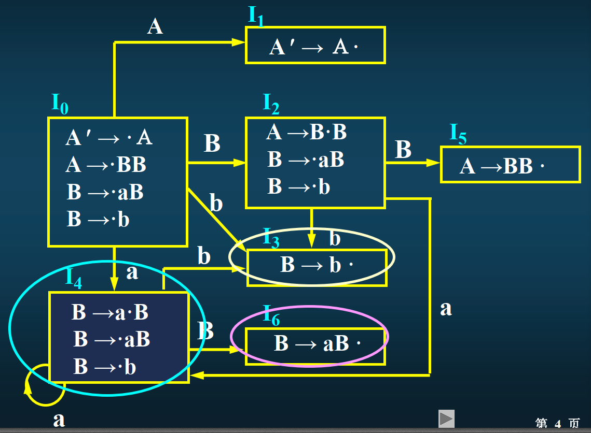

LR(1)的项目集规范族是


可以看到，LR(0)中的$I_4$分裂为了$LR(1)$中的$I_3, I_6$，$I_6$分裂为$I_8,I_9$，$I_3$分裂为$I_4, I_7$。这些项目集不同之处只有搜索符。为此，我们定义同心项目族：

> 对于文法$G$的LR(1)项目集规范族，如果存在2个或2个以上的项目集$I_0,I_1$，其中$I_0,I_1$项目集的$LR(0)$项目相同，只有搜索符不同，则称$I_0,I_1$为$G$的LR(1)同心项目集，或$I_0,I_1$有相同的心。

那么我们对这些项目集合并，例如在上例中：
$$
I_{36} = \{B \to a\cdot B, a/b/\# \mid B \to \cdot aB ,a/b/\# \mid B \to \cdot b, a/b/\#\}
$$

$$
I_{47} = \{B \to b\cdot, a/b/\#\},I_{89} = \{B \to aB\cdot, a/b/\#\} 
$$

这样，我们建立了新的LALR(1)项目集规范族：


填写分析表的规则是一致的，在上例中生成分析表：


LALR(1)项目集规范族构造的文法$G$的LALR(1)分析表，如果每个入口不含多重定义则为LALR(1)分析表，具有LALR(1)分析表的文法是LALR(1)文法。

> 定理：LALR(1)的项目集规范族只可能存在规约-规约冲突
>
> 证明如下：设LR(1)的项目集规范族$C$有如下项目集：
> $$
> I_k : [A \to \alpha\cdot, W_1]  [B \to \beta \cdot a \gamma, b],I_j : [A \to \alpha\cdot, W_2]  [B \to \beta \cdot a \gamma, c]
> $$
> 且二者不冲突，即$W_1 \cap \{a\} = \emptyset, W_2 \cap \{a\} = \emptyset$，得到$(W_1 \cup W_2) \cap \{a\} = \empty$。将二者合并，
> $$
> I_{k/j} = [A \to \alpha\cdot, W_1 \cup W_2][B\to \beta\cdot a \gamma, \{b\} \cup \{c\}]
> $$
> 因此，不存在新的移进规约冲突。

在引入LALR之后，我们就可以将LR文法分成四类：LR(0)、SLR(1)、LR(1)、LALR(1)。

1. LR(0)文法存在冲突，说明非LR(0)
2. SLR(1)文法存在冲突，说明非SLR(1)
3. LR(1)文法存在冲突，说明非四类文法
4. LALR(1)文法存在冲突，说明是LR(1)文法而不是LALR(1)文法

下面用一个例子说明如何判断属于哪类文法。

> 设有文法：
> $$
> S \to Aa \mid bAc \mid Bc \mid bBa, A \to d, B \to d
> $$
> 构造LR(0)文法：
>
> 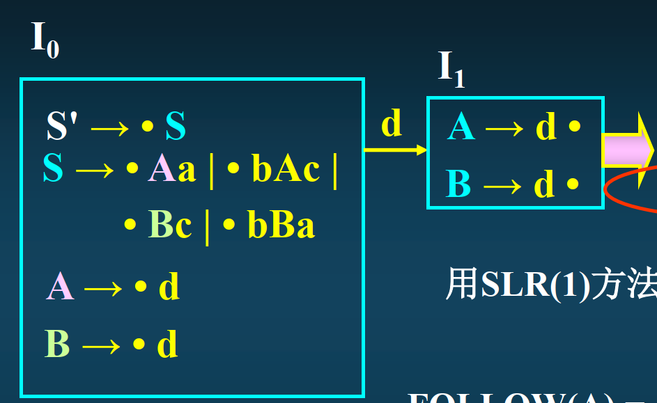
>
> 存在规约-规约冲突，所以不是LR(0)文法。由于$\text{FOLLOW}(A) \cap \text{FOLLOW}(B) \ne \emptyset$，所以不是SLR(1)文法。
>
> 构造LR(1)分析如下：
>
> 
>
> 则不存在冲突，所以是LR(1)文法。由于存在同心项目集，则进行合并:
>
> 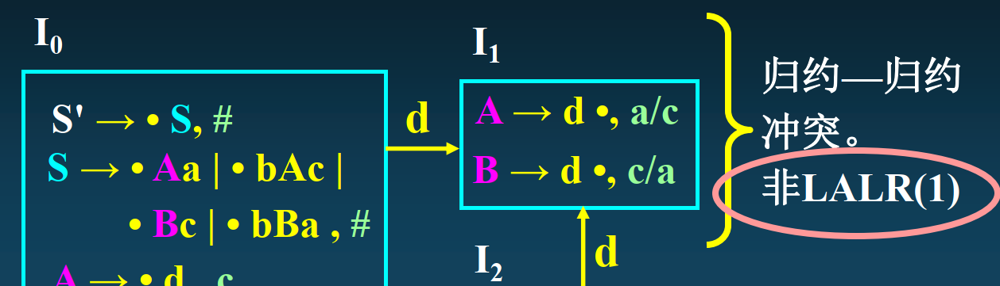
>
> 因此，引入了规约-规约冲突，所以不是LALR(1)文法。
>
> 综上所述，这一文法是LR(1)文法，但不是LALR(1)文法。

#### LR分析与二义文法

二义文法一定不是LR文法。我们来看个例子：考虑
$$
G(E) = E+E\mid E*E\mid (E) \mid i
$$
其分析过程如下：


可以看到，对$I_1$存在移进-规约冲突，可以通过SLR(1)解决；但对于$I_7,I_8$，由于$\text{FOLLOW}(E)$和$\{+\},\{*\}$的交集非空，所以无法进行SLR(1)。我们知道，$*$的优先级高于$+$，对于$I_7$，活前缀是$E+E$，遇到$+$的时候就直接进行规约，遇到$*$的时候则进行移进；对于$I_8$，活前缀是$E*E$，无论何时都进行规约。所以这就给出了解决冲突后的LR分析表：


再来举一个文法。考虑
$$
S' \to S, S \to iSeS \mid iS \mid a
$$
它指代了if else的语句格式。我们可以做LR(0)如下：

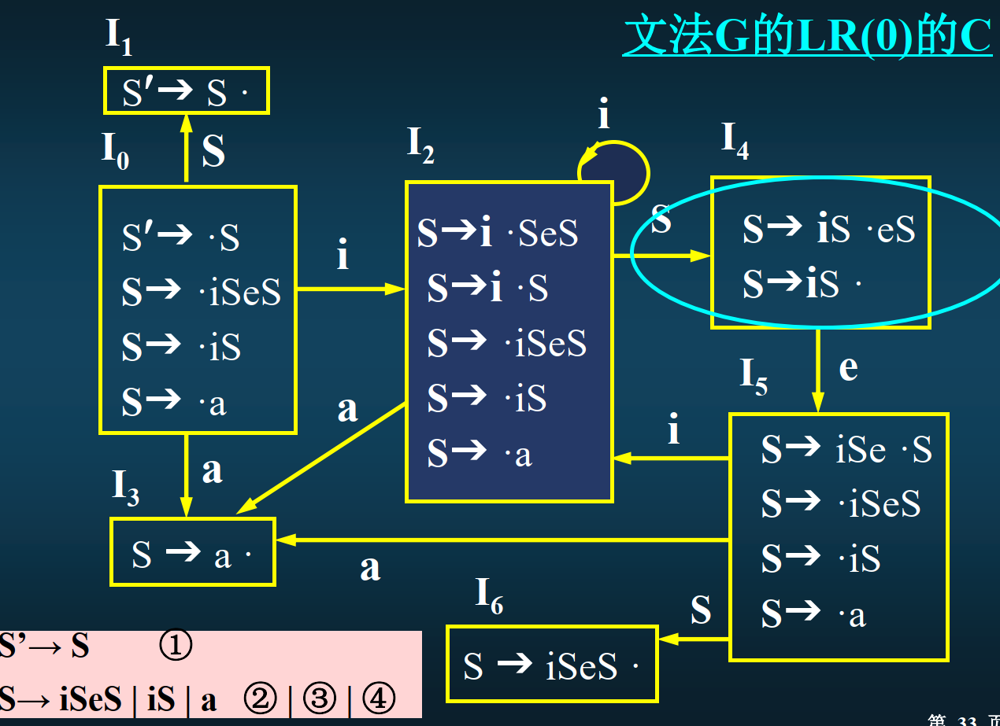

对于$I_4$，$\text{FOLLOW}(S) \cap \{e\} \ne \emptyset$，所以也无法使用SLR(1)。再考虑LR(1)文法：

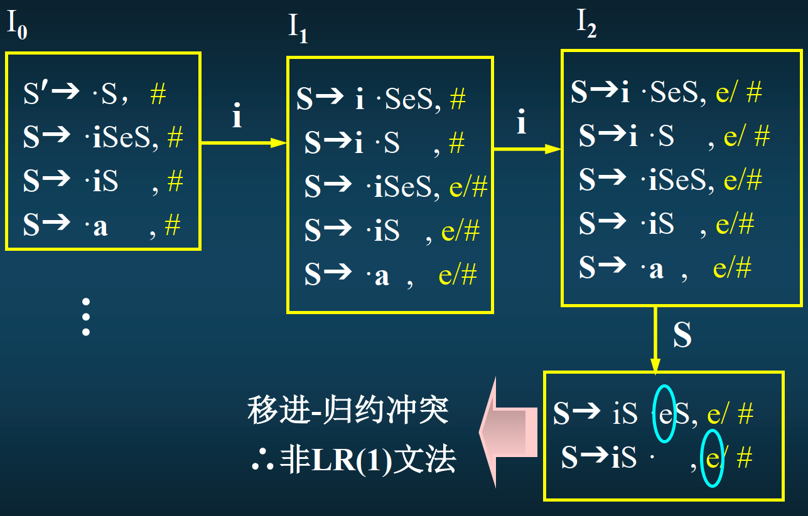

仍然存在移进-规约冲突。这也是由于二义性引发的：对于

```
if e1 then
	if e2 then
		S1
	else
		S2
```

这个else我们并无法判断究竟匹配哪个if。如果这里匹配内层的if，那么就让$\text{action}(I_4, e) = S_5$，这样就解决了冲突。

#### LR分析的错误处理与恢复

错误处理的主要目的是，清晰准确的报告错误，从错误中恢复过来，不使正确程序的处理效率变低。一般来说，错误处理有几种策略：

1. 紧急恢复方式，发现错误就抛弃输入符号，直到输入符号属于某个特定同步符号集合，比如`;`、`}`、end
2. 短语级恢复方式，发现错误则做局部矫正，例如将`(i+i`替换为`(i+i)`
3. 出错产生式，扩充语言文法，增加产生错误结构的产生式
4. 全局纠正

下面还是举表达式求值的例子。再找到这张图：


- 如果处于$I_0,I_2,I_4,I_5$，现在输入了+、\*、#，调用e1：将假设的i和状态3入栈，并输出“缺少运算对象”。

- 如果处于$I_0,I_1,I_2,I_4,I_5$，现在输入了)，调用e2：删除输入的)，并输出“括号不匹配”

- 如果处于$I_1,I_6$，期望输入运算符或)，但现在输入了i或(，则将+和状态4入栈，并输出“缺少运算符”

- 如果出于$I_6$，期望输入运算符或)，但现在输入了#，则将假设的)和状态9入栈，并输出“缺少)”

这样，分析表满了：

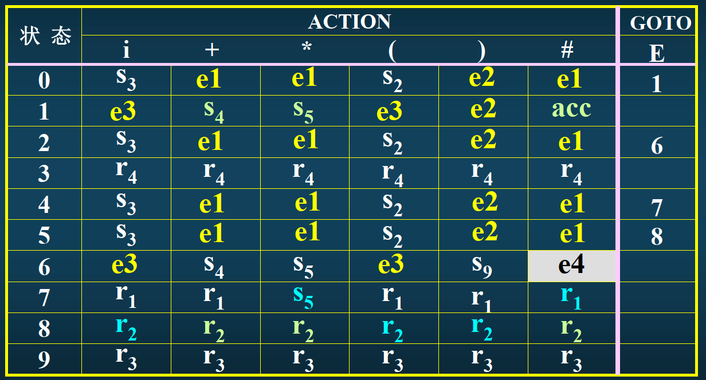

### 语法分析器的自动生成器

YACC（Yet Another Compiler-Compiler），Bison则是GNY推出的向上兼容版本。Bison用LALR(1)，与LEX有标准接口，适应于二义文法的LALR(1)分析，可带语义处理。

YACC的过程如下：


在实现上，YACC首先构造了LR(1)的C，然后查找、合并同心项目集，并构造了LALR(1)的分析表。

## Semantic Analysis

语义分析扫描程序来分析程序表达的含义。本章主要讨论两个内容：

- 关于符号的声明和使用
- 关于类型的标记和操作

### Attribute Grammar

有些要求是上下文相关的，我们无法使用上下文无关文法来描述。为此，我们扩充原先的上下文无关文法，形成新的属性文法，用于描述程序的操作语义。

我们赋予每个属性相应的值域，比如整数、字符或字符串。将输入程序看作语法树，属性文法可以使用**综合属性**从子节点到父节点传递属性值，也可以用**继承属性**从当前节点向子节点传递属性值。

考虑下面这个简单的文法：$L(G) = \{a^n b^nc^n, n \ge 0\}$。我们给出一个新的size语义，这样

```
<letterseq> := <aseq> <bseq> <cseq>
	condition: 
		Size(<aseq>) = Size(<bseq>) = Size(<cseq>)
<aseq> := a  		#  Size(<aseq>) <- 1
		| <aseq> a	#  Size(<aseq>) <- Size(<aseq>) + 1
<bseq> := b  		#  Size(<bseq>) <- 1
		| <bseq> b	#  Size(<bseq>) <- Size(<bseq>) + 1
<cseq> := c  		#  Size(<cseq>) <- 1
		| <cseq> c	#  Size(<cseq>) <- Size(<cseq>) + 1
```

这样，我们构造出这么一颗树：

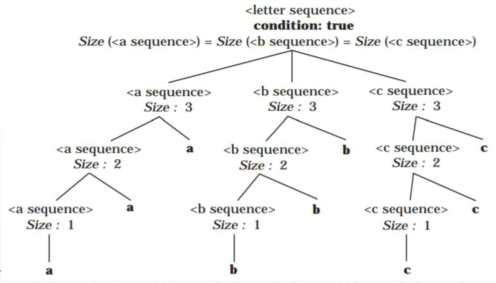

但其实还有另外一种方法。我们可以先找到a的长度，然后沿b和c进行下降：

```
<letterseq> := <aseq> <bseq> <cseq>
	InhSize(<bseq>) <- Size(<aseq>)
	InhSize(<cseq>) <- Size(<aseq>)
<aseq> := a  		#  Size(<aseq>) <- 1
		| <aseq> a	#  Size(<aseq>) <- Size(<aseq>) + 1
<bseq> := b 
			Condition InhSize(<bseq>) = 1
		| <bseq> b	#  InhSize(<bseq>) <- InhSize(<bseq>) - 1
<cseq> := c  		
			Condition InhSize(<cseq>) = 1
		| <cseq> c	#  InhSize(<cseq>) <- InhSize(<cseq>) - 1
```

我们可以根据此定义符号表。例如，

```
<program> ::= <identifier> is <block>
	Symbol-table(<block>) <- add-item(empty-table)
<declaration> ::= var <variable list> : <type>;
	Symbol-table(<declaration>) <- build-symbol-table(<variable list>), Type(<type>)
<variable list> ::=
	<variable>
		Var-list(<variable list>) <- cons(Name(<variable>), empty-list)
	| <variable>, <variable list>
		Var-list(<variable list>) <- cons(Name(<variable>, Var-list(<variable list>)))
```

### 作用域与符号表

作用域定义了变量的可见范围和存活空间，将使用与声明相关联。词法作用域根据代码的结构和嵌套层次查找对应符号，作用域可以嵌套，block可能对应新的作用域。

对于下面的例子：


可以看到，外层x的作用域是除去内层以外的生命周期。

最常用的是静态作用域。其中，可以引用的是当前scope、外层scope和全局作用域，无法引用的是同级scope和子scope。

符号表主要针对标识符的声明使用进行描述分析，主要分析作用域、声明使用顺序和重复声明。一般来说，每个scope对应一个符号表，形成一个树形结构：


这样，我们可以定义操作如下：

1. 语义分析遇到一个新的Scope，创建一个新的空符号表，当前Scope从父级转换为新Scope
2. 遇到一个声明，加入符号到符号表，检查当前scope是否有重复声明
3. 遇到一个符号使用，从当前到父节点进行声明搜索
4. 退出一个Scope，将父级Scope设置为当前Scope

有些语言也存在动态作用域，此时需要按照程序状态消解符号。


这里一个比较复杂的问题是，我们如何解决继承的问题？同样建立一张继承的符号表：

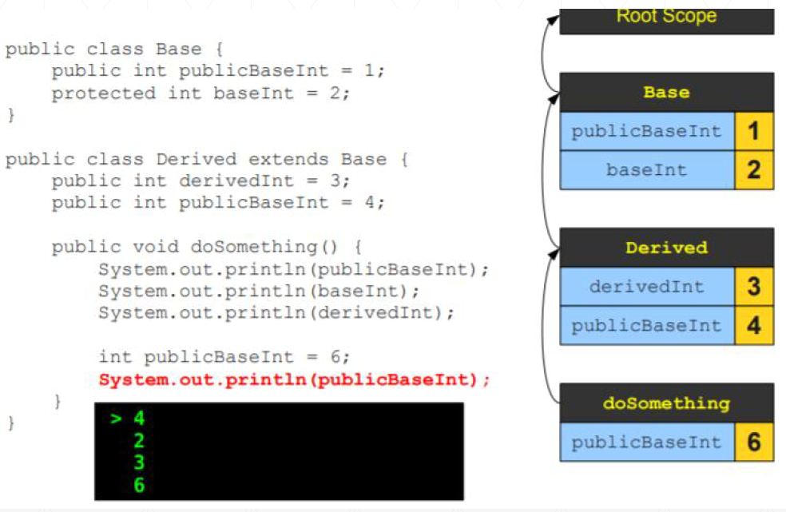

对于多重继承，则会发生模糊的问题，对于C++需要显式指明。

### 类型检查

类型是一个值的集合，以及一个可以施加在这些值上操作的集合。它分成基本类型和复合类型，前者是程序设计语言提供的数据类型。

对于类型我们建立一套类型体系，包括类型构建方法、类型等价性定义、类型推断规则、类型检查规则等，它的基础是集合理论。例如，结构体对应了笛卡尔积，联合对应了并。

在我们执行类型转换的时候，有两种类型：隐式类型转换和显式类型转换。从某种类型转换到它的超集的过程称为类型提升。对于类型等价有两种情况：一种是名字类型等价，即类型相同、名字不同的两个变量；一种是结构类型等价，即类型有相同的结构。

根据类型系统可以对语言进行分类：

- 静态类型，在编译时完成
- 动态强类型，类型检查在动态运行完成
- 无类型，不做类型检查

下面我们正式的引入类型检查，类型检查的目的是说明某个操作在程序语言中是否允许。定义类型断言
$$
\Gamma \vdash exp : \tau
$$
exp是程序中的表达式，$\tau$则表示类型。我们可以定义这样的类型规则：
$$
\frac{(Rule\  name)(Annotations) \Gamma_1 \vdash \mathfrak{J_1}\cdots \Gamma_n \vdash \mathfrak{J_n}(Annotations)}{\Gamma \vdash \mathfrak{J}}
$$
例如，我们可以定义规则
$$
\frac{A\vdash E:bool, A \vdash E_1 : T, A \vdash E_2 : T}{A \vdash (E ? E_1 : E_2) : T}
$$
来表示?:运算符的类型规则。再比如函数调用语句：
$$
\frac{\Gamma \vdash e_1 : \tau_1 \to \tau_2\ \ \Gamma \vdash e_2 : \tau_1}{\Gamma \vdash (e_1 \ e_2) : \tau_2}
$$
那么，我们就可以进行一个更加复杂的推导：
$$
\dfrac{\dfrac{\Gamma \vdash b : bool}{\Gamma \vdash !b : bool}\dfrac{\Gamma \vdash 2:int\ \ \Gamma \vdash 3:int}{\Gamma \vdash 2+3: int}\ \ \Gamma \vdash x:int}{\Gamma \vdash (!b ? 2+3:x):int}
$$
这就完成了推导过程。

### 语法制导翻译

#### 简介

语法制导翻译模型（Syntax Directed Translation Schemata，SDTS）的主要目的是为文法的每一个产生式添加一个成分，在执行语法分析的同时进行调用。SDTS可以用一个五元组来描述：
$$
T = (V_T, V_N, \Delta, R, S)
$$
其中，

- $V_T,V_N,S$：同文法定义
- $\Delta$：输出字符表
- $R$：规则的集合，形式为$A \to \alpha, \beta$。其中$A \to \alpha$为文法规则， $\beta \in (V_N \cup \Delta)^*$。

> 简单表达式中缀转后缀，可以定义规则如下：
> $$
> SDTS = (\{i,+,-,(,)\},\{E,T\}, \{+,-,@,i\},R,E)
> $$
> 其中，$R$中规则包括
> $$
> \begin{aligned}
> E &\to E + T ,& E\ T\ + \\
> E &\to E - T ,& E\ T\ - \\
> E &\to -T ,& T\ @ \\
> E & \to T ,& T \\
> T &\to (E) ,& E \\ 
> T &\to i,& i
> \end{aligned}
> $$

可以发现，我们这里实际上形成了一种对偶关系：
$$
(E,E) \Rightarrow (E-T,ET-)\Rightarrow(-T-T,T@T-)\Rightarrow (-i-i,i@i-)
$$
对此形式性的定义如下：

1. $(S,S)$是翻译对偶，$S$是开始符号
2. 如果$(\alpha A\beta, \alpha' A\beta')$是一个翻译对偶，两个A相关，$A \to \delta, \gamma$是一条规则，那么$(\alpha \delta \beta, \alpha' \gamma \beta')$也是一个翻译对偶

对于LL(1)文法，我们很容易自上而下的过程中加入翻译动作，这就构成了**自上而下的翻译**。例如下面的例子：

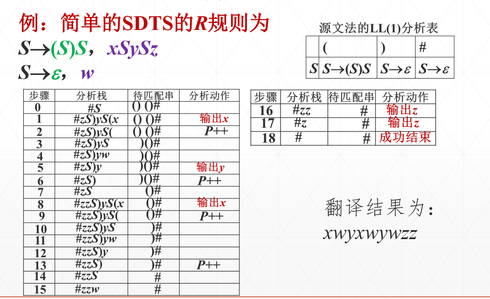

形式化的，其过程如下：

1. 初始化工作，栈顶为X，p指向ai
2. 若X为终结符号，$X=a_i=\#$则处理成功，$X=a_i\ne \#$则将X退掉、p后移，否则出错
3. 若X是输出符号，则从栈弹出并输出X
4. 若$X \in V_N$，查表$M(X,a_i)$。若存在产生式规则，且对应SDTS规则为$X \to \alpha_0A_1\cdots A_k\alpha_k,\beta_0A_1 \cdots A_k \beta_k$，则将X从栈中弹出，将$\beta_0\alpha_0A_1\beta_1\alpha_1A_2\cdots A_k\beta_k \alpha_k$倒序压入栈；否则出错处理

例如，在上面的表中，第一步`S -> (S)S`，我们进行比较：

```
|(|S|)|S|
|x|S|y|S|z|
```

分别得到$\alpha_0=(, A_1=S,\beta_0=x,\cdots$所以逆序向栈里压入`x(Sy)Sz`，得到的就是`zS)yS(x`

对应的，LR分析过程如下：

1. 初始化，将$Q_0$和$\#$压入栈
2. 若栈顶$Q_m$，查action表：
   1. $\text{action}(Q_m, a_i) = S_{Qj}$则完成移进动作
   2. $\text{action}(Q_m, a_i)=r_j$，且SDTS规则$X \to \alpha_0A_1\cdots A_k\alpha_k, A_1A_2\cdots A_k\beta$则完成规约并输出$\beta$
   3. $\text{action}(Q_m,a_i)$为acc则分析成功
   4. 否则转出错处理
3. 转2

下面是一个例子：


所以输出的`ii+@i-`即是对应的后缀表达式。

#### 分类

根据属性文法翻译的种类，可以分成几类：

1. 无限值属性文法，可以使用任何综合属性和继承属性，需要建立属性计算依赖图，根据依赖图计算属性
2. S-属性文法，仅使用综合属性，适合于自下而上的属性翻译文法，可以通过后续遍历语法分析树计算完所有属性
3. L-属性文法，使用综合+继承属性，包括左侧兄弟节点的任何属性或者左侧非终结符继承属性，适用于深度优先遍历语法分析树计算完所有属性

S-属性和L-属性比较适用于语法分析过程中处理语义。

（1）S-属性

S-属性的parser在分析栈中维护了它的综合属性，如果存在$A\to \alpha$的规约，那么A的属性就通过$\alpha$计算，因此可以通过对LR parser的扩展实现S-属性翻译。我们可以在分析栈里存放一些附加域存放综合属性值，并同步操作。

例如，对于某个规约$A \to XYZ$，我们可以定义$A.a := f(val[tp],val[tp-1],val[tp-2])$，$Z.val$在$val[tp]$中，其余也同理。下面是一个例子：

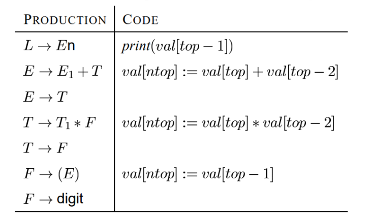

在$A\to \alpha$的规约之后，需要令$ntop = top-|\alpha|+1$。

（2）L-属性

L属性包括综合属性和继承属性，但不需要构建依赖图。具体来说，一个继承属性$X_j$在产生式$A\to X_1\cdots X_j\cdots X_n$中，只依赖于它左侧的符号$X_1\cdots X_{j-1}$和它的父亲$A$。因此，S-属性也是L-属性文法。

如果执行L-属性文法的翻译，它的伪代码如下：

```
L-EVAL(n: NODE) 
    FOR each child m of n, from left to right:
        evaluate inherited attributes of m
        L-EVAL(m)
    ENDFOR
    evaluate synthesized attributes of n
```

下面是一个例子。对于声明`float i_1, i_2`，会有如下的翻译过程：


（3）无限制属性文法

这种情况下，如果存在$M$到$N$的依赖，就必须在计算$N$的属性之前得到$M$的属性。如果把这种依赖关系建立成一张图，对其进行拓扑排序，就得到了计算顺序。如果将此结合语法分析树的构造顺序，就可以让属性计算顺序与分析树的展开顺序一致。

例如对于下面的属性文法，我们可以得到对应的依赖图：


#### 实现

在我们使用语法制导翻译的时候，一般进行处理：

- 把属性计算用`{}`嵌入在产生式
- 嵌入位置表示相应的计算时间
- 综合属性在符号后，继承属性在符号前

我们用一个例子来说明。还是经典的表达式生成：
$$
E\to TE', E'\to +TE'\mid \varepsilon, T\to FT', T'\to *FT'\mid \varepsilon,F\to (E), F\to \text{digit}
$$
那么它对应的SDT可以写成
$$
\begin{aligned}
E&\to T\{E'.i =T.val\}E'\{E.val=E'.s\} \\
E'&\to+T\{E'_1.i=E'.i+T.val\}E'\{E'.s=E'_1.s\}\\
E'&\to \varepsilon \{E'.s = E'_1.s\} \\
T&\to F\{T'.i=F.val\}T'\{T.val=T'.s\} \\
T'&\to*F\{T'_1.i=T'.i\times F.val\}T'\{T'.s=T_1'.s\} \\
T'&\to \varepsilon \{T'.s = T_1'.s\} \\
F&\to (E) \{F.val = E.val\}\\
F&\to digit\{F.val = num.val\}
\end{aligned}
$$
所以对于$a+b*c$，它的SDT过程如下：


在YACC中，可以定义属性文法，但是不支持这种嵌入式的方式。这种情况下可以进行简单的改写：

```
A : B {action1} C {action2} D {action3}
=>>
A : newB newC D {action3}
newB : B {action1}
newC : C {action2}
```

#### AST构建

在我们语法分析的时候，生成的实际上是CST（Concrete Syntax Tree），一般需要转变为更简单的AST。对此，有四条启发式原则：

- 操作符从叶子节点提升到内部节点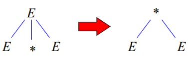
- 单变量的链进行折叠 
- 括号、逗号等具体语法进行省略 
- 子树的列表进行推平 

在LL分析中，想要顺便构建AST，只需要在遍历节点的时候将语义动作递归处理：


如果使用LR分析，则必须得显式的构造AST。栈上的符号X同时存储了AST子树，当parser进行终结操作$A\to \beta$，则根据栈上的$\beta$节点构造新的子树$A$，然后弹出这$|\beta|$个节点，再压入新的子树。


## Intermediate-Code Generation

### 中间代码及其表示

中间代码是介于源语言和目标语言之间的一种代码，它的生成既要考虑从源语言到目标语言的翻译跨度，又要考虑目标机指令集特点。这里我们介绍逆波兰式、N元式和图。

（1）逆波兰式

逆波兰式的形式是$e_1e_2\cdots e_n\theta (n\ge1)$，前面的$e_1\cdots e_n$称为运算对象，$\theta$称为运算符。

例如，对于语句

```
IF <expr> THEN <s1> ELSE <s2>
```

它的翻译是

```
<expr> <label1> BZ <s1> <label2> BR <s2>
```

其中，BZ操作符表示`<expr>`结果为假则产生一个到`label1`的转移，`label1`是`<s2>`之前的符号。BR操作符表示一个跳转。下面是一个比较完整的例子：

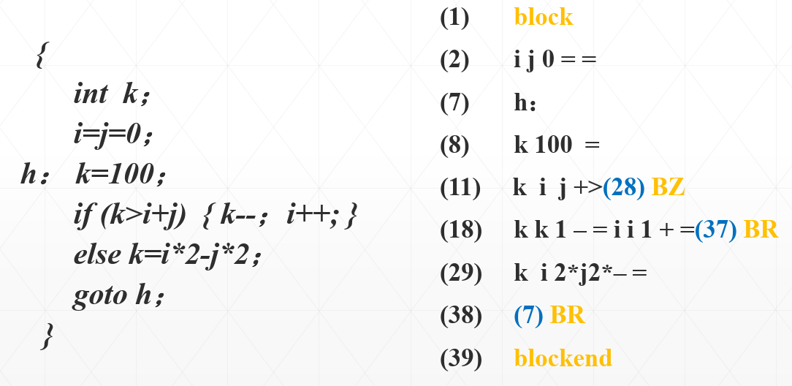

（2）三元式

用两个参数和一个操作数来表示。两个例子：


这样涉及到前后引用的关系会比较奇怪，我们可以引入一个新的间接码表：


或者直接用四元式，引入一个新的Result参数


（3）图与树表示

一个三元式可以对应一棵子树，OP对应根，ARG对应左右两个叶子节点。


### 语句翻译

（1）常量

对于常量，送入常量表，然后作为标识符在符号表登记，此后则直接进行替换。

（2）简单说明

对于变量声明，应该放入一个变量表中：


这里，我们定义三种结构用来辅助表示：

- `D.AT`，设置D的语义常量，记录语句规定的量的某种性质
- `fill(P,A)`，把性质A填入P所指的符号表入口数据项
- `ENTRY(i)`，给出i所代表的量在符号表入口

那么，我们可以把SDT定义如下：

```
S -> D;
D -> int id  {fill(ENTRY(id), int); D.AT = int}
D -> D,id    {fill(ENTRY(id), D1.AT); D.AT = D1.AT}
```

（3）复合类型

对于更加复杂一点的复合结构，可以对每一个记录建立一个单独的符号表，在符号表里存放name、TYPE、LEN、OFFSET等信息。比如，一个结构体的结构是`i32 A; f64 B; i32 C[10]; u8 D; `，那么我们可以建立这样一张符号表：

| name | TYPE       | LEN  | OFFSET |
| ---- | ---------- | ---- | ------ |
| A    | i32        | 4    | 0      |
| B    | f64        | 8    | 4      |
| C    | ARR\<i32\> | 40   | 12     |
| D    | u8         | 1    | 52     |

（4）赋值语句

在这里，我们首先引入一个新的`GEN`函数。`GEN(OP, ARG1, ARG2, RESULT)`产生一个新的四元式，并放入四元式表中。

对于一个最简单的赋值语句，我们可以使用这样的SDT：

```
A -> i=E {GEN(=, E.PLACE, _, ENTRY(i))}
```

`E.PLACE`表示存放E的变量名在符号表的位置。

（5）表达式语句

表达式是如何求值的？在不考虑优先级的情况下，我们直接对一元和二元进行匹配：

```
E -> E1 OP E2 { E.PLACE = NEWTEMP; 
				GEN(OP, E1.PLACE, E2.PLACE, E.PLACE) }
E -> OP E1 { E.PLACE = NEWTEMP; 
				GEN(OP, E1.PLACE, _, E.PLACE) }
E -> id {E.PLACE = ENTRY(i)}
```

（6）控制流语句

控制流语句在语言中出现很频繁，其变换依靠跳转指令和对应标号。我们也同样维护一个标号表，包括标号名、是否定义、地址。当D=1的时候，将它的地址放到对应的四元式中；D=0的时候，先置空，直到L进行定义。

我们经常使用的是拉链返填技术。最简单的是我们显式的指明goto语句的情况，例如

```
10 goto L1
20 goto L1
30 goto L1
40 L1:
```

我们可以在扫描的同时，建立这样一个拉链：

```
10 (j,_,_,0)  D=0
20 (j,_,_,10) D=0
30 (j,_,_,20) D=0
```

当我们扫描到40的时候，进行反向回填，将40填入L1的ADD，并置D=1，然后反向按照30->20->10->0的顺序回填。0表示填写完成。

接下来讨论分支语句。对于`if (Er) then S1 `，我们一般翻译成这样的形式：

```
Er.code
E.true:
	S1.code
E.false:
```

将其写成SDT的形式：

```
S -> if E then S1 { E.true = newLabel
					 E.false = newLabel
					 S.code = E.code | GEN(jT, _, _, E.true)|
					 	GEN(jF, _, _, E.false) |
					 	GEN(E.true':') | S1.code |
						GEN(E.false':')}
```

对于`if(Er) then S1 else S2`，对应的写法是

```
S -> if E then S1 else S2 {
	E.true = newLabel
	E.false = newLabel
	E.next = newLabel
	S.code = E.code | GEN(jT, _, _, E.true) |
		GEN(jF, _, _, E.false) |
		GEN(E.true':') | S1.code |
        GEN(j, _, _,S.next) |
        GEN(E.false':') | S2.code
}
```

对于`while E S1`，对应的SDT是

```
S -> while E S1 {
	E.true = newLabel
	E.false = newLabel
	S.begin = newLabel
	S.code = E.code | GEN(jT, _, _, E.true) |
		GEN(jF, _, _, E.false) | 
		GEN(E.true':') | S1.code |
		GEN(j, _, _, S.begin) |
		GEN(E.false':')
}
```

下面一个比较复杂的是switch。考虑一个比较简单例子：

```
switch (e) {
	case A: S1; break;
	case B: S2; break;
	case N: SN; break;
	default: SN+1
}
```

我们可以翻译成这样的形式：

```
e.code
TEST A
	ifTrue goto L1
	ifFalse goto L2
	L1:
		S1.code
		(j, _, _, next)
L2:
TEST B
	ifTrue goto L3
	ifFalse goto L4
	L3:
		S2.code
		(j, _, _, next)
...
L2n-2:
Test N
	ifTrue goto L2n-1
	ifFalse goto L2n
	L2n-1:
		Sn.code
		(j, _, _, next)
SN+1.code
next:
```

如果我们进一步分析这样的结构，可以把整个表示抽离成两部分，一部分是一个测试表，一部分是一个执行表：

```
// 测试表
if e = c1 goto L1
if e = c2 goto L2
...
if e = cn goto Ln
if default goto Ln+1
// 执行表
L1: S1.code  // 如果有break，则添加一个(j, _, _, next)，下同
L2: S2.code
...
Ln: Sn.code
default: Sn+1.code
next:
```

然后考虑for循环。同样，我们还是考察一个简单的表示形式：

```
for (e1; e2; e3) S
// 翻译后：
e1.code
L1:
	e2.code
	TEST e2
	jTrue L2
	jFalse L3
L4:
	e3.code
	j L1
L2:
	S.cpde
	j L4
L3:
```

下面是一个比较综合的例子：


（7）数组的翻译

对于数组的声明，我们首先定义一个嵌套的数组表示。比如`int a[3][5]`，可以记录每一维，然后在翻译的时候，通过公式进行计算。假设每一维的大小是$d_1, d_2, \cdots, d_n$，那么$i_1,i_2,\cdots i_n$对应的地址是
$$
A(i_1, \cdots i_n) = A + (i_1-1) \prod_{2}^n d_i + (i_2-1) \prod_3^n d_i + \cdots + (i_{n-1}-1)d_n + i_n-1
$$
进行变换，得到
$$
A(i_1,\cdots i_n) =a + \sum_1^n \left ( i_k \cdot \prod_{t\ne k} d_t \right) - (d_2d_3\cdots d_n+d_3d_4\cdots d_n+\cdots+d_n+1)
$$
可以发现，a和后边的那一个括号是一个定值，可以编译时预计算，而中间的部分则根据需要动态产生。

## Runtime

### 简介

程序需要运行，因此必须讨论和源程序等价的目标程序如何在内存中运行。下面，我们先定义一些比较重要的概念：

- **过程** 过程是一个函数。
- **活动** 过程的每一次运行是一次活动。
- **活动生存期** 从进入活动的第一条指令执行到离开此活动的最后一条指令执行的时间，包括调用其它过程时其他活动的生存期。
- **绑定** 运行时为名字X分配存储空间S。
- **生存期** 绑定关注的是生存期，也就是运行时实际分配的存储单元。
- **作用域** 声明一个变量，关心的是它的作用域，也就是它引用时在不同作用域和名字声明的结合
- **静态** 如果一个名字的性质通过说明语句来定义，则这种性质是静态确定的。例如，对过程的定义、对名字的声明、声明的作用域、符号表等。
- **动态** 如果一个名字的性质只能在运行时才能知道，则这种性质是动态确定的。例如，过程的活动、名字的绑定、绑定的生存期、活动记录等。
- **运行环境** 运行环境是目标计算机的寄存器及存储器结构，用来管理存储器并保存执行过程所需信息。

可以看到，一个变量在编译期或者运行期通过名字绑定到一个存储位置，然后在运行期赋值；而一个常量则直接绑定到右值上。

例如，当我们有一个`float x; const pi=3.14;`，它的环境是这样的：


对于C来说，环境往往是一个栈。

### 运行环境与存储组织

在运行时，系统分配的存储空间是这样的：


对于存储分配策略，可以分成两类：

- 静态分配策略：在编译时确定数据空间大小，将名字关联到存储单元
- 动态分配策略：运行时动态确定数据空间大小，又分成堆栈两种
  1. 栈式动态存储分配：在内存开辟栈区，按栈特性存储分配，每进入函数或过程，所需的存储空间则动态分配到栈顶
  2. 堆式动态存储分配：在内存开辟堆区，需要就按照某种原则在堆的自由区中分配需要的存储空间，使用后释放

总体来说，原则是尽可能对数据对象进行静态分配。对于一个栈式分配的运行环境，它的存储区分成三部分：

- code区，存储目标代码
- 数据空间，存储目标代码运行时候的空间，包括数据对象、中间结果、缓冲区等
- 控制栈，记录活动过程

在进行存储分配的时候，很重要的一部分是过程的活动记录AR（Activation Record）。它是一块连续地存储区，用来存放过程或函数的一次调用执行需要的信息。它基本内容包括：

1. 自变量实参空间，用于调用过程提供的参数值
2. 局部数据空间，函数的局部变量
3. 局部临时变量空间，编译程序设置的临时变量，用来求值
4. 保存的机器状态空间，函数调用前机器状态信息
5. 返回地址RA，调用函数返回后的地址
6. 存取链SL，可能用来存取其它活动记录中的非局部变量
7. 控制链DL，指向调用者的活动记录

### 静态存储分配

静态存储分配在编译时能确定目标程序运行需要的数据空间大小，在编译期将程序名字关联到存储单元。例如下面的fortran代码：

```fortran
PROGRAM CNSUME
	CHARACTER* 50 BUF
	INTEGER NEXT
	CHARACTER C
	// ...
END
CHARACTER FUNCTION PRDUCE()
	CHARACTER* 80 BUFFER
	INTEGER NEXT
	// ...
END
```

那么，我们会在内存形成专门的数据区：


可以发现，这种方式下，数据对象长度和内存位置必须在编译期得到，同时无法递归。

### 栈式动态存储分配

函数需要的数据空间包括生存期在本过程本次活动的数据对象（比如局部变量、临时变量）和管理过程活动的状态信息（调用中断时机器状态信息）。

对于语言来说，一个过程可以引用包围它的外层过程定义的标识符；对于实现来说，一个过程可以引用最新活动记录中的某些数据。

栈式分配下，活动记录使用运行时栈（调用栈）来维护，随着调用链生长或缩小。如果不存在函数嵌套的情况下，活动记录比较好维护；但考虑下面的代码：

```pascal
main
	var x:integer;
	proc R
	  //...
	end R
	proc Q
	  //...
	end Q
end main
```

那么，我们怎么在函数R中知道x指代的是外部的代码？对此有两种解决办法：

- 引入一个访问链SL。引一个指针指向该过程直接外层过程运行时的最新活动记录基地址，注意它指的是定义环境而非调用环境。例如下面的一个运行时栈

  

  这里一定要区分，SL是**定义环境**，DL是**调用环境**。

- 使用Display表。Display表是嵌套层次显示表，当激活过程层次是k，display表有k+1个单元，每层存放每一过程最新活动记录的基地址。例如，下面这样的结构：

  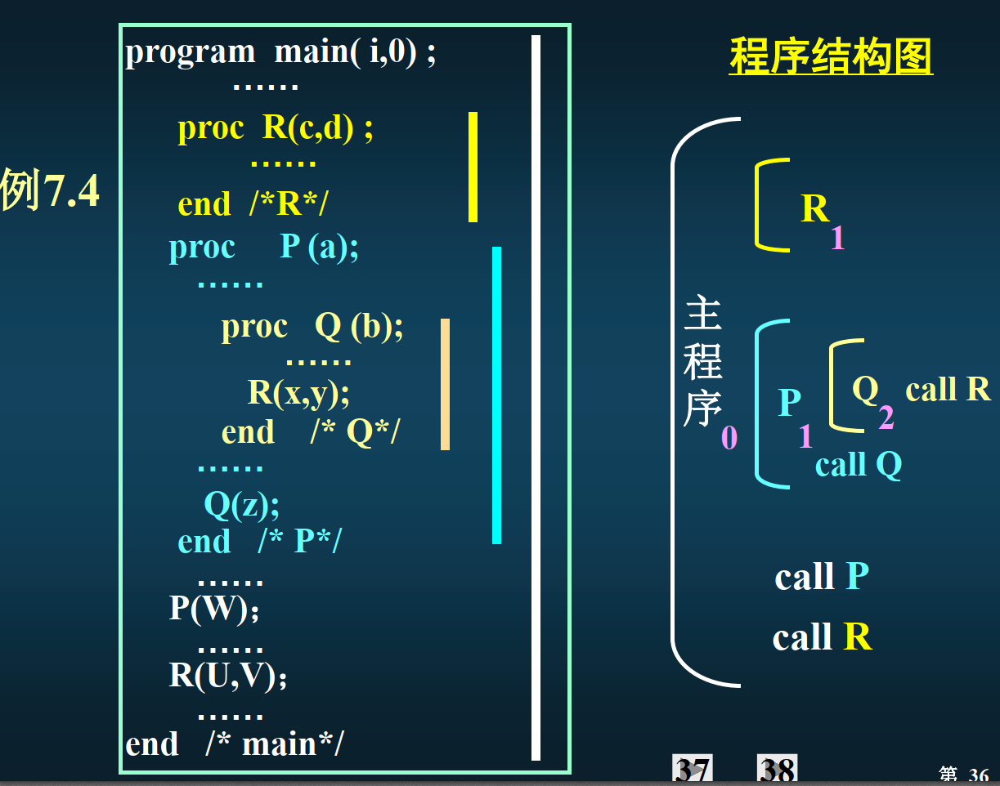

  存在这样的调用链：`Main proc -> P -> Q -> R`，那么我们就按照活动记录过程动态维护一张表：

  

### 堆式动态存储分配与垃圾回收

堆式存储的数据对象存活期比较自由，可以在任意时刻分配和释放，但管理起来非常复杂。在内存分配上，C/C++/Java等是显式分配的，也有Prolog等少数语言编译器调用；回收上则显式隐式都有。

内存分配如果使用固定大小，则会导致内存碎片，需要进行合并。如果使用手动内存管理，经常出现两种事故：

- 返回悬空指针，绑定声明周期长于对象声明周期，导致非法访问
- 内存泄漏，未释放内存，导致对象永远存在

因此，垃圾回收应运而生。运行时系统自动回收对象，用户无需关心内存释放。它的总体过程如下：

- 停止程序运行
- 找出寄存器和运行时栈的对象引用集合，记为root set
- 根据集合，找到引用对象
- 不断迭代，直到找不到新对象
- 从集合出发不可达的对象就可以进行回收

下面我们主要介绍四种常见技术。

（1）引用计数

对每个对象设置引用计数器，增加引用+1，减少引用-1，从root set出发可达对象引用计数>0，=0则可以回收。但它有几个问题：

1. 每次引用需要更新计数器
2. 多线程对计数器更新需要原子保护
3. union类型无法区分整型与指针
4. 存在循环引用问题，即AB互相引用导致二者引用计数均非0，此时造成内存泄露

（2）标记清除 Mark&Sweep

为每个对象设置一个标记flag，清除所有对象标记flag，然后从root set出发遍历所有可达对象，并进行mark。没有被标记则是垃圾，进行回收。它只在内存空间耗尽的时候触发。

因此，它需要停止程序运行，以防止遍历时对象引用关系修改。这导致内存空间较大，可能会让用户界面无法响应。对此，可以使用并发垃圾收集并监控引用操作，也可以用增量垃圾收集。

（3）拷贝算法

一般的释放无用对象不能解决碎片，可以将内存空间分成两部分A，B：

1. 在A半区紧挨着创建对象
2. A满时，将存活对象拷贝到B半区
3. 从B半区空闲位置开始创建对象
4. B半区满则重复以上步骤

这样分配空间很快，但是只有一半空间能用。一种类似的方法是标记压缩：

1. 从root set开始标记
2. 存活对象拷贝集中到一端
3. 无用对象自然抛弃
4. 从新的空闲位置开始创建对象

这样整个存储空间可用，但是GC时间比较长。

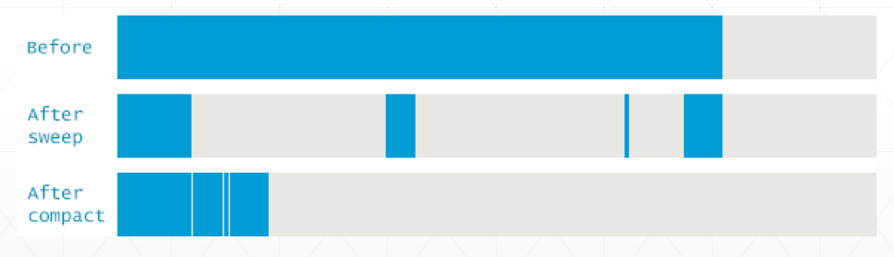

（4）按代垃圾收集

多数JVM都使用这种算法。它基于这样的观察：

- 多数对象生命周期短
- 存活时间越久越不可能是垃圾

因此，它把内存划成新生代和旧生代，将新生代存活对象拷贝到旧生代，新生代GC频率高，老生代低。


## 代码优化

### 概述

代码优化是在不改变程序运行效果的前提下，对编译程序等价变换，使之生成更高效的目标代码。它有三个原则：

- 等价：不改变程序运行结果
- 有效：优化后目标代码运行时间短
- 合算：用较小代价取得较好效果

优化可以在生成中间代码之后进行，即中间代码级优化，它的优化只取决于语言结构；也可以在生成目标程序时候进行，即目标代码级优化，依赖于目标机器。

按照涉及到的范围，它可以分成局部优化、循环优化、全局优化。局部优化只发生在基本块内，循环优化是隐式、显式循环体内优化，全局优化则是大范围优化。

下面我们介绍几种具体实现技术。

1. 常量合并和传播。例如，有代码

   ```c
   X = 2; Y = X + 10; Z = 2 * Y;
   ```

   X、Y、Z都可以作为常量传播，所以最终可以优化成

   ```c
   X = 2; Y = 12; Z = 24;
   ```

2. 公共子表达式提取。例如，有代码

   ```c
   d = e + f + g; y = e + f + z;
   ```

   那么，`e+f`可以合成一个公共子表达式：

   ```c
   x = e + f; d = x + g; y = x + z;
   ```

3. 循环变量外提。例如，有代码

   ```c
   for (i = 0; i < 3; ++i) d[i] = 2 * b + 1;
   ```

   可以发现`2b+1`不随着循环而改变，可以外提：

   ```c
   z = 2 * b + 1; for (i = 0; i < 3; ++i) d[i] = z;
   ```

4. 无用赋值消除。例如，有代码：

   ```c
   a = 5; b = 3; a = 7;
   ```

   那么第一个赋值`a=5`就是无用赋值，可以直接删去。

5. 冗余跳转消除。例如，有代码：

   ```c
   	if (x) {  } else { goto L1; }
   L1: goto L2;
   ```

   那么可以直接替换为

   ```c
   if (x) {  } else { goto L2; }
   ```

6. 死代码消除。例如，有代码

   ```c
   char c;
   if (c > 300) a = 1;
   else a = 2;
   ```

   则`c > 300`的条件永远不会满足，可以直接简化为

   ```c
   a = 2;
   ```

7. 函数内联。函数调用需要开销，所以小函数内联或许有助于降低这些开销。例如下面的代码

   ```c
   int check(int x)  {  return x > 10;  }
   void main()  {  if (check(y))  a = 5;  }
   ```

   那么我们可以直接内联：

   ```c
   void main() {
       if (y > 10) a = 5;
   }
   ```

8. 循环变换。这里介绍几个。

   （1）强度折减

   考虑下面的循环：

   ```c
   int table[100];
   step = 1;
   for (i = 0; i < 100; i += step)
       table[i] = 0;
   ```

   翻译之后，有这样的中间代码：

   ```c
   	i = 0;
   L1: t1 = i * 4;
   	table[t1] = 0;
   	++i;
   	if (i < 100) goto L1;
   ```

   我们可以把乘法转换为加法，达到优化效果：

   ```c
   	i = 0;
   	t1 = i << 2;
   L1: table[t1] = 0;
   	t1 = t1 + 4;
   	++i;
   	if (i < 100) goto L1;
   ```

   （2）动态循环的折减

   问题稍微变得复杂一些，考虑下面的代码：

   ```c
   step = step_table[1];
   for (i = 0; i < MAX; i += step)
       table[i] = 0;
   ```

   那么，优化前代码是

   ```c
   	step = step_table[1];
   	i = 0;
   L1: t1 = i * 4;
   	table[t1] = 0;
   	i = i + step;
   	if (i < MAX) goto L1;
   ```

   可以看到，这里每次循环的变量是`(i + step) * 4`。对此，可以分别进行预计算：

   ```c
   	i = 0;
   	step = step_table[1];
   	t1 = i * 4;
   	t2 = step * 4;
   L1: table[t1] = 0;
   	t1 = t1 + t2;
   	i = i + step;
   	if (i < MAX) goto L1;
   ```

   （3）复合变量的循环处理

   考虑下面的代码：

   ```c
   int table[100];
   for (i = 0, j = 0; j < 10; ++i, ++j) {
       table[10 * i + j] = i;
   }
   ```

   可以发现，上面的过程两个变量可以合并成一个变量每次增加44，所以可以转换为这样的形式：

   ```c
       i = 0; j = 0;
       t1 = i * 10;
       t2 = t1 + j;
       t3 = t2 * 4;
   L1: table[t3] = i;
   	i = i + 1;
   	t3 = t3 + 44;
   	if (i < 5) goto L1;
   ```

9. 循环展开

   对于下面的循环：

   ```c
   int x;
   for (int i = 0; i < n; ++i)
       x++;
   ```

   可以展开为

   ```c
   for (int i = 0; i < n / 4; ++i) {
       x++; x++; x++; x++;
   }
   for (int i = 0; i < n % 4; ++i) 
       x++;
   ```

### 基本块及其DAG表示

一个基本块是一个顺序执行的语句序列。它只有唯一的入口和出口，对应第一个和最后一个语句。想要划分基本块，可以使用如下算法：

1. 确定每个基本块的入口语句。入口语句是程序的第一个语句，或转移语句转移到的语句，或紧跟在转移语句之后的语句。
2. 根据确定的基本块入口语句，构造所属基本块。由入口到下一个入口语句之间的所有语句构成一个基本块；由入口到一转移语句（包括该语句）之间的语句构成基本块；由入口到程序中的停止或暂停语句（包括该语句）之间的语句序列构成基本块。
3. 凡是未包括在基本块中的语句，都是控制流不可达语句，可以直接删除。

例如，我们可以对下面的程序进行分解：

```c
<<<<基本块1>>>>
	read(limit);
	i = 1;
<<<<基本块2>>>>
L4:	if (i>limit) goto L1
<<<<基本块3>>>>
    read(j)
	if (i=1) goto L2
<<<<基本块4>>>>
    sum = sum + j
    goto L3
<<<<基本块5>>>>
L2: sum = j
<<<<基本块6>>>>
L3: i++
    goto L4
<<<<基本块7>>>>
L11:write(sum)
```

在此基础上，我们可以定义流图。流图$G=(N,E,n_0)$，$N$是所有结点，$n_0$是流图首节点，$E$是流图所有有向边。其中的边$E_i(i,j)$构建有两种情况：

- 基本块$j$在流图的位置紧跟在块$i$之后，且$i$的出口语句不是无条件转移或停
- 基本块$i$的出口语句是`goto L`或`if..goto L`，且`L`是基本块$j$的入口语句

例如，上面的基本块对应的流图如下：

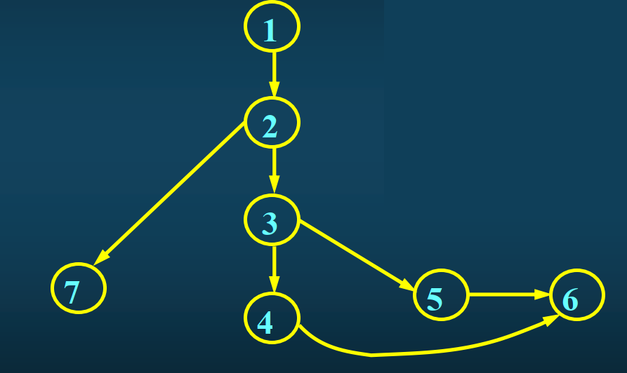

再比如下面这个例子：

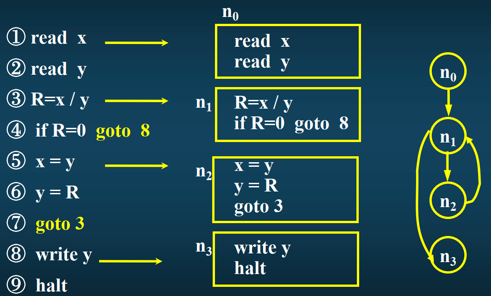

下面讨论如何把基本块转换成DAG表示。首先，我们定义一些基本概念：

1. 如果存在有向边序列$n_{i1}\to n_{i2}\to \cdots \to n_{im}$，则称$n_{i1}$与$n_{im}$之间存在一条路径，或二者之间连通。称有向边的数目为路径长度。
2. 如果存在路径使得长度$\ge 2$，且起始结束于同一个节点，则称为一个环路
3. 如果有向图$G$任意路径都不是环路，则称为有向无环图。

DAG表示中，不同元素含义如下：

1. 叶节点，标识符名或常数，写在节点下面，代表变量或常数的值。一般加上角标表示原始值。
2. 内部节点，一个运算符号，写在节点下面。
3. 图中各节点可能附加一个或多个标识符，表示有节点表示的值。

例如，下面是一个基本块的DAG表示：


根据节点不同种类，可以分成下面几种：

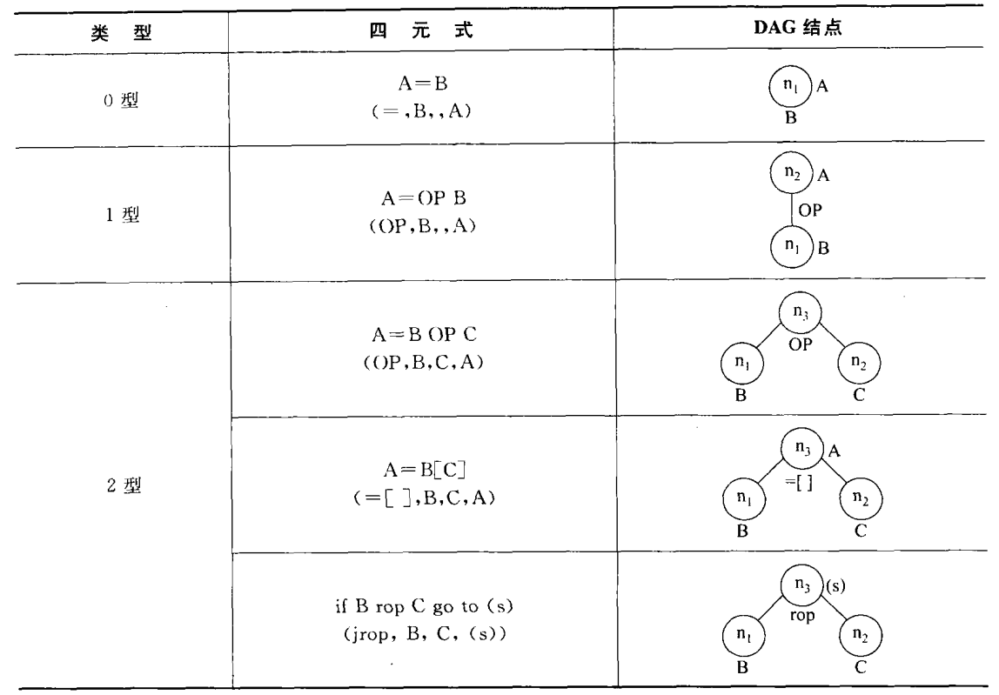

建立了DAG之后，我们就可以着手进行优化：

1. 构造叶子节点
2. 合并常数为单独节点
3. 捕捉公共子表达式，删除冗余
4. 捕捉可能无用赋值

我们还是用一个例子来说明。

| 语句       | DAG表示                                                      | 优化后语句  |
| ---------- | ------------------------------------------------------------ | ----------- |
| `T0=3.14`  |  | `T0=3.14`   |
| `T1=2*T0`  | 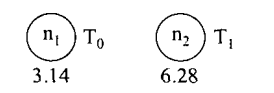 | `T1=6.28`   |
| `T2=R+r`   |  | `T2=R+r`    |
| `A=T1*T2`  |  | `A=6.28*T2` |
| `B=A`      | 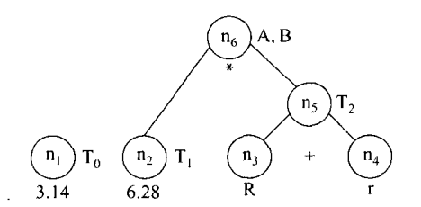 | 无用        |
| `T3=2*T0`  | 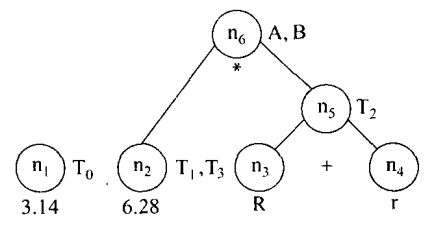 | `T3=6.28`   |
| `T4=R+r`   | 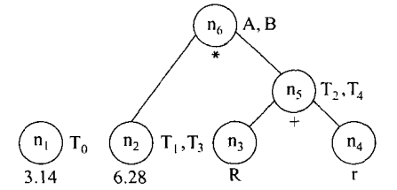 | `T4=T2`     |
| `T5=T3*T4` |  | `T5=A`      |
| `T6=R-r`   | 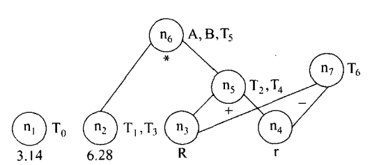 | `T6=R-r`    |
| `B=T5*T6`  | 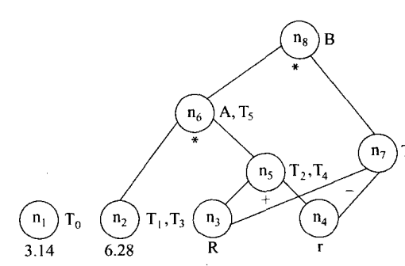 | `B=A*T6`    |

### 控制流分析

控制流分析可以用来查找循环。构成下面条件的节点序列是一个循环：

1. 强连通：任意两个节点之间有通路，则任意节点都属于该循环。
2. 入口唯一：入口是流图首节点，或节点序列外某一结点有到它的有向边

例如下图中：

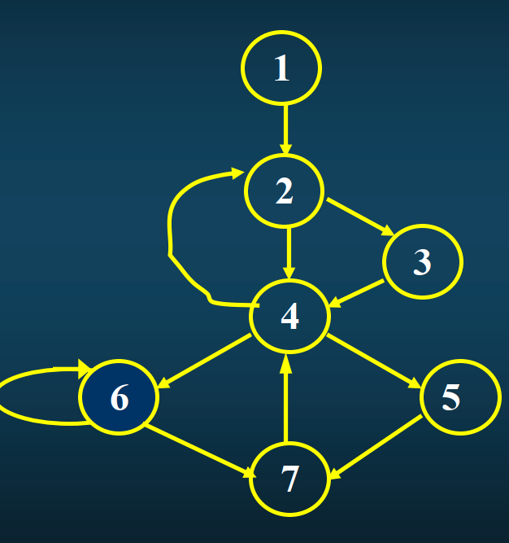

1. `{6}`是一个循环，因为强连通且有唯一入口2
2. `{4,5,6,7}`是一个循环，因为强连通且有唯一入口4
3. `{2,3,4,5,6,7}`是一个循环，因为强连通且有唯一入口2
4. `{2,4}`不是一个循环，强连通但入口是`{2,4}`
5. `{2,3,4}`不是一个循环，强连通但入口是`{2,4}`
6. `{4,6,7}`不是一个循环，强连通但入口是`{4,7}`

在此基础上，我们定义必经结点：

- **必经结点** 流图$G$中，若从$n_0$出发，到$n_j$的任意通路都需要经过$n_i$，则称$n_i$是$n_j$的必经结点，记作$n_i \operatorname{DOM} n_j$
- **必经结点集** 在程序流图$G$中，结点$n$的全部必经结点称为必经结点集，记作$D(n)$

可以发现，DOM构成了结点集上的一个偏序关系。还是上图，我们可以写出必经结点集：

$D(1)=\{1\}$，$D(2)=\{1,2\}$，$D(3)=\{1,2,3\}$，$D(4)=\{1,2,4\}$，$D(5)=\{1,2,4,5\}$，$D(6)=\{1,2,4,6\}$，$D(7)=\{1,2,4,7\}$

如果从某个点出发，能到达它的必经结点，就说明我们一定走了回头路。所以我们可以定义回边如下：设`a->b`是$G$的一条有向边，若$b \operatorname{DOM} a$，则`a->b`是流图G中的一条回边，记作`<a,b>`。例如，上图中`6->6`、`7->4`、`4->2`都是回边。

知道了上述概念，我们有如下定理：

> 如果`<n,d>`是回边，则结点d、结点n，以及所有存在通路能够到达n但不经过d的结点构成一个循环。此时，d是循环的唯一入口。

例如，我们根据找到的三条回边：

- `6->6`，`n=d=6`，所以`<6,6>`代表循环`{6}`
- `7->4`，`n=7,d=4`，由于`5,6`到4有通路且不通过7，则`<7,4>`代表循环`{4,5,6,7}`
- `4->2`，同理对应循环`{2,3,4,5,6,7}`

### 数据流分析

#### 基本概念

数据流分析解决的是多个基本块范围的优化。编译程序收集整个程序范围的有关信息和流图每个基本块的信息，这些是程序数据流的信息。

我们把语句在流图基本块中的位置称为**点**：

- **入口点**是基本块第一个中间代码前位置
- **出口点**是基本块最后一个中间代码后位置
- **相邻点**是两个中间代码之间的点。
- **定值点**是变量x获得值的中间代码的位置d，定值方式包括赋值语句、输入语句、函数调用的形参实参结合。例如，`di: x=a*b+c`，di就是一个定值点
- **引用点**是变量x的中间代码位置d，`dj:i=i+1`，这里的第一个i是定值点，第二个i是引用点。而`dk:i++`的i则同时是定值点和引用点

有流图G，变量A在G的某**点d的定值到达**另一点p，是指流图中有一通路到达p且该通路上没有对A的再定值。我们约定用`<A>`表示对A的引用，表示对A的定值。

如果P引用了变量A，则G中能到达P的A的定值点的全体称为A在引用点P的引用-定值链，即ud链。例如下图中，`di`的ud链是`{d1,d2,d3}`.可以看到，ud链维护了**引用点的定值情况**。


ud链是相对于引用点的定值，所以存在替换的情况：


可以看到，d3对di是不可达的，所以被d4取代了。

在此基础上定义活跃变量。如果程序中某变量A和某点P，存在一条从P开始的通路，引用了A在P处的值，那么就称A在P是活跃的。否则，称A在P是死亡的。


如果程序在P点对变量A定值，则定值能到达的A的引用点的全体称为A在P的定值-引用链（du链）。可以看到，du链维护的是**定值点的引用情况**。例如：

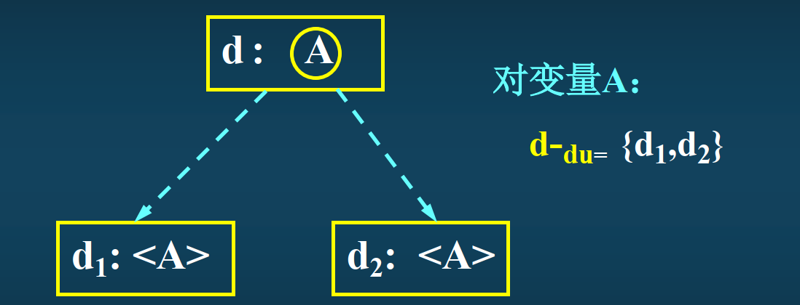

下面是一个ud链和du链的例子：

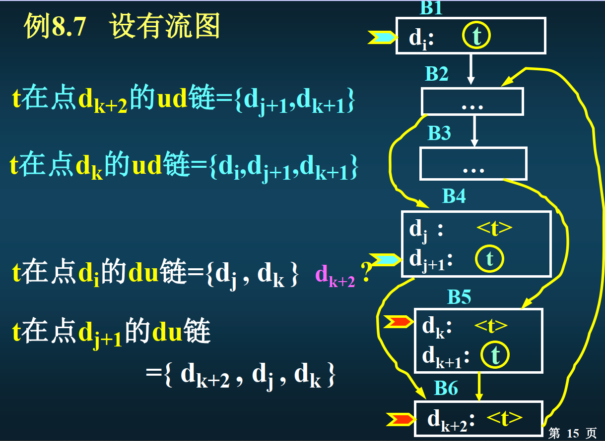

#### 基本方程

下面我们来说明数据流方程。它有几个常见的符号：

- out：能到达基本块出口之后的各变量定值点集合
- gen：能到达出口之后的所有定值点集
- in：到达基本块入口点之前的各个变量定值点集
- kill：在基本块外定值，块内重新定值的点的集合

所以可以得到最简单的数据流方程：
$$
\text{out}[B] = \text{gen}[B] \cup (\text{in}[B] - \text{kill[B]})
$$
这里要注意的是：

1. 产生、注销的概念依赖需要的信息。如果从前到后，每个基本块Bi的有关信息利用前驱基本块信息来计算。若数据流方向前-后，每个基本块Bi有关信息利用前驱信息计算，常用于到达-定值、可用表达式、复写传播等；若数据流后-前，每个基本块有关信息利用后继基本块信息计算，如活跃变量、非常忙表达式。
2. 数据流分析受到程序控制结构的影响。

下面我们给出重要数据流方程。

（1）到达定值信息。它可以用来完成常量合并，删除无用赋值。它的形式如下：
$$
\begin{cases}\text{out}[B] = (\text{in}[B] -\text{kill}[B]) \cup \text{gen}[B] \\ \text{in}[B] = \bigcup_{P\in \text{Pred}(B)} \text{out[P]} \end{cases}
$$
例如下图中：

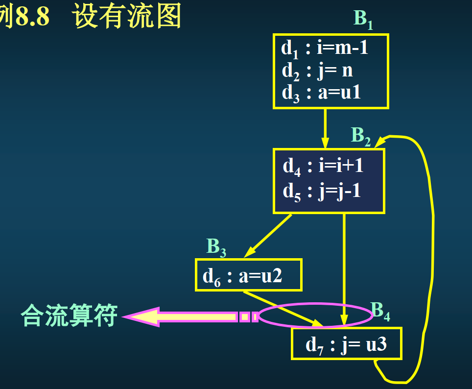

有如下计算结果：

| 集合  | gen(B)            | kill(B)               | in(B)                         | out(B)                |
| ----- | ----------------- | --------------------- | ----------------------------- | --------------------- |
| $B_1$ | $\{d_1,d_2,d_3\}$ | $\{d_4,d_5,d_6,d_7\}$ | $\Phi$                        | $\{d_1,d_2,d_3\}$     |
| $B_2$ | $\{d_4,d_5\}$     | $\{d_1,d_2,d_7\}$     | $\{d_1,d_2,d_3,d_4,d_6,d_7\}$ | $\{d_3,d_4,d_5,d_6\}$ |
| $B_3$ | $\{d_6\}$         | $\{d_3\}$             | $\{d_3,d_4,d_5,d_6\}$         | $\{d_4,d_5,d_6\}$     |
| $B_4$ | $\{d_7\}$         | $\{d_2,d_5\}$         | $\{d_3,d_4,d_5,d_6\}$         | $\{d_3,d_4,d_6,d_7\}$ |

这里要注意的是，我们有一个从B4到B2的回边，导致B2的in包括B4的out。因此，这里处理的时候需要反复迭代，直到达到不动点。

利用到达-定值信息可以方便的计算ud链。有两条规则：

- 基本块内，变量的引用点u之前有定值点d，且d点A的定值能到达u，则A在u的ud链为$\{d\}$
- 基本块内，变量的引用点u之前无定值点d，则`IN[B]`中A的定值点均可达，这些定值点组成ud链。

（2）可用子表达式信息。

我们定义一个表达式是否在P点有用：从初始节点到P的每条路径都计算x+y，且最后一个x+y到P之间未对x或y定值，则表达式x+y在P可用。举一个例子：

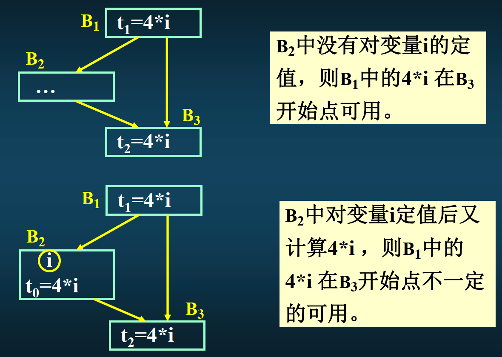

它的数据流方程如下：
$$
\begin{cases}\text{out}[B] = (\text{in}[B] -\text{kill}[B]) \cup \text{gen}[B] \\ \text{in}[B] = \bigcap_{P\in \text{Pred}(B)} \text{out[P]} \end{cases}
$$
可以发现，它和到达-定值方程的区别在于，其合流运算符使用的是$\cap$。这样，只有在所有前驱块结束点都可用，才能保证表达式可用。

（3）活跃变量信息。它常用来进行寄存器分配。

它的过程是逆推的：
$$
\begin{cases} \text{in}[B] = (\text{out}[B] - \text{def}[B]) \cup \text{use}[B] \\ \text{out}[B] = \bigcup_{S \in \text{succ}(B)}\text{in}[B] \end{cases}
$$
这里，def指的是基本块中定值，且定值前未在B中引用过的变量集合；use指的是基本块中引用，但引用前未在B中定制的变量集。

### 循环优化的实施

在进行控制流分析和数据流分析之后，我们就可以着手开始进行循环优化。首先建立一个新结点，它也是一个基本块，以循环入口为唯一后继。


我们主要介绍两种技术：代码外提和强度折减。

#### 代码外提

代码外提是把循环中的不变运算提到前置节点中，也就是和循环执行次数无关的或不受循环遍历影响的运算。对于语句`A = B op C`，如果B和C是常量，或B和C的定值点在循环外，那么B op C的值一定不变。下面是一个例子：


因此，外提的时候需要查找循环中的不变量，然后进行外提。

（1）不变量查找

不变量查找需要反复迭代：

1. 基本块每个语句中，如果每个运算对象是常数或定值点在循环外，则标记为“不变运算”
2. 重复下面过程，直到没有新的语句被标记为不变运算
3. 遍历所有非“不变运算”的语句，考察所有运算对象。如果运算对象是常数，或定值点在L外，或有唯一的到达-定值点且该点语句标记为“不变运算”，则也进行标记

（2）代码外提

对于不变运算`S:A=B op C`或`A = op B`或`A=B`，检查是否满足条件之一：

1. S所在的结点是循环所有出口结点的必经结点（保证这个运算是必须执行的，这样不会在出了循环之后引用错误值。比如某个赋值在循环的if里做，直接把它优化的话相当于不管if不if都直接定了值，出了循环可能就错了。），A在循环其它地方没有定值（保证使用的值一定是正确的，比如一个ifelse，if和else是对同一变量的两种定值，那就有可能会错），循环中所有A的引用点只有在S中A的定值才能到达（比如定值前就使用的值，如果提前定了就可能就会错）
2. A在离开循环后不再活跃（任何出口结点的后继节点入口不活跃，还是上面的例子，你if里的赋值变量如果在循环外不用，那么随便怎么改都ok），A在循环其它地方没有定值，循环中所有A的引用点只有在S中A的定值才能到达。

如果满足条件之后，依次将不变运算外提。当然，如果A的运算对象（比如B、C）在L定值，那需要先将B、C提到前置节点中。

还是举个例子：

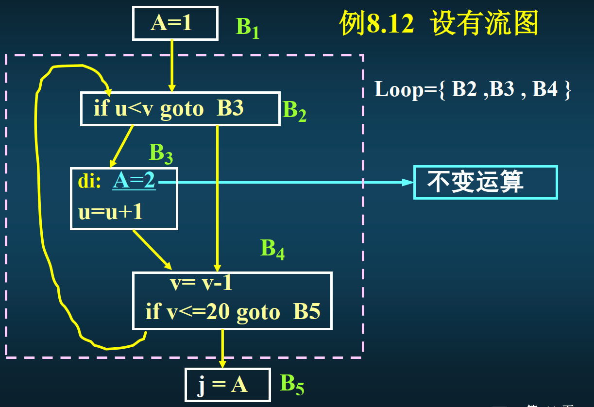

可以看到，在这个例子中，如果把A=2外提，那么$B_5$的j=A就可能会错误。

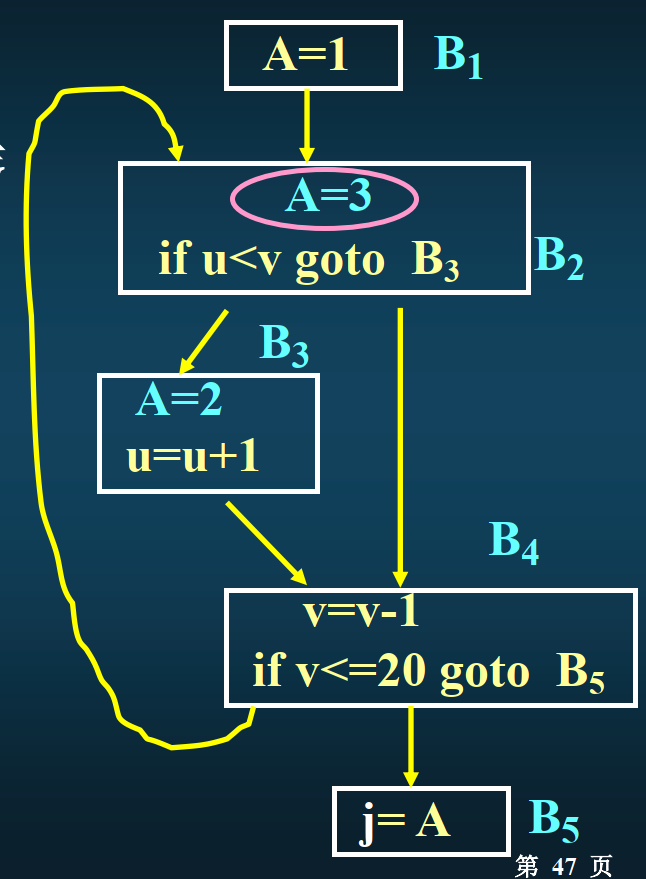

在这个例子中，A=3使用不止一次。如果把它外提，在循环外赋初值，那么每次循环可能就会导致值不能正确改变。

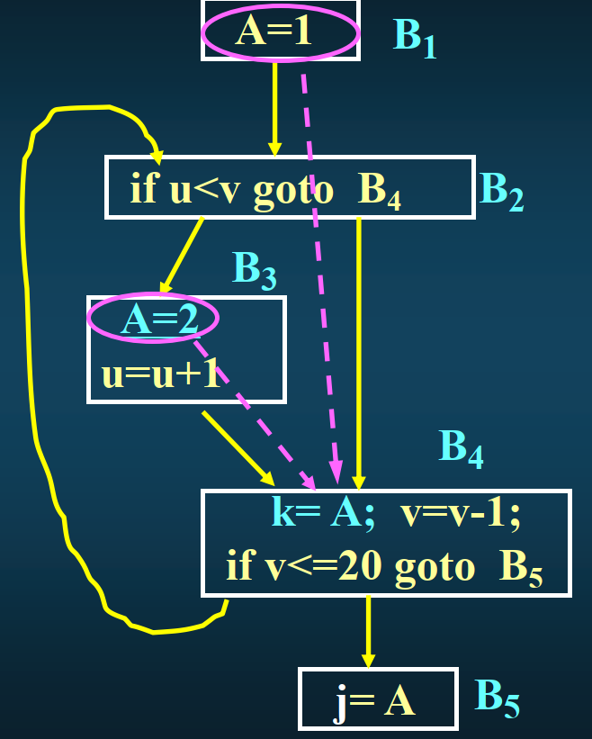

在这个例子中，A的引用`k=A`并不是只有`A=1`能到达。所以将`k=A`外提，会导致赋值错误。

#### 强度削减和归纳变量删除

一般而言，循环存在$I = I \pm C$，且有$T = K \times I \pm C$。我们称`T`是归纳变量，`I`是基本归纳变量，这些变量每次的递增和递减值是相同的，我们可以用加减运算来替换。

具体来说，如果循环中变量I只有$I = I \pm C$的形式，就称I是基本归纳变量。如果$J$总能化为
$$
J = C_1 I + C_2
$$
那么就称J是归纳变量，与I同族。它有三个步骤：

1. 查找归纳变量。扫描循环，找到所有基本归纳变量；然后迭代查找归纳变量K：`K = J * C or K = C * J or K = J / C or K = J + C or K = J - C `，其中C是不变量，J是基本归纳变量或归纳变量。
2. 强度削弱。依次考虑归纳变量，然后进行如下操作：
   - 建立新变量S
   - 用J=S取代原来对J的定值
   - 在`I=I+n`的四元式后加上`S=S+C*n`
   - 保证S在L入口的初值是`C*I+d`
3. 删除归纳变量。考察每个仅用于计算同族其它归纳变量和条件分支的基本归纳变量，取一个归纳变量I和一个归纳变量J，将含I的测试改为含J。如果替代后的I不再引用，则从循环中删除对I定值的语句。

下面是一个例子，我们要计算$\sum_1^{20} a_ib_i$，代码如下：

```c
prod = 0;
for (int i = 1; i <= 20; ++i) {
    prod = prod + a[i] * b[i];
    i++;
}
```

那么可以进行优化：

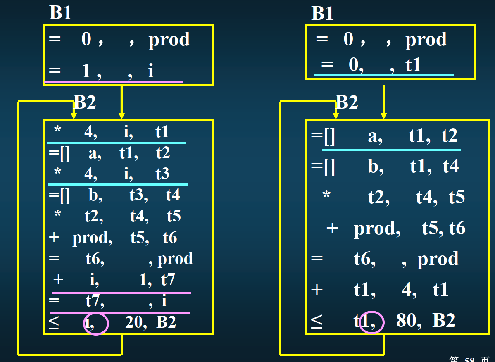

## 目标代码生成

### 概述

从中间代码生成目标代码，需要经过指令选择、寄存器分配、指令调度等过程。它往往是NP难的，所以可能需要很多近似算法。

- 指令选择，如果IR层次低，有可能生成高效代码；同时也和目标代码质量有关。
- 寄存器分配，涉及到将哪些变量放寄存器、将哪个寄存器分配给变量
- 指令调度，指令顺序影响执行效率

### 简单的代码生成器

我们用一个简单的代码生成器来说明目标代码的生成过程。它分成五个步骤：

1. 遍历基本块的三地址指令
2. 确定需要将哪些操作对象加载到寄存器
3. 生成从内存加载到寄存器的指令
4. 生成计算指令
5. 生成必要的写回指令

在翻译过程中，我们需要维护两个数据结构：

1. 寄存器描述符，存储寄存器当前存储变量
2. 地址描述符，记录每个变量最新值的存储位置

我们用`getReg(I)`来对寄存器进行分配。那么，对于不同的指令，它工作方式如下：

- `x=y+z`，首先用`getReg`为x、y、z选择寄存器$R_x,R_y,R_z$。如果y不在$R_y$，则需要生成一条`LD Ry, ADDR(y)`；如果z不在$R_z$，则需要生成一条`LD Rz, ADDR(z)`；生成指令`ADD Rx, Ry, Rz`；将$R_x$从其它变量描述符中删除。当基本块结束时，如果`x`最新值不在内存里，则生成`ST ADDR(x), Rx`
- `LD R, Addr(x)`，将R的描述符设为持有x，将x的变量描述符增加R，表示值也在R中
- `ST Addr(x), R`，将x的变量描述符增加对应内存位置，表示值也在内存中
- `x=y`，getReg为二者分配相同寄存器，生成加载y的指令`LD Ry, Addr(y)`，然后将x添加到$R_y$的描述符，修改$x$描述符使得只包含$R_y$

下面是一个例子：

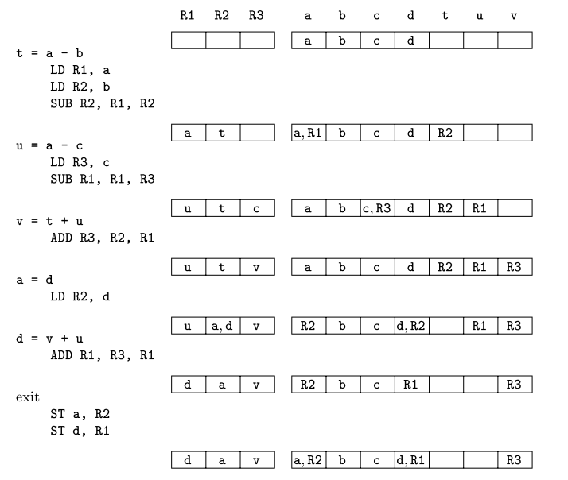

那么如何实现getReg呢？

1. 如果x已经在寄存器，则直接返回
2. 如果x不在寄存器，且有空闲，则返回一个空闲
3. 否则选一个已经占用的寄存器，根据描述符将对应变量写回内存，然后会返回对应寄存器

### 指令选择

指令选择是找到一个机器指令集合，实现IR树的操作，相当于找到一个不重叠的模式覆盖。比如我们有下面这些模式：

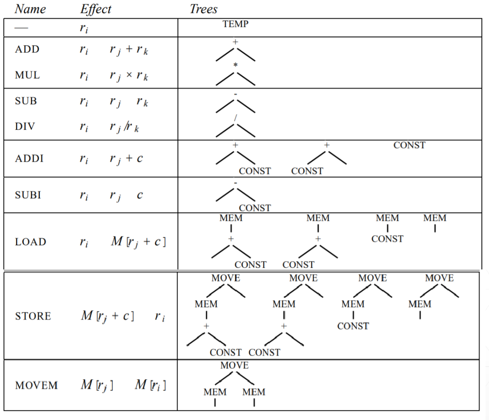

那么，如果我们按照之前的方法，单个结点进行匹配，可能得到的结果是


而如果按照树模式进行匹配，生成的代码会大大减少：


### 寄存器分配

寄存器分配之所以复杂，考虑下面这个例子：

```c
a = c + d;   ->   r1 = r2 + r3;
e = a + b;   ->   r1 = r1 + r4;
f = e - 1;   ->   r1 = r1 - 1;
```

可以看到，如果a和e使用之后就死亡，那么a、e、f可以共用一个寄存器。

下面我们介绍几种常见的寄存器分配方法。

（1）Naïve Allocation

每次从内存加载，使用完写回。

（2）固定寄存器分配

将m个寄存器分配给m个局部变量，n个寄存器分配给n个堆栈位置，分配k个临时计算的寄存器，其他值全部保留在内存中。

（3）局部寄存器分配

在基本块开始前加载，结束时写回，块内按需分配。

（4）线性扫描

定义Live Range和Live Intervals：

- Live Range是变量活跃的程序点集
- Live Interval是变量在中间代码包括live range的最小区间

比如，下图的代码就展示了Live Interval：


接下来进行贪心扫描：

1. 记录程序点上哪个寄存器是空闲的
2. 遇到新的live interval开始，分配一个寄存器
3. 如果live interval结束，释放相应寄存器
4. 如果出现不够用的情况，则置spilling。此时，将变量从内存load到寄存器，对变量进行操作，然后再写回内存。

（5）图着色

如果一个变量死了之后，就不需要在剩余计算中使用。那么，如果变量`t_1,t_2`只有至多1个在同一时间保持活跃，他们就可以用相同的寄存器。

据此，我们可以构建一个图：


这张图称为register interference graph（RIG），如果两个顶点不相邻就可以分配同一个寄存器，所以接下来的问题就是对这张图进行k着色。但这是个NP问题，我们只能给出近似解。

首先观察到一个事实：选择一个少于k个邻居的结点t，如果将它和它的边从RIG中删掉，剩余部分可以进行k着色，那么原先的图一定可以k着色。因此，我们开辟一个栈，不断地从RIG删掉少于k个邻居的结点并入栈，直到graph只有一个结点，然后再逆序开始染色。


但如果过程中遇到情况，无法继续移除，此时就需要选择一个节点并置溢出，然后继续迭代。比如，上例中置k=3，在删除a之后就陷入僵局：


此时，就只能溢出掉f。此时，可以认为活跃变量需要重新计算：

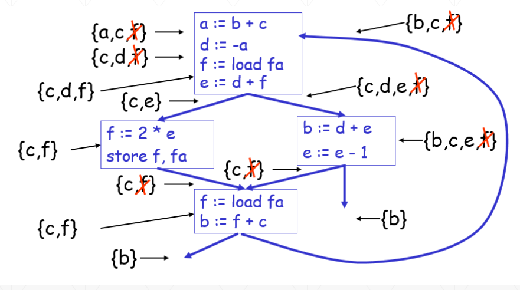

那么我们生成这样一张新图：


这张图就可以3-着色了。至此，寄存器分配完成。当然，这里可能有很多启发式信息。
