# 计算机体系结构

## 基本概念

### 多级层次结构

计算机系统=软件+硬件/固件

从**使用语言**的角度划分为多级层次结构

- 应用语言
- 高级语言
- 汇编语言
- 机器语言

- 第0和第1级属于计算机组成与系统结构
- 第2-4属于系统软件，可视为**虚拟计算机层次**

计算机系统结构主要研究软硬件功能分配和软硬件界面的确定

翻译与解释的区别

- 翻译：先翻译后执行
- 解释：边解释边执行

### 系统结构、组成与实现

#### 计算机体系结构

指的是层次结构中**传统机器级**的系统结构

- 其界面之上的功能包括操作系统级、 汇编语言级、 高级语言级和应用语言级中所有软件的功能
-  界面之下的功能包括所有硬件和固件的功能

体系结构是是对计算机系统中各级界面的划分、定义及其上下的功能分配。

计算机系统的主要软、硬件交界面特性包括 ：指令系统、数据表示、存储系统、中断系统、I/O系统   

传统机器语言程序员看到的计算机属性，包括

- 数据表示
- 寻址方式
- 寄存器组织
- 指令系统
- 存储系统组织
- 中断机构
- 管态和用户态的定义和切换
- 机器级IO结构
- 信息保护方式和保护机构

#### 计算机组成

计算机系统结构的逻辑实现，包括机器内数据流和控制流的组成以及逻辑设计

- 数据通路宽度
- 专用部件的设置
- 各种操作对部件的共享程度
- 功能部件的并行度
- 控制机构的组成方式
- 缓冲和排队技术
- 预估、预判技术

#### 计算机实现

计算机组成的物理实现，主要着眼于器件技术和微组装技术  

#### 三者关系

- 系统结构要考虑组成和实现的发展
- 组成要考虑系统结构和实现，决定于系统结构，受限于实现
- 组成与实现不是被动的，折中权衡；  
- 实现是物质基础

计算机组成和实现都属于计算机系统的内特性，这些特性对程序员来说是透明的

### 软硬件取舍和计算机系统的设计思路

#### 设计的主要思路

分界面在传统机器级

- 由上到下：适用于专用机
- 由下到上：适用于通用计算机（很少使用）
- 中间开始

### 计算机设计的量化准则

Amdahl定律：系统中某一部件由于采用某种更快的执行方式后整个系统性能的提高与这种执行方式的使用频率或占总执行时间的比例有关  

- 加速比Sn

  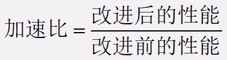 或

  等

- 系统加速比的依赖因素

  - 可改进比例Fe
  - 性能提高比Se

  
  
- 改进后的加速比为

  

- CPU性能公式

  - 时钟频率：主频

  - 指令时钟数CPI：每条指令执行所用的时钟周期数

  - IPC：每个时钟周期执行的指令数

  - 吞吐量：单位时间内处理请求的数量

  - 响应时间：系统对请求作出响应的时间（包括CPU时间和等待时间）

  - 指令速度：

    MIPS

    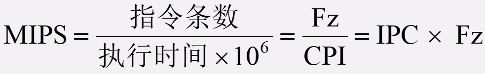

    （吉普森法）

    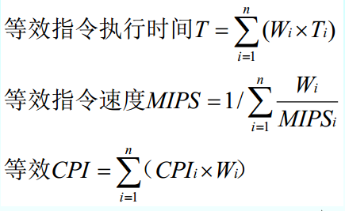

### 对系统结构的影响因素

软件可移植性的几种技术

- 统一高级语言

- 采用系列机思想

  同一厂家生产的具有相同的系统结构，不同组成和实现的一系列计算机系统。  

  兼容机则是不同厂家生产的

  软件兼容的设计方法

  - 向后兼容（最重要）
  - 向前兼容
  - 向上兼容
  - 向下兼容

- 模拟与仿真

  - 模拟：使用软件实现，机器语言-主存中，速度低
    - 宿主机：用软件解释执行
    - 虚拟机

  - 仿真：使用硬件、固件实现，微程序-控存中，速度高
    - 宿主机：用微程序解释执行
    - 目标机

### 系统结构中的并行性

同时性：两个或多个事件在同一时刻发生。

并发性：两个或多个事件在同一时间间隔内发生。

从执行程序角度来看，并行性等级从低到高分别是

- 指令内部
- 指令之间
- 任务或进程之间
- 作业或程序之间

从处理数据的并行性来看

- 位串字串
- 位并字串
- 位片串字并：同时对许多字的同一位(称位片)进行处理
- 全并行

信息加工步骤来看

- 存储器操作并行，比如并行存储系统
- 处理器操作步骤并行，比如流水线处理机
- 处理器操作并行，对多个数据组同时操作，阵列处理机
- 指令、任务、作业并行，比如多处理机

并行开发的途径

- 时间重叠：多个处理过程在时间上错开，异构流水线处理机，异构多处理机
- 资源重复：同构处理机，阵列处理机
- 资源共享：分布式多处理机

多机系统中耦合度

- 最低耦合，脱机处理系统，通过中间存储介质连接
- 松散耦合，通过通道或通信线路，分享外设
- 紧密耦合，通过总线或高速开关，分享主存

弗林分类法

- 指令流：机器执行的指令序列。
- 数据流：由指令流调用的数据序列，包括输入数据和中间结果
- 多倍性：在系统性能瓶颈部件上同时处于同一执行阶段的指令或数据的最大可能个数。
- SISD：单指令单数据流
- SIMD：单指令多数据流
- MISD：多指令单数据流
- MIMD：多指令多数据流

库克分类法

- SISE：单指令单执行流
- SIME：单指令多执行流，
- MISE：多指令单执行流，多道程序系统
- MIME：多指令多执行流

## 数据表示与指令系统

### 数据表示

常用数据典型有三类

- 用户定义的数据
- 系统数据
- 指令数据

体系结构研究的首要任务是：数据类型的实现方式（硬件？软件？）

数据类型包括数据表示和数据结构。

#### 数据表示

可以被硬件直接识别和指令系统直接调用的数据类型

#### 数据结构

结构化数据的组织方式，反映了应用中各种数据元素或信息单元的结构关系，必须通过**软件映像**变换成机器中所具有的各种数据表示

#### 数据表示和数据结构的关系

- 数据结构是通过软件映像成机器所具有的各种数据表示实现的
- 数据表示是数据结构的组成元素
- 数据类型用数据结构或数据表示实现，实质是软硬件取舍问题

#### 几种高级数据表示

- 自定义数据表示

  可分为

  - 带标志符的数据表示

    

  - 数据描述符

    

  - 区别：

    - 标识符和数据存于同一个存储单元中
    - 描述符和数据分开存放（通常作用于一组数据）

- 向量数据表示

- 堆栈数据表示 

#### 引入数据表示的原则

- 缩短程序运行时间
- 减少CPU与主存储器之间的通信量
- 这种数据表示的通用性和利用率是否很高

### 寻址方式

体系结构研究重点：分析各种寻址技术的优缺点，选择和确定寻址技术

研究的内容：编址方式、寻址方式、定位方式

研究对象：寄存器、主存储器、堆栈和输入输出设备

#### 编址方式

- 分类编址（大多数采用，将通用寄存器、主存、堆栈分类）
- 统一编址
- 隐含编址

#### 寻址方式分析

寻址方式的指明：

- 显式：设置专门的寻址方式字段
- 隐式：由操作码隐含

- 面向寄存器的寻址方式
- 面向主存的寻址方式
- 面向堆栈的寻址方式

具体的寻址方式包括

- 立即寻址
- 直接寻址
- 间接寻址
- 变址寻址：基地址在变址寄存器中

#### 定位技术

程序的独立性与模块化设计，逻辑地址空间与物理地址空间不一致，需要进行逻辑地址空间到物理地址空间的变换，即进行程序的定位

- 直接定位
- 静态再定位：调用**装入程序**，在程序执行过程中，物理地址不再改变
- 动态再定位：程序执行过程中，当访问到相应的指令或数据时才进行地址变换

#### 信息分布

物理地址空间通常按字节编址

- 任意存储
- 按字节数或位数的整数进行存储

### 指令系统的设计和优化

指令=操作码+地址码

操作码主要包括两部分

- 操作种类
- 操作数描述

地址码通常包括三部分

- 地址
- 地址附加信息
- 寻址方式

#### 指令操作码优化

目的：使操作码字段占用的位数最少

- 信息源熵的概念

  - 信息源包含的平均信息量

  - 对于操作码就是操作码的最短平均码长

  - 计算公式为

    

- 信息冗余量

  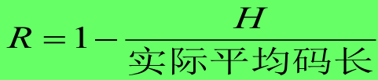

- 实际平均码长

  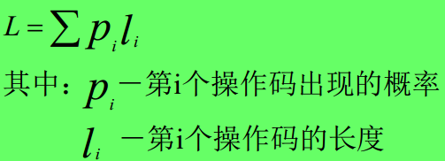

三种编码方式（建议找题自己算一算）

- 固定长度编码

- Huffman编码

  码值不唯一，但平均码长唯一

- 扩展编码

#### 指令地址码优化

- 用比较短的地址表示比较大的虚拟空间
- 可变长操作码与可变长地址码配合

### 指令系统的改进与发展

两种方向

- 增强指令系统功能（软件功能硬化，CISC）
- 简化指令系统（精简指令，RISC）

#### 按照CISC方向改进指令系统

目标：强化指令功能，减少指令条数

- 面向目标程序的优化实现

  方法

  - 利用哈夫曼思想改进指令
  - 增设强功能复合指令

- 面向高级语言的优化实现

  方法

  - 统计使用频度来改进指令
  - 面向编译、优化代码生成来改进指令，增强指令系统的规整性
  - 缩小指令系统与各种语言的语义差异
  - 让机器具有多种指令系统
  - 发展高级语言计算机

- 面向操作系统的优化实现

  方法

  - 统计使用频度来改进指令
  - 增设专用于OS的新指令
  - 用硬件或固件实现OS的某些功能
  - 由专门处理机完成OS

CISC存在的问题

- 日益庞大复杂的指令系统实现越来越困难，可能降低系统性能
- 最常使用的是一些比较简单的指令，仅占指令总数的20%，剩下的是使用频度很低的指令
- 复杂指令使指令的执行周期大大加长
- 增强了指令系统功能，简化了软件，但硬件变复杂了
- 规整性不足

#### 按照RISC方向改进指令系统

设计基本原则

- 只选用频度很高的指令和关键指令，条数很少
- 减少寻址方式的种类
- 简化指令格式，限制在两种内，且具有**相同长度**
- 所有指令在**一个机器周期**内完成
- 扩大通用寄存器个数，一般大于等于32
- 尽可能减少访存，仅Load和Store指令可以访问存储器
- 大部分指令通过硬联控制，提高速度
- 优化设计编译程序，以简单有效方式支持高级语言实现

注意，**减少CPI**是RISC的精华

优点

- 简化了指令系统设计，适合VLI实现
- 提高了执行速度和效率
- 降低了成本，提高了可靠性
- 提供直接支持高级语言的能力，简化了编译程序设计

缺点

- 增大了程序占用空间，加重了汇编程序员负担
- 对浮点运算和虚拟存储器支持不够理想
- 较难编写

#### 设计RISC的关键技术

- 重叠寄存器窗口技术

  减少因传送参数而访问存储的次数

  让每个过程使用一个有限数量的寄存器窗口，并让各过程窗口部分重叠

  

- 流水线技术

  本条指令的执行与下一条指令的预取**重叠**

  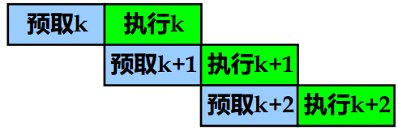

- 延迟转移技术

  为避免无条件转移指令或成功条件转移指令造成指令预取浪费，流水线断流等问题，采用延迟转移，即在**转移指令后**插入一条不相关的有效指令

  限制条件

  - 被移动的指令在移动过程中与经过的指令不能有数据相关
  - 被移动的指令不破坏条件码

- 指令取消技术

  采用指令延迟时，许多情况下找不到可调整的指令，故采用指令取消技术，

  - 向后转移（循环程序）

    循环体第一条指令经过调整后安排在两个位置

    - 循环体前
    - 循环体后，转移成功时执行

    

  - 向前转移（if-then)

    方法：如果转移不成功执行下一条指令，否则取消下一条指令

  - 隐含转移

    场合：用于if-then，且then部分只有一条指令

    方法：if条件取反，如果取反后条件成立则取消下条指令，否则执行

- 指令流调整技术

  通过变量重新命名消除数据相关，提高流水线执行效率

  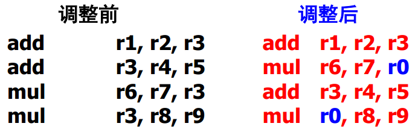

- 优化编译系统设计的技术

  RISC使用了大量寄存器，编译程序必须优化寄存器的分配和使用
  
- 以硬件为主固件为辅

## 输入输出系统

主要功能是对指定外设进行输入输出操作

### 概述

特性

- 异步性：各设备按照自己的时钟工作
- 实时性：处理机必须及时处理设备
- 与设备无关性：独立于具体设备的标准接口，外设通过标准接口与其连接

组织方式

- 针对**异步性**，采用自治控制

  输入输出系统独立于处理机之外

- 针对**实时性**，采用层次结构

  - 最靠近处理机的是输入输出处理机、输入输出通道等。
  - 中间层是标准接口
  - 标准接口通过设备控制器与输入输出设备相连
  - 设备控制器控制外围设备工作

- 针对**与设备无关性**，采用分类处理

三个发展阶段，对应三种方式

- 程序控制输入输出
- 直接存储器访问（DMA）
- I/O处理机方式

### 磁盘阵列RAID

成本功耗低，传输速率高，提供容错功能

组成的逻辑磁盘驱动器的容量要小于各个磁盘驱动器容量的总和。

独立冗余磁盘阵列

- RAID0：无冗余无校验的磁盘阵列

  所有磁盘并行工作，各自读出对应部分，不提供数据冗余

- RAID1：镜像磁盘阵列

  每次写入数据时，都会将数据复制到其镜像盘上。

- RAID2：纠错海明码磁盘阵列

  每个数据盘存放数据字的一位，还需要3个磁盘来存放海明校验位

- RAID3：位交叉奇偶校验的磁盘阵列

  RAID2的简化版本，校验盘专门存放数据盘中相应数据的奇偶校验位

- RAID4：块交叉奇偶校验的磁盘阵列

  以块为单位进行交叉存储和计算奇偶校验

- RAID5：无独立校验盘的奇偶校验磁盘阵列

  每一行数据块的校验块被均匀存放到不同盘中

- RAID6：双维无独立校验盘的奇偶校验磁盘阵列

  增加了第二个独立的奇偶校验信息块

影响RAID级别选择的因素为：可用性、性能、成本

- 选择RAID0获得最佳性能
- 如果成本不是主要因素，根据硬盘数量可选择RAID1
- 如果可用性、成本和性能都同样重要，则根据一般的数据传输和硬盘的数量选择RAID3、RAID5。

### 总线设计

总线特点

- 总线是一组能为多个部件**分时共享**的公共信息传送线路

总线事务：在总线上一对设备间一次信息交换过程，通常包括两个阶段，地址阶段和数据阶段

- 主设备：发出总线事务请求，获得总线使用权
- 从设备：与主设备进行信息交换的对象

总线周期：完成一次总线操作的时间

#### 总线类型

按信息传输方向，总线可分为

- 单向传输
- 双向传输
  - 半双向
  - 全双向

按用法可分为

- 专用
- 非专用

#### 总线的数据宽度

数据宽度是I/O设备取得I/O总线后所传送**数据的总量**

- 单字（单字节）宽度适合于低速设备。
- 定长块宽度适合于高速设备，可以充分利用总线带宽。
- 变长块宽度适合于高优先级的中高速设备
- 单字加定长块宽度适合于速度较低而优先级较高的设备
- 单字加变长块宽度是一种灵活有效但却是复杂、花钱的方法

#### 总线的线数（总线宽度）

在满足性能要求以及所用通信类型和速率适配的情况下，应尽量减少总线的线数。

可采用线功能组合、并/串-串/并转换和编码表示来减少

#### 总线的性能指标

- 总线宽度。指总线的线数，地址线和数据线的数量有最直接的影响

- 总线带宽，总线最大数据传输速率

  总线带宽=总线宽度×总线频率

- 总线负载：指连接在总线上的最大设备数量

- 总线复用：不同时段利用总线的同一信号线传送不同信号

- 总线猝发传输

#### 总线定时控制

- 同步定时方式

  采用一个统一的时钟信号协调发送和接收方，时钟产生相等的时间间隔，每个间隔构成一个总线周期，在 一个总线周期内，可以进行一次数据传送。

  必须适应延迟最长和最慢的接口的需要

- 异步定时方式（应答方式）

  通过双方握手信号实现定时控制，可保证工作速度相差大的部件进行信息交换

  有三种情况

  - 不互锁：请求和回答信号都有一定时间宽度
  - 半互锁：请求信号的撤销取决于收到回答信号
  - 全互锁：请求信号的撤销取决于收到回答信号，又导致回答信号的撤销

  

#### 总线通信技术

- 同步通信

  同步通信时两个部件之间信息传送时通过定宽、定距的系统时标进行的

- 异步通信

  异步通信又可分为单向控制和双向(请求/回答)控制两种。

  - 单项控制是指通信过程中只由目的或源部件中的一个进行控制

#### 总线控制方式

当采用**非专用总线**时，由于可能同时有多个设备同时申请使用总线，需要按照优先级进行裁决

- 总线的集中仲裁方式

  总线控制机构中设置总线判优和仲裁控制逻辑，集中在一处

  - 链式查询方式

    使用三根控制线与所有部件和设备相连

    

    - 总线请求BR：有效表示至少有一个部件或设备要求使用总线
- 总线忙BS：有效表示总线正被某部件或设备使用
    - 总线批准（总线可用）：有效表示总线控制器相应总线请求
    
    缺点是对查询链电路故障敏感，需要3根线

  - 计数器定时查询方式

    

    - 如果计数从0开始，则优先次序与定时查询相同
  - 如果计数从中止点开始，则为循环优先级
  
    需要2+log2n根线

  - 独立请求方式

    

    共需2n+1个控制线

- 总线的分布仲裁方式

  总线控制逻辑分布到总线各个部件中，每次总线操作，只能有一个主方占用总线控制权，但同一时间里可以有一个或多个从方。

  - 自举分布式

    设备优先级固定，请求总线控制权设备会在总线请求线上发送请求信号，同时可从总线上接受请求信号，如果检测到优先级更高的设备发起了请求，则不可以使用总线，否则立刻使用，并向其他设备发送总线忙信号

  - 冲突检测分布式

    设备先侦听总线是否忙，如果不忙则置总线忙，并使用总线。

    如果发生冲突，则延迟一个随机时间后再使用总线以避免冲突

  - 并行竞争分布式

    每个设备都有一个唯一的**仲裁号**，用于并行竞争算法中，每个设备根据仲裁算法决定在一定时间后时占用总线还是撤销总线

### 通道处理机

工作原理：将对外围设备的管理工作从CPU分离出来

- 在用户程序中使用访管指令进入管理程序，由CPU通过管理程序组织一个通道程序并启动通道
- 通道处理器执行通道程序，完成指定的数据输入输出工作
- 通道程序结束后第二次调用管理程序对输入输出请求进行处理

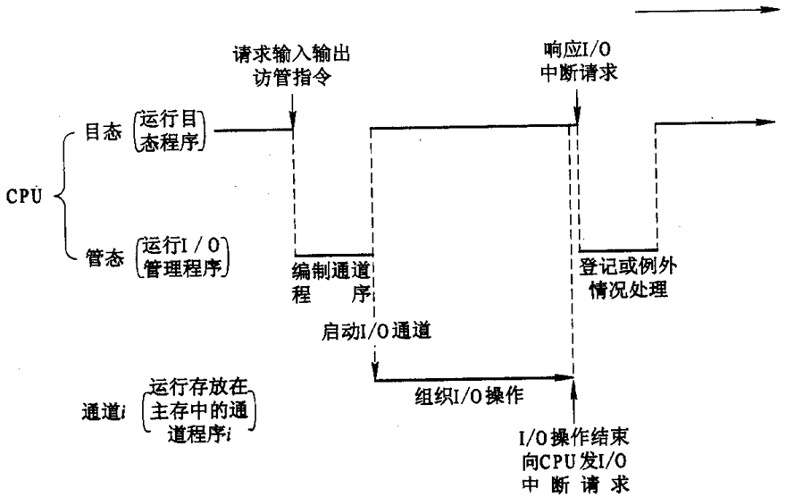

#### 通道类型

- 字节多路通道

  用于连接管理多台**低速设备**，包含多个子通道，每个子通道连接一个设备控制器

  

  通道轮流为每个设备传送一个字节

- 选择通道（高速通道）

  可连接多个不同时工作的是被，一次只能执行一个通道程序，完成信息交换后才会执行另一通道程序。只有一个以成组方式工作的子通道，逐个为多台外设服务

  

- 数组多路通道

  结合字节多路通道和选择多路通道的特点，当某设备进行数据传输时，只为该设备服务，当设备在进行辅助操作时，通道暂时挂起该设备的通道程序，为其他设备服务。

  有多个子通道，既可以所有子通道分时共享总通道，也可以成组传送数据。

#### 通道数据传输过程

通道流量：单位时间内能够传送的最大数据量

通道最大流量：通道在满负荷工作状态下的流量

选择一次设备的时间Ts，传送一个字节的时间Td，传输n个字节，每个设备传送k个字节

三种通道的最大流量为：

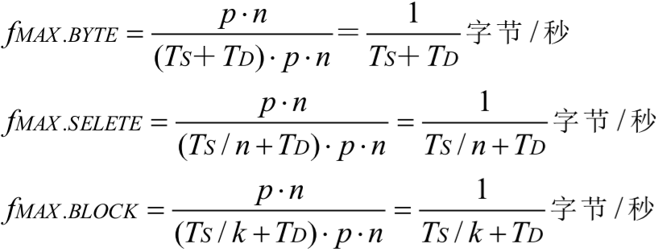

总数据传输率为

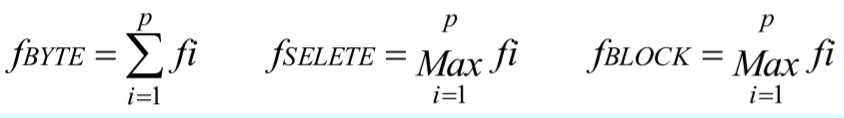

## 存储体系

### 存储体系概念和并行存储系统

存储系统：**两个或两个以上**的速度、容量、价格不同的 存储器采用硬件，软件或软、硬件结合的办法联接成的一个系统。

主要性能指标

- 容量

  Sm=W * L * m

  W存储体字长，L存储体字数，m存储体个数

- 速度

  - 访问时间TA：存储器从街道访存申请到开始读数据的时间
  - 存储周期TM：存储器进行一次存取所需要的时间
  - 频宽BM：存储器提供的数据传输率

- 价格

在三个性能指标中，字数、TA、TM主要与器件工艺有关，字长和存储体个数则由系统设计者确定。三者存在矛盾，可以以下措施解决

- 改进工艺和技术
- 构成并行主存系统
- 使用存储器系统（主存、辅存）
- 存储体系

#### 并行存储系统

在一个存储周期内可以访问到多个数据，从而提高主存频宽。

可分为

- 单体单字

  有一个字长为W位的存储器，一次可以访问一个字，最大频宽为BM=W/TM

- 单体多字

  增加存储器字长，在一个贮存周期中读出多个CPU字

- 多体单字交叉存储器

  由多个容量较小、字长较短的相同存储器芯片组成，每个存储器字长都是CPU字长，让多个存储体并行工作

  CPU字在主存中可以按模m交叉编址

  - 高位交叉：用地址码的高位部分区分存储体号

    扩大存储器容量

  - 低位交叉：用地址码的低位部分区分存储体号

    提高存储器访问速度

- 多体多字交叉存储器

  结合多体单字和单体多字的特点

#### 存储体系

对应用程序员透明，速度接近最快的存储器，容量接近最大的存储器

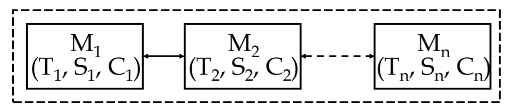

- T ≈ min(T1, T2, …, Tn)，用存储周期表示 
- S ≈ max(S1, S2, …, Sn)，用MB或GB表示
- C ≈ min(C1, C2, …, Cn)，用每位的价格表示

存在两种分支

- 虚拟存储系统：解决容量问题

  主存-辅存存储层次，增加辅助的软硬件，利用了IO处理和CPU**并行**操作的能力，速度接近主存，容量是辅存

  对**应用程序员**透明

- Cache存储系统：解决速度问题

  Cache-主存存储层次，增加辅助硬件，速度是Cache的，容量是主存的

  对**应用程序员**和**系统程序员**都透明

存储层次间传送数据需要预判，其基础是程序的局部性

- 时间局部性：循环导致
- 空间局部性：顺序执行导致

可得出如下结论：

- 不必存放整个程序，只需要存放近期使用过的块或者页即可
- 调入时，一并把数据所在的块或页一起调入

两个原则

- 一致性原则
- 包含原则

#### 存储体系的性能参数

以二级存储体系为例

- 每位价格c

- 命中率H（CPU产生的逻辑地址能在M1中访问到的概率）

  可以利用程序的局部性原理，采用**预取**技术，将相邻n个数据取入M1，不命中率会降低n倍

- 等效访问时间TA

  - 对M1和M2的访问同时启动
  - 对M1和M2的访问不是同时启动
  - 访问效率：TA1/TA

### 虚拟存储系统

定义：主存--辅存层次，借助磁盘等外部存储器扩大主存容量，主要解决容量问题，速度是主存的

特点

- 依赖程序局部性原理
- 对应用程序员透明，对系统程序员不透明
- 每道程序都有独立的虚拟存储空间

不同的地址空间

- 程序空间与程序地址

  程序空间：逻辑空间，虚拟存储空间

  程序地址：虚地址，逻辑地址

- 主存空间与主存地址

  主存空间：主存物理空间

  主存地址：物理地址，实地址

- 辅存空间与辅存地址

  辅存空间：辅助物理空间

  辅存地址：辅存物理地址

程序重定位：用户程序在执行前需要经过多个地址转换步骤，用 户程序地址可能有不同的表示形式。

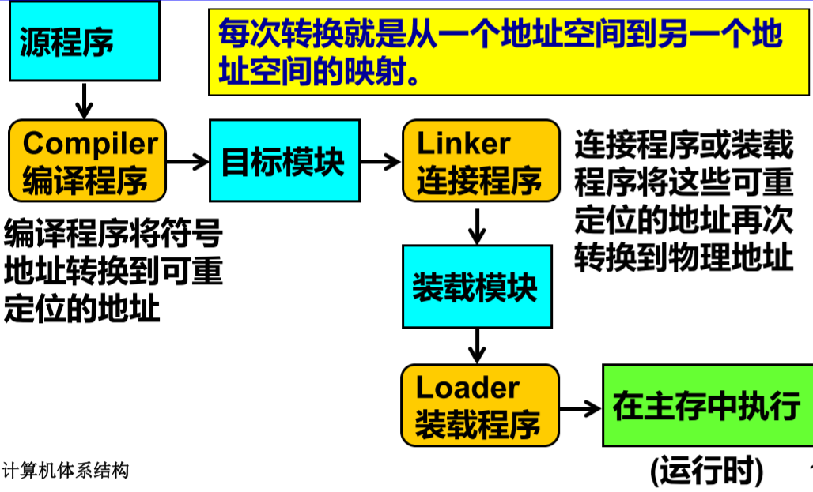

可分为

- 静态重定位：在目标程序装入主存时，将程序逻辑地址变换为物理地址
- 动态重定位：在程序执行过程中，CPU访问主存前，由操作系统、辅助硬件完成地址变换

#### 虚拟存储器管理方式

采用地址映像机构实现程序的动态定位，可分为

- 段式管理：将程序按逻辑分段，按段进行调入、调出和管理

  - 每个程序都有一个段表
  - 每个程序段都从0开始编址，可以映射到主存任意位置

  

  优点：便于共享、保护

  缺点：主存利用率低

- 页式管理：将主存空间和程序空间分成页，按页进行调入、调出和管理。

  - 主存空间分成实页
  - 程序空间分成虚页，大小与实页相同
  - 每个虚页都可以装入任意实页中
  - 每个程序设立**页表**作为地址映像表，记录虚页号与实页号的对应关系

  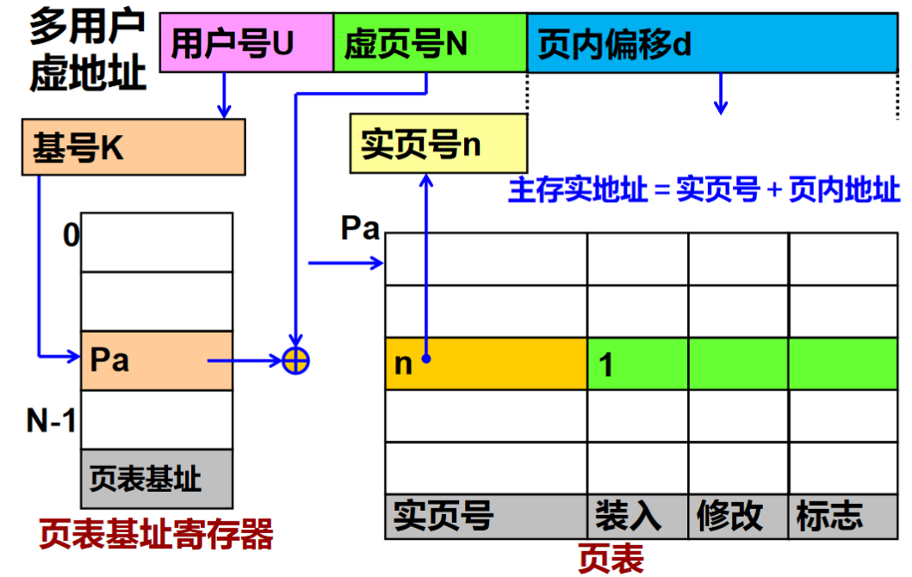

  优点：对程序员完全透明，主存利用率高

  缺点：页表占用空间，且不便共享、保护

- 段页式管理

  - 主存空间分成实页
  - 程序空间先按照模块分段，每段分成虚页，大小与实页相同
  - 程序通过一个段表和**一组页表**进行定位，每个段都有一个页表

  

  缺点：每次地址变换至少要两次查表，表占用空间较大

目前**页式管理最**为常见

#### 页面失效与页面争用

页面故障（页面失效）：用户虚地址所在的虚页未装入主存，需要从外部辅存调页，进行**外部地址变化**，具有**外页表**

页面争用（实页冲突）：两个或两个以上的虚页想进入主存中的同一实页位置的现象，需要进行**页面替换**

#### 页面替换

可分为

- 随机算法RAND
- 先进先出算法FIFO：选最早装入主存的页作为被替换的页
- 最近最少使用算法LFU：选择近期最少访问的页作为被替换的页，实现困难
- 最近最久未使用算法LRU（最常用）：LFU的变形
- 优化替换算法OPT：需要获知未来页面使用情况

具体计算建议找题目练练

几个概念：

- 颠簸：下次就要使用的页面本次被替换出去而发生的连续页面故障的现象。
- 堆栈型替换算法：命中率随着实页数的增加而增加，对m≤n，在任何时刻t，主存页面数集合Bt都满足关系：Bt(m)属于Bt(n)，LRU和OPT是堆栈型，FIFO不是

#### 页式存储虚拟系统面临的问题

- 页面故障的处理

  页面失效应当看作**故障**，由CPU立即响应处理

  选择合适的替换算法，页面大小不可过大

- 提高等效访问速度

  主要影响因素为

  - 尽可能短的访问主存时间
  - 主存命中率

  关键是提高内部地址变换的速度

  两种额外的方法

  - 目录表

    用小容量高速存储器存放页表

  - 快慢表

    - 快表：用快速硬件构成小容量的“相联目录表
    - 慢表：原页表

    查表时同时查找快慢表，将快表中不存在的内容从慢表中调入快表，一般采用**LRU**进行页面替换

  - 散列函数

    加大快表容量，会提高命中率，但速度会降低

    可以使用**硬件方法**实现散列函数进行内容访问，使用**相等比较器**避免散列冲突

- 提高命中率和CPU利用率

  主要因素

  - 程序执行过程中页地址流分布情况

  - 所采用的页面替换算法

  - 页面大小

    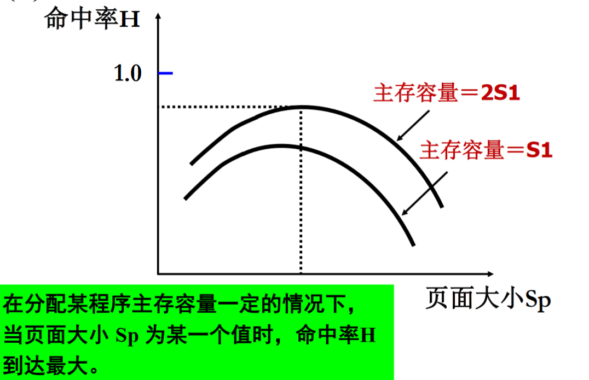

  - 主存储器大小

    单调递增，但达到一定值后，命中率几乎不再提高

### 高速缓冲存储器

#### 基本结构

特点

- 与CPU采用相同工艺
- 地址映象、变换、替换、调度等由专门的硬件实现
- Cache—主存之间的信息交换对所有程序员都透明
- Cache访问主存的优先级高于其他系统访问主存的优先级
- 除了Cache和CPU有直接的通路外，主存和CPU也有直接的通路，可以实现读直达和写直达

#### 工作原理

- 读取

  将CPU给出的主存地址变换为Cache地址，搜索Cache

  - 命中，访问Cache，向CPU返回Cache中的数据副本
  - 未命中，从主存中读取数据块到Cache中，向CPU返回数据

- 写入

  将CPU给出的主存地址变换为Cache地址，搜索Cache

  - 命中，写Cache，写主存（存在一致性问题）
  - 不命中，写主存

#### 地址映像规则与地址变换

主要解决定位问题

- 将主存中数据装入Cache的哪个位置
- 如何知道主存中的数据已经装入Cache
- 如果命中，如何形成Cache地址并访问主存

地址映像：将主存中数据按某种规则装入Cache并建立两个地址间的对应关系

地址变换：当程序已经装入到Cache之后，在实际运行过程中，把主存地址变换成Cache地址。

块冲突：主存中的块要调入Cache中的某个位置，但该位置已经被其他主存块所占用。

典型的地址映像和地址变换方法有

- 全相联映像与变换

  映像规则：主存中任意块都可以装到Cache中的任意一个位置

  地址变换：采用相联存储器构成的目录表，以硬件方式实现

  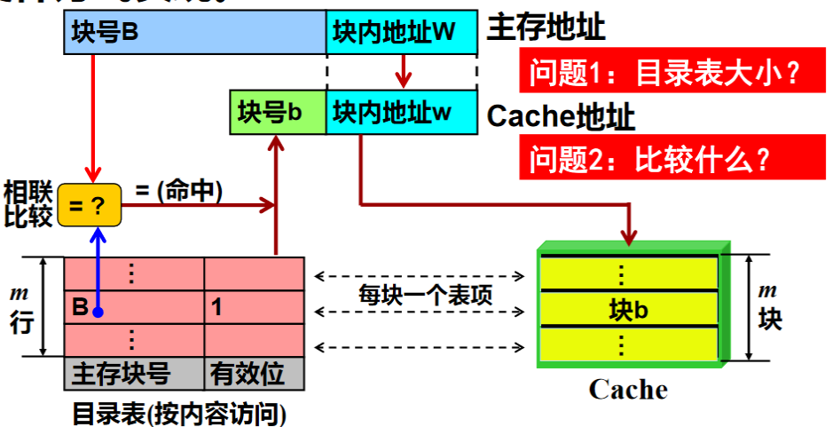

- 直接映像与变换

  映像规则：主存中的每一块只能装入到Cache内唯一一个指定的块位置（一个Cache块对应多个主存块），Cache块号b＝(主存块号B) mod(Cache块数)

  地址变换：从主存地址中取出低位部分即可形成Cahce地址。设置一个按地址访问的区表存储器（称之为区号表），存放Cache中每一块目前被主存中哪个区的对应块所占用。

  

- 组相联映像与变换

  存在很多种方法，只需要记**位选择组相联映象及变换方式**

  映像规则

  - 主存块到Cache组set之间采用直接映像方式

    Cache组号=主存区内块号=主存块号mod组数；

  - 在对应的组内部采用全相联映像方式

  

  

  地址变换：

  

Cache通常使用组相联或直接相联映像，而不采用全相联映像

#### Cache替换算法与实现

当所要访问的块不在Cache中时，则发生块失效。

当所能装入的Cache块都已被装满时，则出现块冲突，必须进行块替换。

典型替换算法包括

- 随机替换算法
- FIFO算法
- LRU算法

实现方式：全部使用硬件

两种方法

- 堆栈法

  速度比较低，需要进行相联比

- 比较对法

  速度高，硬件实现比较复杂

  用触发器（硬联逻辑）实现

  让各块成对组合，用触发器状态表示比较对内两块访问的远近次序

  

#### Cache透明性

Cache-主存存储层次对所有程序员透明

Cache内容是主存内容的一小部分副本

但Cache内容有可能与主存内容不一致，存在两种情况

- CPU写Cache
- IO写主存

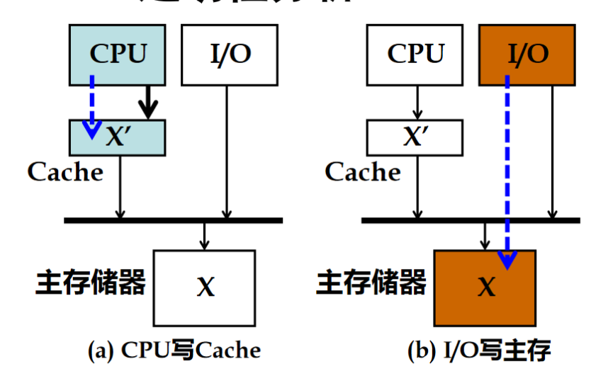

解决Cache问题的关键：写Cache时如何更新主存内容，即**写策略**

- 写命中策略

  - 写直达法

    利用直接通路，把数据**同时写入Cache和主存**

    优点：可靠性强，控制简单，需要增加写主存的开销

  - 写回法

    - CPU数据只写入Cache，不写入主存
    - 为每个Cache块设置“修改位”
    - 仅当替换时，才把修改过的Cache块写回到主存

    优点：通信量少，硬件实现代价低，需要增加Cache块写一位的开销

- 写不命中策略

  - 不按写分配法：在写Cache不命中时，把所要写的字直接写入主存，不调块，一般配合写直达法
  - 按写分配法：在写Cache不命中时，把所要写的字直接写入主存，还把一个块从主存读入Cache，一般配合写回法

预取算法

- 按需取：在出现Cache不命中时，把一个块取到Cache中来
- 恒预取：无论Cache是否命中，都把下一块取到Cache中
- 不命中预取：当Cache不命中，把本块和下一块一起取到Cache中

预取算法对命中率的影响还和块的大小和预取开销有关

造成Cache失效的重要原因是**任务切换**，解决方法参考如下

- 增大Cache容量
- 修改调度算法
- 设置多个Cache

#### Cache性能分析

影响Cache性能的主要因素

- 块大小，块数量
- 采用组相联时，组内块数和组数
- 替换算法
- 地址流
- Cache预取算法等

性能分析：

加速比为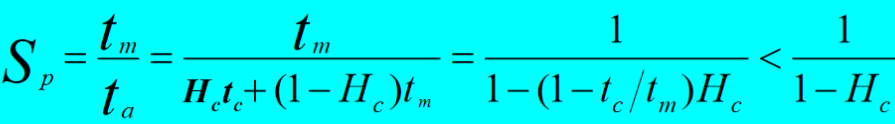

提高Cache系统的加速比SP最好的途径是**提高命中率H**

### Cache -主存-辅存三级层次

程序员使用且只关心一个存储器：

- 访问方式= 按地址随机访问
- 等效速度= Cache
- 等效容量= 虚拟空间容量

## 流水线和向量处理机

### 重叠方式

重叠执行两条或多条指令，加快程序执行

#### 顺序解释执行方式

指令之间串行执行指令内微操作也串行执行

执行n条指令所用时间为

#### 一次重叠执行方式

每次只重叠两条指令

#### 二次重叠执行方式

每次重叠执行三条指令，执行时间T=(2+n)t

#### 重叠执行的要求

- 问题1：功能部件冲突

  必须保证由**独立**的取指、指令分析、指令执行部件

- 问题2：访存冲突

  取指、分析都需要访问主存，需要解决访存冲突

  - 采用两个独立编址、可同时访问的存储器，**分别存放操作数和指令**

  - 设置两个Cache，指令Cache和数据Cache

  - 多体交叉存储器，采用**低位交叉存取的方式**，让指令和操作数存放在不同存储体内，但不能从根本上解决问题

  - **先行控制方式**：在主存和指令分析部件间增设FIFO的**先行指令缓冲站**，预先将下一条或下几条指令取入指缓。

    将一条指令执行过程分为分析（合并取指）和执行两个阶段，进行一次重叠

- 问题3：同步

  执行和分析所用时间常常不完全相同，采用**先行控制技术**

  关键是缓冲技术和预处理技术

  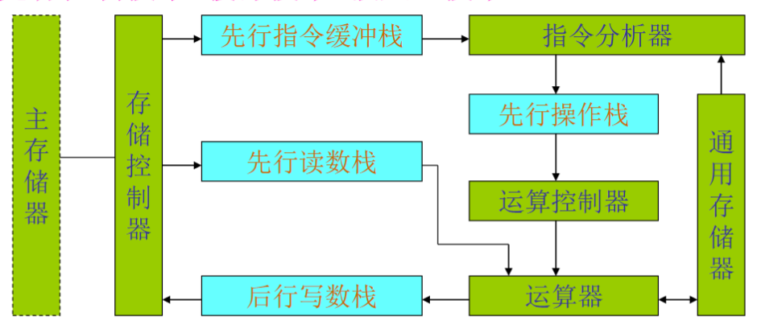

  栈的缓冲深度：D指缓≥D操作≥ D读栈≥ D写栈

  结果：解决了分析与执行时间不等长问题。

  与重叠区别：分析和执行部件可同时处理两条不相邻指令。

  硬件要求：

  - 增设指令缓冲栈，消除取指过程
  - 增设数据缓冲栈，保证不同指令的读写操作并行
  - 增设先行操作栈，保证执行部件能连续执行

- 问题4：转移（控制相关）

  全局相关，一般包括无条件转移相关、一般条件转移相关、符合条件转移相关、中断、程序调用。若发生相关，预取的指令**作废**。

  解决方法

  - 尽可能不使用条件转移指令
  - 若使用则尽可能使用不成功的转移指令
  - 延迟转移技术
  - 猜测法
  - 提前形成转移所需的条件
  - 加快短循环程序的处理

- 问题5：指令、数据相关等（数据相关）

  局部相关，一般包括指令相关、操作数相关、变址相关。

  - 指令相关
    - 不允许修改指令
    - 允许修改指令，改变指令的执行方式，将指令相关转换为数据相关，统一按照数据相关处理

  - 主存空间数相关

    相邻指令对同一单元进行“先写后读”

    解决方法：推后“分析k+1”的读

    不增加硬件，指令K+1推迟一个周期分析，或者让写数优先级高于读数优先级

  - 通用寄存器组操作数数相关

    可分为通用寄存器组操作数数相关、通用寄存器组基址值/变址值相关

    解决方法

    - 推后“分析k+1”的读

    - 设置相关专用通路（硬件）

      在运算器和通用寄存器组之间，发生相关时，让相关专用通路接通，在将运算结果送到通用寄存器组的同时将运算结果回送到运算器

### 流水方式

流水线技术：流水是重叠的延申，将指令的执行过程再分解位多个子过程，分别由不同的专用部件完成

特点：

- 基于**时间重叠**的并行处理技术
- 每个子过程称为“级”，段的数目称为流水线的“深度”
- 每个子过程分别由**专用部件**的完成
- 各流水段的时间应该尽量相等
- 工作阶段可以分为建立、满载、排空，有装入时间和排空时间
- 只有连续提供**同类任务**才能充分发挥流水线的效率
- 在流水线的每一个流水线段中都要设置一个**流水锁存器**

表示方式

- 连接图

  

- 时空图

  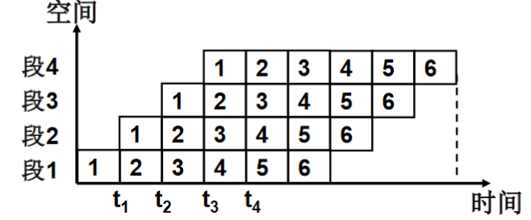

- 预约表

#### 流水线分类

按照向上和向下扩展的思想分类

- 部件级：部件的各个子部件之间，操作流水线
- 处理机级：处理机各部件之间，指令流水线
- 系统级：多个处理机之间，宏流水线

按功能分类

- 单功能流水线

- 多功能流水线

  可进一步分为

  - 静态流水线：各功能段只能按一种功能连接流水，流空后才能换功能
  - 动态流水线：不同段可执行不同功能的运算

按功能段之间是否有反馈可分为

- 线性流水线：功能段串行连接，无反馈回路，各段只经过一次

- 非线性流水线：各功能段有反馈回路

  

按机器具有的数据表示分类

- 标量流水处理机
- 向量流水处理机，是数据表示和流水技术的结合

按任务流出顺序与流入顺序的关系

- 顺序流水线（同步流水线）
- 乱序流水线（异步流水线）

#### 性能指标

- 吞吐率：流水线单位时间内能处理的指令条数

  若流水线各段时间不等，则

  - 最大吞吐率为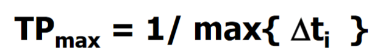
  - 实际吞吐率为

  受限于瓶颈子过程，消除瓶颈子过程的方法有

  - 细分瓶颈过程
  - 重复设置瓶颈功能段，使其交叉并行工作

- 加速比

  指流水线速度与非流水线速度之比

  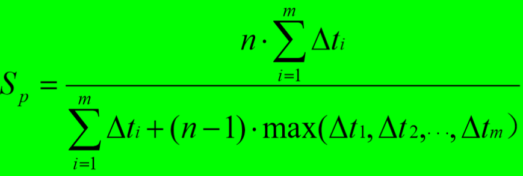

- 效率

  流水线中的设备实际使用时间占整个运行时间之比

  

#### 流水线调度

资源冲突：指几个任务征用一个功能段的现象

- 线性流水线的调度

- 非线性流水线的调度

  

  如果每拍都向流水线输入任务，则会发生资源冲突，需要间隔几拍后向流水线输入任务

  调度任务：找出一个最小的循环周期，按照这个周期向流水线输入新任务，流水线的各个功能段都不会发生冲突，而且流水线的吞吐率和效率最高。

  几个概念：

  - 二维预约表法

    需要一个任务使用流水线各段的时间关系表

  - 启动距离

    也称为等待时间，向流水线连续输入两个任务之间的时间间隔

  五个步骤（建议找题目练练）：

  - 构建延迟禁止向量F
  - 构建初始冲突向量C
  - 计算流水线的新的冲突向量
  - 构造用冲突向量表示的流水线状态图
  - 确定调度方案

#### 流水线中的相关

重要性存疑，暂不补充内容

### 向量的流水处理与向量处理机

向量的特点

- 元素之间无相关
- 对元素一般执行相同类型的操作

向量处理方式

- 水平处理方式

  逐个求向量元素

- 垂直处理方式

  逐个计算各个计算阶段的所有数组元素，元素之间无相关

  - 采用多体交叉存储
  - 设置向量寄存器

- 分组处理方式

  如果向量太长，使得寄存器装不下整个向量，则将向量分组，使每组都能装入寄存器

  - 寄存器组内采用垂直处理方式
  - 寄存器组间采用水平处理方式

### 指令级高度并行的超级处理机

让单处理机在每个时钟周期内解释多条指令，

表示：ILP(m, n)＝m*n

其中m为每个时钟启动的次数，n为每次启动的指令/操作个数

可分为

- 超标量处理机
- 超流水线处理机
- 超长指令字处理机

#### 超标量处理机

空间并行性（同时性）

本质就是在不同的流水线中执行不相关指令的能力

超标量处理机采用m条指令流水线（多指令流水线），在每个△t时间内同时解释完m条指令。称这种流水机的度为m。

结构：多条指令流水线，由指令译码部件检测顺序取出的几条指令之间是否存在数据相关和功能部件争用，将可以并行执行的指令送往流水线

- 单发射处理机：每个周期只取一条指令，只译码一条指令，只执行一条指令，只写回一个结果。取指部件和译码部件各设置一套。

  

- 多发射处理机：每个周期同时取多条指令、同时译码多条指令，同时执行多条指令，同时写回多个运算结果。需要多个取指令部件，多个指令译码部件和多个写结果部件。

  

加速比为

#### 超流水线处理机

时间并行性（并发性）

一个周期内能够**分时发射**多条指令的处理机称为超流水线处理机。

一台度为n的超流水线处理机，△t’只是基本机器周期△t的1/n，侧重开发**时间并行性**

超流水线处理机需要使用多相时钟（高速时钟机制）

加速比

#### 超标量超流水线处理机

把超标量与超流水线技术结合在一起，在一个时钟周期内分时发射指令n次，每次同时发射指令m条，每个时钟周期总共发射指令m·n条。

加速比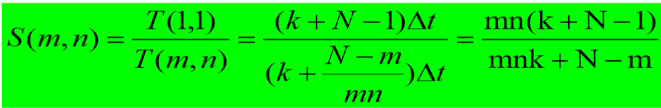

#### 性能比较

- 最高：超标量处理机
- 其次：超标量超流水线处理机
- 最低：超流水线处理机。

主要原因

- 超流水线处理机的启动延迟比超标量处理机大
- 条件转移造成的损失，超流水线处理机要比超标量处理机大
- 超标量处理机指令执行部件的冲突要比超流水线处理机小。

## 并行处理机（阵列处理机）与互连网络

开发并行性的途径主要有三个：时间重叠、资源重复、资源共享

并行处理机是并行处理计算机中的一种重要结构，它主要通过**资源重复**实现同时性并行。

定义：重复设置多个同样的**处理单元（PE**），并将它们按照一定方式互相连接，在统一的**控制部件（CU）**作用下，各自对分配的数据并行地完成同一条指令所规定的操作，实现操作级并行的**SIMD计算机**。

- 从CU来看，指令是串行在执行的
- 从PE来看，数据是并行处理的

PE：不带指令控制部件的算术运算部件，使用按地址访问的随机存储器

根据存储器组成方式的不同，阵列处理有两种基本构形

- 分布式存储器的阵列处理机

  每个PE有自己的局部存储器PEM,PEM只能被本PE访问；

  整个系统在CU控制下运行,所有指令都在CU中译码

- 集中式共享存储器的阵列处理机

  系统存储器由K个存储体构成，经互连网络ICN为全部N个PE所**共享**。K>=N

  ICN用于在PE和MM之间构建数据通路，使各个PE可以高速、灵活、动态地与不同的存储体相连。

特点

- 以**单指令流多数据流**方式工作
- 阵列机采用资源重复方法引入空间因素
- 它使用简单而规整的ICN来确定PE之间的连接模式。
- 阵列机是以某一类算法（如图像处理）为背景的**专用计算机**。

### 阵列处理机的并行性算法

ILLIAC IV系统由：ILLIAC IV阵列、ILLIAC IV输入/输出系统 组成

在任意n*n个单元组成的二维阵列中，任意两个处理单元间的最短距离不会超过n-1步

### 互联网络（ICN）的基本概念

互连网络是一种由开关元件按照一定的拓扑结构和控制方式构成的网络，用来实现计算机系统内部多个处理机或多个功能部件之间的相互连接。是并行处理系统的**核心组成部分**

输入输出节点之间对应关系的表示方法

- 互连函数表示法

- 图形表示法

- 输入输出对应表示法

  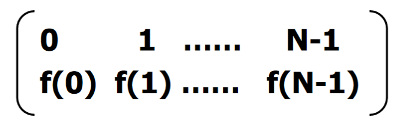

主要特性

- 网络规模（节点个数）
- 节点度:与结点相连接的边数称为结点度
- 距离：两个节点之间最少边数
- 网络直径：节点距离最大值
- 节点线长：物理距离
- 对称性

性能参数

- 频带宽度：传输信息的最大速率
- 传输时间：消息长度/频宽
- 飞行时间：第一位信息到达接收方所花的时间
- 传输时延：飞行时间与传输时间之和
- 发送方开销：处理器把消息放到互连网络的时间
- 接收方开销：处理器把消息从网络取出来的时间
- 总时延＝发送方开销＋飞行时间＋消息长度/频宽＋接收方开销

设计因素

- 操作方式

  - 同步（阵列处理机）
  - 异步（多处理机）
  - 同步/异步组合

- 控制策略

  互连通路的路径选择通过设置**开关单元**的状态来控制。

  开关单元有两种控制策略

  - 集中控制策略（多数SIMD）
  - 分布控制策略

- 交换方法

  - 线路交换（SIMD）
  - 包交换（多处理机）
  - 线路/包交换

- 网络拓扑结构

  可分为静态连接和动态连接（可进一步分为单级和多级）

### 互联网络的种类

可分为

- 静态互联网络：不能实现任意点到点的连接
- 循环互联网络：多次使用同一单级互联网络网络实现任意节点互联
- 多级互联网络：将多套相同的单级互联网络连接
- 全排列互联网络
- 全交叉开关网络
- 动态互联网络

#### 静态互联网络

#### 循环互联网络

#### 单级互联网络

四种基本的单级互联网络

- 立方体

  有多个互联函数

  等

  拓展到n维情况，共有log2N种互联函数

  

  任意两个节点之间至少有n条不同的路径

- PM2I

  

  共有2n个互联函数，最大距离为[n/2]

- 混洗交换

  包含两个互联函数

  左移

  为实现全0和全一，还需要增加Cube0交换函数

  最大距离为2n-1

  

- 蝶形

  最高位和最低位交换

动态互联网络可分为

- 总线型
- 交叉开关：在每个输入端和输出端的交叉点上都有交叉点开关。造价昂贵
- 循环网络：将同一套单级互连网络循环使用，组成循环互连网络

单级互联网络解决任意处理器互联的方法

- 循环互联网：多次重复使用同一个单级互连网络，牺牲时间换取设备
- 多级互联网：将多套相同单级互连网络连接起来，以设备换取时间

#### 多级互联网络

实现结点到结点之间的任意互连

交换开关：

- 一个a×b交换开关有a个输入和b个输出
- 一对一和一对多映射是容许的；但不容许有多对一映射（冲突）。

交换开关拓扑连接方式

- 多级立方体网络

  重复n次使用单级立方体互联网络，每一级实现一种互联函数

  

  当第i级开关处于交换状态时，其他级处于直通状态时，实现Cubei函数

  根据控制方式不同，可进一步分为

  - STARAN网络

    - 交换网，采用级控制，实现交换函数（将一组元素首尾对称地进行交换）

    - 移数网，采用部分级控制（组控方式）

      组控方式是指：将第i级的N/2个2×2的2功能开关分成i+1组，每组用一个位信号控制该组开关的状态

  - 间接二进制n方体网络

- 多级混洗交换网络

  采用全混洗函数和交换函数

  

  

## 多处理机与多计算机

### 多处理机概念

定义：两个或两个以上处理机(包括PU和CU)，通过高速互连网络连接起来，在统一的操作系统管理下，实现**指令以上级（任务级、作业级）**并行，属于**MIMD计算机**

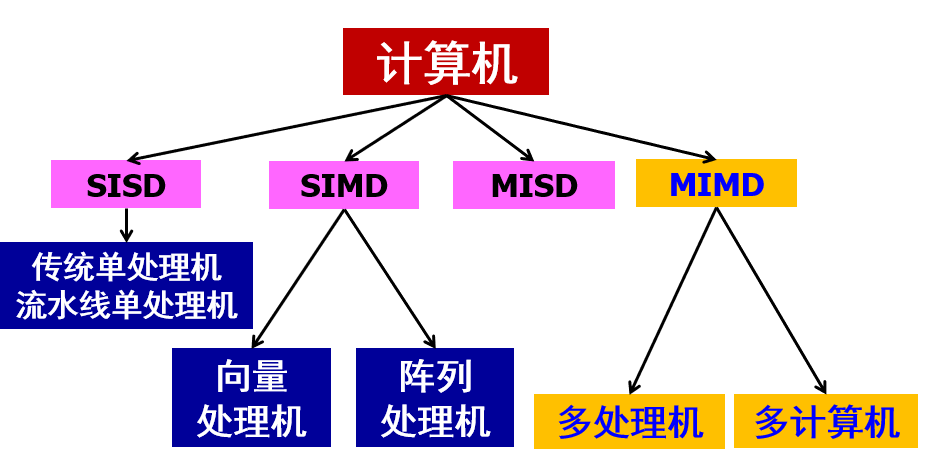

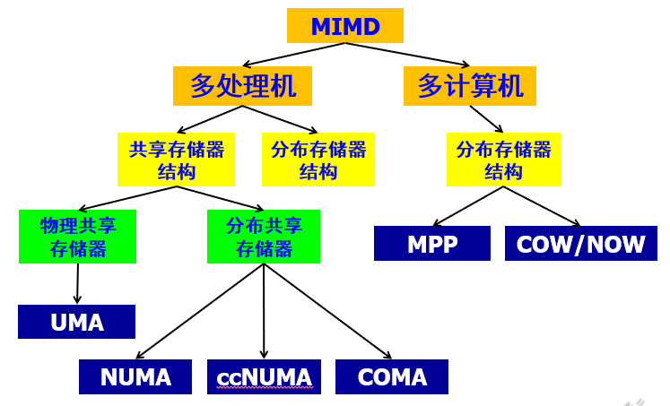

#### 分类方式

根据实现技术途径，分为

- 同构型：基于资源重复，处理机功能相同
- 异构型：基于时间重叠，处理机功能不同
- 分布式：基于资源共享，由同一操作系统管理资源

按照耦合度分为

- 紧耦合多处理机

  直接耦合系统，通过公共硬件通信（多处理机）

- 松耦合多处理机

  间接耦合系统，通过通道、通信线路或网络、消息传递系统通信（多计算机）

#### 特点

- 结构灵活

  - 并行处理机：专用，PE数很多（几千个），固定有限的通信。

  - 多处理机：通用，几十个，高速灵活的通信。

- 程序并行

  - 并行处理机的并行性存在于指令内部，识别比较容易。

  - 多处理机的并行性存在于指令外部，在多个任务之间，识别难度较大。

- 并行任务派生

  - 并行处理机把同种操作集中在一起，由指令直接启动各PE同时工作。

  - 多处理机用专门的指令来表示并发关系，一个任务开始执行时能够派生出与它并行执行的另一些任务。如果任务数多于处理机数，多余的任务进入排队器等待。

- 进程同步

  - 并行处理机仅一个CU，自然是同步的。
  - 多处理机执行不同的指令，工作进度不会也不必保持相同。

- 资源调度与分配

  - 并行处理机的PE是固定的，采用屏蔽手段改变实际参加操作的PE数目。
  - 多处理机执行并发任务，需用处理机的数目不固定

#### 主要技术问题

- 结构灵活性与通用性，可满足不同并行算法需求
- 进程通信方式：共享内存、互连网络、消息传递机制等
- 运行模型：数据并行+处理并行
- 并行性表达
- 并行算法

### 多处理机结构

从存储器分布来看，分为两种结构

- 共享存储器结构：采用通过共享存储器通信，紧耦合

  各处理机通过互连网络共享存储器和I/O设备，并通过共享存储器相互联系。

  

  引入了**Cache一致性**的问题

  根据实现方式可进一步细分为

  - UMA结构（物理共享）

    均衡存储器访问结构，各处理机对存储器访问时间、功能相同。

    称为**对称多处理机（SMP）**

    缺点：所有处理机对共享存储器的访问都要经过互连网络，当规模较大时，访问延迟较大。因此通常增设大容量本地Cache。适合**小规模使用**

  - NUMA结构（逻辑共享）

    分布式共享存储器，各处理机有独立存储器，分布于各个处理机的存储器被**统一编址**，可由所有处理机共享；各处理机对存储器访问时间不相等

    缺点：如果过多地访问远程存储器，则性能会下降；

    - ccNUMA：如果各处理机Cache内容一致，则称为ccNUMA

  - COMA结构（逻辑共享）

    **仅用高速缓存**存储器结构，将NUMA中存储器换成了Cache

    对远程Cache的访问通过分布式Cache目录进行

- 分布式存储器结构NoRMA：通过消息传递机制通信，松耦合

  各处理机有自己的本地存储器，在操作系统控制下独立工作，本地存储器不可被其他处理机访问
  
  - MPP
  
    大规模并行处理机，各处理机通过**消息传递机制**相互通信
  
    异步MIMD机器
  
  - COW/NOW
  
    机群，每个节点都是一个完整的工作站，具有本地磁盘，通过网络接口松散耦合
  
    每个节点具有**完整的操作系统**

### 多核处理器

定义：一枚处理器中集成了两个或多个独立处理单元（称为核）的处理器，每个和可以独立运行程序指令，访问存储器的不同部分

优点：提高了吞吐率和并行程序的速度，可以实现核的紧耦合，降低功耗

主要涉及因素

- 同构还是异构
  - 同构CMP：集成多个相同处理器核
  - 异构CMP：不同类型处理器核处理不同任务
  
- 核的数量

- Cache的设置与访问

  四种结构

  - 专用L1 Cache，专用片内L2 Cache；
  - 专用L1 Cache，共享片外L2 Cache；
  - 专用L1 Cache，共享片内L2 Cache；
  - 专用L1 Cache，专用L2 Cache，共享片内L3 Cache；

- 核间通信技术

### 多处理机多Cache一致性

当把共享数据装入Cache时，会在多个Cache中形成副本，即**Cache一致性问题**

不一致的原因

- 共享写数据
- 进程迁移
- IO传输

解决方法

- 基于软件的方法：由编译和操作系统检测并解决

- 基于硬件的方法：

  思想：跟踪共享数据的状态

  Cache一致性协议：监听协议和基于目录的协议

  - 监听协议：拥有数据副本的Cache各自记录数据块的状态，无集中的状态。

    适用于基于**总线**的共享存储器结构的多处理机，但只适用于小规模系统。

    各自Cache控制器自行产生状态变化以及相应操作

    两种策略

    - 写无效：写共享数据时，使**其他Cache中**的共享数据的副本无效，独占数据，然后写入或更新
      - 对写直达法，也更新存储器中的副本
      - 对写回法，使存储器中的副本也失效
    - 写更新：通过总线将更新后的数据分发给所有其他处理机，更新**所有Cache中的副本**。
      - 对写直达法，也更新存储器中的副本
      - 对写回法，更新延迟到Cache被置换时

  - 基于目录的协议：将每个数据块的共享状态记录保存在**目录**

    适用于**非总线互连**的多处理机，目录存放所有共享数据块的所有Cache副本的地址表。

    两种方式

    - 集中式目录方式

      缺点：容量非常大，检索时间长

    - 分布式目录方式：每个存储模块维护各自的目录

    三种类型

    - 全映射目录：存放与全局存储器中每个块有关的数据。
    - 有限目录：每个目录项有固定数目的指针（小于处理机个数）
    - 链式目录：将目录分布到各个Cache（其余同全映射目录）

### 程序并行性

并行处理面临的挑战：

- 程序中有限的并行性：采用并行性更好的算法
- 相对较高的通信开销：靠体系结构支持和编程技术

#### 并行算法

根据运算的基本对象的不同分为：

- 数值并行算法（数值计算）
- 非数值并行算法（符号计算）

根据进程之间的依赖关系分为：

- 同步并行算法（步调一致）
- 异步并行算法（步调、进展互不相同）
- 纯并行算法（各部分之间没有关系）

根据并行计算任务的大小分为：

- 粗粒度并行
- 细粒度并行
- 中粒度并行

并行算法分为：

- 多机并行
- 多线程并行

设计技术包括

- 划分法
- 分治法
- 平衡树法
- 倍增法/指针跳跃法
- 流水线法
- 破对称法

#### 程序段间的相关性

- 数据相关

  先写后读，不可并行

- 数据反相关

  先读后写，不可交换串行

- 数据输出相关

  写-写，不可交换串行

- 相互交换

#### 并行程序设计语言

方法

- 重新设计新语言
- 扩充现有语言功能
- 不改变现有语言，提供函数库或并行化编译系统

关键技术

- 进程管理
- 进程通信与同步

#### 并行程序设计模型

可分为

- 共享内存模型
- 分布式内存模型
- 分布式共享内存模型

### 多处理机性能

**任务粒度的大小**会显著影响多处理机的性能和效率

并行性在很大程度上依赖于R/C比值

- R — 程序用于有效计算的执行时间
- C — 处理机间通信等辅助开销时间

通常

- R/C比值小，细粒度并行，并行度低
- R/C比值大，粗粒度并行，并行性高

### 多处理机操作系统

可分为

- 主从式

  由一台主处理机进行系统的**集中控制**

  适用于工作负荷固定，功能差别较大的异构型处理机

- 独立监督式

  将控制功能**分散给多台处理机**，共同完成对整个系统的控制工作。每个处理机均有各自的管理程序(操作系统的内核)。

  适用于松耦合多处理机

- 浮动监督式

  系统中每次只有一台处理机作为执行全面管理功能的“主处理机”，“主处理机”可以根据需要浮动，即从一台**切换**到另一台处理机。
  
  适用于紧耦合多处理机
