# Network

[TOC]

## 绪论

计算机网络的作用越来越凸显。随着互联网深入到工作生活，计算机网络迅速成为一门核心课。其课程目标主要有三个目标：

- 熟练掌握计算机网络相关的基本概念
- 理解网络体系结构
- 为未来的学习打下基础

这门课主要讨论几个内容：

- 计算机网络的工作原理
  - 网络体系结构
  - TCP/IP协议
  - 应用层
- 揭示网络核心概念
  - 层
  - 协议
- 网络编程技能
  - 网络配置
  - Socket编程
  - 设计与实现协议

Sun公司在90年代，提出网络就是计算机。只要计算机通过IEEE协议进行通信，就已经接入了Internet。从各个不同视角来看Internet：

- 抽象。真实世界的协议抽象到标准与模型之中。
- 几何尺度。LAN，Enterprise，WAN，Inter-domain。
- 概念方法。体系结构，协议（Protocol），算法。
- 功能。不同层提供不同服务。

Internet从协议角度来看，形成一个沙漏结构：


网络的核心是在不可靠的网络上实现可靠的传输。围绕这一问题，提出了一系列的方法和协议。

## Introduction

### Computer Network and the Internet

什么是计算机网络？Tanenbaum的定义如下：

> Interconnected collection of autonomous computers connected by a communication technology.

计算机网络提供的最主要两个功能是：

- Communication，实现信息交换与信息通信，形成直接连接的用户终端
- Sharing，共享信息

那么什么是Internet？Internet是“a network of networks”，是覆盖全球的公共的异构技术的计算机网络。它提供的服务有很多：

- 远程资源访问，Telnet
- 共享资源访问，FTP
- 媒体交互，Email、Audio、Video

Internet连接了百万级的主机，使用hosts和end-system。还有许多的通信线路，包括fiber/copper/radio/satellite；还有路由器，实现转发； 还有Protocols，控制信息的发送、接收；最终网络的网络形成Internet。

什么是Protocol？协议有三要素：

- 语法，定义format
- 语义，定义actions，根据不同字段的含义
- 时序，定义order，什么时候发送接收

例如SMTP协议：

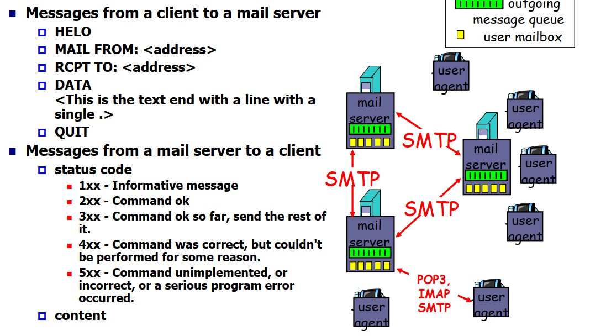

在Internet领域里，ISOC（互联网协会）是最主要的组织，其结构如下：


其中Internet标准会公布为RFC，作为草案，在得到批准之后会成为正式标准。

### Edge and Core

Network的边缘是应用、主机和资源，核心是路由器、internet和交流。同时，也涉及到一些物理的传输媒介。

hosts网络的是终端。在终端上，运行网络程序，位于Network的边缘。我们常常谈端对端的连通，实际上是两个主机进程之间的交互，是process to process的。其中两个比较主要的模型是C/S模型和peer-to-peer模型，后者的每一个主机是对等的。

网络核心总体来说就是相互连接的路由器构成的结构。具体的方法有三种：

- Circuit switching，电路交换。传统电话就使用这种方式。它需要一些专用资源，首先通过呼叫建立专用电路。典型的代表是电话网络，借助一个交换机实现星形的连接。这里的交换是通过电子开关实现的，相当于是动态分配了线路资源。

  

  最初的时候，使用人工接线，现在则用计算机控制。

  

  其传输过程如下：

  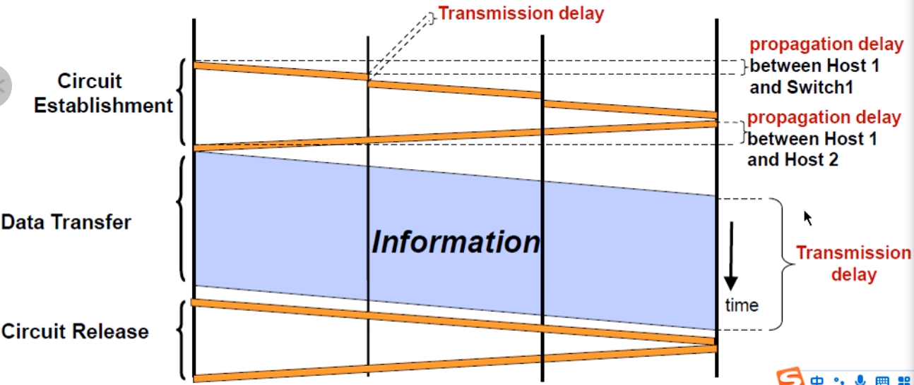

  这样就出现两种时延。一个是transmission delay（传输时延）。一个是propagation delay（传播时延），是信号在传播过程中造成的，主要取决于距离。

  这种模式下，无法实现共享，可能会出现占线，所以就把电路进行划分。有frequency division（FDM）、time division（TDM）、space division三种。

  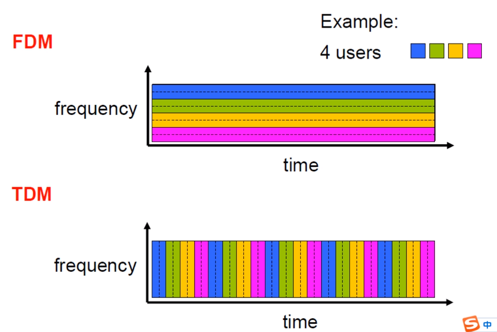

- Message switching，报文交换，一般是大的数据块

- Packet switching，分组交换，一般是大报文切分成的小分组

  分组交换下，数据要分成分组服务，就形成Header/Data/Trailer三分的形式。例如：

  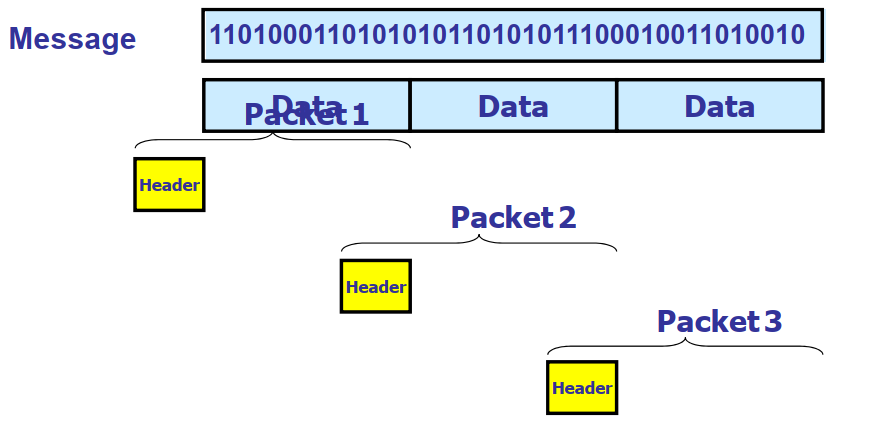

  大的报文切割成小的分块，进行数据转发。这样分组头就比较重要了，包含控制信息、序列号、地址、总长度等。中间的就是节点交换机或者路由器，根据头的地址转发到下一个交换机。分组的信息到了目的段之后，再根据序列号进行恢复。

  这种模式下，共享资源的实现就比较容易，资源按需分配，效率更高。

  

  这种模式是一种Statistical Multiplexing（统计复用），并不是固定时间发送。

  Packet-switching的作用是存储和转发，假设包大小是$L$，带宽是$R$，那么$L/R$是transmission delay，经过$n-1$个路由器转发，时延就是$nL/R$，propagation delay一般可以忽略。

  电路交换的优点是有带宽可以保证、转发比较简单，但浪费了带宽，存在占线问题，也需要额外的呼叫建立。分组交换相比之下，可靠性、效率性、易部署性都有优势，但可能存在堵塞、丢包等状况。最重要的是，它允许更多的用户使用网络。

  分组交换有两种，一种是datagram，每一个分组包含目的地址，根据目的地址确定下一站路由器，那么route可能会存在变化；另一种是virtual circuit，每个packet包含了虚拟id，预先给出了路由号，这样路径就是固定的。

  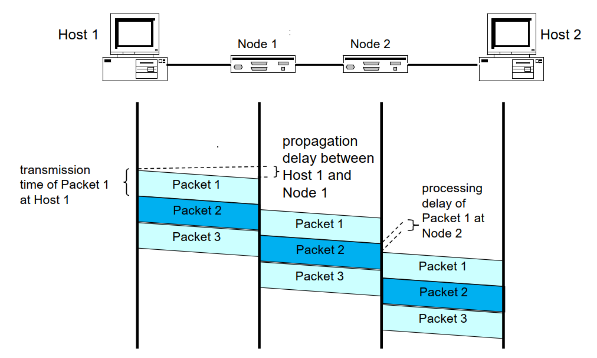

  对于使用VC的分组传送，在call setup time的时候会新建立一条固定路径，这样新的三个阶段是：

  

### Access networks and physical media

如何连接到系统和路由器？

- 点对点的访问，而通过ADSL（asymmetric digital subscriber line）分频之后就不发生冲突了。
- Cable Modems，使用HFC（hybrid fiber coax）

光纤可以直接连接到房屋中，称为FTTP（fiber to the premises）。其结构如下：


Splitter形成一种多路复用，送到Central Office（端局）。这里涉及到很多设备，最终连接到家庭之中。

光纤可以连接到局域网（Local Area Networks, LAN）。有一个局域网和一个防火墙，通过出口连接到Internet。

也可以形成无线网，有两种设备：

- WLAN（Wireless LAN，无线局域网），将路由器连接到Internet
- 广域无线接入（Wider Area Wireless Access），如3G/4G/5G

使用DSL（数字用户线路）实现以电话线为基础的网络访问，实现上网与电话互不影响。

对于物理介质来说，分成两大类：

- 有导向媒体，如铜线与光纤
- 无导向媒体，如无线电

有导向中最常见的就是Twisted Pair（双绞线）。双绞线分成Shielded Twisted Pair（STP）和Unshielded Twisted Pair（UTP），水晶头需要接到RJ45 Jack上，有一些标准的连接方法。


电缆线有两种连接：

- Straight-through cable，直通线，用于计算机与交换机等设备的连接
- Crossover cable，交叉线，用于两个类似设备的连接，需要转换输入输出口

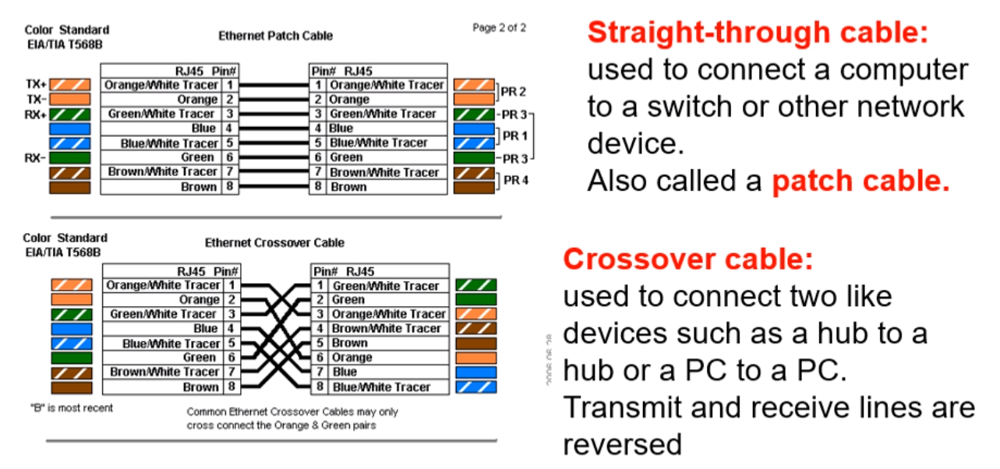

另一种是Coaxial Cable（同轴电缆）:

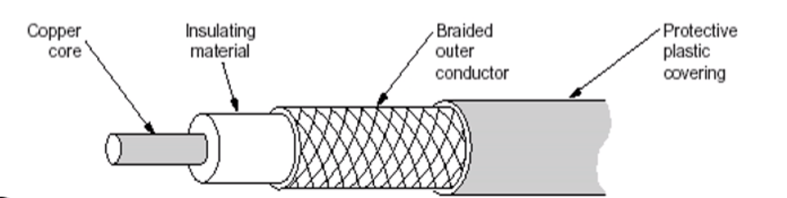

最后是Fiber Optics（光纤）：

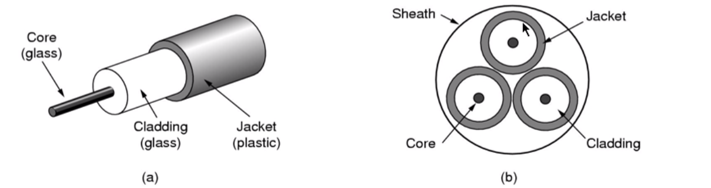

对于无线介质，常见的radio，如：

- 微波（terrestrial microwave）
- LAN（WiFi）
- wide-area
- satellite（270ms延迟）

对于物理介质的承载量，可以用信噪比来描述：
$$
dB = 10 \lg \frac{S}{N}
$$

### Transmission Technology

有三种方式：单播、广播、多播


### Type and Topology

依据物理距离分类，有几种方式：

- LAN
- MAN（Metropolitan Area Networks），城域网
- WAN（Wide Area Networks），广域网

因此，我们定义拓扑结构为网络组件的连接方式，有很多种：


对于广域网，我们的主机实际上是连接到子网（subnet），里边有许多交换元素，比如routers和trunks。

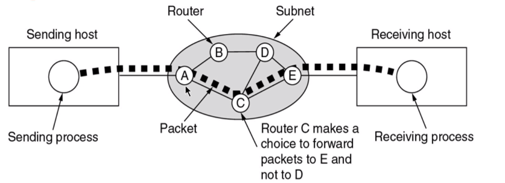

Internet的拓扑结构是一种层次结构（roughly hierarchical）。


### Network Performance

有几个主要的性能指标：

- Latency 延迟，数据传输的时间延迟
- Bandwidth 带宽，单位时间传送的数据
- Bandwidth-dalay product，BDP 带宽时延积，以bits为单位
- Fraction of time link is busy transmitting，$\rho$，利用率

我们介绍过分组交换，分成Header和Payload。对于一个分组来说，进入路由器首先做缓冲排队，然后查路由表，决定向哪一个端口连接，并进行转发。而这里就产生了相应的延迟：

- Queueing Delay（排队时延），大小为$La/R$，$a$为平均来包率
- Transmission Delay（传输时延），把包的第一个byte到最后一个byte推到线路上的时延，大小为$\frac{L}{R}$，$L$为packet length，$R$为link bandwidth
- Round-Trip Time，RTT（传播时延），大小为$\frac{d}{s}$，$d$为物理介质的长度，$s$为电信号传播速度（$\approx 2\times 10^8 m/s$）
- nodal processing，节点处理，比如校验错误

那么为什么会出现丢包呢？因为router buffer缓冲队列是有限制的，当排队的超过队列数之后就会导致丢包。至于丢哪个，这个可能是随机的，与策略有关。

> 若数据块大小1B，传送到1000km之外的结点，带宽1Mbit/s，求时延。

解：传输时延$1 \times 8 \div 10^6 = 8\mu s$，传输时延$1000 / 2 \times 10^5 = 5ms$。故总用时5.008ms.

对于往返时间：

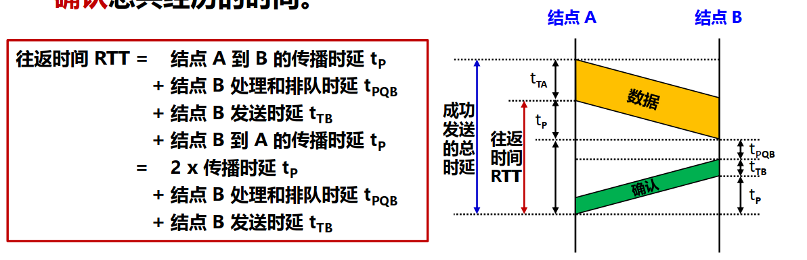

### Protocol layers, service models

协议层有几个要素：

- Protocol 协议：一个如何交流的约定
- Syntax 语法：协议的结构
- Semantic：协议的含义

把问题分到不同层次上，这本质也是一种模块化思想的表现。每一层使用什么样的协议和服务，有不同的标准来定义。

对于网络世界来说，现在采用的体系结构称为reference model（参考模型）。


对等层之间使用协议沟通，即layer n protocol；下层通过服务接口为上层提供服务，即service interface。

服务决定某一个层究竟做什么，服务接口决定如何访问服务。协议是对等实体之间通讯的标准，规定在不同机器上对应同一层次的实体如何通信。从上到下需要层层打包，下到上需要层层拆包。


一般来说，有20bytes的TCP header，20bytes的IP header，14bytes的 Ethernet header，形成总共54 bytes的overhead。

这里就存在一个fragmentation的问题：有可能第一层的载荷（payload）很大，就需要在第三层进行分片。对应的，在目的段进行重装（reassembly）。在协议中，存在总长度标识标志段偏移，维护具体是第几段等信息用于还原。

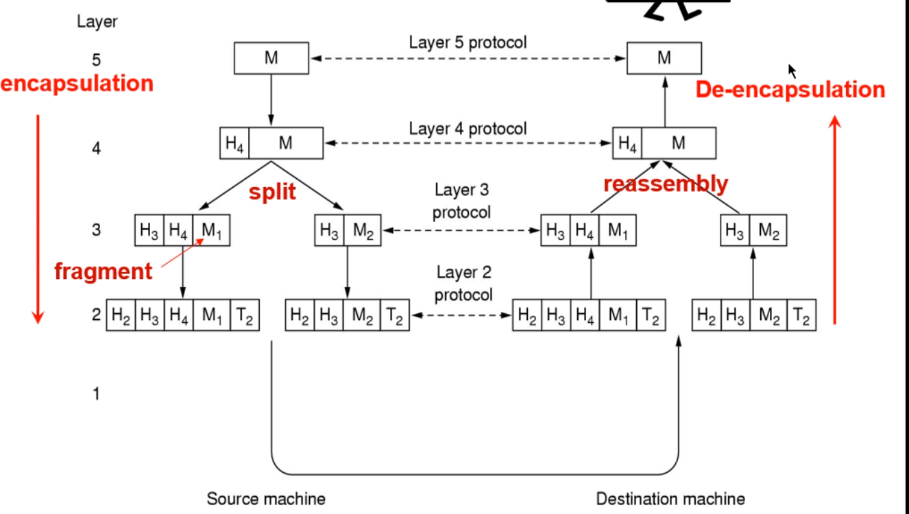

服务分为两种：

- 面向连接的服务（Connection-oriented Service），需要先建立连接，使用虚电路分组交换
- 无连接的服务（Connectionless Service），直接进行通讯

服务存在服务质量，主要是两个：是否按照发送次序接受？是否有可靠的传输？

服务有一个原语（Primitives）的概念，用于指定有哪些操作：

- LISTEN（监听），阻塞并等待连接
- CONNECT，主动建立连接
- RECEIVE，阻塞并等待信息
- SEND，发送信息
- DISCONNECT，终止连接

对于服务器来说，

- 目的服务器进行LISTEN，源服务器发送CONNECT
- 目的服务器进行RECEIVE，源服务器进行SEND，重复多次
- 两侧均进行DISCONNECT

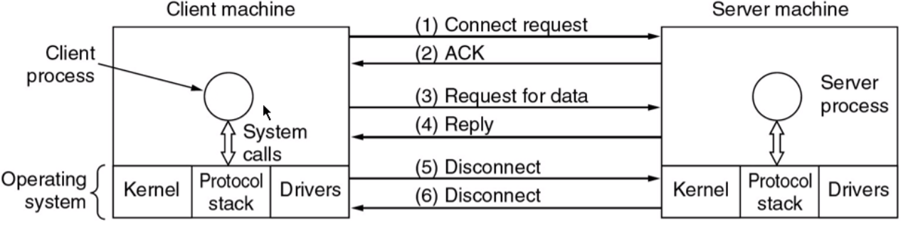

这里有几个非常重要的术语：

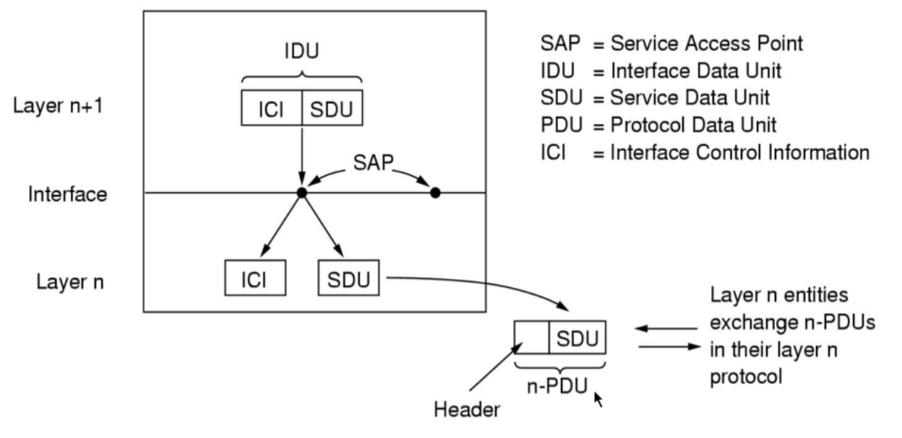

- SAP是服务访问点，是下层和上层服务的交互点，例如端口、IP地址等
- SDU是服务数据单元，是服务之间交换数据的基本单位
- IDU是接口数据单元
- PDU是协议数据单元，是协议之间交换数据的基本单位

### Network Architectures and Reference Models

目前有两大参考模型：

- ISO/OSI模型
- TCP/IP模型

ISO/OSI模型：

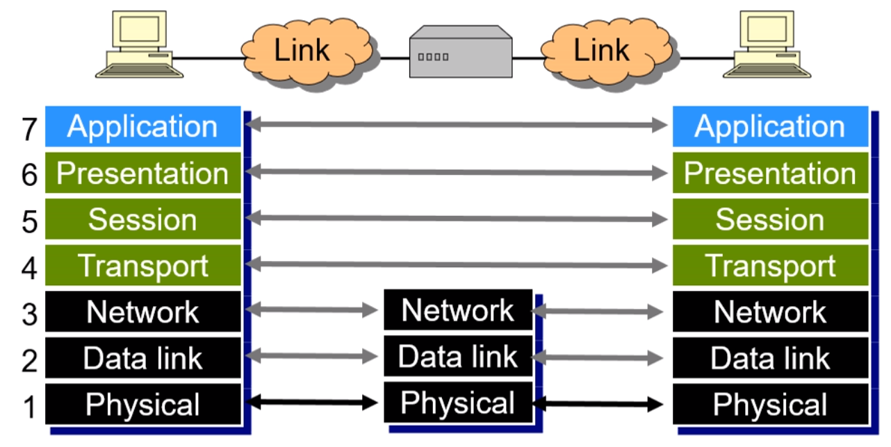

- 物理层：每个bit的数据传输
- 数据链路层：以数据帧为基础的传输
- 网络层：数据交换和路由
- 运输层：端主机和端主机的交换
- 会话层：管理逻辑连接
- 表现层：进行数据传送
- 应用层：特定应用领域

TCP/IP的模型是一个事实上的工业标准，基于实现归纳而来。它有一个协议簇，分成五层：

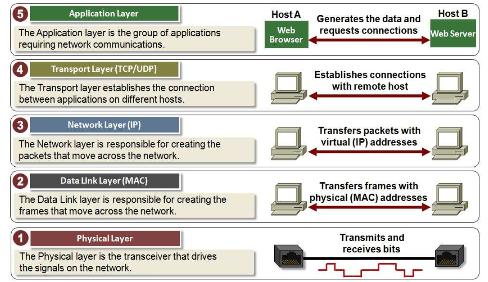

相对的，常见的协议有：


IP作为“细腰”，实现了不同协议的互操作。

## Physical Layer

### Introduction


物理层的主要目的是透明可靠的收发。透明体现在物理层不需要理解相应的byte，而只需要机械的收发。由于随着线路的传输，可能会出现信号失真，所以还需要进行处理。物理层有四个基本特性：

- mechanical 机械特性，主要讨论接插件
- electrical 电极特性，主要解决编码问题
- functional 功能特性，定义清楚每一个引脚的功能
- procedural 规程特性，什么时候拿什么原件发出什么信号

物理层主要负责：

- 提供基本信号
- 信号调制，编解码
- 激活物理媒体
- 时钟
- 不同格式的转换

### Basic for Data Communication

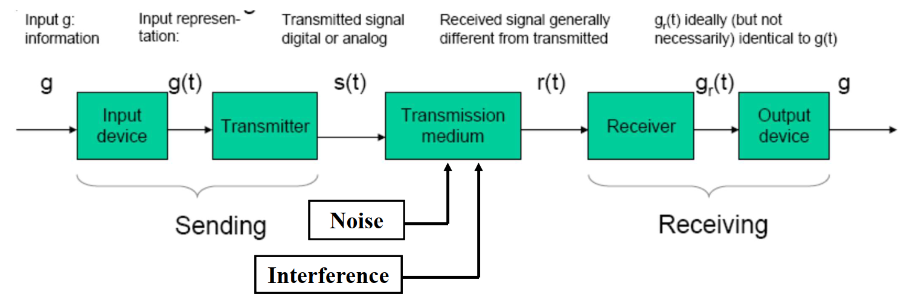

信息的传送过程如上所示。现在的问题是，由于传送过程可能存在三方面的影响：

- attenuation 衰减，振幅减小，扩大即可

  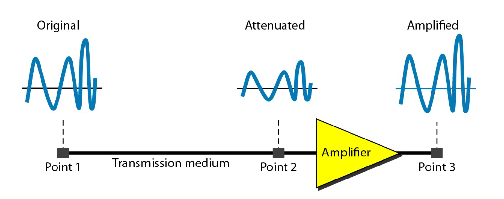

- distortion 失真，不同频率成分的信号传输速率不同

  

- noise 噪声

  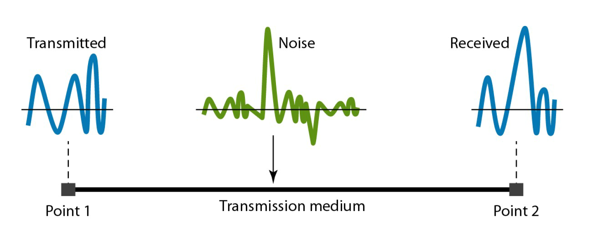

数字信号也会受到同样的困扰，可能会产生差错。

我们知道Fourier Transform可以把波分解成不同成分，但是信号有带宽限制。假如要传递ASCII码b，对应01100010，会产生一个均方根：$\sqrt{a^2+b^2}$，其中a和b是n次谐波的变换系数。信号的频率是有限的，大多数在频谱中位于有限的频谱范围内：

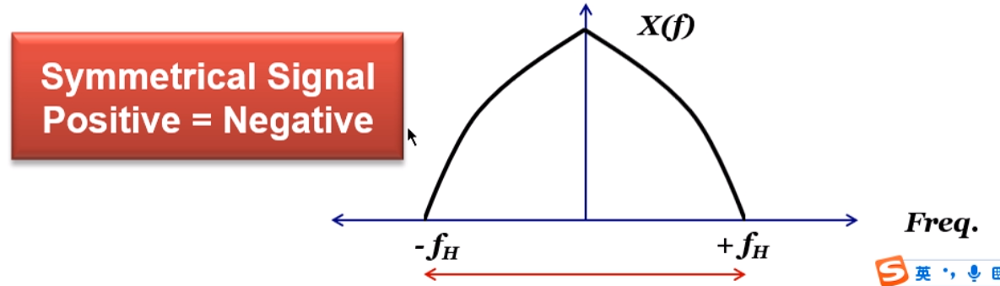

使用不同次的谐波叠加可以产生数字信号：

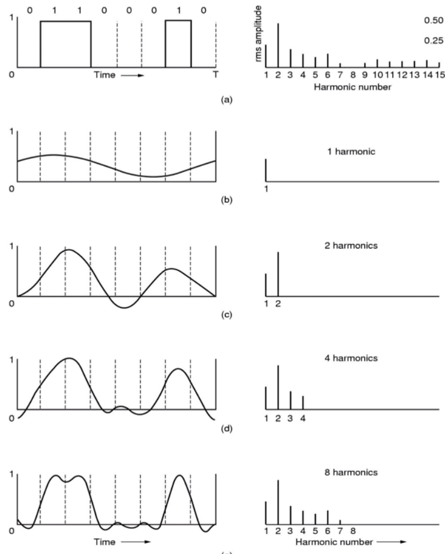

这就是时域和频域的能量分布。不同的谐波次数的能量是不一样的，这也是右边的图的纵轴。

所以说，传输的质量是和频率相关的，频率不同，产生的结果也不同；线缆里有相应的干扰，所以也会受到和模拟信号一样的困扰。带宽是信号中包括的最高和最低的信号之差，$B=f_h-f_l$。数字信号是无限多个频率的叠加，所以一般用比特率来说明带宽。这就引出了两个概念：

- baud rate（波特率、信号率、码元速率），单位时间内信号产生的变化数量，单位是Hz，用B表示
- bit rate（比特率），单位时间传输的比特数，单位是bps，用S表示

二者存在如下关系：
$$
S = B \log_2 v = \frac{1}{T} \log_2 v
$$
其中，$v$是码元数，是数字信号数。由于码元数是2，只有高电平和低电平，那么S=B，波特率和比特率是一致的；如果码元数是16，那么一个最基本的信号单位就代表4个bit。

> 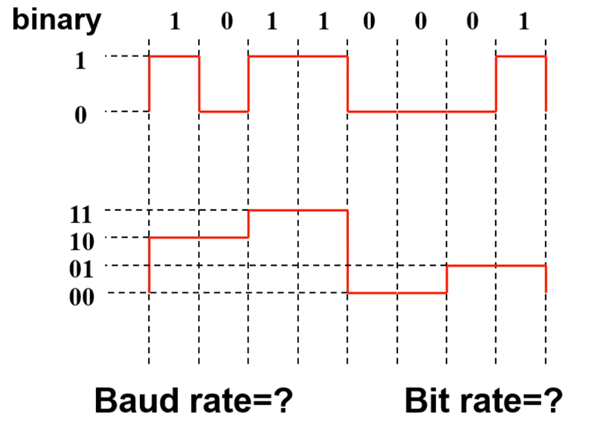
>
> 对于上面的波形，比特率=波特率；对于下面的波形，比特率=2\*波特率

接下来给出Nyquist Criterion（奈奎斯特定理）：
$$
Max.\,\, baud\ rate = 2H \\
Max.\,\, bit\ rate = 2H \log _2 v
$$
其中带宽是$H$，前提是无噪声干扰。Shannon则推广到了有噪声干扰的情况下：
$$
Max.\ \ bit \ rate = H \log_2 (1 + S / N)
$$
其中$S/N$是信噪比。常常使用分贝来衡量信噪比。

> H=3000，$10\log_{10}(S/N)=30dB$，则最大传输速率是30kbps.

香农理论给出了最大值，奈奎斯特理论则给出了需要的信号等级。

### Transmission Media

Copper（铜线）：UTP（无屏蔽线）、STP（屏蔽线）、Coaxial Table（同轴电缆）

Fiber Optics（光导纤维）：光信号在介质边界会产生total internal reflection

光的传播速度是$3\cdot 10^8$，而在fiber或者copper中则变成了$2\cdot 10^8$。波有特性
$$
c = \lambda f
$$
对于微波来说，频率为2.4GHz-2.484GHz，能传输100km，所以需要中继。

还有一种卫星头像，根据高度不同有所差别：

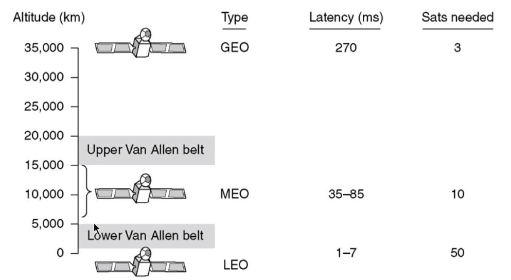

目前主要问题是不同频段之间的冲突。

### Modulation and Data Encoding

数据需要以信号的方式来传送。我们一般用周期的模拟信号和非周期的数字信号，前者用于载波。特别的，对于sin波，有amplitude（振幅）、frequency和phase（相位）三个参数。数字信号用正负电平来代表，每一个电平值代表了1bit.

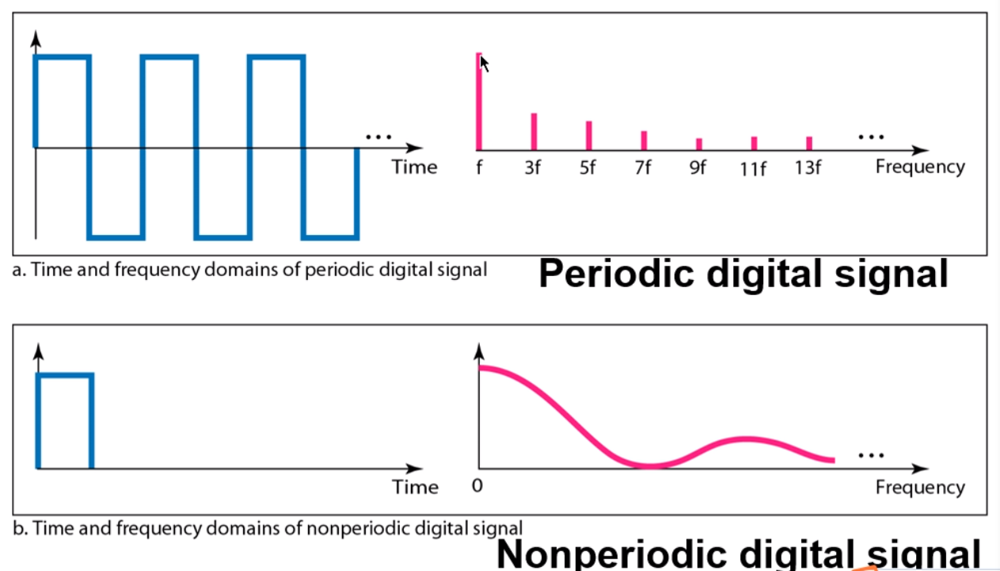

> 一个1920x1080的电视，使用24真彩色，刷新率30
>
> 则带宽为1920x1080x24x30=1.5Gbps，所以需要压缩。

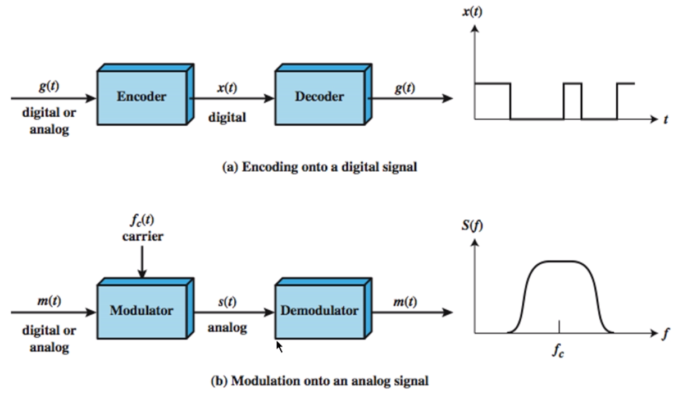

这里就存在四种转换：数数转换、数模转换、模数转换、模模转换，重点是前三种。

#### 数字传输

数字传输有两种方法：

- 基带传输（Base-Band/low-pass），使用低通，不需要进行调制

  只需要在数字信道进行传输，不做频率变换。传输的时候频率在低频接近0，高频接近基带带宽。只要带宽偏大，信号就接近于方波形式。带宽与比特率成正比，所以需要提高带宽才能提高传输速率。需要进行数数编码。

  

- 带通传输（Band-Pass），使用高通，需要进行调制。需要有限带宽，则需要进行变换。

  通带是一个频带范围，信号的范围可能比较广，进行一个filter，则留下来希望的一部分频段。这就需要一个调制器。

  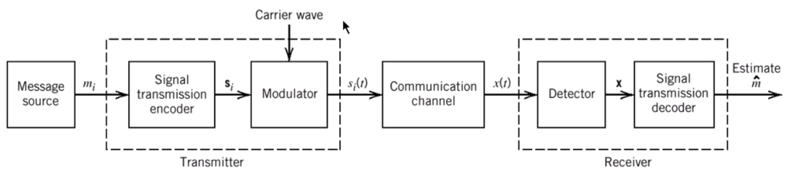

  信号通过载波进行调制，然后在对方进行反调制。所以需要进行数模转换。

> 低通信道想达到1Mbps，则带宽需要多少？
>
> 最小的带宽是bit rate/2=500kHz。也可以引入3次谐波、5次谐波。

#### 数数转换

核心是编码，发送端要按规则发出信号，接收端按规则收回信号，需要进行定时。同时，也需要考虑信号等级。因此，要了解各种编码方法，以及不同方法的实现。

有几种编码方式：

- NRZ-L 不归零。接收端需要知道信号频率，见变就翻

  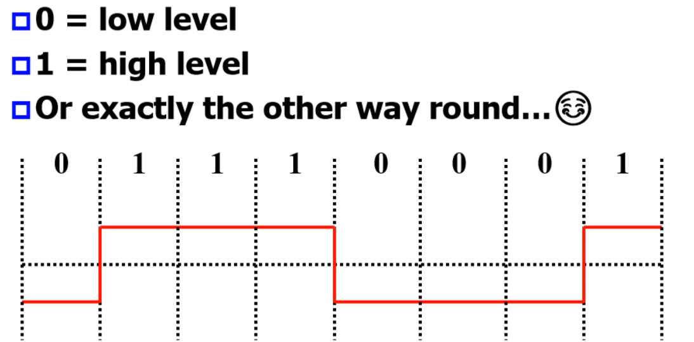

- NRZI 反向归零，见1就翻，也需要约定频率

  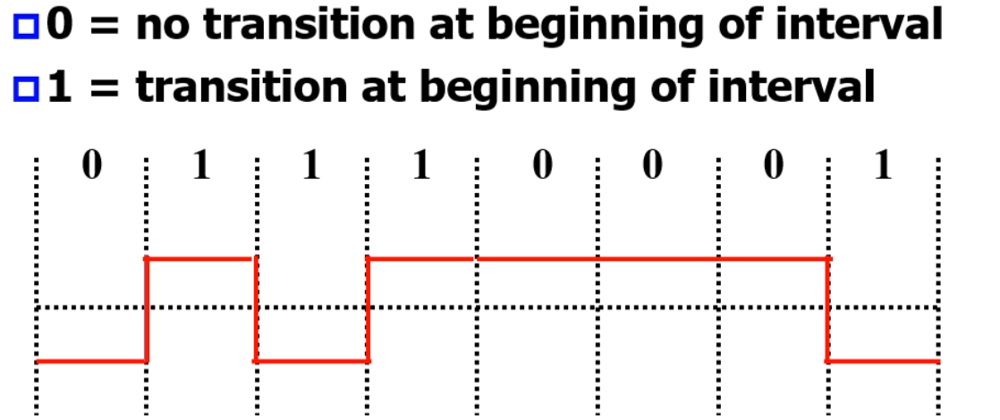

- Manchester编码，上升沿表示1，下降沿表示0

  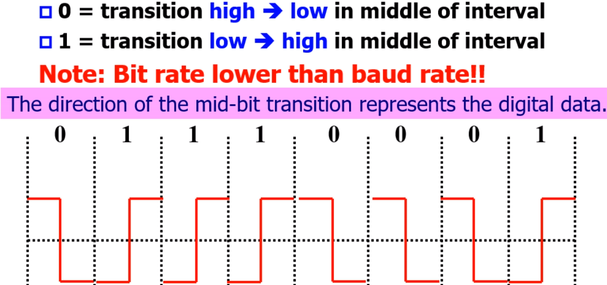

  此时的比特率是比波特率低的，假如比特率是10M，波特率就是20M，因为每秒变两次。

- Differential Manchester编码，0在边界变，1在边界不变

  

- Block Coding，一般表示为mB/nB coding，即用n bit代替m bit.常用的是4B-5B，将4bit映射到5bit.

  

  先划分，再替换，最后编码。按照下面的编码：

  

  可以保证没有太多连续地0，最多的两个后导0.

所以真正的情况一般使用这种模式：


先进行4B-5B encoding，然后再做NRZ-I。

#### 数模转换

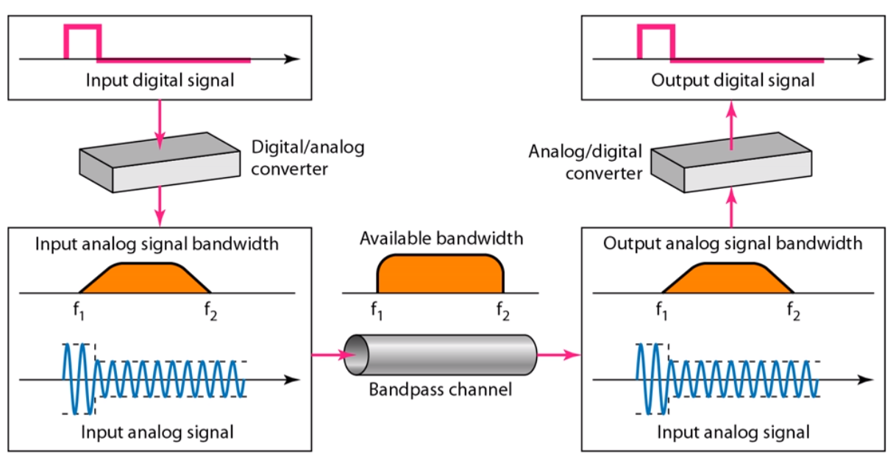

载波是一个高频等幅的正弦波。有几种常用方法：

- ASK（amplitude-shift keying，调幅）
- FSK（frequency-shift keying，调频）
- PSK（phase-shift keying，调相）
- QAM（quadrature amplitude modulation，正交幅度调制），同时调制幅度与相位

下面做了可视化：


根据奈奎斯特理论，最高的比特率是$2H\log_2 V$。所以关键是如何在每个采样内带更多的比特信息，而上面的这些波特率和比特率都是相同的。这就引出了multilevel signaling，用多值信号来调制。

例如，4种幅度/相位/频率的调制：


> 要发送100110001101010111，使用8ary调幅。那么就需要3bit，分为：
>
> 
>
> 最高是4V，用正负电压代表就是-4-4V的8种，进而第$i$个等级的电压就是
> $$
> V_i = \frac{2A}{M-1}i-A
> $$
> 带入$M=8,A=4$，最终的电压变化情况是
>
> 

猫实际上是调制解调器（modulator-demodulator），支持调制与解调制两个操作。如果又调幅又调相，就可以使有效值信号增加。可以用constellation diagram（星座图）进行表示：

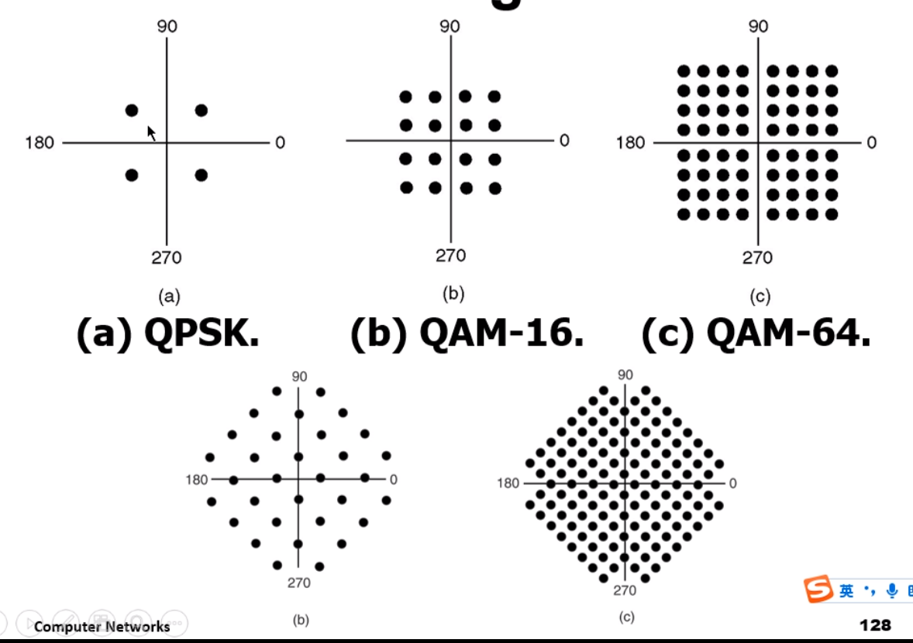

QAM的主要问题是可能衰减成其它信号，所以修改为下面的图，减少了错误率。

#### 模数转换

有两种方法：

- Pulse Code Modulation，脉冲码调制
- Delta Modulation，delta调制

PCM过程如下：

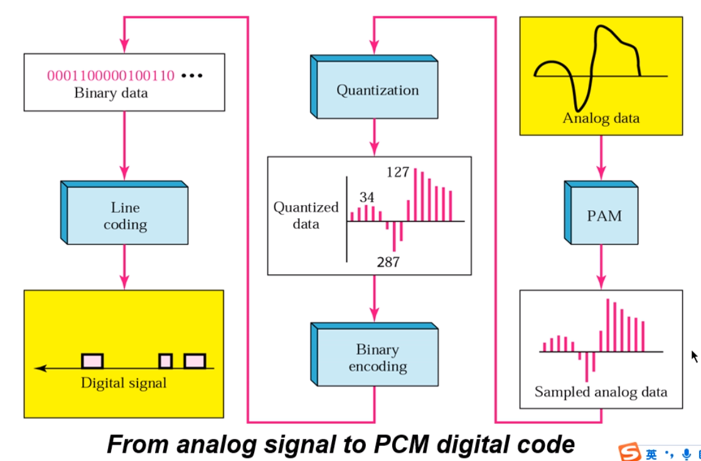

有三步：

- 采样，变为离散值。定义采样频率$f_s$，由于奈奎斯特定理，$f_s$至少是最高带宽的两倍。

  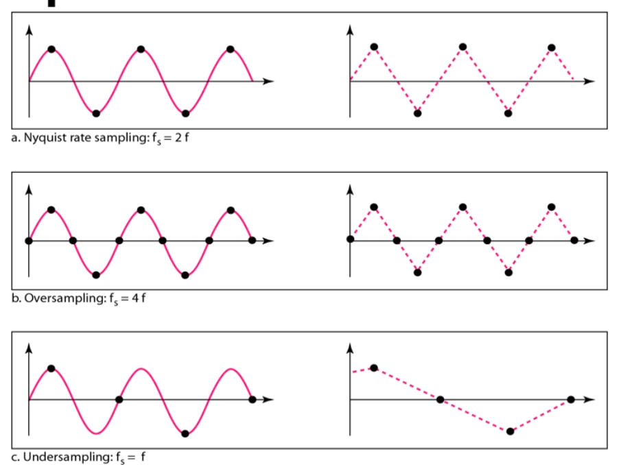

  上图分别是$4f, 2f, f$的采样频率下恢复信号的情况。所以至少2倍才能很好恢复。

- 量化，化为若干等级。

  假如把信号量化为$L$个等级，那么$\Delta = \frac{\max - \min}{L}$，落在同一区则为同一值。

  例如从-20到20分8个等级，则取中点为-17.5、-12.5、-7.5、-2.5、...

- 编码，对等级编码。

  需要的位数$n_b = \log_2 L$。

因此，最终得到的Bit rate=$n_b \times f_s$。

> 人类语音的频率是0-4kHz，用8bit代表。则采样率为8000sp/s, Bit rate=64kbps。

另一种方法是delta调制，也就是增量法：

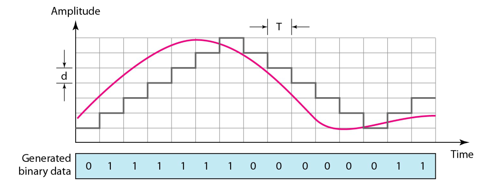

#### 传输模式

数据传输模式有几种：

- 并行传输

- Serial（串行）传输，一个比特一个比特串

  - Asynchronous（异步）传输，字符和字符之间间隔不确定，比特与比特同步。所以需要一个起始位和停止位：

    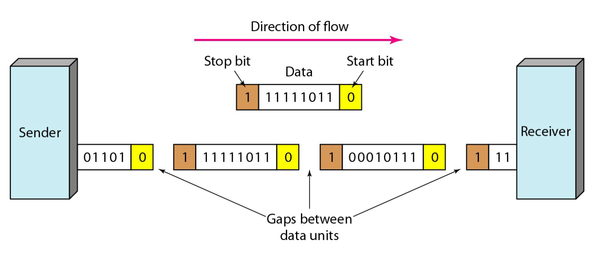

    比较适合字符间隔比较大的

  - Synchronous（同步）传输，字符与字符间严格不同，需要一个帧的发送接收，所以需要标记帧的开始结束：

    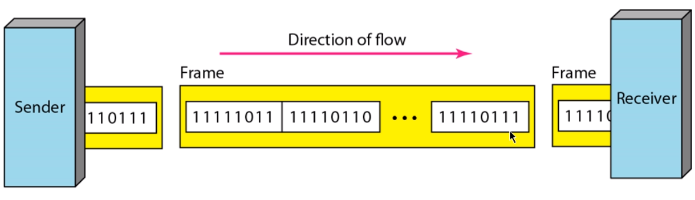

  - Isochronous（等时）传输，固定间隔传输

此外，通信还涉及到一个双工的问题：

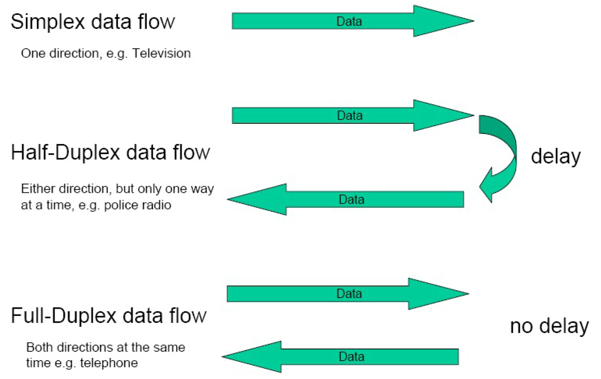

Internet就是一个半双工的网络，电话是支持全双通的。

### Multiplexing

多路复用是提高利用率的措施。


Multiplexer（MUX，多路复用器）和Demultiplexer（DEMUX，逆多路复用器）是两个主要手段。

#### FDM

Frequency-division Multiplexing将信号分为多个频段：


那么在MUX处将不同频率调制，DEMUX处再用滤波器进行分解。

> 一个音频站4kHz，若目前有一个线路为20kHz-32kHz，可以
>
> 

#### TDM

Time Division Multiplexing是根据时间来分的：

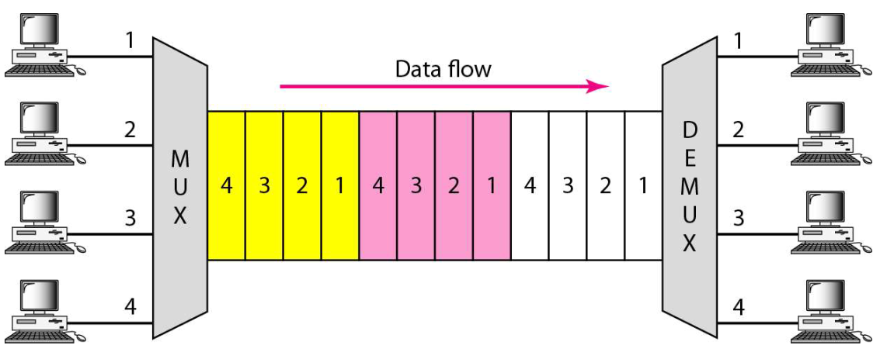

按照时间片进行分割。这里引入一个时间槽的概念：每一帧分成不同的时间槽，来存储一些信号：


每个帧内有相同的时间槽，称为同步TDM。

> 4个1Kbps的连接进行多路复用，单位是1bit。
>
> （1）1bit在多路复用之前的时间是1/1=1ms
>
> （2）新的比特率是4Kbps
>
> （3）每一个时间槽的时间是1/4ms
>
> （4）一个帧的时间仍然是1ms

多路复用存在一种层次结构：


同步多路复用的问题在于，无论有没有数据传输都需要时间槽。所以异步的（也作statistical TDM, STDM）可以用来避免浪费：

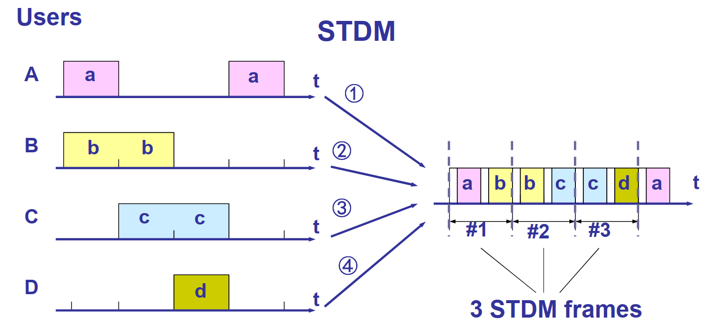

#### Spread Spectrum

拓频方法有很多：

- Frequency-hopping Spread Spectrum（FHSS，跳频拓频），频率跳跃按照频率表产生信号

  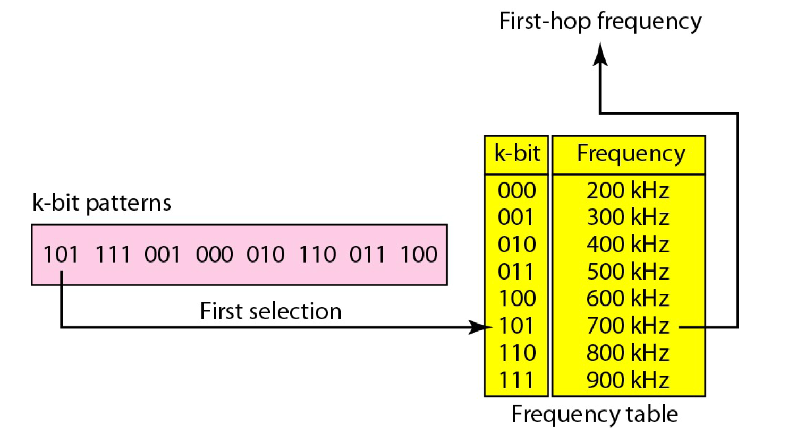

- Direct-sequence Spread Spectrum（DSSS，直接序列跳频）

  

Code Division Multiple Access（CDMA，码分多路复用）就用了DSSS。假设$D$是信号率，每个站点分配一个码片序列，这样接收者就可以根据得到的序列来分辨发送者：

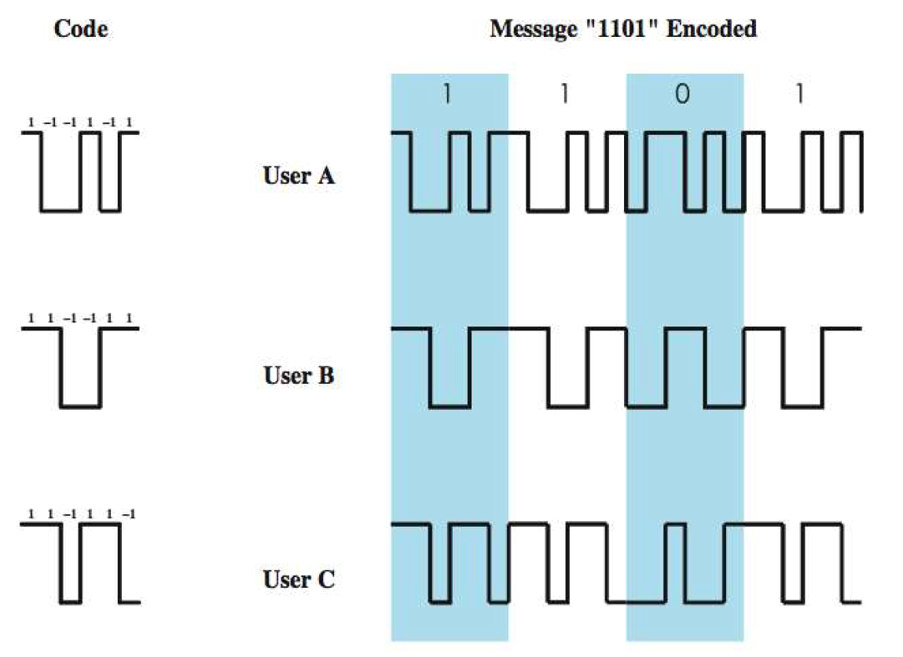

为了能够分辨开来，假设用$\pm 1$表示高低电平，可以定义为：
$$
S \cdot T = \frac{1}{m}\sum_1^m S_i T_i 
$$
这样就可以定义一个向量空间，满足每个码片序列两两正交（$S\cdot T=0, S \cdot S = 1, S \cdot \overline S = -1$），进而方便的得到原码片：


## 数据链路层

### Introduction

数据链路层的服务是：Deliver a data link frame between two physically connected machines.

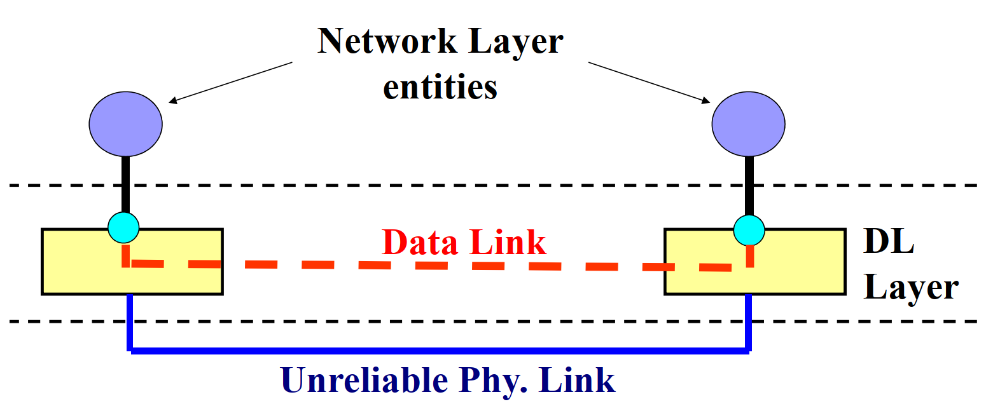

连接分成两种：

- 点对点的连接，不需要路由
- 多主机的连接

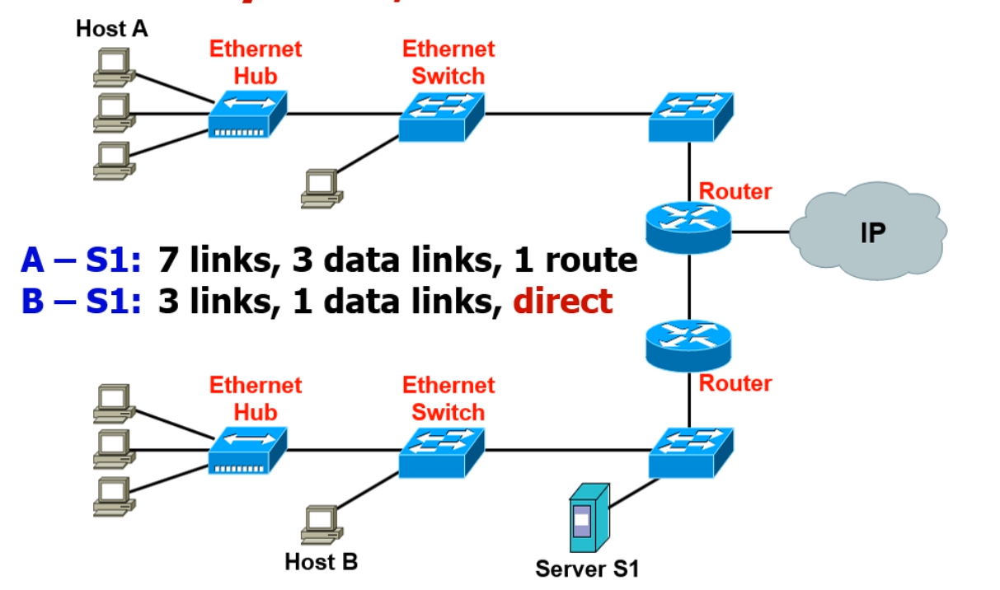

链路层的职责有几个方面：

- Framing
- Error Control
- Flow Control
- Addressing
- Access Control

### Framing

双方以帧为单位，在相邻节点中进行发送接收。这样可以缓解缓冲有限，检测差错更方便，重传单位小，防止占用信道时间太长。

为了保证帧的开头结尾，有几种技术：

- 字节计数，用一个特殊位来计数帧的字节数。但计数字节错误会导致严重问题。

- 标志字节，用特殊标记来标志开始结束。一半用一个特殊的escape byte（比如ESC）。问题是如果出现特殊的标记，那么就需要开始端插入escape进行转义。中间这块区域称为transparent transmission（透明传输区，透传）。

  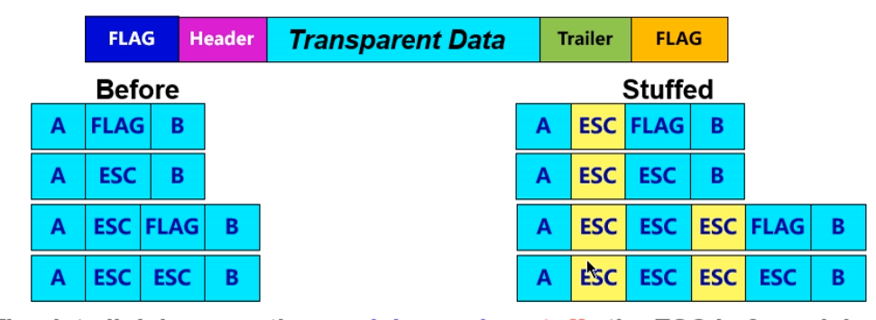

- 起始字节标记，例如01111110作为开始结束。如果在数据中也有这种东西，就在5个1后面插入一个0，保证不会出现6个1.这种方式是bit stuffing。

  

- 物理层标记

  

- 基于时钟的方式，按照固定时钟判断。

### Error Detection and Correction

由于噪声等因素的干扰，存在一些错误。错误可能是一个bit，也可能是冲击噪声等导致的突发错，导致多位错误。为此，发送端必须存在一些算法来产生冗余，把消息和容易一起发送。接收端收到之后根据特定算法，看数据和冗余之间的的关系是否正确。

Error-Correcting Codes（ECC，纠错码）由m bit数据和r bit冗余构成，形成n bit codeword（码字）。

常用的纠错码是Hamming Code。它定义了一个Hamming Distance，即两个字符串之间不同的比特位位数。想要检测$d$位错误，需要二者之间的Hamming Distance为$d+1$；如果要校正则需要$2d+1$。Hamming Code在$2^k, k \ge 0$的每一位作为校验位。下面是一个例子：

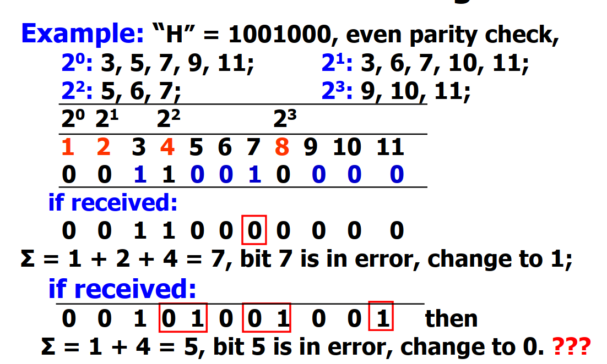

另一种常见的方式是Parity Check（奇偶校验）。它能检验奇数位错误的情况，但是不可校验。一种方法是提高到二维的奇偶校验，此时1bit error可以检测并纠正，2和3位可以校验，4位以上某些条件可以校验。

目前一般使用的方法是CRC（循环冗余码，Cyclic Redundancy Check）。其方法比较简单，把码看成多项式$\sum k_ix^i$，然后给出生成多项式$G(x)$。用多项式除上$G(x)$，得到的余项追加到数据后面。这是一个例子：

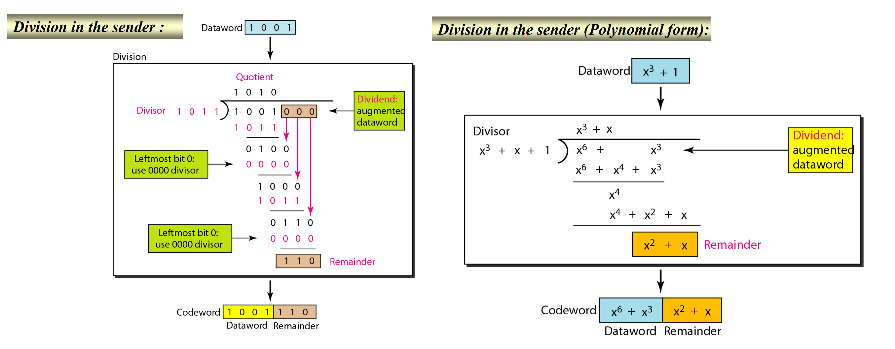

对于多项式来说，如果$G(x)$的最高次是$r$，余项就必须保留3位。在计算过程中，使用异或运算代替加减法。在得到结果的时候，如果新的多项式无法整除$G(x)$，则说明出现错误。

$G(x)$的选取有如下规则：

- 一位错误：$x^r, x^0$有非0系数
- 两位错误：$G(x)$有至少3项
- 奇数位错误：$G(x)$有因式$(x+1)$
- 可以检测小于$r$位的连续错误和大多数多于$r$位的连续错误。

下面是一些常见的$G(x)$：


如果出现错误怎么办？一种方法是用前向错误矫正，比如用CRC或者海明码来纠错，但是这样无法保证严格可靠。所以目前一般使用ARQ（Automatic Repeat Request）方法：在需要的时候直接重新重发，这样就是严格可靠的。

这里又产生出新的问题：如何进行流量控制？有两种方法：

- 每次发送一帧，等待ACK。效率很低。对应的策略是Stop and weight。
- 每次发送多帧，等待ACK。发送者必须将未ACK的帧保存在缓冲区中，等待重发。对应的策略是Sliding Window。

### Stop-and-Wait Protocols

我们讨论几种协议：

（1）An Unrestricted Simplex Protocol

这种协议建立在非常理想的情形：

- 数据每次只进行单方向传输
- 传输和发送的网络都已经准备碗壁
- 处理时间可以忽略
- 存在无限的可用缓冲区
- 通信信道始终可用

此时，有类似这样的伪代码：

```c++
Sender1:
	while(true) {
        from_network_layer(&buffer);	// 获取数据
        msg.info = buffer;
        to_physical_layer(&msg);		// 发送
    }
Reciever:
	while (true) {
        wait_for_event(&e);				// 等待事件
        from_physical_layer(&msg);
        to_network_layer(&msg.info);	// 获取数据
    }
```

（2）A Simplex Stop-and-Wait Protocol

这一协议的目的是防止接收端出现拥塞，所以引入一个应答机制。

```cpp
Sender1:
	while(true) {
        from_network_layer(&buffer);	// 获取数据
        msg.info = buffer;
        to_physical_layer(&msg);		// 发送
        wait_for_event(&e);				// 等待应答
    }
Reciever:
	while (true) {
        wait_for_event(&e);				// 等待事件
        from_physical_layer(&msg);
        to_network_layer(&msg.info);	// 获取数据
        to_physical_layer(&s);			// 进行ACK
    }
```

（3）A Simplex Stop-and-Wait Protocol for a Noisy Channel

在不可靠网络上可能存在两个问题：

- 数据可能出现错误，所以需要接收方发送ACK来保证帧正确
- ACK信号可能丢包，所以需要一个超时机制
- 接收方无法分辨是不是同一个包，所以引入一个序列号，这里只需要0和1.

此时，代码如下：

```cpp
Sender1:
	while(true) {
        from_network_layer(&buffer);	// 获取数据
        msg.seq = next_frame_to_send;	// 存放序列号
        msg.info = buffer;
        to_physical_layer(&msg);		// 发送
        start_timer(msg.seq);			// 开始计时
        wait_for_event(&e);				// 等待应答
        if (event == frame_arrival) {	// ACK到达
            from_physical_layer(&msg);	
            if (s.ack == next_frame) {	// 得到结果
                stop_timer(msg.seq);	// 停止计时
                inc(next_frame_to_send);// 序列号更新
                continue;
            }
        }
    }
Reciever:
	while (true) {
        wait_for_event(&e);				// 等待事件
        if (e == frame_arrival) {
            from_physical_layer(&msg);
            if (msg.seq == expected) {
                to_network_layer(&msg.info);
                inc(expected);			// 改变序列号
            }
            s.ack = 1 - expected;
            to_physical_layer(&s);		// ACK
        }
    }
```

下面是一个例子：


在这个过程中，可能存在一系列的时延：

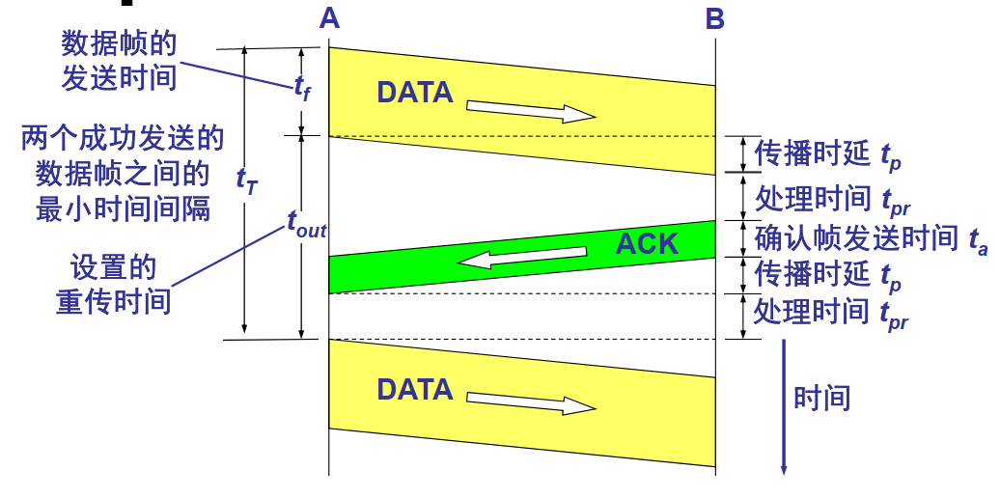

因此，时间利用率是
$$
U = \frac{t_f}{t_T} = \frac{t_f}{t_f + 2t_p + t_a + 2t_{pr}}
$$
如果$t_a, t_{pr} << t_p$，则
$$
U \approx \frac{t_f}{2t_p+t_f} = \frac{1}{1+2\alpha}, \alpha := \frac{t_p}{t_f}
$$

> Example. 节点间距离0.1\~10km，R=10\~100Mbps，信号传输$2\times 10^8$m/s，帧带宽L=1000b，那么
> $$
> t_f = \frac{1000b}{10\cdot 10^6 bps} = 10^{-4}s
> $$
>
> $$
> t_p = \frac{100 \sim 10000}{2\cdot 10^8} = 0.5\cdot 10^{-6} \sim 0.5 \cdot 10^{-4}
> $$
>
> 所以$\alpha = t_p / t_f = 0.005 \sim 0.5$，$U = 0.99 \sim 0.5$

> Example. 带宽1Mbps，传播延迟10ms，数据帧1000bits
>
> 时延带宽积：
> $$
> 10^6 \cdot 10\times 10^{-3} = 10000bits
> $$
> ACK用时：
> $$
> 1000/10^6 + 2\times 10 \times 10^{-3} = 0.021s
> $$
> 传输帧数
> $$
> 0.021 \times 1\times 10^6 = 21000bits / 1000 = 21frames
> $$
> 利用率
> $$
> U = 1/21\times 100 = 5\%
> $$

### Sliding Window Protocols


发送者维护一个和帧有关的序列，称为sending window；等待发送或者已经发送但没有收到ACK的帧是outstanding window。当发出去一个包，则将窗口的高位加一；当收到一个ACK，则将窗口的低位+1.如果窗口最大大小是$w$，这些 buffer 都需要保存未ACK的帧。如果窗口满了，就停止网络层，停止发送。

接收端有一个接受窗口，对于落在接收窗口之外的帧，直接舍弃掉。如果帧的序列号和低位相等，则将其传送给网络层、发送ACK、窗口+1.无论发送状况如何，重点是保证发送端的网络层和接收端的网络层顺序保持一致。

ACK可以使用独立的ACK，也可以使用累积ACK。当ACK number是N+1，表示接收端收到了N+1之前的所有信息，并且下一个期望的序列号是N+1。

全双工允许两个交流方的对称帧传输。它有两个分离的交流通道，但使用同一根导线。这样，数据和ACK就是相互混杂的。捎带确认（piggybacking）将ACK稍带到返回的数据帧上，如果很快有新的帧过来就捎带确认返回，否则就返回一个独立的ACK。

与Stop-and-Wait类似，滑动窗口也有三种协议：

- One-Bit Sliding Window Protocol ARQ(1,1)
- Go-Back-N ARQ(>1,1)
- Selective Repeat ARQ(>1,>1)

（1）One-Bit Sliding Window Protocol

最大发送窗口大小=1，接收窗口大小=1，此时退化到停止与等待协议。


代码如下：

```c
#define MAX_SEQ 1

void protocol4() {
    while(1) {
        wait_for_event(&event);
        if (event == frame_arrival) {
            from_physical_layer(&r);
            if (r.seq == frame_expected) {
                to_network_layer(&r.info);		// pass packet to network layer
                inc(frame_expected);
            } 
            if (r.seq == next_frame_to_send) {
                stop_timer(r.ack);
                from_network_layer(&buffer);	// fetch from network layer
                inc(next_frame_to_send);
            }
        }
    }
}
```

如果通道承载量是$R$，帧大小是$L$，RTT是round-trip time，那么
$$
U = \frac{L/R}{L/R+RTT}
$$
（2）Go-Back-N 

发送窗口大小>1，接收窗口大小<1，所以必须按照发送顺序接收信息。


代码：

```c
while(true) {
    wait_for_event(&event);
    switch(event) {
        case network_layer_ready:	// have a packet to send
            from_network_layer(&buffer[next_frame_to_send]);
            nbuffered = nbuffered + 1;
            send_data(next_frame_to_send, frame_expected, buffer);
            inc(next_frame_to_send);
            break;
        case frame_arrival:			// a data frame arrived
            from_physical_layer(&r);
            if (r.seq == frame_expected) {
                to_network_layer(&r.info);
                inc(frame_expected);
            }
            while (between(ack_expected, r.ack, next_frame_to_send)) {
             	nbuffered = nbuffered - 1;
                stop_timer(ack_expected);
                inc(ack_expected);
            }
            break;
        case cksum_err:
            break;
        case timeout:
            next_frame_to_send = ack_expected;
            for (i = 1; i <= nbuffered; ++i) {
                send_data(next_frame_to_send, frame_expected, buffer);
                inc(next_frame_to_send);
            }
    }
}
```

在Go-Back-N ARQ中，窗口最大大小是$2^n-1$，接受的窗口大小总是$1$。这一模式下如果错误率比较高，就可能浪费很多带宽。

（3） Selective Repeat

发送端可以发送多个帧等待ACK，接收端接受的帧可能会被接收并存放在buffer.


发送端在接收到 ACK i 之后，才会移动到位置i；只有所有i-1内的帧都接收正确，才会发送 ACK i。

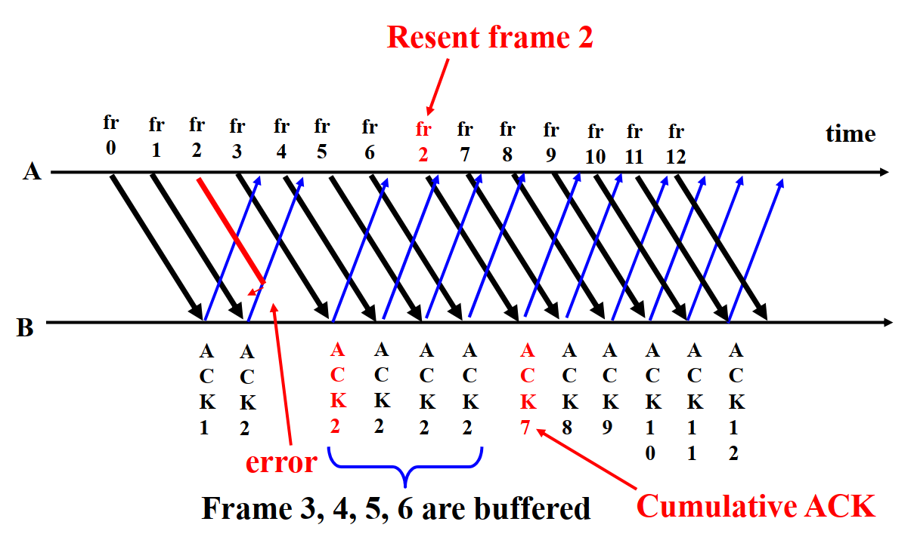

这样就导致算法更复杂：

- 接收端需要能够重新插入可重发的帧
- 发送端需要在需要的时候不按照顺序进行发送
- 可能需要更多的存储空间

为了进一步提高效率，一种策略就是引入 pipelining。

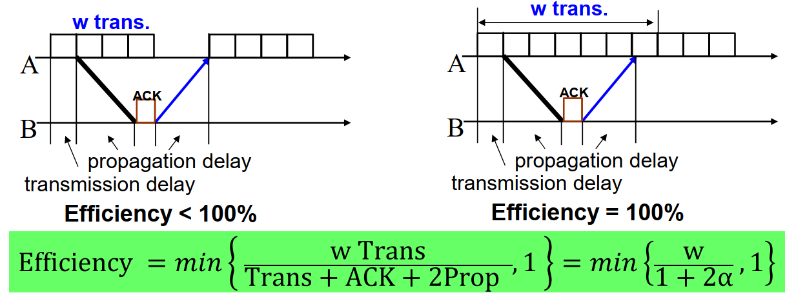

> 某个信道数据传送率R bps，传播延迟ts/km，距离Lkm。若数据包大小B bits，ACK的包大小可忽略，进行讨论如下：
>
> 在获得最大利用率的时候，有
> $$
> W = 1 + 2a
> $$
> 其中$a = T_{prop}/T_{trans}$。由于
> $$
> T_{prop} = Lt, T_{trans} = \frac{B}{R}, W = 2^n - 1
> $$
> 带入有
> $$
> n = \lceil \log_2(2 + RLt /B)\rceil
> $$

### HDLC and PPP

链路层的常见协议有

- Hight-Level Data Link Control(HDLC)
- Point-to-Point Protocol(PPP)

（1）HDLC

HDLC有如下格式：

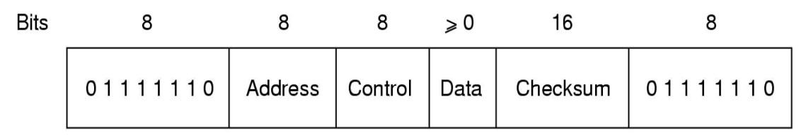

Flag是帧前后两端都约定好的固定字符，Address是帧的接收端，Control用来确定不同的帧类型，FCS是帧检查序列，用于错误检测。

这种协议用3-bit序列的滑动窗口，并有7个未收到ACK的缓冲区。

（2）PPP

PPP（Point-to-point protocol）用于点对点通信，没有错误矫正、拥塞控制，可以乱序传输，不支持多点通信，这些功能都在更高层完成。

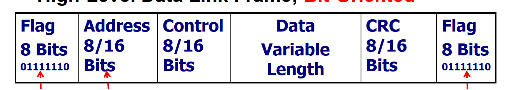

PPP提供的功能包括：

1. 定义了数据帧的格式
2. 支持同时多个网络层协议
3. 定义了两个设备如何鉴权

它有一系列状态，转换如下：

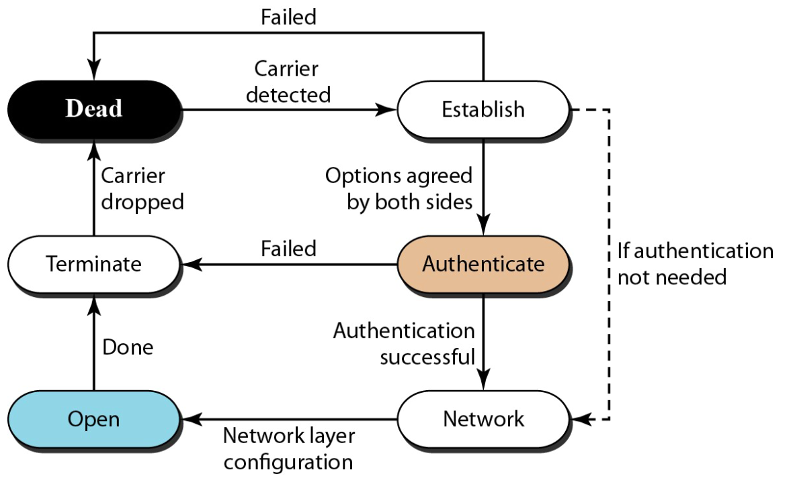

## Medium Access Control

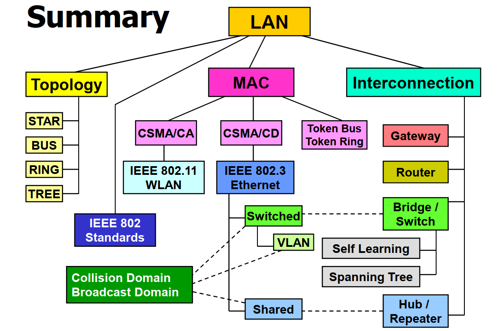

### Medium Access Control

多个主机可以共享相同的介质，一个主机发送，其它就可以收到，这就是多路访问。但如果两个节点同时发送信息，数据帧就会发生碰撞。因此，关键问题是竞争时如何确定使用哪个频道，而解决方案就是使用某种分配方案。

总体来说可以分成两类：静态分配和动态分配。前者是每个用户有一个带宽或者时间单元，也就是FDM和TDM，二者之间互不干涉，但是这样效率比较低。

MAC是介质访问控制，是数据链路层的一个子层：


它主要有三个协议：

- Channel Partitioning Protocols，信道划分协议
  - FDMA
  - TDMA
  - CDMA
- Random-access Protocols，随机接入协议
  - ALOHA
  - CSMA
  - CSMA/CD
  - CSMA/CA
- Controlled-access Protocols，控制访问协议
  - Reservation
  - Polling
  - Token Passing

信道划分协议我们已经讲过，现在主要讨论随机接入协议。

#### ALOHA

ALOHA又可以分成pure ALOHA和slotted ALOHA。

pure ALOHA的过程如下：

1. 让用户传输数据
2. 假设碰撞会发生
3. 碰撞后的数据帧会被销毁
4. 用一个反馈机制来告知数据帧的情况
5. 如果被销毁则进行重发

假设一个帧的transmission时间是$T_{tr}$，那么在时刻$t$发送的数据帧发生碰撞的范围是$[t-T_{fr}, t+T_{fr}]$。


考虑到一个帧时内，生成k帧的概率服从Poisson分布
$$
X \sim P(k) = \frac{G^k e^{-G}}{k!}
$$
因此不发生冲突的情况下$k=0$，则$P(0)=e^{-G}$。由于这里的时长是2帧，所以pure ALOHA方法的吞吐量是
$$
S = Ge^{-2G}
$$

当$G = 0.5$出现最大吞吐量，约为0.184.

> pure ALOHA在一个200kbps的共享信道传送200bit数据帧，那么$T_{fr}=1ms$，所以在2ms内发送新的数据包会导致碰撞。
>
> 如果每秒钟产生1000个数据帧，也就是每毫秒一个，此时，$S=Ge^{-2G}=0.135$，所以会剩下135个帧。
>
> 如果每秒钟产生500个数据帧，也就是每毫秒0.5个，此时，$S=Ge^{-2G}=0.184$，所以会剩下92个帧。

slotted ALOHA则把时间分成不同单元（称为slots），每个时间槽等于帧传输时间。基站只在一个槽的开始时间传输，否则就进行等待。有一个中央时钟来通知所有基站槽开始时间。

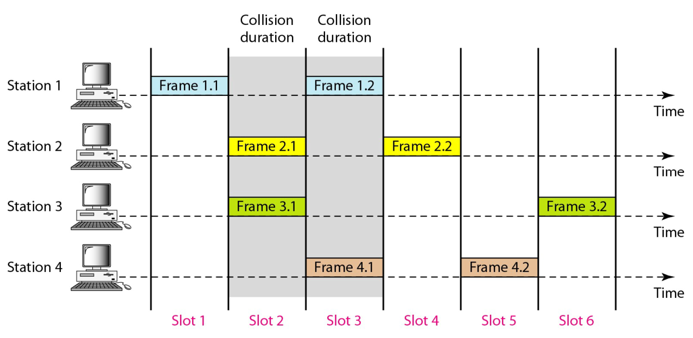

这个时候，传输率
$$
S = Ge^{-G}
$$
当$G=1$，取最大值0.368.

#### CSMA

CSMA（Carrier Sense Multiple Access，载波侦听多路访问）的思想非常简单：在传输之前对信道进行侦听，如果空闲就发送，否则就推迟。但这种方法也无法完全避免冲突，因为传播延迟的存在，所以两个节点可能无法监听到对方的传输。此时，传输时间就会完全浪费。

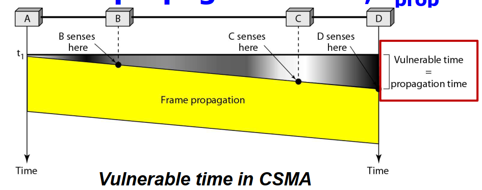

可以看到，上图中的灰色地带就是监听到信号的时间，我们把vulnerable time定义成最大的传播时延，传播时间越长就意味着越有可能出现碰撞。

CSMA可以分成三种：

1. 1-persistent ，如果信道被占用则始终监听信道，如果信道空闲就立即发送，如果检测到碰撞就等待随机时间再重新发送
2. non-persistent，如果信道繁忙就等待一段随机时间再检测，如果信道空闲就直接发送。这样减少了冲突率，但是延迟变高了
3. p-persistent，如果信道繁忙就进行监听，如果信道空闲有概率$p$进行发送，概率$1-p$等待一个传播延迟。

三种过程的流程图如下：


#### CSMA/CD

CSMA/CD（CSMA with collision detection）的改进是，在传输的时候，发送端会监听是否发生碰撞。如果碰撞则直接停止传输，减少信道冗余。它被广泛用在总线拓扑LAN中，比如802.3和以太网。它的过程如下：


当信号发生碰撞的时候，能量会发生异常，可以通过这一点来检测碰撞。下面是一个例子：

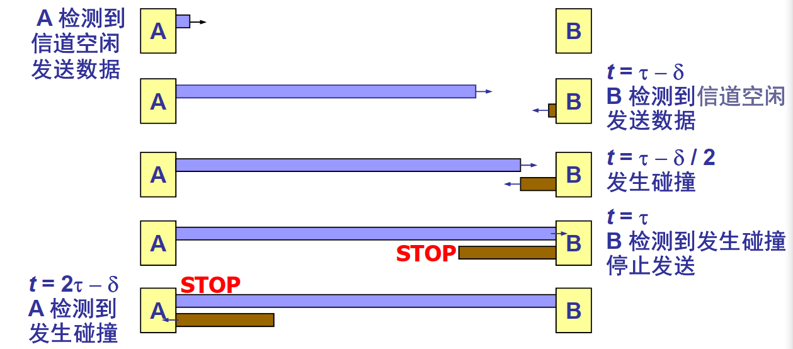

这也就意味着，最坏情况下检测碰撞需要$2\zeta$，其中$\zeta$为最大的传播延迟，我们可以把槽的时长设置为$2\zeta$，类似一个slot ALOHA。只有当传输时间大于传播时间，这种方法才比较有效率。

从定量角度来说，如果CSMA/CD比CSMA效率更好，那么帧传输时间至少应该是2倍的传播时延加上堵塞信号序列的时间：
$$
L_{\min} = R\cdot a = 2R (\frac{R}{0.7C}+T_{phy})
$$
其中，$a$是contention period，$R$是data rate，$T_{phy}$是物理层的延迟。

> 一个CSMA/CD网络带宽为10Mbps，如果最大的传播时间是25.6$\mu s$，忽略堵塞信号的发送时间，求帧最小大小。
>
> 解：帧传输时间$T_{fr}=2T_p=51.2\mu s$，最小的帧大小为10Mbps$\times$51.2$\mu s$，即64bytes.

#### CSMA/CA

CSMA/CA（CSMA with collision avoidance）是在传输前避免碰撞。在无线LAN中CSMA/CD并不适用，这是因为：

1. 基站必须同时能够收发数据
2. 由于hidden terminal problem，碰撞可能无法检测。如果B对A和C可见，但A、C两两不可见，A和C就可能同时向B发送信号产生碰撞。
3. 基站之间距离可能很长，在监听到碰撞前就可能衰减到无法检测

最简单的方法就是等待一个随机时间然后检测信道状态，如果信道繁忙就继续等待。802.11b则维护了一个计数器c，每次信道空闲就让c-1，当c=0的时候则进行传输。如果包没有收到ACK，就选取一个更大的c。

CSMA/CA防止碰撞使用了三个基本的技术：

1. interframe space（IFS），当信道空闲的时候基站不会立即发送，这段等待的时间就是IFS。IFS的目的是允许传输的信号发送到其它基站，如果在IFS之后信道仍然空闲，那么就可以传送，但还是必须等待竞争时间。
2. contention window（竞争窗口），它是时间分成槽的数量，一个基站会随机选择一个时间槽作为等待时间，在竞争窗口中基站需要在时间槽后监听信道，如果繁忙则不会重启过程，而是停止计时器并在信道空闲的时候再重启
3. ACK，即便有了前面的所有约束，仍然有可能发生碰撞，所以需要ACK和超时重发

但这样也无法解决hidden terminal problem。为此，我们引入RTS/CTS：

- 当监测到信道空闲，A等待一段时间（Distributed Interframe Space, DIFS）
- A向B发送RTS（request to send），包含之后要发送的数据帧长度
- 收到RTS之后，B等待一段时间（Short Interframe Space, SIFS）
- B向A发送CTS（clear to send），表示B可以接收数据
- 收到CTS，等待SIFS，A向B发送数据
- 收到数据，等待SIFS，B向A发送ACK

可以用下面的图表示：

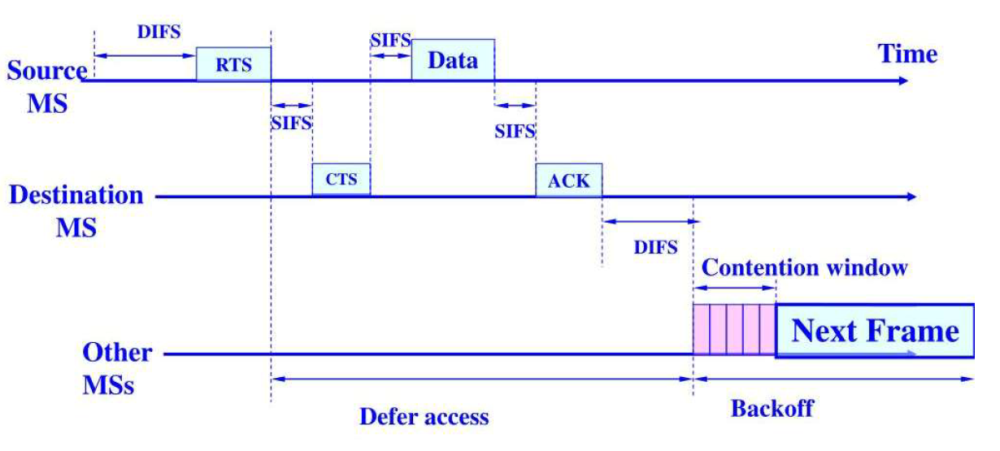

这种协议的主要问题是不够公平，可能会产生一个基站没有机会传输帧。

### Local Area Networks（LANs）and IEEE 802

局域网是个人所有的，范围较小，速度快，高可靠性，易于管理。LAN的拓扑结构可以分成两类：

- 物理拓扑，设备间实际的位置和物理连接的安排
- 逻辑拓扑，是两个设备间数据报文传输的路径，往往不止一条

常见的拓扑结构如下：

- Bus Topology，所有网络连接到总线中，传输沿着总线进行。这种模式下添加主机可能需要破坏网络，一个主机的失败可能会导致整个网络的失败
- Star Topology，连接到一个中央的位置，一般是一个交换机，是最常用的物理拓扑结构。一个连接的破坏并不会破坏整个网路。
- Ring Topology，网络连接在一个环中，不需要终结设备。
- Tree Topology

一般选择拓扑结构，需要考虑可靠性、可扩展性、性能和上下文，比如中央、走线、访问控制。

传输介质可以分成两类：

- Physical cabling，也称为bounded media，传输绑定到物理介质，想要通信必须让主机和介质构建物理连接
- Wireless network，也称为unbounded media，传输不需要绑定，主机也不需要物理连接

常见的介质包括同轴电缆（Coaxial Cable）、双绞线（Twisted Pair Cable）、光纤（Fibre Optic Cable）、无线（Wireless）等。

IEEE802模型给出了三层结构，它是对数据链路层和物理层的一个细化：

- Physical，负责对信号的编码解码和位传输，需要特定在某种传输介质中
- LLC（Logical Link Control），选择寻址和数据交换控制的方法，与拓扑结构、介质和MAC相独立
- MAC（Media Access Control），基于MAC、寻址和数据矫正将帧中的数据进行汇编。对于某个LLC，可以选择多个MAC。

802协议目前还在演进中，其中比较重要的两个是802.3的CSMA/CD（Ethernet）和802.11的WLAN。

### Ethernet

#### Basic

首先需要明确几个概念。以太网的**拓扑结构**可能是总线、星形和树形，**信号**是数字信号，**访问控制**使用CSMA/CD，**规格**是IEEE 802.3，**传输速度**可能是10Mbps、100Mbps或更高，**电缆类型**是同轴电缆或UTP。以太网的帧结构如下：

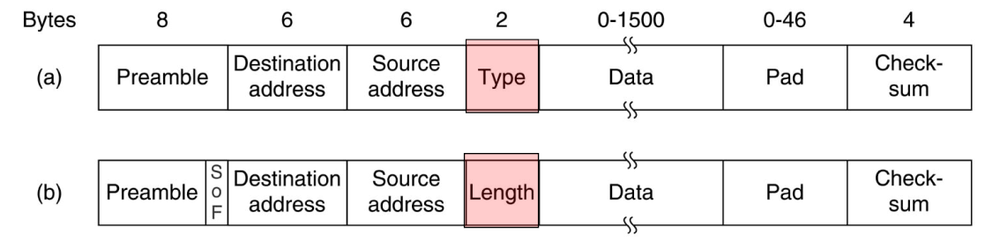

- preamble 前导码，内容是7个1101010和1个10101011，用来同步接收端、输出端的时钟信号，最后的11称为SOF（Start of Frame）
- addresses 目标/源地址，如果适配器收到了匹配目的地址的数据帧或者广播数据帧则将数据传输到网络层，否则直接丢弃。它总是由48位构成，有如下情况：
  - 第一位是0，是一个普通地址
  - 第一位是1，是一个组地址，组中所有站都要接收
  - 所有位是1，用作广播，被网络所有站所接收
- type 如果是ethernet，则指明更高层的层协议，一般是IP。而如果用802.3协议，这个字段表示帧长度。
- pad 要求帧的长度是64-1518B，如果不足64B则用此字段补足
- CRC 用于错误检测

以太网使用 1-persistent CSMA/CD。如果线路是空闲的，那么立即发送最大1500B的数据（此时帧大小1518B），并等待9.6$\mu s$；如果线路占用，就一直等待到空闲；如果发生碰撞，就停止等待并发送一个阻塞信号，然后等一会重新发送。

它使用了一种Exponential Backoff Algorithm（指数后退算法）。如果一个站发生碰撞，等待的随机时间是
$$
R = \text{random}(0, 2^{k-1}), \text{Waiting time} = R \cdot \text{slot time}
$$
其中，$k = \min(\text{retransmission time}, 10)$，$\text{slot time}$是传播延迟的2倍与阻塞队列的传输时间之和，对于以太网来说是$51.2\mu s$。如果连续16次发送失败，则放弃并向更高层报错。

以太网的最小帧大小是64字节。这是因为，如果时间过短，在传输完成后碰撞传回前就已经传送结束，因此传输延迟需要尽可能的高于2倍传播延迟。对于2500m、4个中继器的10Mbps LAN，发送一位需要100ns，500位可以保证工作，因此取大一些的512位即64字节。

这种模式下，它的吞吐率
$$
T = \frac{L}{t_p + t_{trans}} = \frac{L}{d/v + L/R}
$$
令
$$
\alpha = \frac{t_p}{t_{trans}} = \frac{d/v}{L/R} = \frac{Rd}{vL}
$$
则利用率
$$
U = \frac{t_{trans}}{t_{prop}+t_{trans}} = \frac{1}{1+\alpha}
$$

#### 不同种类的以太网

10Base\_T指的是10Mbps的以太网，T表示双绞线。节点通过一种星形的方式连接到一个集线器（hub）上，最远可以达到100m的距离。集线机用来把主机连接到以太网LAN上，也可能是连接多个以太网LAN上，这样可能会传播碰撞。但这种模式下，加入越来越多的基站就意味着碰撞的增加，最终网络会饱和。因此，解决方案是将网络分成一系列的子LAN，然后连接到一个高速交换机中。


交换机允许同时多个传输，交换机在等待同一个输出的时候会自动存储帧，每个端口相互独立，建立起自己的collision domain。这与集线器不同：只要两个帧同时到达，就会发生碰撞。

Layer 2 Switch（L2交换机）中，来的帧会发送到某个输出端，这样同一时间可以允许多个基站传输。这里有几种情况：

- Store-and-forward Switching，用输入线接收输入并放到缓冲区，然后路由到某个输出线
- Cut-through Switching，由于数据帧的前部有目的地址，检测到地址就直接进行切换，但这样可能会传输错误的帧，因为无法在重传前检测CRC
- Fragment Free Switching，是二者的hybrid，在转发前检查前64字节，如果少于64字节则认为是一个runt（一种无效帧类型）


Fast Ethernet（快速以太网）在802.3u标准中规定，如果是半双工下则使用IEEE 802.3，对于全双工则无冲突，不适用CSMA/CD。

Gigabit Ethernet（千兆以太网）在802.3{z,ab}规定，使用标准数据格式，允许点到点和广播信道，全双工点到点通信可以达到1Gbps。它有两种模式：

- Full-Duplex Mode（全双工模式），允许双方向同时运行、点到点通信，无需CSMA/CD
- Half-Deplex Mode（半双工模式），连接到一个集线器，允许碰撞，需要CSMA/CD

对于半双工模式，由于传输速率上升了100倍，为了保证原先的数据帧大小不变，就必须缩短传播时延，换言之需要把最大的传播距离从2500米变为25米。但这也太短了，所以在标准中引入了两个新特性来将25米扩充到200米：

- Carrier Extension（载波扩充），让硬件在普通帧后面继续添加填充位到512字节，但这样下降了线路效率
- Frame Bursting（帧猝发），允许多个帧级联传送，如果仍然不足512字节则继续进行扩充

### Wireless LAN

无线局域网使用无线电波作为载波。它使用的标准是IEEE 802.11，只对物理和访问控制进行了标准化。它有几个核心术语：

- Access Point（AP，接入点），是一个提供访问DS的基站
- Basic Service Set（BSS），是单个AP控制的一组基站
- Distribution System（DS），一个用来互联一组BSS的系统，建立ESS
- Extended Service Set（ESS），多个BSS通过DS互联得到的系统
- Portal，802.11网络和非802.11网络交会的一个逻辑实体

它的MAC层中，需要解决三个问题：

实现可靠的数据传输。可能会因为噪声、干涉和传播效应导致丢帧，因此需要一个使用ACK的帧交换协议，也可以增加可靠性使用四帧交换（RTS-CTS-data-ACK）实现访问控制。可以使用两种方案：

- Distribute Coordination Function（DCF，分布式协调功能），使用CSMA/CA，可能会产生冲突
- Point Coordination Function（PCF，点协调功能），使用中心化的控制方案，不可能产生冲突

之所以使用CSMA/CA，是因为以太网中只要64个字节正确发送没有噪声则一般会发送成功，而无线网中接收到的信号可能会弱得多，因此无法分辨。DCF和PCF往往是共存的，形成一个super frame：

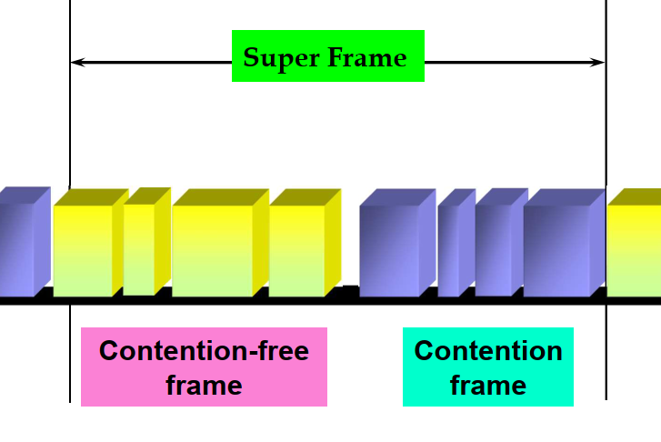

802.11数据帧结构如下：

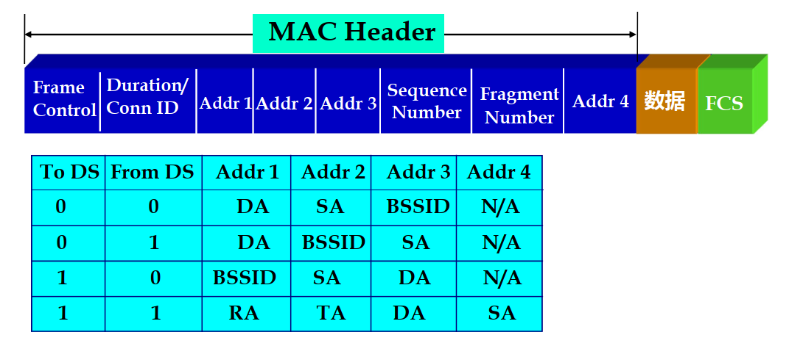

其中，BSSID指的是AP地址。

### LAN Interconnection

在局域网的互联中，存在很多设备：


不同的设备会选择不同的东西：

- 物理层，主要选择电信号，设备是Repeater和Hub，用来将不同的主机连接到以太网上，会传播碰撞。一个hub或者一系列hub构成一个collision domain，因此会导致很大吞吐量限制，同时无法支持多个局域网技术，没有缓冲区，对于距离和最大节点数都有限制。

  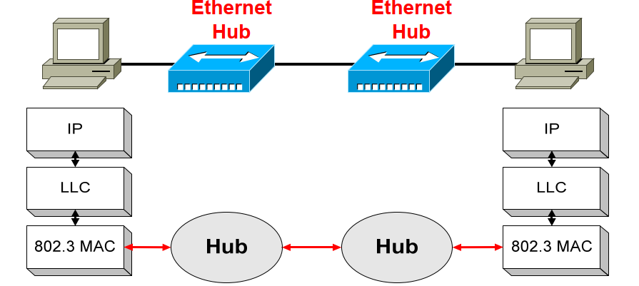

- 数据链路层，主要选择数据帧，设备是Bridge和Switch。Bridge将两个或多个局域网进行互联，然后在这些网络之间传输数据帧。它可以进行协议间转换，方法是对于MAC层的帧先转移到对应的LLC层然后再转换到另一种MAC层。

  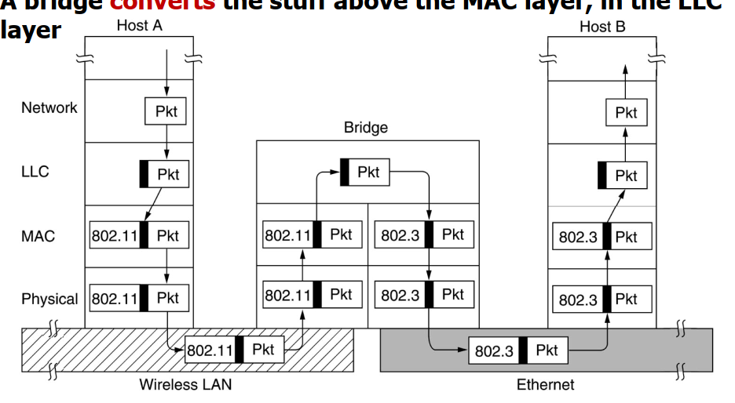

- 网络层，主要选择packet，设备是router。router连接多个子网，可以完成packet的转发、过滤、选择等操作。

  

- 传输层，主要选择信息，设备是gateway。它可以指代网络层的某种路由器，也可以指代一个设备将网络层的网络互联，并进行协议间的转换。

  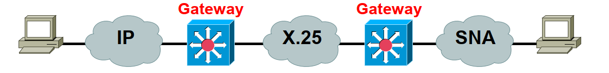

  

这里简单对比一下Router和BridgeSwitches：

| Router                           | Bridge/Switch          |
| -------------------------------- | ---------------------- |
| 每个主机的IP地址需要进行设置     | MAC地址是硬编码的      |
| 网络重新设置可能导致IP地址重分配 | 无需进行设置           |
| 通过RIP或OSPF实现路由            | 无需路由协议           |
| 操纵packet header                | Bridge不会对帧进行操纵 |
| 实现路由算法                     | 实现过滤和自学习算法   |

### LAN Switching

#### Bridges and Switches

网桥是一种连接两个或多个局域网的设备，可以接收并转发，是链路层上的一种连接设备，每个LAN有自己的collision domain。通过网桥连接的一个LAN的集合称为extended LAN。

网桥用来连接共享介质，所有端口都是双向的，有比较局限的大小，速度较慢，而且比较昂贵。链路层的交换机则连接主机或共享介质，有很多接口。

交换机会把子网分解成一些LAN片段，它对帧进行过滤：同一个局域网片段中的帧不会进行转发，这样片段构成 新的collision domain。比起Hub来说，它只转发需要的帧，扩展了网络的几何尺度，提高了隐私性，允许碰撞检测；但也导致了转发延迟，带来了更高的开销。

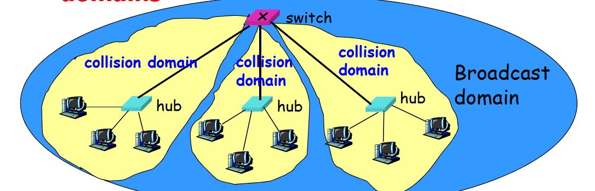

#### Self Learning and Spanning Tree

一个交换机有一张switch table，表中的表项有三个字段：

- MAC address，主机名或组地址
- port，端口号
- age，表项的存在时间

这样，我们可以构建出一种Self Learning的方法。

1. 当一个帧到达，检查source MAC address，然后将这一地址和到来的端口相关联并存在表中。用一个保存时间来遗忘掉这个映射。
2. 如果输出端口和输入端口一致，则进行舍弃（filter）
3. 如果输出端口在switch table中，则进行转发（forwarding）
4. 如果输出端口不在switch table中，那么将这个帧转发到所有端口（flooding）
5. 一旦确定了正确的映射关系，就放在表中。（learning）


但是这种方法可能会导致forwarding loop：


为此，我们引入Spanning Tree（生成树）。IEEE 802.1d给出了一种在动态环境下建立和维护生成树的方案，桥和交换机称为transparent bridges，它交换BPDU（Bridge Protocol Data Unit）来设置桥以建立树。此时，桥进行的工作包括

1. 选择一个单一桥作为根桥（root bridge）
2. 计算到根桥的最短路
3. 每个桥决定一个根端口（root port），这个端口有到根的最短路
4. 每个局域网决定一个指定端口（designated port），将数据包转发到根桥
5. 选择在生成树中的端口

这里的桥是完全透明的，它用来转发数据帧、学习到地址和进行生成树计算。每个桥有一个bridge ID，其结构如下：


下面是生成树的一个例子：

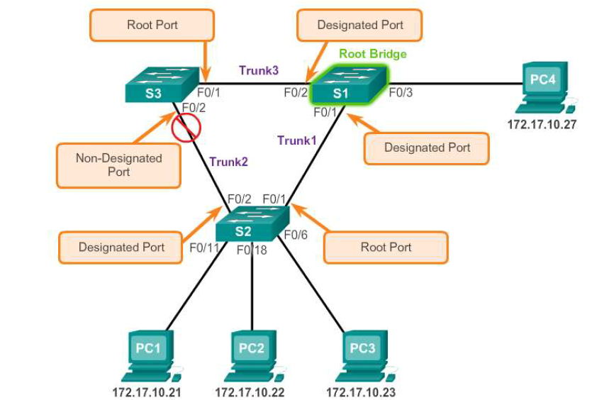

可以看到，整个结构有一个根桥，每个桥有一个根端口，每个连线有一个指定端口。非指定端口可能有很多，但都会作为被丢弃的端口。其建立过程如下：

1. 选择有最小BID的网桥作为root bridge
2. 选择和root bridge直接连接，距离最小的网桥作为root port
3. 根据root port选择designated port

### VLAN

VLAN指的是Virtual Local Area Network。它通过软件而不是硬件来设置LAN，使得局域网不再受到物理空间的限制。例如，下面的图就可以这样安排：

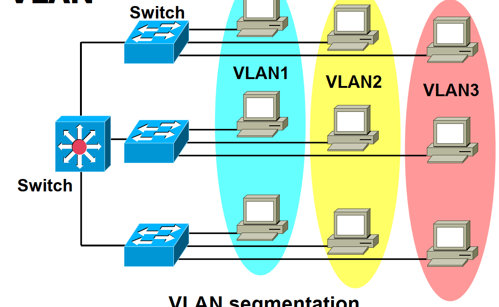

它可以把广播分成不同的域，这样不相关的组不会受到影响；它安全性更好，同时也容易进行管理。此时，每个VLAN是一个广播域，通过一个或多个交换机来控制。

VLAN有很多类型，如基于端口的、协议的、MAC层的、网络层的、多广播的等，其中最常用的是基于接口的VLAN。每个交换机中的端口独立分配，形成一个组。

一个trunk是以太网交换接口和其它设备之间的点对点连接，可以通过单条连接线承载多个VLAN的通信。

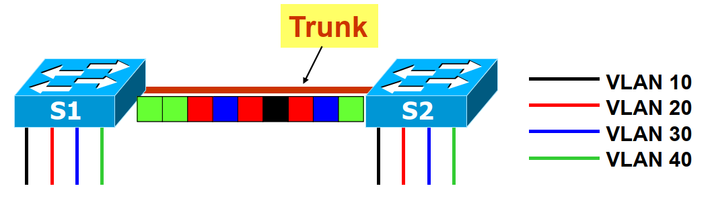

为了区分究竟是哪个VLAN的通信，引入VLAN Tagging，具体来说有Inter-Switch Link（ISL）和IEEE 802.1Q。后者的结构如下所示：


交换机会把tag自动的插入到数据帧中，而在数据传送到主机的之前需要由交换机移除，这样保证VLAN tag对主机透明。

VTP是VLAN Trunk Protocol的简称，VTP减少了管理和检测VLAN网络的复杂性，维护了VLAN设置的一致性，允许在混合介质中通信，给出了精确查找和检测的方式。

## Network Layer

### Introduction

网络层处于这样的结构中：


它主要由两类服务组成：

- connection oriented services 面向连接的服务 即 virtual circuit service 虚拟电路服务
  - 建立连接
  - 在同一条路径中发送一个又一个数据包
  - 关闭连接
- connectionless services 无连接服务，即datagram service 数据报文服务
  - 独立对待每个数据包
  - 数据包可能也可能不在同一条路径中发送

如果建立的是一个虚拟电路，那么会有从源到目的的一条路径，其中的每条线路有一个VCid，作为一个VC table的表项存在每一个路由器中。因此，路由器维护了连接的状态信息。

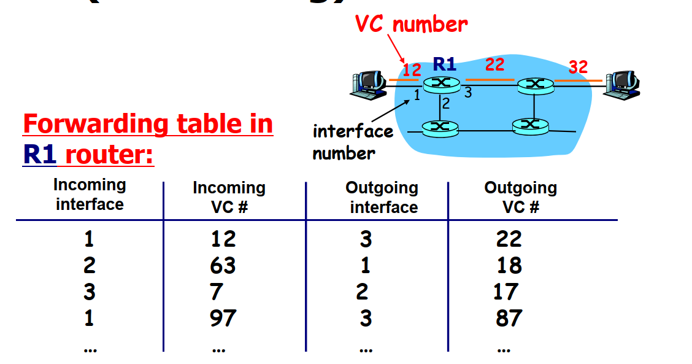

如果使用的是数据报文，那么每个数据包和其它相互独立，可能不按顺序到达。它使用源和目的地址的方式来路由，无需连接建立和VCid。

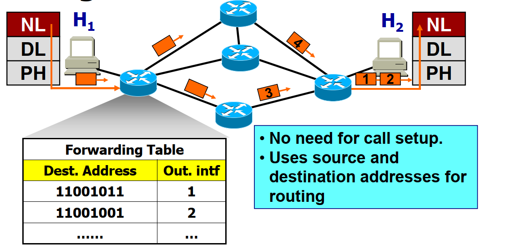

这里的转发表使用最长前缀匹配的方式，根据报文中的信息转发到某个端口中，这也是本章的重点方式。

### Routing Algorithm

首先要明确两个概念：

- forwarding：将数据包从路由器的输入移动到适当的路由器输出
- routing：决定从源到目的的路径

网络层的一个重要功能就是对于一个节点，确定数据包将要发送到哪个线路上，完成这个功能的就是routing algorithm，同时还会建立一张routing table来维护路由关系。

路由的等级有两种：

- non-adaptive routing（static routing），预计算路由情况，不依赖于当前的网络拓扑
- adaptive routing（dynamic routing），动态计算路由情况，依赖于当前的网络拓扑，它有三个特点：
  1. centralized，一个节点计算一张路由表
  2. isolated，不与其它节点交换信息
  3. distributed，节点自行交换信息和决定路由

现在我们把网络抽象成一个图，路由器代表一个节点，链路代表边，其权值可以是1，也可以根据带宽或拥塞来控制。那么路由算法的目的就是找到最短路。同时，从源到某个特定地址的最短路形成一个树，我们称为sink tree。


#### Static Algorithms

对于静态算法，有三种：shortest path routing、flooding和flow based routing

最短路算法可以使用Dijkstra。其过程我们在其它课程已经学过，这里不多赘述。

flooding则是将每一个输入的数据包转发到其它所有线路中。我们可以记录一个counter来标志flooding方法的结束，也可以记录某个包是否已经访问过。它会带来大量的冗余数据，同时可能会出现环。它一般用于广播，也可能用在军方应用中，因为某些路由器可能会被破坏。

#### Dynamic Algorithms

对于动态算法，也有三种：Distance Vector Routing、Link State Routing和Hierarchical Routing。

（1）Distance Vector

每个节点周期性发送自己到邻居的距离矢量，当某一个节点$x$接收到新的距离矢量估计的时候，使用下面的规则
$$
D_x(y) = \min_v \{c(x,v) + D_v(y)\}
$$
其中，$d_x(y)$表示从x到目的地的最短距离，$\min_v$表示从所有邻居$v$中迭代，$c(x,v)$表示从x到v之间的距离。因此，它是迭代式，同时异步的，也是分布式的。


使用DV方法有一个问题，我们称之为count-to-infinity。考虑如果x和y和z两两相邻：

1. $t_0$时刻，y监测到link cost change，更新了它的DV，通知了邻居
2. $t_1$时刻，z接收到了来自y的更新，会计算新的最小值，并送到邻居
3. $t_2$时刻，y接收到了来自z的更新，会计算新的最小值

这个过程一般不会有什么问题，但是考虑下面的这种情形：xy之间的距离突变成60，

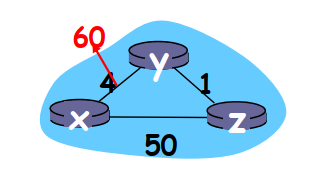

我们来考虑它的情况：

- Y认为到Z的最近距离是5，所以到X的最佳距离是6
- Z认为到Y的最近距离是6，所以到X的最大距离是7
- ……

这个过程会一直持续到更新到正确的距离，但需要漫长的过程。对此，我们引入Poisoned reverse：如果Z通过Y到达X，Z会将此路由通知Y，但将距离设为无穷大。这种方法可以一定程度上避免count-to-infinity。

（2）Link State Routing

每个router需要做如下功能：

- 寻找邻居及其地址，此时对临近路由器点对点发送一个HELLO包，目标节点会回复一个地址
- 测量到每个邻居的时延，此时发送一个ECHO包，接收到的节点需要立即回复一个ECHO包。这样，我们可以计算到RTT、Traffic Load、Line Bandwidth
- 建立一个packet来维护链路状态。这个包包括发送者的ID、序列号、Age、邻居列表、以及相关的Delay。
- 将这个packet发送给其它router。这里用的是reliable flooding，每个router都维护一个(source, seq, age)的列表，然后根据某些条件更新。
- 计算到每个其它router的最短路。这里每个节点局部使用Dijkstra算法进行计算。

这样，每个router维护了整个网络的拓扑结构，将它的连接性泛洪到整个网络中。

（3）Hierarchical Routing

随着网络数量的增加，扁平化的网络中需要维护过于大的路由表。因此，我们可以考虑建立一个层次结构，根据地域将路由器进行划分，形成层次化结构。

### Congestion Control Algorithm

当过多的数据包在网络中发送的时候，会导致严重的性能问题。引发拥塞的原因是我们存在某些瓶颈段，IP只从某个端口进入，在达到最大带宽的时候会有大量分组被丢弃，平均时延变成无穷大。

大体来说，拥塞控制分成两类：

- End-end congestion control，这是一种开环控制的思路，比如TCP
- Network-assisted congestion control，router给end反馈，是闭环系统，比如TCP-ECN

如果按照控制方式，也可以分成两类：

- Rate-based，控制数据传输率来进行拥塞控制，比如ATM
- Window-based，控制窗口大小来进行拥塞控制，比如TCP

对于闭环系统的拥塞控制，需要检测系统来检测是否发生拥塞，然后向可以采取措施的地方传递信息，并调整系统操作来解决问题。

### IP

#### IP Datagram

首先来介绍IP datagram的格式：


- ver 指代版本号
- header length 指代首部长度，最大为60B（15x4B），常见的是20B
- length 指代首部和数据之和的长度
- fragment offset。网络连接有不同的MTU（max transfer size），大的IP报文会分成很多fragment，只在终点reassemble
- identifier 不同的datagram有不同的identifier，但是不同fragment的identifier相同
- flgs 最低位MF=1表示有分片，MF=0表示最后一个分片；中间位DF=0表示允许分片
- fragment offset 某个分片在原分组的相对位置，以8字节为偏移单位
- time to live(TTL) datagram在网络中可通过的路由器数量最大值，每次转发分组让TTL-1，当TTL=0则需要丢弃
- upper layer 表示分组携带数据表示的传输层协议，6表示TCP，17表示UDP
- checksum 只校验首部的数据校验和

#### IP Addressing

IP地址是32位的主机标识符。它本身是二进制的，通过点区分成十进制表示。它有几个比较重要的点：

- Classful Addressing 有类寻址
- Subnetting 子网
- Classless Addressing 无类寻址
- NAT Network Address Translation

（1）有类寻址

这种模式下，把地址空间分成五类：


这样的好处在于，我们可以根据大小和需要来区分网络。这里有几种特殊的IP地址：

| NetID | HostID | Src address | Dest address | Meaning              |
| ----- | ------ | ----------- | ------------ | -------------------- |
| 0     | 0      | Yes         | No           | 本机                 |
| 0     | any    | Yes         | No           | 当前网络上的一个主机 |
| All 1 | All 1  | No          | Yes          | 当前网络上的所有主机 |
| any   | All 1  | No          | Yes          | 所有netID的主机      |
| 127   | 0      | Yes         | Yes          | Loop test address    |

（2）Subnetting

如果按照之前的等级划分的方式，每个组织可能需要多个子网的时候，就需要占用多个等级网络。但是如果我们把一个网络划分成子网就回避了这个问题。

具体来说，此时我们把地址细分出来一个subnetid：


这里要注意的是，两个相邻的路由器之间也是一个子网。下图就有6个子网：


子网需要一个子网掩码，在某个网络之外的路由器需要的是网络地址，而某个网络之中的路由器需要的子网地址。我们把net和subnet两部分的id的mask对应位设置成1，形成的就是子网掩码：

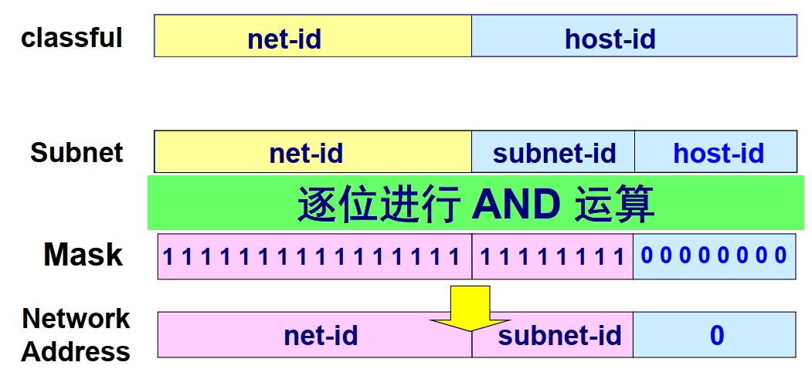

可以发现，默认情况下的ABC类地址如下：


> 如果IP address是141.14.72.24，mask=255.255.192.0，求网络地址。
>
> 72=01001000，mask的前两位是11000000，二者进行and，得到01000000，所以网络地址是141.14.64.0

下面我们讨论在有子网掩码的时候，如何使用子网进行数据转发假设路由表的格式是三元组`<Subnet, Mask, Nexthop>`。假设D是目标IP地址，可能出现三种情况：

- 如果Mask & D是子网，并且路由表中的下一跳是一个网络接口，那么就直接把数据转发到D上
- 如果Mask & D是子网，并且路由表的下一跳是一个路由器，那么就把数据转发到下一个路由器上
- 如果均不匹配，则转发到默认路由器上

（3）CIDR（Classless InterDomain Routing）

传统的IPV4分类以非常快的速度消耗地址，存在严重的浪费现象。如果使用CIDR，子网会划分成任意长度的。我们用a.b.c.d/x的形式来表示，x表示子网部分的位数。这样，我们可以用几个C类地址聚合成一个更大的地址块，这样的网络我们称为supernetwok，这种聚合为supernetting。

> 如果一个IPV4地址是167.199.170.82/27，找到它表示的第一个地址。
>
> 

如果使用了CIDR，我们可以把许多转发到同一子网的数据聚合成一个表项，这就是route aggretion。例如:


这样可以有效减少路由表的数据量。这里还有一个问题，就是聚集操作必须是对2的幂进行的，此时我们可以使用Longest Matching的策略，在多项路由表中有限匹配最长的。考虑下面的例子：

> D = 206.0.71.130，路由表中有206.0.68.0/22和206.0.71.128/25，二者都可以和D匹配。此时，我们优先选更具体的206.0.71.128/25.

我们可以把路由表编制到一种层次结构中，加速查找效率。可以看到，CIDR提高了网络的灵活性。

（4）NAT

NAT是一种对即将用尽的IP地址的解决方案，它为每个组织分配一个独立的IP地址，而组织内的主机有一个独立的IP地址，用于内部寻址。一般的，我们有三个域的IP地址来让这种模式合理：

- 10.0.0.0-10.255.255.255/8 
- 172.16.0.0-172.31.255.255/12
- 192.168.0.0-192.168.255.255/16

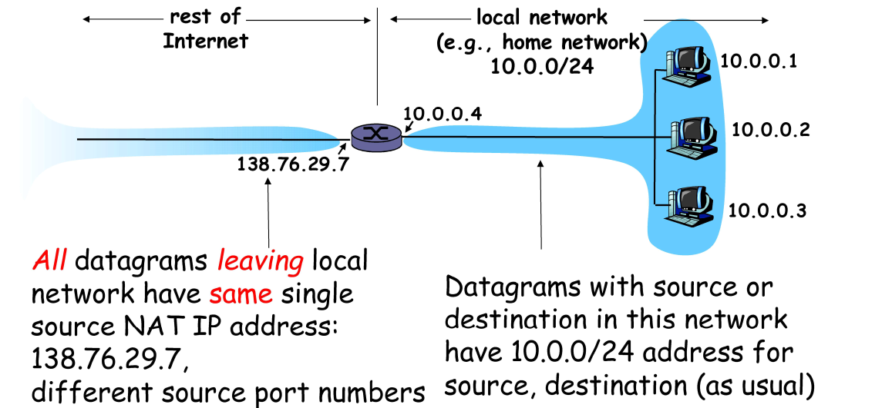

具体到实现上：

1. 对于向外的数据报，将(source IP addr, port)转换为 (NAT IP addr, new port)，远程C/S则会根据这一新的地址进行回应
2. 在一个NAT translation table中记录这样的变换对
3. 对于进入的数据报，将(NAT IP addr, new port)转换为 (source IP addr, port)

NAT不需要额外分配IP，并且隐藏了内网信息。

#### IP packet routing and forwarding

IP forwarding也称为Internet routing，是决定IP包或者报文需要转发给哪个路径的过程。它分成direct delivery和indirect delivery两类。

- direct delivery，IP node通过一个直接连接的网络转发一个数据包到dest
- indirect delivery，IP node将数据包发到一个中继节点，一个ip router

它包含两个独立过程：

- forwarding：如何将一个数据包从输入端口发送到输出端口。具体来说，可以根据目的地址和标签进行转发。

- routing：如何建立路由表。需要一个有路由表的主机或者路由器，并在表中查找。但由于目前的网络数量过于庞大，难以维护整个表，所以我们需要对路由表进行设计。

  1. next-hop routing，只维护到下一跳的路由信息
  2. network-specific routing，所有网络中的主机共用一个hop来定义网络本身
  3. host specific routing，每一个host都有自己的entry

  此外，我们还需要一个default routing，一般为0.0.0.0/0

下面是一个框图：


> 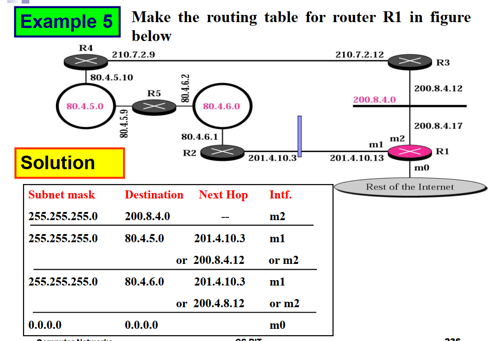

### ARP and ICMP

#### ICMP

ICMP（Internet Control Message Protocol）用来联系主机和路由器的IP状态与差错信息。它在主机之间通过IP对信息进行路由，数据报文如下：

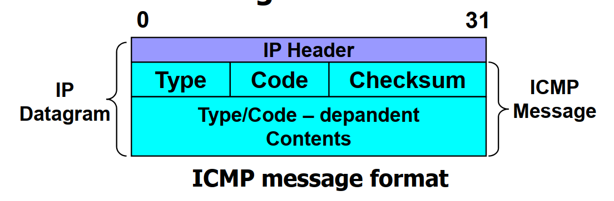

Type维护了ICMP中可能出现的一系列错误，Codes描述了信息为什么会被发出，Checksum用于校验，Contents则是payload。下面介绍几种常见的情形。

- Destination Unreachable，Type=3，此时又有很多的Codes描述具体情况。如果遇到这一类问题，会发送到原始的主机。
- Source Quench，Type = 4，Code = 0。当路由器或主机产生拥塞，就向源点发送抑制报文。
- Redirect，Type=5，Code有0、1、2、4，路由器告诉主机数据报文需要转发到其它间接到达的路由器上
- Echo，Type=8 / Echo Reply，Type=0，用来判断一个host是不是可达
- Time Exceeded，Type=11，Code=0表示TTL到期，Code=1表示分片重组超时

#### ARP

ARP（Address Resolution Protocol）和RARP起到了IP地址和MAC地址的动态转换作用。每个IP节点(Host, Router)都有一个ARP Table，存储`<IP addr, MAC addr, TTL>`。它的过程如下：

- 某个路由器广播，询问IP地址对应的MAC地址
- 对应的路由器收到ARP请求，单播对应的MAC地址

下面是ARP的报文格式：


这里需要区分两种情况：

1. 如果IP地址位于同一个子网，那么可以直接进行转发
2. 如果IP地址位于不同子网，需要通过默认网关，也就是路由器来进行转发

> 
>
> 解：
>
> 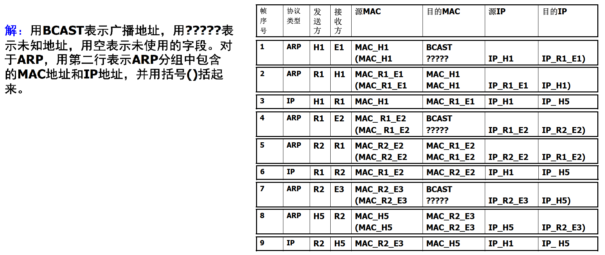

### RIP, OSPF and BGP

#### Autonomouse System

一个Global Internet由许多的Autonomouse System（AS，自治系统）组成。自治系统指的是在单个管理员之下的一组网络和路由器，它可以分成两类：

- Intra-AS，对应interior routing，也称Interior Gateway Protocols（IGP），包括RIP、OSPF、IGRP等
- Inter-AS，对应exterior routing，也称External Gateway Protocol（EGP），包括BGP-4等

#### RIP

RIP基于DV方法，用hop描述距离。下面是一个例子：


RIP的路由表通过应用层协议routd-d来完成，使用的是周期发送的UDP包。它30s传输一次信息，如果180s没有收到则说明邻居已经死亡。

#### OSPF

OSPF（Open Shortest Path First）使用的算法是Link State Algorithm。比起RIP来说，它有几个优势：

- Security，每个OSPF信息都需要鉴权，使用了TCP连接
- Multiple same-cost paths allowed，这样有助于达成负载均衡
- 可以根据不同服务类型计算不同路由，比较灵活
- Integrated uni- and multicast support
- 在更大的领域支持层次化
- 支持IP tunneling

层次化的OSPF使用的是2层的层次结构，分成本地和主干（back bone）。Backbone router局限在本地进行路由，Boundary router连接到其它AS。

OSPF信息有五种：

| Message type         | Description            |
| -------------------- | ---------------------- |
| Hello                | 用来发现邻居           |
| Link state update    | 向邻居发送链路状态信息 |
| Link state ACK       | 告知收到了链路状态更新 |
| Database description | 通知发送者有哪些更新   |
| Link state request   | 对链路更新分组的确认   |

#### BGP

BGP（Border Gateway Protocol）提供每个AS信息：

- 从邻居获得子网的可达性信息
- 向内部路由器传播子网的可达性信息
- 根据可达性信息和策略决定好的路由

它使用的是Path Vector协议。每个边缘网关向自己的邻居广播它到目的地的完整路径，例如对于网关X可能会广播它到Z的路径：Path(X,Z) = X,Y1,Y2,...,Z

一对路由器我们称为BGP Peers，通过半永久的TCP连接交换路由信息，我们称之为BGP Sessions。考虑下面的图：


当3a和1c之间的eBGP session建立，AS3将前缀的可达性信息发送到AS1；1c用iBGP来分发新的前缀，告知AS1中的所有路由器；1b通过eBGP将新的可达性信息通知AS2。当router学习到新的前缀之后，就在转发表创建一个表项。

很多时候BGP有自己的路由策略。假设ABC是网络服务提供商，XYW是网络服务使用者：


对于X来说，X连接到两个网络（dual-homed），X不希望B和C之间的通路通过自己，所以X不会告知B自己有到C的通路；对于B来说，B不希望C到w之间的通路通过自己，所以B不会告知C有一条通路BAW，也就是B只希望自己的服务是给自己客户提供。

BGP的Message有4种：

1. OPEN，向伙伴打开TCP连接，并进行鉴权
2. UPDATE，通知一个新的路径或撤销旧的路径
3. KEEPALIVE，可以用来对OPEN报文ACK，也需要周期发送来保证存活
4. NOTIFICATION，用来报告差错和关闭连接

最后，我们用一张表来对比几种协议：

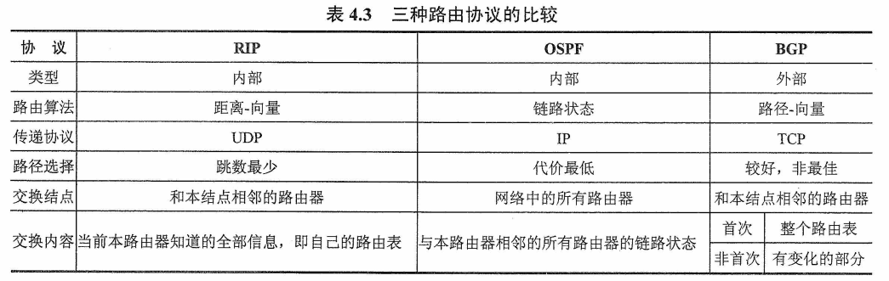

### IPv6

IPv6是IPv4的继任者，1994年完成了标准制定。IPv4存在几个不足：

- 数量不足，地址马上要用完了
- QoS（服务质量）
- 安全性

对此，有很多努力，但是无论哪种都无法解决数量上的问题。为此，IPv6将IP地址升到128位、16字节。

IPv6报头格式如下：

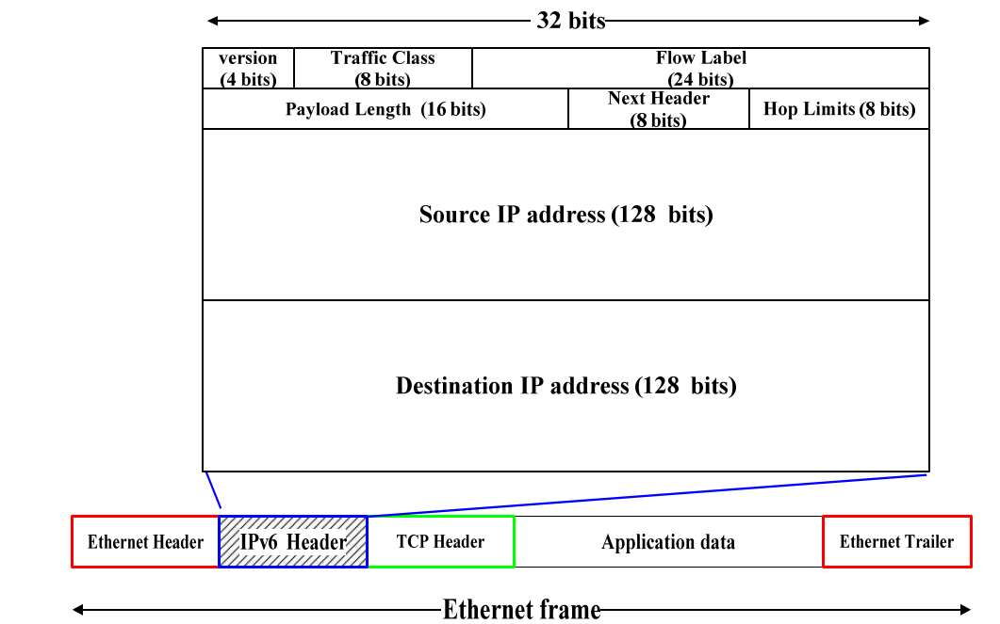

IPv6非常有特色的是Next Header字段。它指明了当前头之后还有哪种扩展头，可以提供一些额外信息。例如，hop-by-hop头存放了路由器需要检查的字段。从一般意义上来说，它不允许分片，只有在包的源节点才能进行分片操作，而不能和IPv4一样对路由进行分片。

128位的IPv6地址一般写成8个16位二进制，使用十六进制表示。如果某个段全是0，则可以把4个0合成1个；如果有连续多个0，则简写成::。它同时也可以用CIDR的斜杠表示。

> 对于60位的前缀12AB00000000CD30，可以写成12AB::CD30:0:0:0:0/60，也可以写成12AB:0:0:CD30::/60

IPv4需要向IPv6过渡。对此，有两种策略：

1. Dual Stack 双协议栈，一台设备上同时有IPv4和IPv6协议栈，在不同协议上配置IPv4和IPv6地址
2. Tunneling 隧道，在IPv6报文外边包一层IPv4报文

### IP Multicasting

一般来说，有三种传输模式：

- 1-1，unicast 单播
- 1-ALL，broadcast 广播
- 1-subset of all，multicast 组播

组播指的是通过一次传输操作把数据报送到多个接收方。在传统的分类IPv4地址中，D类用于IP组播。常见的组有：

1. 224.0.0.1 表示一个LAN的所有系统
2. 224.0.0.2 表示一个LAN的所有router
3. 224.0.0.5 表示一个LAN的所有OSPF router
4. 224.0.0.6 表示一个LAN的所有特定OSPF router

接下来我们讨论硬件组播。当packets到达了last hop router，需要将数据包通过MAC地址送到局域网中的一些主机。

在局域网中，组播地址是01-00-5E-00-00-00到01-00-5E-7F-FF-FF，也就是只有后23位可以用来组播。在组播的时候，D类IP地址的后23位和MAC地址的后23位相同：


最终收到组播数据报的主机在IP层根据IP组播地址过滤，把不是本主机接受的组播数据丢弃。

> 224.215.145.230应该映射到的MAC地址是多少？
>
> 215.145.230的二进制是01010111.10010001.11100110，对应51-91-E6。所以得到的MAC地址是01-00-5E-57-91-E6.

IGMP（Internet Group Management Protocol，因特网组管理协议）在一个特定的局域网上动态注册独立主机。它包含两个步骤：

1. 当某台主机加入新的组播组，该主机向组播地址发送IGMP报文，本地组播路由收到之后将其转发给其它组播路由，这种信息称为Membership Report
2. 本地组播路由器周期性探寻本地局域网的主机，只要组内有一台主机响应则认为组是活跃的；如果多次探寻之后没有主机响应，则不再转发成员关系，这种信息称为Membership query

可以发现，IGMP只用于通知本地局域网上的组播路由器LAN中是否有主机参加或退出某个组。它不维护组的成员数，也不维护这些成员的分布。

### Mobile IP

移动设备可能从一个网络移动到另一个网络，那么如何将数据包发送给移动节点呢？有两种策略：

1. indirect routing，通过一个home agent，然后再转发到远处。移动设备有一个permanent address，它是通信者的目标地址；还有一个care-of-address，是home agent转发到的地址。这种方式下具体来说有几个步骤：

   1. 通信者发送数据包到移动设备的home address，这个是手机归属网络的永久地址
   2. home agent将它转发到foreign agent
   3. foreign agent接收数据包，并转发到移动设备
   4. 移动设备直接回应进行通信

   可以看到，这种模式下，呈现一种三角形的路径，我们称之为triangle routing。它导致通信效率大大降低。

   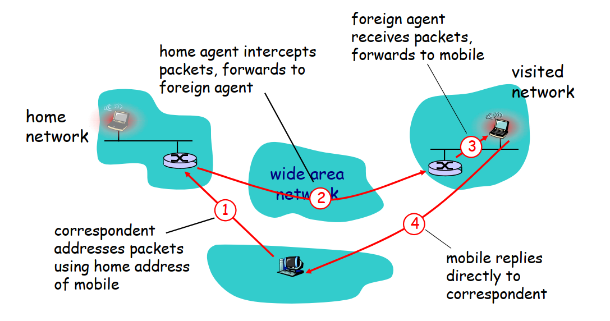

2. direct routing，获取到手机的foreign address，并直接发送到手机。它有几个步骤：

   1. 通信者向home network请求
   2. home netwok回复一个foreign address
   3. 通信者直接将数据转发到foreign agent
   4. foreign agent接收到数据之后，将其转发到移动设备
   5. 移动设备直接与通信者进行通信

   这种方式解决了triangle routing，但同时care-of-address对通信者也不再透明。

   

## Transport Layer

### Introduction

传输层连接了面向用户功能的层和面向通信部分的层。它对端对端通信负责，支持两个进程之间的逻辑通信。它包含两类：

- Connection-oriented Services
- Unreliable Connectionless Services

下面我们介绍传输层协议用到的元素。

- 地址：TSAP（transport services access point，传输服务访问点），形成端口。它需要转换到NSAP（网络服务访问点，比如IP）。我们需要一个portmapper（端口映射器），把不同端口和功能进行绑定。同时，如果一直保持监听可能会带来比较大的开销。可以考虑建立一个初始连接协议（initial connection protocol），使用一个代理来唤醒。
- 连接建立：可能出现重复请求。例如，请求A还没有到达的时候还以为已经过期，重发的数据先于它自己到达。为此，我们需要添加一个限制来杀死过时但是还在网络中的数据包。Tomlinson提出了一种思路，它的基本做法是，两个相同编号的TPDU不会在同一时间出现，所以源用序号作为段标签，然后让段在Ts内不再重用。每台主机都配备一台时钟，相互之间不需要同步，在崩溃之后就形成一个Ts时长的forbidden region。
- 无错误连接建立：还有一个问题，我们不能判断请求连接段是否是真的请求连接，而不是重发的数据段，为此可以引入三次握手（three-way handshake）。主机1选择序号x，发送CONNECTION REQUEST，主机2回应ACK，并宣告序号y，然后主机1对y进行确认。
- 连接释放：Connection Release，分成Symmetric和Asymmetric两类。
  - Symmetric方式存在一个two-army-problem，也就是需要一个达成协议来释放。实际上，这样的协议是不存在的，因为连接总是不可靠的。
  - Asymmetric方式由双方之间的一方来决定，并增设一个计时器。正常情况下，A通过三次握手和B断开连接，A先发送一个Disconnection Request，B收到之后发回Disconnection Request，然后A发送一个ACK。如果ACK丢失，B可以在计时器到之后自行断开；如果第二个DR丢失，则A会再次尝试释放连接。
- 流量控制：发送端发送速率过快，可能导致接收端缓冲区溢出。对此可以使用dynamic buffer allocation sheme，发送端和接收端协商可以在序列中传输的TPDU数。低带宽的突发传输可能可以给出比较小的缓冲区，而平滑的高带宽则需要比较大的缓冲区。一般来说，window size可以取c\*r，其中c是每秒网络处理多少个TPDU，r是每个数据包的时钟周期
- 多路复用：上行的时候减少网络连接来降低代价，下行的时候增大带宽来避免连接极限
- 崩溃恢复：第N层的崩溃只能由N+1层以上的层来维护足够的状态信息

### Simple Transport Protocol

服务端的几个原语：

- LISTEN，调用者希望接收到连接
- CONNECT，试图建立连接
- SEND，传输一个buffer
- RECEIVE，调用者希望接收信息
- DISCONNECT，关闭连接

这样，我们可以构建出来这样一张状态图：


没什么用。

### UDP与TCP的对比

Internet的传输层支持TCP和UDP，对比如下：

|            | User Datagram Protocol                   | Transmission Control Protocol |
| ---------- | ---------------------------------------- | ----------------------------- |
| oriented   | datagram oriented                        | byte stream oriented          |
| reliable   | unreliable, connectionless, simple       | reliable, connection oriented |
| multicast  | unicast and multicast                    | only unicast                  |
| usage      | a few applications and a lot of services | most Internet applications    |
| efficiency | high                                     | low                           |

端口号是一个16位整数，IANA（Internet Assigned Numbers Authority互联网地址指派机构）维护了一个端口号分配的列表。

客户端的Socket地址定义了一个客户端进程，服务端的Socket地址定义了服务端的进程。TCP的socket pair是一个四元组：

```
<Local IP address, Local port, Remote IP address, Remote port>
```

在socket下，需要定义multiplexing和demultiplexing的定义：


### UDP

UDP有8bytes的数据头，它的格式如下：


这里的Checksum是所有的16位数之和的反码，这样可以保证所有数加起来是0xFFFF.同时，在计算时，我们还需要加入伪首部，这部分不会被发送，但是需要用在校验之中：


UDP的数据报格式不宜过长，否则会导致IP对其进行分片。

> UDP数据报8192B，使用Ethernet传送，应该划分多少IP数据报片？并给出每个IP数据报片的数据字段长度。
>
> 解：UDP有8B数据头，则共8200B数据。所以会分成6段，前5段IP报片1500B，其中数据长度1480B；第6段报片820B，其中数据长度800B.

### TCP

#### TCP服务与报文

TCP有几个服务：

1. Process-to-Process Communication
2. Multiplexing and Demultiplexing
3. Connection-Oriented Service
4. Byte Stream Delivery Service
5. Reliable, in-order Delivery Service
6. Full-Duplex Communication

在TCP中，一个Endpoint通过一个socket定义，有(ip, port)的形式。一个主机用四元组来定义消息片，这是因为许多连接会发送到同一个端口上，这样才能有效区分。因此，在demux的时候，需要用不同的socket来处理不同IP对同一端口的请求。

下面我们介绍TCP的报文格式：


- sequence number：TCP使用了数据流，每个segment都有一个序列号，它是32位的。它的标号从一个随机生成的数字开始，定义了当前segment的第一个数据字节。在ack field中，这里定义了下一个希望收到的byte。

- control field，包括

  - URG: Urgent pointer is valid
  - ACK: Acknowledgment is valid
  - PSH: Request for push
  - RST: Reset the connection
  - SYN: Synchronize sequence numbers
  - FIN: Terminate the connection

- checksum，仍然需要补足前面的伪头部：

  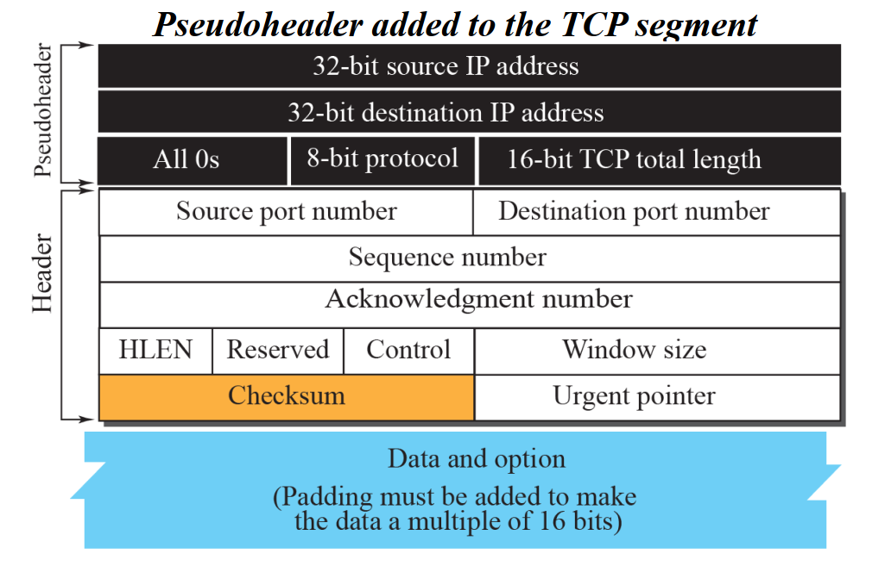

#### TCP的传输过程

下面我们分析TCP的具体传输过程。

（1）传输建立阶段

在传输建立阶段，我们使用three-way handshaking：

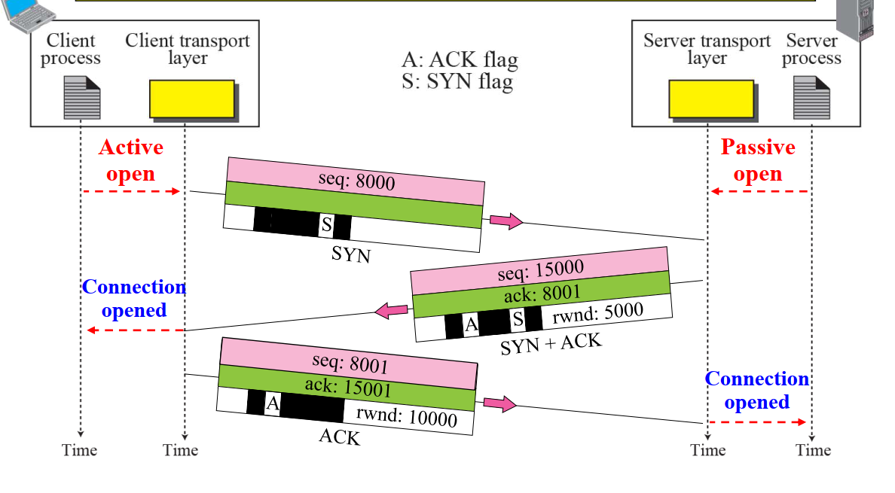

这里要注意几点：

- SYN段不会承载数据，但是会让序列号+1
- SYN+ACK段不会承载数据，但是会让序列号+1
- ACK段如果不承载数据，那么不会让序列号变化

（2）传输结束阶段

在传输终止阶段，我们使用four-way handshaking：


这里同样注意：

- FIN段即便不承载数据，也会让序列号+1
- FIN ACK段即便不承载数据，也会让序列号+1

同时，我们还需要引入2MSL的超时基制。这是因为：

- 如果ACK丢失，收到了一个新的FIN，那么需要重发ACK并重启定时器
- 为了防止重复片段导致的问题，需要在超市之后再断掉连接

这里的MSL是Maximum Segment Lifetime。

（3）连接重置

如果连接请求到达了，并且没有server process在目标端口等待；此外，如果强制终止一个连接，会导致接收端丢失掉缓存数据，而无法ACK。

#### 可靠数据流传输服务

实现可靠传输有赖于三种关键技术：

- Error Control ，recover or conceal the effects from packet loss
- Flow Control, prevent the sender overruns the receiver
- Congestion Control, prevent the sender overloads the network  

在TCP中，使用checksum做差错校验，sequence number来检测序列错误，Acknowledgement来防止丢包，Timout来检测丢包，Retransmission来错误矫正。ACK常常被一个数据段来捎带确认（piggybacked），包含在TCP头中。三种技术中，都需要用到ACK。

一个ACK用来保证的是，所有比当前序列号更小的信息都传输正确。同时，ACK本身是没有重传timer的。这里，我们讨论几种情况：

- packet loss，此时接收端不会发送ACK，所以timeout之后sender进行重发
- ACK loss，此时发送端到时间自动重发，receiver discard重复packet之后返回一个相同的ACK
- ACK delayed，receiver的ACK在sender timeout之后才到达，此时receiver会discard一个重发的数据包，sender会discard一个重发的ACK

那么超时时间如何设置呢？一般来说，这个时间需要高于RTT；但RTT本身是可变的。对此，我们采用一种策略来进行估计：
$$
\text{EstimatedRTT} = (1-\alpha) \cdot \text{EstimatedRTT} + \alpha \cdot \text{SampleRTT}
$$
其中，SampleRTT是从数据传输到收到ACK的整个时长。一般，我们取$\alpha = 0.125$。在此之上，我们需要加上一个安全域：
$$
\text{DevRTT} = (1-\beta) \cdot \text{DevRTT} + \beta \cdot |\text{SampleRTT} - \text{EstimatedRTT}|
$$
一般的，我们取$\beta = 0.25$。最终，得到的Timeout时长
$$
\text{Timeout} = \text{EstimatedRTT} + 4\cdot \text{DevRTT}
$$

#### 流量控制

我们在链路层介绍过流量控制的相关内容，TCP使用的就是Sliding Window。但它的缓冲区是动态变化的，所以这里的窗口需要特殊控制。它的核心功能是，告诉另一侧有多少bytes是能够接受的，这样可以保证发送方不会overflow receiver buffer。

在每一个方向上，TCP都有一个send window和一个receive window，也就是在全双工的双向上有四个window。具体来说，sender window有四种状态：

- Sliding sender window，此时接收方处理数据和接收数据速度相同
- Expanding sender window，此时接收方处理数据比接收数据快
- Shrinking sender window，此时接收方处理数据比接收数据慢
- Closing sender window，此时接收方传输一个大小为0的window size

每个ACK都包括了一个window advisement，表示receiver希望接收多少字节。发送者根据receiver的建议来增加或减少发送方的window size，这样就形成了一种面向字节的、端对端流量控制。

### 拥塞控制

TCP假设丢失数据段的原因是网络中的堵塞。此时，进行重发可能不会解决问题，否则会让问题变得加剧，因此网络需要告知发送者变慢，也就是sender window的size。TCP使用一个congestion window和一个congestion policy来解决和检测和缓解拥塞，使用的policy称为AIMD（Additive Increase Multiplicative Decrease）。最终，实际的send window是flow control window和congestion window的最小值，前者由发送端给出，后者根据网络情况自定义。

我们定义两个参数：

- cwnd，表示拥塞窗口大小
- ssthresh，表示慢开始的域值，初始化为2^16^-1

那么，在cwnd<ssthresh的时候，就处于slow start阶段；一旦达到阈值，就变化为congestion avoidance阶段。

在slow start阶段，初始cwnd=1，之后每次传输都使得cwnd翻倍。在congestion avoidance阶段，每次传输都使得cwnd+1.下面是一个ssthresh=8的例子：


如果出现packet loss的情况，就让ssthresh=cwnd/2，然后令cwnd=1，重新进入slow start阶段。

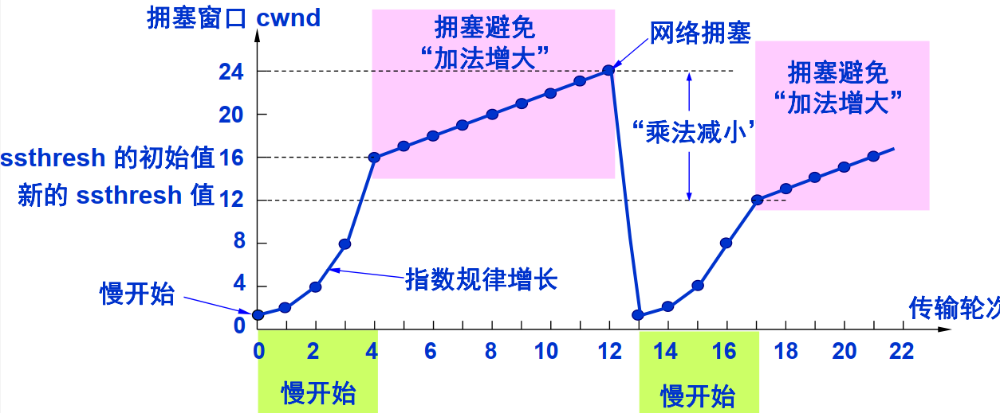

需要注意的是，congestion avoidance并不能完全避免网络拥塞。

另一种很重要的策略是fast retransmit。如果我们收到三次重复的ACK，那么我们不需要等待timeout，而直接判断网络进入拥塞。调整之后，我们让ssthresh = max(min(cwnd, swnd)/2,2)，cwnd=1，重新开始传输。

fast recovery由Reno提出，当fast retransmit监测到三次复制的ACK之后，就从congestion avoidance阶段重新开始恢复。

简单来说，目前的策略如下：

```
AFTER RECEIVING 2 DUP ACK:  ENTER FR/FR
	retransmit the lost segment
	ssthresh = max(SWsize / 2, 2)
	cwnd = ssthresh
	if dupACK arrives: (keep in FR/FR)
		cwnd = cwnd + 1
		transmit new segment
	if newACK arrives: (goto CA)
		cwnd = ssthresh
		exit FR/FR, enter CA
	if RTO expires:  (perform slow-start)
		ssthresh = SWsize / 2
		cwnd = 1
```

> TCP使用三次握手建立连接。若A、B发送的初始序列号为X和Y，则
>
> 第一次握手，A发送的报文 SYN=1，SEQ=X
>
> 第二次握手，B发送的报文 SYN=1，ACK=1，SEQ=Y，ACK=X+1
>
> 第三次握手，A发送的报文 ACK=1，SEQ=X+1，ACK=Y+1

> 一次TCP连接中，MSS=1KB，cwnd = 34KB的时候超时，若接下来的四个RTT内均成功传输，则这些报文段**确认后**，cwnd的值为16KB

> RTT=10ms，MSS=2KB，rWnd=24KB，使用slow-start，则需要多长时间达到第一个完全窗口？
>
> 2 4 8 16 24  所以是40ms

> 甲乙之间存在一个TCP连接，MSS=1000B，甲的cWnd=4000B，在甲向乙连续发送2个最大段，收到第一个段的ACK，rWnd=2000B，则甲向乙发送的最大字节数是
>
> 2000-1000=1000，因为这是滑动窗口。

## Application Layer

### 应用层常见协议的比较

| Protocol  | Telnet         | DNS  | FTP                              | SMTP                  | HTTP                |
| --------- | -------------- | ---- | -------------------------------- | --------------------- | ------------------- |
| Commands  | binary         | text | text                             | text                  | text                |
| Data      | text (ASCII)   |      | text or binary                   | text or MIME standard | key aspects of MIME |
| Transport | single TCP     | UDP  | seprate TCP for data and control | single TCP            | single TCP          |
| State     | retain session |      | retain session                   | retain session        | stateless           |

### C/S与P2P应用架构

C/S架构：

- Server Process，在一个Server host上运行，提供服务
- Client Process，在一个Client host上运行，通过Server process访问服务
- 进程之间的交互通过协议进行

P2P结构：

- 所有节点同时是client和server
- 无中心化数据源

### DNS

What is DNS？

> A hierarchical, domain-based naming scheme and a distributed database system, for mapping host names and e-mail destinations to IP address.

一个主机名Host Name可能会映射到不同的IP地址，一个主机名可能也会有别名。DNS（Domain Name System）是一个分布式的数据库，用来解析主机名。它运行于UDP上。

Internet使用层次结构来命名，具体来说

- 每个子树称为一个Domain
- 从根节点出发的到叶子节点的路径称为Domain Name
- 可以理解成一个命名空间


我们把一个受到管辖的命名空间称为一个zone。一个zone可以进行委托其子域给其他组织管理，这就是delegation。

DNS使用了Name Server，维护根服务器的地址和它直接儿子的地址。它分为下面几层：

- Root Servers 根域名服务器，世界上共有13个，给12个不同组织管理
- Top-level domain (TLD) servers 顶级域名服务器 ，存放在顶级域名服务器注册的二级域名
- Authoritative DNS servers 授权域名服务器，将授权主机名转换为IP地址
- Local DNS servers 本地域名服务器，接近最后一级hosts，并不严格的属于这一层次，每一个ISP（Internet Service Provider）都有一个。

DNS的查找方式有两种：

- Recursive Query，递归查找信息，只返回最终的答案或者Not Found
- Iterative Query，迭代查找信息，只响应所知道的信息

例如从cis.poly.edu使用iterative方式查找gaia.cs.umass.edu：

- 先找到Local Server dns.poly.edu
- Local Server找Root Server，Root Server返回edu的信息
- Local Server找TLD DNS Server，TLD返回umass.edu的信息
- Local Server找authoritative DNS Server即dns.umass.edu，返回dns.cs.umass.edu
- Local Server找dns.cs.umass.edu，最终找到gaia.cs.umass.edu

而Recursive方式可能是这样：

- 先找到Local Server dns.poly.edu
- Local Server找Root Server
- Root Server找TLD DNS Server
- TLD DNS Server找authoritative DNS Server
- 然后返回信息

实际中，Local Server往往是Recursive的。总而言之，就是两个原则：

- 本机向本地域名服务器的查询是递归查询
- 本地域名服务器向根域名服务器采用迭代查询

此外，DNS还是用了Caching机制，只要查找到映射就进行保存。

DNS在数据库中的记录形式称为Resource Records（RR），它有这样的形式：


> 【2020 408】 局域网查找服务器RTT10ms，若请求www.abc.com/index.html，则需要的最短和最长时间分别是多少？
>
> 最短时间：10ms建立TCP连接，10ms发请求，20ms
>
> 最长时间：连上查找根服务器、顶级域名服务器、abc.com的域名服务器的时间，50ms

### FTP

FTP使用21端口进行控制连接，20端口进行数据连接，是两个并行的TCP连接。具体来说，有PORT和PASV两种。

对于PORT，客户端打开一个端口，连接到服务器21端口，用PORT命令告知服务器端口号x，服务器开放一个从20端口到端口x的连接；对于PASV，则服务器会随机开放一个端口，并告知客户端，客户端再连接到该端口。

在这个过程中，有passive open和active open两种状态。

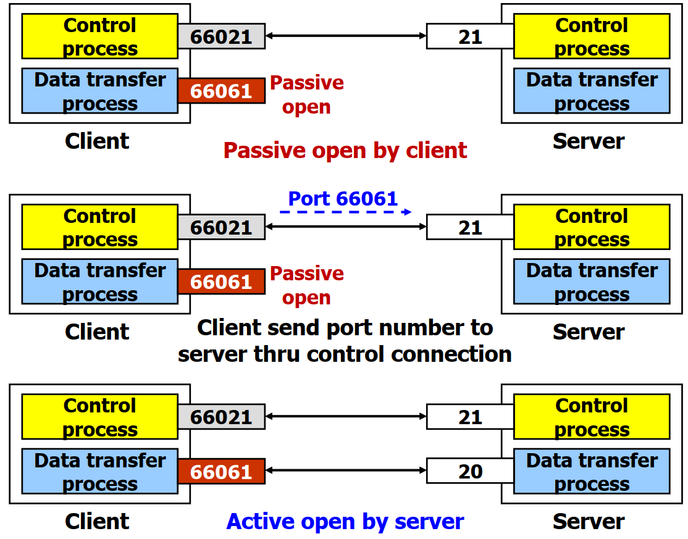

> FTP Control process先于Data transfer process建立，但是晚于它释放。
>
> 匿名FTP常用anonymous作为用户名，guest或邮件地址作为口令。

### SMTP/POP/IMAP

E-mail有三个主要的部件：

- User Agents（UA），它是用户与电子邮件系统的接口，提供一个接口来发送邮件
- Mail Transfer Agents（MTA），例如Mail Servers，它用来收发邮件。发送邮件者是MTA Client，接收邮件者是MTA Server，SMTP（Simple Mail Transfer Protocol）定义了Client和Server。
- Mail Access Agents（MAA），例如POP3/IMAP4，它用来拉取消息。

一个电子邮件的格式是这样的，它有Envelope和Message两部分，前者是由后者的Header部分提取出来的：


存在四种场景：

- 发送者和接收者在同一个邮件服务器，只需要两个user agents
- 发送者和接受者在不同邮件服务器，需要两个UA和一对MTA
- 发送者连接到一个mail server，需要2个UA和2对MTA
- 发送者和接受者在不同的mail server，则需要2个UA、2对MTA、1对MAA

SMTP使用25或2525的TCP端口，是一种push的协议。它的命令使用ASCII text，返回是status code和phrase，用`CRLF.CRLF`标记结束。它有三个阶段用来传输：

- Handshaking，用来建立连接
- Message Transfer
- Closure

MIME（Multipurpose Internet Mail Extensions，多用途网络邮件扩充）在Content Type中添加了文件类型，用来提供多种多样的支持。此时，UA将Non-ASCII Code通过MIME编码成7-bit ASCII Code，然后再通过SMTP发送。

POP3（Post Office Protocol, version 3）从远程服务器拉取邮件，需要Authorization和Download两个阶段。IMAP（Internet Mail Access Protocol，因特网报文存取协议）支持connected和disconnected两种类型的操作，支持多个客户端访问同一个邮箱。

如今，很多邮件为Web-based Email，同一邮件服务器使用HTTP协议。

### WWW and HTTP

World Wide Web有很多组成部分：

- Web，一个信息聚合和用于访问的设施
- Web Page，一个包含数据的页面
- Website，一个Web pages的集合
- Web Browser，浏览器
- Web Server，一个用来回应请求的服务器
- Uniform Resource Locator（URL），一种定义Web Page的标准方式
- Links，两个Web page之间的连接方式
- Hypertext Transfer Protocol，超文本传输协议

具体来说，他们可以分成三类：

- infrastructure，比如Clients、Servers、Proxies
- contents，包括单独的文件和Web sites等
- implementation，包括HTML、URL、HTTP

URL的格式如下：

```
protocol://hostname[:port]/directorypath/resource
protocol includes http/ftp/https/stmp/rtsp/etc.
hostname includes dns name and ipaddress
the default port of http is 80, and https is 443
```

HTTP是一种C/S架构。它是stateless的，server不保存client的请求。HTTP连接包含两类：

- Non-persistent HTTP，每个对象需要建立一个TCP连接，在HTTP/1.0支持
  - 这种模式下，它的文件时间开销是2RTT + transmit time，第一个RTT用来初始化TCP连接，第二个RTT同来处理数据传输
- Persistent HTTP，多个对象共享一个TCP连接，是HTTP/1.1的默认方式
  - 进一步细分成with pipelining和without pipelining
  - with pipelining方式是HTTP 1.1的默认方式，Client只要遇到对象就发送一个请求，提高了效率
  - without pipelining方式下，收到上一个响应才能发送下一个请求

HTTP的报文可以分成request和response两类。request的格式如下：

```
requestline			GET /aa.html HTTP/1.1【CRLF】
header				HOST: www.qwq.qwq【CRLF】
					User-Agent: Mozilla/4.0【CRLF】
					【CRLF】
body				...
```

methods有get/head/post/put/delete/link/unlink/trace/connect/options等。

response的报文类似：

```
requestline			HTTP/1.1 200 OK【CRLF】
header				HOST: www.qwq.qwq【CRLF】
					User-Agent: Mozilla/4.0【CRLF】
					【CRLF】
body				...
```

server的response可能是一个文件，可能动态处理请求，可能返回meta-data，此时是空body。

用户与Server的交互使用的是Cookie，它维护了一种状态。Cookie包含四个组件：

- response msg的header line
- request msg的header line
- 在用户主机中保存并由浏览器托管的cookie file
- website的back-end database

如果需要鉴权，可以使用header中的Authorization字段，否则就会拒绝将请求，并在response中添加WWW-authenticate字段。

> 用户在请求头包含了Connection:Close字段，访问一个有100个图像的Web页面，需要打开和关闭101次TCP连接。

> 测试RTT平均值150ms，一个gif对象的传输时延35ms.若一个Web页面中，有10幅gif图像，基本HTML文件、HTTP请求报文、TCP握手报文大小忽略不计，TCP三次握手第三步捎带一个HTTP请求，使用非流水线，求使用非持续方式和持续方式请求一个Web页面所需时间。
>
> 非持续：335*10+300=3650
>
> 持续：300+185*10=2150

### DHCP

DHCP（Dynamic Host Configuration Protocol）使用UDP，占用67和68两个端口。它提供了主机连接到网络之后的自动设置。

DHCP有几种报文种类：

- DHCPDISCOVER，客户端广播来找到可用的DHCP服务器
- DHCPOFFER，DHCP服务器对DHCPDISCOVER的回复，并提供一个IP地址和其它参数
- DHCPREQUEST，客户端向服务器请求IP地址
- DHCPACK，将IP地址进行分配
- DHCPNACK，告知客户端IP地址的租赁到期或者请求的IP地址有误
- DHCPDECLINE，告知server提供的IP地址已经被占用
- DHCPRELEASE，告知server取消对IP地址的租赁
- DHCPINFORM，已经有IP地址的客户端向DHCP server请求分配

下面是一个报文的发送过程：


它可以分成三类：

- 手动（静态）分配，Server分配管理员选择的IP，包括IP和MAC地址的设置
- 自动分配，IP地址与MAC地址绑定
- 动态分配，server追踪并动态处理过期的client

客户端有责任对IP进行renew和release。在0.5\*duration的时候，客户端进入了RENEWING的状态，重新向原来的DHCP server发送DHCPREQUEST；在0.875*duration的时候，客户端进入了REBINDING状态，试图联系到所有的server。
