<<<<<<< HEAD

# HCI

## Introduction

HCI, Human Computer Interaction

界定了人、机和二者之间的交互方式。

这种交互方式有一些量化指标来衡量，但是也有主观因素影响。

很多年前，人类就出现了，而1940s计算机出现了，HCI在1980年代出现了。这40多年人与计算机的交互是怎样的呢？在计算机出现早期，使用计算机的是少数，而使用者大多是计算机的设计者，所以对命令和操作非常熟悉。直到个人计算机的普及，任何人使用计算机成为可能，交互就变成了必然趋势。在其中可以看到人因工程和人类工程的影子。

人机交互是Human Factors的一个子集，关注于人与特定的计算机之间的交互。这与人的能力、性质有关，而在了解这些之后，我们才能设计一个更有效率、更有优势的系统。

人机交互这个领域与很多学科是有交叉的，需要心理学、计算机科学、社会学、认知科学、语言学等领域，如果要关注这一领域的发展，其职业背景非常丰富。

HCI model是一个概念性的东西，这里以经典的模型为例：

Sensors：人的传感器，接收信息的通道

Responders：人的响应器，对外输出的通道，比如语言、表情等

Brain：一切的指挥者

Displays：显示的部分，比如显示器、投影仪、VR头盔等，用作显示，对外传输信息到人

Controls：给计算机发送指令，人与计算机的桥梁，比如键盘、鼠标

Machine State：计算机的主机，核心处理组件，用于信息的加工分析

随着计算机性能的优化，作为大脑的计算机能力越来越强，发展可能性很多。

中间的Interface就是计算机-人与人-计算机的双向交流。

人机交互是一个年轻的领域，发展大致可以这样分析

- 1945 Vannevar Bush 万尼瓦尔布什 《As We May Think》 发表于二战结束之前，认为基础科学研究很大价值。这篇文章用来解释战争后科学的发展方向，和对战后数量增长的信息如何理解应用。报告中谈到了对信息资料的分析、处理、收集、筛选、个性化定制，在那个时代很超前。
- 1962 Ivan Sutherland 完成了一个Sketchpad，是一个类似手写板的设备，用光笔直接改变计算机上的几何图形。传统的计算机操作是指令式的单向交流，实现实时双向交互是很困难的。所以他提出了这种双向交流的模式，开创了直接可以操控的接口。他提出了一系列直接操控的特征：
  - 对可见物体的操纵
  - 连续的动作组成，需快速响应
  - 操作可反转、可拓展、可兼容
  - 将操控方式转变为动作
- 1963 Doug Engelbart 发明鼠标
- 1967 第一次在人机交互引入了人的实验 13个参与者，采用6种实验模式，在6种操控模式下对完成任务的量化指标进行了测量，观察不同设备下的性能，对实验结果进行了分析。很多研究问题都是基于这种实验框架验证的。
- 1981 Xerox Star 国际计算机会议上一些公司带了工作站前去，是第一款具有GUI的计算机，这些GUI与我们沿袭的图标比较相似，在当时引起了轰动。
- 1983 HCI诞生
  - 1983 ACM SIGCHI conference开始举办
  - Apple Macintosh 苹果电脑的发布和上市，是个人电脑普及的前端，计算机能被大众所认可，让大众使用成为可能。
  - 论文 The Psychology of Human-Computer Interaction, Card, Moran and Newell。同时作者提出了Model Human Processor（MHP）模型，将人看作了处理器，从信号的角度对人进行描述。
- 1983以后HCI蓬勃发展。许多交互技术的产生，并非短暂的灵光一现。比如2007年的Two-finger gestures，早在1978就有相应研究。所以很多研究成果是可以被产业应用的，引发一些新的潮流。

## Human Factor

人是在其中最为复杂的因素。人与人的差异性在人机交互的研究中，导致其问题定义较为复杂，所以我们常常限定在小的问题空间当中。我们充分考虑问题和任务的适用性，及问题的解决方案能否使用于特定用户。这里举几个例子：

- 用户记忆力对网站密码设计的影响
- 用户操作复杂程度对菜单项完整的影响
- 人打字的犯错程度对界面和键盘布局的影响
- 多任务处理能力对交互方式的影响

人机交互问题提出和解决，就需要更多了解人的特性，比如心理特性、社会特性。总结来说，就是要**更好的理解人**。

Newell 模型是很常见的一种描述性模型，即采用模糊的分类，而不是预测性模型那样的量化方法。人在操作界面和硬件设备的时候有操作时间和响应时间，Newell按时间尺度对人的行为进行了划分。

| 时间尺度  | 时间单元   | 系统           | 理论                                               |
| --------- | ---------- | -------------- | -------------------------------------------------- |
| $10^7$    | Months     |                | Social Band                                        |
| $10^7$    | Weeks      |                | 比如群体的建模，需要足够时间交互                   |
| $10^6$    | Days       |                |                                                    |
| $10^5$    | Hours      | Task           | Rational Band 以任务为层次，一般可以完成完整的任务 |
| $10^3$    | 10 min     | Task           | 比如网页浏览                                       |
| $10^2$    | Minutes    | Task           |                                                    |
| 10        | 10s        | Unit task      | Cognitive Band 认知层次，一般不能称为完整的任务    |
| 1         | 1s         | operation      | 比如屏幕触控                                       |
| 0.1       | 100ms      | Deliberate act |                                                    |
| $10^{-2}$ | 10ms       | Neural circuit | 心理学、认知科学领域                               |
| $10^{-3}$ | 1ms        | Neuron         | 一般不属于研究范围                                 |
| $10^{-4}$ | 100$\mu s$ | Organelle      |                                                    |

Newell模型为人机交互提供了一种研究方法学，即定量和定性。通常，在做高层（social等），一般采用定性的实验方式；而相对低层的（认知层次），采用准确率等定量方法比较合理。同时，它也是对问题空间的一个划分，可以根据时间尺度来对问题进行分类。

从功能角度，也可以把人划分为大脑、感知器和响应器。作为人而言，具有如下特性：

- 信息输入输出接口
  - 视觉、听觉、力的感应、运动等
- 信息的存储系统
  - 短时记忆、长时记忆
- 信息的处理应用
  - 推理、解决问题、整合
- 情感对人的能力的影响
- 人与人的差异性

下面分别讨论这些部分。

（1）感知器

人的感知器主要有五类：

- 视觉 vision
- 听觉 hearing
- 触觉 touch
- 嗅觉 smell
- 味觉 taste

前三者是最常见的研究对象，我们对这种感知基本原理和特点、性能进行讨论。

**视觉**

视觉占了人获取信息的80%以上，是非常重要的信息通道。视觉主要分成两个阶段：

- 底层生物信号接受，主要接受物理上的刺激等，比如光刺激进入人的眼睛
- 对刺激信号的处理和解释，比如对光信号进行一系列处理后形成解释

Cornea 眼角膜，为眼睛提供大部分的屈光力，可以让外界物体影像正确聚焦形成影像。

Iris 虹魔 位于角膜和晶状体之间，可以看到黑眼球。中间有圆孔，称为瞳孔（pupil），控制进入光线的强度。在光比较强的时候，瞳孔就会收缩，降低光的进入量。

Lens 晶状体 形状与作用与凸透镜相似，可以把远处的像清晰的投影到视网膜上，形成正确投影

Retina 视网膜 负责成像，上面有大量的神经结构，外界光线进入眼球就会形成刺激信号。中央凹（Fovea）是视网膜最敏锐的部分，有大量成像细胞分布，对成像影响很大，称为中心视觉。中央凹只占视网膜的1%，但是占据了50%的感知细胞，所以人成像最敏感的区域只有大致$1^\circ$的范围。这就是为什么我们往往需要转动瞳孔。

人眼是从光信号转变为电信号，通过神经元传给大脑，形成感知。光从物体反射而来，被人眼接收到，形成感知信号。由于透镜的像是倒立的像，所以视网膜上的像是倒立的。婴儿经过一周左右的时间，看到的像就从正立变成倒立。

心理学家曾经做过一个特殊的实验，戴一个眼睛让成像上下颠倒，形成实际的正立像，视场发生完全倒转，视觉与触觉、动觉错乱，移动困难，但是一周之后动作就较为协调，21天之后行动完全适应空间关系，世界再一次正过来了。

视网膜上的细胞分成杆状细胞和锥体细胞，前者对暗视觉有效，后者对充足光线时的彩色光线比较敏感。人眼通过神经结、神经元进行传递信号，也可能进行了底层的场景处理。

一个例子是，在交互界面的设计中，如果要设计警告信息，应该在屏幕左边，因为左边比右边更容易读。

对于光，我们用频率和强度进行定义；对于视觉，我们可以用颜色和亮度进行描述。

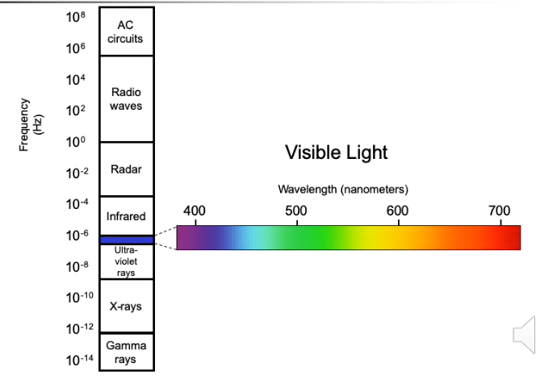

在能量谱中，人眼能感知到的比例是很小的。

对于亮度，亮度是对客观存在的光的主观反应，是比较定性的概念。

- 它受到物体本身亮度（luminance）的影响，这是锥体细胞特性决定的。
- 人只能描述可察觉的变化。计算机常使用256级灰度，因为这大概是人眼分辨级别的极限，所以人的精度是有效的。
- 如果信号存在闪烁，人眼敏感度会增加，导致亮度上升。人眼视网膜上的杆状细胞数量大，但是主要感知运动，在比较暗的情况下也可以接受刺激，所以能看到比较暗的情况下有物体运动。

想要让用户看清楚信息，一方面可以让信息亮一点，也可以多用一些闪烁的信号。

对于颜色，

- 比较直观的颜色描述是色调、强度和饱和度。强度是多少光被人眼感知，饱和度影响颜色的纯度，即纯红当中加入多少白光。这种颜色模型适合直接和人进行沟通，而在印刷等领域可能采用其它模型。
- 颜色感知是锥体细胞负责的，而锥体细胞分成三类，对不同波段光有其自己敏感的部分。这就是rgb的原理。
- 人眼对蓝色的敏感度是最低的，对红色敏感度比较高。警示信息常使用红色。
- 有8%的男性和1%的女性是色盲的，对颜色感知不敏感。要考虑颜色所包含的信息量会不会被特定人群忽略。

人在信号识别中还存在视觉补偿现象。一方面这源于视觉暂留，存在时间差；另一方面是运动补偿，将缺失的信息进行了补偿。此外，人眼存在亮度补偿和颜色补偿，后者也被称为“补色”。人眼为了防止看一种颜色的疲劳，所以长时间对着某种颜色，再看其他颜色就会影响观察。画家会有一些搭配原则，红色和绿色、蓝色和橙色等并非偶然而来。根据这种特性可以定义色相环，在环上存在许多互补色。

**视错觉**是很容易产生的一种现象，看到并不存在的东西。比如

三者其实亮度一样，但是常常觉得右边的更暗一些。这就是视觉对亮度的补偿。对于长度等都存在类似现象，造成人对场景物理属性感知出现偏差。

视错觉还可能产生语义上的歧义，人通过上下文解决。比如

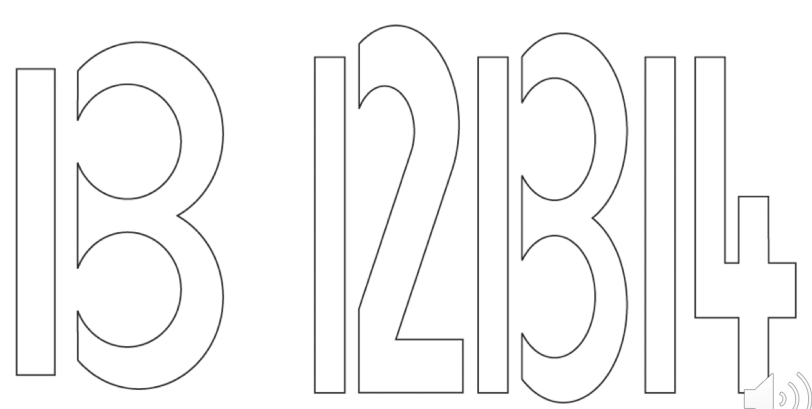

我们并不会理解成B。

人们**阅读**文本的时候，一种有两种方式，一种叫定点阅读（Fixation），眼睛是固定的，可以获取准确的视觉信息，持续200ms以上。对于扫视和跳读（Saccade），为了让眼睛寻找目标，持续时间比较短，大约在120ms.比如对同一幅画，根据任务不同，人眼关注信息的模式是这样的

所以人观察场景是带着任务，需要定焦信息位置的。

人在做Saccade的时候，做的是直线运动，而做Fixations的时候，做的是一个圆。我们可以根据这种方式来研究用户行为，比如用户的阅读模式等。也可以应用在市场研究中，比如广告投放。

人的阅读分成这样一些阶段：

- 视觉模式感知
- 对字符的编解码，即对模式的解释
- 用知识对文字进行解读

阅读包括定点阅读和跳读，人获得信息的时候发生在定点阅读的时候，所以人获得的信息量是和定点阅读的时间相关联的，因此人的阅读数据是可以获得的。同时，文字形状对阅读是有影响的，比如一篇全是片假名的文章。人感知信息的处理时间需要包括人识别字符的时间。此外，如果文本显示在屏幕上，对比度也会有一定影响。

**听觉**

声音是对某种媒介压力周期性振动产生的现象。它往往由于物体发生移动震动而产生，比如敲门、波动吉他弦、洗牌、说话。

听觉主要提供环境的信息，比如距离、方向、物体种类。例如，有人说话，我们可以判断这个人的距离，人在哪里，是谁说话。

人感知声音的物理器官是耳朵，分成下面部分

- 外耳 可以放大声音信号
- 中耳 将声波信号转换成震动信号
- 内耳 与神经元联系，将声音信号转换成脉冲信号，传递给听觉神经元

我们常用三个量描述声音

- 音高，反应声音频率
- 音量，反应声音大小
- 音色，反应声音质量

但从人的感知而言，人更多使用定性描述。

人能听到的范围是20Hz-15kHz，对低频声音准确度更高，高频准确度更低。

人的听力系统能过滤声音，比如听家长的声音就会听不到。人可以自动增强感兴趣的声音，即“鸡尾酒会效应（the cocktail party phenomenon）”：两个人在嘈杂的鸡尾酒会上可以顺利的互相交流。

音色由不同物体振动的特点形成的，对应了声波的波形。对于乐器而言，相同频率的音调的音符也可能得到不同的感觉，经过训练的人也能发现其中差异。

**触觉**

触觉是人体感觉系统的一部分，可以对纹理、温度、阻抗、形状等都由感知。比如F和J键的突起，鼠标按键运动的阻抗，手机的振动等。

触觉提供了对环境的重要反馈。比如，从按键机向智能手机过渡中，按键的触觉反馈消失了，需要对应的反馈改变。

对特殊群体，比如视觉系统障碍者，触觉系统非常关键。很多产品需要印上盲文来方便使用。

刺激信号往往通过皮肤接受，比如压力感、疼痛感、温度等。同时，某些器官可能更加敏感，比如人的手指。在产品电子化的时代，我们也需要考虑有没有触觉所能及的商品，比如布料。

**嗅觉和味觉**

嗅觉由鼻腔感知，味觉由味觉系统感知。味道感知则混合了嗅觉和味觉两部分。这两种不属于人机交互的主要研究对象，因为量化描述比较困难。

（2）响应器

人处理完信息之后，需要对外发布信息。响应器就是对外发布信息的途径。比如，手指来进行文本的输入等。

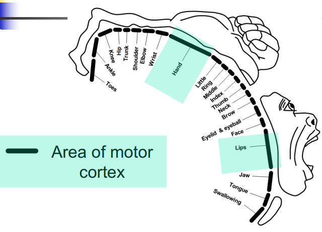

这个图对应了大脑皮层区域，线段越长，说明控制能力越强。人手和嘴是最长的两部分，后者对应了语音发音。人手和语言构成了最复杂的两个区域。

人可以通过躯干来实现和计算系统的交互，比如键盘、按键机、遥控器、脚踏板、头部姿态等。

**偏手性**，也就是惯用手，对交互有比较大的影响。早期设备一般不考虑左撇子等，但是后来左右手切换等功能极大的促进了方便。偏手性有一系列指标来度量。

**发声**是一个系统工程，从人的肺发出气流到声音的发出，包含语音信号和非语言信号两部分，二者都可以作为计算机系统的输入。对系统而言，语音识别是一个非常大的挑战。非语音信号，比如发声长短、频率等。这些信号对计算机相对而言比较容易测量，但是对人记忆负担比较重。

（3）大脑

大脑是复杂的生物结构。它有很多神经元组成，这些神经元各司其职，完成各种任务。它可以让人深思熟虑（pondering）、记忆、回忆、推理、决策，虽然感知和响应是可见的输入输出，但核心过程还是由大脑完成的。

感知和响应的触发和处理是由大脑决定的。人的能力在大部分方面是远超过计算机的，比如感知（类似照相机获取外界信息，而无法进行处理分析）、创造力（计算机的创造往往是对数据的简单组合）、脑补能力（人不需要非常完整的信息就能补充出来其他信息，把离散的观测点串成合理的事件）。

感知是人实现这个功能的第一个步骤，比如听、看、触、闻、尝。这些感知都是定性的感知，但计算机往往可以定量的描述。对于人来说，这种输入是模糊的，所以模糊性、错觉等现象都会出现。视错觉、听觉上的上升错觉、触觉上的“幻肢”，都是这些现象的表示。

心理物理学是实验心理学的分支，通过实验的方法研究心理学问题。这个理论用定量方式来度量心理学现象，讨论物理刺激和感知的关系。一个经典的例子是，给不同灰度图像，当观察到差异的时候，讨论其灰度值，那么这一物理量就有了参考意义。这就是256阶灰度的来源。

韦伯给出过一个关系：
$$
\frac{\Delta \Phi}{\Phi} = Const.
$$
$\Delta \Phi$表示刺激的变化量，$\Phi$表示人的感知量。这种分析方式一直被沿袭到今天，仍被广泛采用。

其实验方法：

- 给出两个量
- 在物理上制造差异
- 随机的变化差异
- 给出一个**阈值**，判断是否能产生差异

由于这一结论一般有比较大的个体差异性，所以需要对数据进行一定处理。

在感知层面，感知一般是客观的，所以能借助某种仪器来观测。但是认知都发生在大脑内，所以很难获取工作过程中间变量，只能反推中间过程。比如，做决策需要多长时间呢？决策是什么时候做出的呢？究竟哪一个输入触发了决策过程？

有一个比较粗略的阶段：感知刺激 - 决策处理 - 响应。按照时间范围，大致是这样的：

光线进入到人眼、神经元信号的传递、任务处理过程、神经元传递、任务驱动行动等，这些时间加起来有一个大致的总时间，范围是非常广的。这还是仅仅针对简单任务而言，并且测量难度很高。

记忆是人大脑的重要功能，记忆分成长时记忆和短时记忆两类。比如深度学习中最火的LSTM，是长时和短时记忆的联合作用。人的记忆除了数据，还有很多抽象的表达，这是计算机不具备的。长时记忆分成显式的和隐式的，显示的一般针对客观世界存在的，比如物体和时间等，如苹果长什么样这类对物体的描述。隐式的记忆一般是对抽象过程的，比如怎么打开电视机。短时记忆类似于内存，只能在短时间内快速存储一些记忆，优势是非常快，短时记忆能力大致是$7\pm2$个unit的记忆范围。

除去二者之外，还有传感器的记忆，有一个短暂的停留，视觉暂留就是一个很典型的例子。摸到针被扎到了，这种记忆引发短时记忆，这种机制叫做Attention。人听到和看到的感观信息量很大，但是对什么信息进行记忆，实际上是有选择性的。就如同在课堂上听不懂老师讲课，只能记着中午吃啥。从短时记忆到长时记忆需要长期的Rehearsal，比如背单词。人的记忆确实是有规律可言的。

短时记忆是高速运转的暂存区域，存储速度约70ms，退化200ms，容量是$7\pm 2$ unit。`Millers experiment and magic number 7`是一个很经典的实验，将一系列随机的数字给测试人群，经过一段记忆之后，把数字写下来，再看准确的数字，来统计准确率，在60人样本下，得到的大约是这样：

随着横轴的增加，数字记忆的准确率会逐步下降。将一连串无关联的信息靠记忆力完全的记下来，这是非常困难的。对此的启示是，可以把数据整合成更大的存储单元来方便记忆。比如，`0011010101111001`可以记忆其十进制`3579`，这实际上是通过长时记忆扩充短时记忆。规律性也会对人的记忆有所帮助，`THECATRANUPTHETREE`就比`THE CAT RAN UP THE TREE`难以记忆。

比如做安卓开发，在`onCreate`里写了一堆，就很容易忘掉`onDestroy`中对应关闭。这是因为他们不属于一套流程，所以引入生命周期感知组件是由生理意义的。

长期记忆访问比较缓慢，大约需要`1/10s`，有大量容量。这其中分成两种类型，一种是对事件的序列记忆，比如电视剧的每一集。一种是概念化的结构化的记忆，比如数值分析。这种结构化记忆能最大利用存储空间，所以忘了就说明该忘。视觉的很大一个研究方向就是建立这种结构化描述，这些对推理认知更有帮助。一般来说，有语义的结构性记忆一般从序列化记忆中抽象而来。

这种结构化信息可以提供对信息的访问，可以支持推理，代表了信息之间的关系。这种模型可能类似一种图状结构，含有一些继承关系，通过这种图来推理。

长期记忆需要时间来重复，能记住的比例和回顾的时间是有关系的，记忆时间越长就越稳固。自带结构的信息更容易记忆。在这个记忆的过程中，一些新的信息会替换旧的信息。遗忘具有选择性，受到很多因素影响，情绪在剧烈波动的时候也会导致记忆出现偏差。

（4）不同模块的协同

人使用三个模型来系统完成整个任务。比如，系个鞋带，鞋带出现重叠和遮挡，这种空间关系对计算机是根本无法建模的。

人的速度和准确率有一定关系，一般速度越快，准确率就会变低。人机交互也需要在速度和准确性中取得平衡，比如鼠标的DPI，高DPI可能导致人的失误变多。

人具有很强的个体差异性，年龄、性别、记忆、动机，这些因素都会影响人完成某些任务的性能。人的差异性和表现出来的形成往往呈现正态分布，人是位于中间区域还是长尾区域，可以指导某些工作。

人的响应时间是对性能评价的常用指标，也就是单一刺激出现之后到有响应的时间差。例如，看到光就按按钮，这个过程实际上也是简单的认知过程。人的痛觉明显比嗅觉和视觉要长，最短的则是听觉。

对于需要响应的任务，提升的过程一般需要通过练习获得，比如通过多少练习会有比较明显的提升。医生通过机械手远程操控做手术，这种技能可以提升，但是操控这类顶端行为很难提升。

有些事情是不需要注意力的，即便不把焦点放在事情上，也可以完成某些任务。但多任务并行的时候，注意力就会变成一个影响因素，比如同时说话和打字。人的注意力可以分成两个类别，有些可以在同一时间完成多个任务，另一种注意力有选择性，人只能选择其中一个任务来完成。比如鸡尾酒会效应，在嘈杂的条件下也能听到人的说话声，能很准确的接收到这些信息。深度学习中很多人在尝试引入注意力模型，在场景当中辨识某些物体的类别，以一部分物体的关键像素来标明某个物体。人总是倾向于获取对判断最有用的知识，而不是不加筛选的引入。

人的错误是一个不可回避的问题。错误可以从很多方面来研究，比如实际输入和预期输入的偏离值。例如，在AR中，用户操作正确但是没有选中正确物体，发生了偏离。但是在交互任务中，出错更加复杂——例如全部错误和部分错误之辨。比如单词中有多少字母是敲对的，某些字母很容易出错，这就有助于对交互模式找到问题。

情感是非常复杂的，不同人有不同观点，研究也是比较初步的。我们经常期望从研究模态中找到情感，比如对文本的情感讯息进行提取。但是不论语音、文字、表情、肢体动作等各个层面去研究，准确率都很低。积极情绪下，操作行为的错误率会变低；而消极情绪有可能让简单的任务变得复杂。人不可能没有情绪，所以不会因此对性能产生影响。在交互设计的角度上讲，美观的界面设计等都可能有助于减轻压力，更好的完成任务。例如，安装软件的进度条可以带来很强的正反馈；携程的抢票概率上升会有积极的心态等。

## Interaction Elements

交互可以分成两类。一类是有目标的，比如烧CD；一类是无目标的，比如水群。

这部分的研究工作主要集中在认知阶段，也就是100ms-10s的范围内。在这个阶段适合实验性研究，可以做出准确的定量分析。常见的人因工程学主要研究操作端和显示端，也就是“knobs and dials”的问题。

计算机系统是一个复杂系统，由不同模块构成，影响交互体验和性能。

- 输入设备，比如文本和指向（在VR中）
- 输出设备，比如屏幕大小和墨水屏
- 虚拟现实，比如特定的交互和显示设备
- 物理交互，比如声音、力学反馈、生物感应
- 纸，常见的输入输出介质
- 处理，处理速度和通信机制
- ……

考虑一个典型的系统。显示器，屏幕，键盘，鼠标，数位板……这些典型系统模块都是有所变化的，呈现出来非常多样。这种多样性也给交互带来很大的困难，不同的媒介之间的转换对交互的要求是很强的。让人使用起来有一致性和舒适性、减轻记忆负担，才能达到比较好的体验。

电脑，智能电视，微波炉、洗碗机、炒菜机，智能空调，电子门铃，PAD，门禁卡，USB，车钥匙……这些中都有着计算系统在其中运行，这对交互来说很有挑战性。

人在闭环系统里，耐性是有限的，所以需要设备的高响应性和易于操控性。用户群体非常复杂，年龄段、性别、文化背景差异使用同样的功能，就需要考虑操控的效率。计算机性能提高之后，人对计算机要求也水涨船高，consistency、efficiency、comfortability、intensity是四个比较重要的量度。

Hard Controls和Soft Controls是两个不同层面。对于物理的、单目标的设备，操控是不可变的，操控可塑性比较差，这种操控就是硬操控。而在图形界面中，通过软件控制就构成了软操控。软操作既可以操控状态，也可以显示状态。典型代表就是Slider，既可以标识文本长度，也可以标识当前位置，同时可以操控进行拖动。GUI的可塑性很强，也能很密集的设置操控。比如，

在很小的区域内，就能排布20个操作。

控制和显示的关系，也称为映射，至少分为三种：

（1）空间关系

空间关系是操控对象和目标的空间联系。比如鼠标的映射关系

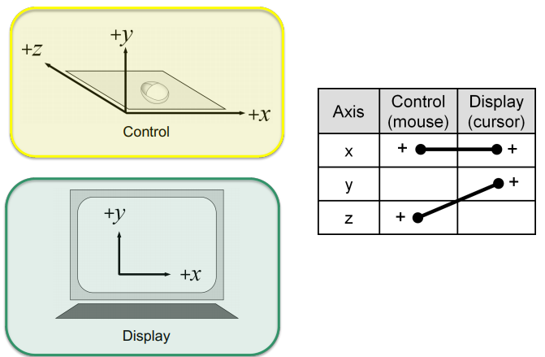

将$xOz$平面上的运动映射到$xOy$平面上。

在空间中，有6个自由度。人手想要和这些保持一致也是比较复杂的，比如google的街景操控机制。

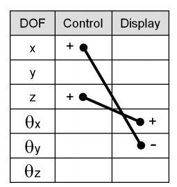

CD增益是实际操控的操作和显示操作之间的倍数关系。假设控制器移动了2cm，但是在显示器上移动了4cm，那么CD就是2.一般我们用一个比例C:D ratio来表示。在某一阶段，CD为1:1，然后转换CD增益，就有可能实现非线性增益，比如鼠标的移动速度。

CD增益一直是热点话题，人们一直在探求一个合理的CD增益值。比如这张图

随着CD增益的增加，到达指定位置的指向时间也会变大。同时也有一个出错率的问题，人们期望找到一个最优化点，就是一个最优CD增益。这一点在不同操控动作和人身上会有很多差异。

人往往处于闭环系统之间，延迟就很重要。在某些操作中延迟可忽略，而某些操作就不可忽略，比如远程操控、系统调用外部资源响应、VR的计算。一个典型的例子是VR，画面质量太高会有明显延迟，质量低则会有不真实感。

操纵杆有两种类型，一类是等压的，对压力不感应，通过位移操控；一类也对压力进行感应。

关系分成两类，一种是自然的，另一种则依赖于群体模式、需要学习。比如

这种开关。

真实经历过的事情，人记忆往往更深刻。比如，车造型的购物车，和现实日历一样的日历App，Word的文本图标，这种真实世界的隐喻会带来更低的学习代价。

（2）动态关系

动态关系是控制器和响应器的关系，比如延迟。

（3）物理关系

物理关系是控制器运动和力的大小的反馈，比如thinkpad中间的红点。

模态（Mode）是对同一个按键的多种对应，比如电话的灯。CTRL、ALT、SHIFT和100个键，能切换出大约800种组合，这都是模态的一部分。另一方面，过多的模态容易造成高误操作率，比如insert键。

多个自由度需要足够多的模态，所以鼠标不能完成旋转操作。可以考虑把自由度分离，比如$xyz$可以分成三个$x,y,z$三个操作。

人类操作一般需要实时反馈。比如触摸屏上的胖手指现象，即按着时候容易遮挡其它键位。那么就可以引入偏移光标技术：

还有后面所引入的多点触控、加速度计等。

## Experiments

人机交互有一些独特的实验方式。

实验设计是是一个包括很多方面的过程，包括使用什么样的变量、用什么样的任务、多少实验人群等。

我们想验证任务设计情况，需要测量某些量来支持这些结论。我们观测的结果往往是由信号和噪声混杂而成，我们期望得到这样的信号，建立某种因果关系。信号就是一系列感兴趣的变量，噪声是除此之外的一切，实验设计就是为了增强信号，而尽可能降低噪声。

从方法论的角度来讲，核心就是如何设计和实施实验。方法论非常关键，2012年Allen Newell曾经说过：

> Science is method. Everything else is commentary.

17世纪，德国的奥古斯都二世让一个炼金术士制造瓷器。这个炼金术士花费十数年终于造出了第一片瓷器，而他在实验的基础之上，做了一系列的实验记录。这样的记录让瓷器制造的复现达到可能，而反过来在瓷器发源地在中国，很多独门秘传的技艺早已失传。技术的快速进步需要大量实验，更需要实验的记录和积累，也需要定量分析来保证品质的稳定，其核心就是控制所有可能控制的变量。

人机交互的实验方式有很多种，主流的是实验分析，也叫实验研究。这种研究方法主要来自实验心理学，得到了广泛应用。

具体来说，方法论主要有：

- 充分的论证，而不是因为看起来正确就是正确
- 在有人参与的部分要遵从实验的标准

APA(American Psychological Society)是美国的一个推动心理学研究的组织，1919年颁布了手册*Publication Manual of APA*给出了一些实施实验的基本方法，关系到实验人群和数据报告。这这个手册大多被HCI方向主要刊物所推荐。

伦理学在人机交互中很早就被提及，人机交互不可避免涉及到人的实验和动物的实验，所以伦理许可是非常关键的。一些比较规范的交互机构会有专门的伦理学部门来审核，提交研究方法、风险和收益、参与人员权利声明等。人机交互的实验过程中，需要确保实验人员的安全和自尊。

> Researchers must repeat the safety, welfare, and dignity of human participants in their research and treat them equally and fairly.

### Variables

首先需要明确实验变量。在实验过程中需要哪些量，如何定义？比如制作一种新的交互的键盘，是否能产生更好的输入性能？对问题的验证要可数值化描述。

这里的核心是两类变量。一类叫做独立变量(independent variable, IV)，一类叫做依赖变量(dependent variable,DV)。

**独立变量**可以是某种环境因素，也可以是某种特性。这种变量独立于实验人群，通常是可被操控的，否则没有意义。比如，键盘是否印字母对人的输入有没有影响，那么独立变量就可以是键盘的状态，我们可以给两个键盘，一个印了字母、一个没有印字母。两类键盘输入同样文字进行观察，对性能是否可以量化会造成影响。

这里的独立是指独立于实验人群的行为，也就是不管人群做什么也不会发生改变。接口（GUI、文字等），设备（鼠标、探针、滚球等）、响应模式（亮光、声音等）、键位布局（电梯按钮）、年龄（少年、青年）、性别、背景噪声、专业技能等。独立变量和因子是同义词。

**测试条件**对应于独立变量，实际就是独立变量的取值，也称为水平(level)、设置(settings)。比如：

| Factor           | Levels                     |
| ---------------- | -------------------------- |
| Device           | mouse, trackball, joystick |
| Feedback mode    | audio, tactile, none       |
| Task             | pointing, dragging         |
| Visualization    | 2D, 3D, animated           |
| Search interface | Google, custom             |

人的属性往往是一些自然属性。比如性别，年龄，体重，用手习惯等。这些特性往往不可控，所以在实验人群中就要考虑是同一个人参与不同实验还是不同人参与同一实验。由于人的复杂性，虽然我们只想关注性别的影响，但这个过程中往往会引入不可避免的混淆变量，让想观察的变量与结果之间的关系变得模糊。这就需要一些手段来控制混淆变量。

如果要确定一个独立变量，就需要明确的指出什么是独立变量、什么是独立变量的测试条件。否则就会被扣分。当独立变量的名字确定之后，就尽可能不要改变。

IV的数量当然是越多越好，但这是不现实的。一般来说，在任务的完成过程需要至少一个独立变量，也可能是2个或3个。当独立变量增多，一次实验就可以观察到很多效应，但与此同时实验可能产生的效应数量也会急剧增加，假设检验就会无法支持实验分析。

如果A发生变化，E发生变化，A对E造成影响；如果A发生变化，E不发生改变，A对E不造成影响。把A看成自变量，E看成因变量，就可以看成A对E有**效应**。如果两个独立变量A、B，A的变化不仅影响E的变化，也会影响B的变化，比如A是交互方式、B是环境光线，A包括声音和键盘两种交互方式，B包括亮暗两种，那么二者就会有一定联系，也就是 **交互效应**。不管有多少种独立变量，在多种独立变量都考虑的前提下分析的效应就是主效应。

| 独立变量数 | 主效应数 | 2元交互效应 | 3元交互效应 | 4元交互效应 | 5元交互效应 | 总数 |
| ---------- | -------- | ----------- | ----------- | ----------- | ----------- | ---- |
| 1          | 1        | -           | -           | -           | -           | 1    |
| 2          | 2(10,01) | 1(11)       | -           | -           | -           | 1    |
| 3          | 3        | 3           | 1           | -           | -           | 7    |
| 4          | 4        | 6           | 3           | 1           | -           | 14   |
| 5          | 5        | 10          | 6           | 3           | 1           | 25   |

**依赖变量**测量用户行为，比如任务完成时间、速度、准确率、错误率，都是数值可描述的。如果定义一个情绪，那么这样的依赖变量根据不同独立变量取值不容易发现变化，所以这种设计意义不大。

依赖变量有时候需要天马行空的想象。比如要测量老人机和华为手机玩王者荣耀的难度，可以等价于人的消极表情变化，比如摇头、皱眉等。

接下来要进行数据收集。比较理想的情况下可以用某些测量工具，比如`getKeyDown`。实验要提前计划，从第一步到最后一步的计划都要详细敲定。必须开展小规模实验，测试整个流程有没有问题、数据分析有没有问题，小规模数据揭示的问题一定会在大规模实验暴露出来。

命名：TextInputHuffman-P01-D99-B06-S01.sd1

在数据文件中要给出说明：

**控制变量**可能也会影响独立变量。控制变量是实验中保持的常量，以维护独立变量的效应，我们需要尽可能控制其他变量不变。控制变量越多，产生结果的可靠性越强，但同时实验的可泛化性也越差。我们希望实验有尽可能多的泛化性，来保证不同人群的适应性。一个典型的例子是，字体颜色和背景颜色对人理解文字有没有影响？独立变量是字体颜色和背景颜色，而依赖变量是阅读理解的能力，比如阅读测试的分数。这里就可以控制变量，比如字体大小、类型、环境光等。

**随机变量**通常指环境因素，在实际过程中让某些环境因素随机发生，那么这些控制变量都可以变成随机变量。比如前述测试中，随机的字体大小、光线等。随机变量会对结果变得不稳定，但是如果关系成立，可以提高结果的泛化性。比如，现在想测试站姿对打LoLK的影响，独立变量是站姿，依赖变量是miss数，随机变量可以是有没有打过IN，也可以是有没有打过达人王，也可以是有没有喝希腊进口奶啤。如果在不同随机变量都能得到类似结果，说明结果有一定泛化性。                                                                                                                                                                                                                                                                                                                                                                                                                                                                                                                                                                                                                                                                                                                                                                                                                                                                                                                                                                                                                                                                                                                                                                                                                                                                                                                                                                                                                                                                                                                                                                                                                                                                                                                                                                                                                                                                                                                                                                                                                                                                                                                                                                                                                                                                                                                                                                                                                                                                                                                                                                                                                                                                                                                                                                                                                                                                                                                                                                                                                                                                                                                                                                                                                                                                                                                                                                                                                                                                                                                                                                                                                                                                                                                                                                                                                                                                                               

控制变量和随机变量之间的妥协是一种内在效度(Internal validity)和外在效度(External validity)的妥协，实验不具有外在效度，那么实验是不具有泛化性的；如果没有有效的内在效度，不能得到很好的结论。

**混淆变量**也是一个环境因素，在实验中系统性变化。比如眼球跟踪的应用在完成任务时间方面是否和摄像机距离远近有关，独立变量是摄像机距离，测试条件是远近。在控制摄像头距离的时候，使用的设备是不同的，导致参数会有所差异，这就是一个混淆变量。比如摄像头A很敏感，B很不敏感，那么我们就可能无法确定结论的引发因素。这个时候可能就需要做进一步分析，比如从摄像头参数分析能否产生影响。

混淆变量很多时候不容易说清楚能否产生影响，所以实验设计一般回避这些条件。

### Task, Procedure and Participants

通过改变独立变量的取值，期望在某种交互任务下影响人的性能差异，那么实验任务就是为了引起变化。任务的质量主要集中在两方面：是否有**代表性**？是否有**可区分性**？代表性是能否代表某一类操作过程，比如测试键盘要设计使用的典型产品；可区分性是要充分体现差异，比如某个设备能提升小写字母的输入，而实验全是大写字母，就无法很好的得到结果。

设计实验的时候，往往越贴近实际越好。比如键盘的任务是做文本输入，这个过程往往需要获取输入来源，这就是前置任务。敲得时候会有校正和反馈，这些都镶嵌在任务过程中，包含了很多子任务。

任务需要验证某些结论，如果不能验证，则需要换任务或观测量。比如一种新的图形方法对输入公式是否有效，检验任务就是输入某个公式。再比如一个新的GPS设备，可以比较文字反馈和声学反馈的影响。很多时候问题的因素是多样性的，需要找到可靠有效的任务方式。

与知识有关的任务是很特殊的。有些任务和技能有关系，比如插入公式，插入第一次的时候可能已经获取了插入公式的技能，而插入第二次获得了更好的性能。再比如搜索爱因斯坦的生日，考察搜索引擎的易用性，可以在第一个引擎搜索爱因斯坦的生日，第二个引擎搜索莎士比亚的忌日，设计类似的任务，但是避免引入学习能力。

实验的过程包括整个实验，比如实验间隔、对实验内容的介绍、实验时间、问卷。

开始的说明要确保对每个人都是一样的，比如一整套标准的说明流程，如视频或文字等。尽可能避免解释，来获得相同的前置信息。

对于实验人群，我们一般希望具有随机性，但是这往往很难满足，因为实验报酬很少，人群也有限。一般可以控制一些比例，比如性别基本上均衡。

实验人群如果太少，必然无法得到有效的结论，也就是不具有统计显著效果。实验人群如果太多，找到了统计学意义的差异，那么容易被质疑。一般有效的建议是找类似工作的实验人群，比如15-30之间。

### Questionnaire

问卷是人机交互最常用的方式，一般用于收集某种信息，并给出某些反馈。用户在做完反馈之后会有一些使用体验，这些体验往往是语言描述，很难定量描述。

问卷有很多种方式，比如：

- 等比量数据，比如直接写出年龄。这样的表可以比较大小和运算，有数值的大小定义。
- 分类量表，比如写出年龄范围。这样的通常用来计数，比如统计小于20岁的人数。它比较粗糙，不能做均值方差。
- 开放性问题，一般是启发型的，用于反馈。
- 封闭型问题，给出若干选项，以计算频率为主，但是不能做方差和均值分析。

在用户反馈上，可以使用Likert量表（NASA Task Load Index，NASA TLX）

其本身数值没有意义，有的是大小关系。问题的分数的加和一般对应一个结论，比如对xp的调查表，xp的奇怪程度不能依据单个xp决定，而需要多个xp加起来。ISO9241-9对其进行了标准化。

### Within-subjects and between subjects

这里要区分被试内（within subjects）和被试间（between subjects）。被试内是，每个参与者都对多种实验条件进行测试，但是这样可能会引入顺序效应；被试间是，每一个测试人只参与一种测试条件，被试间需要的人很多，但是不会引入顺序效应。

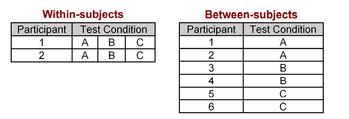

有些实验只适合使用被试内，比如；有些实验只能使用被试间，比如测量惯用手的迎新，人只有一种惯用手。

顺序效应只在被试内的条件下产生。如果一个实验人要参与多种条件，那么各种条件之间会形成学习效应，也被称作为order effects、learning effects、practice effects、fatigue effects、sequence effects。

一般可以用counter balancing（对重平衡）的方法消除。首先分成不同组，然后用Latin方阵进行指导。

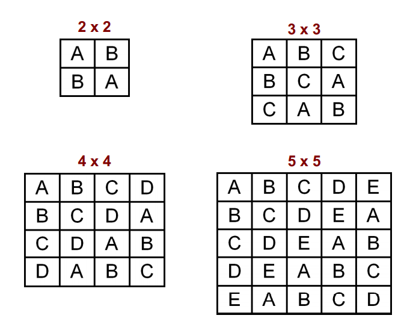

比如2个测试条件，可以分成两组，一组先做A再做B，一组先做B再做A。这种拉丁方阵不能保证两种测试条件先后顺序平衡，比如4x4的方阵中A在B前面有3次，B在A前面有1次，这样如果B的结果更好，就无法保证这不是A的练习效应的影响。

所以引入平衡拉丁方阵：

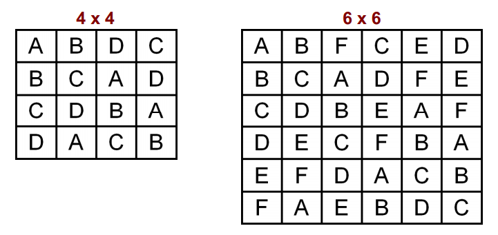

下面举个例子。假如想做一个实验，观察在编辑任务中，A、B、C三种方法是否在完成任务时间上有差异。现在使用被试内方法，12个实验者进行拉丁方阵，分成3组，每组4个人。实验结果如下：

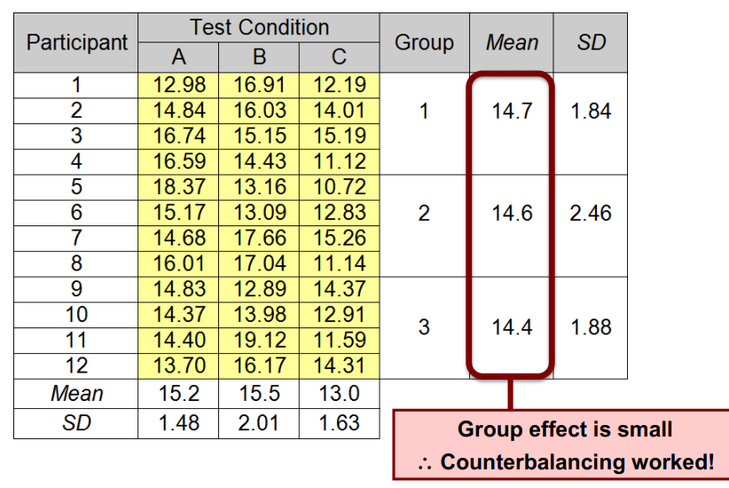

可以看到均值比较相似，所以拉丁矩阵的引入是有效的。

由于对于奇数，拉丁矩阵无法保证前后顺序的对应性，所以可以考虑使用全排列来消解。也可以使用完全随机的方法，比如通过投色子来选择测试顺序。

## Hypothesis Testing

我们现在如果想探讨：

>  完成任务所需要的时间使用方法A和方法B相比是不是更小？

现在相对结果进行假设检验。我们可以设计这样的空假设：

> 假设使用方法A和B在完成任务时间上没有显著差异（空假设，H0，原假设）

我们往往设计实验是为了发现差异。因此，假设检验多数期望是拒绝空假设。

假设检验大致可以分成两类。一类是参数化的，即数据分布是有假设的，例如数据服从正态分布。一类是非参数化的，对数据分布没有假设。多数情况下，根据数据类型来选择分析方法。

| 变量类型                        | 关系                                | 例子                         | 采用方法 |
| ------------------------------- | ----------------------------------- | ---------------------------- | -------- |
| 定类变量（=> Eq）               | 相等                                | 空调模式                     | 非参数化 |
| 定序变量（=> Ord, Eq）          | 顺序，相等                          | 受教育程度（1-5）            | 非参数化 |
| 定距变量（=>Ord, Eq，Sub）      | 顺序，相等，做差（0表示数值）       | 年龄区间（1-18，19-60，>60） | 参数化   |
| 定比变量（=>Ord, Eq, Sub, Div） | 顺序，相等，做差，做商（0表示没有） | 质量                         | 参数化   |

对于参数化的分析，一般使用Analysis of variance（ANOVA，方差分析）；对于非参数化的数据，一般使用$\chi^2$检验（定类变量）和其它的一些方法。

### ANOVA

ANOVA是最常见的实验方法，目的是**检验独立变量是否对依赖变量有显著效应**(determine if an independent variable has a  significant effect on a dependent variable)。换言之，也可以说是检验**测试条件变化的时候对依赖变量输出是否产生显著影响**(determine if the test  conditions yield different outcomes on the  dependent variable)。

一、被试内的方差分析

下面考虑一个单变量两个取值的例子：用方法A、B来完成某个任务，观察效果。

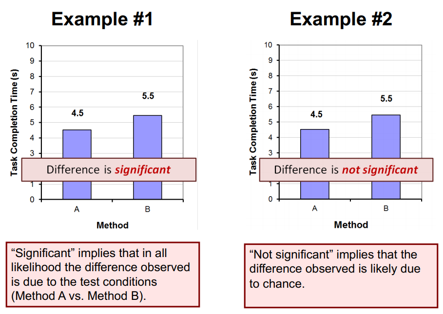

对于同样的图，我们却得到了不同的分析结果：第一个图中，使用方法A比方法B用时短，并且在统计学意义上有显著性差异。它的结果是这样的：

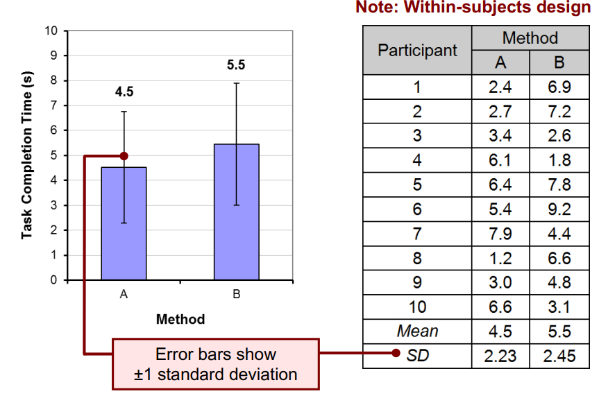

在图中，我们伸出了一个“长须”，作为“$\pm 1$标准差”。如果用均值，这个长须是标准差范围；而如果用中位数，这个长须代表四分位数。可以看到，第二组的标准差比较大，完成任务的时间差异比较大，所以均值不一定是由实验条件引起的，而是由实验人群引起的。假设检验分析的目标就是判断，究竟是由人群引起还是测试条件变化引起的？

假设有下面的命题：

> 方法A和B在完成的时间均值上没有差异

假设检验的过程就是接受或拒绝空假设。假如我们把上面的数据丢进SPSS分析，得到的结果是这样的：

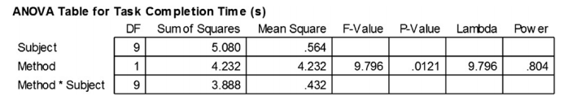

一般我们需要查表，事先确定一个显著水平，来和阈值对照。P Value就是计算得到的，代表的是原假设成立的概率；F是统计量，作用是支持P值的运算。比如，如果选的阈值是0.05，得到的P值小于0.05，就可以拒绝原假设。

这一过程可以用下面的句子来描述：

> The mean task completion time for Method A was 4.5 s. This  was 20.1% less than the mean of 5.5 s observed for Method B.  The difference was statistically significant ($F_{1,9} = 9.80$, $p < .05$).

我们不需要写出具体的$p$值，只需要写出关系。$F_{1,9}$中，$1$是`方法数-1`，称作效应；$9$是`(实验人群-1)`$\times$`(方法数-1)`得到的，称为残效。

这里有几个格式：

- $F, p$一个大写一个小写，采用斜体
- 等号两侧、逗号后侧、小于号两侧有空格
- 数字用小写、正体、小号字
- $F$取三位有效数字，阈值一般缺省整数部分

对于数据2，

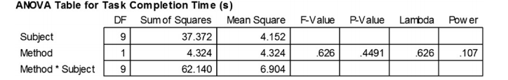

发现$P-Value$比阈值要大。这里可以写成ns，也可以写成$p > .05$。如果$F < 1$，那么没有显著性差异（Not Significant）；如果$F>1$，那么可能有显著性差异，但是不满足阈值，写成$p>.05$。

这个时候要用下面的句子来报告：

> The mean task completion times were 4.5 s for Method A and  5.5 s for Method B. As there was substantial variation in the  observations across participants, the difference was not  statistically significant as revealed in an analysis of variances  ($F_{1,9} = 0.626$, ns).

二、多测试条件

下面我们试着把测试条件变多。比如有4个测试条件、16个自由度，那么ANOVA表可能是

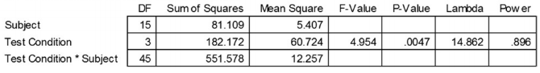

这个时候，$F_{3,45}=4.95, p<.005$，在统计学意义下有显著差异。

接下来还需要进行后此测试分析（Post Hoc Comparisons Tests）。如果是两个测试条件，显然是由这两个引起的；而如果是四个条件，就无法确定是由谁引起的。这里就是后此分析的作用。

可以使用Scheffé 分析。将其两两进行分析ANOVA分析，结果如下：

会发现，$A,C$和$B,C$有显著效应。

除此之外，还有Fisher PLSD, Bonferroni/Dunn, Dunnett, Tukey/Kramer,  Games/Howell, Student-Newman-Keuls, orthogonal contrasts等方法。

三、被试间的问题

接下来考虑被试间的问题。比如讨论惯用手的问题，得到如下数据

仍然进行ANOVA TEST。但是直接进行SPSS，会得到错误的结果，因为默认是被试内的。这里需要自己修改成被试间的问题。这里进行ANOVA的时候，F的效应数是$n-1$（$n$为测试条件数目），残效数是$m-n$（$m$是实验人群数量），这是和被试内差别最大之处。

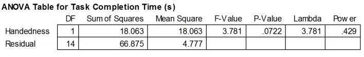

四、双因素分析

考虑有两个独立变量，一个是设备，一个是任务。设备有三个测试条件$D_1, D_2, D_3$，任务有两个测试条件$T_1, T_2$。实验人群如果是12，均采用被试内方法，那么列得结果如下：

然后可以得到一个$2\times 3$的表

接下来，做ANOVA分析

然后得到结论：

> The grand mean for task completion time was 15.4 seconds. Device 3 was the fastest at 13.8 seconds, while device 1 was the  slowest at 17.0 seconds. The main effect of device on task completion time was statistically significant ($F_{2,22} = 5.865,  p <.01$).  【设备显著性差异】The task effect was modest, however. Task completion time was  15.6 seconds for task 1. Task 2 was slightly faster at 15.3 seconds; however, the difference was not statistically significant  ($F_{1,11} = 0.076$, ns). 【任务显著性差异】The results by device and task are shown in Figure x. There was a significant Device × Task interaction effect ($F_{2,22} = 5.435, p < .05$), which was due solely to the difference  between device 1 task 2 and device 3 task 2, as determined by a Scheffé post hoc analysis. 【交叉效应引起显著性差异】

### Chi-Square Test

卡方检验主要用于测试定类数据，或者定序变量。

它所面对的数据往往是一个情形分析表，观测数据按照多个属性得来的频数分布表，比如完成某件事情的某一个人群的占比。

它主要是为了比较观测数据与期望数据。观测表是实验测试得到的，期望表则是希望得到有无显著性差异。比如问题是男性和女性在滑动桌面系统时在方法上是否有差异，结果如下

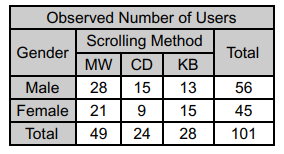

MW是鼠标滚轮，CD是点击拖动，KB是键盘。我们不能单从频率上确定男性比女性更常使用CD这个功能，而需要一个测试方法来看是否真的有显著性差异。

我们需要得到一张**期望值表**。这个期望值表的求法是从观测表计算，对于$(i,j)$的数值，那么对应的
$$
E(i,j) = \frac{\sum R_i \sum C_j}{rc}
$$
其中$r$是行数，$c$是列数，$R_i$是第$i$行之和，$C_j$是第$j$列之和。对上表进行运算，得到结果

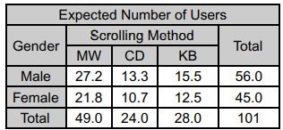

接下来，计算卡方表的数值
$$
\chi^2(i,j) = \frac{(E(i,j)-M(i,j))^2}{E(i,j)}
$$
其中$E(i,j)$为期望值，$M(i,j)$为原始值。对上表进行运算，得到结果

之后选定一个显著性水平，比如$0.05$。再确定自由度
$$
df = (r-1)(c-1)
$$
对于不同阈值，显著性水平表如下

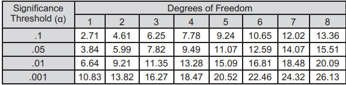

在上面的实验中，$df=(2-1)(3-1)=2$，所以查表得到数据是$5.99$。由于刚才计算的$\chi^2$是$1.462<5.99$，说明没有显著性差异。

再来看一个例子，验证老师、家长、学生在带手机上学态度上的差异。

$\chi^2=20.5,df=2$，在$\alpha=0.001$上有显著性差异。

### 非参数测试

对于非参数测试的方法，下表给出。

一、Mann-Whitney U

考虑下面的例子：Mac人和Windows人是否和政治倾向有影响？用1-10表示左倾和右倾。各选择10个人结果如下：

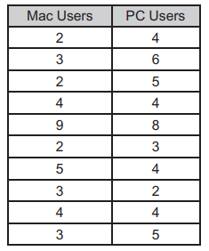

这个是一个被试间测试，并且只有2个人。所以使用Mann-Whitney U。

得到校正后的$p$值是$.14>.05$，所以可以认为没有显著性差异。

二、Wilcoxon Signed-Rank Test

假设一个媒体播放器的两种设计A,B对年轻用户更有吸引力？1表示相当不酷，10表示相当酷。对10个人用两个测试条件都进行实验，得到结论

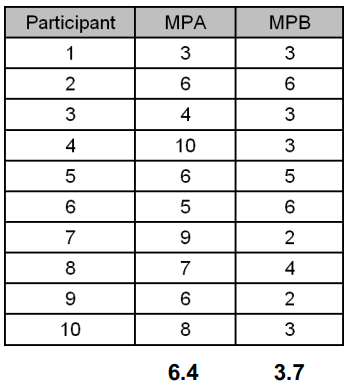

由于这是一个被试内问题，并且针对两个主体，所以使用Wilcoxon Signed-Rank Test。

$p=0.02<0.05$，可以认为A比B更具有吸引力。

三、Kruskal-Wallis Test

考虑年龄因素对某种新的GPS设备接受度是否有影响，从3个年龄段找8个用户，分别是20-29、30-39、40-49，用1-10表示购买欲望。结果如下

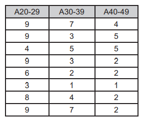

平均值是7.1、4.0、2.9，应该是有差异的。

$p=.0082<.01$，所以在是否接受上三类人群有显著性差异。

四、Friedman Test

有四种接口A,B,C,D，在搜索引擎搜索过程当中，是否会影响搜索质量？

首先找8个受试者，然后做一系列的实验，使用四种接口方式来搜索某个任务。用拉丁方阵混淆，然后用1-100评价使用结果。得到数据如下

四列的均值分别是71.0、68.1、60.9、69.8.这个数据是否有统计意义？结果如下

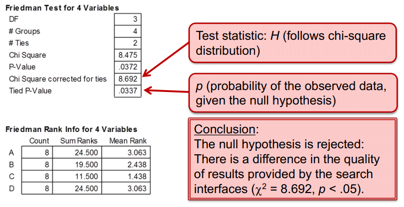

$p=.0337<.05$，所以可以说在$\alpha=.05$水平下符合。

当然，对于多条件，还是建议使用后此分析。

## CV for HCI

=======
# HCI

## Introduction

HCI, Human Computer Interaction

界定了人、机和二者之间的交互方式。

这种交互方式有一些量化指标来衡量，但是也有主观因素影响。

很多年前，人类就出现了，而1940s计算机出现了，HCI在1980年代出现了。这40多年人与计算机的交互是怎样的呢？在计算机出现早期，使用计算机的是少数，而使用者大多是计算机的设计者，所以对命令和操作非常熟悉。直到个人计算机的普及，任何人使用计算机成为可能，交互就变成了必然趋势。在其中可以看到人因工程和人类工程的影子。

人机交互是Human Factors的一个子集，关注于人与特定的计算机之间的交互。这与人的能力、性质有关，而在了解这些之后，我们才能设计一个更有效率、更有优势的系统。

人机交互这个领域与很多学科是有交叉的，需要心理学、计算机科学、社会学、认知科学、语言学等领域，如果要关注这一领域的发展，其职业背景非常丰富。

HCI model是一个概念性的东西，这里以经典的模型为例：

Sensors：人的传感器，接收信息的通道

Responders：人的响应器，对外输出的通道，比如语言、表情等

Brain：一切的指挥者

Displays：显示的部分，比如显示器、投影仪、VR头盔等，用作显示，对外传输信息到人

Controls：给计算机发送指令，人与计算机的桥梁，比如键盘、鼠标

Machine State：计算机的主机，核心处理组件，用于信息的加工分析

随着计算机性能的优化，作为大脑的计算机能力越来越强，发展可能性很多。

中间的Interface就是计算机-人与人-计算机的双向交流。

人机交互是一个年轻的领域，发展大致可以这样分析

- 1945 Vannevar Bush 万尼瓦尔布什 《As We May Think》 发表于二战结束之前，认为基础科学研究很大价值。这篇文章用来解释战争后科学的发展方向，和对战后数量增长的信息如何理解应用。报告中谈到了对信息资料的分析、处理、收集、筛选、个性化定制，在那个时代很超前。
- 1962 Ivan Sutherland 完成了一个Sketchpad，是一个类似手写板的设备，用光笔直接改变计算机上的几何图形。传统的计算机操作是指令式的单向交流，实现实时双向交互是很困难的。所以他提出了这种双向交流的模式，开创了直接可以操控的接口。他提出了一系列直接操控的特征：
  - 对可见物体的操纵
  - 连续的动作组成，需快速响应
  - 操作可反转、可拓展、可兼容
  - 将操控方式转变为动作
- 1963 Doug Engelbart 发明鼠标
- 1967 第一次在人机交互引入了人的实验 13个参与者，采用6种实验模式，在6种操控模式下对完成任务的量化指标进行了测量，观察不同设备下的性能，对实验结果进行了分析。很多研究问题都是基于这种实验框架验证的。
- 1981 Xerox Star 国际计算机会议上一些公司带了工作站前去，是第一款具有GUI的计算机，这些GUI与我们沿袭的图标比较相似，在当时引起了轰动。
- 1983 HCI诞生
  - 1983 ACM SIGCHI conference开始举办
  - Apple Macintosh 苹果电脑的发布和上市，是个人电脑普及的前端，计算机能被大众所认可，让大众使用成为可能。
  - 论文 The Psychology of Human-Computer Interaction, Card, Moran and Newell。同时作者提出了Model Human Processor（MHP）模型，将人看作了处理器，从信号的角度对人进行描述。
- 1983以后HCI蓬勃发展。许多交互技术的产生，并非短暂的灵光一现。比如2007年的Two-finger gestures，早在1978就有相应研究。所以很多研究成果是可以被产业应用的，引发一些新的潮流。

## Human Factor

人是在其中最为复杂的因素。人与人的差异性在人机交互的研究中，导致其问题定义较为复杂，所以我们常常限定在小的问题空间当中。我们充分考虑问题和任务的适用性，及问题的解决方案能否使用于特定用户。这里举几个例子：

- 用户记忆力对网站密码设计的影响
- 用户操作复杂程度对菜单项完整的影响
- 人打字的犯错程度对界面和键盘布局的影响
- 多任务处理能力对交互方式的影响

人机交互问题提出和解决，就需要更多了解人的特性，比如心理特性、社会特性。总结来说，就是要**更好的理解人**。

Newell 模型是很常见的一种描述性模型，即采用模糊的分类，而不是预测性模型那样的量化方法。人在操作界面和硬件设备的时候有操作时间和响应时间，Newell按时间尺度对人的行为进行了划分。

| 时间尺度  | 时间单元   | 系统           | 理论                                               |
| --------- | ---------- | -------------- | -------------------------------------------------- |
| $10^7$    | Months     |                | Social Band                                        |
| $10^7$    | Weeks      |                | 比如群体的建模，需要足够时间交互                   |
| $10^6$    | Days       |                |                                                    |
| $10^5$    | Hours      | Task           | Rational Band 以任务为层次，一般可以完成完整的任务 |
| $10^3$    | 10 min     | Task           | 比如网页浏览                                       |
| $10^2$    | Minutes    | Task           |                                                    |
| 10        | 10s        | Unit task      | Cognitive Band 认知层次，一般不能称为完整的任务    |
| 1         | 1s         | operation      | 比如屏幕触控                                       |
| 0.1       | 100ms      | Deliberate act |                                                    |
| $10^{-2}$ | 10ms       | Neural circuit | 心理学、认知科学领域                               |
| $10^{-3}$ | 1ms        | Neuron         | 一般不属于研究范围                                 |
| $10^{-4}$ | 100$\mu s$ | Organelle      |                                                    |

Newell模型为人机交互提供了一种研究方法学，即定量和定性。通常，在做高层（social等），一般采用定性的实验方式；而相对低层的（认知层次），采用准确率等定量方法比较合理。同时，它也是对问题空间的一个划分，可以根据时间尺度来对问题进行分类。

从功能角度，也可以把人划分为大脑、感知器和响应器。作为人而言，具有如下特性：

- 信息输入输出接口
  - 视觉、听觉、力的感应、运动等
- 信息的存储系统
  - 短时记忆、长时记忆
- 信息的处理应用
  - 推理、解决问题、整合
- 情感对人的能力的影响
- 人与人的差异性

下面分别讨论这些部分。

（1）感知器

人的感知器主要有五类：

- 视觉 vision
- 听觉 hearing
- 触觉 touch
- 嗅觉 smell
- 味觉 taste

前三者是最常见的研究对象，我们对这种感知基本原理和特点、性能进行讨论。

**视觉**

视觉占了人获取信息的80%以上，是非常重要的信息通道。视觉主要分成两个阶段：

- 底层生物信号接受，主要接受物理上的刺激等，比如光刺激进入人的眼睛
- 对刺激信号的处理和解释，比如对光信号进行一系列处理后形成解释

Cornea 眼角膜，为眼睛提供大部分的屈光力，可以让外界物体影像正确聚焦形成影像。

Iris 虹魔 位于角膜和晶状体之间，可以看到黑眼球。中间有圆孔，称为瞳孔（pupil），控制进入光线的强度。在光比较强的时候，瞳孔就会收缩，降低光的进入量。

Lens 晶状体 形状与作用与凸透镜相似，可以把远处的像清晰的投影到视网膜上，形成正确投影

Retina 视网膜 负责成像，上面有大量的神经结构，外界光线进入眼球就会形成刺激信号。中央凹（Fovea）是视网膜最敏锐的部分，有大量成像细胞分布，对成像影响很大，称为中心视觉。中央凹只占视网膜的1%，但是占据了50%的感知细胞，所以人成像最敏感的区域只有大致$1^\circ$的范围。这就是为什么我们往往需要转动瞳孔。

人眼是从光信号转变为电信号，通过神经元传给大脑，形成感知。光从物体反射而来，被人眼接收到，形成感知信号。由于透镜的像是倒立的像，所以视网膜上的像是倒立的。婴儿经过一周左右的时间，看到的像就从正立变成倒立。

心理学家曾经做过一个特殊的实验，戴一个眼睛让成像上下颠倒，形成实际的正立像，视场发生完全倒转，视觉与触觉、动觉错乱，移动困难，但是一周之后动作就较为协调，21天之后行动完全适应空间关系，世界再一次正过来了。

视网膜上的细胞分成杆状细胞和锥体细胞，前者对暗视觉有效，后者对充足光线时的彩色光线比较敏感。人眼通过神经结、神经元进行传递信号，也可能进行了底层的场景处理。

一个例子是，在交互界面的设计中，如果要设计警告信息，应该在屏幕左边，因为左边比右边更容易读。

对于光，我们用频率和强度进行定义；对于视觉，我们可以用颜色和亮度进行描述。

在能量谱中，人眼能感知到的比例是很小的。

对于亮度，亮度是对客观存在的光的主观反应，是比较定性的概念。

- 它受到物体本身亮度（luminance）的影响，这是锥体细胞特性决定的。
- 人只能描述可察觉的变化。计算机常使用256级灰度，因为这大概是人眼分辨级别的极限，所以人的精度是有效的。
- 如果信号存在闪烁，人眼敏感度会增加，导致亮度上升。人眼视网膜上的杆状细胞数量大，但是主要感知运动，在比较暗的情况下也可以接受刺激，所以能看到比较暗的情况下有物体运动。

想要让用户看清楚信息，一方面可以让信息亮一点，也可以多用一些闪烁的信号。

对于颜色，

- 比较直观的颜色描述是色调、强度和饱和度。强度是多少光被人眼感知，饱和度影响颜色的纯度，即纯红当中加入多少白光。这种颜色模型适合直接和人进行沟通，而在印刷等领域可能采用其它模型。
- 颜色感知是锥体细胞负责的，而锥体细胞分成三类，对不同波段光有其自己敏感的部分。这就是rgb的原理。
- 人眼对蓝色的敏感度是最低的，对红色敏感度比较高。警示信息常使用红色。
- 有8%的男性和1%的女性是色盲的，对颜色感知不敏感。要考虑颜色所包含的信息量会不会被特定人群忽略。

人在信号识别中还存在视觉补偿现象。一方面这源于视觉暂留，存在时间差；另一方面是运动补偿，将缺失的信息进行了补偿。此外，人眼存在亮度补偿和颜色补偿，后者也被称为“补色”。人眼为了防止看一种颜色的疲劳，所以长时间对着某种颜色，再看其他颜色就会影响观察。画家会有一些搭配原则，红色和绿色、蓝色和橙色等并非偶然而来。根据这种特性可以定义色相环，在环上存在许多互补色。

**视错觉**是很容易产生的一种现象，看到并不存在的东西。比如

三者其实亮度一样，但是常常觉得右边的更暗一些。这就是视觉对亮度的补偿。对于长度等都存在类似现象，造成人对场景物理属性感知出现偏差。

视错觉还可能产生语义上的歧义，人通过上下文解决。比如

我们并不会理解成B。

人们**阅读**文本的时候，一种有两种方式，一种叫定点阅读（Fixation），眼睛是固定的，可以获取准确的视觉信息，持续200ms以上。对于扫视和跳读（Saccade），为了让眼睛寻找目标，持续时间比较短，大约在120ms.比如对同一幅画，根据任务不同，人眼关注信息的模式是这样的

所以人观察场景是带着任务，需要定焦信息位置的。

人在做Saccade的时候，做的是直线运动，而做Fixations的时候，做的是一个圆。我们可以根据这种方式来研究用户行为，比如用户的阅读模式等。也可以应用在市场研究中，比如广告投放。

人的阅读分成这样一些阶段：

- 视觉模式感知
- 对字符的编解码，即对模式的解释
- 用知识对文字进行解读

阅读包括定点阅读和跳读，人获得信息的时候发生在定点阅读的时候，所以人获得的信息量是和定点阅读的时间相关联的，因此人的阅读数据是可以获得的。同时，文字形状对阅读是有影响的，比如一篇全是片假名的文章。人感知信息的处理时间需要包括人识别字符的时间。此外，如果文本显示在屏幕上，对比度也会有一定影响。

**听觉**

声音是对某种媒介压力周期性振动产生的现象。它往往由于物体发生移动震动而产生，比如敲门、波动吉他弦、洗牌、说话。

听觉主要提供环境的信息，比如距离、方向、物体种类。例如，有人说话，我们可以判断这个人的距离，人在哪里，是谁说话。

人感知声音的物理器官是耳朵，分成下面部分

- 外耳 可以放大声音信号
- 中耳 将声波信号转换成震动信号
- 内耳 与神经元联系，将声音信号转换成脉冲信号，传递给听觉神经元

我们常用三个量描述声音

- 音高，反应声音频率
- 音量，反应声音大小
- 音色，反应声音质量

但从人的感知而言，人更多使用定性描述。

人能听到的范围是20Hz-15kHz，对低频声音准确度更高，高频准确度更低。

人的听力系统能过滤声音，比如听家长的声音就会听不到。人可以自动增强感兴趣的声音，即“鸡尾酒会效应（the cocktail party phenomenon）”：两个人在嘈杂的鸡尾酒会上可以顺利的互相交流。

音色由不同物体振动的特点形成的，对应了声波的波形。对于乐器而言，相同频率的音调的音符也可能得到不同的感觉，经过训练的人也能发现其中差异。

**触觉**

触觉是人体感觉系统的一部分，可以对纹理、温度、阻抗、形状等都由感知。比如F和J键的突起，鼠标按键运动的阻抗，手机的振动等。

触觉提供了对环境的重要反馈。比如，从按键机向智能手机过渡中，按键的触觉反馈消失了，需要对应的反馈改变。

对特殊群体，比如视觉系统障碍者，触觉系统非常关键。很多产品需要印上盲文来方便使用。

刺激信号往往通过皮肤接受，比如压力感、疼痛感、温度等。同时，某些器官可能更加敏感，比如人的手指。在产品电子化的时代，我们也需要考虑有没有触觉所能及的商品，比如布料。

**嗅觉和味觉**

嗅觉由鼻腔感知，味觉由味觉系统感知。味道感知则混合了嗅觉和味觉两部分。这两种不属于人机交互的主要研究对象，因为量化描述比较困难。

（2）响应器

人处理完信息之后，需要对外发布信息。响应器就是对外发布信息的途径。比如，手指来进行文本的输入等。

这个图对应了大脑皮层区域，线段越长，说明控制能力越强。人手和嘴是最长的两部分，后者对应了语音发音。人手和语言构成了最复杂的两个区域。

人可以通过躯干来实现和计算系统的交互，比如键盘、按键机、遥控器、脚踏板、头部姿态等。

**偏手性**，也就是惯用手，对交互有比较大的影响。早期设备一般不考虑左撇子等，但是后来左右手切换等功能极大的促进了方便。偏手性有一系列指标来度量。

**发声**是一个系统工程，从人的肺发出气流到声音的发出，包含语音信号和非语言信号两部分，二者都可以作为计算机系统的输入。对系统而言，语音识别是一个非常大的挑战。非语音信号，比如发声长短、频率等。这些信号对计算机相对而言比较容易测量，但是对人记忆负担比较重。

（3）大脑

大脑是复杂的生物结构。它有很多神经元组成，这些神经元各司其职，完成各种任务。它可以让人深思熟虑（pondering）、记忆、回忆、推理、决策，虽然感知和响应是可见的输入输出，但核心过程还是由大脑完成的。

感知和响应的触发和处理是由大脑决定的。人的能力在大部分方面是远超过计算机的，比如感知（类似照相机获取外界信息，而无法进行处理分析）、创造力（计算机的创造往往是对数据的简单组合）、脑补能力（人不需要非常完整的信息就能补充出来其他信息，把离散的观测点串成合理的事件）。

感知是人实现这个功能的第一个步骤，比如听、看、触、闻、尝。这些感知都是定性的感知，但计算机往往可以定量的描述。对于人来说，这种输入是模糊的，所以模糊性、错觉等现象都会出现。视错觉、听觉上的上升错觉、触觉上的“幻肢”，都是这些现象的表示。

心理物理学是实验心理学的分支，通过实验的方法研究心理学问题。这个理论用定量方式来度量心理学现象，讨论物理刺激和感知的关系。一个经典的例子是，给不同灰度图像，当观察到差异的时候，讨论其灰度值，那么这一物理量就有了参考意义。这就是256阶灰度的来源。

韦伯给出过一个关系：
$$
\frac{\Delta \Phi}{\Phi} = Const.
$$
$\Delta \Phi$表示刺激的变化量，$\Phi$表示人的感知量。这种分析方式一直被沿袭到今天，仍被广泛采用。

其实验方法：

- 给出两个量
- 在物理上制造差异
- 随机的变化差异
- 给出一个**阈值**，判断是否能产生差异

由于这一结论一般有比较大的个体差异性，所以需要对数据进行一定处理。

在感知层面，感知一般是客观的，所以能借助某种仪器来观测。但是认知都发生在大脑内，所以很难获取工作过程中间变量，只能反推中间过程。比如，做决策需要多长时间呢？决策是什么时候做出的呢？究竟哪一个输入触发了决策过程？

有一个比较粗略的阶段：感知刺激 - 决策处理 - 响应。按照时间范围，大致是这样的：

光线进入到人眼、神经元信号的传递、任务处理过程、神经元传递、任务驱动行动等，这些时间加起来有一个大致的总时间，范围是非常广的。这还是仅仅针对简单任务而言，并且测量难度很高。

记忆是人大脑的重要功能，记忆分成长时记忆和短时记忆两类。比如深度学习中最火的LSTM，是长时和短时记忆的联合作用。人的记忆除了数据，还有很多抽象的表达，这是计算机不具备的。长时记忆分成显式的和隐式的，显示的一般针对客观世界存在的，比如物体和时间等，如苹果长什么样这类对物体的描述。隐式的记忆一般是对抽象过程的，比如怎么打开电视机。短时记忆类似于内存，只能在短时间内快速存储一些记忆，优势是非常快，短时记忆能力大致是$7\pm2$个unit的记忆范围。

除去二者之外，还有传感器的记忆，有一个短暂的停留，视觉暂留就是一个很典型的例子。摸到针被扎到了，这种记忆引发短时记忆，这种机制叫做Attention。人听到和看到的感观信息量很大，但是对什么信息进行记忆，实际上是有选择性的。就如同在课堂上听不懂老师讲课，只能记着中午吃啥。从短时记忆到长时记忆需要长期的Rehearsal，比如背单词。人的记忆确实是有规律可言的。

短时记忆是高速运转的暂存区域，存储速度约70ms，退化200ms，容量是$7\pm 2$ unit。`Millers experiment and magic number 7`是一个很经典的实验，将一系列随机的数字给测试人群，经过一段记忆之后，把数字写下来，再看准确的数字，来统计准确率，在60人样本下，得到的大约是这样：

随着横轴的增加，数字记忆的准确率会逐步下降。将一连串无关联的信息靠记忆力完全的记下来，这是非常困难的。对此的启示是，可以把数据整合成更大的存储单元来方便记忆。比如，`0011010101111001`可以记忆其十进制`3579`，这实际上是通过长时记忆扩充短时记忆。规律性也会对人的记忆有所帮助，`THECATRANUPTHETREE`就比`THE CAT RAN UP THE TREE`难以记忆。

比如做安卓开发，在`onCreate`里写了一堆，就很容易忘掉`onDestroy`中对应关闭。这是因为他们不属于一套流程，所以引入生命周期感知组件是由生理意义的。

长期记忆访问比较缓慢，大约需要`1/10s`，有大量容量。这其中分成两种类型，一种是对事件的序列记忆，比如电视剧的每一集。一种是概念化的结构化的记忆，比如数值分析。这种结构化记忆能最大利用存储空间，所以忘了就说明该忘。视觉的很大一个研究方向就是建立这种结构化描述，这些对推理认知更有帮助。一般来说，有语义的结构性记忆一般从序列化记忆中抽象而来。

这种结构化信息可以提供对信息的访问，可以支持推理，代表了信息之间的关系。这种模型可能类似一种图状结构，含有一些继承关系，通过这种图来推理。

长期记忆需要时间来重复，能记住的比例和回顾的时间是有关系的，记忆时间越长就越稳固。自带结构的信息更容易记忆。在这个记忆的过程中，一些新的信息会替换旧的信息。遗忘具有选择性，受到很多因素影响，情绪在剧烈波动的时候也会导致记忆出现偏差。

（4）不同模块的协同

人使用三个模型来系统完成整个任务。比如，系个鞋带，鞋带出现重叠和遮挡，这种空间关系对计算机是根本无法建模的。

人的速度和准确率有一定关系，一般速度越快，准确率就会变低。人机交互也需要在速度和准确性中取得平衡，比如鼠标的DPI，高DPI可能导致人的失误变多。

人具有很强的个体差异性，年龄、性别、记忆、动机，这些因素都会影响人完成某些任务的性能。人的差异性和表现出来的形成往往呈现正态分布，人是位于中间区域还是长尾区域，可以指导某些工作。

人的响应时间是对性能评价的常用指标，也就是单一刺激出现之后到有响应的时间差。例如，看到光就按按钮，这个过程实际上也是简单的认知过程。人的痛觉明显比嗅觉和视觉要长，最短的则是听觉。

对于需要响应的任务，提升的过程一般需要通过练习获得，比如通过多少练习会有比较明显的提升。医生通过机械手远程操控做手术，这种技能可以提升，但是操控这类顶端行为很难提升。

有些事情是不需要注意力的，即便不把焦点放在事情上，也可以完成某些任务。但多任务并行的时候，注意力就会变成一个影响因素，比如同时说话和打字。人的注意力可以分成两个类别，有些可以在同一时间完成多个任务，另一种注意力有选择性，人只能选择其中一个任务来完成。比如鸡尾酒会效应，在嘈杂的条件下也能听到人的说话声，能很准确的接收到这些信息。深度学习中很多人在尝试引入注意力模型，在场景当中辨识某些物体的类别，以一部分物体的关键像素来标明某个物体。人总是倾向于获取对判断最有用的知识，而不是不加筛选的引入。

人的错误是一个不可回避的问题。错误可以从很多方面来研究，比如实际输入和预期输入的偏离值。例如，在AR中，用户操作正确但是没有选中正确物体，发生了偏离。但是在交互任务中，出错更加复杂——例如全部错误和部分错误之辨。比如单词中有多少字母是敲对的，某些字母很容易出错，这就有助于对交互模式找到问题。

情感是非常复杂的，不同人有不同观点，研究也是比较初步的。我们经常期望从研究模态中找到情感，比如对文本的情感讯息进行提取。但是不论语音、文字、表情、肢体动作等各个层面去研究，准确率都很低。积极情绪下，操作行为的错误率会变低；而消极情绪有可能让简单的任务变得复杂。人不可能没有情绪，所以不会因此对性能产生影响。在交互设计的角度上讲，美观的界面设计等都可能有助于减轻压力，更好的完成任务。例如，安装软件的进度条可以带来很强的正反馈；携程的抢票概率上升会有积极的心态等。

## Interaction Elements

交互可以分成两类。一类是有目标的，比如烧CD；一类是无目标的，比如水群。

这部分的研究工作主要集中在认知阶段，也就是100ms-10s的范围内。在这个阶段适合实验性研究，可以做出准确的定量分析。常见的人因工程学主要研究操作端和显示端，也就是“knobs and dials”的问题。

计算机系统是一个复杂系统，由不同模块构成，影响交互体验和性能。

- 输入设备，比如文本和指向（在VR中）
- 输出设备，比如屏幕大小和墨水屏
- 虚拟现实，比如特定的交互和显示设备
- 物理交互，比如声音、力学反馈、生物感应
- 纸，常见的输入输出介质
- 处理，处理速度和通信机制
- ……

考虑一个典型的系统。显示器，屏幕，键盘，鼠标，数位板……这些典型系统模块都是有所变化的，呈现出来非常多样。这种多样性也给交互带来很大的困难，不同的媒介之间的转换对交互的要求是很强的。让人使用起来有一致性和舒适性、减轻记忆负担，才能达到比较好的体验。

电脑，智能电视，微波炉、洗碗机、炒菜机，智能空调，电子门铃，PAD，门禁卡，USB，车钥匙……这些中都有着计算系统在其中运行，这对交互来说很有挑战性。

人在闭环系统里，耐性是有限的，所以需要设备的高响应性和易于操控性。用户群体非常复杂，年龄段、性别、文化背景差异使用同样的功能，就需要考虑操控的效率。计算机性能提高之后，人对计算机要求也水涨船高，consistency、efficiency、comfortability、intensity是四个比较重要的量度。

Hard Controls和Soft Controls是两个不同层面。对于物理的、单目标的设备，操控是不可变的，操控可塑性比较差，这种操控就是硬操控。而在图形界面中，通过软件控制就构成了软操控。软操作既可以操控状态，也可以显示状态。典型代表就是Slider，既可以标识文本长度，也可以标识当前位置，同时可以操控进行拖动。GUI的可塑性很强，也能很密集的设置操控。比如，

在很小的区域内，就能排布20个操作。

控制和显示的关系，也称为映射，至少分为三种：

（1）空间关系

空间关系是操控对象和目标的空间联系。比如鼠标的映射关系

将$xOz$平面上的运动映射到$xOy$平面上。

在空间中，有6个自由度。人手想要和这些保持一致也是比较复杂的，比如google的街景操控机制。

CD增益是实际操控的操作和显示操作之间的倍数关系。假设控制器移动了2cm，但是在显示器上移动了4cm，那么CD就是2.一般我们用一个比例C:D ratio来表示。在某一阶段，CD为1:1，然后转换CD增益，就有可能实现非线性增益，比如鼠标的移动速度。

CD增益一直是热点话题，人们一直在探求一个合理的CD增益值。比如这张图

随着CD增益的增加，到达指定位置的指向时间也会变大。同时也有一个出错率的问题，人们期望找到一个最优化点，就是一个最优CD增益。这一点在不同操控动作和人身上会有很多差异。

人往往处于闭环系统之间，延迟就很重要。在某些操作中延迟可忽略，而某些操作就不可忽略，比如远程操控、系统调用外部资源响应、VR的计算。一个典型的例子是VR，画面质量太高会有明显延迟，质量低则会有不真实感。

操纵杆有两种类型，一类是等压的，对压力不感应，通过位移操控；一类也对压力进行感应。

关系分成两类，一种是自然的，另一种则依赖于群体模式、需要学习。比如

这种开关。

真实经历过的事情，人记忆往往更深刻。比如，车造型的购物车，和现实日历一样的日历App，Word的文本图标，这种真实世界的隐喻会带来更低的学习代价。

（2）动态关系

动态关系是控制器和响应器的关系，比如延迟。

（3）物理关系

物理关系是控制器运动和力的大小的反馈，比如thinkpad中间的红点。

模态（Mode）是对同一个按键的多种对应，比如电话的灯。CTRL、ALT、SHIFT和100个键，能切换出大约800种组合，这都是模态的一部分。另一方面，过多的模态容易造成高误操作率，比如insert键。

多个自由度需要足够多的模态，所以鼠标不能完成旋转操作。可以考虑把自由度分离，比如$xyz$可以分成三个$x,y,z$三个操作。

人类操作一般需要实时反馈。比如触摸屏上的胖手指现象，即按着时候容易遮挡其它键位。那么就可以引入偏移光标技术：

还有后面所引入的多点触控、加速度计等。

## Experiments

人机交互有一些独特的实验方式。

实验设计是是一个包括很多方面的过程，包括使用什么样的变量、用什么样的任务、多少实验人群等。

我们想验证任务设计情况，需要测量某些量来支持这些结论。我们观测的结果往往是由信号和噪声混杂而成，我们期望得到这样的信号，建立某种因果关系。信号就是一系列感兴趣的变量，噪声是除此之外的一切，实验设计就是为了增强信号，而尽可能降低噪声。

从方法论的角度来讲，核心就是如何设计和实施实验。方法论非常关键，2012年Allen Newell曾经说过：

> Science is method. Everything else is commentary.

17世纪，德国的奥古斯都二世让一个炼金术士制造瓷器。这个炼金术士花费十数年终于造出了第一片瓷器，而他在实验的基础之上，做了一系列的实验记录。这样的记录让瓷器制造的复现达到可能，而反过来在瓷器发源地在中国，很多独门秘传的技艺早已失传。技术的快速进步需要大量实验，更需要实验的记录和积累，也需要定量分析来保证品质的稳定，其核心就是控制所有可能控制的变量。

人机交互的实验方式有很多种，主流的是实验分析，也叫实验研究。这种研究方法主要来自实验心理学，得到了广泛应用。

具体来说，方法论主要有：

- 充分的论证，而不是因为看起来正确就是正确
- 在有人参与的部分要遵从实验的标准

APA(American Psychological Society)是美国的一个推动心理学研究的组织，1919年颁布了手册*Publication Manual of APA*给出了一些实施实验的基本方法，关系到实验人群和数据报告。这这个手册大多被HCI方向主要刊物所推荐。

伦理学在人机交互中很早就被提及，人机交互不可避免涉及到人的实验和动物的实验，所以伦理许可是非常关键的。一些比较规范的交互机构会有专门的伦理学部门来审核，提交研究方法、风险和收益、参与人员权利声明等。人机交互的实验过程中，需要确保实验人员的安全和自尊。

> Researchers must repeat the safety, welfare, and dignity of human participants in their research and treat them equally and fairly.

### Variables

首先需要明确实验变量。在实验过程中需要哪些量，如何定义？比如制作一种新的交互的键盘，是否能产生更好的输入性能？对问题的验证要可数值化描述。

这里的核心是两类变量。一类叫做独立变量(independent variable, IV)，一类叫做依赖变量(dependent variable,DV)。

**独立变量**可以是某种环境因素，也可以是某种特性。这种变量独立于实验人群，通常是可被操控的，否则没有意义。比如，键盘是否印字母对人的输入有没有影响，那么独立变量就可以是键盘的状态，我们可以给两个键盘，一个印了字母、一个没有印字母。两类键盘输入同样文字进行观察，对性能是否可以量化会造成影响。

这里的独立是指独立于实验人群的行为，也就是不管人群做什么也不会发生改变。接口（GUI、文字等），设备（鼠标、探针、滚球等）、响应模式（亮光、声音等）、键位布局（电梯按钮）、年龄（少年、青年）、性别、背景噪声、专业技能等。独立变量和因子是同义词。

**测试条件**对应于独立变量，实际就是独立变量的取值，也称为水平(level)、设置(settings)。比如：

| Factor           | Levels                     |
| ---------------- | -------------------------- |
| Device           | mouse, trackball, joystick |
| Feedback mode    | audio, tactile, none       |
| Task             | pointing, dragging         |
| Visualization    | 2D, 3D, animated           |
| Search interface | Google, custom             |

人的属性往往是一些自然属性。比如性别，年龄，体重，用手习惯等。这些特性往往不可控，所以在实验人群中就要考虑是同一个人参与不同实验还是不同人参与同一实验。由于人的复杂性，虽然我们只想关注性别的影响，但这个过程中往往会引入不可避免的混淆变量，让想观察的变量与结果之间的关系变得模糊。这就需要一些手段来控制混淆变量。

如果要确定一个独立变量，就需要明确的指出什么是独立变量、什么是独立变量的测试条件。否则就会被扣分。当独立变量的名字确定之后，就尽可能不要改变。

IV的数量当然是越多越好，但这是不现实的。一般来说，在任务的完成过程需要至少一个独立变量，也可能是2个或3个。当独立变量增多，一次实验就可以观察到很多效应，但与此同时实验可能产生的效应数量也会急剧增加，假设检验就会无法支持实验分析。

如果A发生变化，E发生变化，A对E造成影响；如果A发生变化，E不发生改变，A对E不造成影响。把A看成自变量，E看成因变量，就可以看成A对E有**效应**。如果两个独立变量A、B，A的变化不仅影响E的变化，也会影响B的变化，比如A是交互方式、B是环境光线，A包括声音和键盘两种交互方式，B包括亮暗两种，那么二者就会有一定联系，也就是 **交互效应**。不管有多少种独立变量，在多种独立变量都考虑的前提下分析的效应就是主效应。

| 独立变量数 | 主效应数 | 2元交互效应 | 3元交互效应 | 4元交互效应 | 5元交互效应 | 总数 |
| ---------- | -------- | ----------- | ----------- | ----------- | ----------- | ---- |
| 1          | 1        | -           | -           | -           | -           | 1    |
| 2          | 2(10,01) | 1(11)       | -           | -           | -           | 1    |
| 3          | 3        | 3           | 1           | -           | -           | 7    |
| 4          | 4        | 6           | 3           | 1           | -           | 14   |
| 5          | 5        | 10          | 6           | 3           | 1           | 25   |

**依赖变量**测量用户行为，比如任务完成时间、速度、准确率、错误率，都是数值可描述的。如果定义一个情绪，那么这样的依赖变量根据不同独立变量取值不容易发现变化，所以这种设计意义不大。

依赖变量有时候需要天马行空的想象。比如要测量老人机和华为手机玩王者荣耀的难度，可以等价于人的消极表情变化，比如摇头、皱眉等。

接下来要进行数据收集。比较理想的情况下可以用某些测量工具，比如`getKeyDown`。实验要提前计划，从第一步到最后一步的计划都要详细敲定。必须开展小规模实验，测试整个流程有没有问题、数据分析有没有问题，小规模数据揭示的问题一定会在大规模实验暴露出来。

命名：TextInputHuffman-P01-D99-B06-S01.sd1

在数据文件中要给出说明：

**控制变量**可能也会影响独立变量。控制变量是实验中保持的常量，以维护独立变量的效应，我们需要尽可能控制其他变量不变。控制变量越多，产生结果的可靠性越强，但同时实验的可泛化性也越差。我们希望实验有尽可能多的泛化性，来保证不同人群的适应性。一个典型的例子是，字体颜色和背景颜色对人理解文字有没有影响？独立变量是字体颜色和背景颜色，而依赖变量是阅读理解的能力，比如阅读测试的分数。这里就可以控制变量，比如字体大小、类型、环境光等。

**随机变量**通常指环境因素，在实际过程中让某些环境因素随机发生，那么这些控制变量都可以变成随机变量。比如前述测试中，随机的字体大小、光线等。随机变量会对结果变得不稳定，但是如果关系成立，可以提高结果的泛化性。比如，现在想测试站姿对打LoLK的影响，独立变量是站姿，依赖变量是miss数，随机变量可以是有没有打过IN，也可以是有没有打过达人王，也可以是有没有喝希腊进口奶啤。如果在不同随机变量都能得到类似结果，说明结果有一定泛化性。                                                                                                                                                                                                                                                                                                                                                                                                                                                                                                                                                                                                                                                                                                                                                                                                                                                                                                                                                                                                                                                                                                                                                                                                                                                                                                                                                                                                                                                                                                                                                                                                                                                                                                                                                                                                                                                                                                                                                                                                                                                                                                                                                                                                                                                                                                                                                                                                                                                                                                                                                                                                                                                                                                                                                                                                                                                                                                                                                                                                                                                                                                                                                                                                                                                                                                                                                                                                                                                                                                                                                                                                                                                                                                                                                                                                                                                                                               

控制变量和随机变量之间的妥协是一种内在效度(Internal validity)和外在效度(External validity)的妥协，实验不具有外在效度，那么实验是不具有泛化性的；如果没有有效的内在效度，不能得到很好的结论。

**混淆变量**也是一个环境因素，在实验中系统性变化。比如眼球跟踪的应用在完成任务时间方面是否和摄像机距离远近有关，独立变量是摄像机距离，测试条件是远近。在控制摄像头距离的时候，使用的设备是不同的，导致参数会有所差异，这就是一个混淆变量。比如摄像头A很敏感，B很不敏感，那么我们就可能无法确定结论的引发因素。这个时候可能就需要做进一步分析，比如从摄像头参数分析能否产生影响。

混淆变量很多时候不容易说清楚能否产生影响，所以实验设计一般回避这些条件。

### Task, Procedure and Participants

通过改变独立变量的取值，期望在某种交互任务下影响人的性能差异，那么实验任务就是为了引起变化。任务的质量主要集中在两方面：是否有**代表性**？是否有**可区分性**？代表性是能否代表某一类操作过程，比如测试键盘要设计使用的典型产品；可区分性是要充分体现差异，比如某个设备能提升小写字母的输入，而实验全是大写字母，就无法很好的得到结果。

设计实验的时候，往往越贴近实际越好。比如键盘的任务是做文本输入，这个过程往往需要获取输入来源，这就是前置任务。敲得时候会有校正和反馈，这些都镶嵌在任务过程中，包含了很多子任务。

任务需要验证某些结论，如果不能验证，则需要换任务或观测量。比如一种新的图形方法对输入公式是否有效，检验任务就是输入某个公式。再比如一个新的GPS设备，可以比较文字反馈和声学反馈的影响。很多时候问题的因素是多样性的，需要找到可靠有效的任务方式。

与知识有关的任务是很特殊的。有些任务和技能有关系，比如插入公式，插入第一次的时候可能已经获取了插入公式的技能，而插入第二次获得了更好的性能。再比如搜索爱因斯坦的生日，考察搜索引擎的易用性，可以在第一个引擎搜索爱因斯坦的生日，第二个引擎搜索莎士比亚的忌日，设计类似的任务，但是避免引入学习能力。

实验的过程包括整个实验，比如实验间隔、对实验内容的介绍、实验时间、问卷。

开始的说明要确保对每个人都是一样的，比如一整套标准的说明流程，如视频或文字等。尽可能避免解释，来获得相同的前置信息。

对于实验人群，我们一般希望具有随机性，但是这往往很难满足，因为实验报酬很少，人群也有限。一般可以控制一些比例，比如性别基本上均衡。

实验人群如果太少，必然无法得到有效的结论，也就是不具有统计显著效果。实验人群如果太多，找到了统计学意义的差异，那么容易被质疑。一般有效的建议是找类似工作的实验人群，比如15-30之间。

### Questionnaire

问卷是人机交互最常用的方式，一般用于收集某种信息，并给出某些反馈。用户在做完反馈之后会有一些使用体验，这些体验往往是语言描述，很难定量描述。

问卷有很多种方式，比如：

- 等比量数据，比如直接写出年龄。这样的表可以比较大小和运算，有数值的大小定义。
- 分类量表，比如写出年龄范围。这样的通常用来计数，比如统计小于20岁的人数。它比较粗糙，不能做均值方差。
- 开放性问题，一般是启发型的，用于反馈。
- 封闭型问题，给出若干选项，以计算频率为主，但是不能做方差和均值分析。

在用户反馈上，可以使用Likert量表（NASA Task Load Index，NASA TLX）

其本身数值没有意义，有的是大小关系。问题的分数的加和一般对应一个结论，比如对xp的调查表，xp的奇怪程度不能依据单个xp决定，而需要多个xp加起来。ISO9241-9对其进行了标准化。

### Within-subjects and between subjects

这里要区分被试内（within subjects）和被试间（between subjects）。被试内是，每个参与者都对多种实验条件进行测试，但是这样可能会引入顺序效应；被试间是，每一个测试人只参与一种测试条件，被试间需要的人很多，但是不会引入顺序效应。

有些实验只适合使用被试内，比如；有些实验只能使用被试间，比如测量惯用手的迎新，人只有一种惯用手。

顺序效应只在被试内的条件下产生。如果一个实验人要参与多种条件，那么各种条件之间会形成学习效应，也被称作为order effects、learning effects、practice effects、fatigue effects、sequence effects。

一般可以用counter balancing（对重平衡）的方法消除。首先分成不同组，然后用Latin方阵进行指导。

比如2个测试条件，可以分成两组，一组先做A再做B，一组先做B再做A。这种拉丁方阵不能保证两种测试条件先后顺序平衡，比如4x4的方阵中A在B前面有3次，B在A前面有1次，这样如果B的结果更好，就无法保证这不是A的练习效应的影响。

所以引入平衡拉丁方阵：

下面举个例子。假如想做一个实验，观察在编辑任务中，A、B、C三种方法是否在完成任务时间上有差异。现在使用被试内方法，12个实验者进行拉丁方阵，分成3组，每组4个人。实验结果如下：

可以看到均值比较相似，所以拉丁矩阵的引入是有效的。

由于对于奇数，拉丁矩阵无法保证前后顺序的对应性，所以可以考虑使用全排列来消解。也可以使用完全随机的方法，比如通过投色子来选择测试顺序。

## Hypothesis Testing

我们现在如果想探讨：

>  完成任务所需要的时间使用方法A和方法B相比是不是更小？

现在相对结果进行假设检验。我们可以设计这样的空假设：

> 假设使用方法A和B在完成任务时间上没有显著差异（空假设，H0，原假设）

我们往往设计实验是为了发现差异。因此，假设检验多数期望是拒绝空假设。

假设检验大致可以分成两类。一类是参数化的，即数据分布是有假设的，例如数据服从正态分布。一类是非参数化的，对数据分布没有假设。多数情况下，根据数据类型来选择分析方法。

| 变量类型                        | 关系                                | 例子                         | 采用方法 |
| ------------------------------- | ----------------------------------- | ---------------------------- | -------- |
| 定类变量（=> Eq）               | 相等                                | 空调模式                     | 非参数化 |
| 定序变量（=> Ord, Eq）          | 顺序，相等                          | 受教育程度（1-5）            | 非参数化 |
| 定距变量（=>Ord, Eq，Sub）      | 顺序，相等，做差（0表示数值）       | 年龄区间（1-18，19-60，>60） | 参数化   |
| 定比变量（=>Ord, Eq, Sub, Div） | 顺序，相等，做差，做商（0表示没有） | 质量                         | 参数化   |

对于参数化的分析，一般使用Analysis of variance（ANOVA，方差分析）；对于非参数化的数据，一般使用$\chi^2$检验（定类变量）和其它的一些方法。

### ANOVA

ANOVA是最常见的实验方法，目的是**检验独立变量是否对依赖变量有显著效应**(determine if an independent variable has a  significant effect on a dependent variable)。换言之，也可以说是检验**测试条件变化的时候对依赖变量输出是否产生显著影响**(determine if the test  conditions yield different outcomes on the  dependent variable)。

一、被试内的方差分析

下面考虑一个单变量两个取值的例子：用方法A、B来完成某个任务，观察效果。

对于同样的图，我们却得到了不同的分析结果：第一个图中，使用方法A比方法B用时短，并且在统计学意义上有显著性差异。它的结果是这样的：

在图中，我们伸出了一个“长须”，作为“$\pm 1$标准差”。如果用均值，这个长须是标准差范围；而如果用中位数，这个长须代表四分位数。可以看到，第二组的标准差比较大，完成任务的时间差异比较大，所以均值不一定是由实验条件引起的，而是由实验人群引起的。假设检验分析的目标就是判断，究竟是由人群引起还是测试条件变化引起的？

假设有下面的命题：

> 方法A和B在完成的时间均值上没有差异

假设检验的过程就是接受或拒绝空假设。假如我们把上面的数据丢进SPSS分析，得到的结果是这样的：

一般我们需要查表，事先确定一个显著水平，来和阈值对照。P Value就是计算得到的，代表的是原假设成立的概率；F是统计量，作用是支持P值的运算。比如，如果选的阈值是0.05，得到的P值小于0.05，就可以拒绝原假设。

这一过程可以用下面的句子来描述：

> The mean task completion time for Method A was 4.5 s. This  was 20.1% less than the mean of 5.5 s observed for Method B.  The difference was statistically significant ($F_{1,9} = 9.80$, $p < .05$).

我们不需要写出具体的$p$值，只需要写出关系。$F_{1,9}$中，$1$是`方法数-1`，称作效应；$9$是`(实验人群-1)`$\times$`(方法数-1)`得到的，称为残效。

这里有几个格式：

- $F, p$一个大写一个小写，采用斜体
- 等号两侧、逗号后侧、小于号两侧有空格
- 数字用小写、正体、小号字
- $F$取三位有效数字，阈值一般缺省整数部分

对于数据2，

发现$P-Value$比阈值要大。这里可以写成ns，也可以写成$p > .05$。如果$F < 1$，那么没有显著性差异（Not Significant）；如果$F>1$，那么可能有显著性差异，但是不满足阈值，写成$p>.05$。

这个时候要用下面的句子来报告：

> The mean task completion times were 4.5 s for Method A and  5.5 s for Method B. As there was substantial variation in the  observations across participants, the difference was not  statistically significant as revealed in an analysis of variances  ($F_{1,9} = 0.626$, ns).

二、多测试条件

下面我们试着把测试条件变多。比如有4个测试条件、16个自由度，那么ANOVA表可能是

这个时候，$F_{3,45}=4.95, p<.005$，在统计学意义下有显著差异。

接下来还需要进行后此测试分析（Post Hoc Comparisons Tests）。如果是两个测试条件，显然是由这两个引起的；而如果是四个条件，就无法确定是由谁引起的。这里就是后此分析的作用。

可以使用Scheffé 分析。将其两两进行分析ANOVA分析，结果如下：

会发现，$A,C$和$B,C$有显著效应。

除此之外，还有Fisher PLSD, Bonferroni/Dunn, Dunnett, Tukey/Kramer,  Games/Howell, Student-Newman-Keuls, orthogonal contrasts等方法。

三、被试间的问题

接下来考虑被试间的问题。比如讨论惯用手的问题，得到如下数据

仍然进行ANOVA TEST。但是直接进行SPSS，会得到错误的结果，因为默认是被试内的。这里需要自己修改成被试间的问题。这里进行ANOVA的时候，F的效应数是$n-1$（$n$为测试条件数目），残效数是$m-n$（$m$是实验人群数量），这是和被试内差别最大之处。

四、双因素分析

考虑有两个独立变量，一个是设备，一个是任务。设备有三个测试条件$D_1, D_2, D_3$，任务有两个测试条件$T_1, T_2$。实验人群如果是12，均采用被试内方法，那么列得结果如下：

然后可以得到一个$2\times 3$的表

接下来，做ANOVA分析

然后得到结论：

> The grand mean for task completion time was 15.4 seconds. Device 3 was the fastest at 13.8 seconds, while device 1 was the  slowest at 17.0 seconds. The main effect of device on task completion time was statistically significant ($F_{2,22} = 5.865,  p <.01$).  【设备显著性差异】The task effect was modest, however. Task completion time was  15.6 seconds for task 1. Task 2 was slightly faster at 15.3 seconds; however, the difference was not statistically significant  ($F_{1,11} = 0.076$, ns). 【任务显著性差异】The results by device and task are shown in Figure x. There was a significant Device × Task interaction effect ($F_{2,22} = 5.435, p < .05$), which was due solely to the difference  between device 1 task 2 and device 3 task 2, as determined by a Scheffé post hoc analysis. 【交叉效应引起显著性差异】

### Chi-Square Test

卡方检验主要用于测试定类数据，或者定序变量。

它所面对的数据往往是一个情形分析表，观测数据按照多个属性得来的频数分布表，比如完成某件事情的某一个人群的占比。

它主要是为了比较观测数据与期望数据。观测表是实验测试得到的，期望表则是希望得到有无显著性差异。比如问题是男性和女性在滑动桌面系统时在方法上是否有差异，结果如下

MW是鼠标滚轮，CD是点击拖动，KB是键盘。我们不能单从频率上确定男性比女性更常使用CD这个功能，而需要一个测试方法来看是否真的有显著性差异。

我们需要得到一张**期望值表**。这个期望值表的求法是从观测表计算，对于$(i,j)$的数值，那么对应的
$$
E(i,j) = \frac{\sum R_i \sum C_j}{rc}
$$
其中$r$是行数，$c$是列数，$R_i$是第$i$行之和，$C_j$是第$j$列之和。对上表进行运算，得到结果

接下来，计算卡方表的数值
$$
\chi^2(i,j) = \frac{(E(i,j)-M(i,j))^2}{E(i,j)}
$$
其中$E(i,j)$为期望值，$M(i,j)$为原始值。对上表进行运算，得到结果

之后选定一个显著性水平，比如$0.05$。再确定自由度
$$
df = (r-1)(c-1)
$$
对于不同阈值，显著性水平表如下

在上面的实验中，$df=(2-1)(3-1)=2$，所以查表得到数据是$5.99$。由于刚才计算的$\chi^2$是$1.462<5.99$，说明没有显著性差异。

再来看一个例子，验证老师、家长、学生在带手机上学态度上的差异。

$\chi^2=20.5,df=2$，在$\alpha=0.001$上有显著性差异。

### 非参数测试

对于非参数测试的方法，下表给出。

一、Mann-Whitney U

考虑下面的例子：Mac人和Windows人是否和政治倾向有影响？用1-10表示左倾和右倾。各选择10个人结果如下：

这个是一个被试间测试，并且只有2个人。所以使用Mann-Whitney U。

得到校正后的$p$值是$.14>.05$，所以可以认为没有显著性差异。

二、Wilcoxon Signed-Rank Test

假设一个媒体播放器的两种设计A,B对年轻用户更有吸引力？1表示相当不酷，10表示相当酷。对10个人用两个测试条件都进行实验，得到结论

由于这是一个被试内问题，并且针对两个主体，所以使用Wilcoxon Signed-Rank Test。

$p=0.02<0.05$，可以认为A比B更具有吸引力。

三、Kruskal-Wallis Test

考虑年龄因素对某种新的GPS设备接受度是否有影响，从3个年龄段找8个用户，分别是20-29、30-39、40-49，用1-10表示购买欲望。结果如下

平均值是7.1、4.0、2.9，应该是有差异的。

$p=.0082<.01$，所以在是否接受上三类人群有显著性差异。

四、Friedman Test

有四种接口A,B,C,D，在搜索引擎搜索过程当中，是否会影响搜索质量？

首先找8个受试者，然后做一系列的实验，使用四种接口方式来搜索某个任务。用拉丁方阵混淆，然后用1-100评价使用结果。得到数据如下

四列的均值分别是71.0、68.1、60.9、69.8.这个数据是否有统计意义？结果如下

$p=.0337<.05$，所以可以说在$\alpha=.05$水平下符合。

当然，对于多条件，还是建议使用后此分析。

## CV for HCI

CV狗都不听