# 数据库

## 数据库系统引论

### 数据管理系统的发展

数据管理：对数据分类、组织、编码、存储、检索、维护

发展：人工管理、文件系统、数据库系统

- 40-50年代 人工管理 数据不保存，没有专门软件管理数据，应用程序完全依赖于数据，数据不能共享
- 50年代末-60年代中 文件系统阶段 硬件有磁盘磁鼓，数据可以长期保存，数据面向应用，数据冗余度大，缺乏统一控制
- 60年代末 数据库系统阶段 有大容量磁盘和数据库管理系统
  - 1968 IBM研究世界上第一个商品化数据库管理系统IMS
  - 1969 网状数据模型报告DBTG
  - 1970 关系模型的论文提出
  - 主要特征：数据结构化；独立性高：独立性体现在物理独立性和逻辑独立性，通过数据库系统所提供的二级映像的实现；减少数据冗余：数据面向系统，集中管理；数据共享；统一的数据保护功能

### 数据库

数据库是长期存储在计算机内，有组织的数据集合，根据数据间的联系组织在一起，具有较高的数据独立性，减少数据冗余，能够为各种用户共享。

数据库需要一个软件系统统一管理，这个软件系统是数据库管理系统（DBMS）

### 数据模型

模型方法是一种抽象表示，把表示事物的主要特征抽象的用一种形式化的描述反映。数据模型是将事物之间的联系，转化为数据和数据间的联系。

数据模型是数据特征的抽象，包含三个要素：

- 数据结构，对数据静态特征的描述
- 数据操作，对数据动态特性的描述
- 数据的完整性约束，数据间的制约和依存关系

概念模型不涉及信息在计算机的表示，面向用户，只要用户需求不变，概念模型也不变。狭义的数据模型是按照计算机系统的观点建模，又包含两个部分

- 逻辑数据模型：用户看到的数据模型
- 物理数据模型：数据存储结构和存取方法

数据结构是最重要的部分，不同数据模型由数据结构来表征。

### 数据库系统结构

数据库系统中，用户可以逻辑地、抽象地处理数据，而不必考虑数据在计算机中如何组织、存放。

数据库系统结构是一个多级结构，方便用户存取数据，同时高效地组织数据，以最佳形式在物理存储器存放。

数据库系统分成三个层次，称为三级结构：


- 模式，也叫逻辑模式， 是全体数据的逻辑结构和特征的描述
- 外模式，是数据库用户能看见的最终表示。外模式是模式的子集，一个数据库可以有多个外模式，不同用户有不同外模式。外模式与应用也是一对多的关系。外模式是保护数据库安全的措施，用户只能看见或访问外模式的数据。
- 内模式，也称存储模式，是数据物理结构和存储方式的描述，一个数据库只有一个内模式。

总的来说，三级模式是对数据的视图级、概念级、物理级的抽象级别。

三级模式之中有两级映像。这种映像目的是数据库内部实现三个抽象层级的联系和转化。

- 外模式与模式之间的映像，定义局部数据逻辑结构和全局逻辑结构的对应关系。当模式结构改变，只需要修改外模式与模式的对应关系，不必修改外模式的局部逻辑结构，实现数据逻辑独立性；

- 模式与内模式之间的映像，定义全局数据逻辑结构和物理数据存储间的对应关系。当物理存储结构改变的时候，仅需要修改模式与内模式间的影响关系，而使模式保持不变，实现数据的物理独立性。

### 数据库管理系统

其功能有

- 定义功能。包括模式定义、外模式定义、内模式定义。
- 操纵功能。
- 保护功能。包括安全性、完整性、并发控制、恢复。
- 维护功能。包括转储、数据装入、统计、存储等。


### 数据库系统的不同试图

其人员分成四类：数据库管理员、系统分析员、应用程序员、用户。

不同人员设计数据抽象级别不同。

- 数据库管理员，决定数据库存储结构和策略
- 系统分析员，涉及需求分析
- 设计人员，确定数据库的数据和各级模式
- 应用程序有，编码实现
- 用户，使用系统

### 数据库技术的发展

- 第一代60年代末研制的层次、网状数据库系统
- 第二代关系数据库系统，现在仍占据主流
- 围绕面向对象数据模型的研究，OODBMS

## 数据模型

数据模型是对现实世界数据信息的抽象和表示，分成概念模型和数据模型，对应用户观点的数据模型和狭义的物理存储上的数据模型。

本章主要介绍概念模型和逻辑数据模型，核心是E-R概念模型。对四种逻辑模型只做简单介绍，在第三章重点介绍关系模型。

### E-R概念模型

概念模型是对信息世界的建模，是数据库设计的有力工具。它需要较强的语义表达能力，简单清晰、易于理解。

一、E-R模型中的基本概念

实体：客观存在并可相互区别的事物实体可以是具体对象，比如一个学生，一本书；也可以是抽象的概念或联系，比如一堂课。

属性：实体所具有的某一特征。一个实体可以由若干属性刻画，有类型和值的区分。类型是属性名，值是属性的具体内容。

联系：在现实世界中，事物内部以及事物之间是有联系的。在信息世界中，常被抽象为**实体内部的联系**和**实体之间的联系**。内部的联系是组成实体各属性的联系；之间的联系是不同实体集之间的联系。

实体之间的联系最简单的是两个实体之间的联系：

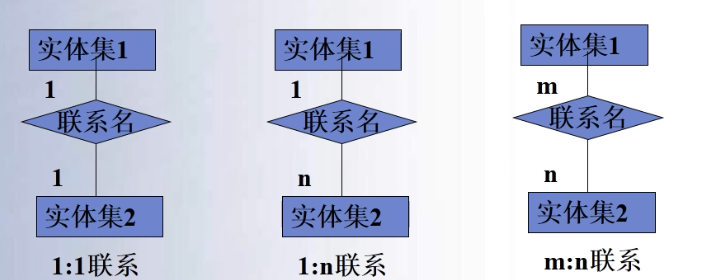

一对一联系：A中的一个实体至多与B的一个实体相对应

一对多联系：A中的一个实体与B中的多个实体相对应，反之B的一个实体至多与A的一个实体相对应

多对多联系：A、B中一个实体与另一个实体集多个实体联系

多个实体间也可以存在联系，称为 **多元联系**。例如

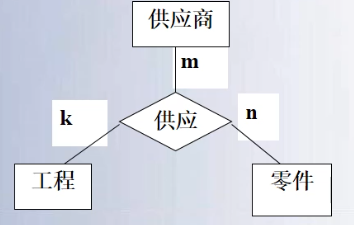

这样的联系称为`m:n:p`。

> 两两之间多对多的联系和三个实体的多对多的联系，语义有何不同呢？
>
> 
>
> 两两之间的多对多仅能表示一个工程需要哪些零件、由哪些供应商提供。
>
> 但是多对多联系可以描述一个工程所用的零件具体由哪个供应商供应。

实体集内部不同实体间的联系也存在一对一、一对多、多对多。比如，一个领导领导多个职工。

二、E-R模型

E-R（Entity-Relationship Approach）是最著名的概念模型，用矩形表示实体，椭圆表示属性，菱形框表示联系。


联系有比较多的语义

- 基数比约束，比如二元联系中1：1、1：n的联系
- 参与约束，根据实体是否全部参与联系描述
- 实体参与度，实体参与联系的最小和最大的次数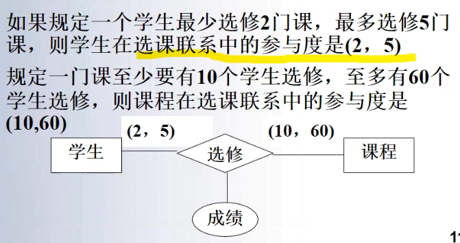
- 弱实体，实体存在依赖于其它实体存在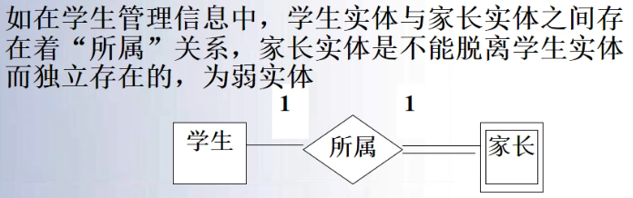
- 子类实体，根据不同特性分成多个子集

> 一个物资管理需求如下
>
> 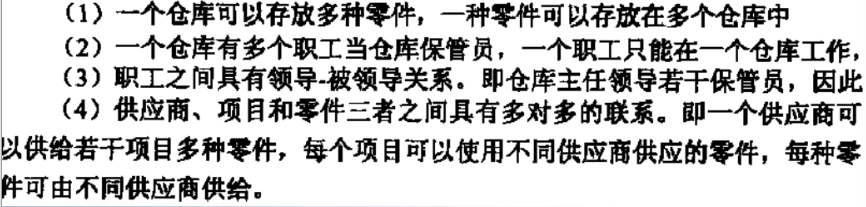
>
> 
>
> 
>
> 最后，得到
>
> 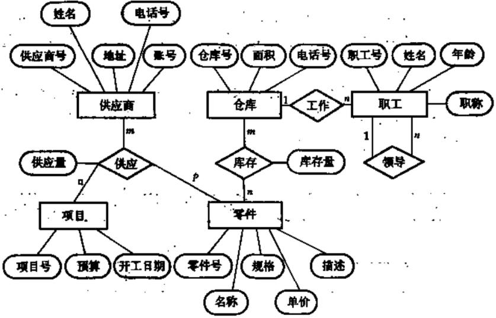

### 层次模型

层次模型是数据库系统最早出现的数据模型，用树形结构表示各类实体和实体间联系。层次模型满足两个条件：有且只有一个节点没有双亲结点，为根节点；根以外节点有且只有一个双亲结点。

比如下面一个层次：


其特点是，数据结构简单清晰，查询效率高，提供了良好的数据完整性支持。

但这种模型不能表示两个以上实体间复杂联系和实体间多对多联系，只能通过引入冗余数据或虚拟节点来解决。对数据插入和删除涉及树的操作，所以工作量比较大，查询子女节点需要通过双亲结点。由于结构严密，层次命令趋于程序化。

### 网状模型

现实世界的联系很多的非层次的，所以用层次模型表达有非直观性。网状模型满足下面的条件：允许一个以上节点无双亲，一个节点可以有多于一个双亲。

网状模型能更直接的描述现实世界，如一个节点可以有多个双亲；同时它性能尚可。但是，它结构非常复杂，不利于用户掌握；DDL、DML语言复杂，不容易使用。


### 关系模型

1970年，E.F.Codd提出了关系数据模型，1977年出现了第一个关系数据库，而80年代依赖关系数据就占据主流。

（1）基本概念和结构

关系是一张二维表，一个关系描述一个实体集。实体有属性，二维表的列就是属性。一个属性对应的一个集合是域。

关系是元组的集合，一个元组对应实体集中的一个个体。一个元组由若干分量组成，一个分量对应一个属性值。

键是一个或多个属性构成的，能够唯一标识一个元组。一个关系中可能有多组属性都能起到标识元组的作用，所以一个关系可能有多个键。选择其中一个作为主键，其余为候选键。

（2）关系模式

对关系结构的描述称为关系模式。关系模式可表示为：

```
关系名(属性1,属性2,...,属性n)
```

（3）ER模式向关系数据模式的映射

关系数据模型中，基本的数据结构是关系。现实世界中，实体和实体间的联系都用关系表示。

联系可以用表来描述。比如，选课联系 -> 选课表。表中有来自学生和课程两个实体的属性，成绩是选课关联自身的描述属性。

关系必须是规范化的，关系的每一个分量必须不可分。也就是，不能存在表中表。

（4）完整性约束

关系数据需要有实体完整性、参照完整性、用户自定义完整性。

（5）数据操纵

允许进行增删改查。

这种关系运算都可以归结为关系代数和关系演算两类。

总的来说，关系数据模型可以表示为下表：


关系模型有下面的优点

- 数据结构简单
- 一体化数据子语言
- 数据独立性高
- 面向集合的存取方式
- 坚实的理论基础
- 有利于开展其他应用

### 面向对象数据模型

对象关系数据系统是面向对象数据模型和关系数据模型相结合的产物。一般来说，面向对象有两条路线，一条是建立新的数据库系统，另一种是走结合路径。


但缺乏通用数据模型、理论基础、查询优化，导致面向对象数据库理论技术没有成熟，关系数据库仍处于统治地位。

## 关系数据库

主要讨论基本概念和各种运算。

按照静态数据结构、动态数据操作、完整性约束来介绍。

### 关系模型基本概念

一、基本概念

域是一组具有相同数据类型的值的集合。

笛卡尔积：给定一组集合$D_1,D_2,\cdots D_n$，那么笛卡尔积$D_1\times D_2 \cdots D_n$就是所有域的所有组合。

笛卡尔积的每个元素叫做一个元组$(d_1,d_2,\cdots,d_n)$，每一个值$d_i$叫做一个分量。

$D_1\times\cdots\times D_n$上任一个子集称为$D_1,\cdots,D_n$上一个关系，$N$叫做关系的目或度。关系的每一行对应一个元组，用$t$表示，每一列对应一个域，列称为属性，$t[A_i]$表示$t$在$A_i$上的值。

按照定义，关系可以是一个无限集合。并且，笛卡尔积不满足交换律。但是无限的集合在数据库中是无意义的，所以 **关系是规范化的二维表中行的集合** ，关系必须是有限集合。

规范化关系有如下性质：

- 列是同质的，每一列的分量来自同一个域
- 不同列可出自一个域，每一列称为一个属性，不同属性给予不同属性名
- 列的顺序无所谓，次序可以交换
- 各个元组是不同的，不允许出现重复元组。（因为实体不能相同）
- 行的次序可以任意交换
- 分量必须为原子值，每一个分量都是不可分的数据项

二、关系模式和关系数据库

关系模式是对关系的描述。该描述包括关系名、属性名、属性的类型和长度、属性间固有的数据关联关系，记为R(A~1~,A~2~,...,A~n~)。

关系模式的集合是关系数据库模式，是对所有数据逻辑结构的描述，表示为R={R1,R2,...,Rp}。

三、键

为了区分不同元组，用一个或多个属性值标识，能够唯一标识元组属性或属性组称为关系的键。其标识作用的键是候选键，多个候选键其中之一为主键。如果关系的键由多个属性组成，则称为联合键。关系所有属性构成关系的键，称为全键。

四、完整性约束

为了保证数据域一致性，需要

- 实体完整性，一般自动支持

  - 主键的值不能为空或部分为空。
  - 实体完整性是针对基本关系而言的，基本表对应现实世界一个实体集。现实世界实体和实体是可区分的，而关系模型中主键是唯一性标识。主键的属性不能取空值。

- 参照完整性，一般自动支持

  - 如果$R_1$中A是$R_2$的主键，那么R~1~中让你一个元组在A上的值或者为空，或者为R~2~中某个元组主键的值。

  - 比如学生和专业信息，二者是参照关系和被参照关系。学生的专业信息要么是空，要么是专业信息中的某个数据项。这个时候，其取值局限在专业代码中。

  - 这个时候，外键参考主键信息。

    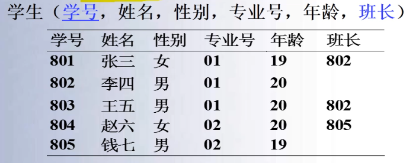

    比如这个图中，班长的取值一定是学号之中。

- 用户定义完整性，用户定义后系统支持

  - 用户定义完整性是针对某一具体关系数据库的约束条件。比如，成绩不能为负数、性别的输入条件。
  - 也叫做预定义完整性。

### 关系代数

一、关系代数概述

关系代数是抽象的查询语言，用对关系的运算表达查询。

它有三个要素：

- 运算对象：关系
- 运算结果：关系
- 运算符

按照运算符不同，关系代数分成两类：传统的集合运算和专门的关系运算。

二、集合运算

（1）并

假如R、S有相同的目，属性取自同一域，那么
$$
R \cup S = \{t|r\in R \or t \in S\}
$$


（2）差

假如R、S有相同的目，属性取自同一域，那么
$$
R-S = \{t | t \in R \and t \not \in S\}
$$
所以差可以代表删除。

（3）交

假如R、S有相同的目，属性取自同一域，那么
$$
R\cap S = \{t | t \in R \and t \in S\}
$$
（4）笛卡尔积

R是n目关系，有k~1~个元组，S是m目关系，有k~2~个元组，那么
$$
R \times S = \{t_rt_s | t_r \in R \and t_s \in S\}
$$


三、关系运算

先引入记号

$R$ 表示关系，$t$表示元组，$t[A_i]$表示分量，$t[A]$表示诸分量的集合，$\overline A$表示$\{A_1\cdots A_n\}$去掉$\{A_{i1}\cdots A_{in}\}$的属性组，$t_rt_s$表示元组连接

（1）选择
$$
\sigma_F(R) = \{t|t\in R \land t(F)\}
$$
其中$F$是布尔表达式，其含义是选$t(F)$为真的所有元组，从行的角度进行运算。


（2）投影
$$
\Pi_x(R)\{t[X]|t\in R\}
$$
从列的角度运算，选出若干属性列组成新的关系


（3）连接

条件连接和自然连接

条件连接：
$$
R\underset{A \theta B}{\large \Join}S = \{t|t=t_rt_s, t_r\in R \land t_s \in S \land t_r[A]\ \ \theta\ \  t_s[B]\}
$$
$\theta$为条件。


所以，条件连接相当于
$$
R \underset{A \theta B}{\large \Join} S = \sigma_{A \theta B} (R \times S)
$$
若$\theta$表示=，则称为等值连接。

自然连接是特殊的等值连接，要求两个关系中比较的分量是相同的属性组，并在结果集中把重复的属性列去掉。
$$
R \Join S = \{t|t=t_rt_s[\overline A], t_r\in R \land t_s \in S \land t_r[A] = t_s[A]\}
$$
比如下例


 如果有多列，也遵循相同规则


所有重复字段都必须严格相同。

（4）除

如果R、S有同一域上的属性或属性组，$R \div S$结果生成新关系$R'$。

设$R(X,Y), S(Y), R'(X)$，则
$$
R \div S = \{t|t\in R' \land tr \in R \land ts \in S \land tr[R']=t \land t \Join S \subseteq R\}
$$
也就是R的属性中去掉与S具有公共域属性的其他属性。

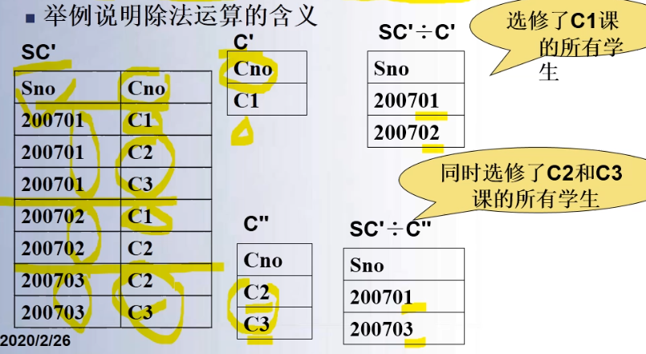

也可以这么表示除运算
$$
R \div S = \Pi_x(R) - \Pi_x(\Pi_x(R) \Join S - R)
$$
其中$X$为$R$中除去$S$属性相同的其余属性。


接下来，我们更进一步解释除运算。首先引入象集$Z_X$：给定关系R(X,Z)，X、Z为属性组，当$t[X]=x$时，定义
$$
Z_x = \{t[Z]|t\in R, t[X]=x\}
$$
表示R中属性组X上值为x的诸元组在Z上分量的集合。比如


这样，我们定义除运算

给定关系R(X,Y)和S(Y,Z)，X、Y、Z为属性组，那么除运算得到的P(X)是满足下列条件的元组在X属性列上的投影：**元组在X上的分量值x的象集Y~x~包含S在Y上投影的集合**。再从上面的例子来看：

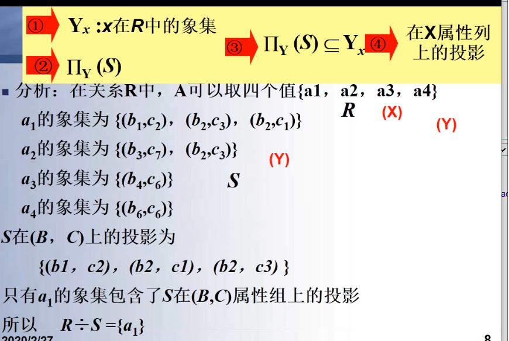

四、扩充关系运算

下面介绍几个扩充运算。

（1）属性重命名

r是R上一个关系，A是R的一个属性，B是属性名，那么
$$
r'(R') = \delta_{A\to B}(r)
$$
记为属性重命名。可以同时对一组属性操作，可以在同一个关系上做自然连接运算、做同一个关系的笛卡尔积、将两个关系的等值连接表示为自然连接。

（2）外连接

外连接是对自然连接的扩展，包含除了满足连接条件元组外包含未被连接的元组。

外连接包括左外连接、右外连接、全连接。

左外连接：关系R中不满足连接条件的元组，记为$R\Join_L S$

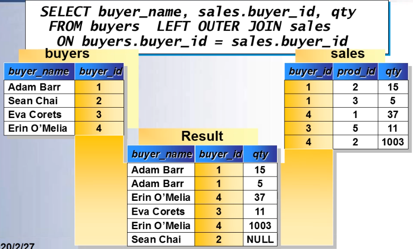

此时，比起自然连接，拓展了左面关系不满足条件的2号，并添加了NULL。

右外连接：关系S中不满足连接条件的元组，这些关系补空值，记为$R\Join_R S$

全外连接：关系R、S都进行考虑，记为$R\Join_F S$

> 实例
>
> （1）检索计算机系学生的学号和姓名
> $$
> \Pi_{id, name}(\sigma_{pro='计算机'}(Student))
> $$
> （2）查询选修2号课程学生学号
> $$
> \Pi_{id}(\sigma_{课程号='2'}(SC))
> $$
> （3）查询选修1号课程的学生姓名（数据表为Student和SC）
>
> 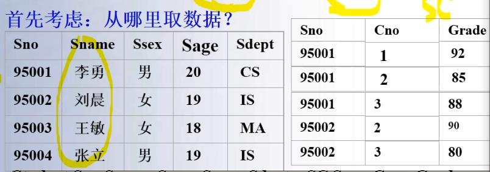
> $$
> \Pi_{sname}(\sigma_{Cno='1'}(\sigma_{sc.sno=student.sno}(SC \times Student)))
> $$
> 也可以直接自然连接
> $$
> \Pi_{sname}(\sigma_{Cno='1'}(SC \Join Student))
> $$
> 或
> $$
> \Pi_{sname}(\sigma_{Cno='1'}(SC) \Join Student)
> $$
> （4）
>
> 
> $$
> Student - (\Pi_{Sno}(\sigma_{Cno='C1'}(SC)) \Join Student)
> $$
> （5）
>
> 
> $$
> \Pi_{Cname}(\sigma_{Sname='刘明亮'} (Course \Join SC \Join Student))
> $$
> （6）
>
> 
> $$
> \Pi_{Sname}(\sigma_{Cpno='5'} (Course \Join SC \Join Student))
> $$
> 也可以写成
> $$
> \Pi_{Sname}(\sigma_{Cpno='5'}(Course) \Join SC \Join \Pi_{Sno, Sname}(Student))
> $$
> 等。
>
> （7）
>
> 
> $$
> \Pi_{Sno,Cno}(SC) \div \Pi_{Cno}(Course) \Join \Pi_{Sno,Sname}(Student)
> $$
> （8）查询选修1号课程和3号课程的学生的学号
>
> 首先建立临时关系$K$，Cno列为$1,3$。则答案为
> $$
> \Pi_{Sno,Cno}(SC) \div K
> $$
> （9）
>
> 
> $$
> SC \cup \{'200504','C4',88\}
> $$
> （10）删除学生刘明亮选修的英语课
> $$
> SC - (\Pi_{Sno}(\sigma_{Sname='刘明亮'}(Student))\Join SC \Join \Pi_{Cno}(\sigma_{Cname='英语'}(Course)))
> $$
> （11）
>
> 
> $$
> \Pi_{Sname}( Student \div \Pi_{Sdept}(\sigma_{Sname='李勇'}(Student)))
> $$
>
> $$
> \sigma_{Sname='李勇'}(\Pi_{Sname,Sno',Sname'}(Student\Join \delta_{Sno,Sname,Sage,Ssex \to Sno',Sname',Sage',Ssex'}(Student)))
> $$

用关系代数可以完成数据的检索、插入、删除，一次一集合。交并差笛卡尔积，选择投影连交除。

### 元组关系演算

关系代数是用关系运算来表达查询，关系演算是用谓词来表达查询要求。进一步分为元组演算和域演算。

元组语言的语句格式是 操作语句 <工作空间名> (表达式) : 条件

- 检索语句Get
  - GET W (SC.Cno)
  - GET W (Student)
  - GET W (Student.Cno, Student.Sage) : Student.Sdept = 'IS'
- 更新操作
  - HOLD 将修改元组读到空间中
    - HOLD W (Student.Sno, Student.Sdetp) : Student.Sno = '95007'
  - MOVE 用宿主语言修改
    - MOVE 'IS' TO W.Sdept
  - UPDATE 将修改后元组送回
    - UPDATE W
  - PUT 插入操作
    - MOVE '8' TO W.Cno
    - MOVE '机组' To W.Cname
    - PUT W (Course)
  - DELETE 删除操作
    - HOLD W ...
    - DELETE W

### 域关系语言

域关系语言是基于屏幕表格的查询语言。

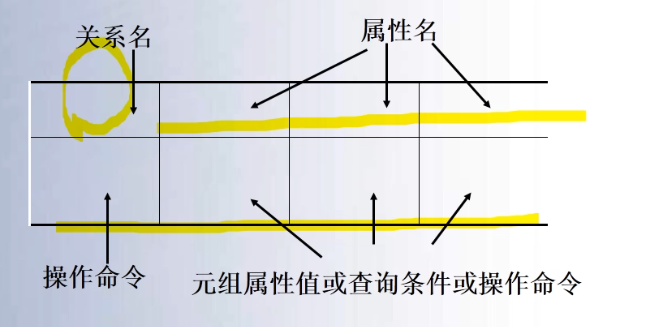


了解其特点即可。

### 关系数据语言

关系数据语言集关系代数和关系演算为一体。

- 关系数据语言是一种高度的非过程化的语言
- 存取路径选择由DBMS优化机制来完成
- 用户不必用循环结构就可以完成数据操作
- 能够嵌入高级语言使用
- 关系代数、元组关系演算和域关系演算三种语言在表达能力上完全等价。

这里有三种关系运算的等价性。

关系数据库中，关系是有限的。关系代数运算是安全的，但关系演算不一定安全。当对安全性进行限制注资后，三种演算是完全等价的。

## 关系数据库标准语言SQL

### SQL概述

SQL(Structure Query Language, 结构化查询语言)是一种介于关系代数和关系演算的语言。包括数据定义、查询、操纵、控制功能为一体，已称为关系数据库的标准语言。

SQL语言版本包括89、92、99、03等，本课主要介绍SQL89、92等基本原理。

SQL的特点有

- 综合统一，集数据定义、操纵、控制语言于一体
- 高度非过程化，只需要指出做什么，无需指出怎么做
- 面向集合的操作方式
- 以同一种语法结构提供两种使用方式：作为独立的语言，在交互终端由DBMS解释执行；作为嵌入式语言，嵌入高级语言程序
- 语言简洁，易学易用

支持数据库三级模式结构

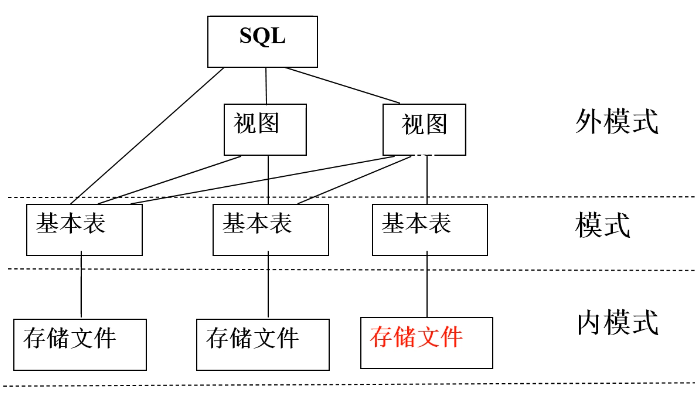

- 在SQL中，关系模式被称为基本表。所有基本表的集合形成数据库模式，对应三级模式结构的模式。
- 基本表在物理上与存储文件对应，存储文件的集合形成物理数据库，对应内模式。
- 外模式由视图组成。

基本表独立存在，一个关系模式对应一个基本表；而视图是从一个或多个基本表导出的表，不实际存储数据，是一种虚表。它只有一个定义，根据视图从中取出一个临时表.

### SQL的数据定义

一、SQL的数据定义功能

定义表、视图、索引，在SQL2中又添加了模式。

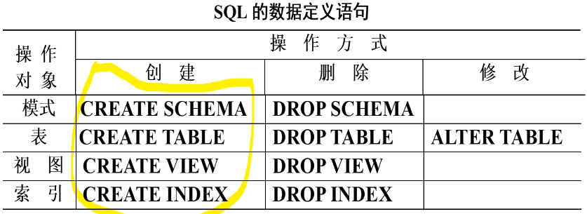

二、SQL模式的定义

SQL模式由模式名、权限标识符和模式中元素的描述符组成。权限标识符指明该模式的用户或账号，模式元素包含一个数据库应用的表、视图和索引等。

模式实际上相当于一个命名空间，可以进一步定义该模式包含的数据库对象，如表、视图和索引。

```SQL
CREATE SCHEMA 模式名 AUTHORIZATION 用户名;
CREATE SCHEMA 模式名 AUTHORIZATION 用户名 
[表定义子句 | 视图定义子句 | 授权定义子句];
```

> 定义学生数据库模式SST，用户SDBA
>
> ```sql
> CREATE SCHEMA SST AUTHORIZATION SDBA;
> ```
>
> 如果不指定模式名，则默认使用用户名。

> 创建模式时顺便定义
>
> ```sql
> CREATE SCHEMA SST AUTHORIZATION SDBA
> 	CREATE TABLE t1 (c1 INT PRIMARY KEY,
>                     c2 INT);
> ```

三、SQL模式的删除

```SQL
DROP SCHEMA 模式名 [CASCADE | RESTRICT]
```

CASCADE：级联式，把基本表、视图和索引等元素全部一并删除

RESTRICT：只有模式没有任何元素才能删除该元素

四、定义基本表

```sql
CREATE TABLE 表名
	(列名 数据类型 [列级完整性约束条件]
     列名 数据类型 [列级完整性约束条件]
     ...
     [表级完整性约束条件])
```

例如，*建立学生表Student*

```sql
CREATE TABLE Student (
	Sno CHAR(6) NOT NULL UNIQUE, -- 列级完整性约束
    Sname CHAR(8),
    Sage Int,
    Sdept Char(12),
    CONSTRAINT C1 CHECK(Ssex IN('男','女')), -- 表级完整性约束
    CONSTRAINT S_PK PRIMARY KEY(Sno) -- S_PK 主键约束
);
```

（1）`CONSTRAINT 约束名 约束` 表示约束

（2）SQL的数据类型

- SMALLINT
- INTEGER(INT)
- REAL 浮点数
- DOUBLE PRECISION 双精度浮点数
- FLOAT(n) n位精度浮点数
- NUMBER(p[,q]) p位定点数，小数点后q位
- CHAR(n) 长度为n的定长字符串
- VARCHAR(n) 最大长度为n的变长字符串
- BIT(n) 长度为n的二进制位串
- DATE 日期
- TIME 时间
- TIMESTAMP 日期时间

也可以自定义数据类型

```sql
CREATE DOMAIN 域名 数据类型;
```

例如

```sql
CREATE DOMAIN Sdept_TYPE CHAR(12); -- 可以将Sdept类型用域名代替
```

> ```sql
> CREATE TABLE SC(
> 	Sno CHAR(6) NOT NULL,
>     Cno CHAR(6) NOT NULL,
>     Grade INT CHECK (Grade BETWEEN 0 AND 100),
>     CONSTRAINT SC_PK PRIMARY KEY(Sno, Cno), -- 主键
>     CONSTRAINT SC_FK1 FOREIGN KEY(Sno) REFERENCES Student(Sno)  -- 外键
> );
> ```

可以简化

```sql
CREATE TABLE SC(
	Sno CHAR(6) NOT NULL,
    Cno CHAR(6) NOT NULL,
    Grade INT CHECK (Grade BETWEEN 0 AND 100),
    PRIMARY KEY(Sno, Cno), -- 简化主键
    FOREIGN KEY(Sno) REFERENCES Student(Sno)  -- 简化外键
);
```

在定义表的时候，也可以指明模式名。

（3）常用的完整性约束

- PRIMARY KEY
- UNIQUE 唯一性
- NOT NULL 非空
- 参照完整性

五、修改基本表

```sql
ALTER TABLE 表名
	[ADD 列名 数据类型 完整性约束] -- 增加新列
	[DROP 列名 [CASCADE | RESTRICT]] -- 删除列
	[ALTER 列名 数据类型] -- 修改列定义，比如数据类型
```

例如

```sql
ALTER TABLE Student
	ADD Class CHAR(8) -- 新增加的列一律为空，不能指定NOT NULL
	ALTER Sname CHAR(20); -- 可能破坏已有数据
```

六、删除基本表

```sql
DROP TABLE 表名 [RESTRICT | CASCADE]
```

缺省为RESTRICT。

七、建立索引

索引是一种数据结构。

索引技术是数据库管理系统的核心问题。它本质是表上的一种查询路径，由DBA或表的创建者建立删除。其更新维护由DBMS自动完成，系统在存储数据时会自动选择是否使用。

在PRIMARY KEY或UNIQUE等，有些DBMS会自动建立索引。

```sql
CREATE [UNIQUE] [CLUSTER] INDEX 索引名 ON 表名 (
    列名 [次序], 
    [列名, [次序]
]...) 
```

次序是索引值排列次序，ASC为升序，DESC为降序，ASC缺省

UNIQUE表示每个索引值对应唯一数据，CLUSTER表示建立聚集索引。

例如，

```sql
CREATE UNIQUE INDEX S_SNO ON Student(Sno) -- 在学生表Student学号列按升序建立唯一索引
```

唯一值索引需要用UNIQUE修饰。这个索引对应数据记录是唯一的，所以有重复值的属性列不能建UNIQUE索引。建立UNIQUE索引相当于增加UNIQUE约束。

聚集索引的次序和元组物理次序一致，并且建立索引后，基表中数据需要按指定聚集属性值升序或降序存放。对某些类型的查询，聚集索引可以提高查询效率，尤其是经常搜索范围值的列，或是需要排序。在一个基本表上最多只能建立一个聚集索引，可以包含多个列。它一般适用下面两个条件：

- 很少对基表增删操作
- 很少对变长列修改操作

八、删除索引

```sql
DROP INDEX 索引名
```

不影响表的内容

索引为性能带来的好处是有代价的。对某个属性建立索引，能提高对属性上的值的检索效率，进行连接操作也能加快连接速度。但是带索引的表会占据更多空间，同时完成增删改操作时，花费时间会增长。

### 单表查询

一、单表查询的基本格式

```sql
SELECT [ALL|DISTINCT] <目标列表达式>[,<目标列表达式>]
FROM <表名或视图名>[,<表名或视图名>] ... | (SELECT 语句) [AS] <别名>
[WHERE <条件表达式>]
[GROUP BY <列名1> [HAVING <条件表达式>]]
[ORDER BY <列名2> [ASC|DESC]]
```

这是SQL的基本架构。具体来说，

- SELECT子句指定查询属性列
- FROM子句表明查询对象
- WHERE表明查询条件
- GROUP BY对查询结果按指定列的值分组，该属性列值相等的元组为一个组
- HAVING满足指定条件才输出
- ORDER BY对查询结果指定列值升序或降序

二、查询列

查询指定列：

```sql
SELECT Sno,Sname FROM Student;
```

查询所有列，可以用通配符表示

```sql
SELECT * FROM Student;
```

也可以查询某个表达式，查询“虚列”

```sql
SELECT Sname, 2014-Sage FROM Student;
```

> 例 *查询全体学生姓名、出生年份和所在院系，要求用小写字母表示系名*
>
> ```sql
> SELECT Sname, 'Year of birth', 2014-Sage, LOWER(Sdept) FROM Student;
> ```

在查询过程中，可以给出别名，比如

```sql
SELECT Sname NAME, 'Year of birth' BIRTH, 2014-Sage BIRTHDAY, LOWER(Sdept) DEPARTMENT FROM Student;
```

那么得到的新表属性就发生了改变。

如果希望对查询结果进行去重，可以加上`Distinct`。比如

```sql
SELECT DISTINCT Sno FROM SC;
```

三、条件查询

常见的查询条件有

| 查询条件 |                 谓词                 |
| :------: | :----------------------------------: |
|   比较   | =,>,<,>=,<=,!=,<>,!>,!<;NOT + 比较符 |
| 确定范围 |     BETWEEN AND, NOT BETWEEN AND     |
| 确定集合 |              IN, NOT IN              |
| 字符匹配 |            LIKE, NOT LIKE            |
|   空值   |         IS NULL, IS NOT NULL         |
| 多重条件 |             AND, OR, NOT             |

（1）比较大小

*查询计算机系全体学生名单*

```sql
SELECT Sname FROM Student WHERE Sdept = 'CS';
```

*查询所有年龄在20岁以下的学生姓名和年龄*

```sql
SELECT Sname, Sage FROM Student WHERE Sage < 20;
```

*查询考试成绩有不及格的学生的学号*

```sql
SELECT DISTINCT Sn FROM SC WHERE Grade < 60;
```

（2）确定范围

*查询20-23岁的学生姓名、系别和年龄*

```sql
SELECT Sname, Sdept, Sage FROM Student BETWEEN 20 AND 23;
```

（3）确定集合

*查询CS、MA和IS系学生姓名和性别*

```sql
SELECT Sname, Ssex FROM Student WHERE Sdept IN ('CS', 'MA', 'IS');
```

*查询不是CS、MA、IS系的学生姓名和性别*

```sql
SELECT Sname, Ssex FROM Student WHERE Sdept NOT IN ('CS', 'MA', 'IS');
```

（4）字符匹配

可以是一个完整的字符串，也可以有通配符

- `%` 表示任意长度字符串，`a%b`表示a开头b结尾字符串
- `_` 代表任意单个字符，`a_b`表示a开头b结尾任意字符串

*查询学号为201215xxx学生的情况*

```sql
SELECT * FROM Student WHERE Sname LIKE 201215%
```

*查询姓欧阳且为三个汉字学生的姓名*

```sql
SELECT Sname FROM Student WHERE Sname LIKE '欧阳_'
```

*查询第二个字为阳的学生姓名学号*

```sql
SELECT Sname, Sno FROM Student WHERE Sname LIKE '_阳%'
```

*查询所有不姓刘的学生姓名、学号和性别*

```sql
SELECT Sname, Sno, Ssex FROM Student WHERE Sname NOT LIKE '刘%'
```

注意某些条件下需要进行转义

```sql
SELECT Cno, Ccredit FROM Course WHERE Cname LIKE 'DB\_Design' ESCAPE '\'
```

这里的ESCAPE表示将`\`定义为转义字符

（5）空值查询

注意区分IS和=。

*查询缺少成绩的学生的学号和课程号*

```sql
SELECT Sno, Cno FROM SC WHERE Grade IS NULL;
```

*查询有成绩的学生的学号和课程号*

```sql
SELECT Sno, Cno FROM SC WHERE Grade IS NOT NULL;
```

（6）多重条件查询

*查询计算机系年龄20岁以下的学生姓名*

```sql
SELECT Sname FROM Student WHERE Sdept='CS' AND Sage<20;
```

四、排序子句

`ASC`升序，`DESC`降序

*查询选修3号课程学生的学号和成绩，查询结果按分数降序排列*

```sql
SELECT Sno, Grade FROM SC WHERE Cno = '3' ORDER BY Grade DESC;
```

*查询全体学生情况，结果按系系号升序排列，同一系学生按年龄降序排列*

```sql
SELECT * FROM Student ORDER BY Sdept, Sage DESC;
```

五、聚集函数

常见的聚集函数包括：

- 统计元组个数 `COUNT(*)`
- 统计一列中值的个数 `COUNT([DISTINCT|ALL] <列名>)`
- 计算一列值综合 `SUM([DISTINCT|ALL] <列名>)`
- 计算一列值平均 `AVG([DISTINCT|ALL] <列名>)`
- 计算最大值 `MAX([DISTINCT|ALL] <列名>)`
- 计算最小值 `MIN([DISTINCT|ALL] <列名>)`

查询学生总人数

```sql
SELECT COUNT(*) FROM Student;
```

*查询选修了课程的学生人数*

```sql
SELECT COUNT(DISTINCT Sno) FROM SC;
```

*计算1号课程的学生平均成绩*

```sql
SELECT AVG(Grade) FROM SC WHERE Cno = '1';
```

*计算选修1号课程的学生最高分数*

```sql
SELECT MAX(Grade) FROM SC WHERE Cno = '1';
```

*查询学生201215012选修课程总分数*

```sql
SELECT SUM(CCredit) FROM SC, Course WHERE Sno='201215012' AND SC.Cno = Course.Cno
```

六、GROUP BY子句

GROUP BY子句可以细化聚集函数的作用对象，作用于查询结果，对查询结果分组后分别作用于每个组，按指定的一列或多列值分组，值相等的为一组。

*求各个课程号及对应的选课人数*

```sql
SELECT Cno, COUNT(Sno) FROM SC GROUP BY Cno;
```

结果可能是这样：


如果在GROUP BY中使用条件判断，一般使用HAVING子句。考虑下面一个情形：

*查询选修了3门以上课程的学生学号*

```sql
SELECT Sno FROM SC GROUP BY Sno HAVING COUNT(*) > 3
```

我们不能使用

```sql
SELECT Sno FROM SC WHERE COUNT(*) > 3 GROUP BY Sno
```

一方面，`WHERE`中不允许引入聚集函数。另一方面，这里的条件是对分组结果的筛查，所以直接用`WHERE`在语义上也是错误的。

*查询平均成绩大于或等于90分的学生学号和平均成绩*

```sql
SELECT Sno, AVG(Grade) FROM SC GROUP BY Sno HAVINg AVG(Grade) >= 90
```

这里只需要记住，HAVING的作用对象是 **组**，WHERE的作用对象是 **基表**。

### 连接查询

SQL中的连接是对连接条件而言，因此，总体来说其具有这样的形式：

```sql
[<表名1>.]<列名1> <比较运算符> [<表名2>.]<列名2>
```

一、等值与非等值连接查询

*查询每个选修和选修课程的情况*

```sql
SELECT Student.*, SC.* FROM Student, SC WHERE Student.Sno = SC.Sno;
```

这样的结果是直接的连接：

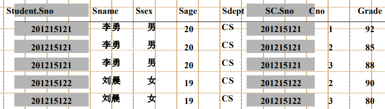

如果需要自然连接，可以通过

```sql
SELECT Student.Sno, Sname, SSex, Sage, Sdept, Cno, Grade FROM Student, SC WHERE Student.Sno = SC.Sno;
```

*查询选修2号课程且成绩90分以上的学生学号姓名*

```sql
SELECT Student.Sno, Sname FROM Student, SC WHERE 	
		Student.Sno = SC.Sno,
		AND SC.Cno = '2'
		AND SC.Grade > 90;
```

二、自身连接

将表和自身进行连接，称为自身连接，是一种特殊的连接。比如对于下面这张表


查询对象是每一门课的直接先修课的名称。这样的查询需要起别名，

```sql
SELECT FIRST.Cname, SECOND.Cname 
	FROM Course FIRST, Course Second
	WHERE FIRST.Cpno = SECOND.Cpno;
```

三、外连接

外连接以指定表为连接主体，将**主体表中不满足条件的元组一并输出**。这种连接分成左外连接和右外连接。

比如

```sql
SELECT Student, Sno, Sname, Ssex, Sage, Sdept, Cno, Grade FROM Student LEFT OUT JOIN SC ON (Student.Sno = SC.Sno);
```

那么将得到这样的表

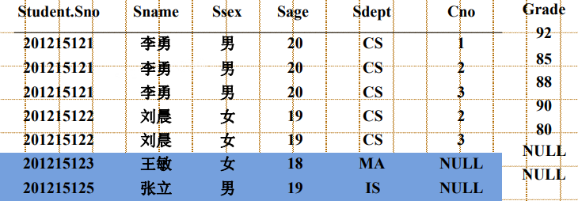

四、多表连接

两个以上的表连接

```sql
SELECT Student.Sno, Sname, Cname, Grade FROM Student, SC, Course
	WHERE Student.Sno = SC.Sno
	   AND SC.Cno = Course.Cno
```

### 嵌套查询

一个`SELECT-FROM-WHERE`语句称为一个查询块，将一个查询块嵌套在另一个查询块的语句称为嵌套查询。

典型的嵌套查询：

```sql
SELECT Sname FROM Student WHERE Sno IN
	(SELECT Sno FROM SC WHERE Cno = '2')
```

外层的也叫父查询，内层的也叫子查询。注意，子查询不能使用`ORDER BY`。

嵌套查询分成不相关子查询和相关子查询两类。如果子查询不依赖于父查询，子查询结果用于建立父查询条件，就称作不相关子查询。如果子查询查询条件依赖于父查询，那么会经过如下过程：

- 取外层查询中表的第一个元组
- 根据其与内层查询相关属性值处理内层查询
- 如果`WHERE`子句返回是真，就放入结果表
- 重复这一过程

一、带有IN谓词的子查询

*查询与刘晨在同一个系学习的学生*

```sql
SELECT Sname FROM Student WHERE Sdept IN (
	SELECT Sdept FROM Student WHERE Sname='刘晨'
)
```

如果不进行子查询，也可以使用自身连接

```sql
SELECT S1.Sname FROM Student S1, Student S2 
	WHERE S1.Sdept = S2.Sdept AND S2.Sname = '刘晨' 
```

*查询选修了课程名为信息系统的学生学号姓名*

```sql
SELECT Sno, Sname FROM Student WHERE Sno IN (
	SELECT Sno FROM SC WHERE Cno IN (
    	SELECT Cno FROM Course WHERE Cname = '信息系统'
    )
)
```

也可以用连接实现

```sql
SELECT Sno, Sname FROM Student, SC, Course
	WHERE Student.Sno = SC.Sno
		AND SC.Cno = Course.Cno
		AND Course.Cname = '信息系统'
```

二、带有比较运算符的子查询

如果内层查询一定返回**单值**，可以使用比较运算符。

*查询与刘晨在同一个系学习的学生*

```sql
SELECT Sname FROM Student WHERE Sdept = (
	SELECT Sdept FROM Student WHERE Sname ='刘晨'
)
```

*找出每个学生超过他选修课程平均成绩的课程号*

```sql
SELECT Sno, Cno FROM SC S1 
	WHERE Grade >= (
    	SELECT AVG(Grade) FROM SC S2 
        	WHERE S1.Sno = S2.Sno
    )
```

这个过程可以如下举例：首先取出SC的元组x，将Sno比如`201215121`传入内层查询，这个时候内层查询转换为

```sql
SELECT AVG(Grade) FROM SC S2 WHERE S2.Sno = '201215121'
```

此时得到88，作为学生的近似成绩。传回外层，转化为

```sql
SELECT Sno, Cno FROM SC S1 WHERE Grade >= 88;
```

这个时候就得到了该生的结果。

三、带有ANY或ALL的子查询

ANY和ALL需要配合比较运算使用：

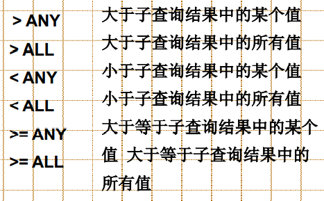

*查询非科班中比计算机任意一个学生年龄小的姓名和年龄*

```sql
SELECT Sname, Sage FROM Student WHERE Sage < ANY (
	SELECT Sage FROM Student WHERE Sdept = 'CS'
) AND Sdept <> 'CS';
```

*查询非科班中比计算机所有学生年龄小的姓名和年龄*

```sql
SELECT Sname, Sage FROM Student WHERE Sage < ALL (
	SELECT Sage FROM Student WHERE Sdept = 'CS'
) AND Sdept <> 'CS';
```

由于ANY/ALL表示恒成立/恒存在，可以转换为聚集函数


例如，上述查询可以转化为

```sql
SELECT Sname, Sage FROM Student WHERE Sage < (
	SELECT MIN(Sage) FROM Student WHERE Sdept = 'CS'
) AND Sdept <> 'CS';
```

四、带有Exists谓词的子查询

只返回True和False。

*查询所有选修1号课程的学生姓名*

```sql
SELECT Sname FROM Student WHERE EXISTS (
	SELECT * FROM Sno WHERE Sno = Stundent.Sno AND Cno = '1'
)
```

*查询没有选修1号课程的学生姓名*

```sql
SELECT Sname FROM Student WHERE NOT EXISTS (
	SELECT * FROM Sno WHERE Sno = Stundent.Sno AND Cno = '1'
)
```

可以通过谓词转换实现全称量词。

### 集合查询

集合操作包括交并差。各查询结果列数必须相同，数据类型也必须相同。

*查询计算机科学系的学生及年龄不大于19岁的学生*

```sql
SELECT * FROM Student WHERE Sdept = 'CS' 
	UNION SELECT * FROM Student WHERE Sage <= 19; 
```

UNION表示系统自动去重，UNION ALL不去重。

*查询计算机科学系的学生与年龄不大于19岁学生的交集*

```sql
SELECT * FROM Student WHERE Sdept = 'CS' 
	INTERSECT SELECT * FROM Student WHERE Sage <= 19; 
```

*查询计算机科学系的学生与年龄不大与19岁的学生的差集*

```sql
SELECT * FROM Student WHERE Sdept = 'CS' 
	EXCEPT SELECT * FROM Student WHERE Sage <= 19; 
```

### 数据插入

一、元组插入

```sql
INSERT INTO <表名> [<属性列1>[, <属性列2>...]] VALUES (<常量1>[, <常量2>])
```

INTO子句指定表名和属性列，不指定属性列则插入完整元组。

*将新学生元组插入Student表中*

```sql
INSERT INTO Stuent(Sno, Sname, Ssex, Sdept, Sage) VALUES ('201215128, '陈东', '男', 'IS', 18)
```

插入选课记录

```sql
INSERT INTO SC VALUES('201215128', '1', NULL);
```

二、插入子查询结果

```sql
INSERT INTO <表名> [(<属性列1>[, <属性列2>]]) 子查询;
```

*对每一个系，求平均年龄，并将结果存入数据库*

```sql
CREATE TABLE Dept_age (
	Sdept CHAR(15)
    Avg_age SMALLINT
);
INSERT INTO Dept_age(Sdept, Avg_Age)
	SELECT Sdept, AVG(Sage) FROM Student GROUP BY Sdept;
```

### 数据修改

```sql
UPDATE <表名> SET <列名>=<表达式>[,<列名>=<表达式>] ... [WHERE <条件>];
```

一、修改元组值

*将201215121年龄修改为22岁*

```sql
UPDATE Student SET Sage = 22 WHERE Sno='201215121';
```

二、修改所有值

*将所有年龄增加1岁*

```sql
UPDATE Student SET Sage = Sage + 1;
```

三、带子查询的修改语句

*将所有科班学生成绩置零*

```sql
UPDATE SC SET Grade = 0 WHERE Sno IN (
	SELECT Sno FROM Student WHERE Sdept = 'CS'
);
```

### 数据删除

其实类似

```sql
DELETE FROM <表名> [WHERE <条件>];
```

一、删除元组

*删除学号201215121*

```sql
DELETE FROM Student WHERE Sno = 201215121;
```

二、删除多个元组

*删除所有选课信息*

```sql
DELETE FROM SC;
```

三、带子查询的删除

*删除科班选课记录*

```sql
DELETE FROM SC WHERE Sno IN(
	SELECT Sno FROM Student WHERE Sdept = 'CS'
)
```

### 视图

视图是一个或多个基本表导出的表，不存放数据，基表中数据变化也会引起视图查询结果变化。

一、视图建立

建立视图的语句：

```sql
CREATE VIEW <视图名> [(<列名> [, <列名>])] AS <子查询> [WITH CHECK OPTION];
```

如果指定`WITH CHECK OPTION`，更新操作不能带来二义性。子查询可以是任意一个SELECT语句，但能否包含ORDER BY和DISTINCT有不同约定。

建立视图，属性列名要么全部省略，要么全部指定。如果基本表中需要计算属性，那么就需要显式指出属性名。

视图是虚表，只保存数据定义，而不保存数据。所以当我们CREATE视图，这个定义会保存在数据字表中，并在需要用的时候将定义语句和操作语句合并，按照合并结果给出运算结果。

*建立信息系学生的视图*

```sql
CREATE VIEW IS_Student AS
	SELECT Sno, Sname, Sage FROM Student WHERE Sdept = 'IS'
```

这个视图中属性全部省略，因此结果是`Sno`, `Sname`和`Sage`。像这样的只去掉某些行列、保留主码构成的视图叫做**行列子集视图**，可以直接更新。

如果我们还需要在此基础上，保持修改和插入操作的时候保证该视图只有信息系的学生，那么需要加上`WITH CHECK OPTION`

```sql
CREATE VIEW IS_Student AS
	SELECT Sno, Sname, Sage FROM Student WHERE Sdept = 'IS'
WITH CHECK OPTION;
```

这个时候，如果我们想要让一个人从IS转到CS，就会违反定义条件，也就是对视图发生修改。

下面看一个多表视图的例子。

*创建信息系选修了1号课程的学生的视图（学号、姓名、成绩）*

```sql
CREATE VIEW IS_S1(Sno, Sname, Grade) AS 
	SELECT Student.Sno, Sname, Grade FROM Student, SC
		WHERE Sdept = 'IS' AND Student.Sno = SC.Sno AND SC.Sno = '1'; 
```

由于多表查询有二义性，所以需要指明视图属性名称。

也可以从视图中建立视图。

*建立信息系选修了1号课程且成绩在90分以上的学生的视图。*

```sql
CREATE VIEW IS_S2 AS 
	SELECT Sno, Sname, Grade FROM IS_S1 WHERE Grade >= 90;
```

某些时候需要从现有属性中建立一些表达式产生新视图

```sql
CREATE VIEW BT_S(Sno, Sname, Sbirth) AS 
	SELECT Sno, Sname, 2014-Sage FROM Student
```

`Sbirth`属性的更新无法对应到原表，所以会受到限制。

类似的，也可以用分组

```sql
CREATE VIEW S_G(Sno, Gavg) AS
	SELECT Sno, AVG(Grade) FROM SC GROUP BY Sno;
```

这样的属性也无法更新。

二、视图删除

删除语句是

```sql
DROP VIEW <视图名> [CASCADE];
```

如果加上CASCADE，会把从该视图导出的视图一并删除。比如有视图BT_S由IS_S1导出，删除IS_S1需要加上CASCADE。

三、视图查询

对于用户而言，查询视图和查询基本表是相同的。所有的IDUS都可以执行，但是需要注意其中的数据参照。

在数据库中，其实际操作过程经过了视图消解法。这一过程包括有效性检查、对基本表查询和执行修正后查询的过程，最终转换为对基本表的查询。

总体来说，视图有如下优势：

- 能够简化用户操作
- 使用户能用多种角度看到同一数据
- 对重构数据库提供一定程度逻辑独立性
- 对机密数据提供安全保护
- 更清晰的表达查询

### 安全控制机制

一、权限

通过语句授权

```sql
GRANT <权限>[, <权限>] ...
	[ON <对象类型> <对象名>]
	TO <用户>[, <用户>]
	[WITH GRANT OPTION];
```

WITH GRANT OPTION决定授权对象是否有GRANT权限。

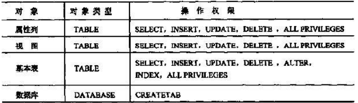

上图列出了常见权限。

如果希望收回权限，可以使用

```sql
REVOKE <权限>[, <权限>]...
	[ON <对象类型> <对象名>]
	FROM <用户>[, <用户>]...
```

收回操作会级联下去。

二、嵌入式SQL

将SQL嵌入高级语言中，称为嵌入式SQL。

一般形式SQL前加EXEC SQL，后跟END EXEC或主语言分隔符。

三、通讯区SQLCA

SQLCA是一个预先定义好的数据结构，SQL语言执行状态会保存在其中。

比如多少条记录发生了改变，可以方便程序根据结果做下一步处理。

四、主变量

在SQL语言中，主变量要加一个`:`，作为和主语言通信的工具。输入主变量，应用程序赋值，SQL语句引用；输出主变量，反馈给主程序。

五、游标

可以引入一个缓冲区来保存中间结果，这样的缓冲区也称作游标。当我们查询某个信息，会把所有结果放在缓冲区保存起来。SQL会对缓冲区进行处理，这个指针就叫做游标。

说明语句、数据定义语句、数据控制语句，这些语句只需要执行状态而不产生结果；查询结果为单值的select语句，通过into子句，可以直接把结果转给主变量；INSERT子句和非CURRENT形式的UPDATE和DELETE，也不涉及结果集。上述语句都不需要游标。

查询结果为多条记录和Current形式的Update和Delete会产生游标。比如，我们需要读出某个班男同学的信息，然后判断年龄值是不是大于20.根据结果情况再去做Update和Delete，就会产生中间的查询结果，这里就需要使用游标。这种Update和Delete叫做Current形式。

声明一个游标使用下面的格式：

```sql
EXEC SQL DECLARE <游标名> CURSOR FOR <SELECT语句>
```

接下来打开游标

```sql
EXEC SQL OPEN <游标名>
```

这个时候会执行SQL语句，然后把结果放在缓冲区中，让游标指向第一条记录。接下来进行查询：

```sql
EXEC SQL FETCH <游标名> INTO <主变量> [<指示变量>][,<主变量>[<指示变量>]]
```

这个时候会把游标指针推到主变量里，然后游标取下一个值。最后关闭游标：

```sql
EXEC SQL CLOSE <游标名>
```

对于Current形式，首先要声明

```sql
For update of <列名>
```

然后open、fetch游标。接下来需要检查当前记录并执行操作，使用

```sql
where current of <游标名>
```

最后关闭游标。

下面是一个嵌入式SQL的例子：

```c
#include <stdio.h>
EXEC SQL BEGIN DECLARE SECTION;
CHAR uid(20);
CHAR pwd(20);
CHAR hsno(6);
CHAR hcno(6);
INT hgrade;
EXEC SQL END DECLARE SELECTION;
EXEC SQL INCLUDE SQLCA;
main() {
    char g(6);
    strcpy(uid, 'SA');
    strcpy(pwd, 'CRT');
    EXEC SQL CONNECT :uid INDENTIFIED BY :pwd;
    scanf("%s", &hcno);
    EXEC SQL DECLARE C1 CURSOR FOR
        SELECT Sno, Grade FROM SC
        WHERE Cno=:hcno;
    EXEC SQL OPEN C1;
    while(1) {
        EXEC SQL FETCH C1 INTO :hsno, :hgrade;
        if (sqlca.sqlcode != 0) break;
        if (hgrade >= 85) g='优';
        else if(hgrade >= 75) g='良';
        else if(hgrade >= 60) g='中';
        else g='差';
        printf("sno:%s, grade:%s", hsno, g);
    }
    	EXEC SQL CLOSE C1;
    EXEC SQL COMMIT WORK RELEASE;
    exit(0);
}
```

六、动态SQL

静态SQL语句的变量个数和数据类型在预编译之前是确定的，有些DBMS则支持动态SQL技术。


## 关系查询处理和查询优化

### 关系数据库系统的查询处理

一、查询处理的步骤

关系数据库查询处理分成几个阶段：


- 查询分析
  - 查询分析对语句进行扫描、词法分析和语法分析，从查询语句中识别语言符号，进行语法分析和语法检查。
- 查询检查
  - 包括依据数据字典对合法查询语句进行的语义检查，和根据数据字典中用户权限与完整性约束定义对数据存取权限进行检查。
  - 检查后，一般将SQL语句表示为等价的关系代数表达式。
  - RDBMS通过查询数（语法分析树）表示扩展的关系代数表达式，将数据库对象外部名称转换为内部表示。
- 建立查询内部表示
- 查询优化
  - 查询优化是选择一个高效执行的查询处理策略。
  - 查询优化分成两种：
    - 代数优化，对关系代数表达式进行优化
    - 物理优化，存取路径和底层操作算法进行选择
  - 基于优化方法选择的依据有三种：基于规则、基于代价和基于语义。
- 查询执行
  - 依据优化器得到的执行策略生成查询计划。
  - 代码生成器会生成执行查询计划的代码。

二、选择操作的实现

考虑下面几个条件的选择操作：

- C1 无条件
- C2 Sno="114514"
- C3 Sage>20
- C4 Sdept='CS' AND Sage>20

那么有两种典型实现方法：

- 全表扫描。直接顺序进行遍历，选择所有符合条件的元组。这种方法适合小表，但是不适合大表。
- 索引或散列扫描方法。首先读取索引，然后根据索引值判断有哪些元组符合条件，得到记录的指针，把符合条件的记录读取出来。这个读取得到的就是一个索引，效率比较快。

对于C1，必须使用全表扫描。

对于C2，如果Sno上有索引或者Sno是散列码，那么可以直接根据索引查找到元组指针，进而找到目标元组。

对于C3，如果Sage上有B+树索引，那么可以先找到Sage=20的索引项，然后再B+树顺序集上找到Sage>20的元组指针。

对于C4，有两种思路：先通过两种方法，然后求交集；也可以先找到Sdept='CS'的指针，在结果集合中进行遍历。两种算法孰优孰劣要依据数据情况而定。

三、连接操作的实现

连接是最耗时的操作之一。考虑下面这个最简单的例子：

```sql
SELECT * FROM Student, SC WHERE Student.Sno = SC.Sno
```

连接操作有这样几种实现方法

1. 嵌套循环方法。对外层循环中的每一个元组，检查内层循环的每一个元组在连接属性上是否相等。如果相等则进行串接，这样复杂度是$O(nm)$的。

2. 排序合并方法。首先对两个表在Sno上进行排序，然后在Student表中取Sno，依次在SC表中找出有相同Sno的元组。扫描到Sno不相同的第一个SC元组时，回退到Student表的下一个元组，再一次开始扫描。这样，Student和SC表事实上只需要扫描一次，复杂度变成了$O((n+m)\log n + n + m)$。

3. 索引连接方法。首先在SC表上建立Sno的索引，接下来对Student中每一个元组，由Sno通过Sno索引查找对应元组，然后再把元组连接起来。

4. Hash Join方法。把连接属性作为hash码，用同一个hash函数把R和S的元组散列到同一个hash文件中。分成两个步骤：

   1. 划分阶段，把包含较少元组的表进行处理，按照hash结果分散；
   2. 试探阶段，对另一个表进行处理，将元组与桶中的匹配元组进行连接。

   这一算法需要表能完全放在内存hash桶中。

### 关系数据库系统的查询优化

一、查询优化概述

查询优化是影响RDBMS性能的关键因素。使用关系系统可以从关系表达式分析查询语义，提供了执行查询优化的可能性。

查询优化往往比用户程序的查询做的更好。这主要体现在几个方面：

- 优化器可以获得更多统计信息，用户程序难以获得
- 物理统计信息改变之后，系统可以进行重新优化，而对于用户需要重写程序，这是不可能的
- 优化器可以考虑很多种计划并权衡
- 优化器中包括了很多复杂的优化技术

对于集中式数据库，执行的开销包括磁盘存取块数（I/O）、处理机时间（CPU）、查询的内存开销。内存与外村之间通信是很慢的，所以 **IO代价是最主要代价**。对于分布式数据库，还需要考虑通信代价。

二、一个实例

考虑下面的例子：

```sql
SELECT Student.Sname FROM Student, SC
	WHERE Student.Sno = SC.Sno AND SC.Cno = '2';
```

假定学生-课程数据库有1000个学生记录，10000个选课记录，选修2号课程的有50个。

可以有三种情况来完成这一查询：
$$
Q_1 = \Pi_{Sname}(\sigma_{Student.Sno=SC.Sno \and SC.Cno='2'}(Student \times SC))
$$

$$
Q_2 = \Pi_{Sname}(\sigma_{SC.Cno='2'}(Student \Join SC))
$$

$$
Q_3 = \Pi_{Sname}(Student \Join \sigma_{SC.Cno='2'}(SC))
$$

对于Q1，我们不妨这样分析：


如果RAM有6段，每段能容纳10个Stundet表记录或100个SC表记录，那么首先选其中5段来存放Student元组，1段存放SC元组。在这组SC处理完之后，再读取下一段SC；处理完五段Student元组后，再读取下面的5段Student。这样，需要读取的总块数是
$$
\frac{1000}{10} + \frac{1000}{10\times 5} \cdot \frac{10000}{100} = 2100
$$
如果每秒能读写20块，这样的花费是105s.接下来，笛卡尔积的中间结果是$10^7$个记录，而每块如果能装10个中间记录，需要$10^6$块，这样写出块的时间是$5\cdot 10^4s$。

接下来做选择，由于需要把中间文件进行读取，所以花费时间是$5\cdot 10^4$。得到的结果是50个元组，可以放在内存中。最后做投影操作，查询总时间大约是$10^5s$。

接下来分析Q2.

首先计算自然连接，读取表的时间还是105s.接下来进行自然连接，由于结果最多只有$10^4$个（SC和Student的对应性），所以写出的时间变成
$$
\frac{1}{10} \cdot frac{1}{20} \cdot 10^4 = 50s
$$
接下来读取中间文件块，进行选择，需要50s。最后把投影输出，那么总执行时间就是205s.这样，我们看到了中间文件的影响：中间文件越少越好。

最后看Q3。

首先做选择运算，需要对SC表进行100块内存来读取，时间是5s。结果只有50个，无需使用中间文件。

接下来读取Student表，读入的Student表100块也需要5s。

将结果加起来，总时间只需要10s。

这个例子比较极端，但是我们看到了对同一个SQL语句的性能差异究竟有多大。同时，总体而言，选择操作越先做，越有助于性能提高。先进性投影也有类似的效果。这就是启发式规则。

如果还能建立索引，时间还可以进一步优化。

总体来说，优化有两种思路：

- **代数优化**。先进行选择和投影操作，让参与连接的元组尽可能减小，就是代数优化。
- **物理优化**。使用索引进行index join，而不是全表扫描，这样能减少存取复杂度。

### 代数优化

一、关系代数表达式等价变换规则

如果用相同的关系代替相应关系得到相同的结果，就称为关系等价，记作$E_1 \equiv E_2$。

常见的等价变换规则：

（1）连接与笛卡尔积交换律
$$
E_1 \times E_2 \equiv E_2 \times E_1, E_1 \Join E_2 \equiv E_2 \Join E_1,E_1 \Join_F E_2 \equiv E_2 \Join_F E_1 
$$
（2）连接与笛卡尔积结合律
$$
(E_1\times E_2) \times E_3 \equiv E_1 \times(E_2 \times E_3)
$$

$$
(E_1\Join E_2) \Join E_3 \equiv E_1 \Join(E_2 \Join E_3)
$$

$$
(E_1\Join_F E_2) \Join_F E_3 \equiv E_1 \Join_F(E_2 \Join_F E_3)
$$

（3）投影串接
$$
\Pi_{A_1, A_2, \cdots, A_n}(\Pi_{B_1,B_2,\cdots ,B_n}(E)) = \Pi_{A_1, \cdots , A_n}(E)
$$
其中$\{A\} \subseteq \{B\}$

（4）选择串接
$$
\sigma_{F_1}(\sigma_{F_2}(E)) = \sigma_{F_1\and F_2}(E) 
$$
（5）选择投影交换律
$$
\sigma_F(\Pi_{A_1, \cdots, A_n}(E)) \equiv \Pi_{A_1, \cdots, A_n}(\sigma_F(E))
$$
这里要求$F$只涉及$A_1, \cdots, A_n$。否则需要推广到
$$
 \Pi_{A_1, \cdots, A_n}(\sigma_F(E))\equiv \Pi_{A_1, \cdots, A_n}( \sigma_F(\Pi_{F}(E)) )
$$
（6）选择和笛卡尔积分配率

如果$F$涉及的都是$E_1$的属性，
$$
\sigma_F(E_1\times E_2) \equiv \sigma_F(E_1)\times E_2
$$
如果$F=F_1 \cup F_2$，且$F_1$只涉及$E_1$属性，$F_2$只涉及$E_2$属性，那么
$$
\sigma_F(E_1\times E_2) \equiv \sigma_{F_1}(E_1)\times \sigma_{F_2}( E_2)
$$
如果$F=F_1 \cup F_2$，且$F_1$只涉及$E_1$属性，$F_2$涉及$E_1,E_2$属性，那么
$$
\sigma_F(E_1\times E_2) \equiv  \sigma_{F_2}(\sigma_{F_1}(E_1)\times E_2)
$$
（7）选择与并的分配率
$$
\sigma_F(E_1\cup E_2) = \sigma_F(E_1)\cup \sigma_F(E_2)
$$
（8）选择与差的分配率
$$
\sigma_F(E_1- E_2) = \sigma_F(E_1)- \sigma_F(E_2)
$$
（9）选择与自然连接的分配率
$$
\sigma_F(E_1\Join E_2) = \sigma_F(E_1)\Join \sigma_F(E_2)
$$
要求$F$只涉及$E_1, E_2$公共属性。

（10）投影对笛卡尔积分配率

如果$\{A\}$为$E_1$属性，$\{B\}$为$E_2$属性，那么
$$
\Pi_{A\cup B} (E_1 \times E_2) = \Pi_A (E_1) \times \Pi_B (E_2)
$$
（11）投影对并的分配率
$$
\Pi_{A_1, \cdots, A_n} (E_1\cup E_2) = \Pi_{A_1, \cdots, A_n} (E_1) \cup \Pi_{A_1, \cdots, A_n} (E_2)
$$
二、查询树的启发式优化

首先介绍几条最典型的启发式规则：

1. **选择规则尽可能先做**。这是最基本的一条。
2. 投影和选择同时进行。如果投影和选择对同一个关系操作，可以扫描关系的同时完成所有运算。
3. 投影同前后的双目运算结合。
4. 把选择和前面的笛卡尔积结合成一个连接。
5. 找出公共子表达式。如果子表达式结果不大，但是计算耗时，可以先进行记录。如果查询视图，视图的表达式可能是公共子表达式。

那么，我们可以根据等价变换公式来进行优化：

1. 利用规则4，把$\sigma_{F_1\and F_2}(E)$变换到$\sigma_{F_1}(\sigma_{F_2}(E))$
2. 对每个选择，用规则4-9移到树的叶端
3. 对每个投影，利用3、5、10、11移到树叶端。3可以让投影消失，5则可以把投影分成可移向树叶端的部分和不可移的两部分。
4. 利用3-5，把选择投影串接合并成单个选择、单个投影或依次选择后接一个投影，使多个选择或投影能同时执行。
5. 再语法树中进行内节点分组。对于双目运算符$\times, \Join, \cup, -$，将其和直接祖先分成一组，这些直接祖先是$\sigma, \Pi$。如果后代直到叶子都是单目运算，那可以一并并入这一组；如果双目运算是笛卡尔积，并且后面不是等值连接的选择，那么就无法组成一组。

下面举个例子。考虑上面的问题，可以用这样的树表示：

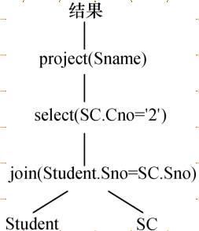

接下来，表示为关系代数


将投影移到叶端

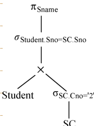

### 物理优化

物理优化大致有三种：

1. 基于规则的启发式优化
2. 基于代价估算的优化
3. 两者结合的优化方法

一、基于启发式规则的存取路径选择优化

（1）选择操作

1. 对于小的关系，可以直接**全表扫描**。这里的关系大小主要是看关系表占用的块数。
2. 如果查询条件是主码=值的查询，直接使用**主码索引**。
3. 如果查询条件是非主属性=值的查询，并且选择列上有索引，此时要估计查询结果的元组数目。如果**比例较小**（一般<10%），可以使用**索引扫描**；否则一般还是使用**全表扫描**。
4. 如果查询条件是属性上的非等值查询或范围查询，并且选择列上有索引，方法同上。
5. AND连接的合取选择条件，如果有涉及这些属性的**组合索引**，优先使用组合索引扫描；吐过某些属性有一般索引，方法和之前一样，依据比例选取索引扫描和全表扫描。
6. OR连接的析取选择条件使用**全表扫描**。

（2）连接操作的启发式规则

1. 2个表都已经按照连接属性排序，使用**排序合并**方法。
2. 如果一个表在连接属性上有索引，使用**索引连接**方法。
3. 如果前2个都不适用，且一个表较小，使用**Hash Join**法。
4. 如果以上都不满足，不得不使用嵌套连接法，那么将较小表作为外层循环的表，也就是**外表**。

1-3非常显然，这里对4进行解释。假如$R,S$占用块数是$B_r, B_s$，内存缓冲区块数$K$，分配$K-1$块给外表，此时循环存取块数是
$$
B_r + \frac{B_r}{K-1}B_s
$$
因此，需要让$B_r$尽可能小，也就是取较小的表，可以让块数尽可能少。

二、基于代价估算的优化

进行代价优化，依赖于统计信息，同时也需要一定的算法。启发式规则的优化是定性的选择，适合解释执行的系统；而编译执行的系统查询优化和执行是分开的，可以使用精细一些的基于代价的优化方法。

（1）统计信息

数据字典是关于数据的数据。统计信息大多来自数据字典中，包含的信息包括以下几类：

对每个基本表：

- 表元组总数$N$
- 元组长度$l$，单个元组所占存储空间大小
- 占用块数$B$，数据库在运行过程中对存储空间使用可能不连续，所以实际占用块数并不一定是$Nl$，而有随机分配的情况。

对基本表中的每个列：

- 列中不同值的个数$m$，比如学号列的取值是$N$，性别列的取值个数是$2$。
- 选择率$f$，如果分布均匀那么$f=\frac{1}{m}$，否则每个值的选择率是具有该值的元组$\div N$
- 该列的max、min
- 该列是否建立了索引和索引类型

如果建立了索引，以$B+$树为例：

- 索引的层数$L$
- 不同索引值的个数
- 索引的选择基数$S$（有多少个元组有某个索引值）
- 索引的叶节点树$Y$

（2）代价估算示例

下面举几个实例。

I. 全表扫描算法的代价估计公式

如果基本表大小是$B$块，全表扫描算法代价$cost = B$

如果选择条件是码=值，平均搜索代价$cost = \frac{B}{2}$

II. 索引算则算法的代价估算公式

如果选择条件是码=值，这个时候使用B+树，那么需要读取的是$L+1$块

如果选择条件涉及非码属性，选择条件是相等比较，这个时候最坏情况下满足条件的元组保存在不同块上，时间开销是$L+S$。

如果比较条件是$\ge, >, \le, <$等操作，如果有一半元组满足条件就要存取一半叶节点，时间开销是$cost=L+\frac{Y}{2}+\frac{B}{2}$

III. 嵌套循环连接算法的代价估算公式

我们已经讨论过$cost=B_r+B_s\dfrac{B_r}{K-1}$。如果还需写回磁盘，那么
$$
cost=B_r+B_s\frac{B_r}{K-1}+\frac{Frs\cdot N_rN_s}{Mrs}
$$
其中$Frs$表示连接结果中元组数的比例，叫做连接选择性；$Mrs$是存放连接结果的块因子，表示每块可以存放的结果元组数目。

IV. 排序-合并算法代价估算公式

如果已经排好序，那么
$$
cost=B_r+B_s+\frac{Frs\cdot N_rN_s}{Mrs}
$$
如果必须对文件排序，还需要加上排序代价。这个代价是
$$
2B+2B\log_2B
$$

作业：6

## 数据库的安全性

数据库的安全性是指保护数据库防止不合法使用造成的数据库的泄露、更改和破坏。它的核心是防止不合法的好坏，它的安全性也是评判数据库优劣的一大指标。

并不是每种数据库都有相同的安全级别，并且它的安全与操作系统的安全、网络安全等连成一个整体，整个计算机系统是安全防范的目标。

1985年的时候，美国国防部DOD提出了安全标准《可信计算机系统的评估标准》（橘皮书），对计算机系统安全性进行了评估。1991年美国国家计算机安全中心NCSC提出了《TCSEC关于可信数据库系统的解释》（紫皮书），是对数据库安全的标准解释。

它把系统分成4组7级。

- D级：最低级别，保留给不符合安全要求的系统
- C1级：提供初级的自主安全保护
- C2级：提供受控的存取保护（用户基础上同时受到某些约束设置）
- B1级：标记安全保护 提供强制存取控制和审计等安全机制
- B2级：结构化保护 通过安全模型对系统所有主体和客体实行DAC和MAC
- B3级：安全域 提供访问监控器功能，设计跟踪以及系统恢复功能
- A1级：验证设计 在B3基础上给出形式化设计说明并得到验证各安全功能的真正实现

现在的所有商业化系统，一般能达到B2级的标准。A1级主要停留在理论验证阶段，实际中很少使用。

### 数据库的安全性控制

数据库安全和计算机系统的安全是密不可分的。当用户提出访问请求，首先需要用户标识和鉴别，来得到用户身份。接下来由数据管理系统根据存取控制策略，确定有无访问权限。数据库系统访问底层硬件的时候，需要经过操作系统的安全防护。访问物理存储的时候，也可以有物理存储上的安全性，比如对数据进行加密。

这里最基本的因素，就是用户的鉴别。常见的机制有用户名和口令、数字证书和动态口令。

SQL中的存取控制通过授权-回收命令来给予用户某些权限，这一权限会放到数据字典当中。这完全由用户来决定，数据资源的安全性完全由用户控制，称为**自主存取控制（DAC）**。如果这种控制不完全由用户确定，也由数据本身确定，对每个数据对象标以一个密级，每个用户授予一个级别的访问许可，这种客体的保密级别叫做**强制存取控制**。

如今的自主存取控制，除了grant和revoke，有些提供了更细化的控制级别。有些数据库支持对字段级别进行访问控制，有些系统根据数值取值来提供权限控制，有些系统有对时间段、终端号的控制机制，有些系统引入了角色概念来标识某种职能。

在MAC中，引入了主体和客体的概念。主体是活动的实体，客体是被操作的对象；主体的敏感度标记叫做许可证级别，客体的敏感性叫做密级。当主体的许可证级别大于等于客体密级，才能读取相应客体；当主体的许可级别**等于**客体密级的时候，才能写相应客体。MAC的实现首先依赖于DAC。

除此之外，还有一些机制来保证安全性：

- 视图机制
- 审计，对访问操作记录在审计日志
- 数据加密，从明文加密到密文
- 统计功能安全性，防止用户使用聚集函数获得不被授权的单记录信息

## 数据库完整性

数据库完整性包含**正确性、有效性和相容性**，主要是为了防范不合语义的、不正确的数据。

这种完整性约束条件分成几类。按照约束条件对象关系，区分为关系-元组间的约束、元组-元组间的约束和列-字段的约束；按照约束的状态，可以分成静态条件（某个确定状态时数据的约束条件）和动态（从一个状态到另一个状态的新旧值约束条件）条件。

DBMS需要完成：

1. 定义完整性约束条件机制
2. 提供完整性检查的方法
3. 违约处理

通过这样的机制，就可以保证数据库完整性。

### 实体完整性

对于关系模型，使用`PRIMARY KEY`来定义实体完整性。实体完整性要求主码不能取空。对于单属性构成的码，可以定义为列级，也可以定义为表级；多个属性构成的码只能有一种说明方法。

```sql
CREATE TABLE S {
	Sno CHAR(9) PRIMARY KEY, /*列级定义主码*/
	...
}
CREATE TABLE S {
	Sno CHAR(9), 
	...
	PRIMARY KEY(Sno) /*表级定义主码*/
}
```

对于插入和更新操作，要检查主码是否唯一，并且每个属性不为空。

### 参照完整性

```sql
CREATE TABLE SC (
    Sno CHAR(9) NOT NULL，
    Cno CHAR(4) NOT NULL，
    Grade SMALLINT，
    PRIMARY KEY (Sno， Cno)， /*在表级定义实体完整性*/
    FOREIGN KEY (Sno) REFERENCES Student(Sno)，
    /*在表级定义参照完整性*/
    FOREIGN KEY (Cno) REFERENCES Course(Cno)
    /*在表级定义参照完整性*/
);
```

对于参照完整性的违约，情况如下：

| 被参照表           | 参照表             | 违约处理               |
| ------------------ | ------------------ | ---------------------- |
| 可能破坏参照完整性 | 插入元组           | 拒绝                   |
| 可能破坏参照完整性 | 修改外码值         | 拒绝                   |
| 删除元组           | 可能破坏参照完整性 | 拒绝/级联删除/设置为空 |
| 修改主码值         | 可能破坏参照完整性 | 拒绝/级联修改/设置为空 |

如果设置为空，还需要设置外码列是否为空。对于其设置可以使用这样的方法：

```sql
FOREIGN KEY (Sno) REFERENCES Student(Sno) 
    ON DELETE CASCADE /*级联删除SC表中相应的元组*/
    ON UPDATE SET NULL， /*级联更新SC表中相应的元组*/
FOREIGN KEY (Cno) REFERENCES Course(Cno) 
    ON DELETE NO ACTION /*当删除course 表中的元组造成了与SC表不一致时拒绝删除*/
    ON UPDATE CASCADE  /*当更新course表中的cno时，级联更新SC表中相应的元组*/
```

### 用户自定义完整性

一、属性级别的约束条件

对于属性级别，分成三种：

- NOT NULL
- UNIQUE
- CHECK

下面进行举例。

NOT NULL：

```sql
CREATE TABLE SC (
	Sno CHAR(9) NOT NULL,
    Cno CHAR(4) NOT NULL,
    Grade SMALLINT NOT NULL
)
```

UNIQUE：

```sql
CREATE TABLE DEPT(
	Deptno NUMERIC(2),
    Dname CHAR(9) UNIQUE
)
```

CHECK：

```sql
CREATE TABLE Student (
	Sno CHAR(9) PRIMARY KEY,
    Ssex CHAR(2) CHECK (SSex IN ('男','女'))
)
```

如果约束不满足则会拒绝执行。

二、元组级别的约束条件

使用CHECK。

```sql
CREATE TABLE Student (
	Sno CHAR(9) PRIMARY KEY,
    Sname CHAR(8) NOT NULL,
    SSex CHAR(2) CHECK (SSex IN ('男','女')),
    CHECK(SSex = '女' OR Sname NOT LIKE 'Ms.%')
    /*男性不能以Ms.打头*/
)
```

如果约束不满足则会拒绝执行。

三、约束子句

使用CONSTRAINT进行约束。

```sql
CONSTRAINT <约束名> [
    PRIMARY KEY 短语
    |FOREIGN KEY 短语
    |CHECK 短语
]
```

比如建立Student表，要求学号在90000-99999之间，姓名不能取空，年龄小于30，性别为男或女。

```sql
CREATE TABLE Student(
	Sno NUMERIC(6)
    CONSTRAINT C1 CHECK(Sno BETWEEN 90000 AND 99999),
    Sname CHAR(20)
    CONSTRAINt C2 NOT NULL,
    Sage NUMERIC(3)
    CONSTRAINT C3 CHECK(Sage < 30),
    Ssex CHAR(2)
    CONSTRAINT C4 CHECK(SSex IN('男','女')),
    CONSTRAINT StudentKey PRIMARY KEY(Sno)
)
```

如果需要修改完整性限制，使用ALTER TABLE语句

比如把之前的SSex进行修改：

```sql
ALTER TABLE Student
DROP CONSTRAINT C4;
ALTER TABLE Student
CONSTRAINT C4 CHECK(SSex IN('男','女','其它'))
```

四、域的完整性约束

可以创建一个域进行取值贤治。

```sql
CREATE DOMAIN GenderDomain VARCHAR(2)
CHECK(VALUE IN('男','女','其它'))
```

这个时候，对SSex说明可以直接使用`SSex GenderDomain`

也可以对其域进行一定的修改：

```sql
/*建立*/
CREATE DOMAIN GenderDomain CHAR(2)
CONSTRAINT GD CHECK(VALUE IN('男','女'));
/*删除*/
ALTER DOMAIN GenderDomain
DROP CONSTRAINT GD;
/*增加*/
ALTER DOMAIN GenderDomain
ADD CONSTRAINT GDD CHECK(VALUE IN('1', '0'))
```

### 触发器

触发器是用户顶i有的一类事件驱动的特殊过程，由服务器自动激活。对触发器的定义使用下面的形式：

```sql
CREATE TRIGGER <触发器名>
 {BEFORE|AFTER} <触发事件(INSERT|DELETE|UPDATE)> ON <表名>
 FOR EACH {ROW | STATEMENT}
 [WHEN <触发条件>]
 <触发动作体>
```

事实上，可以用五元组$(D,O,A,C,P)$来表示一个完整性规则，其中

- D：数据
- O：触发完整性约束的操作
- A：约束条件
- C：选择数据对象值的谓词
- P：违反完整性约束时出发的处理

这里要注意的是，触发器类型可以分成行级(ROW)或者语句级(STATEMENT)。比如下面的语句

```sql
UPDATE Teacher SET Deptno = 5
```

那么语句级触发级只执行一次，行级有多少行就执行多少次。

考虑下面的例子：一个BEFORE行级触发器，让Teacher定义规则：教授工资不得低于4000，低于就自动改成4000.这个时候，可以使用下面的语句：

```sql
CREATE TRIGGER Insert_Or_Update_Sal
	BEFORE INSERT OR UPDATE ON Teacher
	FOR EACH ROW
	AS BEGIN
		IF (new.Jpb = '教授') AND (new.Sal < 4000) THEN
			new.sal := 4000;
		END IF;
	END;
```

再看一个例子。我们试图实现在教师表的工资变化的时候自动在工资变化表Sal_log增加相应记录。为此，先建立Sal_log表

```sql
CREATE TABLE Sal_log(
	Eno NUMERIC(4) references teacher(eno),
    Sal NUMERIC(7,2),
    Username CHAR(10),
    Date TIMESTAMP
);
```

然后定义触发器

```sql
CREATE TRIGGER Insert_Sal
	AFTER INSERT ON Teacher
	FOR EACH ROW
	AS BEGIN
		INSERT INTO Sal_log VALUES(
        	new.Eno, new.Sal, CURRENT_USER, CURRENT_TIMESTAMP;
        );
    END;
CREATE TRIGGER Update_Sal
	AFTER UPDATE ON Teacher
	FOR EACH ROW
	AS BEGIN
		IF (new.Sal <> old.sal) THEN 
			INSERT INTO Sal_log VALUES(
        		new.Eno, new.Sal, CURRENT_USER, CURRENT_TIMESTAMP;
        	);
        END IF;
    END;
```

触发器是自动激活的，一般遵循BEFORE触发器-SQL语句-AFTER触发器的执行顺序。

删除触发器使用DROP语句：

```sql
DROP TRIGGER <触发器名> ON <表名>
```

作业：10 12 13

## 数据库恢复技术

实现恢复的核心是使用冗余，也就是根据冗余数据重建不正确数据。

### 事务

事务是一个数据库操作序列，是一个不可分割的工作单位，是恢复和并发的基本单位。

在关系数据库中，一个事务是一条或多条SQL语句，也可以包含一个或多个程序。一个程序通常包含多个事务。

可以显式的定义一个事务：

```sql
BEGIN TRANSACTION 
	SQL 语句1
	SQL 语句2
	……
COMMIT|ROLLBACK
```

COMMIT是提交事务，ROLLBACK是回滚。

事务具有四个非常重要的特性，即ACID特性：

- 原子性（Atomicity） 原子性是指，事务要不全部完成，要不全部取消。如果事务失败，会回滚到事务之前。
- 一致性（Consistency） 一致性是指，只有合法的数据才能写入数据库。
- 隔离性（Isolation） 隔离性是指，如果两个事务同时执行，那么执行顺序不影响执行结果。
- 持续性（Durability） 持久性是指，一旦事务提交，数据必须保存在数据库之中。

事务一般有五种状态，其状态图如下：

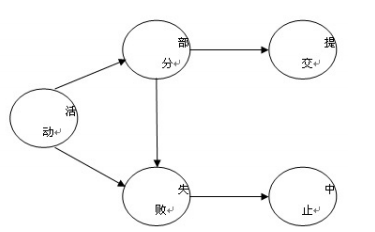


### 故障和恢复

常见的故障有四种：事务内部的故障、系统故障、介质故障、计算机病毒。

事务内部的故障有些是通过事务程序本身发现的，有些是非预期的。比如，有一个事务，从A转账给B。有下面的事务程序：

```sql
BEGIN TRANSACTION
	BALANCE = BALANCE - 100
	IF (BALANCE < 0) THEN {
		ROLLBACK
	} ELSE {
		读取用户乙的余额BALANCE1
		BALANCE1 = BALANCE + AMOUNT
		写回BALANCE1
		COMMIT
	}
```

如果出现了余额不足，就可以回滚，保证数据库状态正常，而不是只减了甲的钱却不影响乙的钱。

有的时候事务故障是非预期的，比如运算溢出、死锁、违反完整性限制。这类故障一般使用撤销事务（UNDO）。

系统故障是造成系统停止运转的任何事件，使得系统要重新启动。这个时候，系统运行被破坏，事务非正常终止，不破坏数据库，缓存区信息丢失。

这种系统故障可能是硬件错误或操作系统故障引起的。如果发生故障的时候事务未提交，那么直接UNDO未完成事务；如果已提交但缓冲区未写入磁盘，那么进行REDO。

介质故障是外存故障，比如磁盘损坏、磁头碰撞、操作系统潜在错误、瞬时强磁场干扰。一般需要装入介质故障前某个时刻的数据副本，重做所有成功事务。

计算机病毒是人为故障或破坏。

### 数据转储

一、静态转储和动态转储

在没有运行事务的时候，进行的就是**静态转储**。转储开始前数据库一致，并且期间不能对数据库进行存取和修改。这种方法实现简单，但是降低了数据库的可用性，因为新的事务必须等转储结束。

如果将转出操作和用户事务并发执行，进行的就是**动态转储**。转储期间可以进行存取修改，这种方法无需等待正在运行的用户事务，也不会影响新事务运行。但是动态转储不能保证副本中数据的正确性。

因此，做动态转储需要把各事务的修改活动记下来，建立日志，用后备副本加上日志使得数据库恢复。

二、海量转储与增量转储

海量转储是每次转储所有数据库，增量转储是只转储上次转储后的数据。

从恢复角度来看，海量转储更方便，但是数据库很大的时候增量转储更有效。

### 日志

日志是记录事务对数据库更新操作的文件。

一、日志文件的格式和内容

一般来说，日志有记录为单位，也有以数据块为单位。

以记录为单位的日志内容包含：

- 事务开始标记
- 事务结束标记
- 事务所有更新操作

这样的称为一个日志记录。每条日志记录又分成

- 事务标识（表明事务种类）
- 操作类型（插入、删除、修改）
- 操作对象（记录内部标识）
- 更新前数据的旧值（对插入操作来说是空）
- 更新后数据的新值（对删除操作来说是空）

以数据块为单位的日志文件，每条日志记录内容是

- 事务标识
- 被更新的数据块

二、日志文件的作用

日志文件可以进行事务故障恢复、系统故障恢复、协助后备副本进行介质故障恢复。

下面是一个用静态转储副本和日志文件进行恢复的例子。

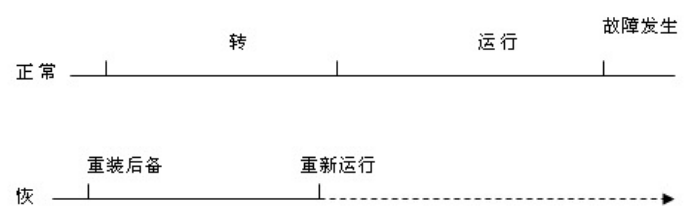

在静态转储的基础上，得到一个一致性副本，然后发生故障。那么重新运行所有事务，就可以把数据库恢复到一致状态。

三、登记日志文件

登记日志的次序需要严格按照并行事务执行的时间次序。必须**先写日志文件，后写数据库**。

这是因为，如果在二者之间故障发生了，先写数据库，这个记录就无法恢复；如果先写日志，只需要做一次UNDO。

四、故障的恢复

（1）事务故障

恢复事务故障，首先反向扫描文件日志，然后查找事务的更新操作。接下来，对事务更新操作进行逆操作，把更新前的值重新写入。

继续扫描文件日志，查找事务其它操作，直到读到事务开始标记。

（2）系统故障

首先正向扫描日志，然后建立两个队列。第一个叫做REDO队列，第二个叫做UNDO队列。REDO队列存放故障发生前的已经COMMIT的事务，UNDO队列存放尚未发生的队列。

对UNDO队列的事务统一进行UNDO处理，也就是在数据库中储存更新前的值；对REDO队列的事务统一做REDO处理，把更新后的值写入数据库。

（3）介质故障

介质故障一般先重装数据库，然后重做已完成的事务。

一般来说，可以装入最新的后备数据库副本。静态副本可以直接装入，动态副本还需要装入转储时的日志文件副本。

介质故障恢复往往需要DBA的介入，重装最近转储的副本和各日志文件副本，执行系统提供的恢复命令。

### 检查点

之前的日志恢复技术，搜索日志需要大量时间，同时REDO也大量耗费了时间。因此，具有检查点的恢复技术是常见的技术。

建立检查点一般有两种，可以是按固定时间间隔定期建立，也可以按照某种规则，比如日志文件写满一半建立一个检查点。检查点实际上就是一个标记，事务$T$在检查点之前提交，那么$T$已经写入了数据库，无需进行REDO。

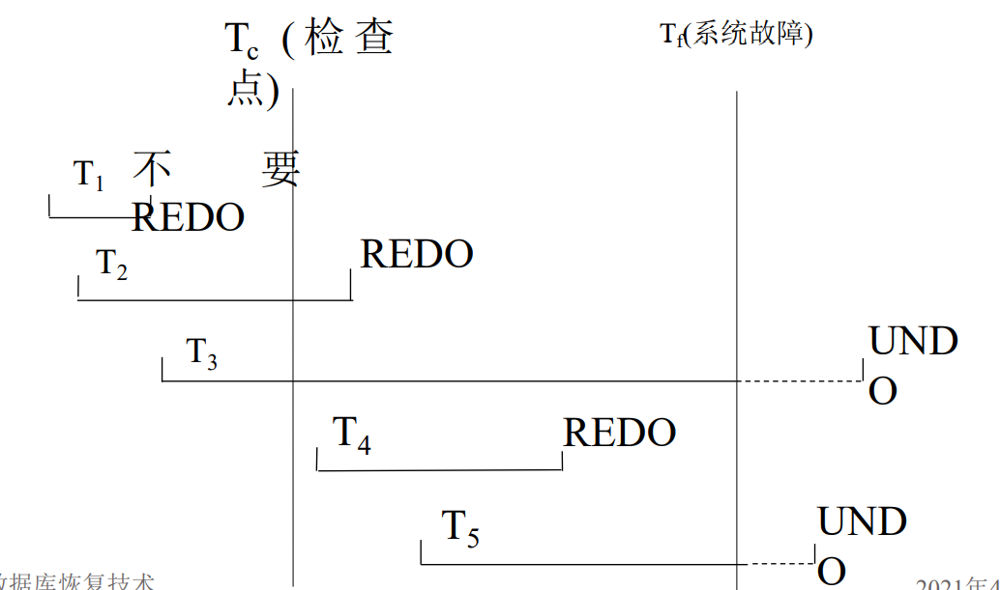

T3、T5在故障发生时未完成，所以撤销；T2、T4在检查点之后提交，需要REDO；T1则无需REDO。

用检查点的恢复步骤如下：

- 找到最后一个检查点记录的地址
- 由检查点记录得到正在执行的事务ACTIVE-LIST，建立UNDO和REDO LIST，并把ACTIVE LIST放入UNDO LIST
- 正向扫描日志文件，新开始的事务放入UNDO LIST，提交事务放到REDO LIST
- UNDO LIST进行UNDO，REDO LIST进行REDO

### 数据库镜像

DBMS自动把整个数据库或其中关键数据复制到另一个磁盘上，由DBMS保证镜像数据和主数据库的一致性。在出现介质故障的时候，可以由镜像磁盘继续使用，同时DBMS利用磁盘数据进行恢复，而无需重装数据库副本。


同时，在没有出现故障的时候，数据库镜像也可以用于并发操作，如果一个用户对数据加排他锁，其他用户可以读镜像数据库的数据。

频繁的复制数据会降低效率，所以一般只对关键数据和日志进行镜像。

## 并发控制

在数据库系统，经常需要多个用户同时使用。同一时间并发的事务可达数百个，这就是并发引入的必要性。

常见的并发系统有三种：

- 串行事务执行，每个时刻只有一个事务运行，不能充分利用系统资源
- 交叉并发，并行事务并行操作轮流交叉运行
- 同时并发，多个处理机同时运行多个事务

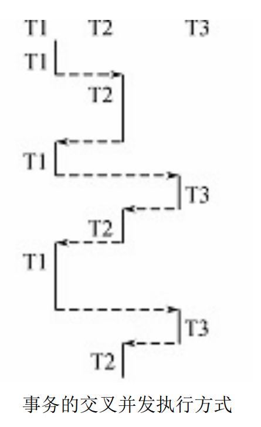

但是并发控制可能导致一些问题，所以主要有三个任务：

- 对并发操作的正确调度
- 保证事务隔离性
- 保证数据库的一致性

### 并发操作的后果

并发控制可能导致的数据不一致性有三类：

- 丢失修改
- 不可重复读
- 读脏数据

为了说明这三种情况，我们用$R(x)$表示读数据$x$，$W(x)$表示写数据$x$.

一、丢失修改

考虑下面的情况：

| $T_1$           | $T_2$             |
| --------------- | ----------------- |
| $R(A)=16$       |                   |
|                 | $R(A)=16$         |
| $A=A-1,W(A)=15$ |                   |
|                 | $A=A-1$,$W(A)=15$ |

那么$T_1$对$A$的修改丢失了。

二、不可重复读

不可重复读是在$T_1$读取数据后，$T_2$更新，导致$T_1$无法再现读取结果。

（1）RUR(Read, Update, Read)

| $T_1$                     | $T_2$                |
| ------------------------- | -------------------- |
| $R(A)=50,R(B)=100, S=150$ |                      |
|                           | $R(B)=100, W(B)=200$ |
| $R(A)=50,R(B)=200, S=250$ |                      |

（2）RDR(Read, Delete, Read)

| $T_1$                     | $T_2$                 |
| ------------------------- | --------------------- |
| $R(A)=50,R(B)=100, S=150$ |                       |
|                           | 将B记录从数据库中删除 |
| 无法读取到B的记录         |                       |

（3）RAR(Read, Add, Read)

| $T_1$                           | $T_2$                 |
| ------------------------------- | --------------------- |
| A中有两条记录，$\sum A_i = 100$ |                       |
|                                 | 将记录50插入到集合A中 |
| A中有三条记录，$\sum A_i = 150$ |                       |

三、读脏数据

事务$T_1$修改某一数据，并写回磁盘，然后$T_2$读取之后，$T_1$因为某种原因被撤销，这个时候$T_2$的数据可能不一致。

| $T_1$                  | $T_2$      |
| ---------------------- | ---------- |
| $R(C)=100, W(C)=200$   |            |
|                        | $R(C)=200$ |
| ROLLBACK C，C恢复为100 |            |

### 封锁

一、封锁的概念

封锁是指事务在某个数据对象操作前先对系统请求进行加锁。加锁之后，事务就有了数据对象控制权。

基本封锁类型有两种：排它锁（Exclusive Locks, X锁）和共享锁（Share Locks, S锁）

排它锁又称写锁，如果$T$对$A$加X锁，那么其它事务不能加任何其他锁。这个时候，其它事务不能读取和修改。

共享锁又称读锁，如果$T$对$A$加S锁，那么其它事务只能对$A$加$S$锁。这个时候，其它事务可以读$A$，但是在$T$释放锁之前不能进行修改。

换言之，存在锁的相容矩阵：


二、封锁协议

申请锁、持有锁、释放锁的规则，叫做封锁协议。

一级封锁协议是事务中队数据修改之前必须对其加排它锁直到事务结束。

一级封锁协议可以有效防止丢失更新。


二级封锁协议是在一级协议的基础上，要求读取数据之前必须加共享锁，读完再释放。这样可以防止读脏数据。

二级封锁协议可以有效防止读脏数据。


三级封锁协议是在二级基础上，增加某事务施加的共享锁，保持到事务结束再释放。

三级封锁协议可以解决不可重复得问题。


### 活锁和死锁

一、活锁

考虑有四个事务T1,T2,T3,T4

T1封锁数据R，T2请求R，所以T2等待。T3也请求R，然后T1释放R的锁之后系统调度给T3，T4请求R，T3释放R的锁之后系统调度给T4，导致T2永远等待。这就是活锁。


避免活锁比较简单，只需要采取先来先服务的策略，在多个事务请求封锁同一个数据对象的时候按照请求封锁的先后次序对事务排序。

二、死锁

考虑两个事务T1、T2。T1封锁R1，T2封锁R2。T1此时请求封锁R2，而T2封锁R2，所以T1等待T2释放R2的锁。此时T2又申请R1，T1已经封锁R1，T2只能等待T1释放R1的锁。此时，T1、T2形成死锁。


如果希望预防死锁，一般有两个思路：

- 一次封锁法。要求每个事务必须一次将所有要使用的数据全部 加锁，否则就不能继续执行。但是这样比较难确定封锁对象，也会导致并发度降低。
- 顺序封锁法。对数据对象规定封锁顺序，按照顺序进行封锁。但是这样难以确定事务要封锁哪些对象。

因此，死锁的预防比较难，多采用诊断解决的思路。

最简单的诊断方法就是使用超时法，如果事务等待时间超过规定时限，就说明发生死锁。这样实现简单，但是可能误判，并且如果时限过长，可能会让死锁无法及时发现。

等待图法是一个比较好的方式。设$G=\langle V,E\rangle$，$V$是正运行的事务，$E$是事务等待情况，如果$T_1$等待$T_2$，就连接$T_1T_2$。如果图中存在回路，说明系统出现死锁。

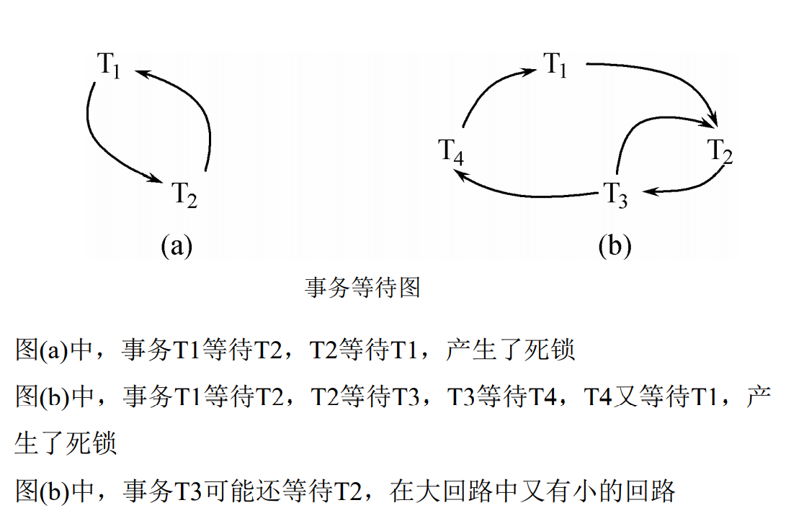

检测到死锁后，选择一个处理死锁代价最小的事务，将其撤销。释放事务持有的所有锁，让其他事务能运行下去。

### 可串行性

多个事务的并发执行想要保证正确性，需要结果和某一次序串行执行结果相同。

一、可串行化的判定

可串行性是并发事务正确调度的准则，只有并发调度是可串行化的才能认为是正确调度。

考虑下面的两个事务：

- T1：读B，A=B+1，写回A
- T2：读A，B=A+1，写回B

对于下面的这些策略：


这两种策略相当于串行执行，因此并行执行的结果应当和二者之一相同。而对于下面的例子：


不可串行化。

二、冲突可串行化

冲突可串行化给出了一个可串行化的充分条件：

一个调度Sc在保证**冲突操作**次序不变的情况下，通过交换两个事务不冲突操作的次序得到另一个调度Sc'。如果Sc'是串行的，称调度Sc为冲突可串行化的调度。

这里需要先引入冲突操作的概念。所谓冲突操作是指如下操作：

- 事务Ti读x，Tj写x
- 事务Ti写x，Tj写x

下面举一个例子。

> 证明：调度Sc1=r1(A)w1(A)r2(A)w2(A)r1(B)w1(B)r2(B)w2(B)可串行化。

r1(A)、w1(A)、w2(A)不可交换，r1(B)、w1(B)、w2(B)不可交换。

这样，可以交换为r1(A)w1(A)r1(B)w1(B)r2(A)w2(A)r2(B)w2(N)

这是一个串行调度T1T2，所以Sc1是冲突可串行化调度。

需要注意的是，这个条件并不是必要的。下面举一个反例。

> T1=W1(Y)W1(X), T2=W2(Y)W2(X), T3=W3(X)

调度W1(Y)W2(Y)W2(X)W1(X)W3(X)结果与T1T2T3相同，可串行化，但并非冲突可串行化。

### 两段锁

在封锁的时候，对数据对象加锁需要遵守约定，比如何时申请加锁、锁持续时间和何时释放。两段封锁协议（2PL）是最常用的封锁协议，并且能产生可串行化调度。

两段锁协议是指所有事务需要分两个阶段对数据项加锁和解锁：

- 在数据读写之前，事务需要先取得封锁
- 释放封锁之后，事务不再申请和获得其它封锁

这里的两段，具体来说就是事务的两个阶段：

- 扩展阶段，获得封锁，可以申请获得数据项上任何类型的锁，但是不能释放任何锁
- 收缩阶段，释放封锁，可以释放任何数据线上的任何类型的锁，但是不能申请任何锁。

比如事务A按照两段锁协议的封锁序列是：

Slock A, Slock B, Xlock C, Unlock B, Unlock A, Unlock C

如果多个调度都符合两段锁协议，一定是一个可串行化调度。


但是两段锁可能会出现死锁，所以还需要引入**一次封锁法**。也就是事务必须一次将所有使用数据全部加锁，否则就不能继续执行，这样可以回避死锁。

### 封锁粒度

封锁对象的大小称为封锁粒度。封锁对象分成逻辑单元和物理单元。

在关系数据库中，逻辑单元包括属性值、属性值集合、元组、关系、索引项、整个索引、整个数据库；物理单元包括页和物理记录。

封锁粒度和系统并发度与并发控制的开销密切相关。

- 粒度大，封锁数据单元少，并发度低，开销小
- 粒度小，并发度高，开销大

下面举两个例子。

（1）若封锁粒度是数据页，事务T1需要修改元组L1，则T1必 须对包含L1的整个数据页A加锁。如果T1对A加锁后事务T2要修改A中元组L2，则T2被迫等待，直到T1释放A。如果封锁粒度是元组，则T1和T2可以同时对L1和L2加锁，不需要互相等待，提高了系统的并行度。

（2）事务T需要读取整个表，若封锁粒度是元组，T必须对表中的每一个元组加锁，开销极大。

因此，在一个系统中需要同时支持多种封锁粒度供不同事务选择，也就是 **多粒度封锁**。在选择粒度的时候，要同时考虑封锁开销和并发度：

- 对处理多个关系大量元组的事务，以数据库为封锁单位
- 对处理大量元组的事务，以关系为封锁单位
- 对少量元组的用户事务，以元组为封锁单位。

可以用一颗树来表示粒度，称作多粒度树：

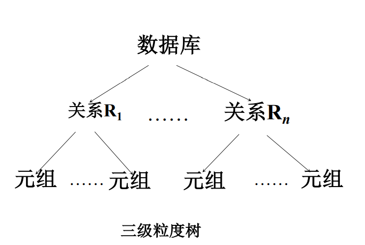

在这个树中，对一个结点加锁相当于节点所有子孙加同类型的锁。这里就引入了显式封锁和隐式封锁：显式封锁是直接加到数据对象上的封锁，隐式封锁是由于上级结点加锁导致的子节点加锁。

因此，系统在检查封锁冲突的收，需要检查显式封锁和隐式封锁。具体来说就是：

- 数据对象有没有显式封锁与之冲突
- 本事务显式封锁是否与上级节点隐式封锁冲突
- 上面的显式封锁是否与本事务隐式封锁冲突

### 意向锁

在此基础上，引入意向锁，来提高对某个数据对象加锁时系统的检查效率。

如果对一个结点加意向锁，说明其下层节点正在被加锁；对任意结点加基本锁，必须对上层节点加意向锁。

常用的意向锁有三种：

- 意向共享锁（IS锁），表示后裔节点拟（意向）加S锁
- 意向排它锁（IX锁），表示后裔节点拟（意向）加X锁
- 共享意向排它锁（SIX锁），表示对它加S锁，再加IX锁。

对于这些锁，相容矩阵如下：


锁强度的哈斯图如下：


这里锁强度是对其他所的排斥程度，强锁对弱锁是安全的。

在引入意向锁之后，执行封锁操作：

- 申请时按照从上到下的次序
- 释放时按照从下到上的次序

例如，T1对R1加S锁，需要下面的操作

- 对数据库加IS锁
- 检查数据库和R1是否加了不相容锁，也就是X或IX锁
- 无需搜索R1中元组是否加了X锁。

这样，意向锁提高了系统并发度，减少了加减锁的开销，得到广泛应用。

## 关系数据库设计理论

### 关系模型的存储异常

$\newcommand\FD{\operatorname{FD}} \newcommand\NF{\text{NF}} \newcommand\BCNF{\text{BCNF}} \newcommand\tt{\to\to}$ 数据库模式的设计是数据库应用系统的核心问题。首先考虑下面一个数据库表：


这个数据表存在下面一些问题：

（1）数据冗余

借书人每借一本书，信息重复存储，造成空间浪费，而且可能导致潜在数据不一致

（2）插入异常

由于主键是`(CARDNO,BNO)`，所以无法插入借书人信息

（3）删除异常

当借书人归还所借的书，需要从解约关系删除相关信息；但如果借书人还清所有书，所有信息就一起删除了

（4）更新异常

比如单位负责人发生改变，需要修改MN属性值，这样所有元组中的信息都需要修改，增加了更新代价

这些问题被统称为 **存储异常**。这些异常的出现是因为数据之间存在一定的依赖关系，但这个表并没有体现出这种依赖关系。我们把实体和实体间以及实体内部的属性之间的依赖关系叫做 **数据依赖**。

### 函数依赖

函数依赖（Functional Dependency, FD）是现实世界中最广泛的数据依赖。他是现实世界属性中相互联系的抽象，是数据内在的性质，表示了关系中属性间的制约关系。

这里引入四个定义：

- 函数依赖
- 函数依赖的平凡性
- 函数依赖的完全性
- 函数依赖的传递性

**定义10.1** 设关系模式$R(U)$，$X, Y \sube U$，$r$是$R(U)$上的一个关系

对$\forall t_1, t_2 \in r$，若$t_1,t_2$在$X$上属性值相等，在$Y$上的属性值也相等，则称X**函数决定**Y，或Y**函数依赖**X，记为$\operatorname{FD} X \to Y $。$X$为**决定因素**或函数依赖的**左部**，$Y$为函数依赖的**右部**。

> Example 在BORROW关系中，
>
> CARDNO → NAME
>
> CARDNO → DEPT
>
> CARDNO → MN
>
> DEPT → MN
>
> (CARDNO,BNO) → DATE

函数依赖是指R的**所有关系实例**均要满足的约束条件，而不是R的某个或某些盥洗室里满足的约束条件。它是语义范畴的概念，需要从现实世界中数据的语义来确定。比如，对于姓名→年龄，需要前提为不存在同名同姓的人。

**定义10.2** 设$\FD X \to Y$，若$Y \not \sub X$，则称$\FD X\to Y$是**非平凡函数依赖**；否则，若$Y \sube X$，则称$\FD X\to Y$为平凡的函数依赖。

> Example 在关系SC(Sno, Cno, Grade)中，
>
> (Sno, Cno)→Grade是非平凡函数依赖，(Sno,Cno)→Sno是平凡函数依赖

对于任一关系模式，平凡函数依赖**必然成立**。所以我们总是讨论非平凡函数依赖。

**定义10.3** 设$\FD X\to Y$，若$\forall X' \sub X$，$X' \to Y$都不成立，则称$\FD X\to Y$是完全函数依赖。若$X$的真子集$X'$有$X' \sub X$而$X' \to Y$成立，则称$\FD X\to Y$是部分函数依赖，即$Y$依赖$X$的一部分。

> Example 在关系BORROW中，
>
> (CARDNO,BNO)→DATE、CARDNO→NAME、CARDNO→DEPT、CARDNO→MN、DEPT→MN是完全函数依赖
>
> (CARDNO,BNO)→NAME、(CARDNO,BNO)→DEPT是部分函数依赖。

**定义10.4** 设关系模式$R$，$X,Y,Z$为$R$的属性子集，若$\FD X\to Y, Y \not \to X, Y \to Z$，则必有$\FD X\to Z$，称$\FD X\to Z$为传递函数依赖。

> Example 在关系BORROW中，
>
> CARDNO→DEPT，DEPT→MN，DEPT$\not\to$CARDNO，则有传递依赖CARDNO→MN。

特别的，如果$Y\to X, X\to Y$，则$X\leftrightarrow Y$，此时$X\to Z$，称$Z$**直接依赖**于X。

### 关系模式的规范化

为了设计好的数据模式，可以用规范化理论改造关系模式。通过分解关系模式，消除不合理的数据依赖，就可以解决存储异常。

1971年，E.F.Codd提出了范式（Normal Form, NF）的概念，给出了1NF、2NF、3NF.1974年，Codd和Boyce提出了BCNF(Boyce-Codd Normal Form)，之后又研究了4NF、5NF。

范式就是规范化的关系模式。从低到高，范式为1NF、2NF、3NF、BCNF、4NF。从低一级的范式通过模式分解，可以转化为若干高一级的范式的关系模式的集合，称为**关系模式的规范化**。

一、第一范式

**定义10.5** 若关系模式$R$中每个属性对应的域值都是不可再分的，则称$R$属于第一范式，记为$R \in 1\NF$。若数据库模式$R$中每个关系模式都是1NF，则记$R\in 1\NF$。

数据库系统中的关系至少是$1\NF$的，这是二维表的基本要求。

二、第二范式

**定义10.6** 设关系模式$R$，$A$是$R$中的属性，$F$是$R$上的函数依赖集。若$A$包含在$R$某个候选键中，称$A$为主属性，否则称$A$为非主属性。

**定义10.7** 如果$R \in 1\NF$，所有非主属性都**完全依赖于**$R$的每个候选键，则$R\in 2\NF$。

> Example 在关系BORROW中，
>
> CARDNO→NAME，但候选键是(CARDNO,BNO)→DATE。换言之，NAME部分依赖于主属性(CARDNO,BNO)。所以BORROW$\notin 2\NF$。 
>
> 因此，BORROW不是一个好的关系模式，是因为NAME、DEPT、MN部分函数依赖于候选键。
>
> 为此，可以将其分解成两个关系模式：
>
> 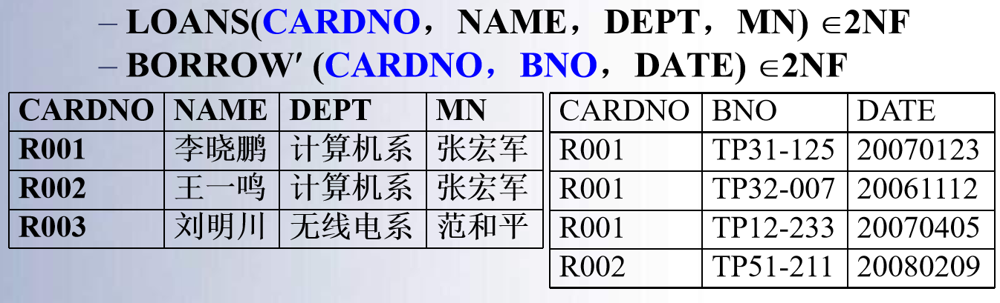
>
> 此时，LOANS和BORROW'都是$2\NF$的。
>
> 但此时DEPT和MN的插入异常问题仍然存在，所以不能完全消除存储异常。

三、第三范式

**定义10.8** 设$R \in 1\NF$，若$R$中**没有非主属性传递依赖于R的候选键**，那么$R \in 3\NF$。

> Example 在关系模式LOANS(CARDNO, NAME, DEPT, MN)中，由于CARDNO→DEPT，DEPT→MN，且DEPT$\not \to$CARDNO，则$\FD \text{CARDNO}\to \text{MN}$是传递依赖。
>
> 所以LOANS不是$3\NF$，将其进一步分解：
>
> 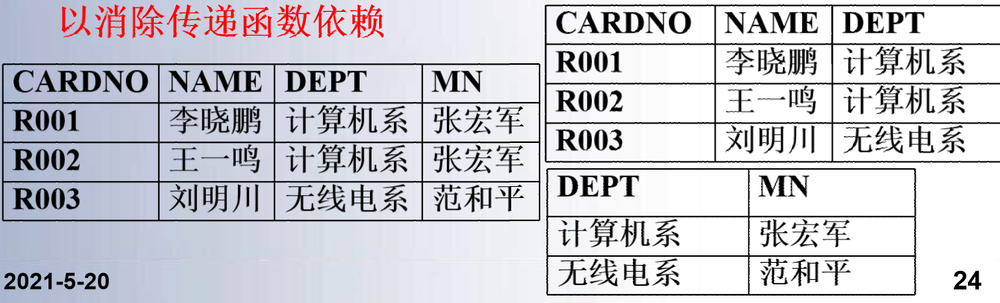

下面证明：$R \in 3\NF \to R \in 2\NF$。

证明 使用反证法。设$R$上函数依赖集为$F$，$R$的键为$K$，假设$R \in 3\NF \and R \notin 2\NF$，则$R$中非主属性$A$部分依赖于关键字$K$。那么存在$K$的真子集$K'$，使得$F |= K' \to A$。由于$K' \sub K$，有$\FD K\to K'$但$K' \not \to K$。于是，$K \to K', K' \not \to K, K' \to A, A \notin K$，则有$A$传递依赖于$K$，所以$R \notin 3\NF$，矛盾。

第三范式消除了非主属性和主属性间的部分函数依赖和传递函数依赖，但是没有解决主属性间的函数依赖。

四、BCNF范式

**定义10.9** 若$R \in 1\NF$，且$R$中没有任何属性传递依赖于R中的任意关键字，则$R \in \BCNF$。

它有一个等价定义：

**定义10.10** 若$R \in 1\NF$，$F$是$R$上的函数依赖集，对于$F$中每一个函数依赖$X \to Y$，必有$X$是$R$的一个候选键，则$R \in \BCNF$。

BCNF消除了主属性间的传递依赖。

> Example 在关系模式R(City, Street, Zip)中，函数依赖是(City,Street)→Zip和Zip→City。
>
> 在这个关系中，候选键是(City, Street)或(Street, Zip)。
>
> R没有非主属性，所以不存在部分函数依赖，$R \in 3\NF$。但是对候选键(Street, Zip)→City为部分函数依赖，同样存在存储异常。

BCNF具有的性质为

1. 所有非主属性完全函数依赖于每个候选码
2. 所有主属性完全函数依赖于每个不包含它的候选码
3. 没用任何属性完全依赖于非码的任何一组属性

在函数依赖范围内，BCNF已经达到了关系模式的最大分离。

### 多值依赖和4NF

考虑下面的一个关系：


如果用二维表进行表示，

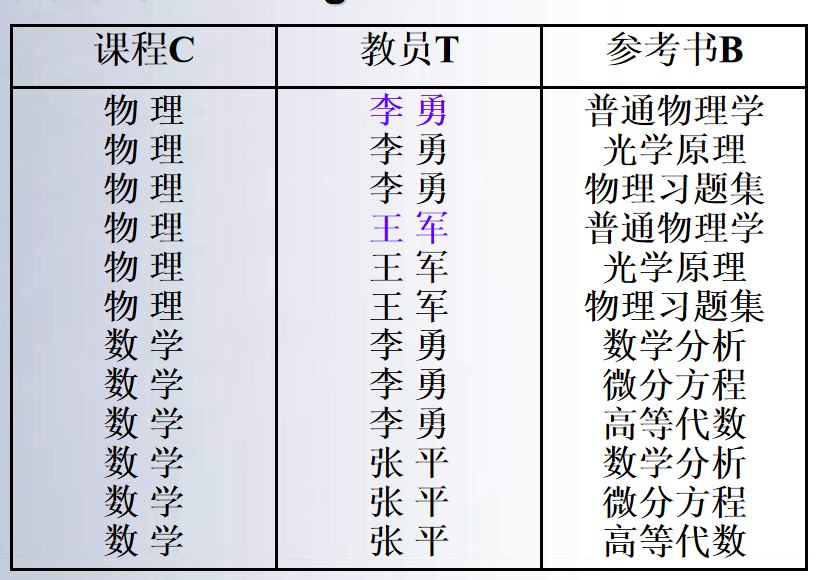

这个表存在唯一候选键$(C,T,B)$。但是如果在(C,T)或者(C,B)做投影，存在(C,T)→B等函数依赖。它具有如下问题：

- 数据冗余度大，多少名任课教师就要存储多少次参考书
- 插入操作复杂，增加一名老师就要增加对应参考书个元组
- 删除操作复杂
- 修改操作复杂

为此，我们引入多值依赖。

**定义10.11** $R(U)$为关系模式，$X,Y \sub U$，$Z = U - (XY)$。如果对$r(R)$中的任意两个元组$s,t$，若$s[X]=t[X]$，$r$中存在元组$u$，有
$$
u[X] = s[X], u[Y]=s[Y],u[Z]=t[Z]
$$
则关系$r(R)$满足**多值依赖**(MVD)X→→Y，称X多值决定Y或Y多值依赖X。

> Example 在上面的例子中，存在多值依赖课程→→教员和课程→→参考书。
>
> 

同时，也有一个等价定义：

**定义10.12** $R(U)$是一个关系模式，$X, Y, Z \sube U$，$Z = U - X - Y$。$r$是$R$上的一个关系。当且仅当对于给定的一个$x$值，有一组$y$的值，且这组$y$值仅仅取决于$x$值，而与$r$中其他属性$z$无关，则称$X$多值决定$Y$，记作$X \to\to Y$。

**定义10.13** 若$X\to\to Y$而$Z=\Phi$，则称$X\to\to Y$是平凡的多值依赖，否则为非平凡的多值依赖。

下面介绍多值依赖的性质。

- 对称性 如果$X \to \to Y$，则$X \to \to Z$，其中$Z = U - X - Y$。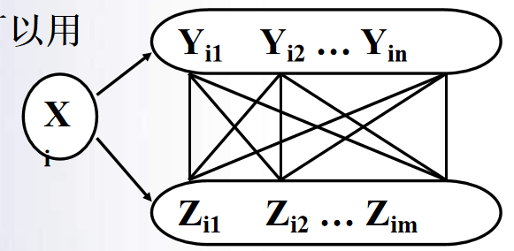
- 传递性 如果$X\to\to Y$，$Y\to \to Z$，则$X \to\to Z-Y$
- 和函数依赖的关系 若$X\to Y$，则$X \to\to Y$

对于多值依赖，再给出9公理。设$W,X,Y,Z$为$R$子集，那么

1. **自反率** $Y \sube X \Rightarrow X \to\to Y$
2. **增广率** $X\to\to Y, W \sube Z \Rightarrow XZ \to\to YW$
3. **相加律** $X\to\to Y, X \to\to Z \Rightarrow X\to\to YZ$
4. **投影率** $X\tt Y, X \tt Z \Rightarrow X\tt Y\cap Z, X \tt Y-Z$
5. **传递率** $X\tt Y, Y\tt Z \Rightarrow X \tt Z-Y$
6. **伪传递率** $X \tt Y, YW \tt Z \Rightarrow XW \tt Z-YW$
7. **互补率** $X\tt Y, Z = R-(XY) \Rightarrow X\tt Z$
8. **重复率** $X \to Y \Rightarrow X\tt Y$
9. **结合律** $X \tt Y, Z \to W, W \sube Y, Y \cap Z = \Phi \Rightarrow X \to W$

再多值依赖的基础上，可以定义4NF：

**定义10.14** 设$R \in 1\NF$。$F$是R上的FD集和MVD集。若$R$上任何一个非平凡的多值依赖$X\tt Y$，$X$都含义键，则称$R \in 4\NF$。

可以使用分解的方法消去非平凡非函数依赖的多值依赖。

> Example 对于Teaching(C,T,B)来说，存在非平凡多值依赖$C\tt T$。
>
> 用投影分解法把Teaching分解成CT(C,T)和CB(C,B)，则$C\tt T, C\tt B$为平凡多值依赖。

**规范化是范式的升高，连接是范式的降低。**


### 函数依赖公理

一、函数依赖的蕴含性

**定义10.15** 若$R$上的任意关系都满足一个确定的函数依赖集F，则称F为$R$满足的**函数依赖集**。

**定义10.16** 设函数依赖集$F$和关系模式$R(U)$，属性集$X,Y \sube U$，关系模式$R$满足$F$。如果关系模式$R$满足$\FD X\to Y$，则$F$**逻辑蕴含**$\FD X\to Y$，或称$X\to Y$逻辑蕴含于$F$，记作$F \models X\to Y$。

**定义10.17** 设函数依赖集$F$，所有被$F$逻辑蕴含的函数依赖为$F$的**闭包**，记为$F^+$。即：
$$
F^+ = \{X\to Y \mid F \models X \to Y\}
$$

> Example F={AB→C, C→B}是R(A, B, C)上的一组函数依赖，那么$F^+=${A→A，AB→A，AC→A，ABC→A，B→B，AB→B，BC→B，ABC→B， C→C，AC→C，BC→C，ABC→C， AB→AB，ABC→AB，AC→AC，ABC→AC，BC→BC，ABC→BC，ABC→ABC，AB→C，AB→AC，AB→BC，AB→ABC， C→B，C→BC，AC→B，AC→AB，AC→ABC }

**定义10.18** 设关系模式$R(U,F)$，$U$是$R$的属性全集，$F$是$R$的函数依赖集，$X$是$U$的子集。如果满足条件：

1. $X \to U \in F^+$
2. 不存在$X' \sub X \and X' \to U \in F^+$成立

则称$X$为$R$的一个**候选键**。

为了从函数依赖求得蕴含的函数依赖，就需要一套推理规则。这套规则有Armstrong给出。

二、Armstrong公理系统

函数依赖的公理系统是模式分解算法的理论基础。

**定理10.1** 设关系模式$R(U,F)$，$X, Y, Z, W \sube U$，则Armstrong公理为：

1. **自反率**  $Y \sube X \sube U$，则$F \models X \to Y$
2. **增广率** $X \to Y, Z \sube U$，则$F \models XZ \to YZ$
3. **传递率** $X \to Y, Y \to Z$，则$F \models X \to Z$

下面给出证明。

自反率：若$t_1[X] = t_2[X]$，则$X$的任意子集在$t_1, t_2$上属性相同。由于$Y \sube X$，$t_1[Y] = t_2[Y]$。故$F \models X \to Y$。

增广率：设$t_1[XZ]=t_2[XZ]$，则有$t_1[X]t_1[Z] = t_2[X]t_2[Z]$。进而$t_1[X]=t_2[X], t_1[Z]=t_2[Z]$。由于$X \to Y$，故$t_1[YZ]=t_2[YZ]$。所以$t_1[XZ]=t_2[XZ] \to t_1[YZ]=t_2[YZ]$，即$XZ\to YZ$。

传递率：$t_1[X]=t_2[X] \to t_1[Y]=t_2[Y] \to t_1[Z]=t_2[Z]$，所以$X \to Z$。

根据这三条定理，给出三个重要推论。

**定理10.2** Armstrong公理的推论

1. **合成规则** $X \to Y, X \to Z$，则$X \to YZ$ 
2. **分解规则** $X \to Y, Z \sube Y$，则$X \to Z$
3. **伪传递规则** $X \to Y, YZ \to W$，则$XZ \to W$

其证明比较简单：

合成规则：$X\to Y$ 则$XX \to XY$，$X \to Z$则$XY \to YZ$，所以$X \to YZ$

分解规则：$X \to Y$，$Y \to Z$，则$X \to Z$

伪传递规则：$XZ \to YZ$，$YZ \to W$，则$XZ \to W$

由合成规则和分解规则，得到：

**定理10.3** Armstrong公理的推论

$X \to A_1A_2 \cdots A_k$的充要条件是$X \to A_i$成立。

三、Armstrong的完备性和闭包的计算

对于一个公理系统，我们还需要讨论其完备性。

**定理10.4** Armstrong公理的完备性：根据公理，可以从已知的一组函数依赖$F$推出它所蕴含的所有函数依赖。

为了证明这一定理，首先给出属性闭包的概念。

**定义10.19** 设关系模式$R(U,F)$，$U=\{A_1,A_2,\cdots,A_n\}$，$X \sube U$，所有用公理推出函数依赖$X \to A_i$中$A_i$的属性集合称为**属性集$X$关于函数依赖集$F$的属性闭包**，记为$X_F^+$。即：
$$
X_F^+ = \{A_i \mid \text{用公理由F推出的}X \to A_i\}
$$

> Example $R$上依赖集$F = \{A\to D, AB \to DE, E \to H\}$，则
>
> $(A)_F^+ = AD$
>
> $(AB)_F^+ = ABDEH$

**引理10.4.1** 设关系模式$R(U,F)$，$X, Y \sube U$，由Armstrong公理从$F$导出$X \to Y$的充要条件是$Y \sube X_F^+$ 

证明：设$Y = \{A_1,A_2, \cdots, A_k\}$，$A_i \in U$

充分性：若$Y \sube X_F^+$，$X \to A_i$由Armstrong公理从$F$中导出，因此$X \to Y$成立

必要性：若$X \to A_i$成立，则$A_i \in X_F^+$

这一引理表明，判定$X \to Y$是否由$F$根据Armstrong公理导出的问题转换成求$X_F^+$，判定$Y$是否是$X_F^+$子集的问题。也就是属性闭包$X_F^+$和函数依赖集的闭包$F^+$是等价的。

因此，对于一个关系模式$R$，只需要求解$X_F^+$，然后判定$Y\sube X_F^+$是否成立。这就说明了Armstrong公理完备。

下面给出求属性闭包的一个算法。

**算法10.1** 计算属性闭包

*INPUT* $R$的属性全集$U$，$U$上的函数依赖集$F$和属性集$X$

*OUTPUT* $X$的闭包$X_F^+$

*STEPS* 计算$X^{(i)}$

1. 初值：$X^{(0)}=X$，$i=0$
2. $X^{(i+1)}=X^{(i)} \cup Z$，其中$Z=\{A \mid \exists V \to W \in F, V \sube X^{(i)} \wedge A \in W \wedge A \notin X^{(i)} \}$ 。也就是把所有未出现在右部属性$A$并入$X^{(i)}$
3. 判断$X^{(i+1)}=X^{(i)}$或$X^{(i+1)}$是否成立，若成立转(5)
4. $i=i+1$，转(2)
5. 输出$X_F^+$的结果$X^{(i+1)}$

> Example $F = \{AB \to C, BC \to D, ACD \to B, D \to EG, BE \to C, CE \to AG\}$，求$(BD)^+$
>
> 由于$X=\{BD\}$，$X^{(0)}=\{BD\}$
>
> $D \to EG$，则$X^{(1)}=\{BDEG\}$
>
> $BE \to C$，则$X^{(2)} = \{BCDEG\}$
>
> $CE \to AG$，则$X^{(3)} = \{ABCDEG\}$
>
> $X^{(4)} = \{ABCDEG\}$。所以$(BD)^+ = \{ABCDEG\}$

### 函数依赖集的等价与覆盖

引入覆盖的定义：

**定义10.20** 若$G^+=F^+$，就说$F$**覆盖**$G$，或$F$与$G$**等价**

可以用下面的定理证明覆盖：

**定理10.5** $F^+=G^+$的充要条件是$F \sube G^+$且$G \sube F^+$

证明：必要性显然，只证充分性。

1. 若$F \sube G^+$，则$X_F^+ \sube X_{G+}^+$
2. $\forall X\to Y \in F^+$，$Y \in X_F^+ \in X_{G+}^+$。因此，$X \to Y \in (G^+)^+ = G^+$，$F^+ \sube G^+$
3. 同理，$G^+ \sube F^+$，则$F^+ = G^+$

**定义10.21** 如果函数依赖集$F$满足以下条件，则称$F$是一个**最小函数依赖集或最小覆盖**：

1. $F$中的所有函数依赖右部是单属性
2. $\forall X \to A \in F$，$F - \{X \to A\}$与$F$不等价
3. 若$Z \sub X$，则对$\forall X \to A \in F$，$F - \{X - A\}\cup \{Z \to A\}$与$F$不等价

> Example
>
> 

**定理10.6** 每一个函数依赖集均等价于一个最小的函数依赖集$F_m$

*证明*：采用构造性证明。

1. 逐一检查$F$中各个函数依赖$FD_i:X \to A$，令$G = F - \{X \to A\}$，若$A \in X_G^+$，则从$F$中去掉函数依赖。
2. 逐一检查$F$中各个函数依赖$FD_i : X \to Y$，若$Y = \{A_1A_2\cdots A_k\}, k > 2$，则用$\{X \to A_j\}$取代
3. 逐一取出$F$中各个函数依赖$FD_i:X \to A$，设$X = \{B_1B_2\cdots B_m\}$，若$A \in (X-B_i)_F^+$，则以$X-B_i$取代$X$

$F$的最小函数依赖集不一定唯一，给出$F$将其极小化称为极小化过程。

> Example $R(U,F)$，$U = \{A,B,C,D,E\}$，$F =\{AB \to C, B \to D, C \to E, EC \to B, AC \to B\}$，求$F_m$
>
> 1. 取代右部单属性，无需转换
> 2. 检查函数依赖包含性
>    1. $F - \{AB\to C\}$，则$C \not \in AB_F^+$，因此$AB \to C$不能去掉
>    2. $F - \{B\to D\}$，则$D \not \in B_F^+$，因此$B \to D$不能去掉
>    3. $F - \{C\to E\}$，则$E \not \in C_F^+$，因此$C \to E$不能去掉
>    4. $F - \{EC\to B\}$，则$B \not \in EC_F^+$，因此$EC \to B$不能去掉
>    5. $F - \{AC\to B\}$，则$B  \in AC_F^+$，因此$AC \to B$可以去掉
> 3. 去掉左部属性
>    1. 函数依赖$AB\to C$，$A \notin B_F^+$，$B \notin A_F^+$
>    2. 函数依赖$EC \to B$，$E \in C_F^+$
>
> 综上所述，其极小化$F_m=\{AB \to C, B \to D, C \to E, C \to B\}$

### 模式分解

**定义10.22** 设关系模式$R(U)$，$\rho = \{R_1(U_1)m \cdots, R_k(U_k)\}$，若$\bigcup_{i=1}^k U_i = U$，则称$\rho$是$R(U)$一个分解

> Example 关系模式E(A, B, C)，
>
> $\rho_1=${E1(A,B), E2(B,C)}
>
> $\rho_2=${E1(A,B), E2(A,C)} 

分解需要满足两个条件：无损连接分解和依赖性。

**定义10.23** 设关系模式$R(U)$，$F$是$R$上的函数依赖集，$\rho = \{R_1,R_2,\cdots, R_k\}$是$R$的一个分解，若$\forall r$满足$F$，
$$
r = \Pi_{R_1(r)} \Join \Pi_{R_2(r)} \Join \cdots \Join \Pi_{R_k(r)}
$$
则称$\rho$是满足$F$的**无损连接分解**

> Example
>
> 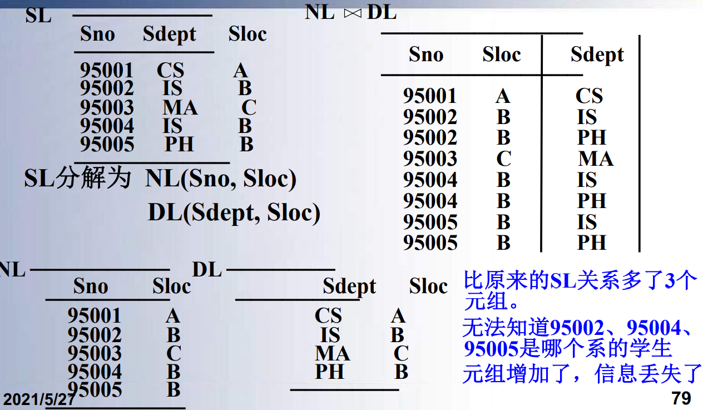
>
> 

此外，分解还需要保持依赖性。

> Example
>
> 
>
> 

如果分解有无损连接性，那么不会丢失信息；如果保持函数依赖，可以减轻异常。

## 数据库设计

### 数据库设计概述

数据库设计是指对一个给定的应用，构造优化的数据库逻辑模式和物理结构，并据此建立数据库及其应用系统，使之有效的存储和管理数据，满足各种用户的应用需求。

在数据库设计中，结构设计和行为设计要相结合。


设计数据库有下面这些方法：

- 新奥尔良方法，将数据库设计分为若干阶段和步骤
- 基于E-R模型的数据库设计方法
- 3NF设计方法
- ODL方法，面向对象的设计方法
- Barker方法

数据库设计分成六个阶段：

- 需求分析
- 概念结构设计
- 逻辑结构设计
- 物理结构设计
- 数据库实施
- 数据库运行和维护

下面先对数据库设计的基本步骤进行概述。

1. 数据库设计的准备工作：选定参加设计的人
   1. 系统分析人员和数据库设计人员，自始至终参与数据库设计
   2. 用户和数据库管理员，参与需求分析和数据库运行维护
   3. 应用开发人员，在系统实施阶段参与
2. 数据库设计的过程
   1. 需求分析
      1. 准确了解分析用户需求
      2. 最困难的一步
   2. 概念结构设计
      1. 数据库设计关键
      2. 对用户需求综合归纳抽象，形成独立于DBMS的概念模型
   3. 逻辑结构设计
      1. 将概念结构转换为DBMS支持的数据模型
      2. 对其进行优化
   4. 数据库物理设计阶段
      1. 为逻辑数据模型选取一个最适合应用环境的物理结构
   5. 数据库实施阶段
      1. 根据DBMS的数据库语言和宿主语言，根据逻辑设计和物理设计结果
         1. 建立数据库
         2. 编制和调试应用程序
         3. 组织数据入库
         4. 试运行
   6. 数据库运行和维护阶段
      1. 试运行后投入正式运行
      2. 不断评价、调整、修改


### 需求分析

需求分析的任务比较明确：

- 详细调查现实世界要处理的对象
- 充分了解原系统
- 明确用户的各种需求
- 确定新系统的功能
- 充分考虑今后可能的扩充和改变

其重点是数据和处理，获取用户对数据库的信息要求、处理要求、安全性与完整性要求。

其难点则是确定用户最终需求。用户缺少计算机知识，设计人员缺少用户专业知识，所以设计人员需要和用户进行深入交流。

总体来说，需求分析可以分成三大方法：

- 调查需求
- 达成共识
- 分析表达需求

调查用户需求分成下面的步骤

1. 调查组织机构情况
2. 调查各部门的业务活动情况
3. 在熟悉业务活动的基础上，协助用户明确对新系统要求
4. 确定新系统边界

常用调查方法包括跟班调查、开调查会、请专人介绍、询问、设计调查表请用户填写、查阅记录等。

接下来要进一步分析和表达用户需求。这里最常使用的是结构化分析方法（SA方法），从上层的系统组织结构入手，自顶向下、逐层分解分析系统。

首先把任何一个系统进行抽象：

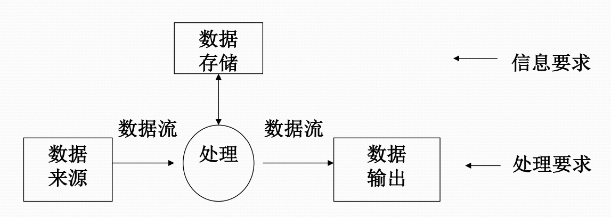

接下来分析处理功能和数据。这里具体来说是：

1. 分解处理功能，将处理功能的具体内容分解成若干子功能
2. 分解数据，处理功能逐步分解的同时逐级分解所用数据，形成若干层次数据流图
3. 表达方法，处理逻辑用判定表或判定树描述，数据则用数据字典描述

将分析结果再次提交给用户，征得用户认可。

这里重点提一下数据字典。数据字典进行详细的数据收集和数据分析所获得的主要结果，其内容包括数据项、数据结构、数据流、数据存储、处理过程。

- 数据项是不可再分的数据单位，其描述为：{数据项名，数据项含义说明，别名，数据类型，长度，取值范围，取值含义，与其他数据项的逻辑关系，数据项之间的联系}
- 数据结构反应了数据之间的组合关系，可以由若干数据项、若干数据结构混合而成。其描述为：{数据结构名，含义说明，组成：{数据项或数据结构}}
- 数据流是数据结构在系统内传输的路径。其描述为：{数据流名，说明，数据流来源，数据流去向，组成：{数据结构}，平均流量，高峰期流量}
- 数据存储是数据结构停留或保存的地方，是数据流的来源和去向之一。其描述为：{数据存储名，说明，编号，输入数据流，输出数据流，组成：{数据结构}，数据量，存取频度，存取方式}
- 一般是一些说明性信息。其描述为：{处理过程名，说明，输入：{数据流}，输出：{数据流}，处理：{简要说明}}

下面举个例子。

> 学生学习管理子系统的数据字典
>
> 数据项（以学号为例）
>
> - 数据项： 学号 
> - 含义说明：唯一标识每个学生 
> - 别名： 学生编号 
> - 类型： 字符型 
> - 长度： 8 
> - 取值范围：00000000至99999999 
> - 取值含义：前两位标别该学生所在年级， 后六位按顺序编号 
> - 与其他数据项的逻辑关系：
>
> 数据结构（以学生为例）
>
> - 数据结构： 学生 
> - 含义说明： 是学籍管理子系统的主体数据结构， 定义了一个学生的有关信息 
> - 组成： 学号，姓名，性别，年龄，所在系，年龄
>
> 数据流（以体检结果为例）
>
> - 数据流： 体检结果 
> - 说明： 学生参加体格检查的最终结果 
> - 数据流来源：体检 
>   - 数据流去向：批准 
> - 组成： …… 
> - 平均流量： …… 
> - 高峰期流量：…
>
> 数据存储（以学生登记表为例）
>
> - 数据存储： 学生登记表 
> - 说明： 记录学生的基本情况 
> - 流入数据流：…… 
> - 流出数据流：…… 
> - 组成： …… 
> - 数据量： 每年3000张 
> - 存取方式： 随机存取
>
> 处理过程（以分配宿舍为例）
>
> - 处理过程：分配宿舍 
> - 说明： 为所有新生分配学生宿舍 
> - 输入： 学生，宿舍 
> - 输出： 宿舍安排 
> - 处理： 在新生报到后，为所有新生分配学生宿舍。 要求同一间宿舍只能安排同一性别的学生， 同一个学生只能安排在一个宿舍中。 每个学生的居住面积不小于3平方米。 安排新生宿舍其处理时间应不超过15分钟。

### 概念结构设计

概念结构设计，就是把需求分析得到的用户需求抽象为信息结构，即概念模型。

概念结构是各种数据模型的共同基础，是数据库设计的关键。

描述概念模型的工具主要由E-R模型和IDEF1X建模方法，这里不再赘述。

一、概念结构设计的基本方法

常见的概念结构设计有四种方法：

（1）自顶向下：首先定义全局概念结构框架，然后逐步细化


（2）自底向上：首先定义各个局部应用的概念结构，然后进行集成

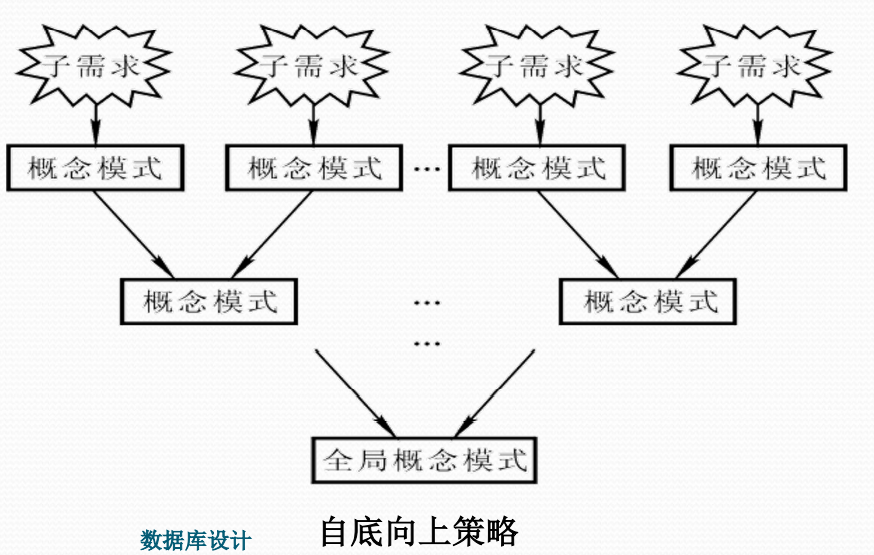

（3）逐步扩张：先定义最重要的核心概念结构，然后向外扩充


（4）混合策略：自顶向下设计框架，自底向上设计局部

我们很多时候自顶向下需求分析，然后自底向上设计概念结构。


如果采用自底向上设计概念结构，那么又可以分成两步：抽象数据并设计局部视图；集成局部视图，得到全局概念结构。


二、数据抽象

数据抽象是把特性用概念精确的描述，常用的抽象有三类：

- 分类，定义某一类概念作为现实世界一组对象的类型，抽象对象值和型之间的`is member of`语义
- 聚集，定义某一类型的组织成分，抽象对象内部类型成分之间的`is part of`语义
- 概括，定义类型之间的子集联系，抽象类型之间的`is subset of`语义

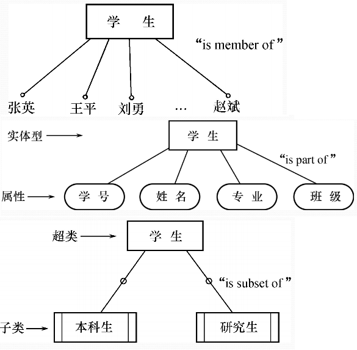

局部视图设计，实际上是分E-R图的设计，需要先选择局部应用，然后逐一设计分E-R图。

选择局部应用的时候一般选取中层数据流图，作为设计分E-R图的依据。

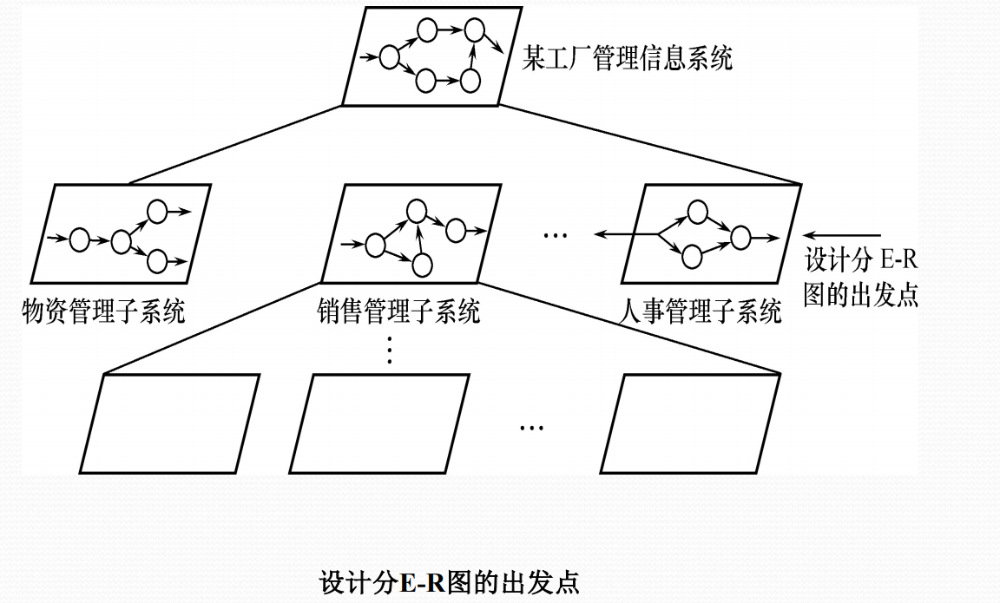

设计E-R图的时候，要将各局部应用设计的数据从数据字典抽取出来，参照数据流图，标定局部应用中的实体、实体的属性、标识实体的码。

总体来说有两条准则：

1. 属性不能再具有需要描述的性质，即属性必须是不可分的数据项，不能再由另一些属性组成
2. 属性不能与其它实体具有联系，联系只发生在实体之间

> 销售管理子系统分E-R图的设计
>
> 先做出数据流图：
>
> 
>
> 然后找到第二层数据流图，从此出发设计E-R图：
>
> 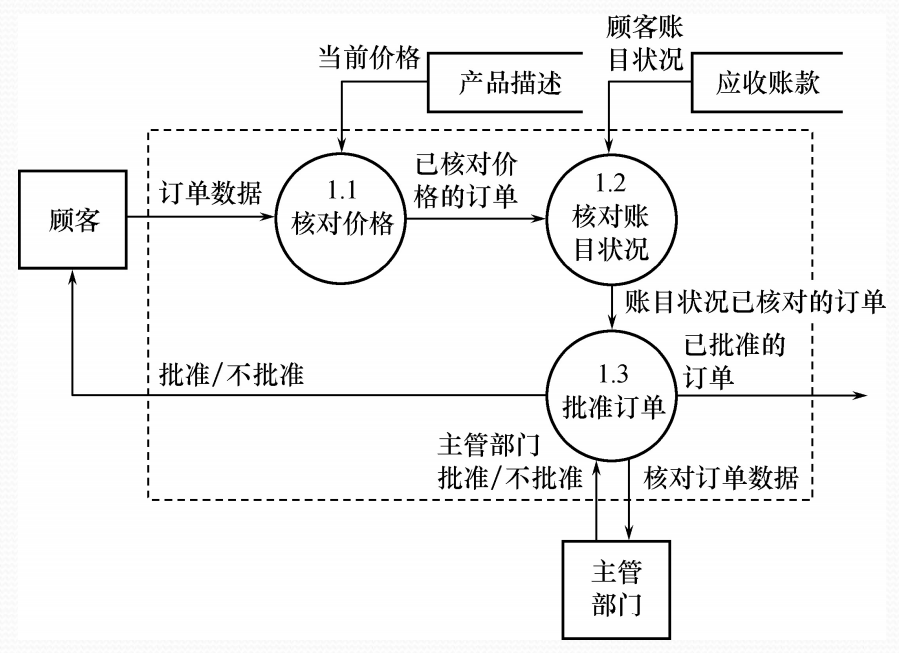
>
> （其余略）
>
> 接下来考虑分E-R图，其框架如下：
>
> 
>
> 接下来进行调整：
>
> 
>
> 得到实体定义：
>
> 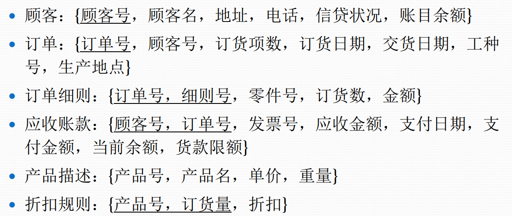

三、集成局部视图

对各个视图建立完成之后，还需要进行合并，得到总E-R图。

可以一次集成，也可以多次集成。

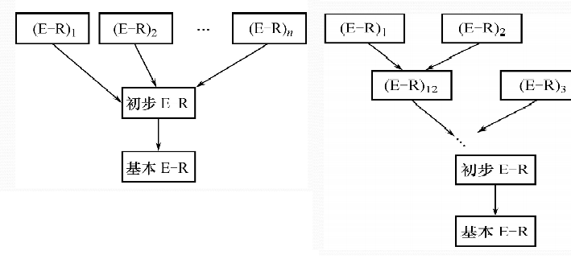

集成的时候，需要合并，并进行一定的修改与重构。


这里就涉及到了冲突的问题。这种冲突可能是三种冲突。

1. 属性冲突，可能是属性域冲突（也就是属性值的类型，可能是取值范围或取值集合不同），也可能是属性取值单位冲突。
2. 命名冲突，可能是同名异义或异名同义
3. 结构冲突，又可能有三类：同一对象在不同应用中有不同的抽象，同一实体在不同分E-R图中所包含的属性个数和属性排列次序不完全相同，实体之间的联系在不同局部视图中呈现不同的类型。

另一个问题是冗余。冗余的数据是可由基本数据导出的数据，冗余的联系是可由其他联系导出的联系，消除不必要冗余后的初步E-R图称为基本E-R图。

消除冗余的分析方法是以数据字典和数据流图为依据，即数据字典中数据项之间的逻辑关系。

比如下面的例子：

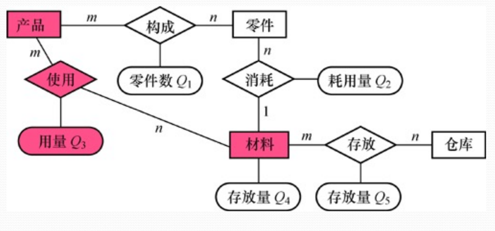

当然，消除冗余需要兼顾效率。如果需要保留一些冗余数据，应该把数据关联作为完成行约束条件添加触发器。

规范化设计是消除冗余的有力工具。

> E-R图合并的例子
>
> 物资管理图：
>
> 
>
> 销售管理图：
>
> 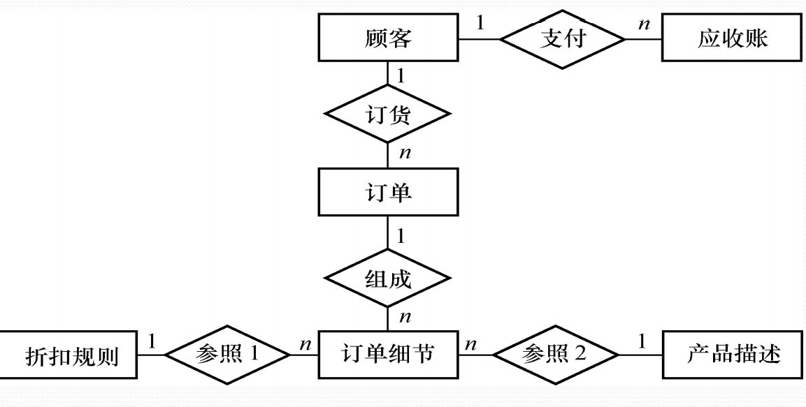
>
> 劳动人事管理：
>
> 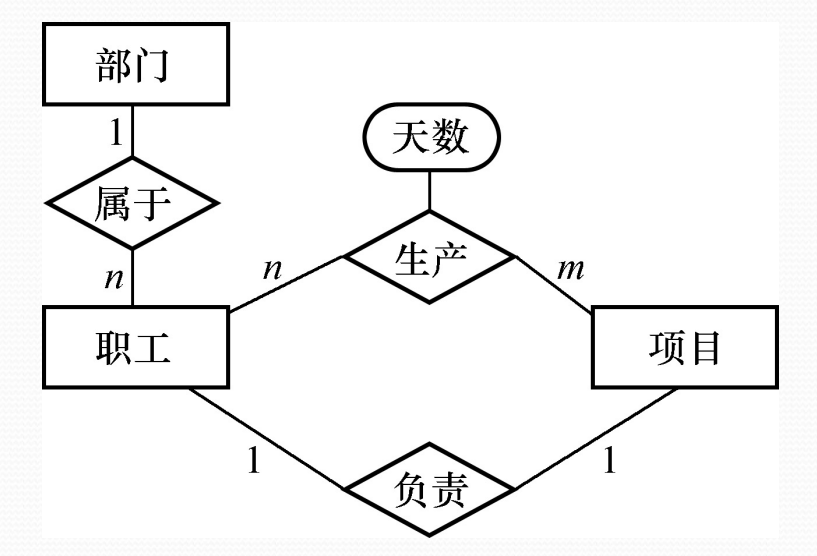
>
> 进行集成：
>
> 
>
> 这里进行了如下消除：
>
> - 项目和产品异名同义，冗余
> - 职工与仓库的工作关系包括在劳动人事管理部门与职工联系，冗余
> - 职工之间的领导关系可以由部门与职工和部门的领导关系和从属关系导出，冗余

最终得到的叫做总体概念结构，有如下要求：

- 内部具有一致性，不存在相互矛盾的表达
- 能准确反应原来每个视图的结构，包括属性、实体、实体间联系
- 满足需求分析阶段所确定的所有要求

### 逻辑结构设计

逻辑结构设计的任务是把涉及到的E-R图转换为与选用DBMS产品支持的数据模型符合的逻辑结构。其步骤可以分成：

- 将概念结构转化为一般的关系、网状、层次模型
- 将转换来的关系、网状、层次模型向DBMS支持下的数据模型转换
- 对数据模型进行优化


一、E-R图向关系模型的转换

这一步主要解决的问题是如何将实体型和实体间的联系转换为关系模式，以及如何确定这些关系模式的属性和码。

根据联系情况，其转换方法如下：

- 1:1联系，可以转换为一个独立的关系模式，也可以与任意一端对应的关系模式合并。
- 1:n联系，可以转换为一个独立的关系模式，也可以与n端对应的关系模式合并。
- m:n联系，需要转换一个关系模式（eg:选修(学号，课程号，成绩)）
- 三个或三个以上实体的多元联系，转换为一个关系模式（eg:讲授(课程号，职工号，书号)）
- 具有相同码的关系模式可以合并，减少系统关系个数。将一个关系模式的全部属性加入另一个关系模式中，然后适当调整属性次序

二、数据模型的优化

之后还需要进行数据模型的优化，一般以规范化理论为指导。其步骤如下：

1. 确定数据依赖
2. 消除冗余联系
3. 确定所属范式
4. 根据需求阶段得到的处理要求，分析应用环境这些模式是否合适，并决定是否合并或分解
5. 根据需求分析阶段得到的处理要求，对关系模式进行必要的分解，提高数据操作的效率和存储空间的利用率。

这里的分解，分成两种：水平分解和垂直分解。水平分解是把基本关系的元组分成若干子集合，定义每个子集合为一个子关系，来提高系统效率。对于满足80/20原则的应用和需要在并发事务中存取不相交数据来说，水平分解比较使用。垂直分解是把关系模型R的属性分解为若干子集合，形成若干子关系模式。如果分解后所有事务总效率得到提升，那就是有效的分解。

三、设计用户子模式

定义用户外模式的时候，还需要考虑：

1. 使用更符合用户习惯的别名
2. 针对不同级别用户定义不同View
3. 简化用户对系统的使用

> 关系模式产品（产品号，产品名，规格，单价，生产车间，生产负责人，产品成本，产品合格率，质量等级），可以建设两个视图：
>
> 一般顾客 ： 产品1（产品号，产品名，规格，单价）
>
> 产品销售部门：产品2（产品号，产品名，规格，单价，车间，生产负责人）
>
> 可以防止用户非法访问不允许查询的数据。

### 物理设计

数据库在物理设备上的存储结构与存储方法统称为数据库的物理结构，依赖于选定的数据库管理系统。为一个给定的逻辑数据模型选择一个最适合应用环境的物理结构的过程，就是数据库的物理设计。

其步骤如下：

1. 确定数据库物理结构，在关系数据库中主要指存取方法和存储结构
2. 对物理结构进行评价，重点是时间和空间效率。

如果评价满足原设计要求，那么就进入物理实施阶段，否则就需要重新设计或修改物理结构。


一、物理存储设备

常见的物理存储设备包括高速缓存、‘主存、磁盘、光学存储器、磁带存储器。

记录的存储结构可以是定长记录、变长记录、大对象记录。

文件由一系列文件块构成，他们在逻辑上连续，在物理上并不一定连续。其存储结构可以分成三类：无序文件，使用堆结构；顺序文件，按照某个属性值大小顺序；散列文件，通过某个属性上的散列函数决定存储地址。

可以建立索引文件赖加速访问。索引又可以进行分类：

- 按照索引文件结构，分成稀疏索引（按照索引值建立索引）和稠密索引（对每个记录建立索引）
- 按照索引键值特点，分成主索引（建立在主键上的索引）、聚集索引（物理存储按照索引顺序排列）、辅助索引（任意非主键索引）

最常使用B+树组织索引，这是最常见页最常用的。

二、物理数据的内容和方法

- 准备工作：对运行事务详细分析，获得选择物理数据库设计所需参数，充分了解RDBMS内部特征
- 选择参数
  - 数据库查询事务，考虑查询关系、查询条件涉及属性、连接条件涉及属性、查询的投影属性
  - 数据更新事务，考虑被更新的关系、每个关系上的更新操作条件所涉及的属性、修改操作要改变的属性值
  - 每个事务在各关系运行的频率和性能要求
- 为关系模式选择存取方法，建立存取路径
- 设计关系、索引等数据库文件的物理存储结构

三、索引存储方法的选择

（1）索引存取方法

考虑对哪些属性列建立索引、建立组合索引、建立唯一索引。

- 如果一个（一组）属性经常在查询条件中出现，在这个属性上建立索引（组合索引）
- 如果一个属性经常作为最大值和最小值等聚集函数的参数，在这个属性上建立索引
- 如果一个属性经常作为连接条件，在这个属性上建立索引

定义过多索引数，会增加维护索引和查找索引的开销。

（2）聚簇索引方法

聚簇是为了提高某个属性的查询速度，将个属性上有相同值的元组集中存放在连续物理块。

聚簇有利于提高按聚簇码查询的效率。例如，将同一个系的学生放在一起，对某个系查询的时候，显著减少了访问磁盘的次数。

聚簇有利于节省存储空间。聚簇码值不必在每个元组重复存储，只需要在一组存一次。

但聚簇只能提高某些特定应用的性能，维护聚簇也会有比较大的开销。

聚簇既适用单个关系独立聚簇，也适用于多个关系组合聚簇。建立了聚簇关系之后，可以用聚簇码进行访问或连接。尤其当SQL语句中有与聚簇码相关的ORDER BY、GROUP BY、UNION等子句，用聚簇特别有利。

（3）HASH存取方法

如果关系的属性主要出现在等值连接条件或相等比较的选择条件中，该关系的大小可预知而且不变，或该关系的大小动态改变，但所选用的DBMS提供动态HASH存取方法，那么选取HASH存取方法。

四、数据库存储结构的设计

（1）确定数据库存放位置和存放结构

关系、索引、聚簇、日志、备份。确定存放位置要考虑存取时间、存储空间利用率和维护代价，这三者常常相互矛盾。

可以将易变部分与稳定部分分开存放，也可以存取频率较高部分与较低部分分开存放。

> 数据库数据备份、日志文件备份等由于只在故障恢复时才 使用，而且数据量很大，可以考虑存放在磁带上
>
> 如果计算机有多个磁盘或磁盘阵列 ，可以考虑将表和索 引分别放在不同的磁盘上，在查询时，由于磁盘驱动器并 行工作，可以提高物理I/O读写的效率
>
>  可以将比较大的表分别放在两个磁盘上，以加快存取速度， 这在多用户环境下特别有效
>
> 可以将日志文件与数据库对象（表、索引等）放在不同的 磁盘以改进系统的性能

（2）确定系统配置

DBMS一般提供了一些存储分配参数。比如：

- 同时使用数据库的用户数
- 同时打开的数据库对象数
- 内存分配参数
- 使用的缓冲区长度、个数
- 存储分配参数

五、评价物理结构

对数据库物理设计过程中产生的多种方案进行细致的评 价，从中选择一个较优的方案作为数据库的物理结构。

可以对各种方案进行定量估算，考虑存储空间、存取时间和维护代价。对估算结果进行权衡、比较，选择出一个较优的合理的物理结构。

接下来，还要进行数据的载入和应用程序的调试。

### 数据库运行和维护

在原有系统数据有一部分已经输入数据库之后，就可以开始进行联合调试，也就是数据库试运行。其主要工作包括：

1. 功能测试。实际运行数据库应用程序，执行各种操作，测试功能是否满足设计要求，如果不满足则对应用程序进行修改调整，直到达到设计要求。
2. 性能测试。测量系统性能指标，分析是否达到目标，否则需要回到物理设计阶段调整结构。

要注意两点：

1. 需要分期分批组织数据入库。要重新设计物理结构甚至逻辑结构，会导致数据重新入库。可以先输入小批量数据供调试用，试运行合格后再大量输入，逐步增加数据量，逐步完成运行评价。
2. 数据库转储和恢复。试运行阶段，系统不稳定，硬软件故障随时可能发生，操作人员对新系统不熟悉，误操作不可避免。因此必须做好数据库的转储和恢复工作，减少对数据库的破坏。

对数据库设计进行评价、调整、修改等工作是一个长期任务，也是设计工作的继续和提高。对数据库设计进行评价、调整、修改等维护工作是一个长期任务，也是设计工作的继续和提高。

在数据库运行阶段，对数据库经常性的维护工作主要由DBA完成，包括

1. 数据库转储和恢复
2. 数据库安全性、完整性控制
3. 数据库性能的监督、分析和改造
4. 数据库重组织和重构造

重组织的形式分成全部重组织和部分重组织，目标是提高系统性能。重组织是按照原设计要求，重新安排存储位置，回收垃圾，减少指针链。重构造是根据新环境调整数据库的模式和内模式。

总体来说，数据库各级模式是在设计过程中逐步形成的。需求分析阶段综合各个用户应用需求，概念设计阶段形成概念模式，逻辑设计阶段形成逻辑模式，然后建立必要视图形成外模式，在物理设计阶段形成了内模式。

## 数据库系统新技术


数据库系统的历史有三带。第一代系统是层次和网状数据库系统，第二代以E.F.Codd的关系模型论文为基础建立关系数据库技术，1990年提出了第三代DBMS系统宣言。

（1）数据模型的发展

1. 对1NF扩充，引入了少数构造器（复杂数据模型）
2. 增加全新的数据构造器和数据处理原语
3. 面向对象数据模型
4. XML数据模型

对象关系数据库系统是面向关系数据库模型和关系模型结合的产物。这一数据库系统支持OO模型，构成集合体是对象库。

（2）数据库技术和其它相关技术的结合

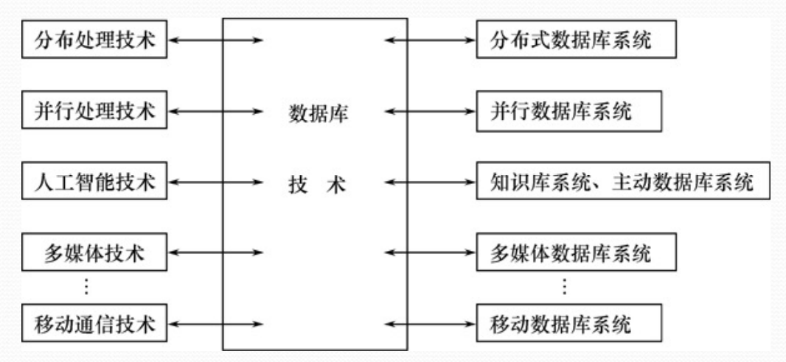

并行数据库是并行机上运行的有并行处理能力的数据库系统，以共享内存结构、共享磁盘结构、无共享结构为依托的。主动数据库是结合AI和面向对象的数据库新技术，可以给紧急情况提高及时反应能力。

（3）面向领域的数据库新技术


工程数据库是一种能存储和 管理各种工程设计图形和工程设计文档，并能为工程设 计提供各种服务的数据库。

空间数据库是描述、存储和处理空间数据及其属性数据的数据库系统， 用于表示空间物体的位置、形状、大小和分布特征等诸方面信息的数据，适用于描述所有二维、三维和多维分布的关于区域的现象。

