#  计算理论

$\newcommand\op{\operatorname}$计算理论主要回答的问题是：What are the fundamental capabilities and limitations of computers？

主要包括三个内容：

- 计算模型
- 可计算性
- 计算复杂性

## 绪论

### 语言

在正式开始之前，我们要先讨论一个永恒不变的哲学话题：语言。

如何定义问题？对于一个问题，输入一定可以表示成一个**有限长的0-1串**。如果我们定义**决定性问题(Decision Prob)**是只需要回答是和否的问题，比如一个数是否是素数、一个图是否连通。而排序、最大流等问题，都是一般问题。

对于一个数是否是偶数，可以用一个以0为结尾的字符串集合对应1、其它对应0；类似的，任意一个决定性问题都可以用有限长字符串形成的集合来对应。这样，所有的决定性问题都是可说的，或者说有一种统一描述。

而一般的问题往往可以转化成若干决定性问题。下面来举一例：

> 最大团问题如何转化成决定性问题？
>
> - 假设“最大团”有快速算法，那么：对图$G$运行最大团算法，得到最大团节点数$m$，如果$m>k$，那么有$k$团，否则没有$k$团。
>
> - 假设“图是否有$k$团”有快速算法，那么可以二分搜索最大团节点数$m$。进一步，按照某个次序，依次取节点$v$，然后令$G'=G/\{v\}$，如果$G'$有$m$团，则令$G=G'$。执行这一步骤，一定能使得$G'$只剩$m$个节点。这个算法只是在原来的基础上执行$2n$次。

从上面讨论可以看出，决定性问题一一对应字符串集合。接下来，给定一些定义。

**字母表** 任意一个有限集，常用$\Sigma, \Gamma$。

**符号** 字母表中的元素

**字符串** 由字母表中符号组成的有限序列

**长度** $|s|$

**连接** $a*b=ab$

**反转** $(ab)^R = ba$

**空词** 记为$\varepsilon$，长度为0.

**语言**就是一个决定性问题。

**语言** $\Sigma$上一些字符串的集合

> $\Sigma=\{0,1\}$，那么语言$A = \{0,00,0000,\cdots\}$

**全集** $\Sigma^*$ 为$\Sigma$上全体字符串的集合

因此，对于全体决定性问题的集合，实质上就是$P(\Sigma^*)$ ，一般是$P(\{0,1\}^*)$

**决定性问题和$\Sigma$的语言一一对应。**

下面讨论一个问题：算法和语言的集合是否可数？为此，先做一些准备工作。

**字典序** 长度从小到大，同长按照从小到大：$\varepsilon, 0,1,00,01,10,11,000,\cdots$

**无限长串** 定义$\Sigma^N = \{(x_i)_{i=1}^{\infty} | x_i \in \Sigma\}$ 为$\Sigma$上的所有无限长串。

此时，$\forall x \in \Sigma^N$可以看作$N \to \Sigma$的映射。也就是$\Sigma^* \approx N$。

构造一个映射：任取一个语言$A$，对$\Sigma^*$字典序下第$i$个字符串$w$，若$w\in A, x_i = 1$；否则$x_i=0$。这样就构造出了0-1串$x_i$。实际上，这相当于构造了一个特征函数。比如下面的例子：

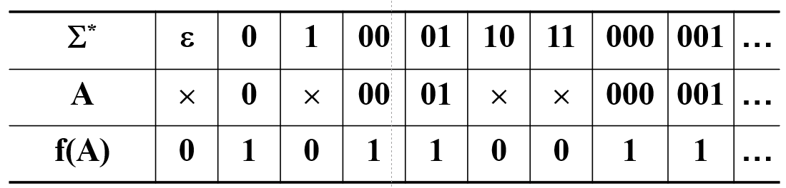

所以$A \approx \Sigma^*$。问题就转换成了求$\Sigma^*$的可数性。

假设$\{0,1\}^N$可数，也就是能够排成一列$f(i)$。取$x$，使得$x$第$i$位和$f(i)$第$i$位相反。由于$x$和每一个$f(i)$都至少有一位不一样，所以$x \not \in f(i)$。因此，$\{0,1\}^N$不可数。

这种技巧称为对角化方法，由Cantor发明。这一定理表明，$\Sigma$的语言是不可数的；而程序是一个0-1串，也就是程序构成的集合是$\Sigma^*$的一个子集。程序可数而问题不可数，**存在不可求解的问题**。

计算理论研究的对象，就是**语言**。

## 计算模型

### 有限自动机

问题空间一般有这些不同的级别。本章讨论的范畴，集中在正则的范围之内。

#### 确定型有限自动机

什么是计算？图灵说，计算是一个人拿着笔在纸上进行的。他根据眼睛看到的符号和脑内的法则，指示笔在纸上擦掉或写上一些符号，再改变他看到的范围直到计算结束。

脑就是控制器，纸就是存储带，眼睛和笔是读写头，法则就是转移函数。完整的图灵机在第三章讨论，这里先讨论一个最简单的图灵机：只能读不能写，只能右移不能左移。这个时候就构成了有限自动机。

**Def 1.1.1 有限自动机(Deterministic Finite Automaton)** 有限自动机是一个五元组$(Q,\Sigma, \delta, s, F)$，其中

1. $Q$是有限集，称为状态集
2. $\Sigma$是有限集，称为字母表
3. $\delta:Q \times \Sigma \to Q$，称为转移函数
4. $s \in Q$是起始状态
5. $F \sube Q$是接受状态集

对于一个有限自动机，可以用状态图或状态表来表示：

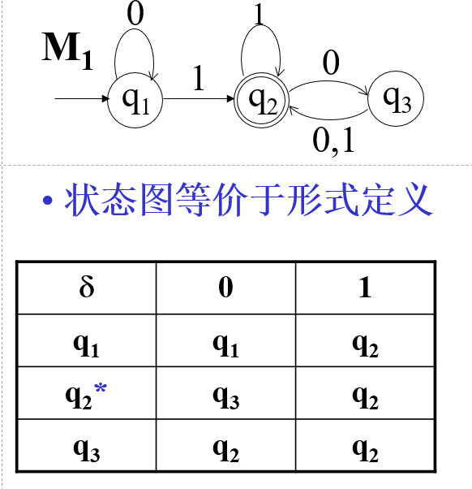

其中$Q = \{q_1,q_2,q_3\}, \Sigma = \{0,1\}, s = q_1, F = \{q_2\}$.

在限制的图灵机中，假设输入的读写带是1101，那么其转移过程如下：

- $q_1$读到1，转移到$q_2$
- $q_2$读到1，转移到$q_2$
- $q_2$读到0，转移到$q_3$
- $q_3$读到1，转移到$q_2$

由于$q_2 \in F$，所以有限自动机对这个输入回答**接受**，否则回答**拒绝**。

形式化的，给出DFA计算的定义和描述：

**Def 1.1.2 DFA的计算** 设$M=(Q,\Sigma, \delta, s, F)$是一个DFA，$W = w_1w_2\cdots w_n$是$\Sigma$上的一个字符串，若$\exists$状态序列$r_0r_1\cdots r_n \in Q$，使得

1. $r_0 = s$  起始状态约束
2. $\delta(r_i, w_{i+1}) = r_{i+1}$  转移函数约束
3. $r_n \in F$  终止状态约束

则$M$**接受**$F$。

**Def 1.1.3 DFA的语言** 对于DFA $M$，若$A = \{W \in \Sigma^* \mid M\, \text{accept}\, W \}$，则称$A$是$M$的语言，记作$L(M)=A$，也称$M$识别$A$。

对于上例所示的DFA，其$L(M_1)$为至少含一个1且最后一个1后面有偶数个0的01串集合。

**Def 1.1.4 正则语言** 如果$DFA$识别$A$，那么$A$是正则语言。

**Def 1.1.5 等价** 如果$L(M_1) = L(M_2)$，则称$M_1, M_2$等价。

下面讨论DFA的设计问题。

（1）设计$W$从1开始，0结束的DFA

设计四种状态：

- 空
- 以0开始
- 以1开始0结束
- 以1开始1结束

设计图：

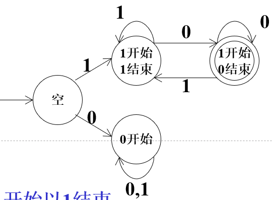

（2）设计$W$含有子串1010

设计状态：空，1，10，101，1010

设计图：

（3）设计$W$倒数第二个符号是1

设计状态：$\varepsilon, 0, 00, 1, 01, 10, 11$，而$\varepsilon,0,00$等价，$1,01$等价。

设计图：

（4）设计$W$二进制数$W$模3余1

设计状态：模3余0、1、2

**Def1.1.6 正则运算** 若$A,B$为两个语言，定义其正则运算如下：

- $A \cup B = \{x \mid x \in A \or x \in B\}$
- $A \circ B = \{xy \mid x \in A \wedge y \in B\}$
- $A^* = \{x_1x_2\cdots x_k \mid k \ge 0 \and x_i \in A\}$

为了证明正则语言的判定性和正则运算的封闭性，引入非确定有限自动机。

#### 非确定有限自动机

在非确定有限自动机中，每一步可以以0至多种方式进入下一步。转移箭头上符号如果是$\varepsilon$可以不读任何输入就转移进去。例如：

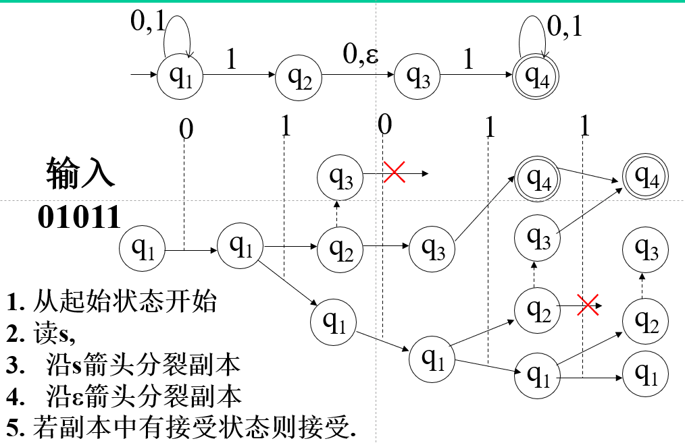

这种计算是并行的，任何时刻可能有多个副本。有些副本会因为无法继续转移而消失。

下面给出形式化定义：

**Def1.1.7 非确定型有限自动机(Non-determinism Finite Automate， NFA)**  NFA是一个五元组$(Q,\Sigma, \delta, s, F)$，其中

1. $Q$是状态集
2. $\Sigma$是字母表
3. $\delta:Q \times \Sigma_\varepsilon \to P(Q)$是转移函数，其中$\Sigma_\varepsilon = \Sigma \cup \{\varepsilon\}$，$P(Q)$为幂集
4. $s \in Q$为起始状态
5. $F \sube Q$是接受状态集

$\varepsilon$仅仅是一个记号，而不属于字母表中的符号。

接下来定义NFA的计算。

**Def1.1.8 NFA的计算** 设$N=(Q, \Sigma,\delta, q_0, F)$是NFA，$w$是$\Sigma$上字符串，若$w$能写作$w=w_1w_2\cdots w_n$，$w_i \in \Sigma_\varepsilon$ ，且$\exists$Q中的序列$r_0r_1\cdots r_n$满足

1. $r_0 = q_0$
2. $r_{i+1} \in \delta(r_i, w_{i+1})$
3. $r_n \in F$

则称$N$**接受**$w$

下面以同样的例子讨论NFA的设计问题。

（1）设计$W$从1开始，0结束的NFA

（2）设计$W$含有子串1010

（3）设计$W$倒数第二个符号是1

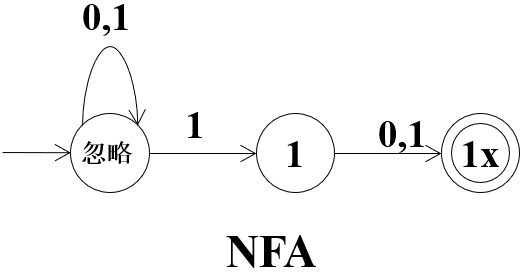

这里举两例：

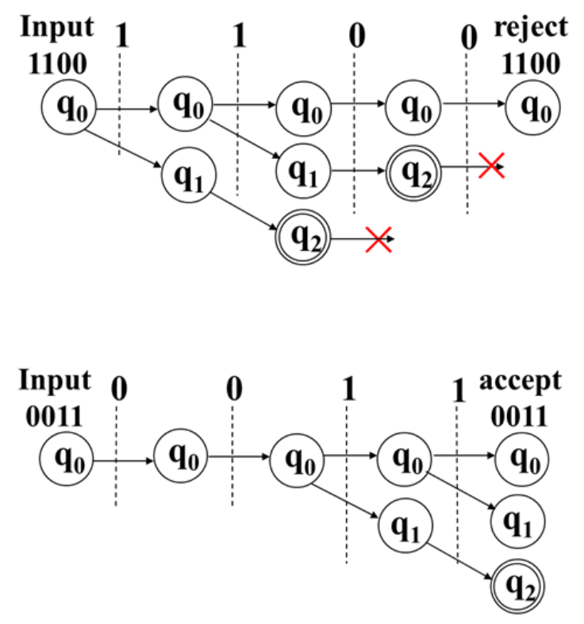

它的核心思想是一种分裂。

如果这里是倒数第$k$个数是1，DFA需要$2^k$个状态，而NFA只需要$k+1$个状态。

下面给出一个非常重要的定理：

**Theorim 1.1.1 NFA、DFA等价定理** 每一台NFA都有一台等价的DFA

**证明** 采用构造性证明，即对每一台NFA构造一个等价的DFA。

还是从这个例子出发：

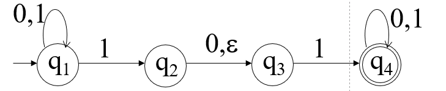

可以发现，$S_0 = \{q_1\}, S_1 = \{q_1, q_2, q_3\}$，并且存在转移$\delta(S_1, 0) = S_1$，$\delta(S_1, 1) = S_2$

接下来考虑$S_2$。读到0的时候，$q_1$转移到$q_1$，$q_2$转移到$q_3$，$q_3$无法转移，所以定义$S_3 = \{q_1, q_3\}$，那么$\delta(S_2, 0) = S_3$。同理，$\delta(S_2, 1) = \{q_1,q_2,\cdots, q_4\}$

按照这样的方式，我们实际上得到了一些压缩后的状态转移表：

这张表实际上就描述了DFA的转移函数表。转化成DFA：

下面，我们给出形式化的证明。

设$N=(Q,\Sigma, \delta_1, s_1, F_1)$是NFA，令$Q = P(Q_1)$，
$$
F = \{A \in Q : F_1 \cap A \ne Q\}
$$
$s = E(\{s_1\})$ ，其中
$$
E(A) = \{q : \exists r \in A, s.t. \exists \Gamma(0, q)\text{只经过}\varepsilon\text{箭头}\}
$$
$\delta : Q \times \Sigma \to Q$，其函数为：$\forall a \in \Sigma, \forall A \in Q$，
$$
\delta(A,a) = E(\bigcup_{r \in A} \delta_1(r, a))
$$
定义DFA $M=(Q,\Sigma, \delta, s, F)$，则
$$
\forall x (x \in L(M) \leftrightarrow  x \in L(N) ) 
$$
即$L(M) = L(N)$。

由于这种等价性，我们只需要构造NFA来证明正则运算的封闭性。

**Theorim 1.1.2  正则语言封闭性** 正则语言对并、连接和星号运算封闭。

**证明：**

对并运算，像这种方式构造NFA：

形式化的，设$M_1=(Q_1,\Sigma, \delta_1, s_1, F_1)$，$M_2=(Q_2,\Sigma, \delta_2, s_2, F_2)$，$L(M_1) = A, L(M_2) = B$，取$Q = Q_1 \cup Q_2 \cup \{s\}$ ，$F = F_1 \cup F_2$，$\forall i= 1,2$，$\forall r \in Q_i$，$\forall a \in \Sigma$，$\delta(r,a) = \{\delta_i(r,a)\}$，$\delta(s,\varepsilon) = \{s_1,s_2\}$，$M=(Q,\Sigma, \delta, s, F)$，则$L(M) = A \cup B$。

对连接运算，像这种方式构造NFA：

形式化的，设$M_1=(Q_1,\Sigma, \delta_1, s_1, F_1)$，$M_2=(Q_2,\Sigma, \delta_2, s_2, F_2)$，$L(M_1) = A, L(M_2) = B$，取$Q = Q_1 \cup Q_2$ ，$F = F_2$，$\forall r \in F_1, \delta(r, \varepsilon)=\{s_2\}$，$\forall i= 1,2$，$\forall r \in Q_i$，$\forall a \in \Sigma$，$\delta(r,a) = \{\delta_i(r,a)\}$，$M=(Q,\Sigma, \delta, s, F)$，则$L(M) = A \circ B$。

对星号运算，像这种方式构造NFA：（实际上就是自己和自己连接多次）

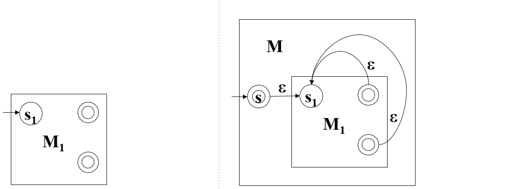

形式化的，设$M_1=(Q_1,\Sigma, \delta_1, s_1, F_1)$，$L(M_1) = A$，取$Q = Q_1 \cup \{s\}$ ，$F = F_1 \cup \{s\}$，$\forall r \in Q_i$，$\forall a \in \Sigma$，$\delta(r,a) = \{\delta_i(r,a)\}$，$\forall r \in F_1$, $\delta(r, \varepsilon) = \{s_1\}$，$\delta(s, \varepsilon)=\{s_1\}$，$M=(Q,\Sigma, \delta, s, F)$，则$L(M) = A*$。

这里要注意的是，我们引入了新的起始状态作为入口点。为什么不直接把起始状态当作入口点呢？考虑之前的例子

如果在此基础上，直接构建$A*$，那么可能的构造如下：

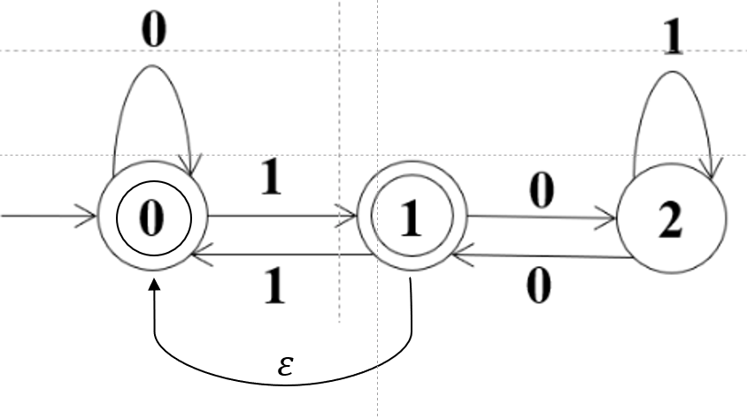

这个时候，000就会被接受，而它原本不应该被接受。

#### 正则表达式

**Def1.1.9 正则表达式** 设$R$是一个正则表达式，若$R$是

1. $a, a \in \Sigma$
2. $\varepsilon$
3. $\varnothing$ 
4. $R_1 \cup R_2$ 
5. $R_1 \circ R_2$
6. $(R_1)*$

每个正则表达式$R$表示一个语言，记作$L(R)$。

举一些例子：

- $0*10*$：有限个0，1个1，有限个0
- $(\Sigma \Sigma)^*$ ：偶数长度字符串
- $1*\varnothing$ ：$\varnothing$，因为连接操作是两个集合中的字符串连接，而空集没有字符串，所以无法完成连接
- $\varnothing*$ ：只有0次连接形成的$\varepsilon$

下面要证明：正则表达式和DFA等价。

**Theorim 1.1.3 正则表达式等价性定理** 语言A正则$\Leftrightarrow$ A可用正则表达式描述。

**证明：**

$\Leftarrow:$ 直接建构一个DFA

$\Rightarrow$: 构造广义非确定有限自动机（GNFA）

要求起始状态没有射入箭头，接收状态唯一且没有射出箭头。为此，可以一个一个去除中间状态。

举一个例子：

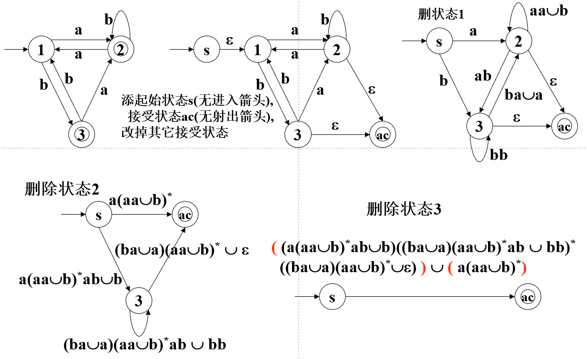

#### 泵引理

考虑下边几个例子：

- $B = \{0^n1^n \mid n\ge0\}$
- $C=\{w\mid w\text{中0,1个数相等}\}$
- $D=\{1^k \mid k=2^n, n\ge 0\}$

这些都不是正则语言。但是如何说明呢？我们给出泵引理。

**Theorim 1.1.4 泵引理** 设$A$是正则语言，则$\exists p>0$，使得$\forall w\in A$，$|w|\ge p$，存在分割$w=xyz$使得

- $\forall i > 0, xy^iz \in A$
- $|y|\ge 0$
- $|xy| \le p$

为了说明这个定理，我们考虑下面的自动机：

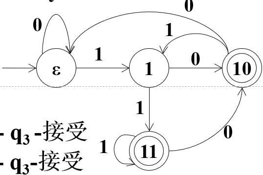

这个状态机是倒数第二个数字是1的自动机。如果取$p=4$，任意的$w$比如11011，取分割$x=1,y=101,z=1$，那么$xy^iz=1(101)^i1$都被接受。实际上，根据鸽巢原理，自动机里一定存在环，这就是泵引理的朴素来源。

下面我们形式化的给出证明。

设$M=(Q,\Sigma, \delta,s, F)$，$L(M)=A$，不妨取$p=|Q|$，设$w=w_1\cdots w_n \in A, w_i \in \Sigma$，那么存在转移路径：
$$
r_0 \stackrel{w_1}{\longrightarrow}r_1 \stackrel{w_2}{\longrightarrow}r_2 \stackrel{w_3}{\longrightarrow} \cdots\stackrel{w_{n-1}}{\longrightarrow} r_{n-1} \stackrel{w_n}{\longrightarrow}r_n
$$
根据鸽巢原理，一定$\exists i < j \le p$，$r_i = r_j$。因此，令
$$
x = w_1\cdots w_i, y = w_{i+1}\cdots w_j, z = w_{j+1}\cdots w_n
$$
那么
$$
s = r_0\stackrel{x}{\longrightarrow} r_i \stackrel{y}{\longrightarrow} r_i \stackrel{z}{\longrightarrow} r_n \in F
$$
进而，
$$
s = r_0\stackrel{x}{\longrightarrow}r_i \stackrel{y}{\longrightarrow} r_i \stackrel{y}{\longrightarrow} \cdots \stackrel{y}{\longrightarrow} r_i \stackrel{z}{\longrightarrow} r_n \in F
$$
泵引理得证。

由于泵引理成立，其逆否命题也成立，这样就给出了一个判断$A$非正则语言的**充分条件**：

若$\forall p > 0$，$\exists w \in A(|w | \ge p)$，$\forall x,y,z(|y|>0,|xy|\le p, w=xyz)$，$\exists i\ge 0$，$xy^i z\notin A$，则$A$是非正则语言。

例如，对$B$：

$\forall p > 0$，$w=0^p 1^p$，$\forall x,y,z(|y|>0, |xy|<p, w=xyz)$。令$i=0$，那么$xz = 0^{p-|y|}1^p \notin B$。所以$B$非正则语言。

对$C$：

$\forall p > 0$，$w=0^p1 0^p1$，$\forall x,y,z(|y|>0, |xy|<p, w=xyz)$。令$i=0$，那么$xz = 0^{p-|y|}10^p1 \notin B$。所以$C$非正则语言。

对$D$：

$\forall p > 0$，$w=1^k(k = 2^{p+1})$，$\forall x,y,z(|y|>0, |xy|<p, w=xyz)$。令$i=2$，那么$2^{p+1} < |xy^2 z| = k+|y| < 2^{p+2}$，即$xy^2z \notin D$。所以$D$非正则语言。

### 上下文无关文法

#### CFG

考虑下面的例子：

$G : A \to 0A1, A \to B, B \to \#$，那么可能存在这样的转移：

$A \Rightarrow 0A1 \Rightarrow 00A11 \Rightarrow 000A111 \Rightarrow 000B111 \Rightarrow 000\#111$……

如果我们引入$\Rightarrow^*$ 表示多步派生，那么$A \Rightarrow^* A, A\Rightarrow^* 0\#1, 0B1 \Rightarrow^* 0\#1$。

有的时候也把这种转移方式简记为$A \to 0A1\mid B, B \to \#$。$000\#111$的派生过程可以用这么一棵树来表示：

将其称之为语法分析树。

为此，我们给出上下文无关文法的形式化定义：

**Definition 1.2.1 上下文无关文法（Context Free Grammar，CFG）** CFG是一个四元组$(V,\Sigma, R, S)$，其中

1. $V$为变元集，比如$\{A,B\}$
2. $\Sigma$为终结符集，比如$\{0,1,\#\}$
3. $R$是规则集$A \to u$，$A \in V, u \in (V \cup \Sigma)^*$，比如$A \to 0A1\mid B, B \to \#$
4. $S \in V$是起始变元，比如$A$

然后给出派生的定义

**Definition 1.2.2 一次派生** 若$u,v,w \in (\Sigma \cup V)^*$，$A \in V$，$(A \to w) \in R$，则称$uAv$生成$uwv$，记为$uAv \Rightarrow uwv$

**Definition 1.2.3 0至多次派生** 若$u=v$或有序列$u_1,u_2,\cdots, u_k(k\ge 0)$使得$u \Rightarrow u_1 \Rightarrow \cdots \Rightarrow u_k \Rightarrow v$，称$u$派生$v$，记为$u \Rightarrow^* v$

**Definition 1.2.4 CFG的语言** $L(G) = \{w \in \Sigma^* \mid S \Rightarrow^* w\}$

接下来，给出上下文无关语言（CFL）的形式化定义

**Definition 1.2.5 上下文无关语言（CFL）** $\Sigma$为字母表，$A \sube \Sigma^*$，若存在CFG$G$使得$A = L(G)$，则$A$为CFL。

下面还是举三个例子。

（1）含有1010的01串

这是一个正则表达式。我们可以先构造出来DFA：

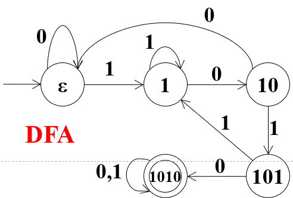

从DFA直接出发，可以构造：

- $S \to 0S \mid 1A$
- $A \to 1A \mid 0B$
- $B \to 0S \mid 1C$
- $C \to 1A \mid 0D$
- $D \to 0D \mid 1D \mid \varepsilon$

也可以先构造NFA：

从NFA直接出发，可以构造：

- $S \to 0S \mid 1S \mid 1A$
- $A \to 0B$
- $B \to 1C$
- $C \to 0D$
- $D \to 0D \mid 1D \mid \varepsilon$

最简单的方法是直接构造：

- $S \to 0S \mid 1S \mid 1010D$
- $D \to 0D \mid 1D \mid \varepsilon$

（2）$ww^R, w \in \{0,1\}^*$

考虑一个例子：`1 (0 (1 (0 0) 1) 0) 1`，可以递归式构建：

- $S \to 1S1 \mid 0S0$
- $S \to \varepsilon$

（3）$\{0^i 1^j \mid i < j < 2i\}$

分开讨论：

- $i = j$，$S \to 0S1 \mid \varepsilon$
- $2i = j$，$S \to 0S11 \mid \varepsilon$
- $i \le j \le 2i$，$S \to 0S1 \mid 0S11 \mid \varepsilon$
- $i < j < 2i$，$S \to 0S1 \mid 0S11 \mid 00111$

#### PDA

之前讨论过，对于$0^n 1^n$可以用栈模拟；假如有一个支持栈的自动机，是否可以对应CFG呢？答案是肯定的。

先来举$0^n1^n$的例子。我们这么定义这个东西：

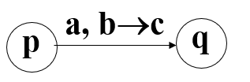

它的含义是，在状态$p$，读到$a$，且栈顶是$b$，则以$c$替换到$b$，状态转为$q$。同时，我们定义$\varepsilon$为栈顶。考虑下面的例子：

形式化的，我们给出PDA的定义

**Definition 1.2.6 PDA** PDA是一个六元组$(Q,\Sigma, \Gamma, \delta, q_0, F)$

1. $Q$是状态集
2. $\Sigma$是输入字母表
3. $\Gamma$是栈字母表
4. $\delta:Q \times \Sigma_\varepsilon \times \Gamma_\varepsilon \to P(Q \times \Gamma_\varepsilon)$
5. $q_0 \in Q$，起始状态
6. $F$，接受状态集

**Definition 1.2.7 PDA的计算** 称$M$接受$w$，若有

1. $w = w_1w_2w_3\cdots w_n, w_i \in \Sigma_\varepsilon$ $w$的划分
2. $r_0, r_1 \cdots, r_n \in Q$ 状态序列
3. $s_0, s_1, \cdots, s_n \in \Gamma^*$ 栈串序列

使得

1. $r_0 = q_0, s_0 = \varepsilon$ 从$q_0$和空串开始
2. $(r_{i+1}, c) \in \delta(r_i, w_{i+1}, b) $ ，其中$s_i = bt, s_{i+1}=ct, b,c \in \Gamma_\varepsilon, t \in \Gamma^*$ 依照转移函数运行
3. $r_n \in F$ 终止于接收状态

**Definition 1.2.8 PDA的语言** $L(G) = \{w \in \Sigma^* \mid M \text{接受} w\}$

同时有定理： **PDA与CFG等价**

下面还是举两例

$w=w^R$

$0^i1^j2^k$

#### 泵引理

给出CFL的泵引理：

设$A$是CFL，则存在$p>0$使得对$\forall w \in A, |w| \ge p$，存在分割$w=uvxyz$满足

1. $\forall i > 0, uv^ixy^iz \in A$
2. $|vy| \ge 0$
3. $|vxy| \le p$

给出一个应用：证明$\{ww\mid w \in \{0,1\}^*\}$非CFL。令$w=0^p1^p0^p1^p$，

$\forall u,v,x,y,z (|vy|>0, |vxy| \le p)$，进而$vxy$可能在12，23，34区。

令$i=0$，$uxz \notin A$。所以$C$不是CFL。

### 图灵机

#### 基本的图灵机

DFA是一个$\delta:Q \times \Sigma \to Q$的函数。它的输入带长度和输入串长度相同，只能读和右移，不能写和左移。在读入结束之后会停机。

图灵机的输入带长度则是无限的，可以改写，可以左右移动。这样就带来了三个问题：

- 什么时候结束？设计一个接收状态和拒绝状态。
- 如何设计转移函数？$\delta:Q \times \Gamma \to Q \times \Gamma \times \{L,R\}$ 。这里的$\Gamma$是工作字母表，除去$\Sigma$还有空格等。由于可写，还需要考虑写的结果。
- 如何定义图灵机？给出形式化定义。

**Definition 1.3.1 图灵机（Turing Machine, TM）** TM是一个七元组$(Q,\Sigma, \Gamma, \delta, q_0, q_a, q_r)$

1.  $Q$是状态集
2. $\Sigma$是输入字母表，不包括空白符$\sqcup$
3. $\Gamma$是带字母表，其中$\sqcup \in \Gamma, \Sigma \sub \Gamma$
4. $\delta : Q \times \Gamma \to Q \times \Gamma \times \{L,R\}$是转移函数
5. $q_0 \in Q$是起始状态
6. $q_a \in Q$是接收状态
7. $q_r \in Q$是拒绝状态，$q_a \ne q_r$

图灵机根据转移函数运行。在最左端左移，读写头保持不动。

为了描述图灵机的运行状态，我们引入格局的概念。

**Definition 1.3.2 格局（Configuration）** 对于$M=(Q,\Sigma,\Gamma, \delta, q_0, q_a, q_r)$，设$q \in Q$，$u,v \in \Gamma^*$，则格局$uqv$表示

1. 当前控制器状态为$q$
2. 存储带上字符串为$uv$
3. 读写头指向$v$第一个符号

考虑下面的图灵机：

那么有三个状态：

- $\delta(s,0) = (s, 0, L)$
- $\delta(s,1) = (q_a, 0, R)$
- $\delta(s, \sqcup) = (q_r, \sqcup, R)$

考虑下面三个串

（1）$01$ ，格局演化：$s \ 0 \ 1 \to s \ 0 \ 1 \to \cdots$ 死循环

（2）$10$，格局演化：$s\ 1 \ 0 \to 0 \ q_a \ 0$ 

（3）$\varepsilon$，格局演化：$s\ \sqcup \ \sqcup \to \sqcup \ q_r \ \sqcup$

给出格局的定义之后，可以形式化的描述计算：

**Definition 1.3.3 TM的计算** 称图灵机$M$接受字符串$w$，如果存在格局序列$C_1, C_2, \cdots , C_k$使得

1. $C_1$是$M$起始格局$q_0w$
2. $C_i$产生$C_{i+1}$
3. $C_k$是$M$的接受格局

**Definition 1.3.4 TM语言** $M$的语言：$M$接受的所有字符串的集合，记为$L(M)$

串在$M$上有三种可能结果：接受、拒绝、不停机。在上面的例子中，$L(M)$是$1\{0,1\}^*$.

一个图灵机就是一个程序。由于图灵机有三种结果，取出一种特别的图灵机：

**Definition 1.3.5 判定器（算法）** 若$M$对所有输入都停机，就称$M$为判定器。实质上，$M$就是算法的形式化定义。如果某个语言是判定器的语言，就成为**图灵可判定语言**，也称**递归语言**；对于某个图灵机的语言，则成为**图灵可识别语言**，也称为**递归可枚举语言**。

对于上面的这个图灵机，虽然是不可判定的，但是如果将$0 \to L$的转移函数转移到$q_r$上，语言没有发生变化，但是构造出了一个判定器，说明$1\{0,1\}^*$是图灵可判定语言。

下面给出一个例子。对$C=\{0^k \mid k = 2^n, n \ge 0\}$，那么设计：

1. $w = \varepsilon$，拒绝
2. $w=0$，接受
3. 有奇数个0，拒绝
4. 隔一个0，删一个0，转2

这里的$x$表示一个任意状态，相当于懒删除操作。$\$$表示一个左端标记。

举几个例子：

输入$0$，则格局演化：$q_00 , \$ q_1 \sqcup, \$ \sqcup q_a \sqcup$

输入$00$，则格局演化：$q_000, \$q_10, \$xq_2\sqcup, \$q_4x, q_4\$x, \$q_1x, \$xq_1\sqcup, \$x\sqcup q_a\sqcup$

输入$000$，则格局演化：$q_0000, \$q_1 00, \$ xq_20, \$x0q_3\sqcup, \$x0\sqcup q_r \sqcup$

对于图灵机来说，描述一般有三种：

- 形式水平，画出状态图或转移函数
- 实现水平，读写头的移动或改写
- 高水平，使用日常语言

可以用带引号的文字段表示图灵机，例如

TM的输入总是有限长的字符串，则需要把对象进行编码。特别的，TM的本质是有向带权图，所以也可以编码。

#### 非确定型图灵机（NTM）

**Definition 1.3.6 非确定型图灵机（NTM）** NTM是一个七元组$(Q,\Sigma, \Gamma, \delta, q_0, q_a, q_r)$

1.  $Q$是状态集
2.  $\Sigma$是输入字母表，不包括空白符$\sqcup$
3.  $\Gamma$是带字母表，其中$\sqcup \in \Gamma, \Sigma \sub \Gamma$
4.  $\delta : Q \times \Gamma \to P(Q \times \Gamma \times \{L,R\})$是转移函数
5.  $q_0 \in Q$是起始状态
6.  $q_a \in Q$是接收状态
7.  $q_r \in Q$是拒绝状态，$q_a \ne q_r$

比如，$\delta(q_3, 0) = \{(q_2, x, R), (q_1, 1, L), (q_3,\$, R) \}$

构造一个非平凡的NTM：

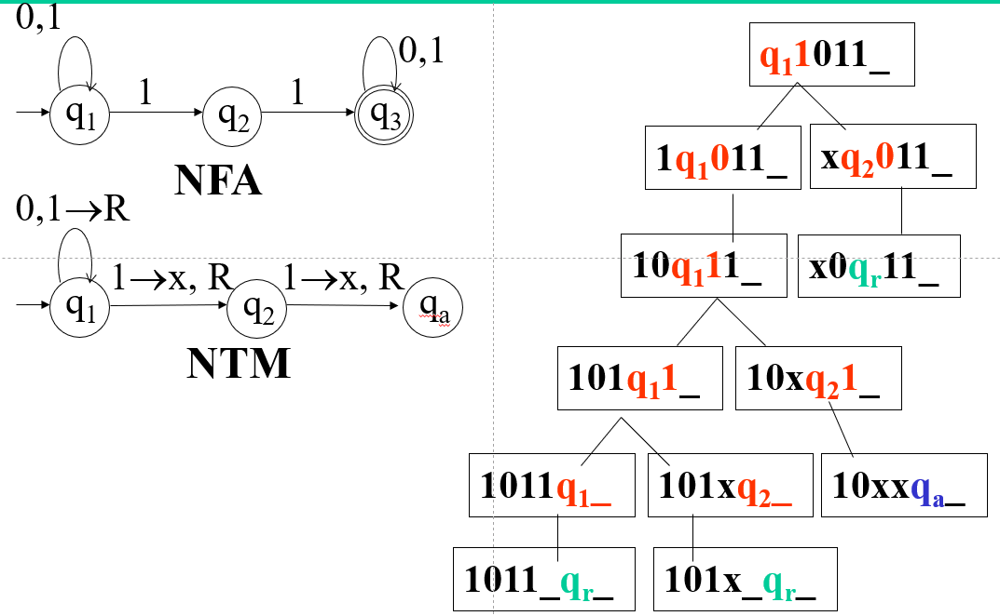

两个NFA和NTM的语言是完全一致的。

**Definition 1.3.7 NTM的语言** 设NTM $M$接受$x$，若在$x$上运行$M$有接受分支。则$M$的语言$L(M) = \{x \mid M \text{接受}x\}$

**Definition 1.3.8 NTM的判定性** 设NTM是判定的，当对任意输入，所有分支都停机

**Theorim 1.3.1 等价性** 每个NTM都有等价的确定TM，每个判定NTM都有等价的判定TM

## 可计算理论

### 可判定性

根据图灵机，有一些自然构造的问题：

- 停机问题：
  - $Halt = \{\langle M, x \rangle \mid M\text{在}x\text{上停机}, M\text{为TM}\}$ 不可判定
- 成员测试
  - $A_{DFA} = \{\lang B,w \rang \mid DFA\, B \, \text{接受}w\}$ 可判定
  - $A_{CFG} = \{\lang B,w \rang \mid CFG\, B \, \text{派生}w\}$ 可判定
  - $A_{DFA} = \{\lang M,w \rang \mid TM\, B \, \text{接受}w\}$ 不可判定
- 空性质测试
  - $E_{DFA} = \{\langle A \rangle \mid DFA \, A, L(A) = \empty\}$ 可判定
  - $E_{CFG} = \{\langle G \rangle \mid CFG \, A, L(G) = \empty\}$ 可判定
  - $E_{TM} = \{\langle M \rangle \mid TM \, A, L(M) = \empty\}$ 不可判定
- 等价性质测试
  - $EQ_{DFA} = \{\langle A,B \rangle \mid L(A) = L(B) , A, B \text{为DFA}\}$ 可判定
  - $EQ_{CFG} = \{\langle A,B \rangle \mid L(A) = L(B) , A, B \text{为CFG}\}$ 不可判定

下面给出一部分证明。

> $A_{DFA}$的判定性

直接构造$A_{DFA}$判定器：

M=对输入$\lang B,W\rang$，其中$B$为$DFA$，$w$为串，

1. 在$w$上模拟$B$
2. 如果模拟以接收状态结束则接受，否则拒绝

那么，$L(M) = A_{DFA}$。

> $A_{NFA}$的判定性

先把$NFA$转换为等价的$DFA$。

> $A_{CFG}$的判定性

任意一种CFG都有对应的乔姆斯基范式，而可以证明，若$|w|=n$，则派生少于$2n-1$步。所以可以构造判定器C：

- 将$G$转换为与之等价的乔姆斯基文法
- 列出所有的$2n-1$步派生，其中$n=|w|$
- 如果这些派生有一个产生$w$，则接受，否则拒绝

> $A_{PDA}$的判定性

先把$PDA$转换为等价的$CFG$.

> $ E_{DFA}$的判定性

容易发现，$L(A) \ne \emptyset$和存在从起始状态到接收状态的路径是等价的。因此，构造判定器T：

对于输入$\langle A \rangle$，

1. 标记起始状态
2. 重复下列步骤直到没有新的标记
3. 对任意未标记状态，如果有从已标记状态的转移，则将被标记
4. 如果没有接收状态被标记，则接受，否则拒绝。

> $E_{CFG}$的判定性

从终结符出发做标记：

1. 将$G$中所有终结符做上标记
2. 重复下列步骤，直到找不到可以做标记的变元
3. 如果$G$有规则$A \to U_1U_2\cdots U_K$，且$U_1,U_2\cdots U_k$均被做标记，则将$A$做标记
4. 如果起始状态没有被标记，则接受，否则拒绝

> $EQ_{DFA}$的判定性

构造$L(C) = L(A) \oplus L(B)$，只需要判定$C$是否为空。由于DFA在补和交运算下封闭，所以这个问题是可判定的。但CFG没有这种封闭性。

> $A_{TM}$的判定性

假设$A_{TM}$可判定，$H$为判定器，构造$D$：对于输入\<M\>，M为TM，

1. 在\<M,\<M\>\>上运行H，也就是把M编码成字符串之后运行。由于我们假设 了$H$是判定器，所以这个过程是在有限步进行的。
2. 如下构造D：若$H$接受\<M,\<M\>\>，则D拒绝\<M\>；否则，D接受\<M\>。
3. 考虑：D接受\<D\>，当且仅当\<D,\<D\>\>$\in A_{TM}$，当且仅当$H$接受\<D,\<D\>\>，当且仅当D拒绝\<D\>。因此H不存在。

显然，$A_{TM}$是可识别的。因为我们可以在$M$上直接匹配$w$，得到接受拒绝。

下面，给出一个非常重要的定理

**Theorim 2.1 A和A的补都是图灵可识别，则A图灵可判定**

证明：设$T,Q$分别识别A和A的补，构造$R$：对于输入$x$，

1. 在$x$上同步模拟T和Q，直到有一个接受
2. 若T接受$x$，则接受，若Q接受$x$，则拒绝。
3. 从而，$x \in A$，则$T$接受$x$，则$R$接受$x$
4. $x \notin A$，则$Q$接受$x$，则$R$拒绝$x$

从而，$R$是判定器，且$L(R) = A$。

因此，$A_{TM}$的补不是图灵可识别。

### 可归约性

考虑停机问题

## 计算复杂性

### 时间复杂性

#### 时间复杂度的概念

**Definition3.1** 判定器$M$的**运行时间**或**时间复杂度**是$f:N \to N$，$f(n)$是$M$在所有长为$n$的输入上运行的最大步数。若$f(n)$是$M$的运行时间，则称$M$在时间$f(n)$内运行 或 $M$是$f(n)$时间图灵机

给出一个例子：对这个图灵机，

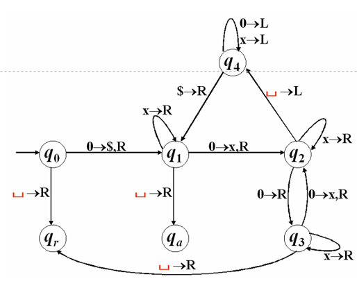

$f(1)=2,f(2)=7,f(3)=4, f(2^k)=(2k+1)2^k+1, f(2n+1)=2n+1,\cdots$

并且对于$f(n)$有估计
$$
n+1 \le f(n) \le 3n\log n
$$
为了描述其上下界，给出记法

**Definition 3.2** **大O记号** 对于函数$f,g:N \to R^+$，记$f(n)=O(g(n))$，若存在$c>0$使得
$$
\overline{\lim_{n\to \infty}} \frac{f(n)}{g(n)} \le c
$$
**小o记号** 记$f(n)=o(g(n))$，若
$$
\lim_{n \to \infty} \frac{f(n)}{g(n)} = 0
$$
接下来给出时间复杂性类的概念。

**Definition 3.3** 对于函数$t:N\to N$，**时间复杂性类TIME($t(n)$)**的定义为：TIME(t(n))={L|存在$O(t(n))$时间TM判定$L$}

考虑下面一个例子：对语言$\{0^k1^k \mid k\ge 0\}$，比较朴素的想法是这样的图灵机：

>  M~1~=“对输入串w：
>
> 1)从左到右扫描若1的右边发现0,则拒绝.
>
> 2)从左到右扫描,先删1个0再删1个1.
>
> 3)若删了1对,则转第2步.
>
> 4)若删1个,则拒绝.若删0个,则接受.”

这个图灵机的运行时间是$O(n^2)$。也就是$A \in \operatorname{TIME}(n^2)$

可以优化：

> M~2~=“对输入串w：
>
> 1)扫描带，若1的右边有0，则拒绝
>
> 2)若0,1都在带上，重复以下步骤
>
> 3)检查带上0,1总数的奇偶性，若是奇数则拒绝
>
> 4)在此扫描带，第一个0开始删，隔1个0删除1个0；第一个1开始删，隔1个1删除1个1
>
> 5)若带上同时没有0和1则接受，否则拒绝”

其时间是$O(n \log n)$的。有没有更快的$TM$识别$A$？为此给出如下定理。

**Theorim 3.1 时间$o(n\log n)$ 的单带图灵机判定的语言是正则语言**。 

证明从略。

根据这一定理，有
$$
\operatorname{TIME}(o(n\log n)) \sube \text{正则语言类} \sube \operatorname{TIME(n)} \sube \operatorname{TIME}(o(n\log n))
$$
因此，非正则语言$\{0^k1^k \mid k\ge 0\} \notin \operatorname{TIME}(o(n\log n))$

#### 不同模型的运行时间比较

考虑刚才的例子，我们可以构造一个双带图灵机：

> M~3~=“对输入串w
>
> 1) 扫描1带，如果在1的右边发现0，则拒绝
>
> 2) 将1带的1移动到2带上
>
> 3) 每删除一个1带的0就删除一个2带的1
>
> 4) 如果两代上同时没有0和1就接受”

给出定理：

**Theorim3.2 设$t(n)\ge n$，则每个$t(n)$时间多带TM和某个$O(t^2(n))$时间单带TM等价​**

再讨论NTM。给出NTM的运行时间：

**Definition 3.4** 对非确定型判定器$N$，其运行时间$f(n)$是再所有长为$n$的输入上，所有分支的最大步数。

给出定理：

**Theorim 3.3** 设$t(n)\ge n$，每个$t(n)$时间的NTM都有一个$2^{O(t(n))}$时间单带确定TM与之等价。

再定义NTIME：

**Definition 3.5** 时间复杂性类$\operatorname{NTIME}$
$$
\operatorname{NTIME}(t(n)) = \{L \mid \exists O(t(n))  \text{ NTM 判定}L\}
$$

#### P与NP类

**Definition 3.6** P类  P是单带确定TM再多项式内可判定的问题，即
$$
P = \bigcup_k \operatorname{TIME}(n^k)
$$
对于所有与单待确定TM等价的模型，$P$不变。

**Definition 3.7** NP类 NP是单带非确定TM在多项式时间内可判定的问题，即
$$
NP = \bigcup_k \operatorname{NTIME}(n^k)
$$
**Definition 3.8** EXP类
$$
EXP = \bigcup_k \op{TIME}(2^{O(n^k)})
$$
已经证明，
$$
P \sube NP \sube EXP
$$
且
$$
P \sub EXP
$$
但是是否取等仍然没有得到证明。

事实上，NP有一个等价定义。如果我们定义一个验证机：

**Definition 3.9** 语言A的**验证机**是一个算法$V$，这里
$$
A = \{w \mid \forall c, V\, \text{accept}\, \langle w,c\rangle\}
$$
如果语言$A$有一个多项式时间的验证机，则称它是**多项式可验证的**。

那么NP可以定义为**有多项式时间验证机的语言类**。

下面我们给出这个定理的证明。

**Theorim 3.4 一个语言有多项式时间验证机当且仅当它能被某个非确定型多项式时间图灵机判定**

证明：先证必要性

设$A \in NP$，则$A$的验证机是$V$，$V$是一个在$n^k$内运行的TM。构造$N$如下：

N=“对长为$n$的输入$w$

1) 非确定地选择最长$n^k$的字符串$c$

2) 在输入$\langle w,c \rangle$上运行$V$

3) 若$V$接受则接受，否则拒绝”

再证充分性

设$A$被NTM N所判定，构造$V$如下

V=“对输入$\langle w,c \rangle$，

1) 在输入$w$上模拟$N$，把$c$的每一个符号看作对每一步所作的非确定性选择的描述

2) 若$N$的该计算分支接受，则接受，否则拒绝”

下面举一些例子。

**CLIQUE问题** 定义无向图的完全子图（所有节点都有边相连）为团，$\text{CLIQUE}=\{\langle G,k\rangle \mid G\text{是有}k\text{团的无向图}\}$。这是一个NP问题，我们可以构造NTM：

N = “对于输入\<G,k\>，

1) 非确定地选择G中k个节点的子集c

2) 检查G是否包含连接c中节点的所有边

3) 若是，则接受，否则拒绝”

也可以从验证器的角度给出证明：构造V

V=“对于输入\<\<G,k\>,c\>”，

1) 检查c是否是G中k个结点的集合

2) 检查G是否包含连接c中结点的所有边

3) 若亮相检查都通过，则接受，否则拒绝。

**HP问题** 定义$\text{HP}=\{\langle G,s,t \rangle \mid G \op{include} \text{H Path}\}$

给出NTM：

N~1~=“对于输入\<G,s,t\>：

1) 非确定选G的所有节点排列

2) 若$s=p_1, t=p_m$，$(p_i p_{i+1}) \in E$，则接受，否则拒绝”

$P \ne NP$是当代理论计算机的一个难题，至今未被解决。

#### NP完全性

Cook（美）和Levin（苏）在1970年代证明，NP中某些问题的复杂性与整个NP类的复杂性相关联。

对于一个合取范式来说，我们定义子句的文字数不大于$k$：3cnf、2cnf.SAT问题就是可满足问题：
$$
\text{SAT} = \{\langle\phi \rangle \mid \phi \text{是可满足的布尔公式}\}
$$
特别的，对2cnf问题，叫做2SAT；3cnf叫做3SAT.

2SAT是一个P问题，算法如下：

为了证明SAT问题的作用，我们引入多项式规约的概念。

**Definition 3.10** 称函数$f:\Sigma^* \to \Sigma^*$为**多项式时间可计算函数**，若存在多项式时间的图灵机，对任意输入$w$，停机时带上的串是$f(w)$

**Definition 3.11** 称A**可多项式时间映射归约**到B（$A \preceq_p B$），若存在多项式时间可计算函数$f:\Sigma^* \to \Sigma^*$，有
$$
\forall w \in \Sigma^*, w \in A \Leftrightarrow f(w) \in B
$$
称$f$是$A$到$B$的**多项式时间规约**.

**Theorim 3.5 规约引理** 若$A \preceq_p B$且$B \in P$，则$A \in P$

证明：设$f:\Sigma^* \to \Sigma^*$是$A$到$B$的P时间规约，B有P时间判定器$M$，则

T=“输入$w$，计算$M(f(w))$，输出$M$的运行结果”在多项式时间判定A。

**Theorim 3.6 Cook-Levin定理** $\forall A \in NP, A \preceq_p SAT$

换言之，一切对NP问题的讨论，都等价于对SAT问题的讨论。

这一定理的证明略去，同时给出一个推论：$3SAT$是NP完全的。

### 几个NP完全问题

下面给出几个NP完全问题。

（1）CLIQUE

**Theorim 3.6 3SAT $\preceq_p$ CLIQUE**

证明：

取$\varphi = (a_1 \vee b_1 \vee c_1) \wedge \cdots \wedge (a_k \vee b_k \vee c_k)$，有$k$个子句，令$f(\langle \phi \rangle) = \langle G,k \rangle$，$G$有$k$组结点，每组3个。其边的构造方法是：

- 同组节点之间无边相连
- 相反标记之间无边相连
- 其它节点两两连边

例如：

其构造过程如下：如果$\langle \phi \rangle \in 3SAT$，等价于存在赋值使得$\phi = 1$，等价于存在变量赋值使得$\phi$每个子句都有真文字，等价于$\exists k$团，等价于$f(\phi) \in \text{CLIQUE}$。

换言之，如果存在可满足的赋值，那么这些满足的点相互之间是并行不悖的。因此，二者之间两两连边，就形成了k团。这样就完成了从3SAT到CLIQUE的构造。

（2）HP

HP问题的描述是：$\{\langle G,s,t\rangle \mid \exists \text{H Path } \Gamma:s \to t\}$ ，$G$为有向图

先证明其属于NP。构造如下NFA：

N=“对于输入$\langle G,s,t\rangle$，非确定的选择排列$\tau = sv_2 \cdots v_{n-1}t$，如果$\tau$是$G$的路径则接受，否则拒绝”

再证明$3SAT \preceq_p HP$。

为了证明其正确性，我们先给出一种“钻石型”构造，也就是对子句构件和联接构构件的构造。

我们定义下面的这一张图：

$x_i$为第$i$个变量。在第$i$层中，分成一系列节点：

- 边缘节点，最左侧和最右侧
- 分隔节点，图中的蓝色点，用来分割边界点和中间点
- 变量节点，左侧表示$x_i$，右侧表示$\bar x_i$，第$j$对对应子句$c_j$

假如一共有$k$个子句，每个子句对应一对节点，那么一个水平行一共有$3k+3$个节点。

接下来引入变量构件和子句构件的连接。如果$c_j$包含文字$x_i$，那么添加左出右回的左右式路径；如果$c_j$包含$\bar x_i$，那么添加右出左回的右左式路径。

可以发现，这种构造得到的图复杂度是$nk$的。下面，我们考虑H通路。

观察上面的图，对于每一层，可以触碰多个文字，但是方法只有一个；对于每一个子句，只能被触碰一次。哈密顿回路实际上对应了一个可满足的3SAT子句。为此，我们定义正规路径：对于$\phi$的一个可满足赋值，$x_i=1$，那么选取左右式路径；$x_i=0$，那么选取右左式路径；$c_j$选一真文字经过一次。

这种构造已经说明了，如果$\phi$可满足，那么有从s到t的正规H路径，进而有s到t的H路径。问题转换成证明其逆命题：存在正规H路径，那么$\phi$可满足；以及s到t的H路径只能是正规H路径。

前者的证明是从路径本身分析的。如果构件是左右式，那么取$x_i=1$，否则$x_i=0$。只有含真文字的字句节点$c_j$能被经过，所以此时$\phi=1$，$\phi$可满足。

后者采用反证法。假设存在非正规路径，如图所示：

由于$a_1$是取值节点，所以$a_2,a_3$必有一个是分隔节点。如果$a_2$是分隔节点，$a_2$只和$a_1,a_3$相连，而$a_1$无法再次经过，所以$a_2$有进无出。否则，$a_1c_ja_2$是左右式路径，$a_1,c_j$不能再次经过，如果有$a_3$到$a_2$的路径，那么$a_2$有进无出。因此，必须是正规H路径。

（3）UHP

UHP问题的描述是：$\{\langle G,s,t\rangle \mid \exists \text{H Path } \Gamma:s \to t\}$ ，$G$为无向图

先证$UHP \in NP$。构造NTM：

N=“对于输入$\langle G,s,t\rangle$，非确定的选择排列$\tau = sv_2 \cdots v_{n-1}t$，如果$\tau$是$G$的路径则接受，否则拒绝”

再证明$HP \preceq_p UHP$。

进行如下映射：$\langle G,s,t \rangle \to \langle G', s_{out}, t_{in} \rangle$，$s$对应$s_{out}$，$t$对应$t_{in}$，其它每个节点$v$对应$v_{in}, v_{mid}, v_{out}$

设$G$有$n$个节点，$G'$有$2n$节点，$2n$边，多项式时间可计算。

下面我们只需要证明两个方向

如果$\Gamma$是$G$的H Path，$\Gamma = sv_2v_3\cdots v_nt$，那么$\Gamma' = (s_{out}v_{2in}v_{2mid}v_{2out}\cdots t_{in})$是$G'$的H Path。这是由构造给出的，比较显然。

如果$\Gamma' = (s_{out}w_1w_2\cdots t_{in})$是$G'$的H Path，考虑下面两个性质：

1. $w_1$是$v_{kin}$。这是因为$s_{out}$只与$in$相连。
2. $v_{2in}\ne t_{in}$，则$w_2 = v_{2mid}, w_3=v_{2out}$。如不然，由于$\deg(v_{kmid})=2$，必须按照某个顺序穿过它，而$v_{kin}$已经经过，所以必须连着走过。

对这个过程用归纳，即可证明$(s,v_2,v_3,\cdots t)$是$G$的H Path。

（4）UHC

UHC问题是针对哈密顿回路无向图的，只需要填边即可。

（5）TSP

TSP问题的描述是：$\{\langle G,s,w,b\rangle \mid \exists \text{H Circ } C:s \to s, \sum_C w \le b\}$ ，$G$为无向图

先证$TSP \in NP$。构造NTM：

N=“对于输入$\langle G,s,t\rangle$，非确定的选择排列$\tau = sv_2 \cdots v_{n-1}t$，如果$\tau$是$G$的路径则接受，否则拒绝”

再证$UHC \preceq TSP$.

设$G=(V,E)$，$s\in V = \{v_1\cdots v_n\}$，令$G' = (V, V \times V)$，$f(\langle G \rangle)=\langle G',s,w,n\rangle$，给出权的定义：
$$
w(v_i, v_j) = \begin{cases}0, i=j \\ 1, (v_i,v_j) \in E \\ 2, \text{otherwise.}\end{cases}
$$
下面只需要证明两个方向：

如果$C$是$G$的H Circ，那么环上有$n$条边且权为1，则$\sum w \le n$

如果$C$是$G'$的符合条件的TSP，由于$\sum w \le n$，则最多有$n$条边，又为H Circ，所以回路边都在G中。

（6）SUBSET-SUM

SUBSET-SUM问题的描述是：$\{\langle S,t \rangle \mid S=\{x_1\cdots x_k\},\exists Y \sube S, \sum_{l \in Y} l = t\}$

先证属于NP。构造验证机：

V=“对输入\<\<S,t\>,c\>，若c是加起来等于t的数的集合且S包含中所有数，则接受，否则拒绝”

再证可归约。设$\phi$是布尔公式，变量$x_1\cdots x_l$，子句$c_1 \cdots c_k$，构建这样一张表：

这个表左侧分成两部分。$y_iz_i$对应一个变元$x_i$，如果$x_i$在文字$c_j$中出现，就把$(y_i,c_j)$设成1；如果$\bar x_i$在文字$c_j$中出现，就把$(z_i,c_j)$设成1，否则设成0.其余部分按照图上的对角化顺序填写1。

最下边一行是$l$个1和随后的$k$个3.

考虑如果$\phi$可满足，对于一种确定的选择，前l列由于在$(y_i,z_i)$中选取一个，和为1.后$k$列和在1到3之间，因为每个子句可以包含1-3个真文字。可以通过选择足够的g,h使得后k位为3来达到目标值。

如果我们把这张表看成一个十进制表，$S=\{y_1,z_1,\cdots, g_1,h_1,\cdots\}$，$t=111\cdots111 333\cdots 333$，$S$的一个子集$Q$和为$t$，由于一列最多是5，不存在进位，每个$i$包含$x_i$或$y_i$。前面一定存在1，对于后面，由于$g,h$最多提供2，所以每一个文字中一定存在变元。根据变元给出TRUE或FALSE的赋值，这就证明了可满足性。

