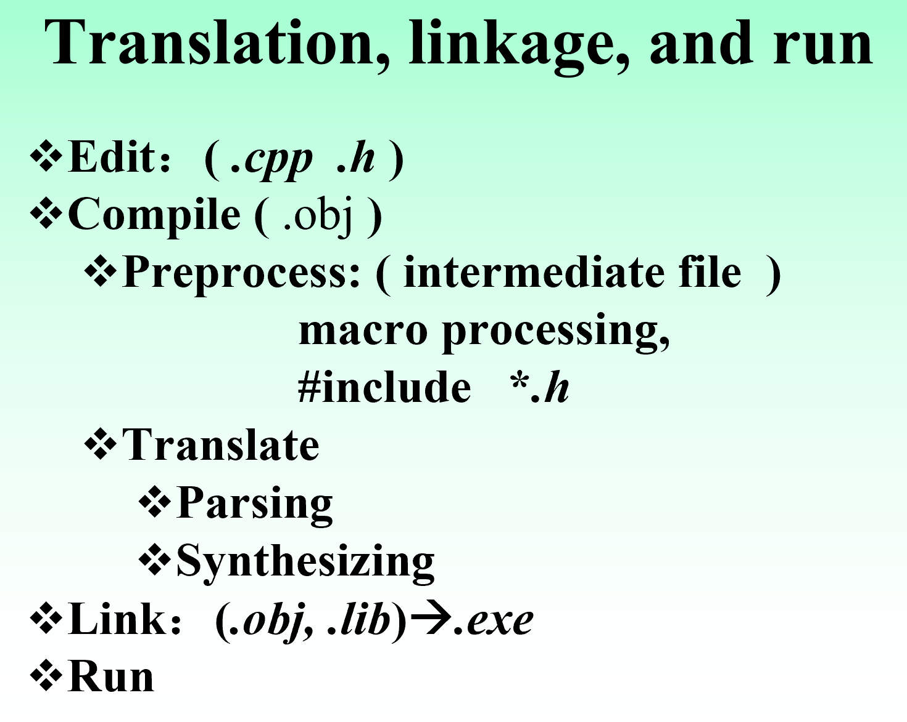
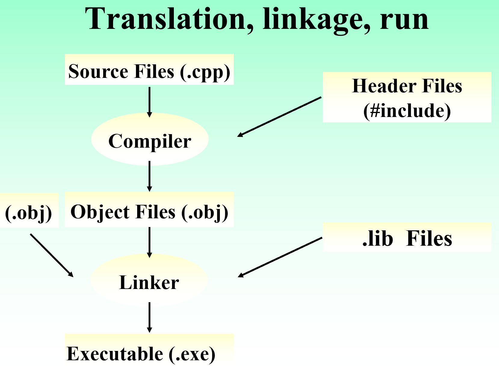
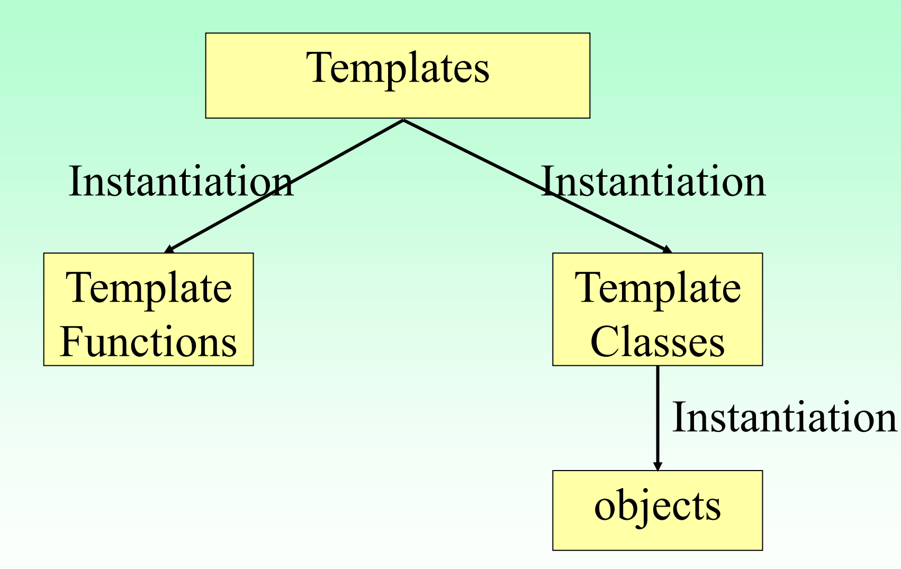

>2022.5	lbw
>
>写的挺答辩的，纯纯是看到这个repo里没有面向对象的相关材料才放上来。希望以后有心的学弟学妹可以做一个好一点的复习提纲

# OOP(Cpp)考前复习

OOP：

- Encapsulation
- Inheritance
- Polymorphism

## Cpp syntax

### Compile

一张图看懂edit, compile, translate和link在从编写代码到程序执行这段时间所起的作用：


**declaration**：向编译器引入变量

**definition**：给变量分配内存

declaration和definition既可以同步进行也可以先declaration再definition

#### Header Files

包含了外部的declaration

#### Linking

==Linker==会收集编译器产出的.obj和外部的libraries然后将其转化为可执行文件

只需告诉Linker .obj的的名字和可执行文件的名字，他就可以工作



### 使用iostream、string、vector类

iostream类图：


### C++中的C语法

函数、运算符、基本数据类型

#### Pointer 指针

指针应当在declaration时初始化它

如果想更改指针所指向的数据类型，要使用显式的类型转换

C++允许将一个`void*`类型的指针指向任意类型的数据，但不允许将任意类型的数据指向`void*`

#### Reference  引用

使用引用可以允许一个函数去修改外部的对象，如同指针那样

引用必须==初始化==，也就是说declaration和definition必须同时进行

初始化==永远不能为null==

##### const与reference

让一个函数参数变为一个const reference会允许这个函数在任何情况可用，比如：

- 若一个函数的参数为`int& a`，那么向这个函数直接传一个Constant是不合法的，只能传入一个变量；比如传入一个1，非法，传入一个const修饰过的变量，也非法
- 若一个函数的参数为`const int& a`，那么传常数和变量都是合法的

#### 指定存储位置

1. Global variables

   对于程序的所有部分都有效

2. Local variables

   自动是`auto`的

   使用`register`关键字可以提升对变量的访问速度，但不能用于全局或静态变量

3. Static variables

   被`static`修饰的变量只会初始化一次，并在多次函数的调用之间保存它的值（相当于Global?）

   比如说一个函数令static的变量i初始化为0，每次调用会使i++，那么得到的结果不会是每次都是1而是会不断增加

   但是static的变量在函数的作用域之外是无效的，也就是说会限制变量的作用域（函数的Global变量？）

4. Extern

   使用`extern`关键字可以告诉编译器一个变量存在，而在哪里definition的需要编译器等下再去找

   使用extern关键字还可以调用其他文件里的变量

   注意，使用extern关键字declaration变量的时候，不能同时definition赋值

5. Constants

   `const`修饰的变量不能被修改，也必须被初始化他的值

6. Volatile

   `volatile`修饰的变量可以在任何时候改变

#### 运算符


#### Dynamic storage allocations

使用`new/new[]`会返回一个指向后面对象类型的指针

使用`delete/delete[]`销毁动态的对象

带`[]`都是用于数组的

### Constants

==const默认与左边结合，如果左边没有东西则与右边结合==，如：

`const int* p`代表着p是指向整型的const指针

`const int * const p`代表着p是指向const整形的const指针

注意，const类型对象的值，不可能通过指向它的指针修改

#### Value substitution

一个常量必须要被初始化，并且不能被重新赋值

#### Pointers

如果一个指针被const修饰，那么不仅不能修改该指针指向的地点，也不能修改该指针指向的变量、数组、对象等等的值或字段

对于const修饰过的变量，必须要用const类型的指针才能拿到地址，且const必须修饰在类型前，比如：

```c++
const float f1 = 5.0;
float *const p1 = &f1; //error!
const float* p2 = &f1; //ok

float f2 = 1.0;
float *const p3 = &f2;//ok
float *const p4 = &f2;//ok
```

#### 函数参数与返回值

1. 如果传递给函数地址，使用const能确保这个地址不会被改变
2. 如果返回一个const类型的对象，那么返回的对象是不能被修改的

如果在函数类型中表明了const，那么既可以传入const值也可以传入非const值；而如果没有标注const，那么就无法传入const值

使用const值能避免client在拿到返回的地址后去修改值

#### Temporaries

在表达式中，compiler可能会创建临时的对象，他们都是const的

#### 成员函数后面加const

这个const修饰的是this指针，意思是这个函数不能修改该对象的任何字段

### Functions

#### 传递参数的方式

1. 值传递

2. 指针传递

3. 引用传递

   被调函数内对形参的操作就是对实参的操作

   如果被调函数只使用==实参的值==，而不改变实参，那么可以在形参前加const修饰

#### Function Pointer

**把函数也当作一个对象**

一旦函数被编译并且将被执行，他就会占据一块内存并且有一个地址

使用函数指针：

- `void (*funcPtr)()`，`funcPtr`是指向一个没有参数并且不返回值函数的==指针==
- `void* funcPtr()`，`funcPtr`是一个会返回`void*`的==函数==

#### Static Fuction

对于包含多个文件的程序，在全局函数前加static修饰可以限制函数的作用域为本文件

#### Inline Function

当一个函数**很短**但是需要被经常调用时，使用Inline Function可以大幅提高效率

内联函数不能包括迭代和switch，不能处理异常，也不能是递归的

所有在类中定义的函数都默认是inline的

如果所有函数都是内联函数，那么整个类都应该被放在头文件里

#### Default arguments

默认参数只能**从右向左**添加，比如：

- `int f(int,int = 0,char* = 0)`这是可以的
- `int g(int = 0,int,char* = 0)`是不可以的

默认参数可以是常量，也可以是表达式

默认参数在同一作用域内只能初始化一次

#### Placeholder arguments

可以不给函数的参数提供identifier，也就是不给他名字，但是这样也没办法用那个参数了

那么这个参数将纯纯用来占位

### Name Control

#### Static elements

1. static storage：static的object会在一片特殊的区域存储而不是在栈中，会等到程序结束时才被释放
2. static 还会控制一个name的visibility

如果一个static的对象没有被初始化，那么compiler会给它赋初值0；但是用户定义的类型必须用constructor初始化

#### Static object destructors

一个全局object的constructor一般在进入main函数之前就被调用

而函数中的static object只有在该函数被调用时constructor才被调用

#### Namespaces


### Template 泛型

从泛型生成一个类或一个函数的过程称为==instatiation==



#### 泛型语法

##### 泛型函数

```c++
template <typename T>
T max(T x,T y){
    return (x>y)?x:y;
}
max<int>(1,2);
```

T是type arguments，在函数被调用之前必须要用data类型来代替它

##### 泛型类

```c++
template <typename T>
class name{
    ...
}

name<type> n = name();
```

如果一个函数在template类的外面被定义，那么他也必须被定义为template函数

在创建一个template类的实例时，要规定它的data类型，比如：`name<int,char> n(1,'2');`


## Cpp class

怎么在代码中实现对象呢？使用 abstract data type -- `class`

`class`中包含 data elements 和 functionality分别用来刻画对象的 特征 与 行为`

### class基础

`class`与`struct`最大的区别是`class`的成员默认是`private`而`struct`的成员默认是`public`

`::`用于分析作用域，比如`classname::func()`意思是`func()`这个函数是`classname`类里的方法

==所有成员方法==都暗含了一个参数`this`，`this`是一个`classname*`类型的指针，指向这个对象

Object-Based和Object-oriented的最大区别在于==多态==

#### 存取控制——hiding implementation

1. 把接口与实现分离开
2. 使用public、private和protected关键词
3. 使用`friend`：在类之中==声明==一个friend function，注意friend function==不是成员函数==，但是friend function具有访问类中私有字段的权限。friend function不能被继承

#### 初始化和清除

##### Constructor

Constructor是一个与class名字相同的函数，没有返回值，通过重载来分辨不同的Constructor

在给一个对象分配空间的时候，Constructor被自动调用。也可以手动调用

###### copy constructor

```cpp
int a = 5;
int b = 1;	//copy constructor

X first(1,2,3);
X second = first;  //copy constructor
```

声明初始化：

设类名为X，声明构造函数`X(const X& x)`即为copy constructor

copy constructor在何时被调用？

- 用值传递参数
- 函数返回一个object值
- 使用已有object传递新object
- 使用引用传递参数时==不会调用==

###### 转换构造函数

当构造函数具有一个参数或者从第二个参数开始都具有默认值，那么这个构造函数会自动把第一个参数转换成当前类的类型

###### 初始化列表

形如此的构造函数：

```c++
class Data{
 	int a;
public:
    Data(int ra):a(ra){}
};
```

const数据成员、引用型数据成员、类类型成员的初始化操作必须成员初始化列表中进行

##### Destructor

Destructor是一个名字为"~"加上class名字的函数，没有返回值。destructor不能被重载且没有正式的参数

Destructor会在一个对象被销毁时自动调用

#### class修饰

##### Static Data Members

被static修饰的字段被该类的==所有object所共享==

声明为static的data必须被初始化，但是在初始化时不需要加static关键字

因为consts和引用必须被初始化，所以含有上述两者的类必须要写构造函数

##### Static member funtions

静态成员函数只能访问static data member，不能是virtual函数，也没有this指针

##### Const Member Functions

在函数名和()之后添加const会使函数变为const member function

const member funtion不能修改类的data member，除非这个字段被==mutable==修饰过

##### Const objects

const修饰的对象只能调用const修饰的成员函数，不能调用非const的

##### volatile

#### 指向数据成员或成员函数的指针

使用`::*`定义这些指针

使用`->*`或`.*`来使用这些指针

##### 指向data字段的指针

```cpp
Data d;
Data* dp = &d;
//定义指向Data中a字段的指针pm
int Data::*pm = &Data::a;	//主要看这两行
dp->*pm = 47;
//将pm指向的内容改为b字段
pm = &Data::b;
d.*pm = 48;
```

##### 指向成员函数的指针

```cpp
Widget w;
Widget* wp = &w;
//定义成员函数指针
void (Widget::*pmem)(int) const = &Widget::h;
(w.*pmem)(1);
(wp->*pmem)(2);
```

#### 运算符重载

运算符重载是调用函数的另一种方式

##### 成员函数重载

普通的运算符重载已经比较熟悉，不过多介绍

##### 使用友元的运算符重载

没有隐式的this，所以相比于成员函数，必须要有显式的对象在函数的参数中

##### 选用成员函数还是友元？

1. 如果第一个操作数是一个类的对象，应当使用成员函数；否则使用友元
2. 所有的一元运算符和=,(),[],->,->*,+=,-=,/=,\*=,^=,&=,|=,%=,>>=,<<=都应使用成员函数，其他的用友元

##### 其他注意事项

1. ->运算符的返回值必须是一个指针 
2. 自增(++)和自减(--)运算符都可以用于前缀或者后缀运算符，所以要重载这俩运算符，都需要两个函数Prefix: `type operator++()`     Postfix: `type operator--(int)`
   注意后缀中的int并不是真实的参数，只是用来==占位==以区分前缀和后缀运算符
3. 关于赋值运算符"="：如果在declaration的同时调用=，那么被调用的则是copy constructor；如果是先declaration，后来再赋值，那么调用的是=的重载
4. 当一个类有指针类型的字段时，一定要定义它的copy constructor和=运算符重载，否则可能会出现同一个地址被释放两次等异常状况
5. 类型转换重载：`type operatorT()`，转换类型type到T
6. inserter<<和extractor>>，重载这两个运算符以用于标准化输出，第一个参数是ostream或istream

#### 动态object创建

当一个object被创建时，会发生两件事：

1. 分配存储空间：static storage area, stack, heap(动态内存分配)
2. 调用constructor

如果要动态创建，要用到new和new[]，删除则是delete和delete[]


### Inheritance & Composition

#### syntax

Composition：在一个新的类中创建已有的类的object

继承的基础都比较了解了，不再多说

#### Constructor initializer list

constructor和destructor是不会被继承的，赋值运算符也不会被继承

当创建一个派生类时，下列objects可能被创建：基类、成员类和派生类自己。

一般先创建基类，然后按照构造类中声明的顺序创建成员类，最后创建派生类

#### Name hiding

子类的成员函数名与基类相同，称为`Redefine`

在派生类中的成员函数名字与基类中相同时，会自动隐藏基类的函数

如果redefine了一个static成员函数，那么所有基类中的重载函数都会被隐藏

#### 选择inheritance和composition

如果要使用基类的接口，那就用inheritance；如果只是想用一个类的特性，那用composition

#### Access Control

Access specifier：public, private, protected

不管用什么修饰，派生类都无法直接访问到基类的private成员，private成员只能被同一类的成员函数或友元访问

##### public

基类成员的访问属性在派生类中保持不变

**同名屏蔽**：如果派生类redefine了与基类中同名的函数，那么所有基类的同名函数都会被屏蔽

**向上类型转换**：通过public继承，派生类获得了基类中除构造函数、析构函数、复制韩式以外的所有成员，这样公有派生类就具备了基类的功能，在需要基类的地方可以用派生类代替

##### private

基类成员的访问属性在派生类中全部变为private

##### protected

基类成员的访问属性在派生类中全部变为private

#### Constructor&Destructor

派生类的构造函数要在==初始化列表==中对基类数据成员初始化

==顺序==为：先按继承顺序调用基类的构造函数，再按照成员在派生类中声明的顺序进行初始化

析构的顺序与上面相反

#### 继承中的运算符重载

除了赋值操作符，运算符全都会自动被派生类继承

#### Multiple inheritance

一个派生类可以有多个直接的基类

#### Incremental development（增量开发）

增量开放可以让我们加入新的代码但是不造成bug

#### Ambiguity

一个类可能作为派生类的基类不止一次；不同的基类可能有相同的成员函数名

解决方法：

1. 使用`::`限定作用域或者定义一个新函数
2. 直接在派生类中定义一个新的成员函数
3. 在继承时使用`virtual`修饰基类


### Polymorphism & Virtual Functions

#### Upcasting

当使用==引用或者指针==操纵object时，派生类的object能表现出基类的特性，也就是说派生类是基类的一种。这点在多态中十分重要

如果没有用引用或者指针而是直接用了派生类object的值，就会出现object slicing

#### Virtual Functions

```c++
virtual type func(arguments);
```

虚函数是==nonstatic==的成员函数，且`virtual`只许在声明处写

如果一个函数在基类中就被声明为虚函数，那么他在所有派生类中都是虚函数

constructor不能是虚函数，destructor可以是虚函数并且往往是虚函数

对于虚函数的redefinition被称为overriding

如果在派生类中，基类的虚函数没有被重写，那么就会调用“最近”的函数

要实现多态，需要：

1. 派生类public继承基类
2. 被调用的成员函数必须是虚函数
3. 通过**引用或指针**操纵object

#### Abstract base classes & Pure virtual functions

Abstract base class至少要有一个pure virtual function

一个pure abstract base class只有pure virtual function

抽象类不能实例化，也就是不能创建它的对象

pure virtual function要在函数声明后面加'=0'，如：`virtual void func()=0;`，纯虚函数没有函数体

所有的pure virtual function在子类都应该被重写

#### Object slicing

如果没有用引用或者指针而是直接用了派生类object的值，就会出现object slicing：意思就是会把一个派生类的对象“切成”基类对象，只留下与基类object相同的部分
