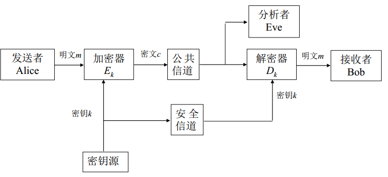
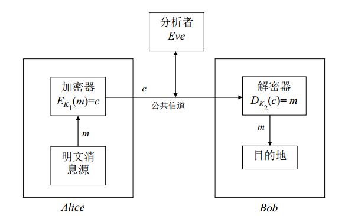
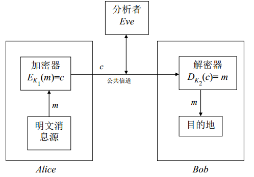
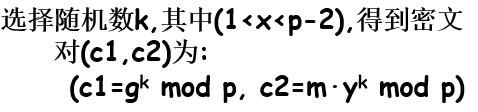
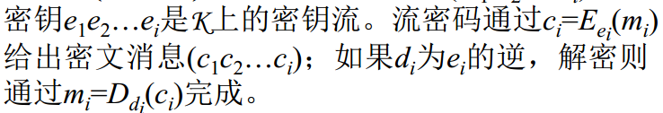
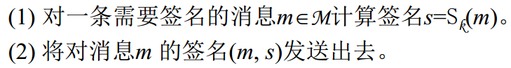

# 安全协议设计与分析

## 引论

### 协议概念

两个或者两个以上的参与者为达到特定的目的而采取的一系列步骤

- 协议规定的有序的步骤必须依次执行
- 协议必须有两个及以上的参与者
- 协议有明确的目的

### 密码协议基础

也称为安全协议，需要使用一些密码算法作为构造协议的基本模块

#### 特殊需求

- 安全需求：需包括加密、认证、不可抵赖性
- 鲁棒性：可能有恶意参与者非法执行协议，鲁棒性要求密码协议在有恶意参与者的情况下能部分正确执行并保护其他参与者的秘密信息。**恶意参与者的存在是区分密码协议和一般通信协议之间的区别**

#### 分类（按对第三方的依赖程度）

- 仲裁协议：仲裁者是可信第三方，协议必须要有仲裁者参与
- 裁决协议：裁决者是可信第三方，协议在有争议时有裁决者参与
- 自动执行协议：无需可信第三方

### 密码协议模型

通常由三个方面来描述一个密码协议模型：协议参与者类型；参与者之间的网络连接情况；协议攻击者的能力。

#### 协议参与者类型

- 协议参与者
- 协议攻击者：攻击者与参与者没有严格的界限
- 可信第三方
- 仲裁者：使协议执行过程中的争端以公平合理的方式处理

#### 网络连接情况

#### 协议参与者诚实程度

- 诚实参与者
- 半诚实参与者：按照协议要求执行，只是窃听或获取其他参与者在协议中进行的所有输入
- 恶意攻击者：不仅窃听或获取输入，还控制参与者按照自己设计的方式进行协议

#### 协议攻击者能力

按照攻击者的计算能力可将攻击者分为两类：

- 拥有无限计算能力的攻击者，在此情况下安全的协议称为**信息论安全**
- 拥有概念多项式时间计算能力的攻击者，在此情况下安全的协议称为**密码学安全**

按攻击者目的：

- 理性攻击者
- 非理性攻击者

按攻击者在协议中的地位：

- 内部攻击者
- 外部攻击者

按照攻击者对于协议参与者之间通信信道的控制可分为三类：

- 安全信道：攻击者对通信信道没有控制能力，通信既不会被窃听，也不会被篡改
- 非安全信道：攻击者可以窃听任意协议参与者之间的通信，但不能篡改
- 未认证信道：攻击者不仅可以窃听，还能篡改

## 密码学概述

密码学是第三方存在下的安全通信技术的研究与实践

### 保密通信系统

基本模型如下所示

#### 通信中的参与者

- 发送者Alice：合法的信息发送实体
- 接收者Bob：合法的信息接收实体
- 分析者：破坏通信双方正常安全通信的其他实体

#### 信道

- 安全信道：分析者没有能力对其上的信息进行阅读、删除、修改、添加的信道。
- 公共信道：分析者有能力对其上的信息进行阅读、删除、修改、添加的信道。

#### 分析者的目的

- 解读公共信道上的密文消息（被动）
- 确定密钥以解读所有用该密钥加密的密文消息（被动）
- 变更密文消息使Bob认为变更消息来自Alice（主动，伪造）
- 冒充Alice和Bob通信，使Bob相信消息来自真实的Alice（主动）

#### 常见攻击形式

- 唯密文攻击：分析者仅掌握密文
- 已知明文攻击：分析者掌握一批密文以及对应的明文
- 选择明文攻击：分析者可临时访问加密机，用自己选择的明文获取加密密文
- 选择密文攻击：分析者可临时访问解密机，用自己选择的密文获取解密明文

#### Kerckhoffs准则 

算法的安全不应依赖于对算法的保密

### 对称密码体制

加密密钥与解密密钥相同

代表：DES和AES

优点：算法简单，加解密速度快

缺点：密钥的产生与管理问题

#### DES算法

分组加密算法，64位分组，密钥长度64位（实际长度56位）

基本思想：混淆与扩散

- 混淆：复杂化密文和明文
- 扩散：将每一位明文的影响尽可能分散到多个输出密文中

三个步骤：

- 初始置换IP
- 16轮迭代的乘积变换
- 逆初始变换IP-1

### 非对称密码体制

加密密钥与解密密钥不同

代表：RSA和ELGamal

优点：能公开加密密钥，仅保留解密密钥，不存在密钥管理问题

缺点：计算量较大，不适宜大量数据加密

#### ElGamal算法

分三步

- 密钥生成：

  

- 加密：

  

- 解密：

  

### 现代密码学解决的基本安全问题

- 机密问题：除了信息的授权人外，其他人不可获得信息内容，主要通过**加解密算法**完成
- 数据真实完整性问题：可发现对数据的非法变更
- 认证问题：在正式通信前识别对方身份，通常分为实体认证和数据源认证
- 不可否认性：为了阻止实体否认从前的承诺或行为，**数字签名**

### 现代密码学的基本概念和技术

#### 单向函数

对于每一个输入，函数值都容易计算（多项式时间），但是给出一个随机输入的函数值，算出原始输入却比较困难（无法在多项式时间内使用确定性图灵机计算）

实例：大整数分解问题，离散对数（DL）问题

#### 陷门单向函数

在单向函数再附加一个特性，即若给定一些附加信息（陷门信息K），算出原始输入就变得容易

#### 私钥加密主要技术

- 分组密码：将明文消息在编码集按固定长度t进行分组，再一组一组加解密，如DES、AES

- 流密码：

  

#### 数字签名技术

基本术语列表：

签名过程（由签名者完成，使用保密的签名密钥）：

验证过程（由验证者完成，使用公开的验证密钥）：

## 密钥交换协议

在实际应用系统中，需要使用公钥密码或其他方法确立一个适用于**对称密码的共享密钥**，即会话密钥，会话密钥仅用于一次会话，建立这种会话密钥的机制即为密钥交换协议。

在理想情况下，密钥交换协议除了实现密钥共享外，还需要满足以下安全需求：

- 只有A和B知道K，确保参与者知道自己将要通信的目标主体
- A和B确保对方知道K，参与者知道目标主题参与了当前通信，并对当前通信作出回应
- A和B知道K是新生成的，共享密钥只能使用较短时间，这是一个基本原则

密钥建立协议基本目标

- 隐式密钥认证：协议参与方要确信只有身份确定的协议参与另一方才能知道共享密钥
- 密钥确认：协议参与一方要确认另一方已经拥有了共享的密钥
- 显示密钥认证：同时提供隐式密钥认证和密钥确认性

密钥建立协议分类：

- 密钥传输协议
- 密钥协商协议
- 混合协议

协议和攻击（掌握，3 密钥交换协议1）

### 基于自证明公钥的密钥交换

### 基于身份的密钥交换

### 群组密钥交换

## 公钥基础设施

通过**数字证书**可以将一个**公钥**和一个**身份**的实体及其相关信息相绑定

公钥基础设施PKI是提供公钥加密和数字签名服务的综合系统，管理密钥和证书。

核心元素：数字证书

核心执行者：CA（认证中心）认证机构

### X.509证书结构

- 版本号
- 证书持有人公钥
- 证书序列号
- 主体信息
- 证书有效性
- 认证机构
- 发布者的数字签名
- 签名算法标识符
- 

## 高级签名协议

### 盲签名

如果协议正确执行，持有消息m的用户User可以获得签名人Signer对消息m的数字签名s，但Signer不知道m的内容，即使之后公开（m,s）也无法追踪之前签名的过程

一个盲签名体制需要满足3个**算法**：

- Setup：输出系统参数和签名人公私钥对（pk,sk）
- Sign：用户秘密输入待签名消息m，签名人秘密输入自己的私钥sk，执行签名协议，在多项式时间内停止，输出签名s
- Verify：输入签名人公钥pk以及待验证消息签名对（m,s），验证签名有效性

需要满足三个**性质**：

- 正确性
- 不可伪造性

### 群签名

### 环签名

### 基于身份的数字签名

