# 安全协议设计与分析

不得不说教材编的不错，内容里也没什么废话，建议阅读教材，由于公式的原因，该提纲的很多内容也是教材截图

## 引论

### 协议概念

两个或者两个以上的参与者为达到特定的目的而采取的一系列步骤

- 协议规定的有序的步骤必须依次执行
- 协议必须有两个及以上的参与者
- 协议有明确的目的

### 密码协议基础

也称为安全协议，需要使用一些密码算法作为构造协议的基本模块

#### 特殊需求

- 安全需求：需包括加密、认证、不可抵赖性
- 鲁棒性：可能有恶意参与者非法执行协议，鲁棒性要求密码协议在有恶意参与者的情况下能部分正确执行并保护其他参与者的秘密信息。**恶意参与者的存在是区分密码协议和一般通信协议之间的区别**

#### 分类（按对第三方的依赖程度）

- 仲裁协议：仲裁者是可信第三方，协议必须要有仲裁者参与
- 裁决协议：裁决者是可信第三方，协议在有争议时有裁决者参与
- 自动执行协议：无需可信第三方

### 密码协议模型

通常由三个方面来描述一个密码协议模型：协议参与者类型；参与者之间的网络连接情况；协议攻击者的能力。

#### 协议参与者类型

- 协议参与者
- 协议攻击者：攻击者与参与者没有严格的界限
- 可信第三方
- 仲裁者：使协议执行过程中的争端以公平合理的方式处理

#### 网络连接情况

#### 协议参与者诚实程度

- 诚实参与者
- 半诚实参与者：按照协议要求执行，只是窃听或获取其他参与者在协议中进行的所有输入
- 恶意攻击者：不仅窃听或获取输入，还控制参与者按照自己设计的方式进行协议

#### 协议攻击者能力

按照攻击者的计算能力可将攻击者分为两类：

- 拥有无限计算能力的攻击者，在此情况下安全的协议称为**信息论安全**
- 拥有概念多项式时间计算能力的攻击者，在此情况下安全的协议称为**密码学安全**

按攻击者目的：

- 理性攻击者
- 非理性攻击者

按攻击者在协议中的地位：

- 内部攻击者
- 外部攻击者

按照攻击者对于协议参与者之间通信信道的控制可分为三类：

- 安全信道：攻击者对通信信道没有控制能力，通信既不会被窃听，也不会被篡改
- 非安全信道：攻击者可以窃听任意协议参与者之间的通信，但不能篡改
- 未认证信道：攻击者不仅可以窃听，还能篡改

### 协议的安全性质

共四种基础安全性质，还有一种新鲜性

#### 秘密性

保证数据只能被授权用户得到，可通过**加解密算法**实现

#### 数据完整性

保证数据没有被非法篡改，一般通过**hash函数**或**消息认证码MAC**实现

#### 数据起源认证性

保证数据起源，这也是身份认证的基础，实现机制与数据完整性相同

- hash函数：在消息加密前先使用单向函数对明文操作得到MDC
- 消息认证码MAC：是以密钥K和任意长度的明文m作为输入，输出固定长度的值并满足计算MAC是容易的，但给定已知密钥和MAC对计算任意新明文的MAC是计算不可行的

#### 非否认性

保证用户对于承诺过的消息不能进行否认，一般使用**数字签名**实现，数字签名同样可以提供认证性和数据完整性

#### 新鲜性

抵抗**重放攻击**，主要方法包括两种：

- 用户选择新鲜的消息加到协议传输的消息中，询问-应答方式（加随机数）
- 用户收到的消息中包括本身具有新鲜性的一部分信息，时间戳

### 协议攻击类型

- 窃听：被动，攻击者取协议运行当中传输的消息，需要秘密性来防御
- 篡改：更改协议运行中传输的消息的内容，需要数据完整性来防御
- 重放：攻击者记录已经获取的消息并在随后的协议运行中发送给相同或不同的接收者
- 反射：攻击者将消息发回给消息的发送者，是重放攻击的一种特例，在相同协议并行运行时容易发生
- 类型攻击：由于用户接受到的信息都是二进制串，攻击者将协议运行中的某一类消息域替换成其他的消息域。 
- 证书操纵：攻击者选择或更改证书信息来攻击协议的运行

攻击示例可看3密钥交换协议1、

## 密码学概述

密码学是第三方存在下的安全通信技术的研究与实践

### 保密通信系统

基本模型如下所示

#### 通信中的参与者

- 发送者Alice：合法的信息发送实体
- 接收者Bob：合法的信息接收实体
- 分析者：破坏通信双方正常安全通信的其他实体

#### 信道

- 安全信道：分析者没有能力对其上的信息进行阅读、删除、修改、添加的信道。
- 公共信道：分析者有能力对其上的信息进行阅读、删除、修改、添加的信道。

#### 分析者的目的

- 解读公共信道上的密文消息（被动）
- 确定密钥以解读所有用该密钥加密的密文消息（被动）
- 变更密文消息使Bob认为变更消息来自Alice（主动，伪造）
- 冒充Alice和Bob通信，使Bob相信消息来自真实的Alice（主动）

#### 常见攻击形式

- 唯密文攻击：分析者仅掌握密文
- 已知明文攻击：分析者掌握一批密文以及对应的明文
- 选择明文攻击：分析者可临时访问加密机，用自己选择的明文获取加密密文
- 选择密文攻击：分析者可临时访问解密机，用自己选择的密文获取解密明文

#### Kerckhoffs准则 

算法的安全不应依赖于对算法的保密

### 对称密码体制

加密密钥与解密密钥相同

代表：DES和AES

优点：算法简单，加解密速度快

缺点：密钥的产生与管理问题

#### DES算法

分组加密算法，64位分组，密钥长度64位（实际长度56位）

基本思想：混淆与扩散

- 混淆：复杂化密文和明文
- 扩散：将每一位明文的影响尽可能分散到多个输出密文中

三个步骤：

- 初始置换IP
- 16轮迭代的乘积变换
- 逆初始变换IP-1

### 非对称密码体制

加密密钥与解密密钥不同

代表：RSA和ELGamal

优点：能公开加密密钥，仅保留解密密钥，不存在密钥管理问题

缺点：计算量较大，不适宜大量数据加密

#### RSA算法

- 密钥生成

  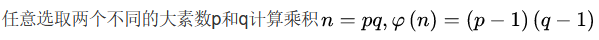

  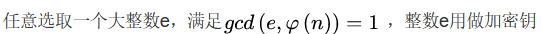

  

  公开整数n和e

  秘密保存d

- 加密

  

- 解密

  

安全性基于**大整数分解**的困难性

#### ElGamal算法

分三步

- 密钥生成：

  

- 加密：

  

- 解密：

  

其安全性依赖于**离散对数问题**的计算困难性

### 现代密码学解决的基本安全问题

- 机密问题：除了信息的授权人外，其他人不可获得信息内容，主要通过**加解密算法**完成
- 数据真实完整性问题：可发现对数据的非法变更
- 认证问题：在正式通信前识别对方身份，通常分为实体认证和数据源认证
- 不可否认性：为了阻止实体否认从前的承诺或行为，**数字签名**

### 现代密码学的基本概念和技术（部分略过）

#### 单向函数

对于每一个输入，函数值都容易计算（多项式时间），但是给出一个随机输入的函数值，算出原始输入却比较困难（无法在多项式时间内使用确定性图灵机计算）

实例：大整数分解问题，离散对数（DL）问题

#### 陷门单向函数

在单向函数再附加一个特性，即若给定一些附加信息（陷门信息K），算出原始输入就变得容易

#### 私钥加密主要技术

- 分组密码：将明文消息在编码集按固定长度t进行分组，再一组一组加解密，如DES、AES

- 流密码：

  

#### 数字签名技术

数字签名可提供认证性、完整性和不可否认性

基本术语列表：

签名过程（由签名者完成，使用保密的签名密钥）：

验证过程（由验证者完成，使用公开的验证密钥）：

签名算法必须满足的条件：

- 签名者事后不可否认自己的签名
- 除签名者外任意实体生成合法消息签名对是计算不可能的
- 当通信双方为签名真伪发生争执时, 可以由第三方解决争端  

## 公钥基础设施

通过**数字证书**可以将一个**公钥**和一个**身份**的实体及其相关信息相绑定

**公钥基础设施PKI**是提供公钥加密和数字签名服务的综合系统，管理密钥和证书。

核心元素：数字证书

核心执行者：CA（认证中心）认证机构，是第三方可信机构

### X.509证书结构

数字证书是经机构认证的数字签名文件，包含证书拥有者基本信息和公开密钥

- 版本号
- 证书持有人公钥：包括公钥、算法标识符、其他密钥参数
- 证书序列号：由CA给每个证书分配**唯一**的数字型编号
- 主体信息：证书持有人的唯一标识符，由许多部分组成
- 证书有效性：起始时间和终止时间
- 认证机构：证书发布者，使用该证书意味着信任该机构
- 发布者的数字签名：由证书发布者私钥生成的签名，确保证书发放后的真实性
- 签名算法标识符

### 证书的撤销

撤销的原因：

- 密钥泄露
- 从属变更
- 终止使用
- CA自身原因
- CA怀疑证书不可信
- 证书持有者没有履行其职责
- 证书持有者本身出现问题

撤销的方式：

CA将该证书序列号放入由CA签发的CRL（证书黑名单）中

### 证书链：

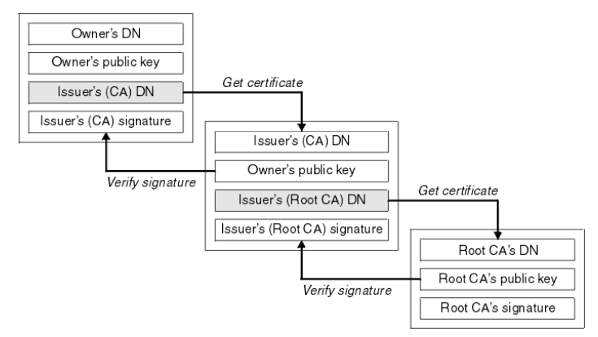

## 密钥交换协议

在实际应用系统中，需要使用公钥密码或其他方法确立一个适用于**对称密码的共享密钥**，即会话密钥，会话密钥仅用于一次会话，建立这种会话密钥的机制即为密钥交换协议。

在理想情况下，密钥交换协议除了实现密钥共享外，还需要满足以下安全需求：

- 只有A和B知道K，确保参与者知道自己将要通信的目标主体
- A和B确保对方知道K，参与者知道目标主题参与了当前通信，并对当前通信作出回应
- A和B知道K是新生成的，共享密钥只能使用较短时间，这是一个基本原则

密钥建立协议基本目标

- 隐式密钥认证：协议参与方要确信只有身份确定的协议参与另一方才能知道共享密钥
- 密钥确认：协议参与一方要确认另一方已经拥有了共享的密钥
- 显示密钥认证：同时提供隐式密钥认证和密钥确认性

建立新的会话密钥的三种可能的方式：

- 两个参与者之间已经共享了某个密钥
- 离线服务器的使用，指参与者之间使用公钥加密体制进行通信
- 在线服务器的使用，每个参与者与服务器共享一个密钥，通过服务器转发通信内容

密钥建立协议分类：

- 密钥传输协议：由一个主体生成密钥并传输给其他主体
- 密钥协商协议：会话密钥是所有在协议中使用的输入的函数
- 混合协议：密钥由一部分参与者协商产生并分配

### Diffie-Hellman协议

通常情况下，使用这种方法生成的密钥不会直接用作会话密钥，而是会经过一个哈希计算后获得的输出作为会话密钥

#### 被动攻击

由于指数是保密的，若想获得共享密钥的两个指数，需要求解**离散对数问题DL**

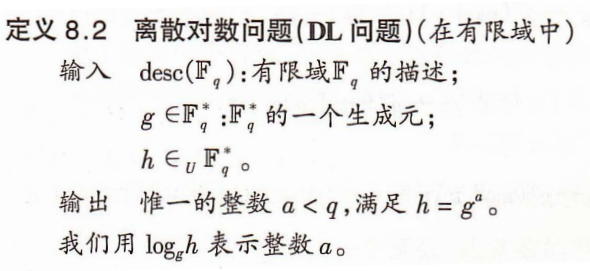

因为攻击者可截获ga和gb，若需要计算k，意味着需要求解**CDH问题**

若仅想获得密钥的部分信息，比如奇偶性，需要求解**DDH问题**

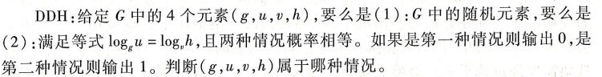

从假设强度来看，DL>CDH>DDH，能解决DL定可解决CDH，能解决CDH定可解决DDH，反过来则不能

#### 中间人攻击

由于DH密钥交换协议不具有**认证**功能，攻击者可能截取并替换交互信息，完成DH交换，以此对A假冒B，对B假冒A。

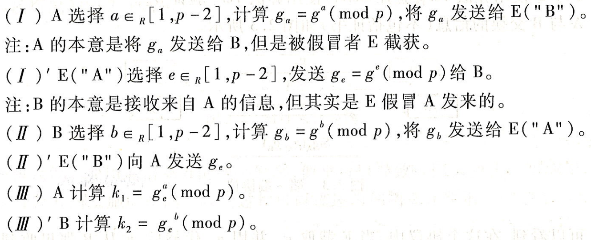

此后，A持有密钥k1，B持有密钥k2，E同时持有两个密钥，这样E作为中间人可以自由阅读或转发通信内容，甚至假冒一方对另一方通信。

#### 端到端协议

使用协议参与者的数字签名保证消息来源的真实性

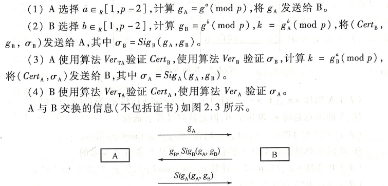

其中约定如下

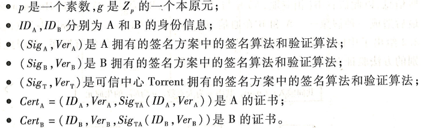

在这一协议中，E无法产生A和B的有效签名，无法进行中间人攻击冒充两方

### 基于自证明公钥的密钥交换

用户从可信中心获得一个**自证明公钥**，不需要公钥证书，其身份与公钥值隐式相互认证。结合了RSA和离散对数的特点

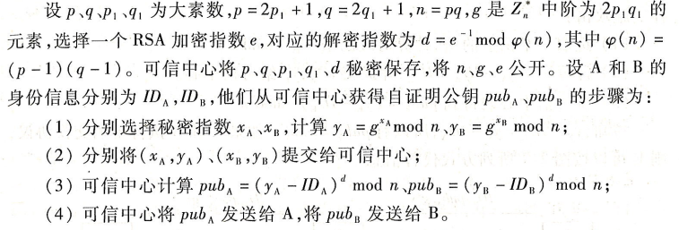

如果可信中心在为A或B计算pubA、pubB时没有要求提交秘密指数xA、xB，则该密钥交换协议是不安全的，攻击者E可实施如下攻击

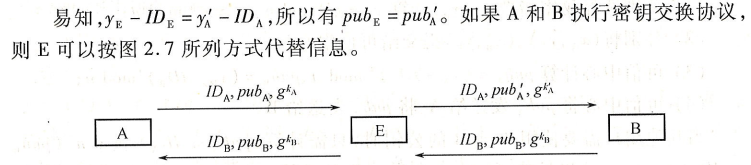

### 基于身份的密钥交换

用户的公开身份信息就是其公钥，私钥由系统的**私钥生成器TA**生成，绝大部分基于身份的密码方案是采用双线性对技术设计的

#### 双线性映射

设q为一大素数，点P为q阶加法群G1的生成元，G2为同阶的乘法循环群。

#### 基于身份的非交互密钥分配

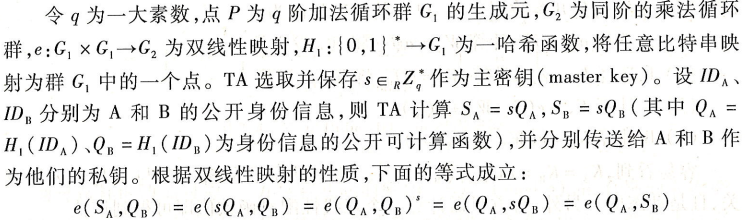

这种方法存在两个局限性

- 通信双方得到的共享密钥是**静止**的，但许多应用的每次会话需要新鲜的会话密钥
- 通信双方必须在系统注册并得到自己的私钥才能通信

#### 基于身份的两方密钥交换

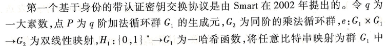

### 三方密钥交换

#### 三方Diffie-Hellman密钥交换

假设A、B、C要协商产生一个共享密钥，首先约定大素数p和生成元g，可在用户组内公用，密钥协商过程如下：

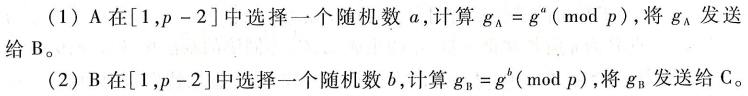

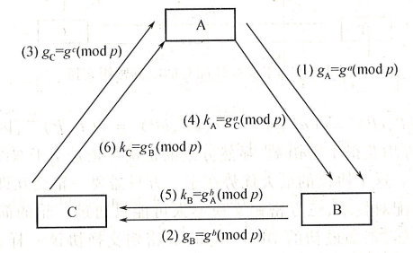

没认证机制，易受中间人攻击

#### 基于双线性配对的密钥交换

假设公开参数G1、G2、q、P、e如之前所设，

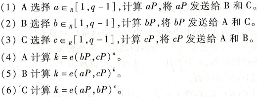

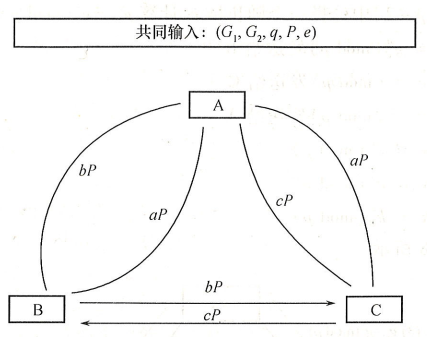

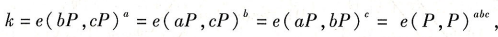

三方只需要一轮交互即可实现密钥共享，同样没有认证机制

### 多方密钥交换协议

#### 多方Diffie-Hellman密钥交换

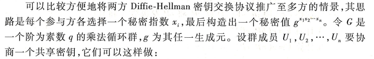

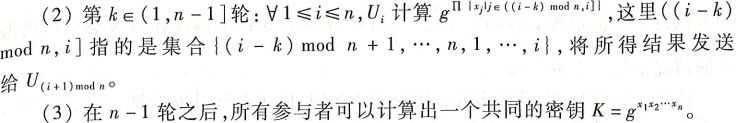

以四方DH交换协议为例

效率较低，每个参与者需要发送n-1个消息，计算n个模指数

#### Burmester-Desmedt多方密钥交换（BD）

每个参与者需要经过两轮交互，发送2个消息，最多执行3个模指数运算和O(n2)的乘法运算。

在只考虑被动攻击的情况下是安全的

#### 协议的动态性

在动态群体中，当成员关系有变化时必须确保会话密钥得到更新，更新需要满足两个条件

- 离开了的成员无法获取之后的会话密钥
- 新加入的成员无法获得之前的会话密钥

## 实体认证协议

认证至少涉及两个通信实体，

- 如果是验证消息的声称属性，则是**数据源认证**（消息认证）
- 如果是认证原告声称的身份，则是**实体认证**

实体认证是指一个协议，可以使实体A和B建立一种真实通信，使B能验证A就是他要与之通信的实体

实体认证和身份识别的关系：

- 身份识别的身份信息是公开的；实体认证双方可能用到共享秘密信息
- 身份识别可以考虑内部攻击；实体认证一般不考虑内部攻击，即参与者不诚实
- 身份识别成功后，B可以相信A的身份，B在事后无法假冒A；实体认证成功后，A能证明自己是A，其他人无法假冒A

### 基于对称密码的实体认证

#### 一次传输单向认证

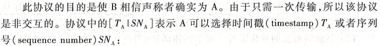

- 若使用时间戳，则B在解密后需要与本地时间比较，若时间间隔足够小则说明是新近产生的，要求通信双方需同步时钟
- 若使用序列号，A、B需要维护同步的序列号，以一种B知道的方式增加。同样需要同步和维护序列号

#### 二次传输单向认证

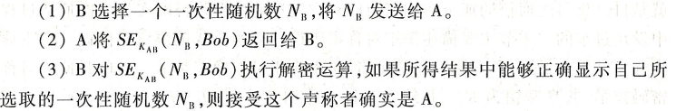

该协议是典型的询问-应答机制，B是**发起者**，A是**响应者**

如果询问应答时间间隔是可以接收的，则B可以相信本次通信的真实性

#### 二次传输双向认证

要求协议双方互相认证

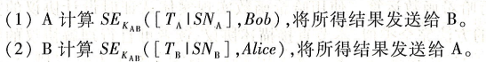

#### 三次传输双向认证

使用随机数，至少需要三次消息传输

###  基于哈希函数的实体认证

#### 一次传输单向认证

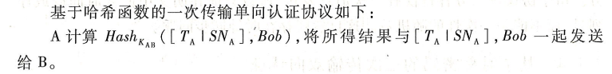

B收到A发来的数据后，B还需要自己计算一次Hash值，若与A发来的相同，则认为实体认证有效

#### 二次传输单向认证

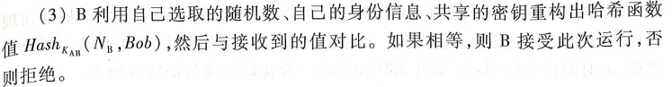

#### 二次传输双向认证

#### 三次传输双向认证

### 基于公钥密码的实体认证

#### 一次传输单向认证

需要在签名消息中加入判断性数据，比如时间戳或者序列号

#### 二次传输单向认证

为防止B利用认证过程欺骗A，需要A对签名内容中的随机数有一定控制权

此处NA防止了A对B事先选好的信息进行签名

#### 二次传输双向认证

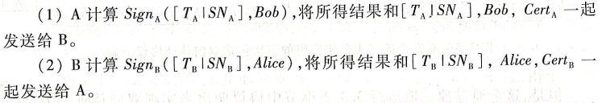

#### 三次传输双向认证

首先介绍一种不安全的协议

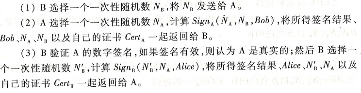

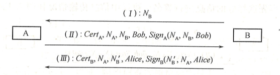

可以看到，这实际上是二次传输单向认证协议的两次运行

**攻击形式**：假设网络中除了A、B外存在主体E，E冒充B向A发起询问，得到A的应答后，又冒充A向B发起询问，利用B的应答，E可以使A以为E就是B

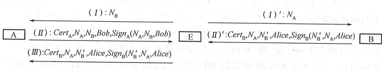

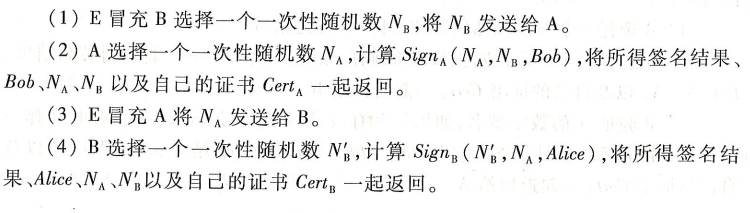

通过这一攻击，A认为是B发起了这次运行，并接受了B的身份，但B以为是A发起了这次运行，还在等待A的返回结果以结束运行。原因是独立运行了两次单向认证协议，解决方法是使得两次单向认证协议的调用不再独立

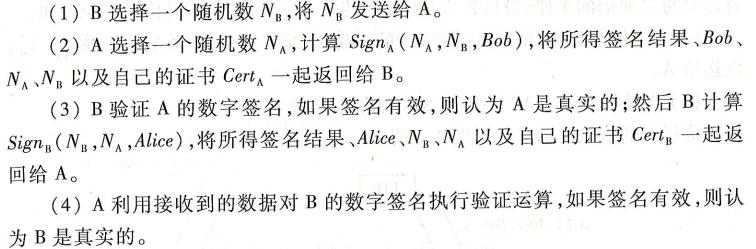

这是一个安全的协议，区别在于B不再产生新的随机数，A需要将接受到的随机数NB保存起来

### 基于口令的实体认证

用户和计算机共享某个口令，口令相当于一个长期使用又相对较短的对称密码。

#### 直接的基于口令的认证协议

主机H，用户U，主机在初始化用户后，会建立一个保存所有用户口令的文档，每次登陆都要做如下验证

该协议没有实现任何实体认证功能，且由于口令是明文传输，窃听者可以获得

#### 使用单向函数

主机H存储口令的**单向函数值**，比如哈希函数值，而非存储口令

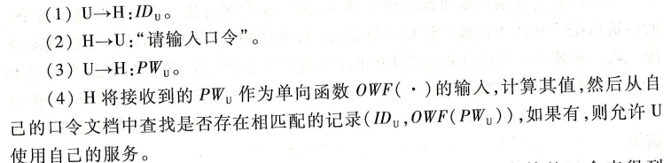

攻击者复发窃取主机存储的口令表得到有效的记录，但仍可以获得明文传输的口令

#### 使用单向函数和加盐

引入随机数salt

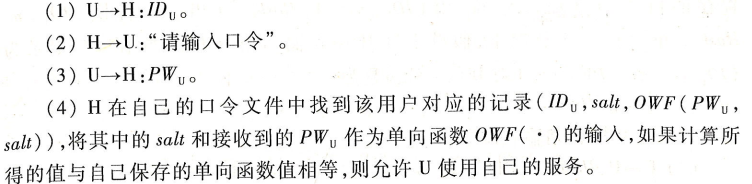

如果salt取值范围足够大，就可以消除对常用口令采取的字典是攻击。

仍然无法防止口令窃听攻击

#### 使用哈希链

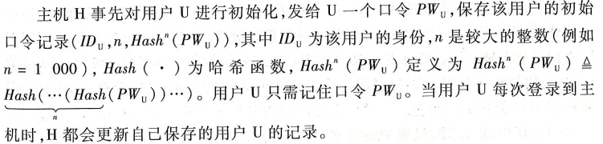

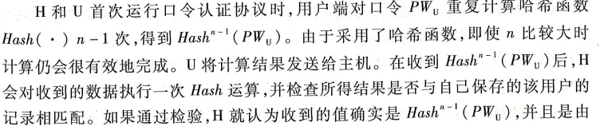

注意，c值会从n递减到1，保证窃听者无法从c次Hash值中获取对之后通信有用的信息，递减到1后，用户和主机需要重新初始化口令。

攻击者可发动如下中间人攻击

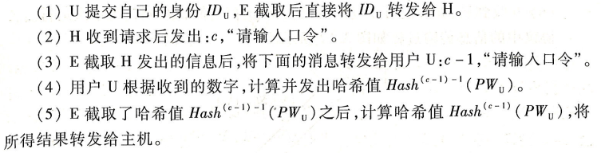

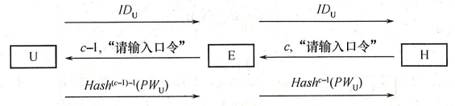

攻击者E通过修改信道中传输的计数器值，获得了c-2次的hash值，然后E可在下次会话时假冒U使用主机的服务，原因在于协议中没有提供U对H的认证机制。

#### 加密的密钥交换协议

既有实体认证功能，也提供密钥协商性质

该协议信息论安全，因为PWu与协议中所有传输的消息都是独立统计的，在前一部分对PWu执行了加盐操作，后一部分是传统的双向认证结构，可以用任意基于对称密钥的双向认证结构代替。

### 对实体认证协议的攻击

单个实体在网络中可能扮演任意角色，对于协议中的诚实主体，一般不会主动记录任何协议消息、不能理解任何接受到的密文，不能识别看似随机的数据

#### 消息重放攻击

攻击者预先记录了欲攻击协议先前某次运行中的消息，然后在该协议新的运行中重放所记录的消息。

#### 中间人攻击

攻击者处于通信双方中间，将某方提出的困难问题交给另一方回答，将收到的答案进行简单处理后返回，以达到攻击效果。可见哈希链口令认证机制的攻击。

#### 平行会话攻击

在攻击者E的操纵下，被攻击协议两个或多个并发执行，从某次运行中传输的消息得到其他运行所需要的应答，这里以Woo-Lam实体认证协议为例：

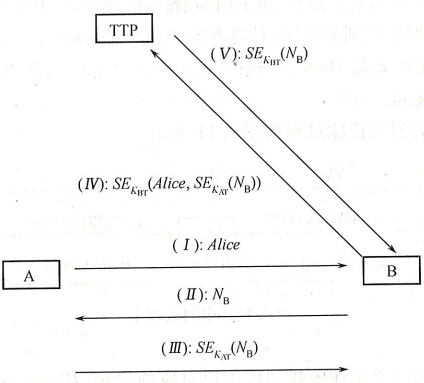

如果B愿意与多个实体同时会话的话，这个协议就是可攻击的

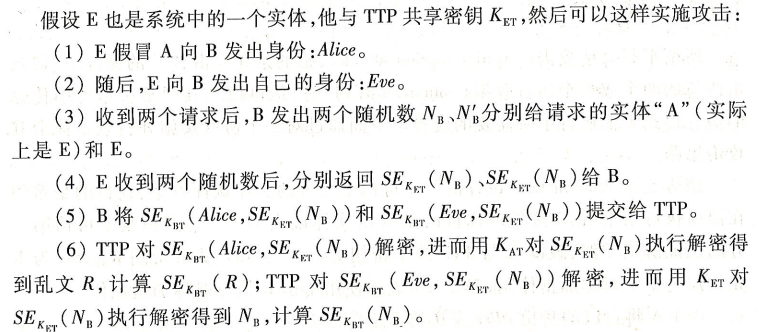

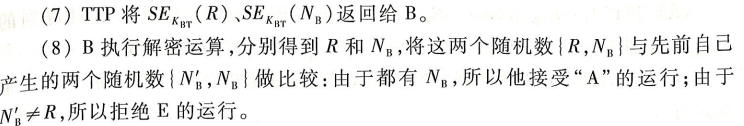

B只判断解密后的随机数与先前生成的随机数是否相等，这里有一个相等，所以B将接收其中一个认证，拒绝另一个，但实际上两个都是由E。

可对协议做如下修改

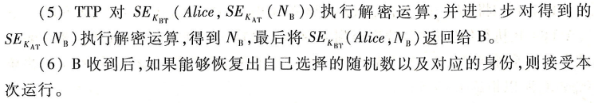

这样若使用平行会话攻击，会因身份和随机数的绑定被检测出来

#### 反射攻击

诚实实体A给另一方B发送消息，攻击者E截获该消息并将处理过后的消息返回给消息的产生者A，但A不会意识到消息是他自己产生的，以改进后的Woo-Lam协议为例，这里E同时冒充A和TTP

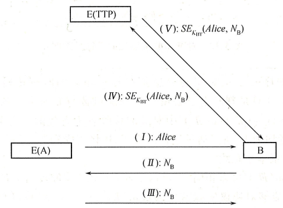

E分别冒充A和TTP执行了两次反射操作

#### 交错攻击

在E的操纵下，某个协议两次或多次按交错的方式执行。

可见前文对基于公钥密码体制的三次传输双向认证协议的攻击。

## 高级签名协议

### 盲签名

如果协议正确执行，持有消息m的用户User可以获得签名人Signer对消息m的数字签名s，但Signer不知道m的内容，即使之后公开（m,s）也无法追踪之前签名的过程

一个盲签名体制需要满足3个**算法**：

- Setup：输出系统参数和签名人公私钥对（pk,sk）
- Sign：用户秘密输入待签名消息m，签名人秘密输入自己的私钥sk，执行签名协议，在多项式时间内停止，输出签名s
- Verify：输入签名人公钥pk以及待验证消息签名对（m,s），验证签名有效性

需要满足三个**性质**：

- 正确性：消息签名对合法
- 不可伪造性：任意不知道签名人私钥的人无法构造合法的消息签名对
- 盲性：除了请求签名的用户外，任何人都无法将交互协议产生的会话消息与最终的盲签名正确匹配。

基本设计思路：

- 盲化：发送消息给签名人之前，用户先引入盲化因子，由消息m计算m'，发送m'给签名人
- 签名：签名人对m'签名得到s'，发回给用户
- 去盲：用户从s'中计算消息m的签名s

#### 基于RSA问题的盲签名

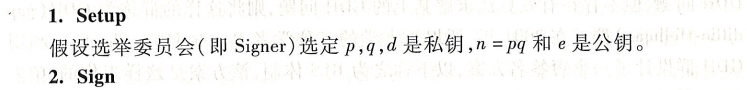

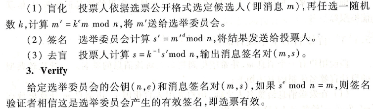

在盲签名过程中，投票人使用**随机数**对选票m进行了盲化操作，所以选举委员会不知道选票m的信息，在公布(m,s)后，选举委员会也无法找出(m,s)和(m',s')之间的关系

#### 基于离散对数的盲签名

若一个素数阶群上存在有效算法求解DDH问题，但无法求解CDH问题，称这样的群为GDH群，DDH和CDH已在前文中说明。

基于GDH群，设计了一个**短签名方案BLS**

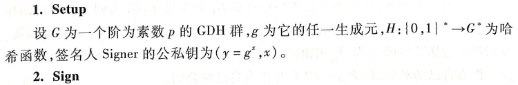

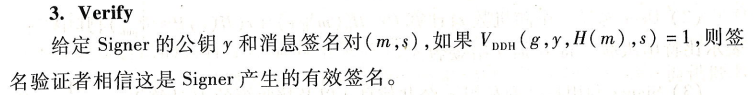

#### 部分盲签名

普通盲签名体制中，被签名的消息完全由用户控制，签名人对此一无所知，也不知道关于最终签名的任何信息，可能会导致签名被非法使用

部分盲签名体制中，签名人可在签名中嵌入一个和用户**事先约定好的公共信息**。可应用于电子现金方案。

以下为以双线性对设计的部分盲签名（应该不需要掌握，了解一下思路）

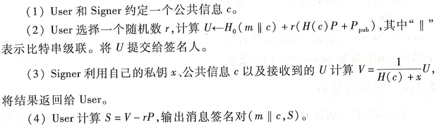

签名者无法从U和公共消息c得到关于m的任何消息

用户也无法将有效消息签名对(m||c,s)的公共消息c转换成对自己有利的数据

### 群签名

群体中的成员可代表整个群体进行匿名签名。

群签名方案中一般包含群管理员和群成员

- 群管理员：负责生成系统参数、群公钥、群私钥，为群成员产生签名私钥或群成员身份证书，在发生争端的情况下能从给定的群签名中识别出产生该签名的群成员
- 群成员：用自己掌握的签名私钥代表整个群执行签名操作

群签名算法组成：

- 系统初始化算法：产生群公钥、群成员公钥和私钥、群管理员用于打开签名的私钥
- 成员加入：新用户通过和群管理员的交互协议请求加入，协议执行结束后，新成员完成注册并获得一个秘密密钥
- 签名：用群成员的私钥和群成员资格证书对消息m进行签名
- 验证：验证消息m的签名是否为合法签名
- 打开：管理员使用消息、消息的签名、自己的私钥，揭示签名者真实身份

群签名方案安全性需求

- 正确性：合法的群成员产生的消息签名对一定能通过验证
- 不可伪造性
- **匿名性**：验证者只能确定签名由群体中的某个成员产生，但不能确定是哪个成员
- 无关联性：在不打开签名的情况下，确定两个不同的群签名是一个人签是不可能的
- **可追踪性**：在必要情况下，群管理者可以打开
- 防陷害性：包括群管理员在内的任何成员都不可以以其他群成员的名义产生合法群签名
- 抗联合攻击：任意多个群成员勾结或与群管理员勾结都不能伪造其他群成员签名

#### 简单群签名方案一

群有n个人，管理员为GM

- 系统初始化：GM为群众每个成员分发一张秘密密钥表，这些表互不相交，GM将各成员拥有的私钥汇总到一起，将这些私钥对应的公钥以随机次序排成一张表，并公开公钥表
- 签名：群成员每次从自己的私钥表中选择一个没用过的私钥进行签名
- 签名验证：验证者对每个公钥表中的公钥进行验证，若有一个通过，则为合法
- 打开：群管理者知道所有私钥和公钥间的关系，可以根据签名、公钥恢复签名人身份

该方案中所有群成员都是在**系统初始化时加入**的，不考虑动态加入问题，且每个私钥只能使用**一次**。

在该方案中，群管理者可以以任意群成员的身份产生有效群签名。

#### 简单群签名方案二

采取机制使得GM不知道群成员私钥

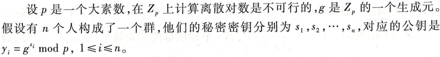

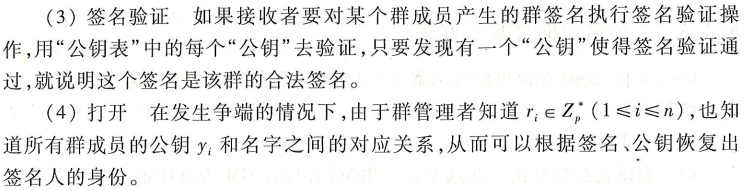

每个群成员签名私钥只有一个，即risi，且群管理者不再拥有该私钥。此外管理者可以定期更新发送给群成员的ri，使方案更灵活。

缺点是若有新成员加入，则需要改变所有群成员的密钥，否则可将旧的群成员和新的群成员区分（只改变ri？）

#### 短的群签名方案

之前的方法群公钥的长度是群成员个数的线性函数，且群成员使用当前私钥执行签名操作时所能签名的次数是固定的。

短的群签名方案基于**双线性对**，该方案中存在**两个群管理者**

- issuer：负责颁发群签名操作所需的私钥
- opener：负责打开群成员身份

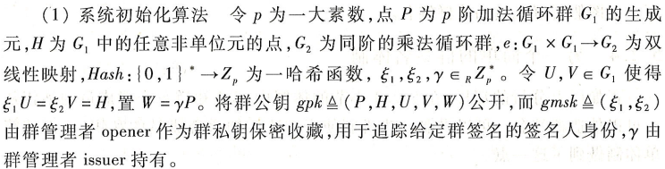

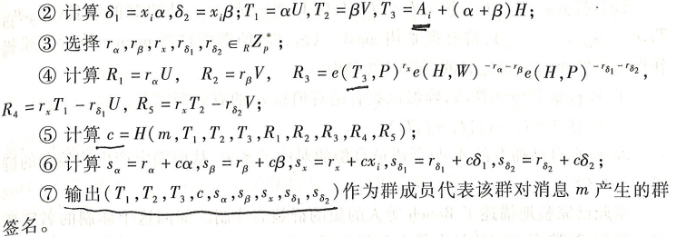

最大优点是每个群成员产生的群签名都是固定长度的，且与群成员个数无关，利用了椭圆曲线群上点的压缩技术。

并且方案中很多双线性函数量都可以预先计算出来，方便签名时直接调用。

#### 成员撤销

实用的群签名体制必须考虑群成员的动态流动问题，包括加入、离开、撤销。

撤销后，该群成员拥有的私钥和成员证书不可再用于产生有效群签名。111

常用成员撤销方法是群管理者发布一个**身份撤销列表**

每当撤销一个群成员，根据群公钥或群成员私钥是否发生变化，可将群签名方案分为**动态**群签名（无需变化）和**静态**群签名（需要变化）

### 环签名

假设环有n个人，签名人可用自己的私钥和其他n-1个人的公钥执行环签名操作产生签名(m,s)，验证者执行验证算法，若签名有效则可确信该签名由环中某人产生，但不可识别是哪个人产生。

- ring-sign环签名产生算法：输入待签名消息，环中所有成员公钥pki、真正签名人私钥ski，输出是Uk对消息m的环签名

  

- ring-verify环签名验证算法：输入是待验证的消息签名对、环签名中所有成员的公钥，输出为0或1

  

环签名的安全性需求（只要满足前三点就是安全的）：

- 正确性
- 不可伪造性：
- 匿名性：给定环签名，任意验证者无法确认该签名的真正签名人
- 可链接性：部分环签名的**特殊性质**，若某签名人产生了两个消息签名对，则存在有效算法确认这两个消息是环中同一签名人产生（但不知道是哪一个）

具有可链接性的环签名还有一个**签名链接算法link**，可判断签名是否由同一环成员生成

#### 不具有可链接性的环签名

基于双线性对

这是一个安全但不可链接的环签名体制

#### 具有可链接性的环签名

基于离散对数问题

若同一个环上两个有效环签名是同一个签名人产生的，则签名的**第一个元素**一定是相同的

### 基于身份的数字签名

将用户的**公开身份信息**或根据身份信息利用算法计算出的结果作为用户公钥，用户私钥由**密钥生成器PKG**生成并安全地发送给用户。

相对于传统的PKI技术，无需复杂的公钥证书与认证

基于身份的数字签名体制IBS通常包含四部分：IBS=（Setup，Extract，Sign，Verify）

