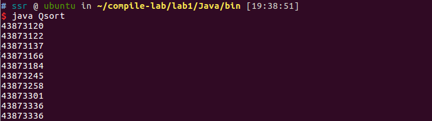
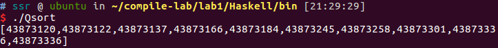
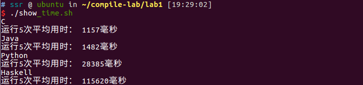

# Lab1  程序设计语言认知实验

姓名/学号：宋尚儒/1120180717

## 实验目的

了解程序设计语言的发展历史，了解不同程序设计语言的各自特点；感受编译执行和解释执行两种不同的执行方式，初步体验语言对编译器设计的影响，为后续编译程序的设计和开发奠定良好的基础。  

## 实验内容

给定一个特定的功能，分别使用 C/C++、 Java、 Python 和 Haskell 实现该功能，对采用这几种语言实现的编程效率，程序的规模，程序的运行效率进行对比分析。例如分别使用上述几种语言实现一个简单的矩阵乘法程序，输入两个矩阵，输出一个矩阵，并分析相应的执行效果。  

## 实验过程

### 实验环境

虚拟机：

- 操作系统：VMware Linux ubuntu 4.15.0-136-generic
- 处理器数量：2
- 每个处理器内核数量：2
- 物理内存：4GB

宿主机：

- 操作系统：Windows 10 家庭版 20H2
- 处理器核数：8
- 处理器主频：2.30GHz
- 处理器缓存
  - L1：256KB
  - L2：1.0MB
  - L3：8.0MB
- 物理内存：16GB

### 实验步骤

本次实验需要使用 C/C++、 Java、 Python 和 Haskell实现快速排序功能，在设想中，由四种语言编写的程序均有以下执行步骤，由于数据量较大，故不将排序后的全部数据输出

- 从文件中读取数据
- 对数据进行快速排序
- 输出展示特定部分排序结果

生成数据文件的程序由C++编写，源码如下所示，会生成数据量为500w的文件`in.txt`

```c++
#include <bits/stdc++.h>
using namespace std;

int cnt=5e6;
int limit=1e8;

int main()
{
       freopen("in.txt","w",stdout);
       for(int i=0;i<cnt;i++)
        cout<<(rand()*rand())%limit<<endl;
       return 0;
}
```

接下来展示各语言实现快速排序算法的源码细节

#### 各语言实现代码与环境

##### C/C++

编译器：gcc version 5.4.0 20160609

编译命令：`gcc -O2 Qsort.c -o Qsort`

```c
#include <stdio.h>
#include <stdlib.h>
#include <time.h>
#define MAXN 5000005

char rpath[] = "../../data/in.txt";
int arr[MAXN];


int get_arr(FILE *fp, int arr[])
{
    int id=0;
    fseek(fp, 0, 0);
    while(fscanf(fp,"%d",&arr[id])!=EOF)
        id++;
    return id;
}


int Partition(int a[], int low, int high)
{
    int key = a[low];
    while(low<high)
    {
        while(low<high && a[high] >= key) --high;
        a[low] = a[high];
        while(low<high && a[low] <= key) ++low;
        a[high] = a[low];
    }
    a[low] = key;
    return low;
}
void Qsort(int a[], int low, int high)
{
    if(low < high)
    {
        int loc = Partition(a, low, high);
        Qsort(a, low, loc-1);
        Qsort(a, loc+1, high);
    }
}

int main()
{
    FILE *fp;
    fp = fopen(rpath, "r");
    int len=get_arr(fp,arr);
    fclose(fp);
    Qsort(arr,0,len-1);
    for(int i=len/2;i<len/2+10;i++)
        printf("%d\n",arr[i]);
}
```

#### Java

java： openjdk version "1.8.0_282"

编译命令：`javac Qsort.java`

```java
import java.io.File;
import java.io.FileReader;
import java.io.BufferedReader;
public class Qsort {
	public static void main(String[] args) throws Exception
	{
		String rpath = "../../data/in.txt";
		File fp = new File(rpath);
		int[] arr=new int[5000005];
		int len=get_arr(fp,arr);
		Qsort(arr,0,len-1);
        for(int i=len/2;i<len/2+10;i++)
            System.out.println( arr[i] + " ");
	}

	private static int get_arr(File file,int[] arr) throws Exception {
		int id=0;
		BufferedReader br= new BufferedReader(new FileReader(file));
		String line=null;
		while((line=br.readLine())!=null)
		{
			arr[id]=Integer.parseInt(line);
			id+=1;
		}
		if(br!= null){
			br.close();
			br = null;
		}
		return id;
	}
	private static int Partition(int[] a, int low, int high)
	{
	    int key = a[low];
	    while(low<high)
	    {
	        while(low<high && a[high] >= key) --high;
	        a[low] = a[high];
	        while(low<high && a[low] <= key) ++low;
	        a[high] = a[low];
	    }
	    a[low] = key;
	    return low;
	}

	public static void Qsort(int[] a, int low, int high)
	{
	    if(low < high)
	    {
	        int loc = Partition(a, low, high);
	        Qsort(a, low, loc-1);
	        Qsort(a, loc+1, high);
	    }
	}
}
```

##### Python

python： Python 3.5.2

```python
def get_arr(arr,fp):
    line=fp.readline()
    while line:
        arr.append(int(line))
        line=fp.readline()

def Partition(a,low,high):
    key=a[low]
    while low<high:
        while (low<high and a[high]>=key):
            high-=1
        a[low]=a[high]
        while (low<high and a[low]<=key):
            low+=1
        a[high]=a[low]
    a[low]=key
    return low

def Qsort(a,low,high):
    if(low<high):
        loc=Partition(a,low,high)
        Qsort(a,low,loc-1)
        Qsort(a,loc+1,high)

if __name__ == "__main__":
    rpath = "../../data/in.txt"
   
    fp = open(rpath)
    arr=[]
    get_arr(arr,fp)
    fp.close()
    Len=len(arr)
    Qsort(arr,0,Len-1)
    for i in range(Len/2,Len/2+10):
        print(arr[i])
```

##### Haskell

GHCi： version 7.10.3

```haskell
import Prelude

get_Strs :: String ->[String]
get_Strs str =  case dropWhile (== '\n') str of
    "" -> []
    s' -> w : get_Strs s''
        where (w, s'') = break (== '\n') s'

toInt :: [String] -> [Int]
toInt lis = [read x :: Int | x <- lis]

qsort :: Ord a => [a] -> [a]
qsort [] = []
qsort (x:xs) =
    let smallPart = qsort [a | a <- xs, a <= x]
        bigPart = qsort [a | a <- xs, a > x]
    in smallPart ++ [x] ++ bigPart

main = do
    let rpath = "../../data/in.txt"
    file <- readFile rpath
    let arr = toInt (get_Strs file)
    let len = length arr :: Int
    let len1 = div len 2
    let arr1 = qsort arr
    let arr2 = drop len1 arr1
    let arr3 = take 10 arr2
    print arr3
```

#### 运行效果

##### C


##### Java



##### Python


##### Haskell

解释执行


编译执行



#### 性能测试

采用linux自带的`date`命令记录程序运行的起止时间，并编写脚本计算各语言程序运行5次后的平均运行时间，以下为脚本，为方便显示时间结果，使用`> /dev/null 2>&1`略去每次运行程序的输出

```bash
#!/bin/bash

function get_average_time()
{
    start=$(date +%s%N)
    for i in {1..5}
    do
        eval $1 > /dev/null 2>&1
    done
    end=$(date +%s%N)
    echo 运行5次平均用时： $((($end - $start) /5000000 ))毫秒
}

echo C
cd ./C/bin
get_average_time './Qsort'
cd ../../

echo Java
cd ./Java/bin
get_average_time 'java Qsort'
cd ../../

echo Python
cd ./Python/src
get_average_time 'python3 Qsort.py'
cd ../../

echo Haskell
cd ./Haskell/src
get_average_time 'runghc Qsort.hs'
cd ../../
```

注意性能测试中Haskell采取解释运行的方式

该脚本在本次实验中命名为`show_time.sh`，运行时的文件结构参考如下

```bash
$ tree
.
├── C
│   ├── bin
│   │   └── Qsort
│   └── src
│       └── Qsort.c
├── data
│   ├── DataGenerate.cpp
│   └── in.txt
├── Doc
│   └── Lab1程序设计语言认知实验.md
├── Haskell
│   ├── bin
│   │   └── Qsort
│   └── src
│       └── Qsort.hs
├── Java
│   ├── bin
│   │   └── Qsort.class
│   └── src
│       └── Qsort.java
├── Python
│   └── src
│       └── Qsort.py
└── show_time.sh

```

以下为运行结果截图



### 实验分析

#### 语言易用性分析

语言易用性主观性较大，笔者是学习C语言入门的，Java和Python在此前都有使用，Haskell在此前几乎没有接触

从学习难度来看

- C语言作为结构式的语言非常灵活，入门所需学习内容较少，虽然完全掌握又需要更多的编程经验
- Java在学习了C语言后对于语法的掌握变得非常容易，引入了面向对象机制，学习难度也不算太高
- Python入门简单，语法简洁，丰富的类库提供了使用上的便捷，但在细节操作上笔者的体验不如C好，这也有笔者使用不习惯的缘故
- Haskell语言作为函数式编程语言笔者在之前几乎没有涉及，且与之前所学的语言风格迥异，在学习语法和各类函数上花了相当的功夫

从此次代码的编码效率来看

- C语言首先编写，由于是实现之前编写过的功能，所以基本没有花费太大精力，只是调整了一下文件输入的接口，花费时间较中等
- Java语言在算法实现细节的语法上基本可以直接移植C的源码，学习文件读取的API花费了一定时间，总体来说花费时间较短
- Python语法相当简单，各类调用相比前两者来说更是非常容易，在C的代码基础上简单修改语法即可完成，花费时间较短
- Haskell编写对于笔者可是相当麻烦，不管是文件读入的格式还是算法的实现方法，以及最后选择数组特定起止位置输出都要从头开始学，反复查询各类调用的使用方式，花费时间较长

#### 程序规模分析

从代码行数来看

- C：50行
- Java：55行
- Python：36行
- Haskell：29行

由此可见，Python和Haskell作为解释型语言在程序规模上明显小于C和Java，实际上因为对Haskell的使用还不是非常熟练，程序规模应该可以进一步减小

#### 程序运行性能对比分析

首先明确本实验实现的是一个存在文件读写的程序，数据量为5*10^6

读取文件的时间复杂度为O(n)

数据处理的时间复杂度为O(n log(n))

从之前的实验中过程中，运行结果如下所示

| 语言    | 平均运行时间（ms） |
| ------- | ------------------ |
| C       | 1157               |
| Java    | 1482               |
| Python  | 28385              |
| Haskell | 115620             |

可以看到C和Java作为编译型语言性能明显优于解释型语言的Python和Haskell

在此说明几个性能测试实验过程中引人注意的地方

- C语言在编译时如果不采用O2优化，在本实验中性能会有相当程度的下降，运行速度大致会降到原来一半
- C语言相比Java没有明显的性能提升，推测是文件读取方式存在差异或者对文件读取性能的优化上C表现得不如Java
- Haskell解释运行时间远超笔者想象，除了笔者自身代码处理可能不佳之外，对文件的处理可能是非常重要的影响因素
- Haskell如果采取编译运行的方式，其运行效率会大幅上升，在本次实验中大致为原来的5倍
- Haskell在解释执行过程中占用了巨量的内存（在本次实验中需要大于等于4G的内存环境），推测在内存充裕的环境下执行效率会大幅增加

## 实验心得体会

本次实验使用了4种语言实现快速排序功能,初步体验了各类语言的编程方式与效率，以及语言对程序性能的影响，受限于时间等因素不能进一步展开探索非常遗憾。后续可以改进各语言代码，单独分析比较在没有文件读取的情况下各语言对数据处理的效率，或许能进一步了解各语言特性

