# Lab2  编译器认知实验  

姓名/学号：宋尚儒/1120180717

## 实验目的

本实验的目的是了解工业界常用的编译器 GCC 和 LLVM，熟悉编译器的安装和使用过程，观察编译器工作过程中生成的中间文件的格式和内容， 了解编译器的优化效果， 为编译器的学习和构造奠定基础。  

## 实验内容

本实验主要的内容为在 Linux 平台上安装和运行工业界常用的编译器 GCC 和LLVM，如果系统中没有安装，则需要首先安装编译器， 安装完成后编写简单的测试程序，使用编译器编译，并观察中间输出结果。  

## 实验过程

### 实验环境

虚拟机：

- 操作系统：VMware Linux ubuntu 4.15.0-136-generic
- 处理器数量：2
- 每个处理器内核数量：2
- 物理内存：4GB

宿主机：

- 操作系统：Windows 10 家庭版 20H2
- 处理器核数：8
- 处理器主频：2.30GHz
- 处理器缓存
  - L1：256KB
  - L2：1.0MB
  - L3：8.0MB
- 物理内存：16GB

### 实验过程与分析

#### 编写测试程序

共编写两个测试程序，分别是`main.c`、`Qsort.c`，代码结构参考如下

`main.c`

```c
#include <stdio.h>
#include <stdlib.h>
#define MAXN 5000005

char rpath[] = "../data/in.txt";
int arr[MAXN];

extern void Qsort(int a[], int low, int high);

int get_arr(FILE *fp, int arr[])
{
    int id=0;
    fseek(fp, 0, 0);
    while(fscanf(fp,"%d",&arr[id])!=EOF)
        id++;
    return id;
}

int main()
{
    FILE *fp;
    fp = fopen(rpath, "r");
    int len=get_arr(fp,arr);
    fclose(fp);
    Qsort(arr,0,len-1);
    for(int i=len/2;i<len/2+10;i++)
        printf("%d\n",arr[i]);
}
```

`Qsort.c`

```c
int Partition(int a[], int low, int high)
{
    int key = a[low];
    while(low<high)
    {
        while(low<high && a[high] >= key) --high;
        a[low] = a[high];
        while(low<high && a[low] <= key) ++low;
        a[high] = a[low];
    }
    a[low] = key;
    return low;
}
void Qsort(int a[], int low, int high)
{
    if(low < high)
    {
        int loc = Partition(a, low, high);
        Qsort(a, low, loc-1);
        Qsort(a, loc+1, high);
    }
}
```

使用的数据文件`in.txt`由如下C语言程序生成

```c
#include <bits/stdc++.h>
using namespace std;

int cnt=5e6;
int limit=1e8;

int main()
{
       freopen("in.txt","w",stdout);
       for(int i=0;i<cnt;i++)
        cout<<(rand()*rand())%limit<<endl;
       return 0;
}
```

#### GCC

- 查看编译器版本

  

  可知版本为gcc 5.4.0

- 使用编译器编译单个文件  

  

- 使用编译器编译链接多个文件  

  

  生成`main`文件为可执行文件，执行结果如下

  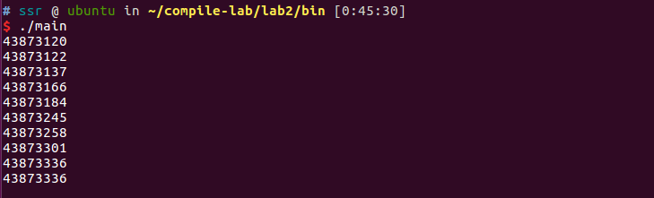

- 查看预处理结果

  

  生成`Qsort.i`和`main.i`文件

  其中`Qsort.i`文件参考如下，因为没有引入库，所以结构相对简单，仅包含自定义的函数和通用的头

  

  `main.i`复杂了很多，行数达到了1941，原因在于引入了两个库文件的函数定义，占用了较多字节，两库函数对应部分的结构可以参考如下，因为较长就不做全部展示

  

  

  

  末尾结构可参考如下，可见主函数基本没有变换，而自定义函数中因为使用了宏EOF被做出修改

  

- 查看语法分析树  

  如下图所示会产生大量中间文件，以`Qsort.c`对应的两个重要文件`Qsort.c.001t.tu`和`Qsort.c.004t.gimple`为例进行分析

  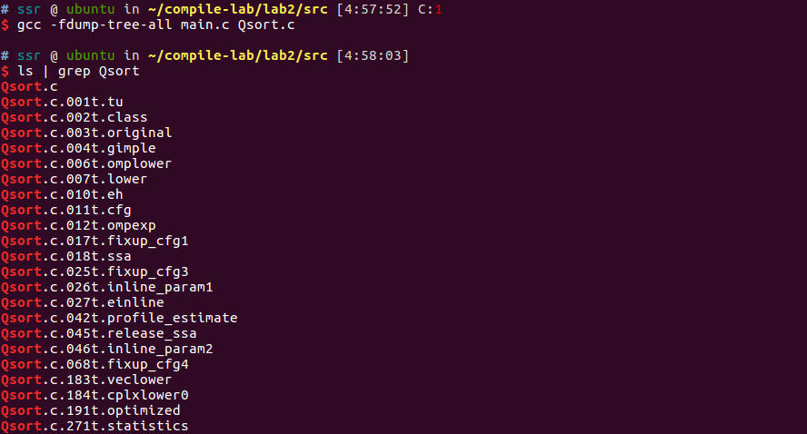

  以下两图为在符号表文件`Qsort.c.001t.tu`中找到的源码中两函数原型对应的标识节点的结构

  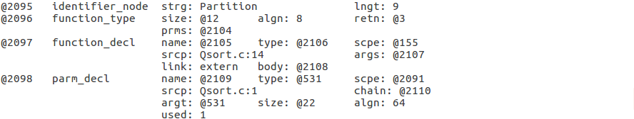

  

  以下两图为在控制流图文件`Qsort.c.004t.gimple`的内容，可以看到其与C源码在较多部分比较相似，不同之处有如下

  - 较多的形式为`D.x`的局部变量替代了C源码中的部分语法
  - 使用`goto`和`if/else`替换了原来的循环和选择结构

  ```c
  Partition (int * a, int low, int high)
  {
    long unsigned int D.1852;
    long unsigned int D.1853;
    int * D.1854;
    long unsigned int D.1856;
    long unsigned int D.1857;
    int * D.1858;
    int D.1859;
    long unsigned int D.1860;
    long unsigned int D.1861;
    int * D.1862;
    long unsigned int D.1863;
    long unsigned int D.1864;
    int * D.1865;
    int D.1866;
    long unsigned int D.1868;
    long unsigned int D.1869;
    int * D.1870;
    int D.1871;
    long unsigned int D.1872;
    long unsigned int D.1873;
    int * D.1874;
    long unsigned int D.1875;
    long unsigned int D.1876;
    int * D.1877;
    int D.1878;
    long unsigned int D.1879;
    long unsigned int D.1880;
    int * D.1881;
    int D.1882;
    int key;
  
    D.1852 = (long unsigned int) low;
    D.1853 = D.1852 * 4;
    D.1854 = a + D.1853;
    key = *D.1854;
    goto <D.1843>;
    <D.1842>:
    goto <D.1837>;
    <D.1836>:
    high = high + -1;
    <D.1837>:
    if (low < high) goto <D.1855>; else goto <D.1838>;
    <D.1855>:
    D.1856 = (long unsigned int) high;
    D.1857 = D.1856 * 4;
    D.1858 = a + D.1857;
    D.1859 = *D.1858;
    if (D.1859 >= key) goto <D.1836>; else goto <D.1838>;
    <D.1838>:
    D.1860 = (long unsigned int) low;
    D.1861 = D.1860 * 4;
    D.1862 = a + D.1861;
    D.1863 = (long unsigned int) high;
    D.1864 = D.1863 * 4;
    D.1865 = a + D.1864;
    D.1866 = *D.1865;
    *D.1862 = D.1866;
    goto <D.1840>;
    <D.1839>:
    low = low + 1;
    <D.1840>:
    if (low < high) goto <D.1867>; else goto <D.1841>;
    <D.1867>:
    D.1868 = (long unsigned int) low;
    D.1869 = D.1868 * 4;
    D.1870 = a + D.1869;
    D.1871 = *D.1870;
    if (D.1871 <= key) goto <D.1839>; else goto <D.1841>;
    <D.1841>:
    D.1872 = (long unsigned int) high;
    D.1873 = D.1872 * 4;
    D.1874 = a + D.1873;
    D.1875 = (long unsigned int) low;
    D.1876 = D.1875 * 4;
    D.1877 = a + D.1876;
    D.1878 = *D.1877;
    *D.1874 = D.1878;
    <D.1843>:
    if (low < high) goto <D.1842>; else goto <D.1844>;
    <D.1844>:
    D.1879 = (long unsigned int) low;
    D.1880 = D.1879 * 4;
    D.1881 = a + D.1880;
    *D.1881 = key;
    D.1882 = low;
    return D.1882;
  }
  
  
  Qsort (int * a, int low, int high)
  {
    int D.1886;
    int D.1887;
  
    if (low < high) goto <D.1884>; else goto <D.1885>;
    <D.1884>:
    {
      int loc;
  
      loc = Partition (a, low, high);
      D.1886 = loc + -1;
      Qsort (a, low, D.1886);
      D.1887 = loc + 1;
      Qsort (a, D.1887, high);
    }
    <D.1885>:
  }
  ```

- 查看中间代码生成结果  

  如下图所示会产生大量中间文件，以`Qsort.c`对应的文件`Qsort.c.192r.expand`和`Qsort.c.270r.dfinish`为例

  

  以下两图为在文件`Qsort.c.192r.expand`中找到的源码中两函数原型对应的结构的头部，该文件是从GIMPLE转向RTL的第一步

  Partition

  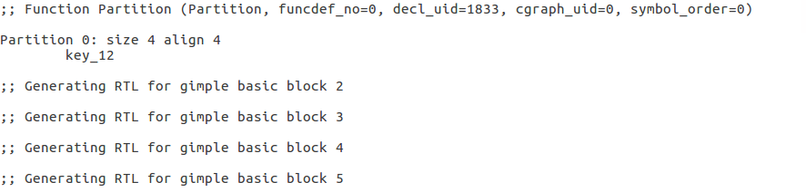

  Qsort

  

  以下两图为在文件`Qsort.c.270r.dfinish`中找到的源码中两函数原型对应的结构的头部，该文件是多遍优化的结果之一

  Partition

  

  Qsort

  

- 查看生成的目标代码  

  以文件`Qsort.c`为例，输入` gcc -S ./src/Qsort.c -o Qsort.s `，生成文件`Qsort.s`,内容较长，仅展示部分

  下图展示`Qsort.c`中第一个函数Partition对应的汇编代码的头部结构和部分汇编语言

  

  下图展示`Qsort.c`中第二个函数Qsort对应的汇编代码的头部结构和部分汇编语言，可以看出其调用函数Partition

  

#### LLVM

- 查看编译器的版本  

  

- 使用编译器编译单个文件  

  

- 使用编译器编译链接多个文件  

  

  生成可执行文件main，执行结果如下

  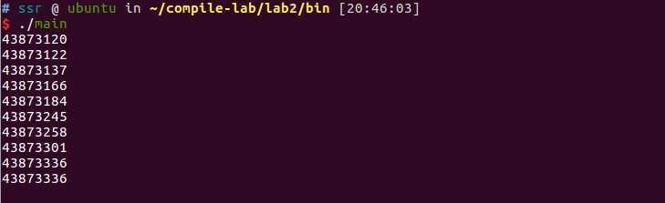

- 查看编译流程和阶段  

  

  - 0：输入文件，找到源文件
  - 1：预处理
  - 2：编译器前端生成IR中间代码
  - 3：编译器后端生成汇编代码
  - 4：将汇编文件变为对象文件

- 查看词法分析结果  

  以文件`Qsort.c`为例，输入`clang ./src/Qsort.c  -Xclang -dump-tokens`，输出较长，仅展示部分结果

  下图展示编译器识别出`Qsort.c`中第一个函数Partition的函数头，其格式为`int Partition(int a[], int low, int high)`，正好与以下字段对应

  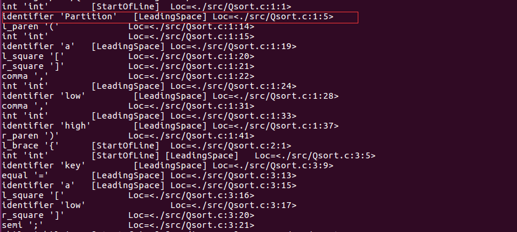

  下图展示编译器识别出`Qsort.c`中第二个函数Qsort的函数头，其格式为`void Qsort(int a[], int low, int high)`，正好与以下字段对应

  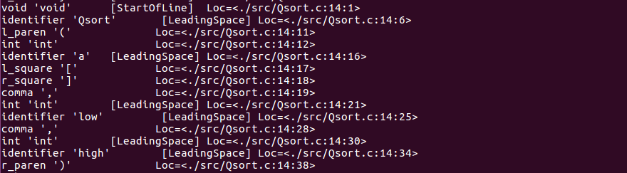

- 查看词法分析结果2 

  以文件`Qsort.c`为例，输入`clang ./src/Qsort.c  -Xclang -dump-raw-tokens`，输出较长，仅展示部分结果

  下图展示编译器识别出`Qsort.c`中第一个函数Partition的函数头，其形式类似于之前的结果，但需要注意的是其中如`int`这种类型声明字段没有被直接识别，以及空格没有进行处理

  

  Qsort函数头类似，不再重复说明

- 查看语法分析结果

  以文件`Qsort.c`为例，输入`clang ./src/Qsort.c -Xclang -ast-dump `，输出较长，仅展示部分结果

  下图为生成结果的树的头部结构

  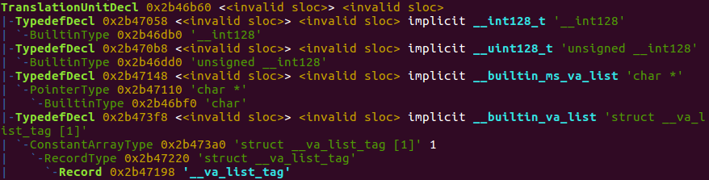

  下图展示经语法分析后产生的`Qsort.c`中第一个函数Partition对应的结构，可以看到其参数形式与源码相对应，函数中定义的局部变量key也在其中有对应形式

  

  下图展示经语法分析后产生的`Qsort.c`中第二个函数Qsort对应的结构，可以看到其参数形式与源码相对应

  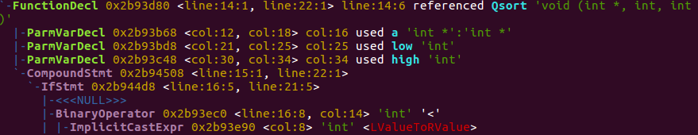

- 查看语法分析结果2

  以文件`Qsort.c`为例，输入`clang ./src/Qsort.c -Xclang -ast-view `

  会出现如下图所示报错

  

  需要使用debug版本的clang才可以正常运行，记录一下自己的编译过程，注意编译需要较大的存储空间和较长的编译时间，在ubuntu虚拟机中，编译过程总计耗时为10小时，占用空间约40G，此外还需要预留swap空间

  - 安装cmake，注意版本必须是3.13.4及以上

    ```bash
    wget https://cmake.org/files/v3.13/cmake-3.13.4-Linux-x86_64.tar.gz
    tar -xzvf cmake-3.13.4-Linux-x86_64.tar.gz
    
    sudo mv cmake-3.13.0-Linux-x86_64 /opt/cmake-3.13.0
    
    sudo ln -sf /opt/cmake-3.13.0/bin/*  /usr/bin/
    ```

  - 从[LLVM Download](https://releases.llvm.org/download.html#4.0.0)下载clang和llvm源码

    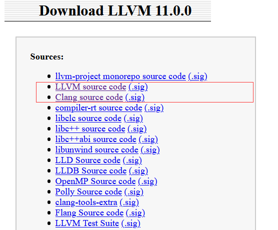

    解压缩，分别将目录重命名为clang和llvm，将clang目录移动到llvm/tools/目录下

  - 在llvm同级父目录下创建build目录，用于存放构建的中间产物和最终的可执行文件

  - 由于编译过程需要较大的内存，需要扩大swap分区（此处取约20G）以构建较大的虚拟内存结构，否则会编译会报错并停止

    ```bash
    sudo mkdir swapfile
    cd /swapfile
    sudo dd if=/dev/zero of=swap bs=1024 count=20000000
    sudo mkswap -f  swap
    sudo swapon swap
    ```

  - 进入build目录，执行

    `cmake ../llvm -DLLVM_TARGETS_TO_BUILD=X86 -DCMAKE_BUILD_TYPE=Debug`

  - 执行`make`即可开始编译，对于x核CPU，可以执行`make -jx`，该步骤需要较长时间

  - 执行`sudo make install`进行安装

  编译完成后重复执行命令，结果如下图所示，生成并打开了两个dot文件，分别对应两个函数

  

  下图为函数Partition对应的dot文件的语法树结构图

  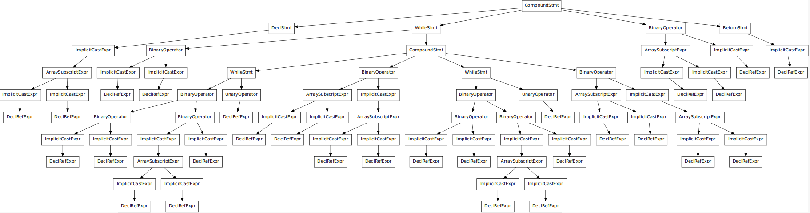

  下图为函数Qsort对应的dot文件的语法树结构图

  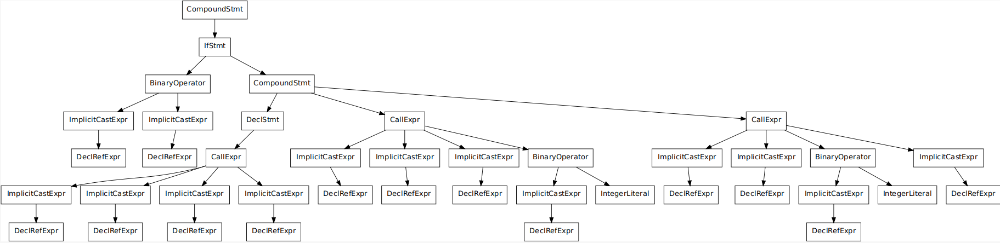

- 查看编译优化的结果  

  以文件`Qsort.c`为例，输入`clang ./src/Qsort.c -S -mllvm -print-after-all `

  输出非常长，这是因为经过了多次编译优化，只展示两个函数对应机器码的头部结构

  

  

- 查看生成的目标代码结果

  以文件`Qsort.c`为例，输入`clang ./src/Qsort.c -S `，生成文件`Qsort.s`,内容较长，仅展示部分

  下图展示`Qsort.c`中第一个函数Partition对应的汇编代码的头部结构和部分汇编语言

  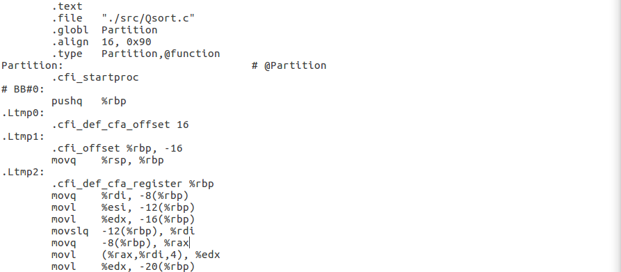

  下图展示`Qsort.c`中第二个函数Qsort对应的汇编代码的头部结构和部分汇编语言

  

  可以看出其与gcc编译生成的汇编代码在部分特征上的相似于不同

#### 各优化等级下编译程序运行效率测试

采用linux自带的`date`命令记录程序运行的起止时间，并编写脚本计算各语言程序运行10次后的平均运行时间，以下为脚本，为方便显示时间结果，使用`> /dev/null 2>&1`略去每次运行程序的输出

```bash
#!/bin/bash

function get_average_time()
{
    start=$(date +%s%N)
    for i in {1..5}
    do
        eval $1 > /dev/null 2>&1
    done
    end=$(date +%s%N)
    echo 运行5次,每次平均用时： $((($end - $start) /5000000 ))毫秒
}

echo GCC O0
gcc -O0 ./src/main.c ./src/Qsort.c -o ./bin/main
cd ./bin
get_average_time './main'
cd ../

echo GCC O1
gcc -O1 ./src/main.c ./src/Qsort.c -o ./bin/main
cd ./bin
get_average_time './main'
cd ../

echo GCC O2
gcc -O2 ./src/main.c ./src/Qsort.c -o ./bin/main
cd ./bin
get_average_time './main'
cd ../

echo GCC O3
gcc -O3 ./src/main.c ./src/Qsort.c -o ./bin/main
cd ./bin
get_average_time './main'
cd ../

echo LLVM O0
clang -O0 ./src/main.c ./src/Qsort.c -o ./bin/main
cd ./bin
get_average_time './main'
cd ../

echo LLVM O1
clang -O1 ./src/main.c ./src/Qsort.c -o ./bin/main
cd ./bin
get_average_time './main'
cd ../

echo LLVM O2
clang -O2 ./src/main.c ./src/Qsort.c -o ./bin/main
cd ./bin
get_average_time './main'
cd ../

echo LLVM O3
clang -O3 ./src/main.c ./src/Qsort.c -o ./bin/main
cd ./bin
get_average_time './main'
cd ../
```

该脚本在本次实验中命名为`show_time.sh`，运行时的文件结构参考如下

```bash
$ tree 
.
├── bin
│   ├── main
│   ├── main.o
│   └── Qsort.o
├── data
│   ├── DataGenerate.cpp
│   └── in.txt
├── show_time.sh
└── src
    ├── main.c
    └── Qsort.c
```

运行结果如下所示

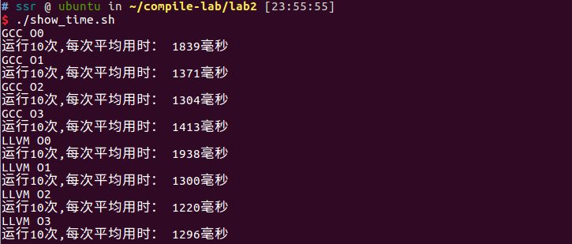

#### 程序运行效率分析

在之前的实验过程中，GCC编译器在各优化等级下编译程序的运行时间如下所示

| 优化等级 | 平均运行时间（ms） |
| -------- | ------------------ |
| O0       | 1839               |
| O1       | 1371               |
| O2       | 1304               |
| O3       | 1413               |

LLVM编译器在各优化等级下编译程序的运行时间如下所示

| 优化等级 | 平均运行时间（ms） |
| -------- | ------------------ |
| O0       | 1938               |
| O1       | 1300               |
| O2       | 1220               |
| O3       | 1296               |

分析可推测对于测试程序来说有如下结论

- 对于GCC和LLVM编译器，开启优化后编译程序的运行效率均有明显的提升，但O1、O2、O3各级优化之间效率差别不是非常明显
- 对于GCC和LLVM编译器，O2优化较O1优化，程序效率均略有提升
- 对于GCC和LLVM编译器，O3优化较O2优化，程序效率均略有下降，与期望不符，可能是程序编写问题
- GCC相较于LLVM编译器，在优化前程序效率较高，但在同等级的优化后程序效率较低

## 实验心得体会

这次实验总体感觉就是不是很顺利，前置知识太少，在只是简单了解了gcc和llvm编译器结构的前提下整个实验分析过程都像是盲人摸象，实验说明也没给出足够详细的指导，花费了大量时间摸索实验的知识和环境配置，走了不少弯路，但收获却感觉不是很多，如果能在获取足够理论知识后再进行这一实验想必能印证所学，实在是有些遗憾。

