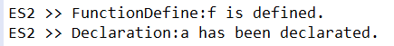
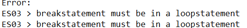
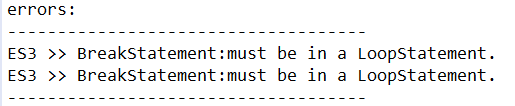
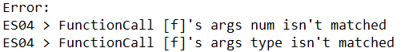
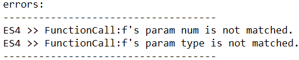
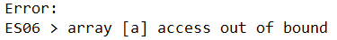
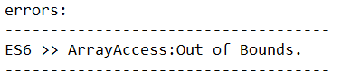
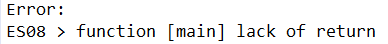

# Lab6/7  语义分析与中间代码生成 

姓名/学号：宋尚儒/1120180717


## 实验目的

（1） 熟悉 C 语言的语义规则， 了解编译器语义分析的主要功能；
（2） 掌握语义分析模块构造的相关技术和方法，设计并实现具有一定分析功能的 C 语言语义分析模块；
（3） 掌握编译器从前端到后端各个模块的工作原理， 语义分析模块与其他模块之间的交互过程。  （4）了解编译器中间代码表示形式和方法；
（5） 掌握中间代码生成的相关技术和方法，设计并实现针对某种中间代码的编译器模块；
（6） 掌握编译器从前端到后端各个模块的工作原理， 中间代码生成模块与其他模块之间的交互过程。  

## 实验内容

语义分析阶段的工作为基于语法分析获得的分析树构建符号表，并进行语义检查。如果存在非法的结果，请将结果报告给用户 。

中间代码生成以自行完成的语义分析阶段的抽象语法树为输入，或者以 BIT-MiniCC 的语义分析阶段的抽象语法树为输入，针对不同的语句类型，将其翻译为中间代码序列。  


## 实验过程

由于具体语法树CST到抽象语法树AST的转换已经在语法分析阶段实现，故本实验将在抽象语法树AST的基础上构建符号表，并进行语义检查和中间代码生成。

### 语义分析阶段

本阶段主要利用三个类对AST进行分析，构建符号表并处理错误

- SymbolTable：自定义符号表类，记录符号表，并提供操作接口

  主要属性包括：

  ```java
  public SymbolTable father;						//上级符号表
  public Map items = new LinkedHashMap<>();		//记录符号与属性域的映射关系
  public LinkedList index = new LinkedList();		//记录符号顺序
  ```

  `items`的属性域保存两类符号表项

  ```java
  //变量项类
  class var_item{
  	public String name;							//符号名
  	public String type;							//符号类型
  	public List arr_limit = new LinkedList();	//数组型变量专用，数组维数列表
  }
  //函数项类
  class func_item{
  	public String name;							//符号名
  	public String type;							//符号类型
  	public List args = new LinkedList();		//参数类型列表
  }
  ```

  重要函数包括

  ```java
  //添加常规变量项
  public void addvar(String name, String type)
  //添加数组变量项
  public void addvar(String name, String type, LinkedList limit)
  //添加函数项
  public void addfunc(String name, String type, LinkedList args) 
  //在当前符号表查找是否存在某符号
  public boolean find_cur(String name) 
  //在当前符号表及所有上级符号表查找是否存在某符号
  public boolean find(String name) 
  //获取某一变量项对应的类型
  public String get_var_type(String name) 
  //获取某一数组的维数信息
  public LinkedList get_arr_limit(String name) 
  //获取函数的参数类型信息
  public LinkedList get_func_arg(String name) 
  //获取函数的返回值
  public String get_func_type(String name) 
  ```

- ErrorHandler：记录错误列表并提供操作与查询接口

  共提供添加14种错误的操作接口，具体错误信息如下所示。对于实验要求的错误信息包括7种，仅对ES05不支持。

  - ES01：变量或函数使用前未定义
  - ES02：变量或函数存在重复定义
  - ES03：break语句未在循环中使用
  - ES04：函数调用的参数个数或类型不匹配
  - ES06：数组访问越界
  - ES07：goto目标不存在
  - ES08：非void函数没有return语句或者return语句不存在值
  - ES09：全局模块非声明语句或函数定义
  - ES10：标签重复定义
  - ES11：函数非全局定义
  - ES12：continue语句未在循环中使用
  - ES13：void函数存在返回值
  - ES14：数组定义时维数不是整型
  - ES15：函数非法调用

- SymbolTableVisitor：是ASTVisitor的实现类，通过visit函数仅递归分析语法树结构

  包含主要属性为

  ```java
  ErrorHandler ehandler;				//错误处理类
  SymbolTable globaltable;			//全局符号表
  SymbolTable localtable;				//局部符号表
  SymbolTable funcs;					//函数表
  int iteration_layer;				//记录循环层数，用于break和continue检查
  String cur_func;					//记录当前函数符号
  boolean cur_func_return;			//记录当前函数返回状况
  LinkedList labellist;				//记录所有标签
  LinkedList gotolabellist;			//记录所有goto目标标签
  ```

  由于比较复杂，将根据功能分别分析

#### 符号表构建

在语义检查阶段，动态分析时无需记录所有符号表，仅需要根据要求记录当前局部符号表以及其上级符号表信息，此外需要完成对于全局符号表和函数表的构建以检查错误。

对于符号表的创建，全局符号表和函数表会进行初始化后动态添加符号表项，而局部符号表则不会保持固定，会在遍历AST的过程中动态生成或替换，在本实验中，需要生成局部符号表的情况有以下几种

- 函数定义（ASTFunctionDefine）
- 复合语句（ASTCompoundStatement）
- 带声明的for循环语句（ASTIterationDeclaredStatement）

需要注意的是，函数定义体即为复合语句，此处的复合语句需要特殊处理；for循环的声明与for循环可能带有的复合语句不在同一个范围内，故需要新生成符号表，这两个符号表之间为上下级关系。

可使用以下语句生成新的局部符号表并在完成这一范围的遍历后返回之前的局部符号表

```java
//生成新局部符号表，curASTNode表示当前visit的对象
curASTNode.scope = localtable;
localtable = new SymbolTable();
localtable.father = curASTNode.scope;

//对新局部符号表进行操作
...

//返回之前局部符号表
this.localtable = curASTNode.scope;
```

对于符号表项的添加，存在两种情况

- 变量声明：需要在visit递归检查到ASTDeclaration类时，对此时所在的局部符号表做判断，若当前局部符号表即为全局符号表，则需要将符号表项添加到全局符号表中，否则添加到局部符号表中。需要注意的是，添加符号表项时需要根据当前变量的类型（常规变量、数组）分别调用不同函数添加。

  对于数组，需要使用一个循环记录其所有的维数信息并保存。

- 函数参数定义：在检查到ASTFuncDefine类时，对参数类型进行检查判断并添加到局部符号表内，此外还需要将函数信息添加到函数表内。

#### 语义检查

由于语义检查目标较多，故选择几个相对重要的进行说明

- ES01

  需要检查变量或函数使用前是否进行了定义，在实现了符号表的构建后相当容易。

  对于函数，只需要在函数表中查找是否存在对应项即可

  对于变量，必定存在标识符Identifier，需要在局部符号表及其所有上级符号表链中查找该标识符，需要调用`SymbolTable.find`函数，该函数首先会在当前符号表项中查找是否存在该标识符，若无法找到，则会沿着`father`属性递归查找上级符号表，直到不存在上级符号表。以此完成了对变量是否定义了的检查。

- ES02

  需要检查变量或函数是否存在重复定义，同样需要实现符号表的构建

  对于函数，只需要在函数表中查找是否存在对应项即可

  对于变量，与ES01不同，只需要调用`SymbolTable.find_cur`函数对当前局部符号表进行查找，这是因为局部符号表与其上级符号表中相同的符号并不构成重复定义关系，仅在同一局部符号表才存在重复定义

- ES03

  需要使用`iteration_layer`属性对当前break语句所在的循环层数进行判断，若层数为0则说明存在ES03问题。该属性会在遍历到循环语句时发生修改，参考如下

  ```java
  this.iteration_layer++;
  this.visit(iterationDeclaredStat.stat);
  this.iteration_layer--;
  ```

- ES04

  需要检查函数调用的参数个数和类型是否匹配，这需要在函数定义时完整构建函数表`funcs`，在函数调用时进行检查，从函数表中提取符号相同的表项。该表项包含了函数定义的参数类型列表，只需要使用该列表与函数调用的参数列表进行比较即可。

  需要注意的是，对于函数调用的参数列表只能对其中的常量进行类型比较。

- ES06

  需要检查数组的访问是否越界，在构建完整的符号表后，可以从符号表中提取出该数组对应的维数信息，以此作为界限对数组访问的各个索引值进行检查，若某一索引值对应整型常数则可进行检查，否则不做判断，如果大于对应维数的界限，则存在访问越界。

- ES07

  需要检查goto目标是否存在，由于标签属于全局信息，需要在整个程序遍历完成后进行检查，即需要在遍历ASTCompilationUnit模块的末尾进行检查，对`gotolabellist`列表的每一项查找其是否在`labellist`中存在，若不存在则说明存在错误。

- ES08

  需要检查非void函数没有return语句或者return语句是否有返回值。这里需要使用变量`cur_func_return`，在遍历到return语句时会根据return语句的返回值对该变量进行修改。

  在函数定义末尾结合该变量与函数类型进行错误判断。

### 中间代码生成阶段

中间代码使用四元式的形式，使用四元式区分函数边界和范围，具体可参考下表

| OP                                      | D1             | D2                          | D3               | 说明                                |
| --------------------------------------- | -------------- | --------------------------- | ---------------- | ----------------------------------- |
| Func_Beg                                | 函数返回值类型 | 函数参数个数                | 函数名           | 函数结构开头                        |
| Func_End                                |                |                             | 函数名           | 函数结构末尾                        |
| Scope_Beg                               | 上级范围名称   |                             | 范围名           | 范围结构开头                        |
| Scope_End                               | 上级范围名称   |                             | 范围名           | 范围结构末尾                        |
| label                                   |                |                             | 标签名           | 标签声明                            |
| arr                                     | 数组类型与维数 | 数组所属范围,全局声明时为空 | 数组名           | 数组声明                            |
| var                                     | 变量类型       | 变量所属范围全局声明时为空  | 变量名           | 变量声明                            |
| param                                   | 参数类型       | 参数所属范围                | 参数名           | 函数定义参数声明                    |
| arg                                     |                |                             | 参数名           | 函数调用参数声明                    |
| call                                    | 函数名         |                             | 返回值保存变量名 | 函数调用                            |
| ret                                     |                |                             | 返回值           | 函数返回                            |
| jf                                      | 判断变量名     |                             | 目标标签         | 当判断变量值为false时跳转到目标标签 |
| jt                                      | 判断变量       |                             | 目标标签         | 当判断变量值为true时跳转到目标标签  |
| j                                       |                |                             | 目标标签         | 无条件跳转到目标标签                |
| =;+=;-=;*=;/=;%=                        | 参数1          |                             | 目标变量         | 赋值语句                            |
| =[]                                     | 参数1          |                             | 目标变量         | 根据地址赋值语句，用于数组访问      |
| +;-;*;/;%;<<;>>;<;>;>=;<=;==;!=;&&;\|\| | 参数1          | 参数2                       | 目标变量         | 进行对应二元运算后赋值给目标变量    |
| !;~                                     | 参数1          |                             | 目标变量         | 对参数1进行操作后赋值给目标变量     |
| ++;--                                   |                |                             | 目标变量         | 目标变量自增或自减1                 |

本阶段主要利用五个类（此外还包含在语义分析阶段构建的SymbolTable类）对AST进行分析，构建符号表并生成以上形式的中间代码

- Quat：该类保存分析生成的基础四元式形式，还需要进一步处理，其中OP字段类型为String，其余三个字段类型为ASTNode

- MyICPrinter：接收基础四元式列表，结合函数符号表和子范围符号表对基础四元式列表进行解析，生成最终的四元式字符串。

  包含主要属性为

  ```java
  private  List<Quat> quats;							//基础四元式列表
  private  Map<String,SymbolTable> functable;			//函数对应的符号表映射
  private  Map<String,SymbolTable> subscopetable;		//子范围对应的符号表映射
  ```

  具体处理过程会在之后进行详细分析

- TemporaryValue：ASTNode的扩展类，用于生成临时变量

- ControlLabel：ASTNode的扩展类，用于生成标签，包含以下属性

  ```java
  public String name;		//标签名
  public int dest;		//标签所在quats序列的索引
  ```

- MyICBuilder：是ASTVisitor的实现类，通过visit函数仅递归分析语法树结构

  包含主要属性为

  ```java
  Map<ASTNode, ASTNode> map;			// 子节点的返回值映射关系
  List<Quat> quats;					// 基础四元式列表
  Integer tmpId;						// 临时变量编号
  SymbolTable globaltable;			// 全局符号表
  SymbolTable localtable;				// 局部符号表
  ControlLabel localscope;			// 局部范围标识
  SymbolTable funcs;					// 符号表
  String cur_func;					// 当前函数
  Map<String,ASTNode> labellist;		// 标签名与子节点映射关系
  Map<String,SymbolTable> functable;	// 函数名与函数符号表映射关系
  Map<String,SymbolTable> subscopetable;// 子范围名与子范围符号表映射关系
  private Integer subscopeId;			// 子范围编号，用于生成子范围名
  private Integer ControlLabelId;		// 临时标签编号，用于生成临时标签
  ControlLabel curEndlabel;			// 当前所在循环结构的end标签
  ControlLabel curNextlabel;			// 当前所在循环结构的next标签
  ```

  由于比较复杂，将根据功能分别分析

#### 函数、子范围的生成与变量声明

函数结构由多个四元式组成，可参考如下，会在函数结构开始部分先进行参数序列说明，再进行局部变量定义序列说明，再然后才是函数体。

```java
(Func_Beg,int,2,f) 		//函数结构开头四元式
(param,int,f,param1)	//函数参数定义四元式序列
(param,int,f,param2)
(var,int,f,var1)		//函数局部变量定义序列
(var,int,f,var2)
......					//操作四元式序列		
(ret,,,var1)			//函数返回值四元式
(Func_End,,,f)			//函数结构结尾四元式
```

当visit遍历到ASTFunctionDefine时，生成一个`(Func_Beg,<type>,,<function.declarator>)` 形式的基础四元式并保存到基础四元式列表中。之后在函数参数定义和函数体遍历过程中会生成函数局部符号表（生成过程参考语义分析阶段），并将函数符号与该局部符号表的映射关系保存在`functable`中。并在最后生成一个`(Func_Beg,,,<function.declarator>)`形式的四元式

子范围结构由多个四元式组成，会在子范围结构开始部分先进行变量声明序列说明，再然后才是函数体。多层嵌套子范围结构可参考如下

```java
(Func_Beg,int,2,f) 						
......
(Scope_Beg,f,,SubScope@1)				//第一层子范围结构开头四元式
(var,int,SubScope@1,i)					//第一层子范围结构局部变量定义序列
......
(Scope_Beg,SubScope@1,,SubScope@2)		//第二层子范围结构开头四元式
(var,int,SubScope@2,j)					//第二层子范围结构局部变量定义序列
...
(Scope_End,SubScope@1,,SubScope@2)		//第一层子范围结构结尾四元式
...
(Scope_End,f,,SubScope@1)				//第二层子范围结构结尾四元式
......								
(Func_End,,,f)			
```

当需要生成一个子范围时（生成时机已在语义定义中说明），会临时生成一个`SubScope@`形式的符号，生成一个`(Scope_Beg,<pre_scope_label>,,<scope_label>)` 形式的基础四元式并保存到基础四元式列表中，注意需要使用ControlLabel类生成四元式项。之后在子范围遍历过程中会生成局部符号表（生成过程参考语义分析阶段），并将子范围符号与该局部符号表的映射关系保存在`subscopetable`中。并在最后生成一个`(Scope_End,<pre_scope_label>,,<scope_label>)`形式的四元式。具体声明参考如下

```java
//生成新子范围四元式
String scopename = "SubScope@" + this.subscopeId++;
ControlLabel tmpscope = this.localscope;
localscope = new ControlLabel(scopename);
Quat quatscopebeg = new Quat("Scope_Beg",localscope,tmpscope,null);
quats.add(quatscopebeg);

//生成子范围结束四元式
Quat quatscopeend = new Quat("Scope_End",localscope,tmpscope,null);
quats.add(quatscopeend);
this.localscope = tmpscope;
```


对于以上函数和子范围结构，需要注意的是，在调用MyICPrinter对quats进行处理之前，所有局部变量的声明都是没有加入到quats中的，也就是说声明型四元式都是在MyICPrinter中结合局部变量表进行生成的。当MyICPrinter在扫描quats过程中，正常只会对quat各项进行转换操作，一旦发现某quat对应的OP字段为`Func_Beg`或`Scope_Beg`即开始特殊处理，

- `Func_Beg`：根据四元式的提取函数名和参数个数，将四元式转化为`(Func_Beg,<type>,<cnt_param>,<functionname>)`的形式，从`functable`映射关系中获取该函数的局部符号表，对该符号表各表项进行变量声明四元式的生成
- `Scope_Beg`：根据四元式提取范围名，从`subscopetable`映射关系中获取该子范围的局部符号表，对该符号表各表项进行变量声明四元式的生成

需要生成的表项类型可能为

- 变量：需要生成`(var,<type>,<scopename>,<varname>)`形式的四元式
- 数组：需要生成`(arr,<type><dim1><dim2>...,<scopename>,<arrname>)`，形式的四元式，比如`(arr,int<10><20>,main,a)`

并且需要注意将生成的临时变量也加入到符号表中，这需要根据不同情况来确认临时变量的类型

#### 表达式的生成

需要对不同表达式进行分别处理，必须完整进行遍历过程，四元式各项应该是以遍历子节点后的映射结果

- 二元表达式

  设运算符为`op`，表达式分别为`expr1`,`expr2`，因为四元式特殊性质需要对赋值类型语句做额外判断，分为以下三种情况

  - `=`

    如果第二个操作数为一个二元表达式，该二元表达式运算符为`op1`，则需要形成`(op1,a,b,expr1)`形式的四元式，否则生成`(=,expr2,,expr1)`形式的四元式

  - `+=`；`-=`；`*=`；`/=`；`%=`

    需要生成`(op[0],expr1,expr2,expr1)`形式的四元式

  - 运算类二元操作符

    需要生成临时变量，这里假设为`%i`，需要生成`(op,expr1,expr2,%i)`形式的四元式

- 一元表达式

  设运算符为`op`，表达式为`expr`，根据`op`不同需要不同处理

  - 后缀 `++`；`--`

    这种情况需要生成临时变量存储此前的`expr`值，也就是说，需要生成两个四元式，并将建立子节点结果与临时变量的映射，示例如下

    ```java
    //生成四元式
    (=,a,,%i)
    (++,,,a)
    //表达式结果赋值语句
    (=,%i,,res)
    ```

  - 前缀 `++`；`--`

    只需一个记录原`expr`自增的四元式即可

  - 前缀 `!`；`~`

    这种情况需要生成临时变量存储操作过的`expr`值，原`expr`不会有改变

- 数组访问表达式

  在符号表中取出数组的维数列表limit，并获取数组访问索引表达式列表index，需要进行计算以获取真正的数组索引。注意这里的索引值是由一系列四元式组成。

  计算过程可以参考课本P197，这里仅给出代码参考思路

  ```java
  //获取系数sumc，和limit的累乘值列表c，c从大到小排列
  int sumc = 1, tnum = 1;
  LinkedList c = new LinkedList();
  for(int i=limit.size()-1;i>0;i--) {
  	tnum = tnum * (int)limit.get(i);
  	c.addFirst(tnum);
  	sumc += tnum;
  }
  
  //生成两个临时变量和一个常数
  ASTNode t1 = new TemporaryValue(++tmpId);
  ASTNode t2 = new TemporaryValue(++tmpId);
  ASTIntegerConstant d = new ASTIntegerConstant(sumc,-1);
  //记录第一个quat，代表a-sumc
  Quat quat0 = new Quat("-", t2, expr, d);
  quats.add(quat0);
  
  for(int i=0;i<limit.size()-1;i++) {
      //获取第i个累乘值dd
  	ASTIntegerConstant dd= new ASTIntegerConstant((Integer)c.get(i),-1);
  	//记录第2i+1个quat，代表t1=dd*index(i)
      Quat quat1 = new Quat("*",t1, (ASTNode)index.get(i),dd);
  	quats.add(quat1);
      //记录第2i+2个quat,代表t2=t1+t2
  	Quat quat2 = new Quat("+",t2, t2, t1);
  	quats.add(quat2);
  }
  //记录quat，代表t2=最后一个索引值+t2
  Quat quat2 = new Quat("+",t2, t2, (ASTNode)index.get(index.size()-1));
  quats.add(quat2);
  
  //生成临时变量t3，生成quat，代表取t2地址处的值赋给t3
  ASTNode t3 = new TemporaryValue(++tmpId);
  Quat quat3 = new Quat("=[]",t3, t2, null);
  quats.add(quat3);
  //将节点与t3建立结果映射
  map.put(arrayAccess, t3);
  ```

- 函数调用表达式

  对于函数调用，需要先声明其变量，示例如下

  ```java
  //设函数f为具有两个参数的函数，原语句为 res=f(a1,a2)
  (arg,,,a1)		//从左到右声明参数四元式序列
  (arg,,,a2)
  (call,f,,%1)	//函数调用四元式，结果保存在最后一项(临时变量)中，当函数为void时为空
  
  (=,%1,,res)
  ```

  函数调用参数声明自左向右进行，与原函数定义参数一一对应。

#### 标签与goto语句的生成

当遍历到标签语句时，需要生成ControlLabel类的对象，并最终形成`(label,,,@<labelname>)`形式的四元式，并将原标签名与对象的映射保存到`labellist`中

当遍历到goto语句时，根据目标名称从`labellist`获取对应的ControlLabel类的对象，最终形成`(j,,,@<labelname>)`形式的四元式

#### 循环结构的生成

循环结构分为4个部分Init、Check、Body、Step，其中Check和Body中的break和continue语句导致控制流的转移，故设置三个标签分别记录为`@IterationCheck`，`@IterationEnd`，`@IterationNext`，跳转关系如下图所示


标签可以使用ContrlLabel类临时生成，故最终一个循环的四元式序列可以参考如下

```java
...								//Init
(label,,,@IterationCheckL0)		//定义标签@IterationCheck
...								//Check
(jf,%1,,@IterationEndL1)		//检查表达式的值(保存为临时变量)，若不通过循环结束，
								//跳转到标签@IterationEnd
...								//Body开始
...
(j,,,@IterationEndL1)			//break 对应的四元式，循环结束
...
(j,,,@IterationNextL2)			//continue 对应的四元式，进入下一循环
...
...								//Body结束
(label,,,@IterationNextL2)		//定义标签@IterationNext
...								//Step
(j,,,@IterationCheckL0)			//跳转到标签@IterationCheck，重新循环
(label,,,@IterationEndL1)		//定义标签@IterationEnd
```

此外需要注意的是，由于多重循环嵌套，break和continue必须确定跳转的是哪一个循环语句对应的`@IterationEnd`，`@IterationNext`，所以设置变量`curEndlabel`、`curNextlabel`，每当需要访问循环结构的Body时，在访问前会创建临时变量存储`curEndlabel`、`curNextlabel`，在访问后再用临时变量回复`curEndlabel`、`curNextlabel`。

此外，循环结构存在自己的子范围和局部变量，需要生成新的局部符号表，具体生成方法已在之前说明。

#### 选择结构的生成

选择结构分为三个部分，分别是Condition、Then、Else，并且由于可能出现的`else if`，需要两个标签`@IfFalse`、`@IfEnd`，跳转关系如下图所示


标签可以使用ContrlLabel类临时生成，故最终一个选择的四元式序列可以参考如下

```java
...								//Condition1，保存结果到临时变量
(jf,%1,,@IfFalseL0)				//判断成果则执行Then，否则跳转到标签@IfFalse
...								//Then
(j,,,@IfEndL1)					//Then结束，无条件跳转到结束标签@IfEnd
(label,,,@IfFalseL0)			//定义标签@IfFalse
...								//Else
(label,,,@IfEndL1)				//定义标签@IfEnd
```

该结构支持`else if`或者多重选择结构，此外需要注意的是，Then和Else存在自己的范围和局部变量，需要根据情况生成新的符号表，具体生成方法已在之前说明。

### 实验结果

#### 语义分析阶段

以下为实验程序和内置程序在对`test/semantic_testcases`目录下各文件的测试结果对比

- 0_var_not_defined.c

  实验程序：

  

  内置程序：

  

- 1_var_defined_again.c

  实验程序：

  

  内置程序：

  

- 2_break_not_in_loop.c

  实验程序：

  

  内置程序：

  

- 3_func_arg_not_match.c

  实验程序 ：

  

  内置程序：

  

- 5_arrayaccess_out_of_bounds.c

  实验程序：

  

  内置程序

  

- 6_goto_label_not_exist.c

  实验程序：

  

  内置程序

  

- 7_func_lack_of_return.c

  实验程序

  

  内置程序

  

可以看到结果基本一致，实现了对ES01、ES02、ES03、ES04、ES06、ES07、ES08错误检测的支持

#### 中间代码生成阶段

测试文件选用自定义`mytest.c`，该文件在原测试文件`test.c`基础上修改，增加了多重循环和数组访问测试点，完整程序可见报告最后的附录。实验程序最终生成`mytest.ic.xml`，展示部分片段

- 全局变量声明

  ```c
  (arr,int<10><20>,global,a)
  (var,int,global,b)
  (=,1,,b)
  ```

- 函数声明（函数f1）

  ```c
  (Func_Beg,int,2,f1)
  (param,int,f1,x)
  (param,int,f1,y)
  (var,int,f1,z)
  (+,x,y,z)
  (ret,,,z)
  (Func_End,,,f1)
  ```

- 局部变量定义

  ```c
  (Func_Beg,int,0,main)
  (var,int,main,%1)
  (var,int,main,%2)
  (var,int,main,%3)
  (var,int,main,a1)
  (var,int,main,a2)
  (var,int,main,res)
  ```

- 数组访问（`a[2][3]`）

  ```c
  (-,a,21,%2)
  (*,2,20,%1)
  (+,%2,%1,%2)
  (+,%2,3,%2)
  (=[],%2,,%3)
  ```

- 前缀表达式

  ```c
  (!,a1,,%4)
  (=,%4,,res)
  (~,a1,,%5)
  (=,%5,,res)
  ```

- 二元表达式

  ```c
  (+,a1,a2,res)
  (%,a1,a2,res)
  (<<,a1,a2,res)
  ```

- 自增的两种形式（`a1++`;`++a1`）

  ```c
  (=,a1,,%6)
  (++,,,a1)
  (=,%6,,res)
  (++,,,a1)
  (=,a1,,res)
  ```

- 选择结构（共产生3个选择域）

  ```c
  (&&,a1,a2,%7)
  (jf,%7,,@IfFalseL0)
  (Scope_Beg,main,,SubScope@0)
  (var,int,SubScope@0,%8)
  (arg,,,a1)
  (arg,,,a2)
  (call,f1,,%8)
  (=,%8,,res)
  (j,,,@IfEndL1)
  (Scope_End,main,,SubScope@0)
  (label,,,@IfFalseL0)
  (!,a1,,%9)
  (jf,%9,,@IfFalseL2)
  (Scope_Beg,main,,SubScope@1)
  (var,int,SubScope@1,%10)
  (arg,,,b)
  (arg,,,a2)
  (call,f1,,%10)
  (=,%10,,res)
  (j,,,@IfEndL3)
  (Scope_End,main,,SubScope@1)
  (label,,,@IfFalseL2)
  (Scope_Beg,main,,SubScope@2)
  (call,f2,,)
  (Scope_End,main,,SubScope@2)
  (label,,,@IfEndL3)
  (label,,,@IfEndL1)
  ```

- 双重循环、break、continue与数组访问（`a[i][j]`），continue和break对应四元式特殊标明

  ```c
  (Scope_Beg,main,,SubScope@3)
  (var,int,SubScope@3,i)
  (var,int,SubScope@3,%11)
  (var,int,SubScope@3,%17)
  (=,0,,i)
  (label,,,@IterationCheckL4)
  (<,i,a1,%11)
  (jf,%11,,@IterationEndL5)
  (Scope_Beg,SubScope@3,,SubScope@4)
  (var,int,SubScope@4,j)
  (var,int,SubScope@4,%12)
  (var,int,SubScope@4,%13)
  (var,int,SubScope@4,%14)
  (var,int,SubScope@4,%15)
  (var,int,SubScope@4,%16)
  (=,0,,j)
  (label,,,@IterationCheckL7)
  (<,j,a1,%12)
  (jf,%12,,@IterationEndL8)
  (-,a,21,%14)
  (*,i,20,%13)
  (+,%14,%13,%14)
  (+,%14,j,%14)
  (=[],%14,,%15)
  (j,,,@IterationEndL8)						//break
  (label,,,@IterationNextL9)
  (=,j,,%16)
  (++,,,j)
  (j,,,@IterationCheckL7)
  (label,,,@IterationEndL8)
  (Scope_End,SubScope@3,,SubScope@4)
  (j,,,@IterationNextL6)						//continue
  (label,,,@IterationNextL6)
  (=,i,,%17)
  (++,,,i)
  (j,,,@IterationCheckL4)
  (label,,,@IterationEndL5)
  (Scope_End,main,,SubScope@3)
  ```

- 循环、break、continue

  ```c
  (Scope_Beg,main,,SubScope@5)
  (var,int,SubScope@5,i)
  (var,int,SubScope@5,%18)
  (var,int,SubScope@5,%19)
  (=,0,,i)
  (label,,,@IterationCheckL10)
  (<,i,a1,%18)
  (jf,%18,,@IterationEndL11)
  (j,,,@IterationEndL11)
  (j,,,@IterationNextL12)
  (+,res,1,res)
  (label,,,@IterationNextL12)
  (=,i,,%19)
  (++,,,i)
  (j,,,@IterationCheckL10)
  (label,,,@IterationEndL11)
  (Scope_End,main,,SubScope@5)
  ```

- 标签与goto

  ```c
  (label,,,@k)
  (j,,,@k)
  ```

可以看出生成的中间代码可以完整的表示原程序逻辑


## 实验心得体会

本次实验工作量还是比较大，因为语法分析阶段笔者采用的是递归下降分析法，对visit方法不是很熟悉，还花了一段时间进行学习，在之后的语法分析中一开始没有很好的规划，构造的符号表结构在程序相对复杂后就无法使用了，又重构了一次代码，最终完成了对大部分要求错误的识别，但是对于ES05还是感觉有些语义不明所以没做进一步处理。在中间代码生成阶段，笔者再次调整了符号表，拓宽了它的功能，并以四元式为基础构建了一个逻辑相对完善中间代码表示。其中父子范围下同一符号的表示给笔者带来了相当的困扰，最终引入范围标识来处理这一问题，但其最终如何转换为机器代码还是有待解决的问题，笔者目前是考虑使用栈结构。

总的来说还有一些可以改进的地方，比如完善错误处理，对更多的错误进行识别；对中间代码的变量类型转换机制做进一步完善等。


## 附录


`mytest.c`

```c
int a[10][20];
int b = 1;

int f1(int x,int y){
	int z = x + y;
	return z;
}
void f2(){
	//Mars_PrintStr("in f2\n");
	return;
}

int main(){
    a[2][3];
	int a1 = 1;
	int a2 = 2;
	int res;
	// unary oper
	res = !a1;
	res = ~a1;
	// binary oper
	res = a1+a2;
	res = a1%a2;
	res = a1 << a2;
	// selfchange
	res = a1++;
	res = ++a1;
	// short-circuit evaluation and "if" control-flow
	if(a1 && a2){
		res = f1(a1,a2);
	}else if(!a1){
		// b is global
		res = f1(b,a2);
	}else{
		f2();
	}
	// "for" control-flow
	for(int i= 0 ; i<a1; i++){
        for(int j=0; j<a1; j++){
            a[i][j];
            break;
        }
        continue;
	}
	for(int i = 0; i<a1; i++){
		break;
		continue;
		res += 1;
	}

	// label and goto
	k:
	goto k;
	// return
	return 0;
}
```

