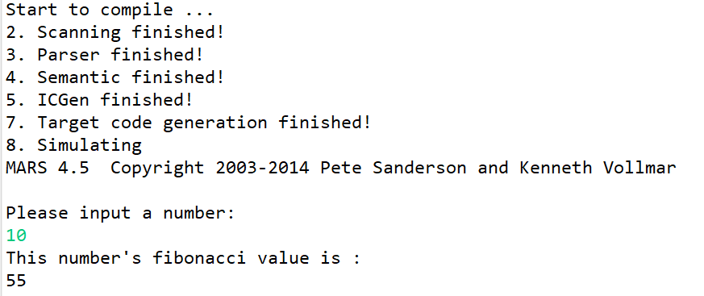
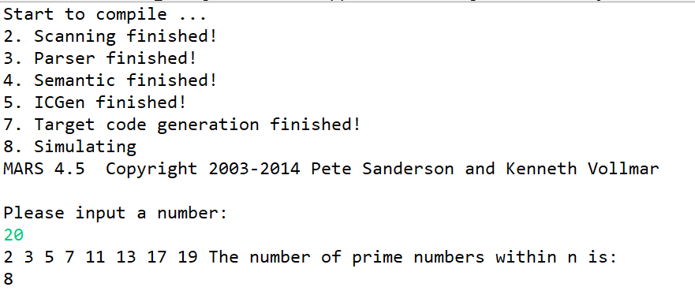
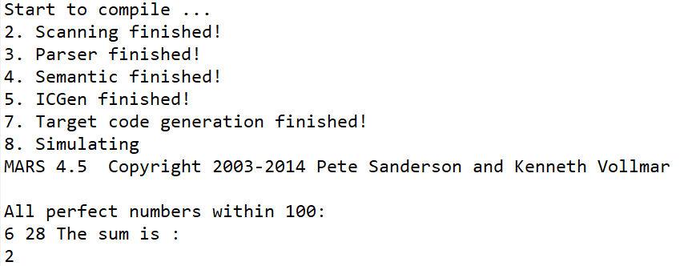

# Lab8  目标代码生成

姓名/学号：宋尚儒/1120180717


## 实验目的

（1）了解编译器指令选择和寄存器分配的基本算法；

（2）掌握目 标 代 码 生 成 的 相 关 技 术 和 方 法， 设 计并 实 现 针 对x86/MIPS/RISC-V的目标代码生成模块；

（3）掌握编译器从前端到后端各个模块的工作原理，目标代码生成模块与其他模块之间的交互过程。

## 实验内容

​	基于BIT-MiniCC构建目标代码生成模块，该模块能够基于中间代码选择合适的目标指令，进行寄存器分配，并生成相应平台汇编代码。

​	如果生成的是MIPS或者RISC-V汇编，则要求汇编代码能够在BIT-MiniCC集成的MIPS或者RISC-V模拟器中运行。需要注意的是，config.xml的最后一个阶段“ncgen”的“skip”属性配置为“false”,"target"属性设置为“mips”、“x86”或者“riscv”中的一个。

​	如果生成的是X86汇编，则要求使用X86汇编器生成exe文件并运行。

## 实验过程

​	本次实验选择生成MIPS汇编代码，目的是可以在MARS模拟器（框架自带）中运行，最终完成的编译器可通过5个测试样例。

### 中间代码说明

​	本次目标代码生成完全基于在之前生成的中间代码，具体形式可以参考本人的上一次报告，同时为更好地支持对多维数组元素的动态访问与赋值，增添修改以下四元式形式。经修改的完整四元式含义表置于附录中

| OP   | D1         | D2       | D3       | 说明                           |
| ---- | ---------- | -------- | -------- | ------------------------------ |
| =[]  | 偏移量变量 | 数组符号 | 目标变量 | 根据地址访问语句，用于数组访问 |
| []=  | 源变量变量 | 偏移量   | 数组符号 | 根据地址赋值语句，用于数组赋值 |

对于数组元素的访问，可以参考如下示例

```java
//a[8][8]
//n=a[i][j]
(=,0,,%11)
(*,i,5,%10)
(+,%11,%10,%11)
(+,%11,j,%11)
(=[],%11,a,%12)
(=,%12,,n)
```

对数组元素的赋值，可以参考如下示例

```java
//a[8][8]
//a[i][j]=n
(=,0,,%4)
(*,i,8,%3)
(+,%4,%3,%4)
(+,%4,j,%4)
(=[],%4,triangle,%5)
(=,1,,%5)
([]=,%5,%4,triangle)
```

### 目标代码生成器结构

目标代码生成器主要利用五个类

- MyCodeGen：主类，会读取四元式文件并调用栈帧类和寄存器管理器类进行目标代码生成，主要属性为

  ```java
  private CodeData cdata = new CodeData();	//存储data段代码的子类
  private CodeText ctext = new CodeText();	//存储text段代码的子类
  private String allcode;						//最终形成的汇编代码字符串
  private List<MyQuat> quats;					//读取完成的四元式序列
  public int index_quat;						//当前解析的四元式序号
  public int tmplabelID;						//处理比较算符的临时标签
  public MIPSStackFrame curframe;				//栈帧类
  public RegManager regman = new RegManager();//寄存器管理器
  ```

- MIPSStackFrame：栈帧类，负责根据声明类四元式建立函数的变量符号到栈帧单元（之后简称变量）、变量到变量偏移值（相对栈顶）的映射关系，并提供查询接口

  包含子类SymbolMap，存储符号到变量、变量到变量偏移值的映射结构

  包含子类Sunit，栈帧单元类，存储该栈帧单元对应的符号、序号、寄存器活跃情况、对应寄存器（如果寄存器活跃），提供操作接口

  ```java
  public class MIPSStackFrame {
  	public List<Sunit> sargs = new LinkedList<Sunit>();	//参数单元
  	private Sunit retaddr;								//返回地址
  	public List<Sunit> svars = new LinkedList<Sunit>();	//变量单元
  	private SymbolMap smap = new SymbolMap();			
  	public int size;									//栈帧大小
  	...
  }
  class SymbolMap{
  	Map<String,Sunit> sym2svar = new HashMap<>();	//符号到变量
  	Map<Sunit,Integer> svar2off = new HashMap<>();	//变量到偏移值
  	...
  }
  
  class Sunit{
  	String symbol;		//变量符号
  	int index;			//变量序号
  	boolean inreg;		//位于寄存器中，意味着和栈中变量存在不一致性
  	Reg areg;			//对应寄存器
  	...
  }
  ```

- RegManager：寄存器管理类，负责寄存器的分配与回收，对于运算过程中的变量会采用动态分配的方式为其分配寄存器，当临时变量寄存器满额时采用时钟扫描(NRU)算法进行替换。

  包含子类Reg，寄存器类，包含寄存器ID，指向保存的变量

  ```java
  public class RegManager {
      //寄存器列表
  	List<Reg> regs = new LinkedList<Reg>();		
      //临时变量寄存器使用情况，用于NRU
  	Map<Integer,Boolean> used = new HashMap<Integer, Boolean>();
  	//时钟指针，用于NRU
      int ptr;
      ...
  }
  class Reg{
  	int ID;
  	Sunit var = null;
  	...
  }
  ```

- MyQuat：保存四元式各部分的字符形式

因为需要进行初始化以及进行`Mars_PrintInt`、`Mars_GetInt`、`Mars_PrintStr`三个函数的链接操作，其生成的目标代码具有通用的函数头，其初始形式保存在`CodeData`和`CodeText`中，其形式参考如下：

```assembly
.data
blank : .asciiz " "

.text
__init:
	lui $sp, 0x8000
	addi $sp, $sp, 0x0000
	move $fp, $sp
	add $gp, $gp, 0x8000
	jal main
	li $v0, 10
	syscall
Mars_PrintInt:
	li $v0, 1
	syscall
	li $v0, 4
	move $v1, $a0
	la $a0, blank
	syscall
	move $a0, $v1
	jr $ra
Mars_GetInt:
	li $v0, 5
	syscall
	jr $ra
Mars_PrintStr:
	li $v0, 4
	syscall
	jr $ra
```

### 栈帧结构与变量地址

#### 栈帧基础结构

每个栈帧单元占4B，栈帧从栈底到栈顶（地址从高到低）分别为

- 函数参数

  最多4个，每个占用1个栈帧单元，

- 返回地址

  1个栈帧单元

- 局部变量

  可分为

  - 整型变量：每个占1个栈帧单元
  - 数组变量：依据定义分配栈帧单元，比如`a[8][8]`分配64个栈帧单元

#### 栈帧初始化

​	对于每一个函数结构，均需要初始话栈帧，使其局部变量的符号可以和栈帧上的栈帧单元建立联系，所以每当解析到函数结构时，需要创建新的栈帧结构，并将声明四元式组（包括该函数内所有声明四元式）传递给栈帧初始化函数。然后以此根据声明四元式的op符判断具体是哪一种声明

- param：参数声明

  创建栈帧单元（变量），添加到参数变量列表中，并立刻分配参数寄存器，建立符号名与变量的映射关系

- var：整形变量

  创建栈帧单元（变量），添加到局部变量列表中，建立符号名与变量的映射关系

- arr：数组变量

  根据其定义的维数信息获取其整体的偏移值，为每一个分配一个栈帧单元，添加到局部变量列表中，但只建立符号与头部变量的映射关系。

​	然后根据之前的栈帧结构依次从局部变量列表、返回地址单元、参数变量列表中获得变量，并建立其与栈顶指针偏移值之间的映射关系，模拟入栈过程。

#### 变量地址映射

​	如之前所言，变量具体在栈中的地址可以用偏移值offset和栈顶指针寄存器`sp`来表示，具体可以表示为`offset($sp)`，使用`lw`和`sw`指令分别进行变量到寄存器的加载和寄存器到变量的存储。

​	对于数组变量，其元素的地址映射则可以由数组基址和元素偏移值来表示，数组基址可以直接通过映射获取立即数，但偏移值通常保存在寄存器中，假设基址为`arr`，偏移值保存的寄存器为`x`，在本实验中数组基址位于高地址处，数组元素真正对应的地址取值是`（$sp+arr-$x）`。

### 寄存器分配

本次实验作者主要使用到的寄存器（不包括前置代码）有

| 寄存器  | 别名    | 用途                           |
| ------- | ------- | ------------------------------ |
| $2      | $v0     | 函数调用返回值                 |
| $4-$7   | $a0-$a3 | 参数寄存器，函数调用参数       |
| $8-$15  | $t0-$t7 | 变量寄存器，保存变量值         |
| $24-$25 | $t8-$t9 | 临时寄存器，保存临时处理的数据 |
| $29     | $sp     | 堆栈指针                       |
| $31     | $ra     | 返回地址                       |

#### 寄存器管理器管理方式与分配算法

​	其中参数寄存器、变量寄存器、临时寄存器为寄存器管理器负责进行管理的对象，主类向寄存器管理器申请所需要的寄存器，寄存器管理器根据当前寄存器的状态与分配策略进行寄存器的分配与释放，并将寄存器反馈给主类。

​	本实验中不将变量与寄存器进行强行绑定，可以在编译过程中动态分配。其中变量寄存器数量有限，当被完全分配时若还需要加载变量，则需要进行替换操作，故采用简单时钟扫描方法（NRU）进行分配。每个变量寄存器存在是否被使用这一状态，被保存在`used`中，初始均为`false`，当寄存器中的变量被分配或访问时，其状态便被置为`true`。当需要进行分配时，则获取`ptr`指向的变量寄存器的状态：

- 如果为`true`，则置为`false`并指向下一寄存器并重复查询。
- 如果为`false`，将该寄存器作为可以被分配的寄存器反馈给主类，并将`ptr`指向下一寄存器。

如此可以完成寄存器的动态分配，重要操作接口如下

```java
Reg getReg(int i)			//获取指定第i个寄存器
Reg getRegt1()				//获取24号寄存器
Reg getRegt2()				//获取25号寄存器
Reg getRegArg(int i)		//获取第i个参数寄存器
Reg getAvailReg() 			//获取一个空闲变量寄存器，没有则返回null
int getNRUReg()				//通过NRU算法获取一个待分配的变量寄存器编号
void freeAllReg() 	//消除所有活跃的变量寄存器的活跃状态，清除与其变量的映射关系
```

#### 主类获取变量对应寄存器的方法

​	当主类需要调用变量时必须将其载入寄存器中后才可以使用。主要使用`getNewReg(Sunit)`方法来实现获取一个变量对应的寄存器。首先会检查变量的`inreg`属性，如果为`true`则说明已经在寄存器中，将`areg`属性直接返回即可；否则说明该变量不在寄存器中，需要进行寄存器分配，调用`getAvailReg`获取空闲寄存器，

- 返回值非空

  设空闲寄存器编号为`i`，变量偏移值为`offset`，生成指令`lw $i , offset($sp)`将变量值加载到空闲寄存器中

- 返回值为空

  调用`getNRUReg`获取待分配寄存器编号`i`，该寄存器原保存的变量偏移值为`offset1`，生成指令`sw $i , offset1($sp)`将寄存器值保存回栈中。待分配的变量偏移值为`offset2`，生成指令`lw $i , offset2($sp)`将变量值加载到寄存器中。

​	需要注意的是，操作前后需要即时改变寄存器和变量之间的映射关系和状态信息，比如将寄存器变量转移回栈中时，必须修改其`inreg`属性为`false`，`areg`属性为`null`

#### 主类临时保存寄存器方法

​	当主类需要处理函数调用或跳转时需要将所有活跃的参数寄存器和变量寄存器保存的变量转移到栈中，这一操作由`SaveRegs`方法实现。会遍历所有参数寄存器和变量寄存器的值并检查其`var`属性，如果非空则说明其处于活跃状态，需要保存到栈中，设寄存器为`i`，对应变量的偏移值为`offset`，需要生成指令`sw $i , offset($sp)`。

​	需要注意的是本实验不会进行对称的寄存器恢复操作，实际上也不需要进行对称的恢复，这是因为部分变量不会在之后使用到，并且本实验的变量与寄存器的动态映射和分配策略完全可以支持任意寄存器的动态分配。该方法本质上只是为了保证变量值的一致性。

### 四元式与目标代码转换

#### 函数结构与返回四元式

​	函数结构通常以Func_Beg四元式开头，Func_End四元式结尾。对于每个函数结构，首先需要获取范围内的所有声明四元式(param、var、arr)，并根据声明四元式创建栈帧类，设创建的栈帧大小为`size`，则需要生成指令`subu $sp, $sp, size`，调整栈顶指针以分配栈帧空间。

​	当函数结束时，如果存在返回值，则需要将返回值移动到v0寄存器中

- 返回值为常数`c`：生成指令`li $v0,  + c`
- 返回值为变量：根据符号获取变量，并根据变量调用`getNewReg`获取变量所在的寄存器`i`，生成指令`move $v0, $i`

​	最后需要生成两个指令，进行栈帧平衡（回收空间）与返回原调用地址操作

- `addu $sp, $sp, size`
- `jr $ra`

#### 函数调用四元式

​	当解析到arg或call四元式时，说明需要进行函数调用操作，首先需要读取所有arg四元式并保存符号为`args`列表。并调用`SaveRegs`方法保存寄存器变量。对于`args`列表中的每个符号，获取其对应的变量，会有以下三种情况

- 整型常量：产生指令`li $24, x`
- 字符串常量：将字符串保存到`.data`区中，并生成标签`label`，生成指令`la $24, label`
- 变量（栈帧单元）：调用`getNewReg`获取其对应的寄存器

产生`move $argi , $i`指令，`argi`为按序分配的参数寄存器，`i`为之前获取的原寄存器

​	在跳转前需要保存返回地址寄存器，产生指令`sw $ra,  retoffset($sp)`，retoffset即为返回地址对应的栈帧偏移量；执行跳转需要产生指令`jal  + label`，label为call四元式中获取的函数标签；调用完毕，需要恢复返回地址寄存器，产生指令`lw $ra,  retoffset($sp)`

​	最后，如果函数存在返回值，即call四元式的返回结果符号非空，则需要将`v0`寄存器的值移动到返回结果符号对应变量的寄存器中。

#### 标签与跳转四元式

​	主要处理对象是label、j、jf四元式，在开始产生新的目标代码之前均需要调用`SaveRegs`保存寄存器。

​	对于label四元式，根据其符号形成`label:`形式指令。

​	对于j四元式，根据其符号形成`j label`形式指令。

​	对于jf四元式，需要根据变量的值进行判断。获取其判断的变量对应的寄存器`i`，将25号寄存器赋值为0，并产生如下形式指令`beq $i , $25  , label`。

#### 赋值四元式

​	设目标变量对应的寄存器为`i`，赋值四元式的源操作数存在两种情况

- 整型常量：产生`li`指令将立即数赋值给`i`
- 变量：调用`getNewReg`获取源变量对应的寄存器j，产生`move $i , $j`指令

#### 运算四元式

​	主要处理对象是+,-,*,/,%,||,&&四元式，该类型四元式存在两个源操作数，均可能为立即数或者变量。对于立即数，分别产生`li`指令保存到24、25号寄存器中；对于变量，则调用`getNewReg`方法获取对应的寄存器。设最后获得的两个源操作数的寄存器分别为i和j，目标变量的寄存器为k，则根据不同四元式操作符产生不同目标代码

- +：`add $k , $i , $j`
- -：`sub $k , $i , $j`
- *：`mul $k , $i , $j`
- ||：`or $k , $i , $j`
- &&：`and $k , $i , $j`
- /：`div $i , $j`   ;  `mflo $k`
- %：`div $i , $j`   ;  `mfhi $k`

​	如此可以完成目标变量寄存器的运算赋值。

#### 比较四元式

​	主要处理对象是==,<,>,<=,>=四元式，该类型四元式存在两个源操作数，均可能为立即数或者变量，获取方式同运算四元式，最后获得的两个源操作数的寄存器分别为i和j，目标变量的寄存器为k。目标变量最终应仅存在两种可能的值，0或者1。

​	由于作者在MIPS架构中没有直接找到以上运算符对应的计算指令，只找到若干根据源操作数关系进行跳转的指令，所以作者采用一种比较复杂的方式实现目标。需要产生两个临时标签`label1`和`label2`，最终产生如下目标代码结构以实现对目标寄存器的赋值

```assembly
	bxx $i , $j , label1 ;beq对应=、blt对应< bgt对应> ble对应<= bge对应>=
	li $k , 0
	b label2
label1:
	li $k , 1
label2:
```

#### 自增/减四元式

获取目标变量寄存器`i`后，

- 对于++四元式，产生 `addi $i , $i , 1`指令
- 对于--四元式，产生`subu $i , $i , 1`指令

#### 数组访问/赋值四元式

​	对于数组访问指令，获取其偏移地址变量对应寄存器为`i`，数组基址变量偏移量为`offset`，目标变量寄存器为`j`，数组元素偏移量的计算原理已在之前说明，需要产生以下形式的指令完成访问数组元素并赋值给目标变量寄存器的操作，期间需要使用24、25号寄存器。

```assembly
move $25, $i
li $24, 4
mul $25 , $25 , $24
sub $24, $sp, $25
addi $24, $24 , offset
lw $25, ($24)
move $j, $25
```

​	对于数组赋值指令，获取其偏移地址变量对应寄存器为`i`，数组基址变量偏移量为`offset`，源变量寄存器为`j`，偏移量计算同访问操作，要产生以下形式的指令完成将源变量寄存器值赋值给栈上数组元素的操作。

```
move $25, $i
li $24, 4
mul $25 , $25 , $24
sub $24, $sp, $25
addi $24, $24 , offset
sw $j, ($24)
```


## 实验结果

​	该实验结果的所有编译环节（词法分析、语法分析、语义分析与中间代码生成、目标代码生成）均使用作者在此次或者之前自行编写的java代码，可完整正确编译以下五个文件并通过测试

- 1_Fibonacci.c
- 2_Prime.c
- 3_PerfectNumber.c
- 4_CounterClockwiseRotationArray4_4.c
- 5_YangHuiTriangle.c

不可通过的测试的原因为

- 0_BubbleSort.c：关于同级表达式运算符在语法分析阶段采用的是右结合文法，生成的语法树不同
- 6_QuickSort.c：语法分析阶段不支持全局变量声明（这是符合当时实验要求的）
- 7_Dijkstra.c：语法分析阶段不支持全局变量声明

​	测试使用框架自带的模拟器进行，对于可以通过的五个测试，作者定义的所有测试用例均可通过测试，接下来分别展示部分测试成果，

#### 1_Fibonacci.c

输入：2


输入：10



均符合要求

#### 2_Prime.c



符合要求

#### 3_PerfectNumber.c



符合要求

#### 4_CounterClockwiseRotationArray4_4.c


符合要求

#### 5_YangHuiTriangle.c


符合要求


## 实验心得体会

​	至此，编译实验基本完成，作者完整地完成了一个编译器的各个环节，并最终完成了可以完整编译类C语言到MIPS架构汇编语言的编译器，可喜可贺。完成最终阶段实验的时间到底是有一些紧张，考试时间的安排导致考完之前基本没时间写编译实验，考完后紧接着就是连续的夏令营，这一周白天夏令营，晚上敲代码，每天只睡5小时，终于比较完善地构建了这个编译器，这也是我目前为止完成的工程量最大的项目，给我带来极大的帮助和满足感，果然写硬核的项目才是计算机科学与技术这门专业的浪漫之处啊，而编译器无疑又是其中最具有代表性的。

​	但整个项目还是有比较大的局限性的，不能通过的部分测试样例就是体现，可以明显看出语法分析阶段还是具有明显的短板的，更规范完整的文法设计和语法分析方法想必可以带来更大的提升，此外就是目标代码生成阶段有明显的冗余代码，这是因为中间代码设计时尚未完善考虑目标代码的框架，比如比较四元式没有充分考虑MIPS架构的特殊性，这也是有待改进之处。并且对于整个项目的错误处理环节可能还不是很到位，语义分析还存在局限性，尚未完善明确追踪各环节错误位置和原因的方法。太多太多可以完善之处，但却没法完成了。

​	时间真的很有限，这是我大三下学期整个学期的感想，编译实验只是一个缩影。有解决问题乃至不断完善的想法甚至是思路，但受限于时间却只能退而求其次，最终的成果虽然功能都不差，但相比自己心目中的优美的”作品“仍有不少差距。我想我还需要更多时间去雕琢，不管是代码还是我自己的人生。


## 附录

| OP                                      | D1             | D2                          | D3               | 说明                                |
| --------------------------------------- | -------------- | --------------------------- | ---------------- | ----------------------------------- |
| Func_Beg                                | 函数返回值类型 | 函数参数个数                | 函数名           | 函数结构开头                        |
| Func_End                                |                |                             | 函数名           | 函数结构末尾                        |
| Scope_Beg                               | 上级范围名称   |                             | 范围名           | 范围结构开头                        |
| Scope_End                               | 上级范围名称   |                             | 范围名           | 范围结构末尾                        |
| label                                   |                |                             | 标签名           | 标签声明                            |
| arr                                     | 数组类型与维数 | 数组所属范围,全局声明时为空 | 数组名           | 数组声明                            |
| var                                     | 变量类型       | 变量所属范围全局声明时为空  | 变量名           | 变量声明                            |
| param                                   | 参数类型       | 参数所属范围                | 参数名           | 函数定义参数声明                    |
| arg                                     |                |                             | 参数名           | 函数调用参数声明                    |
| call                                    | 函数名         |                             | 返回值保存变量名 | 函数调用                            |
| ret                                     |                |                             | 返回值           | 函数返回                            |
| jf                                      | 判断变量名     |                             | 目标标签         | 当判断变量值为false时跳转到目标标签 |
| jt                                      | 判断变量       |                             | 目标标签         | 当判断变量值为true时跳转到目标标签  |
| j                                       |                |                             | 目标标签         | 无条件跳转到目标标签                |
| =;+=;-=;*=;/=;%=                        | 参数1          |                             | 目标变量         | 赋值语句                            |
| =[]                                     | 偏移量变量     | 数组符号                    | 目标变量         | 根据地址访问语句，用于数组访问      |
| []=                                     | 源变量变量     | 偏移量                      | 数组符号         | 根据地址赋值语句，用于数组赋值      |
| +;-;*;/;%;<<;>>;<;>;>=;<=;==;!=;&&;\|\| | 参数1          | 参数2                       | 目标变量         | 进行对应二元运算后赋值给目标变量    |
| !;~                                     | 参数1          |                             | 目标变量         | 对参数1进行操作后赋值给目标变量     |
| ++;--                                   |                |                             | 目标变量         | 目标变量自增或自减1                 |

