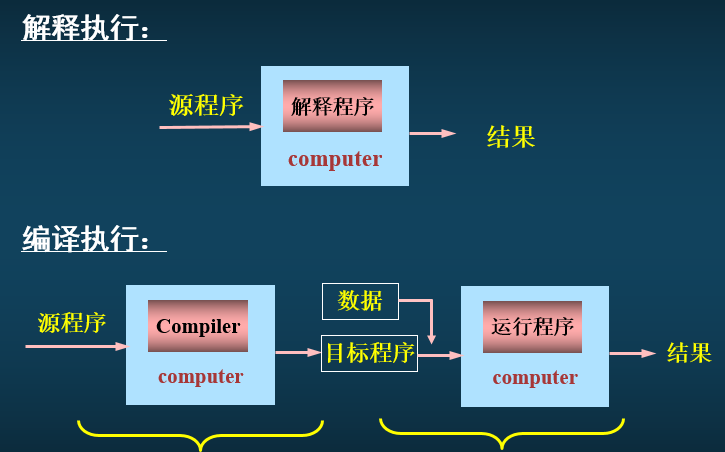
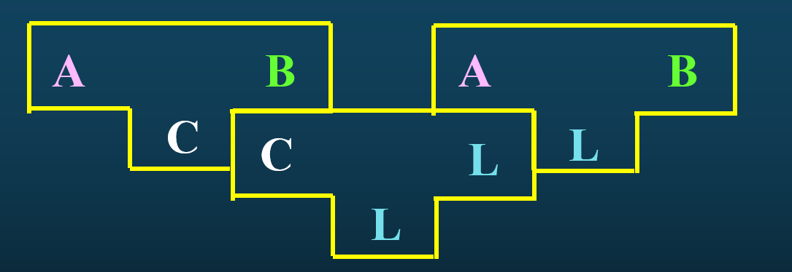
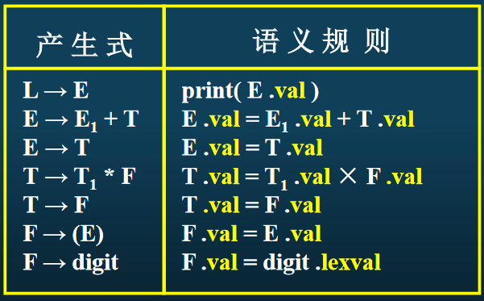
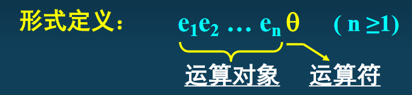

# 编译原理与设计

## 编程语言

### 发展历史

- 机器语言
- 汇编语言
- 高级程序设计语言，FORTRAN，SQL

### 分类

分类标准：描述方式

- 命令式：计算机如何完成工作
  - 面向对象语言
  - 面向过程语言
- 声明式：计算机要完成哪些工作
  - 函数式语言
  - 逻辑编程语言

分类标准：数据类型

- 静态类型：运行前类型检查，C, C++, and Java
- 动态类型：运行时类型检查，Python, Ruby
- 强类型：不允许隐式数据类型转换
- 弱类型：允许隐式数据类型转换

分类标准：实现方式

- 编译型
- 解释型

## 编译引论

编译器定义：将某一种程序设计语言写的程序翻译成等价的另一种语言的程序的程序,  称之为编译程序(compiler)。

几个概念

- 源语言：编写源程序的语言
- 源程序：编译器**输入**程序
- 目标语言：目标程序的描述语言
- 目标程序：编译器的**输出**程序
- 宿主语言：编译器的实现语言
- 宿主机：编译程序的运行环境

### 编译程序分类

编译程序可分为

- 解释程序：接受某语言的源程序将其直接翻译成目标代码且执行。
- 编译程序：接受某语言的源程序将其直接翻译成等价的目标代码，然后执行且允许重复执行。

### 编译程序的表示

#### 函数表示

T=C(S)

- T:目标程序
- C:编译程序
- S:源程序

#### T型图表示

联立表示

### 编译程序的逻辑结构

#### 词法分析（Lexical analysis）

识别源程序种具有独立意义的**源语言单词**，用特殊的数据结构对其属性进行表示和标注

输入：源程序L1

输出：属性字流L1

#### 语法分析（Syntax analysis）

依据语言文本规定的语法规则，对词法分析结果进行语法检查， 并识别出单词序列对应的语法范畴

输出：语法树

#### 语义分析（semantic analysis）与中间代码生成

依据语言文本限定的语义规则，对语法分析识别的语法范畴进行语义检查和处理，最后翻译成某种中间代码或目标代码

#### 代码优化 (optimization)

改进代码质量的工作

#### 目标代码生成

## 语义分析和中间代码生成

第一次对源程序的语义作出解释，引起源程序质的变化。任务是进行语义检查和处理，产生相应的中间代码或目标代码

### 语法制导翻译

为文法的每一个产生式配一个相应的语义子程序（或语义规则描述的语义动作），并在语法分析的同时调用它

#### 语法制导定义

翻译说明，将语义引入文法，每个文法符号都有一个与之相关的语义属性集合，分为综合属性和继承属性

- 继承属性：分析树中,如果一个结点的属性值是由该结点的**父结点和(或)兄弟结点**的属性定义的称为继承属性。
- 综合属性：分析树中,如果一个结点的属性值是通过**子结点**的属性值计算得到则称为综合属性。

### 中间语言

中间语言的设计和应用既要考虑从源语言到目标语言的翻译跨度，又要考虑目标机的指令集特点

#### 逆波兰表达式

#### N元式

N个域的记录结构

常用三元式（双地址指令形式）、四元式（三地址指令形式）

四元式定义参考如下

## 符号表

存放源程序中有关标识符的属性信息的数据结构，反映了标识符的语义特征属性，是翻译的依据，在整个编译过程中动态地采集、记录、变更、引用

作用

- 收集标识符属性信息
- 语义检查依据
- 代码生成时地址分配依据

结构

- 名字域

- 属性域

  常见属性有标识符、类型、存储类别、作用域