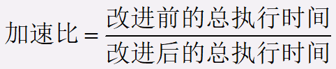
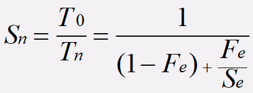
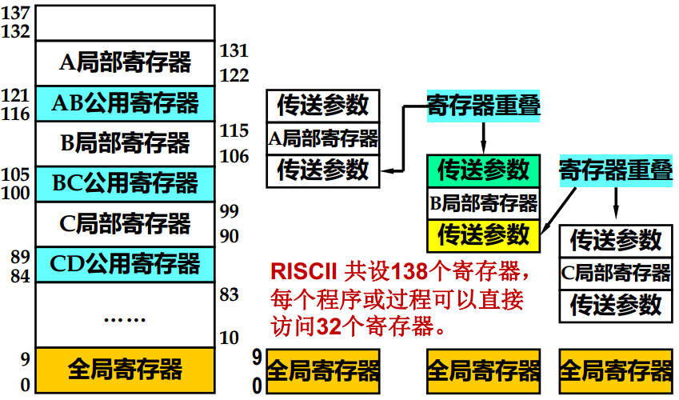
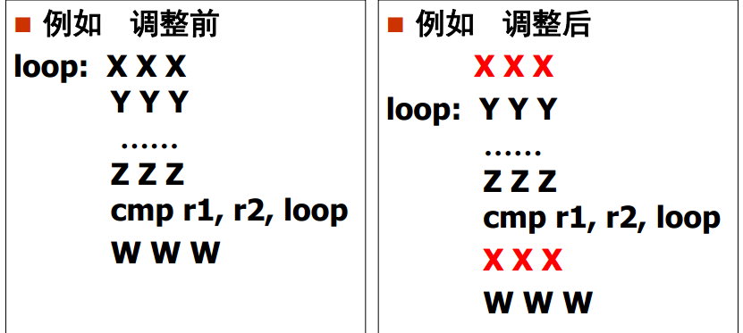
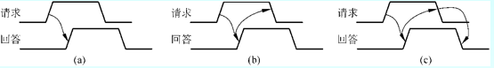
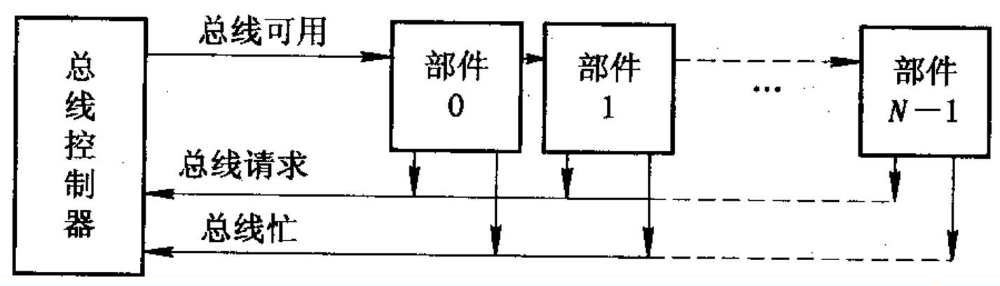

# 计算机体系结构

## 基本概念

### 系统结构、组成与实现

计算机系统=软件+硬件/固件

从使用语言的角度划分为多级层次结构

#### 计算机体系结构

指的是层次结构中传统机器级的系统结构

- 其界面之上的功能包括操作系统级、 汇编语言级、 高级语言级和应用语言级中所有软件的功能
-  界面之下的功能包括所有硬件和固件的功能

体系结构是是对计算机系统中各级界面的划分、定义及其上下的功能分配。

传统机器语言程序员看到的计算机属性，包括

- 数据表示
- 寻址方式
- 寄存器组织
- 指令系统
- 存储系统组织
- 中断机构
- 管态和用户态的定义和切换
- 机器级IO结构
- 信息保护方式和保护机构

#### 计算机组成

计算机系统结构的逻辑实现，包括机器内数据流和控制流的组成以及逻辑设计

- 数据通路宽度
- 专用部件的设置
- 各种操作对部件的共享程度
- 功能部件的并行度
- 控制机构的组成方式
- 缓冲和排队技术
- 预估、预判技术

#### 计算机实现

计算机组成的物理实现，主要着眼于器件技术和微组装技术  

#### 三者关系

- 系统结构要考虑组成和实现的发展
- 组成要考虑系统结构和实现，决定于系统结构，受限于实现
- 组成与实现不是被动的，折中权衡；  
- 实现是物质基础

### 软硬件取舍和计算机系统的设计思路

#### 设计的主要方法

分界面在传统机器级

- 由上到下
- 由下到上
- 中间开始

### 计算机设计的量化准则

Amdahl定律：系统中某一部件由于采用某种更快的执行方式后整个系统性能的提高与这种执行方式的使用频率或占总执行时间的比例有关  

- 加速比

   或

  等

- 系统加速比的依赖因素

  - 可改进比例Fe
  - 性能提高比Se

  
  
- 改进后的加速比为

  

- CPU性能公式

  - 时钟频率：主频

  - 指令时钟数CPI：每条指令执行所用的时钟周期数

  - IPC：每个时钟周期执行的指令数

  - 吞吐量：单位时间内处理请求的数量

  - 响应时间：系统对请求作出响应的时间（包括CPU时间和等待时间）

  - 指令速度：

    MIPS

    

    （吉普森法）

    

### 对系统结构的影响因素

软件可移植性的几种技术

- 统一高级语言

- 采用系列机思想

  同一厂家生产的具有相同的系统结构，不同组成和实现的一系列计算机系统。  

- 模拟与仿真

  模拟：机器语言-主存中

  - 宿主机
  - 虚拟机

  仿真：微程序-控存中

## 计算机设计的量化准则

## 指令与寻址

### 数据表示

常用数据典型有三类

- 用户定义的数据
- 系统数据
- 指令数据

体系结构研究的首要任务是：数据类型的实现方式（硬件？软件？）

#### 数据表示

可以被硬件直接识别和指令系统直接调用的数据类型

#### 数据结构

结构化数据的组织方式，反映了应用中各种数据元素或信息单元的结构关系，必须通过软件映像变换成机器中所具有的各种数据表示

#### 数据表示和数据结构的关系

- 数据结构是通过软件映像成机器所具有的各种数据表示实现的
- 数据表示是数据结构的组成元素
- 数据类型用数据结构或数据表示实现，实质是软硬件取舍问题

#### 引入数据表示的原则

- 缩短程序运行时间
- 减少CPU与主存储器之间的通信量
- 这种数据表示的通用性和利用率是否很高

### 寻址方式

体系结构研究重点：分析各种寻址技术的优缺点，选择和确定寻址技术

### 指令系统的设计和优化

指令=操作码+地址码

操作码主要包括两部分

- 操作种类
- 操作数描述

地址码通常包括三部分

- 地址
- 地址附加信息
- 寻址方式

#### 指令操作码优化

目的：使操作码字段占用的位数最少

- 信息源熵的概念

  - 信息源包含的平均信息量

  - 对于操作码就是操作码的最短平均码长

  - 计算公式为

    

- 信息冗余量

  

- 实际平均码长

  

三种编码方式（建议找题自己算一算）

- 固定长度编码
- Huffman编码
- 扩展编码

#### 指令地址码优化

- 用比较短的地址表示比较大的虚拟空间
- 可变长操作码与可变长地址码配合

### 指令系统的改进与发展

两种方向

- 增强指令系统功能（软件功能硬化，CISC）
- 简化指令系统（精简指令，RISC）

#### 按照CISC方向改进指令系统

目标：强化指令功能，减少指令条数

- 面向目标程序的优化实现

  方法

  - 利用哈夫曼思想改进指令
  - 增设强功能复合指令

- 面向高级语言的优化实现

  方法

  - 统计使用频度来改进指令
  - 面向编译、优化代码生成来改进指令，增强指令系统的规整性
  - 缩小指令系统与各种语言的语义差异
  - 让机器具有多种指令系统
  - 发展高级语言计算机

- 面向操作系统的优化实现

  方法

  - 统计使用频度来改进指令
  - 增设专用于OS的新指令
  - 用硬件或固件实现OS的某些功能
  - 由专门处理机完成OS

CISC存在的问题

- 日益庞大复杂的指令系统实现越来越困难，可能降低系统性能
- 最常使用的是一些比较简单的指令，仅占指令总数的20%，剩下的是使用频度很低的指令
- 复杂指令使指令的执行周期大大加长
- 增强了指令系统功能，简化了软件，但硬件变复杂了
- 规整性不足

#### 按照RISC方向改进指令系统

设计基本原则

- 只选用频度很高的指令和关键指令，条数很少
- 减少寻址方式的种类
- 简化指令格式，限制在两种内，且具有**相同长度**
- 所有指令在**一个机器周期**内完成
- 扩大通用寄存器个数，一般大于等于32
- 尽可能减少访存，仅Load和Store指令可以访问存储器
- 大部分指令通过硬联控制，提高速度
- 优化设计编译程序，以简单有效方式支持高级语言实现

注意，**减少CPI**使RISC的精华

优点

- 简化了指令系统设计，适合VLI实现
- 提高了执行速度和效率
- 降低了成本，提高了可靠性
- 提供直接支持高级语言的能力，简化了编译程序设计

缺点

- 增大了程序占用空间，加重了汇编程序员负担
- 对浮点运算和虚拟存储器支持不够理想
- 较难编写

#### 设计RISC的关键技术

- 重叠寄存器窗口技术

  减少因传送参数而访问存储的次数

  让每个过程使用一个有限数量的寄存器窗口，并让各过程窗口部分重叠

  

- 流水线技术

  本条指令的执行与下一条指令的预取**重叠**

  

- 延迟转移技术

  为避免无条件转移指令或成功条件转移指令造成指令预取浪费，流水线断流等问题，采用延迟转移，即在**转移指令后**插入一条不相关的有效指令

  限制条件

  - 被移动的指令在移动过程中与经过的指令不能有数据相关
  - 被移动的指令不破坏条件码

- 指令取消技术

  采用指令延迟时，许多情况下找不到可调整的指令，故采用指令取消技术，

  - 向后转移（循环程序）

    循环体第一条指令经过调整后安排在两个位置

    - 循环体前
    - 循环体后，转移成功时执行

    

  - 向前转移（if-then)

    方法：如果转移不成功执行下一条指令，否则取消下一条指令

  - 隐含转移

    场合：用于if-then，且then部分只有一条指令

    方法：if条件取反，如果取反后条件成立则取消下条指令，否则执行

- 指令流调整技术

  通过变量重新命名消除数据相关，提高流水线执行效率

  

- 优化编译系统设计的技术

  RISC使用了大量寄存器，编译程序必须优化寄存器的分配和使用

## 输入输出系统

主要功能是对指定外设进行输入输出操作

### 概述

特性

- 异步性：各设备按照自己的时钟工作
- 实时性：处理机必须及时处理设备
- 与设备无关性：独立于具体设备的标准接口，外设通过标准接口与其连接

组织方式

- 针对**异步性**，采用自治控制

  输入输出系统独立于处理机之外

- 针对**实时性**，采用层次结构

  - 最靠近处理机的是输入输出处理机、输入输出通道等。
  - 中间层是标准接口
  - 标准接口通过设备控制器与输入输出设备相连
  - 设备控制器控制外围设备工作

- 针对**与设备无关性**，采用分类处理

三个发展阶段，对应三种方式

- 程序控制输入输出
- 直接存储器访问（DMA）
- I/O处理机方式

### 磁盘阵列RAID

独立冗余磁盘阵列

- RAID0：无冗余无校验的磁盘阵列

  所有磁盘并行工作，各自读出对应部分，不提供数据冗余

- RAID1：镜像磁盘阵列

  每次写入数据时，都会将数据复制到其镜像盘上。

- RAID2：纠错海明码磁盘阵列

  每个数据盘存放数据字的一位，还需要3个磁盘来存放海明校验位

- RAID3：位交叉奇偶校验的磁盘阵列

  RAID2的简化版本，校验盘专门存放数据盘中相应数据的奇偶校验位

- RAID4：块交叉奇偶校验的磁盘阵列

  以块为单位进行交叉存储和计算奇偶校验

- RAID5：无独立校验盘的奇偶校验磁盘阵列

  每一行数据块的校验块被均匀存放到不同盘中

- RAID6：双维无独立校验盘的奇偶校验磁盘阵列

  增加了第二个独立的奇偶校验信息块

影响RAID级别选择的因素为：可用性、性能、成本

- 选择RAID0获得最佳性能
- 如果成本不是主要因素，根据硬盘数量可选择RAID1

### 总线设计

总线特点

- 总线是一组能为多个部件**分时共享**的公共信息传送线路

总线事务：在总线上一对设备间一次信息交换过程，通常包括两个阶段，地址阶段和数据阶段

- 主设备：发出总线事务请求，获得总线使用权
- 从设备：与主设备进行信息交换的对象

总线周期：完成一次总线操作的时间

#### 总线类型

按信息传输方向，总线可分为

- 单向传输
- 双向传输
  - 半双向
  - 全双向

按用法可分为

- 专用
- 非专用

#### 总线的数据宽度

数据宽度是I/O设备取得I/O总线后所传送**数据的总量**

- 单字（单字节）宽度适合于低速设备。
- 定长块宽度适合于高速设备，可以充分利用总线带宽。
- 变长块宽度适合于高优先级的中高速设备
- 单字加定长块宽度适合于速度较低而优先级较高的设备
- 单字加变长块宽度是一种灵活有效但却是复杂、花钱的方法

#### 总线的线数

在满足性能要求以及所用通信类型和速率适配的情况下，应尽量减少总线的线数。

#### 总线的性能指标

- 总线宽度。指总线的线数，地址线和数据线的数量有最直接的影响

- 总线带宽，总线最大数据传输速率

  总线带宽=总线宽度×总线频率

- 总线负载：指连接在总线上的最大设备数量

- 总线复用：不同时段利用总线的同一信号线传送不同信号

- 总线猝发传输

#### 总线定时控制

- 同步定时方式

  采用一个统一的时钟信号协调发送和接收方，时钟产生相等的时间间隔，每个间隔构成一个总线周期，在 一个总线周期内，可以进行一次数据传送。

  必须适应延迟最长和最慢的接口的需要

- 异步定时方式（应答方式）

  通过双方握手信号实现定时控制，可保证工作速度相差大的部件进行信息交换

  有三种情况

  - 不互锁：请求和回答信号都有一定时间宽度
  - 半互锁：请求信号的撤销取决于收到回答信号
  - 全互锁：请求信号的撤销取决于收到回答信号，又导致回答信号的撤销

  

#### 总线通信技术

- 同步通信

  同步通信时两个部件之间信息传送时通过定宽、定距的系统时标进行的

- 异步通信

  异步通信又可分为单向控制和双向(请求/回答)控制两种。

  - 单项控制是指通信过程中只由目的或源部件中的一个进行控制

#### 总线控制方式

当采用非专用总线时，由于可能同时有多个设备同时申请使用总线，需要按照优先级进行裁决

- 总线的集中仲裁方式

  总线控制机构中设置总线判优和仲裁控制逻辑，集中在一处

  - 链式查询方式

    使用三根控制线与所有部件和设备相连

    

    

    - 总线请求BR：有效表示至少有一个部件或设备要求使用总线
    - 总线忙BS：有效表示总线正被某部件或设备使用
    - 总线批准（总线可用）：有效表示总线控制器相应总线请求

    缺点是对查询链电路故障敏感

  - 计数器定时查询方式

    

  - 独立请求方式

    

    共需2n+1个控制线

- 总线的分布仲裁方式

  总线控制逻辑分布到总线各个部件中，每次总线操作，只能有一个主方占用总线控制权，但同一时间里可以有一个或多个从方。

  - 自举分布式

    设备优先级固定，请求总线控制权设备会在总线请求线上发送请求信号，同时可从总线上接受请求信号，如果检测到优先级更高的设备发起了请求，则不可以使用总线，否则立刻使用，并向其他设备发送总线忙信号

  - 冲突检测分布式

    设备先侦听总线是否忙，如果不忙则置总线忙，并使用总线。

    如果发生冲突，则延迟一个随机时间后再使用总线以避免冲突

  - 并行竞争分布式

    每个设备都有一个唯一的**仲裁号**，用于并行竞争算法中，每个设备根据仲裁算法决定在一定时间后时占用总线还是撤销总线

### 通道处理机

工作原理：将对外围设备的管理工作从CPU分离出来

- 在用户程序中使用访管指令进入管理程序，由CPU通过管理程序组织一个通道程序并启动通道
- 通道处理器执行通道程序，完成指定的数据输入输出工作
- 通道程序结束后第二次调用管理程序对输入输出请求进行处理

#### 通道类型

- 字节多路通道

  用于连接管理多台**低速设备**，包含多个子通道，每个子通道连接一个设备控制器

  

  通道轮流为每个设备传送一个字节

- 选择通道（高速通道）

  可连接多个不同时工作的是被，一次只能执行一个通道程序，完成信息交换后才会执行另一通道程序。只有一个以成组方式工作的子通道，逐个为多台外设服务

  

- 数组多路通道

  结合字节多路通道和选择多路通道的特点，当某设备进行数据传输时，只为该设备服务，当设备在进行辅助操作时，通道暂时挂起该设备的通道程序，为其他设备服务。

  有多个子通道，既可以所有子通道分时共享总通道，也可以成组传送数据。

#### 通道数据传输过程

通道流量：单位时间内能够传送的最大数据量

通道最大流量：通道在满负荷工作状态下的流量

选择一次设备的时间Ts，传送一个字节的时间Td，传输n个字节，每个设备传送k个

三种通道的最大流量为：

总数据传输率为

## 存储体系

### 存储体系概念和并行存储系统

存储系统：**两个或两个以上**的速度、容量、价格不同的 存储器采用硬件，软件或软、硬件结合的办法联接成的一个系统。

主要性能指标

- 容量

  Sm=W * L * m

  W存储体字长，L存储体字数，m存储体个数

- 速度

  - 访问时间TA：存储器从街道访存申请到开始读数据的时间
  - 存储周期TM：存储器进行一次存取所需要的时间
  - 频宽BM：存储器提供的数据传输率

- 价格

在三个性能指标中，字数、TA、TM主要与器件工艺有关，字长和存储体个数则由系统设计者确定。三者存在矛盾，可以以下措施解决

- 改进工艺和技术
- 构成并行主存系统
- 使用存储器系统（主存、辅存）
- 存储体系

#### 并行存储系统

在一个存储周期内可以访问到多个数据，从而提高主存频宽。

可分为

- 单体单字

  有一个字长为W位的存储器，一次可以访问一个字，最大频宽为BM=W/TM

- 单体多字

  增加存储器字长，在一个贮存周期中读出多个CPU字

- 多体单字交叉存储器

  由多个容量较小、字长较短的相同存储器芯片组成，每个存储器字长都是CPU字长，让多个存储体并行工作

  CPU字在主存中可以按模m交叉编址

  - 高位交叉：用地址码的高位部分区分存储体号

    扩大存储器容量

  - 低位交叉：用地址码的低位部分区分存储体号

    提高存储器访问速度

- 多体多字交叉存储器

  结合多体单字和单体多字的特点

#### 存储体系

对应用程序员透明，速度接近最快的存储器，容量接近最大的存储器

- T ≈ min(T1, T2, …, Tn)，用存储周期表示 
- S ≈ max(S1, S2, …, Sn)，用MB或GB表示
- C ≈ min(C1, C2, …, Cn)，用每位的价格表示

存在两种分支

- 虚拟存储系统：解决容量问题

  主存-辅存存储层次，利用了IO处理和CPU**并行**操作的能力，速度接近主存，容量是辅存

  对**应用程序员**透明

- Cache存储系统：解决速度问题

  Cache-主存存储层次，速度是Cache的，容量是主存的

  对**应用程序员**和**系统程序员**都透明

存储层次间传送数据需要预判，其基础是程序的局部性

- 时间局部性：循环导致
- 空间局部性：顺序执行导致

可得出如下结论：

- 不必存放整个程序，只需要存放近期使用过的块或者页即可
- 调入时，一并把数据所在的块或页一起调入

两个原则

- 一致性原则
- 包含原则

#### 存储体系的性能参数

以二级存储体系为例

- 每位价格c

- 命中率H（CPU产生的逻辑地址能在M1中访问到的概率）

  可以利用程序的局部性原理，采用**预取**技术，将相邻n个数据取入M1，不命中率会降低n倍

- 等效访问时间TA

  - 对M1和M2的访问同时启动
  - 对M1和M2的访问不是同时启动
  - 访问效率：TA1/TA

### 虚拟存储系统

### 高速缓冲存储器