# 计算机组成原理

## 概论

### 存储程序

存储程序概念：

- 计算机由运算器、存储器、控制器、输入设备和输出设备五大基本部件组成
- 计算机内部采用二进制表示指令和数据
- 将程序和原始数据事先存入**存储器**中，再启动计算机工作（存储程序基本含义）

### 计算机硬件组成


几个概念 

- 中央处理器CPU：运算器+控制器
- 主机：CPU+主存储器
- 外设：除主机外的硬件装置

#### 输入设备

把人们编好的程序和原始数据送到计算机中去，并且将它们转换成计算机内部所能识别和接受的信息方式。常用的有键盘、鼠标、扫描仪等。

#### 输出设备

将计算机的处理结果以人或其他设备所能接受的形式送出计算机。常用的有显示器、打印机、绘图仪等。  

#### 存储器

用于存放程序和数据的部件，是计算机实现**存储程序控制**的基础

具有三级存储系统如下所示


从高到低，速度递减，容量递增，价格递减

- Cache：CPU直接访问，存放当前正在执行程序中的**活跃部分**
- 主存储器：CPU直接访问，存放当前执行的程序和数据
- 辅助存储器：位于主机外部，CPU不可直接访问，存放暂不参与运行的程序和数据

#### 运算器

对信息进行处理和运算的部件，经常进行的运算是算术运算和逻辑运算，因此运算器的核心是**算术逻辑运算部件ALU**。

运算器中有若干寄存器

#### 控制器

控制器是整个计算机的**指挥中心**。  

主要包括时序控制信号形成部件和一些专用的寄存器  

### 各大部件之间的连接

#### 总线结构

总线(Bus)是一组能为多个部件服务的公共信息传输线路，可分时发送与接收各部件的信息

特点：分时、共享

以单总线结构为例


单总线指的是一组总线，按传递信息的不同可分为

- 地址总线：单向多根信号线，CPU向主存、外设传输地址信息
- 数据总线：双向多根信号线，在CPU和主存、外设间传输数据
- 控制总线：双向多根信号线，CPU送出控制命令，主存、外设反馈状态信号

#### 中、大型计算机典型结构

通道是承担IO操作管理的主要部件。

主机可以连接多个通道，每个通道可以接一台或几台设备控制器，每个设备控制器又可接一台或几台外部设备。

### 冯·诺伊曼结构和哈弗结构的存储器设计对比

#### 冯·诺依曼结构


#### 哈佛结构

程序指令存储和数据存储分开

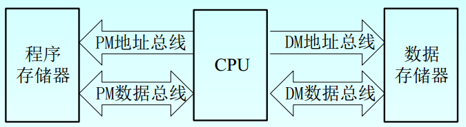

### 计算机系统

计算机系统=硬件系统+软件系统

#### 软件与硬件关系

硬件和软件向着相互融合的方向发展，对于程序设计人员在逻辑上是等价的

- 硬件软化：软件实现原硬件操作，增强系统功能与适应性
- 软件硬化：硬件实现原软件操作，缩减时间开销

**固件**是存储在永久保存信息器件（如ROM）中的程序，是**具有软件功能的硬件**

#### 系列机和软件兼容

系列机是由同一厂家生产，具有相同系统结构和不同组成的一系列不同型号的机器

软件兼容：

- **向上兼容**，更重要
- 向下兼容
- 向前兼容
- **向后兼容**，更重要


#### 计算机系统的多层级结构

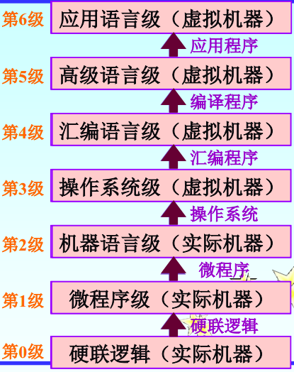

对于实际机器级的用户，可将该机器级看作使用特有机器语言的机器

虚拟机器是指以软件或以软件为主实现的机器

### 计算机主要性能指标

- 机器字长：参与运算的数的基本位数，是指令操作的单元

- 数据通路宽度：数据总线一次能并行传送的位数

- 主存储器所能存储的全部信息量

  - 字节数：对于**字节编址**的计算机
  - 字数*字长：对于**字编址**的计算机

- 运算速度

  - 吞吐量和响应时间

    吞吐量是指系统在单位时间内处理请求的数量

    响应时间包括CPU运行时间和等待时间

  - 主频(CPU时钟周期)

    主频的倒数就是CPU时钟周期，表示CPU内数字脉冲信号振荡的速度

  - CPI

    即每条指令执行所用的时钟周期数

  - MIPS和MFLOPS

    MIPS表示每秒百万条指令数

    MFLOPS表示每秒百万次浮点运算

    

## 数据的机器层次表示

### 数值数据的表示

数制：

- 十进制数（D）
- 二进制数（B）
- 八进制数（Q）
- 十六进制数（H）

#### 原码表示法

最高位表示符号位，数值部分与真值相同

- 符号位为0表示该数为正
- 符号位为1表示该数为负

若真值为小数，则原码形式为`Xs.X1X2...Xn`，其中Xs表示符号位

若真值为整数，则原码形式为`XsX1X2...Xn`，其中Xs表示符号位

注意：在原码表示中，真值0有两种不同的表现形式

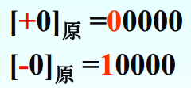

直观，乘除运算规则简单，但加减运算规则复杂

#### 补码表示法

克服原码在加减运算中的缺点

最高位为符号位，

- 符号位为0表示该数为正，数值部分与真值相同
- 符号位为1表示该数为负，数值部分为真值**取反加1**

在补码表示中，真值0的表示方式唯一

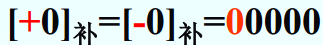

#### 反码表示法

最高位为符号位，

- 符号位为0表示该数为正，数值部分与真值相同
- 符号位为1表示该数为负，数值部分为真值取反

在原码表示中，真值0有两种表示方式

#### 比较

- 对于正数等于真值本身，对于负数各有不同表示
- 最高位都表示符号位，补码反码符号位参与运算，原码符号位分开处理
- 对于真值0，补码有唯一表示形式，原码和反码各有两种
- 原码、反码表示的**正负数范围对称**，但补码能多表示一个最小的负数

### 机器数的浮点表示

小数点位置根据需要浮动，如


- r位浮点数阶码的底，通常r=2
- E叫阶码，带符号数，**纯整数**
- M为尾数，带符号数，**纯小数**

一般格式


- es：阶码符号位
- ms：尾数符号位

#### 浮点数表示范围

n和k已在一般格式中说明（补码形式）

- 当es=0，ms=0，阶码和尾数数值全为1

  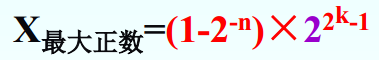

- 当es=1，ms=0，尾数的最低位mn=1，其余各位为0

  

- 当es=0，ms=1，阶码数值为全为1，尾数数值位全为0

  

#### 规格化浮点数

为了提高运算**精度**，规定**尾数最高数位**必须是一个有效值，即


- 尾数原码表示时，规格化浮点数的尾数最高位总等于1

- 尾数补码表示时，尾数最高位应与符号位不同

  注意，当M=-1/2，对原码来说是规格化数，对补码却不是规格化数

对于补码而言，各类数可参考如下表格


#### 浮点数阶码的移码表示法

移码就是在真值X上加一个**偏置值**

对于字长为n+1为定点整数，需加上长度为2^n次的偏置值，示例如下：


偏置值为2^n次的移码具有以下特点

- 最高位为0表示负数，最高位为1表示正数
- 移码全为0时，对应的真值最小，全为1时对应真值最大
- 真值0在移码中的表示形式是唯一的，即1000...0
- 可将移码视为无符号比较大小
- 同一真值移码和补码只有最高位相反

#### IEEE754标准浮点数

重点关注短浮点数（32位）

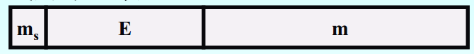

- 最高位为数符
- E为8位阶码，偏置值为127
- 尾数m有23位，原码表示，**隐含尾数最高位为1**

#### 与定点表示法的区别

假设字长相同

- 浮点数表示**范围**远大于定点数
- 定点数表示的点在数轴上分布是均匀的，浮点数表示的点越靠近原点越密
- 浮点数的**精度**低于定点数
- 浮点数运算更复杂

不是所有计算机都有浮点运算能力

- 定点机：浮点运算通过软件实现
- 定点机＋浮点运算部件 ：浮点运算部件FPU专门进行浮点运算
- 浮点机：具有浮点运算指令和基本的浮点运算器  

### 非数值数据的表示

#### ASCII字符编码

7位二进制表示一个字符，共计128个

#### 字符串存放方法

- 向量法：占用连续空间
- 串表法：每个字符代码后有一个链接字，指向下一字符地址

#### 汉字的表示方式

- 区位码：汉字划分位94个区，每个区94个汉字，每个汉字对应二维数组中唯一一个区位码
- 国标码：国标码=区位码+2020H
- 机内码：因为国标码会与ASCII产生二义性，故使用机内码，机内码＝国标码＋8080H  
- 字形码：汉字字形点阵代码

#### 统一代码Unicode

### 十进制数和数串的表示

用四位二进制数表示一位十进制数，简称**BCD码**，具有多种BCD码：

- 8421码
- 2421码，还是对9的自补码（按位取反后即可获得该数对9互补的2421码）
- 余3码，无权码，在8421码基础上+0011形成，也是对9的自补码
- 格雷码，无权码，与相邻的数码只有一个二进制位状态变化，首位两个格雷码也只有一个二进制位不同，有不同方案

可将十进制数组织为数串，有两种形式

- 非压缩的十进制数，一个字节存放一个十进制数，分两种
  - 前分隔式数字串：符号在数值位之前占用单独一个字节，正号为2BH，负号为2DH
  - 后嵌入式数字串：符号不再占用一个字节，正数最末位不变，负数最末位加上40H
- 压缩的十进制数，一个字节存放两个十进制数，符号位占半个字节，存放在最低数值位之后，正号为CH，负号为DH，若总位数不为偶数，需要在最高数值位前补零

### 数据校验码

数据校验码是指那些能够发现错误或能够自动纠正错误的数据编码

其原理是：在编码中，除了合法的码字之外再加入一些非法的码字，合理安排非法码字的数量和编码规则。

码距是指任意两个合法码字间最少变化的二进制位数。从2开始码距具有检错功能，码距越大，检错、纠错能力越强，且检错能力总大于等于纠错能力。

#### 奇偶校验码

可以检测出**奇数位**错误，码距等于2

奇偶校验码(N+1位)=N位有效信息+1位校验位

- 奇校验，整个校验码中1的个数为奇数，即当有效信息中有奇数个1时，校验位为0
- 偶校验，整个校验码中1的个数为奇数，即当有效信息中有偶数个1时，校验位为0

但是这种形式的奇偶校验码无法确定错误位置

**交叉奇偶校验**：不仅对每一字节进行奇偶校验，还对全部字节的同一位进行奇偶校验，可以发现有两位同时出错的情况

#### 海明校验码

实质为**多重奇偶校验**，实现原理为：在有效信息位中加入几个校验位形成海明码，并将海明码的每一个二进制位分配到几个奇偶校验组中。当某一位出错，会引起有关几个奇偶校验位的值变化。

以下介绍能纠正一位错误、发现两位错误的海明码编码原理，此时校验位的位数K和信息位的位数N应满足下列关系：2^(K-1)>=N+K+1

1. 编码（设信息位为8位，校验位为5位）

   海明码总数13位，具体排列如下

   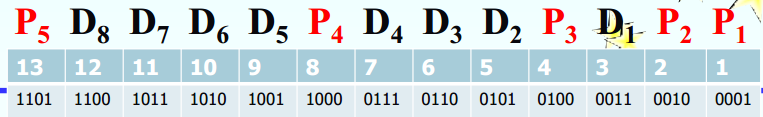

   校验位P只能放在2的幂次位或最高位上，各信息位形成Pi值的偶校验结果

   

   注意所选取的异或位的规则，即Pi对应的1的位也需要为1

   这时由于不同信息位在Pi中出现次数不同，需要在P5校验位中做补充

   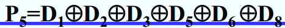

2. 校验

   将接收到的海明码按如下关系进行偶校验

   

   - 若S5-S1为00000，表明无错
   - 若S5-S1中仅有一位不为0，表示某一校验位或三位海明码同时出错
   - 若S5-S1中有两位不为0，表明两位海明码同时出错，但无法确定出错位置
   - 若S5-S1中有三位不为0，表明一位信息位出错或三位校验位同时出错，此时可以准确定位错误
   - 若S5-S1中有三位以上不为0，表明出错严重

## 指令系统

### 指令格式

指令由操作码和地址码构成

- 操作码：指明操作的性质及功能  
- 地址码：指明操作数的地址，特殊情况下也可能直接给出操作数本身  

指令长度应该：

- 尽可能短
- 等于字节的整数倍

指令系统可分为

- 定长指令字结构
- 变长指令字结构

#### 地址码结构

以双操作数指令为例

地址码中应包括以下信息：

- 第一操作数地址A1
- 第二操作数地址A2
- 操作结果存放地址A3
- 下一条要执行的指令的地址A4

其中可以在指令中明显给出，称为**显地址**，也可以按照约定以隐含方式给出，称为**隐地址**

按显地址个数可分为以下结构

- 四地址指令
- 三地址指令，使用程序计数器PC存放当前指令地址，会按照规则自加以指向下一条指令。需要4次访问主存
- 二地址指令，A1中原存放的内容在指令执行后被破坏，存放操作结果。需要4次访问主存
- 一地址指令，使用累加寄存器存放原操作数和操作结果。需要2次访问主存
- 零地址指令，操作数地址隐含，存放在**堆栈**中，运算结果也存放在堆栈中

地址个数选取考虑的因素

- 从缩短程序长度，用户使用方便，增加操作并行度等方面来看，选用三地址指令格式较好
- 从缩短指令长度，减少访存次数，简化硬件设计等方面来看，一地址指令格式较好。 

#### 操作码结构

可分为

- 规整型：定长编码，可简化硬件设计、减少译码时间，但存在信息冗余
- 非规整型：变长编码

在设计编码时，要注意

- 不允许短码是长码的前缀
- 操作码不可重复雷同

建议做题体会

### 寻址技术

#### 编址方式

按编址单位可分为

- 字编址：编制单位所包含信息量与读写一次寄存器、主存获得的信息量相同
- 字节编址：编址单位与信息基本单位一致，编址单位<访问单位
- 位编址

指令格式中地址码位数与主存容量和最小寻址单位有关

#### 数据寻址与指令寻址

- 数据寻址：寻找操作数
- 指令寻址：寻找下一条指令，可分为顺序寻址（程序计数器PC）和跳跃寻址（程序转移类指令）

#### 基本的数据寻址方式

寻址方式可分为

- 立即寻址

  

  取指令时同时取出操作数，不必再访问存储器。

- 寄存器寻址

  

  指令地址码给出某一通用寄存器编号，寄存器存放操作数，无需访问主存

- 直接寻址

  

  地址码给出主存中操作数有效地址，又称为绝对寻址方式，需访问一次主存

- 间接寻址

  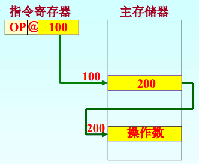

  指令中给出的地址码存放操作数的地址，通常会在指令格式中划出一位作为标志位。需访问两次主存。

  除了一级间接寻址，还可以进行多级间接寻址，需要多次访问主存，注意标志位

  

- 寄存器间接寻址

  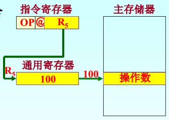

  指令中地址码给出寄存器编号，寄存器中存放操作数地址，需要访问一次主存、

- 变址寻址

  

  将指令给出的形式地址A与变址寄存器Rx内容相加，形成操作数有效地址

  将指令中的地址作为基准地址，变址寄存器Rx内容作为修改量

  面向**用户**，用于访问字符串、数组等成批数据

- 基址寻址

  

  将基址寄存器Rb的内容与位移量D相加形成操作数有效地址

  将基址寄存器Rb的内容作为基准地址，指令中的地址作为修改量

  面向**系统**，用于地址变换和程序的重定位

- 相对寻址

  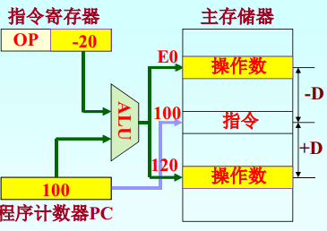

  基址寻址的一种变通，由程序计数器PC提供基准地址

  操作数地址随PC值变化而变化，使用PC相对寻址方式编写的程序可在主存中任意浮动，又叫**浮动寻址**

- 页面寻址

  将主存空间划分为若干大小相同的页，每页有自己的编号，称为页面地址，页面内部的主存单元编号称为页内地址，有效地址=页面地址||页内地址

  - 基页寻址（零页寻址）：

    页面地址默认为0，指令地址码仅包含页内地址

    有效地址=(0)||A

  - 当前页寻址

    页面地址等于程序计数器PC的高位部分，指令地址码仅包含页内地址

    有效地址=(PC)H||A

  - 页寄存器寻址

    页面地址取自页寄存器，指令地址码仅包含页内地址

    有效地址=(页寄存器)||A

  部分计算机在指令格式中设置了标志位

  - 标志位=0，零页寻址
  - 标志位=1，当前页寻址

寻址速度（由快到慢）：

立即寻址、寄存器寻址、直接寻址、寄存器间接寻址、页面寻址、变址寻址(基址寻址、相对寻址)、一级间接寻址、多级间接寻址

注意：若一条指令含两个或以上的地址码，各地址码可采用不同寻址方式

### 堆栈与堆栈操作

#### 堆栈结构

按构成堆栈的方法可分为

- 寄存器堆栈（硬堆栈）

  由一组专门存储器组成，栈顶固定，组内各寄存器相互连接，具有自动推移功能

  

- 存储器堆栈（软堆栈）

  从主存中划出一段区域作为堆栈，栈底固定，栈顶浮动，需要专门的硬件寄存器作为**栈顶指针SP**

  栈底地址**大于**栈顶地址，通常SP始终指向栈顶满单元。

  用于访问堆栈的指令只有进栈和出栈两种

  进栈时：

  - (SP)-1→SP      修改栈指针
  - (A)→(SP)         将A中数据压入栈内

  出栈时：

  - ((SP))→A         将栈顶内容送入A中
  - (SP)+1→SP     修改栈指针

#### 堆栈操作

参与逻辑运算的两个数隐含地从栈顶弹出，送到运算器中进行运算再隐式送入堆栈，这类操作没有地址部分，称为**零地址指令**

### 指令类型

#### 数据传送类指令

- 一般传送指令（MOV），数据复制，将数据从源地址传送到目的地址

  比如MOV mem1，mem2指(mem2)→mem1

- 堆栈操作指令，分为进栈（PUSH）和出栈（POP）

- 数据交换指令，将源操作数和目标操作数互相交换位置

#### 运算类指令

- 算术运算指令

- 逻辑运算指令

  - 按位测（检查）

    

  - 按位清（清除）

    

  - 按位设置

    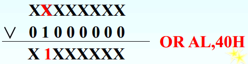

  - 按位异或

    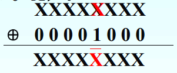

  - 判符合与清零

    

    若两数相符合，则异或后结果必为0

- 移位指令

  - 算术移位，对象是带符号数，移位过程中保持操作数符号不变
  - 逻辑移位，对象是没有数值含义的二进制代码，缺位用0补充
  - 循环移位，按进位C是否参与循环分为小循环（不带进位）和大循环（带进位）

#### 程序控制类指令

控制程序的执行逻辑

- 转移指令

  控制程序执行方向，分为

  - 无条件转移（JMP）
  - 条件转移

  转移指令必须给出转移地址（可以是绝对地址也可以是相对地址）

  对于条件转移，条件是以某些标志位或标志位的逻辑运算作为依据，

- 子程序调用指令

  子程序是一组可以公用的**指令序列**，只要知道入口地址就可以调用

  - 转子指令CALL：从主程序转子程序，是一地址指令
  - 返回指令RET：从子程序转向主程序

  注意主程序和子程序是相对的概念

  子程序嵌套和递归的概念

  - 子程序嵌套

    

    可以使用堆栈保存返回地址

  - 子程序递归

    

    可以使用堆栈保存返回地址

  保存返回地址的方法除了堆栈，还有以下两种

  - 用子程序第一个字单元存放返回地址，子程序从第二个字单元开始执行。

    返回时采用间接寻址方式从第一个字单元返回主程序。

    可实现嵌套，**不可实现递归**

  - 用寄存器存放返回地址

    转子指令将返回地址放到某一寄存器中，子程序会将寄存器内容转移到另一处。

    可实现递归调用

- 返回指令RET

  子程序最后一条指令一定是返回指令

  如果保存在堆栈中，则是零地址指令

#### 输入/输出类指令

实现主机和外部设备的之间的信息交换，分为

- 独立编址I/O

  外设与主存单元分别独立编址,指令系统中有专门的IO指令

- 统一编址I/O

  外设与主存单元同一编址，没有专门的IO指令

### 指令系统的发展

CISC:复杂指令系统计算机
RISC:精简指令系统计算机

## 数值的机器运算

### 基本算数运算的实现

#### 加法器

核心是全加器FA，结构如下图所示


- 输入量：操作数Ai和Bi、低位传来的进位Ci-1
- 输出量：本位和Si、向高位的进位Ci

其实现的逻辑表达式为

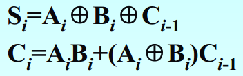

加法器可分为两种，分别是串行加法器（只有一个全加器）和并行加法器，并行加法器是重点

#### 并行加法器

由多个全加器组成，位数的多少取决于数字子长，各位并行运算

提高并行加法器速度的关键是尽量**加快进位的产生和传递的速度**

进位表达式如下所示

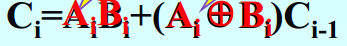

替换为如下形式


- 进位产生函数Gi
- 进位传递函数Pi

##### 串行进位

将n各全加器串联，可进行两个n位数相加，每一级进位直接依赖于前一级的进位 

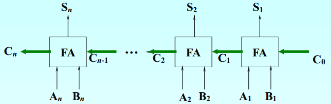

总延迟时间与字长n成正比，假定一级门的延迟时间为ty，形成一级进位的延迟时间为2ty，从C0到Cn最长延迟时间为**2nty**

#### 并行加法器的快速进位

##### 并行进位方式

各级进位信号同时形成

对于n=4的情况，进位C可同时生成


随着位数增加，C的逻辑表达式会变得非常复杂

##### 分组并行进位

将n位字长分为若干小组，在组内实施并行快速进位，组间实施串行进位或并行进位

- 单级先行进位方式

  组内并行，组间串行，以下以16位加法器为例

  

  同一组内进位信号同时产生，各C信号产生时间参考如下

  

- 多级先行进位方式

  组内并行，组间串行，同样以16位加法器为例

  第一小组最高位进位公式如下

  

  以此类推

  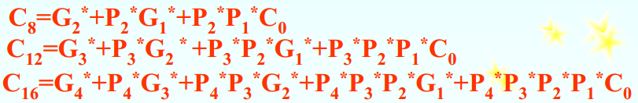

  可设计电路结构如下

  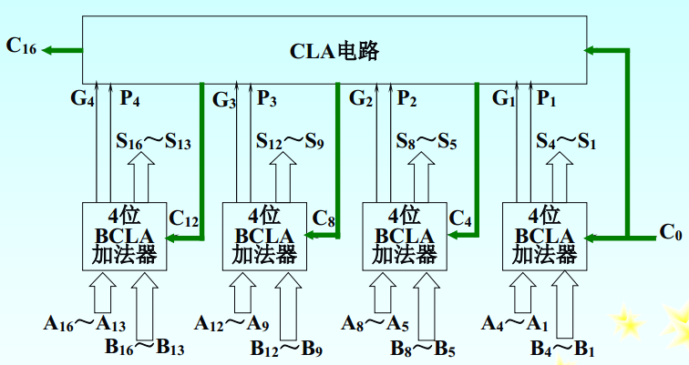

  注意，BCLA加法器不产生进位，只产生Gi和Pi，Ci生成过程如下

  - 2ty时，第一小组C1、C2、C3及所有Gi、Pi生成
  - 4ty时，产生C4、C8、C12、C16
  - 6ty时，生成其余Ci信号

  

### 定点加减运算

#### 补码加减运算

补码加法


补码减法


求已知补码负数的方法是各位取反加一，称为**机器负数**

加减法运算规则

- 参与运算两个操作数均用补码表示

- 符号位作为数的一部分参加运算

- 若做加法，两数直接相加；

  若做减法，则将被减数与减数的机器负数相加  

- 运算结果为补码表示

符号扩展方法：原有符号位不变，用符号位填充附加位

#### 补码溢出的判断与检测方法

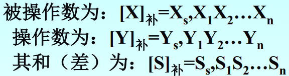

- 采用一个符号位

  

- 采用进位位

  设Cs为符号位产生的进位，C1为最高数值位产生的进位

  - 两正数相加，当C1=1，Cs=0时产生正溢
  - 两负数相加，当C1=0，C2=1时产生负溢

  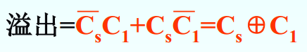

- 采用变形补码（双符号位）

  采用变形补码Ss1，Ss2，含义如下

  

### 带符号数的移位和舍入操作

#### 带符号数的移位操作

- 原码的移位规则：负数原码移位后空出位补0

  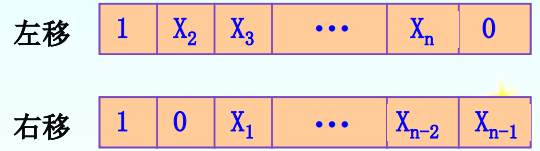

- 补码的移位规则：负数补码左移后空出位补0，右移后空出位补1

  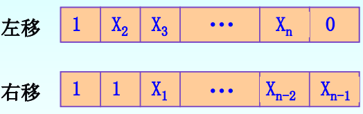

通常移位操作由移位寄存器实现

#### 带符号数的舍入操作

在算术右移中，需要舍去一定的尾数

- 恒舍（切断），无论多余部分如何，一律舍去，保留位不做任何改变
- 冯·诺伊曼舍入法（恒置1法），保留位的最低位都置为1
- 下舍上入法，0舍1入
- 查表舍入法用ROM存放下溢处理表，每次查表获得相应处理结果（这里建议看书，书上很清楚）

### 定点乘法运算

建议多手算练习

#### 原码一位乘法

规则为

1. 参加运算的操作数取绝对值
2. 令乘数的最低位为判断位， 若为“1”， 加被乘数， 若为“0”， 不加被乘数（加0） 
3. 累加后的部分积右移一位
4. 重复n次2和3
5. 符号位单独处理，同号为正，异号为负

乘法运算需要三个寄存器

- A寄存器：部分积与最后乘积的高位部分，初值为0
- B寄存器：被乘数X
- C寄存器：乘数Y，运算后C寄存器存放乘积的低位部分

运算流程图

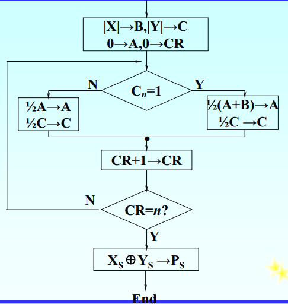

#### 补码一位乘法

比较法-Booth乘法

规则如下

1. 参加运算的数用补码表示

2. 符号位参加运算

3. 乘数最低位后增加一位附加位Yn+1，初值为0

4. 每求一次积要右移一位，操作数最低两位决定了每次要执行的操作

   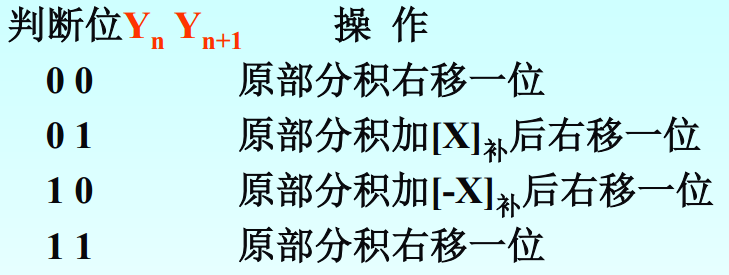

5. 移位按照补码右移规则进行

6. 共需要做n+1次累加，n次移位，n+1次不移位


#### 补码两位乘法

没有直接出现在考纲内，之后再完善好了

### 定点除法运算

#### 原码除法运算

不恢复余数法

若第i-1次求的商余数为ri-1，则第i次求商操作为

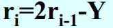

- 若够减，ri>0，商1

- 若不够减，ri<0，商零，然后

  

总结为

需要三个寄存器

- A寄存器：存放被除数X，最后剩下扩大了若干倍的余数
- B寄存器：存放除数Y
- C寄存器：存放商Q，初值为0

#### 补码除法运算

规则如下

- 够减的判断

- 上商规则：

  - [ri]补 与 [Y]补 同号，上1
  - [ri]补 与 [Y]补 异号，上0

- 商符确定，第一次得出的商即为商符

- 求新部分余数，通式为

  

  - 若商上1，下次操作为余数左移一位，减去除数
  - 若商上0，下次操作为余数左移一位，加去除数

- 末位恒置一

可概括为

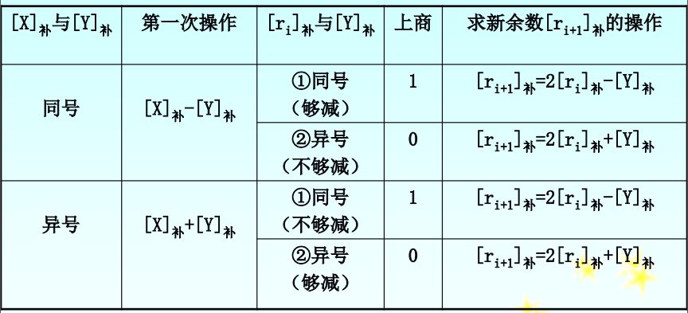

### 规格化浮点运算

#### 浮点加减运算

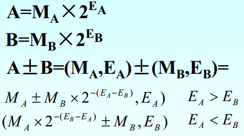

步骤如下z

- 对阶，使阶码相等，规则是**小阶向大阶看齐**，需使小阶阶码增大，尾数右移，直到阶码相等

  尾数右移后，需要进行舍入操作

  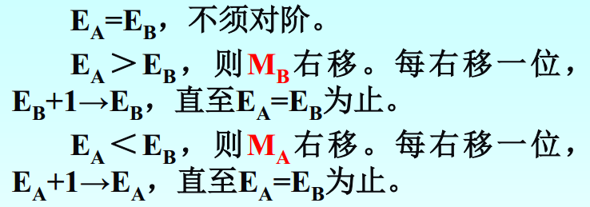

- 尾数加减

- 尾数规格化

  使用双符号位补码表示，经过加减法运算后，可能出现以下情况

  

  - 对于情况1、2，已经是规格化数
  - 对于情况3、4，需要使尾数左移直到符合1、2，称为**左规**
  - 对于情况5、6，发生溢出，需要使尾数右移直到符合1、2，称为**右规**，只用进行一次

- 舍入

- 溢出判断

#### 浮点乘除运算


乘法运算步骤

- 阶码相加，当阶码用移码表示时，注意减去偏置值
- 尾数相乘
- 尾数规格化，最多需要左规一次

除法运算步骤

- 尾数调整，要检测|MA|<|MB|，如果不小于，则MA右移一位，EA自加1。该调整最多进行一次
- 阶码相减，当阶码用移码表示时，注意加上偏置值
- 尾数相除

### 十进制整数的加减运算

考纲没有，作业题也巨麻烦，怀疑不考，以后再补充

### 逻辑运算与实现

注意，逻辑运算是**按位进行**的，位与位之间没有进位/借位关系

- 逻辑非
- 逻辑乘
- 逻辑加
- 按位异或

## 存储体系和结构

### 存储系统的组成

按存储器在计算机中的作用，可分为

- 高速缓冲存储器Cache
- 主存储器
- 辅助存储器

按存储方式，可分为

- 随机存取存储器RAM，对任意存储单元读写时间相同
- 只读存储器ROM，只读
- 顺序存取存储器SAM，只能顺序存取，时间与信息与在存储体上的物理位置有关
- 直接存取存储器DAM，第一步指向存储器某个小区域，第二部顺序检索

按存储介质分类

- 磁芯存储器：信息长期存储，破坏性读出
- 半导体存储器
- 磁表面存储器
- 光存储器

按信息的可保存性

- 易失性存储器：断电后信息消失
- 非易失性存储器：断电后信息保存
- 破坏性读出：读出操作后存储信息被破坏，需要重写
- 非破坏性读出

### 主存储器的组织

基本结构如下所示

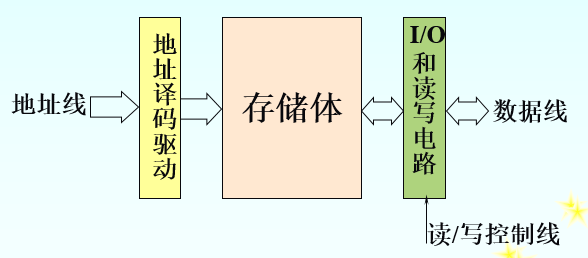

- 存储体：主存储器的核心
- 地址译码驱动电路：包含译码器和驱动器
  - 译码器：将地址总线输入的地址码转换成与之对应的译码输出线上的有效电平，以表示选中了某一单元
  - 驱动器：提供驱动电流以完成读写操作
- IO和读写电路

存储器的读写操作是在控制器控制下进行的

#### 存储单元

区分以下概念

- 位：二进制数的基本单位，存储信息的最小单位
- 存储字：作为整体存入或取出的二进制数

存放存储字或存储字节的主存空间称为存储单元，存储单元构成存储体

存储单元是CPU对主存**可访问操作的最小单位**（最小寻址单位）

- 对于字节编址的计算机，最小寻址单位是一个字节
- 对于字编址的计算机，最小寻址单位是一个字

存储单元中存储字节的安排方案

- 大端方案：将高字节存放在存储单元低地址处
- 小端方案：将高字节存放在高地址处

```c
//比如存放0x12 34 56 78
//大端
低地址 --------------------> 高地址
0x12  |  0x34  |  0x56  |  0x78
//小端
低地址 --------------------> 高地址
0x78  |  0x56  |  0x34  |  0x12
```

#### 主要技术指标

- 存储容量

  实例：64K×16表示有64K个字，每个字字长为16位

- 存取速度

  - 存取时间 Ta，从启动一次存储器操作到完成该操作所经历的时间
  - 存取周期 Tm，存储器进行一次完整的读写操作所需的全部时间

  由于存储器存在复原时间，Tm>Ta

- 主存带宽Bm

  表示每秒从主存进出信息的最大数量

  Bm = 主存等效工作频率×主存位宽÷8 = 内存时钟频率×倍增系数×主存位数÷ 8

#### 主存中数据存放方式

在数据字长=32位，存储字长=64位的情况下，数据存在以下几种不同长度


存在以下几种存放方法

- 不浪费存储器资源的存放方法，数据紧挨存放，读写效率低

- 从存储字的起始位置开始存放方法，不管什么数据都占用一个存储字，空间浪费大

- 边界对齐的数字存放方式，

  - 双字地址的最末三个二进制位必须为000
  - 单字地址的最末两位必须为00
  - 半字地址的最末一位必须为0

  可保证都在一个周期内完成访问，空间浪费相比第二种少很多

### 随机存储器和只读存储器

主存储器通常分为RAM和ROM两部分

#### RAM记忆单元电路

记忆单元：存放一个二进制位的物理器件，地址码**相同**的多个记忆单元构成一个存储单元

RAM根据记忆单元结构可分为静态RAM和动态RAM

- SRAM：静态RAM，存储电路以双稳态触发器为基础，不需要刷新操作，存取速度更快，功耗大，用于组成Cache
- DRAM：动态RAM，存储电路以电容为基础，需要刷新操作，存取速度慢，功耗小，一般用于大容量主存系统

#### DRAM的刷新

一般DRAM允许的最大刷新间隔为2ms，刷新是定时的，且以存储体矩阵中的**行**为单位进行

刷新的方式可分为

- 集中式，在允许的最大刷新间隔内，按照存储芯片容量的大小集中安排若干个刷新周期，刷新时**停止读写操作** 

  刷新时间=存储体矩阵行数×刷新周期（刷新一行所需的时间）

  刷新周期=存储周期

  优点：存取速度较高

  缺点：会出现**死区**

- 分散式，把刷新操作分散到每个存取周期内进行，一个系统存取周期内刷新存储矩阵中的一行

  没有死区，但是加长了系统的存取周期（芯片存储周期不变，系统存取周期变为两倍），且刷新过于频繁

- 异步式，前两种方法的结合，将刷新操作平均分配到最大刷新间隔时间内

  相邻两行的刷新间隔=最大刷新间隔时间/行数

  虽然也有死区，但比集中刷新方式死区小很多，且减少了刷新次数

注意：

- 刷新对CPU透明，由**存储芯片内部**控制
- 刷新按行进行
- 刷新类似于读出操作
- 考虑刷新问题时，应从**单个芯片存储容量**着手

#### RAM芯片分析

主要外引脚包括

- 地址线Ai
- 数据线Di
- 片选线（1根），低电位有效
- 读写控制线（1根），低电位有效

地址译码电路可将地址信号翻译成选择信号，有以下两种方式

- 单译码方式（字选法）

  对应字结构存储器，容量为M个字的存储器（M个字，每字b位），排列成M行×b列的矩阵，矩阵的每一行对应一个字，有一条公用的选择线wi（字线）。

  字线选中某一行时，同一行中的各位就都被选中，由读写电路对被选中的各位实施读出或写入操作。

  成本昂贵，纵向长，横向窄，只适用于容量不大的存储器

- 双译码方式（重合法）

  把K位地址码分成接近相等的两段，一段用于水平方向作X地址线，供X地址译码器译码；一段用于垂直方向作Y地址线，供Y地址译码器译码。

  X和Y两个方向的选择线在存储体内部的一个记忆单元上交叉，以选择相应的记忆单元。

  

SRAM的读写时序

- 在读周期内，地址输入信息不可改变
- 片选信号CS在地址有效后变为有效
- 写允许信号WE在读周期保持高电平(无效)

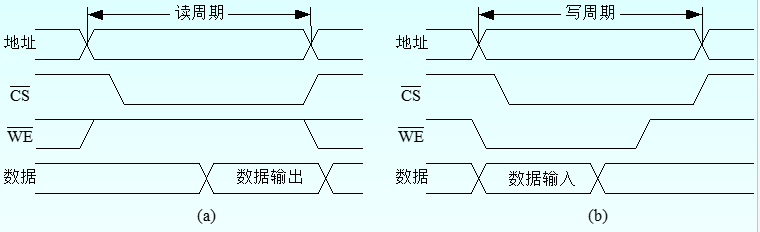

DRAM的读写时序


#### 半导体只读存储器ROM

即使断电，ROM存储的信息也不会丢失

类型分为

- 掩膜式ROM（MROM）：厂商写入，无法改变
- 一次可编程ROM（PROM）：用户用专门设备写入，无法改变
- 可擦除可编程ROM（EPROM）：用户写入，且可多次改写
- 闪速存储器（flash memory）：既可在不加电的情况下长期保存信息，又能在线进行快速擦除与重写

### 主存储器的连接与控制

#### 主存容量的扩展

##### 位扩展

只在**位数**方向扩展（扩展字长），芯片字数与存储器字数是一致的。

连接方式是将各存储芯片的地址线、片选线和读/写线相应并联起来，将各芯片的**数据线**单独列出，参考为


##### 字扩展

只在**字数**方向扩展，位数不变

将芯片的地址线、数据线、读/写线并联，由**片选信号**来区分各个芯片。

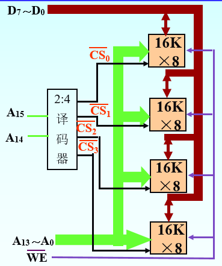

同时只能有一个芯片被选中

##### 字和位同时扩展

参考示例如下，使用8个16K×4的SRAM组成64K×8的存储器

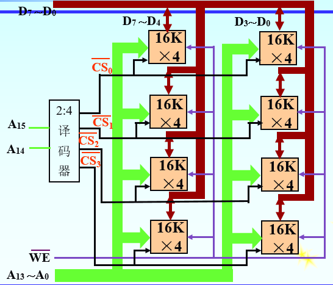

#### 存储芯片的地址分配和片选

CPU实现对存储单元的访问的过程

- 片选：要选择存储芯片进行片选
- 字选：从选中的芯片中依地址码选择出相应的存储单元，以进行数据的存取

实现片选的方法有三种

- 线选法

  假设需要选n片，则需要n位作为高位地址，当某地址线信息为“0”时，就选中与之对应的存储芯片。注意，同时只能有一位为0。

  不需要地址译码器，线路简单，但仅适用于连接存储芯片较少的场合，且地址形式不连续。

- 全译码法

  将片内寻址外的全部高位地址线作为地址译码器的输入，把经译码器译码后的输出作为各芯片的片选信号

  地址形式连续，不会产生地址重叠的存储区

- 部分译码法

  用片内寻址外的高位地址的一部分来译码产生片选信号。

  这可能导致某一存储单元对应多个地址，这称为**地址重叠**，会形成地址重叠区

#### 主存和CPU的连接

分为硬连接和软连接

- 硬连接为物理连接

  有三组连线地址总线AB、数据总线DB和控制总线CB

  CPU中存储器地址寄存器（MAR）和存储器数据寄存器（MDR）是和主存的接口。

  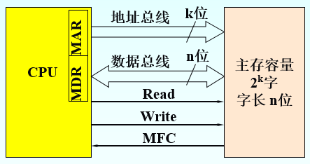

- 软连接为CPU发出的读写命令

  - 读操作

    地址→MAR→AB      CPU将地址信号送至地址总线

    Read                          CPU发读命令

    Wait for MFC            等待存储器工作完成信号MFC

    ((MAR))→DB→MDR  读出信息经数据总线送至CPU

  - 写操作

    地址→MAR→AB     CPU将地址信号送至地址总线
    数据→MDR→DB     CPU将要写入的数据送至数据总线
    Write                         CPU发写命令
    Wait for MFC            等待存储器工作完成信号MFC

## 中央处理器

### 中央处理器的功能和组成

#### CPU功能

在程序运行过程中，各部件之间流动的指令和数据形成了指令流和数据流，数据流由指令流来驱动

CPU的基本功能是对**指令流**和**数据流**在时间与空间上实施正确的控制

- 指令流：处理器执行的指令序列
- 数据流：根据指令操作要求依次存取数据的序列

注意，数据流是由指令流驱动的

#### CPU中的主要寄存器

可分为通用寄存器和专用寄存器，专用寄存器至少包括：

- 程序计数器PC：存放正在执行指令的地址或接下来要执行的指令地址
- 指令寄存器IR：存放从存储器中取出的指令
- 存储器地址寄存器MAR：保存当前CPU访问的主存单元的地址
- 存储器数据寄存器MDR：暂时存放由主存读出或即将写入主存的一条指令或一个数据字
- 状态标志寄存器PSWR：存放程序状态字，各位表征程序和及其的进位状态，如进位标志C、为零标志Z等，8086的标志如下所示


#### CPU的组成

基本组成图如下所示


ID表示指令译码器，CU表示控制单元，

控制器的主要功能如下：

- 从主存中取出一条指令，并指出下一条指令在主存中的位置
- 对指令进行译码或测试， 产生相应的操作控制信号， 以便启动规定的动作。
- 指挥控制CPU、主存和输入/输出设备之间的数据流动方向

运算器的主要功能有

- 执行所有算术运算
- 执行所有逻辑运算，并进行逻辑测试

#### CPU主要技术参数

- 字长：单位时间内可同时处理的二进制位数
- 内部工作频率：又称主屏，是重要参数，表示内部数字脉冲信号震荡速度，倒数为时钟周期
- 外部工作频率：主板为CPU提供的基准时钟频率，內频=外频×倍频，倍频以0.5为间隔，从1.5到无限
- 前端总线频率：CPU与外界交换数据的主要通道
- QPI数据传输速率
- DMI数据传输速率
- 片内Cache容量：可分为L1、L2，部分CPU还有L3，依次容量递增，速度递减
- 工作电压
- 地址总线宽度：决定了CPU可访问的最大的物理地址空间
- 数据总线宽度：决定CPU与外部Cache、主存以及输入输出设备进行一次数据传输的信息位数
- TDP功耗
- 制造工艺

### 控制器的组成和实现方法

#### 控制器基本组成

基本组成图如下


##### 指令部件（右红虚线框）

- 程序计数器PC
- 指令寄存器IR
- 指令译码器ID：将暂存再IR内的指令译码并提供给微操作信号发生器
- 地址形成部件：根据指令的寻址方式形成有效地址

##### 时序部件（左红虚线框）

- 脉冲源：产生时钟脉冲信号，为机器提供基准信号
- 启停控制逻辑：根据计算机需要，开放或封锁脉冲，实现机器的启动或停止，保证第一个和最后一个脉冲均为完整脉冲
- 节拍发生器：又称脉冲分配器，脉冲信号经过节拍发生器后产生各个机器周期内的节拍信号，来控制计算机完成微操作

##### 微操作信号发生器（也称为控制单元CU）

指令的取出和执行可分为很多个最基本的操作，最基本的不可再分的操作也称为**微操作**

##### 中断控制逻辑

控制中断处理的硬件逻辑

#### 控制器的硬件实现方法

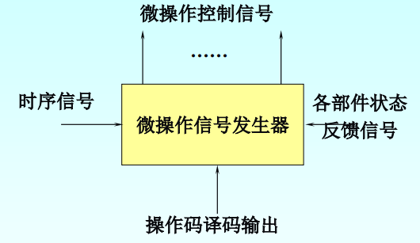

控制器的输入：机器指令代码

控制器的输出：微操作控制信号

控制器的核心：微操作信号发生器

根据产生微操作控制信号的方式不同，可分为三种：

- 组合逻辑型：微操作序列的形成部件是由门电路组成复杂树形网络，速度快，但结构复杂修改困难
- 存储逻辑型：又称为微程序控制器，采用存储逻辑实现，先将微操作信号代码化，使每条机器指令转化成为一段微程序并存入控制存储器中，速度慢，但易于维修更改
- 组合逻辑和存储逻辑结合型：PLA控制器，克服了前两者的缺点

### 时序系统与控制方式

#### 时序系统

##### 指令周期

指令周期是指取指令、分析指令到执行完该指令所需的全部时间，又称为CPU周期。

##### 机器周期

通常将一条指令周期划分为若干机器周期，每个机器周期完成一个基本操作，即指令周期＝i×机器周期，注意基本操作还可**划分为微操作**

每个机器周期都有一个与之对应的周期状态触发器，运行在某一机器周期时对应触发器置为1。

##### 节拍

在一个机器周期内要完成若干微操作。部分微操作可同时执行，部分需要串行执行。

因此将机器周期划分为若干相等的时间段，每个时间段对应一个电信号，称为节拍电位信号。

节拍的宽度取决于CPU完成一次基本操作的时间

不同机器周期所需的节拍数不同，因此节拍选取有多种方法：

- 统一节拍法：选用最复杂的机器周期定出节拍数，以最长的微操作作为一节拍的标准

  所有机器周期长度相等，称为**定长CPU周期**，慢

- 分散节拍法：按照机器周期需要安排节拍数，

  各机器周期节拍数不等，称为**不定长机器周期**

- 延长节拍法：选取适当的节拍数作为基本节拍，若同一节拍数无法完成某一机器周期全部微操作，则延长节拍数

- 时钟周期插入：直接使用时钟周期信号

##### 工作脉冲

节拍中执行的操作有些需要同步定时脉冲，在节拍内常常设置一个或几个工作脉冲。工作脉冲只占节拍电位宽度的1/n并处于节拍末尾

##### 三级时序系统

如图为一个指令周期，从上到下为两个机器周期M、节拍T和脉冲P

- 每个机器周期M中包含多个节拍T
- 每个节拍T内有一个脉冲P

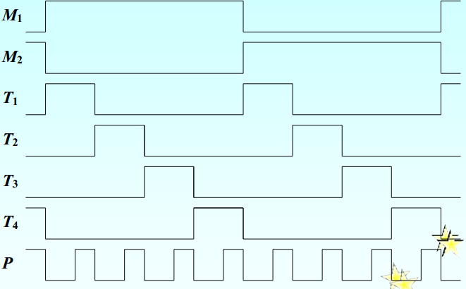

##### 时钟周期时序系统

如图为一个指令周期，

- 指令周期包含多个机器周期M
- 机器周期包含多个时钟周期T

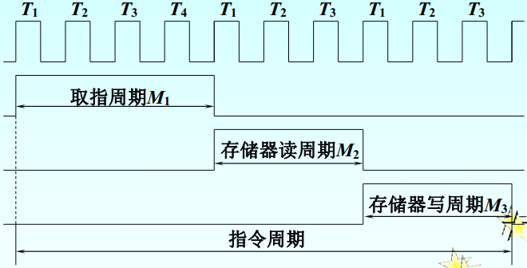

#### 控制方式

- 同步控制方式：各项操作由统一的时序信号控制，在每个机器周期中产生统一数目的节拍电位和工作脉冲，以最复杂指令的操作时间为统一的时间间隔标准，慢。
- 异步控制方式：根据指令和部件的具体情况决定要占用多少时间，不使用统一的时钟，控制较复杂
- 联合控制方式：功能部件内部采用同步方式，功能部件之间采用异步方式

#### 指令执行的基本过程

分为三个阶段，分别是取指令阶段、分析取数阶段、执行阶段，周而复始，直到停机指令或外来干预

##### 取指令阶段

- (PC)→MAR
- Read：由CU经控制总线向主存发读命令
- M(MAR)→MDR
- (MDR)→IR
- (PC)+1→PC

以上操作对所有指令都必须执行，称为**公共操作**，流程图参考如下：

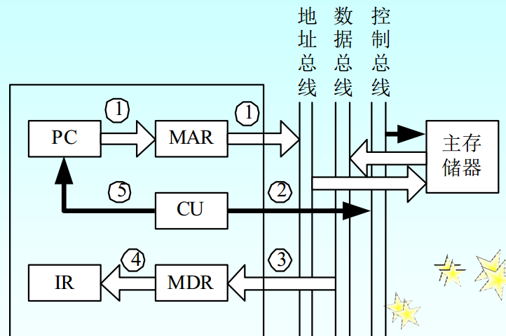

##### 分析取数阶段

指令译码器ID可识别和区分不同指令类型以及获取操作数的方法，该阶段操作各有不同

##### 执行阶段

完成指令规定的各种操作

#### 指令的微操作序列

控制器会将每条指令分解成为一系列时间上先后有序的最基本、简单的微操作，及微操作序列

建议多加练习

### 微程序控制原理

实质是将程序设计技术和存储技术相结合

#### 基本术语

- 微命令和微操作：微命令是微操作的控制信号，微操作是微命令的操作过程。
- 微指令和微地址：微指令是控制存储器中一个单元的内容，是若干微命令的集合，该单元的地址即为微地址。微指令至少包含操作控制字段、顺序控制字段
  - 操作控制字段，产生某一步操作所需的微操作控制信号
  - 顺序控制信号，产生下一条要执行的微指令地址
- 微周期：从控制存储器读取一条微指令并执行相应的微命令所需的全部时间
- 微程序：一系列微指令的有序集合，与机器指令一一对应。


#### 微指令编码法

- 直接控制法：操作控制字段每个独立二进制位代表一个微命令，1表示有效，并行性强，但指令字太长，信息利用率较低

  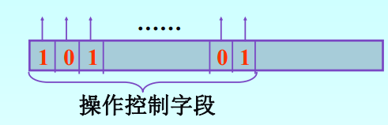

- 最短编码法：指令字最短，每条微指令只定义一个微命令，但并行性低

- 字段编码法：将操作控制字段分成若干小段，段内采用最短编码法，段间采用直接控制法

  - 字段直接编码法：各字段独立定义微命令

    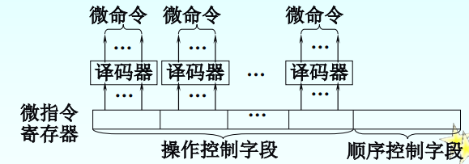

  - 字段间接编码法：一个字段某些编码需要与其他字段编码联合定义

    

字段编码法原则

- 将互斥微命令分在同一段内
- 与数据通路结构适应
- 小段的信息位不可过多
- 每一小段要留出一个状态0表示不发出任何微命令

#### 微程序控制器的组成和工作过程

基本组成：

- 控制存储器CM：核心部件，用于存放微程序
- 微指令寄存器：用于存放从CM中取出的正在执行的微指令
- 微地址形成部件：用来产生初始微地址和后继微地址
- 微地址寄存器：接受微地址形成部件送来的微地址

微程序控制器工作流程

- 取指公操作，通常由一段取指微程序完成。取指微程序入口地址一般为CM的零号单元
- 机器指令操作码字段通过微地址形成部件产生微程序入口，送入微地址寄存器
- 从存储控制器中逐条取出微指令并执行
- 执行完后回到取指微程序的入口地址，继续第一步、

#### 微程序入口地址的形成

当公用的取指微程序从主存中取出机器指令后，由机器指令的操作码字段指出各段微程序的入口地址。

由机器指令的操作码转换成初始微地址的方式主要有三种

- 一级功能转换，如果机器指令操作码字段的位数和位置固定
- 二级功能转换，当不同类机器指令的操作码的位数和位置不固定时  
- 通过PLA电路实现功能转换

#### 后继微地址的形成

每条微指令执行完毕都要根据要求形成后继微地址，方法有

- 增量方式

  类似于机器指令的控制方式，有顺序执行、转移、转子程序的分别

  顺序执行时后继微地址就是现行微地址加上一个增量，转移或转子时又顺序控制字段产生转移微地址

  通常需要一个微程序计数器

- 断定方式

  后继微地址可有微程序设计者指定，根据微指令规定的测试结果直接决定后继微地址的值

  其顺序控制字段由两部分组成

  - 非测试段：由设计者指定，用于指定后继微地址在CM的哪个区域内，对应微地址的**高位部分**
  - 测试段：根据有关状态的测试结果确定地址值，对应微地址的**低位部分**，相当于在指定区域内断定具体的分支，若测试段n位，则最多可产生2^n个分支

## 总线

### 概述

总线按功能层次可分为

- 片内总线
- 系统总线
- 通信总线（外总线）

按数据线的多少可分为

- 串行总线
- 并行总线

性能指标

- 总线宽度：总线的线数

- 总线带宽：总线的最大数据传输率，即每秒传输的字节数

  B=W×F/N

  W为数据总线宽度，通常以字节为单位；F为总线的时钟频率；N为完成一次数据传送所用的时钟周期数。

- 总线负载

- 总线复用

- 总线猝发传输

## 外设

这章内容杂的不行，只记录考纲要求，其他随意

### 概述

外设可分为

- 输入/输出设备
- 辅助存储设备
- 终端设备
- 过程控制设备

### 磁介质存储器的性能和原理

#### 磁介质存储器的读写

磁记录介质：记录信息的薄层磁性材料

磁头：电磁转换缘检，写磁头将电磁脉冲信号转化为介质上的磁化状态，读磁头将介质上的磁化状态转换成电脉冲

#### 磁介质存储器的技术指标

- 记录密度：
  - 道密度：横向密度，单位是道/英寸或道/毫米，是指垂直于磁道方向上单位长度中的磁道数目
  - 位密度：纵向密度，单位是位/英寸或位/毫米，沿磁道方向上单位长度中所能记录的二进制信息的位数
- 存储容量：能存储的二进制信息的总量，分格式化容量和非格式化容量两种指标，
  - 非格式化容量指磁记录表面可全部利用的磁化单元数
  - 格式化容量指用户实际可用存储容量
- 平均存取时间：包括四个部分，主要为前两个部分
  - 寻道时间：磁头从原先位置移动到目的磁道所需的时间
  - 等待时间：等待被访问的记录块旋转到磁头下方的等待时间
  - 读写时间
  - 磁盘控制器开销

- 数据传送率：在单位时限内向主机
- 误码率

#### 数字磁记录方式

建议找题目练练

直接记录方式：记录密度较低时，不编码，直接按记录信息的0、1排序记录

- 归零制(RZ)：记录“1”时，磁头线圈通正向脉冲，记录“0”时，磁头线圈同反向脉冲，脉冲电流均要归0
- 不归零制(NRZ)：记录“1"时，通正向电流；记录”0“时，通反向电流，如果两位信息方向相同，写电流方向不变
- 不归零-1制(NRZ-1)：记录”1“时，写电流改变方向，记录”0“时，写电流方向维持不变

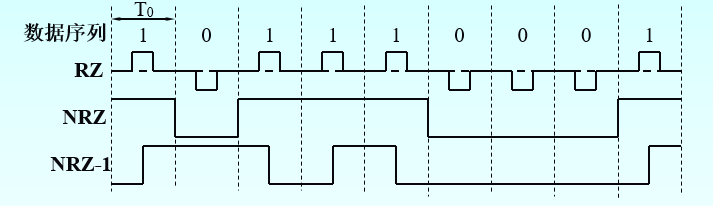

按位编码记录方式

- 调相制（PE）：
- 调频制（FM）：记录“1”时，写电流在位周期中间和边界各改变一次方向；记录“0”时，写电流仅在位周期边界改变一次方向
- 改进的调频制（MFM）：记录“1”时，写电流在位周期中间改变方向；记录独立一个“0”，写电流不改变方向；记录连续的两个“0”，写电流在位周期边界改变方向
- 改进的改进型调频制（M2FM）：记录“1”时，写电流在位周期中间改变方向；记录独立一个“0”，写电流不改变方向；记录连续的两个“0”，写电流在位周期边界改变方向；记录连续两个以上的“0”，写电流在前两个“0”的位周期边界处改变方向，以后每隔两个“0”的位周期边界处，写周期再改变一次方向

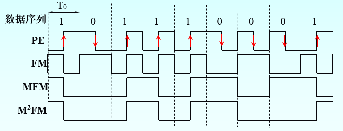

### 磁介质存储设备

基本结构：硬盘控制器、硬盘驱动器、连接电缆

按是否密封可分为温彻斯特盘和非温彻斯特盘

按磁头可分为固定头硬盘和活动头硬盘，固定头硬盘速度快、容量相对小，活动头速度慢、容量大

#### 硬盘的信息分布

- 记录面：硬盘驱动器中含多个盘面，每个盘面有**两个记录面**，每个记录面对应一个磁头

- 磁道：磁道为盘面上一组同心圆，最外层为0号

- 圆柱面：在一个盘组中，记录面上相同编号的磁道构成圆柱面。

  当文件在一个磁道内存不完时，就需要选择同一柱面的磁道，而不是同一记录面

- 扇区：会将一条磁道划分为若干段，每段称为扇区

#### 磁盘地址

一般表示为

驱动器号、圆柱面（磁道）号、记录面（磁头）号、扇区号

#### 技术参数

- 硬盘容量
- 主轴转速
- 道密度
- 平均存取时间：近似于平均寻道时间和平均等待时间之和
- 缓存
- 数据传输率

### 键盘输入设备

非编码键盘通过执行键盘扫描程序对键盘进行扫描，识别按键位置以及对应的位置码，然后将位置码通过查ROM表转换为ASCII码

#### 键盘扫描法

- 逐行扫描法

  

  - 查询是否有键按下：由CPU对行线的各位置“0”，然后CPU再从列线读入数据。

    若读入的数据为全“1”，表示无键按下；

    只要读入的数据中有一位不为“1”，表示有键按下

  - 查询已按下键的位置

    CPU首先使X0=0，X1～X7全为“1”，读入Y0～Y7，若全为“1”，表示按键不在这一行；

    接着使X1=0，其余各位为全“1”，读入Y0～Y7……

    直至Y0～Y7不全为“1”为止，从而确定了当前按下的键在键盘矩阵中的位置。 

  - 按行号和列号求键的位置码

- 行列扫描法

  - 将所有端口置为“1”，然后以行端口为输出端口，列端口为输入端口，扫描每一行，将该行端口置为“0”其余行端口置为“1”，读列线，若全为“1”则没有键按下，若某一列不为“1”，则当前行与列即为按下键的行列号
  - 再将所有端口置为“1”，输入输出端口转换，以列端口为输出端口，行端口为输入端口，扫描每一列，读行线，可以再一次得到按下键的行列号
  - 若两次行列号分别相同，则确定按下键对应的行号和列号，之后处理方式同行扫描法

### 打印机

打印机有两种工作模式

- 文本模式：主机向打印机输出字符代码，打印机从点阵字库中取出点阵数据，打印响应字符
- 图形模式：主机向打印机输出点阵图形数据

#### 点阵式打印机工作原理

由若干根打印针印出mn个点阵组成的字符或汉字、图形

- 当打印机空闲时，允许主机发送字符。打印机CPU开始接收从主机送来的字符代码（ASCII码），先判断它们是可打印的字符还是只执行某种控制操作的控制字符（如：“回车”、“换行”等）。

  如果是可打印的字符就将其代码送入打印行缓冲区（RAM）中，接口电路产生回答信息，通知主机发送下一个字符。如此重复，直到缓冲区接受满，转入打印

- 首先从字符库（**列点阵码**）中寻找到与字符相对应的点阵首列地址，然后按顺序一列一列地找出字符的点阵，送往打印头控制驱动电路，激励打印头出针打印。

### 显示器

几个主要技术指标

- 点距：表征彩色显示器的参数，指屏幕上两个相邻的同色荧光点之间的距离。
- 行频：水平扫描频率，是电子枪每秒在屏幕上扫描过的水平线条数，以KHz为单位
- 场频：垂直扫描频率，每秒钟屏幕重复绘制显示画面的次数，以Hz为单位。
- 最高分辨率
- 刷新率：每秒钟重画屏幕的次数
- 视频带宽：每秒钟扫描的像素个数

显示模式分为

- 图形模式
- 字符模式，在字符显示方式中，将一屏中可显示的最多字符数称为分辨率，例如80列×25行，表示每屏最多可显示25行，每行可有80个字符。

显示缓冲区（VRAM）

- 字符方式的VRAM通常分为两部分：
  - 字符代码缓存：存放ASCII码
  - 显示属性缓存：存放字符显示属性
- 图形方式的显示信息以二进制的形式存储在VRAM中

#### 字符显示器工作原理

- 字符点阵
- 字符窗口：包括一个字符点阵和行间距、列间距

VRAM存放字符的ASCII码，字符发生器ROM存放字符点阵信息（**行点阵码**）

每个字符在屏幕上的显示位置，对应VRAM地址为：起始地址＋行号×每行字符数+列号

控制电路中的计数器：

- 点计数器：一个字符的列数和字符横向间隔进行计数
- 字计数器：同步控制一条水平扫描线的正扫和回扫
- 行计数器：对字符窗口的高度进行控制，一个字符的行数和字符竖向间隔进行计数
- 排计数器：屏幕的垂直扫描及其回扫

## 输入输出系统

### 主机与外设的连接

#### 输入输出接口

I/O接口是主机和外设之间的交接界面，通过接口可以实现主机和外设之间的信息交换

接口与外设间需要交换的信息有

- 数据信息
- 控制信息
- 状态信息：标志外设的工作状态
- 联络信息：外设与主机工作的时间配合信息，协调工作速度和交换信息的时刻
- 外设识别信息

#### 接口的功能

- 实现主机和外设的通信联络控制：同步控制电路解决时间配合问题
- 进行地址译码和设备选择
- 实现数据缓冲
- 数据格式的变换
- 传递控制命令和状态信息

#### 接口的基本组成

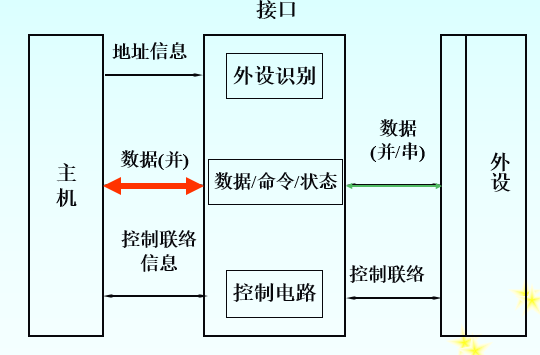

主机会将状态信息看作**输入数据**，控制信息看作**输出数据**，接口中会分别设置相应寄存器

区分接口和端口的概念

- 端口是接口电路中**可进行读写的寄存器**
- 若干端口加上控制逻辑电路才构成接口

通常，在一个接口中有以下端口

- 数据端口：存放数据信息的寄存器
- 控制端口：存放控制命令的端口，只进行**输入**操作，将状态信息送入CPU
- 状态端口：存放状态信息的寄存器，只进行**输出**操作，将控制信息送到外设

#### 外设的识别与端口寻址

通过外设识别电路实现

端口地址编址方式可分为

- I/O映射方式（独立编址）

  主存地址和IO端口地址相互独立，互不影响

  需要**专门的IO指令**，访问主存时，由主存控制线控制，访问外存时，由IO控制线控制

- 存储器映射方式（统一编址）

  不设置专门的IO指令

  每个外设至少有两个寄存器，控制状态寄存器和数据缓冲寄存器

#### 输入/输出信息传送控制方式

可分为4种

- 程序查询方式
- 程序中断方式
- 直接存储器存取DMA方式
- IO通道控制方式

### 程序查询方式及接口

#### 基本思想

由CPU执行一段输入输出程序实现主存和外设的数据传送，并且为保证数据传送的正确进行，要求CPU在程序中查询外设状态，若外设尚未准备完成，CPU等待，直到外设完成准备，CPU再执行IO指令

#### 工作流程

1. 预置传送参数
2. 向IO接口发命令字
3. 从IO接口取回状态字
4. **循环**查询外设标志
5. 传送数据
6. 修改传送参数
7. 判断传送是否结束，如果没结束，转3

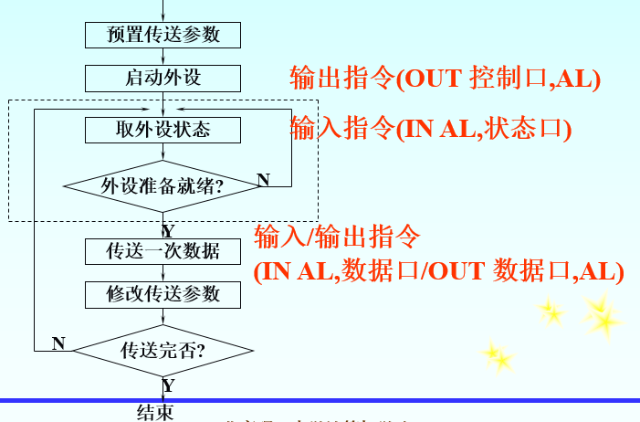

至少需要5条指令完成一次传送

#### 程序查询方式接口

硬件需求少

至少有两个寄存器：数据缓冲寄存器（数据端口）、设备状态寄存器（状态端口）

### 程序中断方式和中断系统

#### 基本概念

程序中断与调用子程序的区别

- 子程序执行由程序事先安排好，而中断事件是随机的
- 子程序受上层程序控制，而中断程序与被中断程序没有关系
- 不存在同时调用多个子程序的情况，但可能发生多个外设同时请求中断的情况

中断的基本类型

- 自愿中断与强迫中断

  自愿中断是程序自己安排的指令

  强迫中断是随机产生的中断

- 程序中断和简单中断

  程序中断是执行中断服务程序来处理的

  简单中断是主存和外设间直接信息交换，即DMA方式，不会执行中断服务程序

- 内中断和外中断

  内中断是指由于CPU内部硬件或软件原因引起的中断

  外中断是指CPU以外的部件引起的中断

- 向量中断和非向量中断

  向量中断是指中断事件直接提供中断服务程序入口地址的中断

  非向量中断的中断服务程序入口地址由CPU查询后得到

- 单重中断和多重中断

  单重中断在CPU执行中断服务程序的过程中不能被再打断。
  多重中断在执行某个中断服务程序的过程中，CPU 可去响应级别更高的中断请求，又称为中断嵌套。

#### 中断请求和中断判优

几个概念

- 中断源：中断的来源，即引起计算机中断的**事件**，中断源向CPU发送中断请求的时间是随机的
- 中断请求触发器：采用具有存储功能的触发器记录不同的中断源，当某中断源产生中断请求时，相应的中断请求触发器置成1状态，并向CPU发出中断请求信号

中断请求信号的传送方式有

- 独立请求线，每个中断源单独设置中断请求线，将中断请求信号直接送往CPU
- 公共请求线，多个中断源共有一根公共请求线，但CPU接到请求后必须通过软件或硬件的方法来识别中断源
- 二维结构，同一优先级别的中断源采用一根公共的请求线

CPU在任何瞬间只能接受一个中断源的请求。通常，把全部中断源按中断的性质和处理的轻重缓急安排优先级，并进行排队

确定优先级的原则是：些提出中断请求后需要立刻处理，否则就会造成严重后果的中断源规定最高的优先级；而对那些可以延迟响应和处理的中断源规定较低的优先级

注意：每个中断源都有一个为其服务的中断服务程序，每个中断服务程序都有对应的优先级别

判优方法

- 软件判优

  CPU接到中断请求信号后，执行查询程序，逐个检测中断请求寄存器的各位状态，按优先级从大到小检测

- 硬件判优电路

#### 中断响应和中断处理

CPU响应中断的条件如下

- CPU接受到中断请求信号
- CPU允许中断
- 一条指令执行完毕

CPU响应中断后，需要经过某些操作转到执行中断服务例程，这些操作称为**中断隐指令**，不可为用户使用，完成的操作有

- 保护断点（PC）
- 暂不允许中断，使用中断允许触发器控制
- 引出中断服务程序

对于如何进入中断服务程序，向量中断会通过向量地址发生器向CPU发送向量地址，流程参考如下图

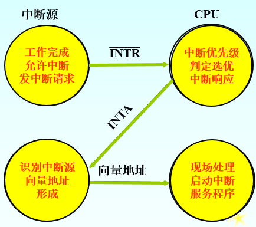

其中INTR为中断请求信号，INTA为中断响应信号

向量地址有两种情况

- 向量地址是中断服务程序的入口地址
- 向量地址是指向中断向量表响应单元的指针

需要保护和恢复中断现场，中断现场包括PC断点和通用寄存器的状态。在中断服务程序开始时，硬件和软件需要保存现场，在中断返回前进行恢复。

软件需要保护和恢复部分寄存器，需要使用**堆栈**作为硬件支持

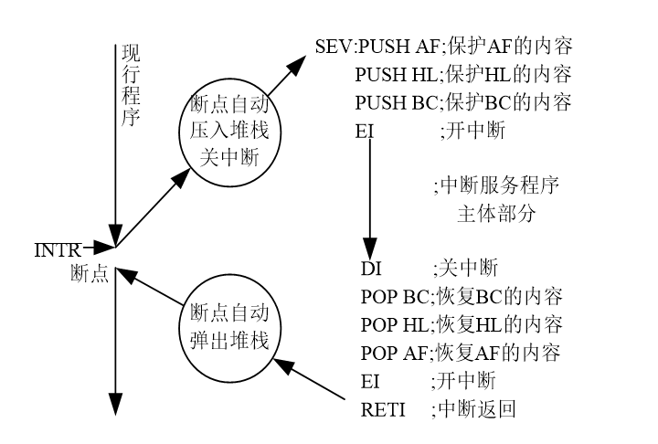

#### 多重中断与中断屏蔽

中断嵌套的层次可以有多层，但首先需要计算机可以支持多重中断，可以按照**堆栈**的形式实现。

注意，只有当系统处于开中断状态，才能实现中断嵌套

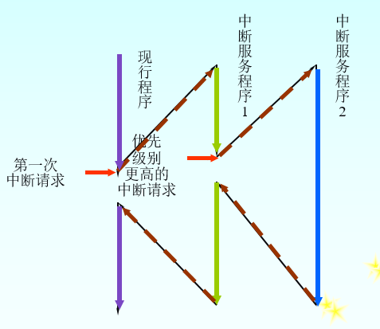

允许中断和禁止中断是由**中断允许触发器**控制的

开中断即允许中断，在以下情况开中断

- 在中断服务程序执行完毕，恢复中断现场之后；
- 在多重中断的情况下，保护中断现场之后

关中断即禁止中断，在以下情况关中断

- 当响应某一级中断请求，不再允许被其他中断请求打断时
- 在中断服务程序的保护和恢复现场之前

在部分情况下，可用程序方式有选择地封锁部分中断，即**中断屏蔽**

如果一个中断系统有16个中断源，每个中断源按优先级别赋予一个屏蔽字，1表屏蔽，0表开放，屏蔽字表如下图所示


中断屏蔽字的另一个作用是改变中断优先级，称为**中断升级**，区分以下概念

- 中断响应次序：硬件排队电路决定，无法改变
- 中断处理次序：可由屏蔽字改变

#### 总结中断全过程

分为5个阶段：中断请求、中断判优、中断响应、中断处理、中断返回。

对于中断处理，就是执行中断服务程序，基本由三部分组成：

- 准备部分：关中断，保护现场，对于非向量中断方式则需要确定中断源，最后开放中断
- 处理部分：
- 结尾部分：关中断，接着恢复现场，然后开放中断

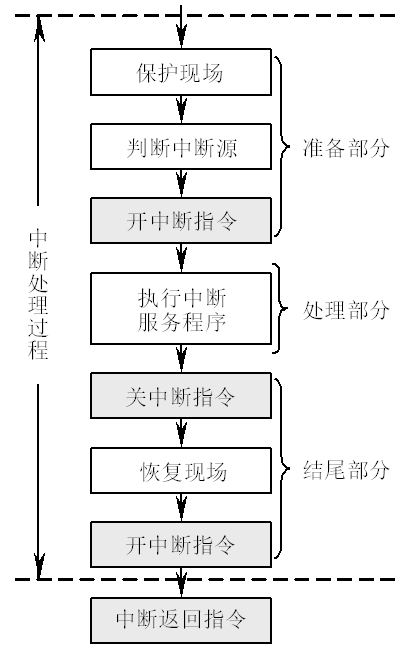

### DMA方式及其接口

特点：在外设和主存储器之间开辟一条“直接数据通道”，增设DMA控制器，当外设需要进行数据传送时，通过DMA向CPU提出DMA传送请求，CPU响应后让出系统总线，由DMA控制器接管总线进行数据传送

#### DMA特点

- 使主存既可以被CPU访问，又可以被外设通过DMA访问
- 在数据块传送时，主存地址的确定、传送数据的计数都通过硬件电路直接实现
- 主存中开辟了专用缓冲区，供给和接受外设数据
- 使CPU和外设并行工作
- DMA在开始和结束后要通过程序和中断方式进行处理

#### DMA和中断的区别

- 中断方式是程序切换，需要保护和恢复现场，DMA只在开始和结束时占用CPU资源
- 中断请求只能发生在每条指令执行完毕时，而DMA请求响应可以发生在每个机器周期结束时
- 中断传送过程需要CPU干预，而DMA传送不需要
- DMA请求优先级高于中断请求
- DMA方式仅局限于完成传送信息块的IO操作

#### DMA控制器的功能

- 接受外设发出的DMA请求，并向CPU发出总线请求
- 当CPU响应此总线请求，DMA接管对总线的控制，进入DMA操作周期
- 确定传送数据的主存单元地址及传送长度，并能自动修改主存地址计数值和传送长度计数值
- 规定主存与外设间数据传送的方向，发出读写等控制信号，并执行读写操作
- 向CPU报告DMA操作结束

#### DMA控制器的基本组成

- 主存地址计数器：存放主存中要交换数据的地址
- 传送长度计数器：记录传送数据快的长度，初值位传送数据的总字节数，递减至0
- 数据缓冲寄存器：暂存每次传送的数据
- DMA请求触发器：在外设准备好一个数据后使触发器置位，获取总线控制后复位
- 控制/状态逻辑：
- 中断机构：

#### DMA控制器的引出线

- 地址总线：

  在DMA方式下，呈输出状态，可对主存进行地址选择；

  在CPU方式下，呈输入状态，可对DMA控制器中的有关寄存器进行寻址。

- 数据总线

  在DMA方式下，用它进行数据传送；

  在CPU方式下，可对DMA控制器的有关寄存器进行编程。

- 控制数据传输方式的信号线

  存储器读信号、存储器写信号

  外设读信号、外设写信号。

- DMA控制器与外设间的联络信号线：包括DMA请求信号、DMA响应信号

- DMA控制器与CPU之间的联络信号线：包括总线请求信号、总线响应信号

#### DMA传送过程

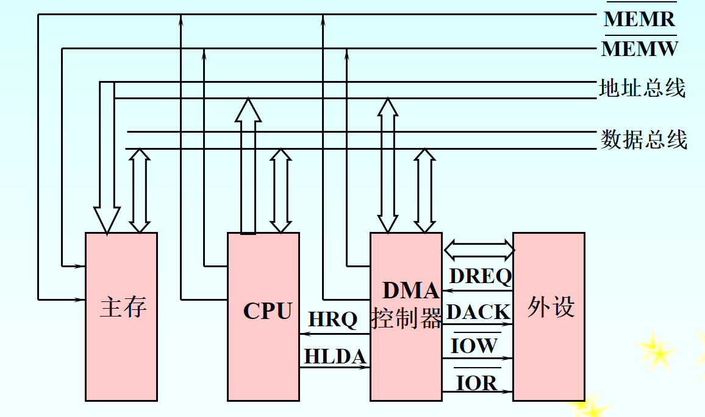

- 首先由外设向DMA控制器发出请求信号DREQ
- DMA控制器向CPU发出总线请求信号HRQ
- CPU向DMA控制器发出总线响应信号HLDA，此时，DMA控制器获取了**总线的控制权**
- DMA控制器向外设发出DMA响应信号DACK，表示DMA控制器已控制了总线，允许外设与主存交换数据
- DMA控制器按主存地址计数器的内容发出地址信号作为主存地址的选择，同时主存地址计数器的内容加1（或减1）
- DMA控制器发出IOR信号到外设，将外设数据读入总线，同时发出MEMW信号，将数据总线的数据写入地址总线选中的主存单元。
- 传送长度计数器减１
- 重复5、6、7，直到传送长度计数器减到0.DMA控制器HRQ降为低电平，返还总线控制权

#### DMA传送方式

- CPU停止访问主存法：DMA每次连续占用若干个总线周期进行数据传送，在传送过程中CPU停止访问主存，只适用于高速外设的成组传送

  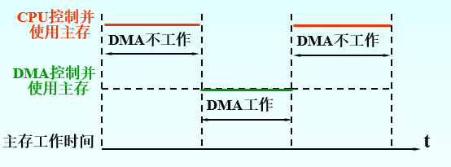

- 存储器分时法：将一个总线周期分成两个时间片，CPU和DMA交替访问主存，不需要申请和归还总线，但供DMA使用的时间片可能成为空操作，造成浪费

  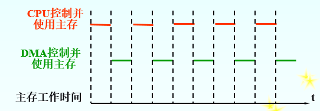

- 周期挪用法：是前两种方式的折中，一旦外设有DMA请求并获得CPU批准后，CPU让出一个周期的控制权给DMA进行一次数据传送，不断重复，若在同一时刻发生CPU和DMA访存冲突，优先保证DMA工作

  

#### DMA传送过程

- DMA预处理

  由CPU完成，CPU先执行几条指令完成初始化操作，在外设向DMA发DMA请求后，由DMA控制器向CPU发总线请求

- 数据传送

  循环传送数据，由DMA控制器实现，数据传送可以以单字节为基本单位，也可以以数据块为基本单位

- DMA后处理

  当长度计数器计为0时，DMA操作结束，DMA控制器向CPU发**中断请求**，CPU 停止原来程序的执行，转去执行中断服务程序做DMA结束处理工作。

### 通道控制方式

应用于大型计算机系统中

#### 与DMA方式的区别

- 通道是一个处理器，DMA只是硬件控制逻辑，通道独立处理能力更强
- DMA控制器只能控制较少的同类设备

