# 计算机网络

本课程的考试题面为英文，可以用中英文作答，因此对计网中各类概念的英文理解还是非常必要的

## 引论 Introduction

### 重要概念

- Protocol：协议
- Service：服务
- Interface：接口
- Entity：实体，表示任何可发送或接收信息的硬件或软件进程
- Peer：对等实体
- Addressing：寻址
- Error control：差错控制
- Sequencing：按序
- Flow control：流量控制
- Reliable：可靠的（通常意味着有确认）

### 概述

主要功能

- 数据通信：最基本，最重要的功能
- 资源共享

组成

- 资源子网：Resource subnet
- 通信子网：Communication subnet

### 计算机网络体系结构

#### 协议 Protocol

为进行网络中的数据交换而建立的规则、标准或约定

为对等实体建立，是水平的

三要素

- 语法：数据与控制信息的结构或格式。
- 语义：需要发出何种控制信息，完成何种动作以及做出何种响应。
- 同步：事件实现顺序的详细说明

#### 协议层次 Protocol Hierarchies

- 把整个网络的功能划分为若干独立的层次。
- 每层完成独立的功能。
- 每层功能的实现需借助下层的服务来完成，同时向上层提供更高级的服务。
- 通信只在相邻层之间进行，不允许跨层调用。

#### 服务 Service

下层为上层提供的通信支持，是垂直的

可分为

- 面向连接的服务 Connection-oriented
- 无连接服务 Connectionless
- 可靠服务

#### 接口

- 数据单元
  - IDU：接口数据单元
  - SDU：服务数据单元
  - ICI：接口控制信息
  - PDU：协议数据单元
- 服务访问点 SAP

#### ISO/OSI

 自底向上

- 物理层 Physical Layer：描述原始比特位的传输
- 数据链路层 Data link Layer：进行差错控制，物理寻址（MAC子层），传输帧（frame）
- 网络层Network Layer：在子网间进行路由，传输数据报
- 传输层Transport Layer：提供端到端（end-to-end）服务
- 会话层Session Layer：提供对话控制、令牌管理、同步
- 表示层Presentation Layer：关心信息的语法和语义和表示方式
- 应用层Application Layer

#### TCP/IP

## 物理层

基本特性

- 机械特性mechanical
- 电气特性electrical
- 功能特性functional
- 过程特性timing

重要概念

- 信号 signal

  - 模拟信号 analogous：参数取值连续
  - 数字信号 digital：参数取值离散

- 码元

- 信道 channel

- 带宽bandwidth：体现为传输信道的最高频率和最低频率之差，单位是赫兹（Hz）

- 波特率 baud rate：线路上单位时间内传送的波形个数

- 比特率 bit rate：单位时间内传送比特的位数（bps）

- 工作方式

  - 半双工 Full-duplex link
  - 全双工 Half-duplex link
  - 单工 Simplex link

- 奈奎斯特（Nyquist）准则

  无噪声情况下，理想低通信道的最高码元传输速率  = 2H Baud = 2H log2V

  其中H是理想低通信道的带宽，V是码元的离散信号数

- 香农（Shannon）公式

  最大数据传输率  = H log2(1 + S/N) bit/s 

  其中 S/N为信噪比

- 编码encode：将数字数据转换成数字信号的过程

  - 归零制RZ：正脉冲代表1，负脉冲代表0。
  - 不归零制NRZ：正电平代表1，负电平代表0。
  - 曼彻斯特编码Manchester：位周期中心的上跳变代表0，位周期中心的下跳变代表1。
  - 差分曼彻斯特编码：一位的开始边界有跳变代表0，位边界没有跳变代表1，在位周期中心处始终都有跳变。

  需要注意：

  - 曼彻斯特编码产生信号的频率比不归零制高。
  - 从自同步能力来看，归零制和不归零制没有自同步能力，而曼彻斯特编码和差分曼彻斯特编码具有自同步能力

- 解码decode：将编码后的数字信号还原为数字数据的过程

- 调制modulate：将数字数据转换成模拟信号的过程

  - 移幅键控法（ASK）amplitude

  - 移频键控法（FSK）frequency
  - 移相键控法（PSK）phase
  - QAM：三种方法的结合

- 解调demodulate：将调制后的模拟信号还原为数字数据的过程。

- 基带信号 Baseband：来自信源的数字信号。基带传输

- 带通信号 Passband：基带信号经过载波调制后的模拟信号。通带传输

### 信道多路复用 Multiplexing

使用一个信道传送多个数据流

- 频分复用FDM
- 时分复用TDM
- 波分复用WDM
- 码分复用CDM

### 部分物理媒介

- 双绞线 Twisted pair wire
  - 屏蔽双绞线 STP
  - 非屏蔽双绞线 UTP
- 同轴电缆 Coaxial Cable
- 光纤 Fiber Optic
- 

### 物理层设备

- 中继器Repeater
- 集线器Hub

## 数据链路层 Data Link Layer

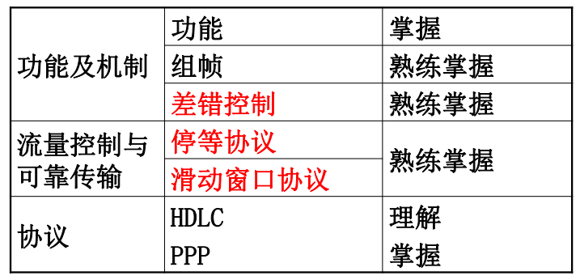

- 链路
- 数据链路：使用了复用技术时，一条链路上可以有多个数据链路

### 功能

- 为网络层提供服务
  - 提供无确认的无连接服务 Unacknowledged connectionless service  
  - 提供有确认的无连接服务 Acknowledged connectionless service  
  - 提供有确认的面向连接服务 Acknowledged connection-oriented service  

- 链路管理：链路层连接建立、维持、释放的过程

  提供物理地址寻址 Addressing

- 组帧 Framing

  包括帧定界、帧同步、透明传输

- 流量控制 Flow Control

  发送方能力大于接收方能力，发送方需要控制速度

- 差错控制 Error Control

  通常采用循环冗余校验CRC发现位错，用自动重传请求ARQ重传出错帧

### 成帧

帧 Frame：链路层的传输单元

帧同步 Frame synchronization：从二进制比特流中区分出帧的开始与终止

集中成帧的方法

- 字符计数法Character Count  

  在帧首指出帧的长度，但如果计数字段出错则之后会一直出错

  

- 字符填充的首尾定界符法 Flag byte with byte/Char stuffing  

  定界符表示一帧的开始与结束，需要转义字符ESC

  

- 零比特填充的首尾标志法 Starting and ending flags with bit stuffing

  用01111110表示一个帧的开始与结束，当信息位存在连续5个1时，自动在其后插入0

  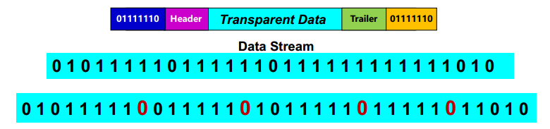

### 差错控制 Error Detection and Correction

- 帧出错：

  - 二维奇偶校验，checksum，CRC
  - 确认机制 Ackonwlegement
  - 序列号 Sequence

- 帧丢失：超时

- 修正：重传

  ARQ 自动重传请求

发生比特差错

好好找题算一算

#### 纠错编码 error-correcting codes  

数据m位，冗余r位，码字n=m+r位

- 汉明码 Hamming Code

#### 检错编码 error-detecting codes   

- 循环冗余码 CRC

### 停等协议 Stop-and-Wait Protocols

利用率utilization

带宽延迟乘积 bandwidth-delay product

### 滑动窗口协议 Sliding Window Protocol

允许多帧同时发送，帧需要编号

发送窗口 sending window

接收窗口 Receiving Window

#### PPP协议

实现链路点到点通信

三个组成部分

- 链路控制协议LCP

  用于启动、测试线路、协商选项，并在不再需要时再次关闭线路。它支持同步和异步电路以及面向字节和面向位的编码。

- 网络控制协议NCP：配置网络层协议的逻辑链接

  一种以独立于要使用的网络层协议的方式协商网络层选项的方法。

- 一个将IP数据报封装到串行链路的方法

帧格式

## 介质访问控制子层 MAC

Medium Access Control

介质访问控制子层需要决定**广播信道中信道分配**，主要在LAN中使用

可分为

- 信道划分介质访问控制 Channel Partitioning  
- 随机访问介质访问控制 Random-access  
- 轮询访问介质访问控制 Controlled-access protocols  

PPP提供检错但不提供纠错，同时也是不可靠的协议，不使用序号和确认机制，只支持全双工链路，面向字节

### 随机访问 Random Access

核心思想：争用信道，胜利者获得信息发送权

#### 纯ALOHA协议 pure ALOHA

当网络中任意站点需要发送数据时，可以不进行任意检测就发送，如果在一段时间内发送节点未收到确认，则该站点认为传输过程中发生了冲突，**等待一段时间**后再重传数据

假设网络负载为G（T0时间内所有站点发送成功和未成功而重传的帧数），吞吐量S（T0时间内发送成功的平均帧数）为

当G=0.5时，S最大

#### 时隙ALOHA协议 slotted ALOHA

从吞吐量来看，纯ALOHA协议效率很低，设计间隙ALOHA协议

将时间划分为当长的时隙slot，规定只有在时隙开始时才能发送数据，控制每个真可以在一个时隙内发送完毕

#### CSMA协议 Carrier Sense Multiple Access

载波侦听多路访问，每个站点发送前都先侦听一下公共信道，发现信道空闲后才发送

可分为

- 不坚持型CSMA

  - 如果忙，等待一段随机时间后再次侦听
  - 如果空闲，立刻发送
  - 冲突减少但延迟增多

- 1坚持型CSMA
  - 如果忙，继续坚持侦听信道
  
  - 如果空闲，立刻发送
  - 如果检测到冲突，等待随机一段时间后发送
  
- p坚持型CSMA

  - 如果忙，继续坚持侦听信道
  - 如果空闲，则以p概率发送数据，1-p概率推迟到下一时隙，在下一时隙也以相同概率判断

#### CSMA/CD协议 Collision detect

CSMA协议改进方案，适用于**总线形网络**或半双工网络。**不工作在无线LAN**

由于检测到碰撞的最长时间是传输时延的两倍，划分时隙如下

最小帧长度为时隙乘以传输速率

先听后发，边听边发，冲突停发，随机重发

- 适配器从网络层获得一个分组，封装成以太网帧，放入适配器缓存，准备发送
- 持续侦听信道，如果信道忙则持续侦听
- 如果信道空闲，则发送该帧，发送过程中持续侦听，如果检测到碰撞，则终止数据发送
- 中止发送后，等待一段时间后继续侦听信道

#### CSMA/CA协议 collision avoidance

可使用在**无线LAN**，处理了**隐蔽站问题（hidden terminal）**

- 源发送帧前侦听
  - 侦听直到空闲
  - 等待一段DIFS时间，然后栈发送一个控制帧RTS
- 目标接受到RTS后等待一段SIFS时间，发送一个控制帧CTS到源表示已经准备好接收数据
- 源接受到CTS后等待SIFS后发送数据
- 目标接收数据后等待SIFS后发送ACK给源

### 局域网 LANs

使用广播信道，局域网特性由三个要素决定：拓扑结构、传输介质、介质访问控制方式

#### 拓扑结构

- 物理拓扑：物理连接的位置与布局
- 逻辑拓扑：

- 总线型
- 树形
- 星型
- 环型

### 以太网 Ethernet

拓扑 Ptopologies：总线形、星型、树型拓扑

信号 Signaling：基带传输，曼彻斯特编码

访问控制：CSMA/CD

IEEE802.3

传输速度：10 Mbps, 100 Mbps, or above

#### 帧结构

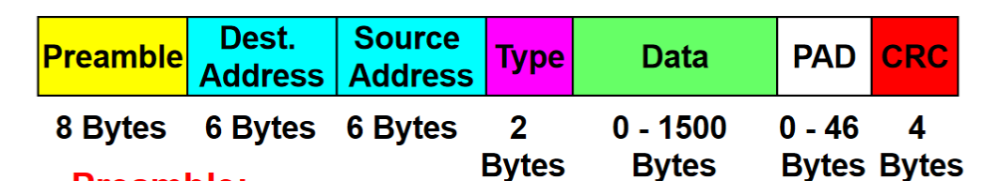

- Preamble 前置字段，用于帧同步
- Type：指出更高一层的协议类型
- PAD：填充字段，当Data不足46时进行补充

### LAN Switching 局域网交换

方法：网桥（Bridge）和交换机（Switch）

每个局域网具有自己的**冲突域（collision domain）**

每个交换机具有一个交换表，通过学习的形式构成

当交换表接收到帧时

- 如果在表中找到了目标MAC地址对应的表项
  - 如果目标地址与源地址相同，则丢弃
  - 否则根据表项进行转发
- 否则进行泛洪

学习过程建议自己学学

#### 虚拟局域网 VLAN

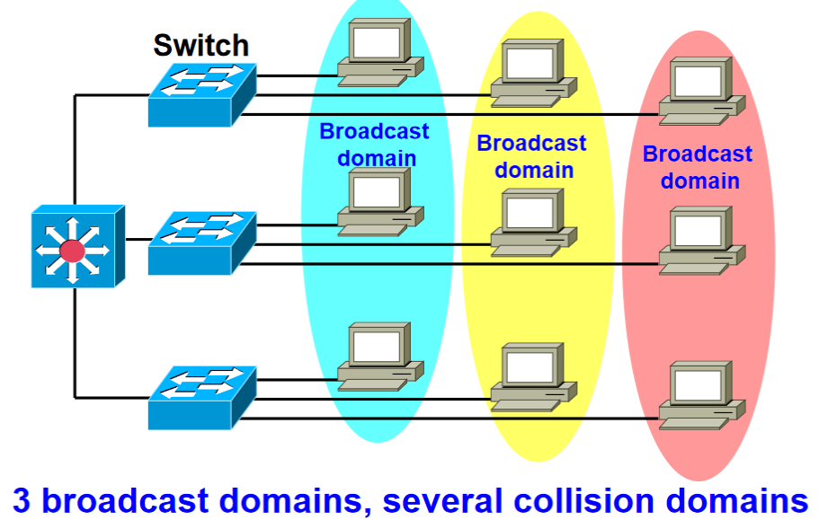

- 可划分广播域
- 更高的安全性
- 通过软件配置

VLAN Trunk：VLAN中继，以太网中级可以在一个链路上承载多个VLAN的流量

使用帧标记（VLAN tagging）来区分不同VLAN的流量

VTP：VLAN Trunking Protocol

## 网络层 Network Layer  

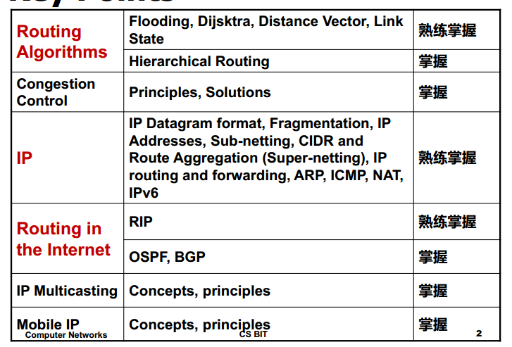

### 网络层功能

网络层必须了解子网的拓扑结构并且选择正确的路径传递数据，当源与目的处于不同网络时，需要处理不同

作用：

- 异构网络的互连（在网络层），形成互连网络
- 屏蔽底层异构网络（物理网络）的差异，实现两台主机之间的通信

交换技术：采用分组交换

两种提供给传输层的服务（分组交换packet）

- 面向连接的服务：虚电路（virtual circuit）
- 无连接的服务：数据报（datagram）

功能

- 转发：将分组从路由器的输入移动到适当的路由器输出
- 路由：决定分组从源到目的地所采用的路由

#### 异构网络互联

#### 路由和转发 

#### 拥塞控制 congestion control（不在考纲内）

在通信子网中出现过量分组引起网络功能下降的现象称为拥塞

两种方法

- 开环控制
- 闭环控制 Closed Loop

### 路由算法

路由器转发分组是通过路由表（Routing Table）实现的，路由算法可划分为

- 静态路由算法（Static，Non-Adaptive）

  指由网络管理员手工配置路由信息

- 动态路由算法（Dynamic，Adaptive）

  路由表项时通过相互连接的路由器之间彼此交换信息，然后按照一定的算法优化得出

  动态路由算法可分为

  - 距离向量路由Distance Vector Routing
  
    基于Bellman-Ford 算法，迭代、异步、分布式的
  
    特点：坏消息传播缓慢
  
  - 链路状态路由Link State Routing
  
    所有路由器保存了整个网络的拓扑结构，会将其链路信息（与邻接节点）发送给所有节点

### IPV4

因特网可被视作异构网络（自治系统Autonomous Systems）的集合，网络层的IP协议将这些网络连接在一起

IP协议栈可以参考如下

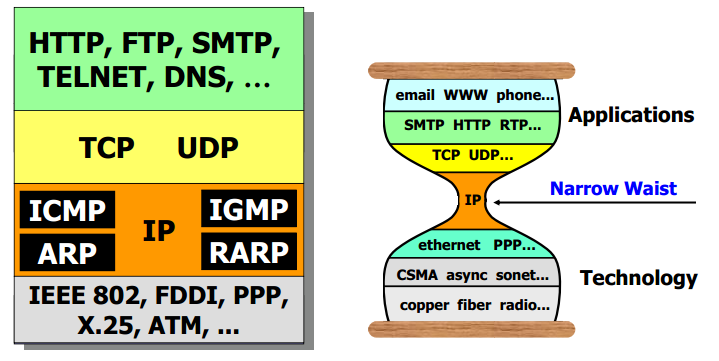

IP协议格式栈参考如下 IP datagram format

- head length：首部长度，占4位，以4bytes为单位，通常表示20bytes，最大60bytes
- length：总长度，占16为，以1bytes为单位
- identifier：标识，占16位，用于重组分片后的数据报
- flgs：标志，占3位，其中两位有用，分别是中间位DF和末位MF，DF=0表示允许分片，MF=1表示还存在后续分片
- offset：片偏移，占13位，以8bytes为单位
- time to live（TTL）：生存时间，表示可通过路由器的最大值
- 协议，占8位，指出下一协议是什么，6表示TCP，17表示UDP
- Internet checksum：占16位，只校验首部

最大传输长度MTU：比较大的IP数据包会被划分，在最终目的地重组，示例如下

#### IP地址

32位，以“.”分隔，对主机、路由器的**接口（和链路层）**进行标识

地址分类

要到达一个host

- 先找到NetworkID
- 再查找HostID，当主机号为全1时表示广播

几个被保留做私有地址的网段

- A类 1个，10.0.0.0-
- B类 180.8..
- C类 

同一局域网上的主机或者路由器IP地址中的网络号必须是一样的

路由器总是具有两个或两个以上的IP 地址。路由器的每一个接口都有一个不同网络号的IP 地址。

#### 子网

地址分类问题：所有在同一网络下的主机必须有同样的网络号

解决方案：将一个网络划分为子网，使世界只知道主网络，不知道子网

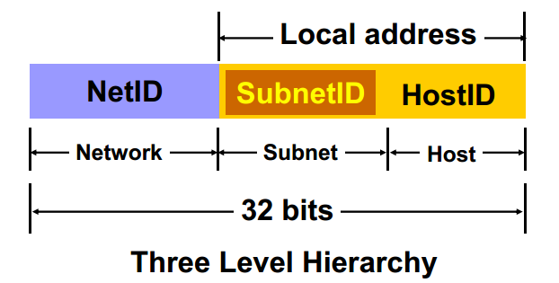

子网内的主机交流无需路由器转发

掩码mask：

路由器在一个网络外通过网络地址路由，在网络内通过子网地址路由，路由器使用32位掩码来对网络地址进行认证

- 位=1：表示该位属于网络号
- 位=0：表示该位属于主机号

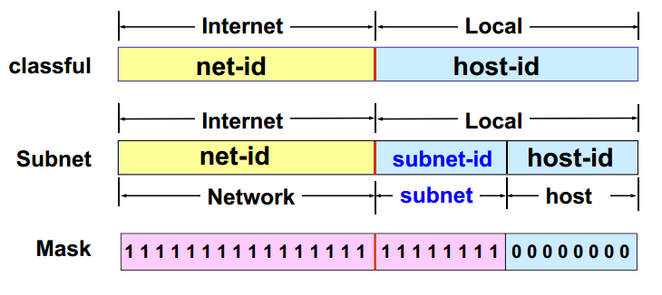

网络号= IP地址 AND 掩码

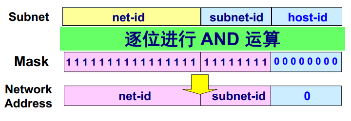

子网路由方式：

路由表的表项结构为<Subnet, Mask, NextHop>

- 对于每一个表项计算D1=D&Mask，如果D1=Subnet
  - 如果下一跳为接口，则直接交付给D
  - 否则传送给下一跳路由器

#### 无类寻址

CIDR（Classless InterDomain Routing）：无分类域间路由选择，使用任意长度的子网部分，可讲几个网络构建一个更大范围的地址的网络（超级网supernetwork），是一种归并（aggregation）技术

#### NAT

Network Address Translation，一种防止IP耗尽的方法

讲专用网络地址转换为公用网络地址，对外隐藏内部管理的IP地址，专用网本地IP地址是可以重用的

并不能真正解决地址短缺问题

#### 网际控制报文协议 ICMP

Internet Message Control Protocols，在路由器和逐渐见交流IP数据和错误信息，在通过IP实现，作为IP报文的数据发送

产生的原因不包括

- 对ICMP差错报文再产生差错报文
- 广播、多播
- 对分片报文的第一个以外的报文

几个差错报告报文类型

- Destination Unreachable：终点不可达，当路由器或主机不可交付数据包时
- Source Quench：源点抑制，当路由器或主机因为拥塞丢弃数据报时
- Redirect
- Echo/Echo Reply
- Time Exceeded：超时，路由器接收到TTL为0的数据报时

#### 地址解析协议 ARP

Address Resolution Protocol,在IP和Mac地址间进行转换，运行在网络层

每个在LAN中的IP节点都有ARP表，表项的格式为< IP address; MAC address; TTL>

ARP提供动态映射，表项的建立需要经过

- ARP请求：

  如果IP包发送方不知道接收方IP地址，则**广播**ARP请求

- ARP回复

  路由器回复ARP Reply，此时是**单播**

需要注意的是，ARP解决是位于一个自我网内的地址转换问题，对于不在一个子网的情况，需要发送给路由器，转交到下一个网络解决

### IP分组路由和转发

分组的交付可分为

- 直接交付：交付给直接连接的网络的目标主机时，在同一子网内
- 间接交付：转发到中间路由器时，不在同一子网内

### 路由协议

Internet由多个自治系统组成Autonomous Systems，需要两个层次的路由

- 域内路由Interior routing

  使用内部网关协议IGP

- 域间路由exterior routing

  使用外部网关协议EGP

#### RIP路由信息协议

属于内部网关协议IGP，基于距离向量的路由选择协议

应用层协议，使用UDP传输，每隔30s向临近路由器广播整个路由表

#### OSPF开放最短路径优先协议

Open Shortest Path First

属于内部网关协议IGP，基于链路状态算法

与RIP的区别

- OSPF向区域内所有路由器发送信息（洪泛法），RIP仅向相邻路由器发送信息
- OSPF发送部分信息，RIP发送路由表
- OSPF只有当链路状态发生变化时，才会发送信息
- OSPF协议是网络层协议，使用IP传输，RIP是应用层协议

层次结构

- local area：区域，只在本地区域进行广播链路状态
- backbone：主干区域，联通下层的区域和其他自治域

三种路由器

- 区域边界路由：Area border routers
- 主干区域路由
- 边界路由

五种消息分组类型

- 问候分组Hello

#### BGP边界网关协议

Border Gateway Protocol

属于外部网关协议，采用路径向量路由选择协议，是应用层协议，使用TCP

并非寻找最佳路径，只是寻找相对可行的路径

### IPv6

从根本上解决了IP地址耗尽的问题，地址扩展到128位

## 传输层 

### 传输层提供的服务

传输层为不同主机上的**进程**间提供了逻辑通信，提供端到端（end to end）服务，

- 面向连接的服务TCP
- 不可信的无连接服务UDP

### 传输层寻址方式

TSAP：传输层服务访问点，通常是指**端口**（Port），可以区分应用层不同的进程，用16位标识

寻址：对于网络层提交上来的报文段，传输层根据报文段首部的目的端口号将报文提交给相应的应用进程。

套接字socket：<IP,Port>

复用Multiplexing：发送方多个进程使用同一个协议

分用Demultiplexing：接收方将数据正确交付到对应线程

### UDP

以**数据报**为导向，不可靠无连接，支持单播或多播。

在IP数据报服务基础上增加：复用分用和差错检测服务

头部共计8个字节

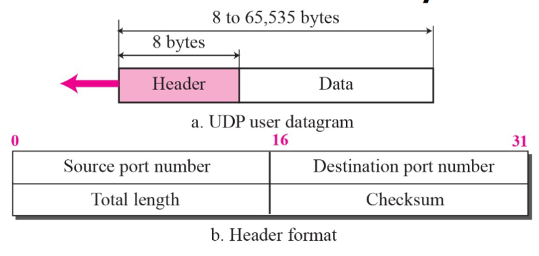

如果目标端口不可达，由ICM发送端口不可达差错报文

在计算校验和时，需要在UDP数据报之前添加**12B的伪首部**，如果数据部分不是偶数个字节，还要在尾部填充一个全0字节。对整个UDP序列计算每16位和的反码

### TCP

以字节流为导向，可靠有连接，全双工，只支持单播

提供流量控制和拥塞控制服务

连接由两个端点（套接字）确定

TCP报文段格式，头部20bytes

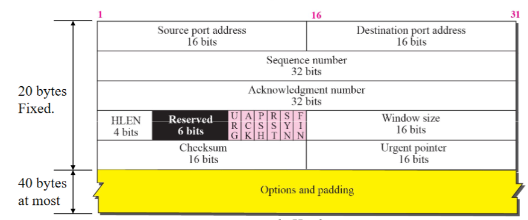

- 控制字段
  - URG：紧急位，为1时表示紧急数据
  - ACK：确认位，为1时ack字段有效
  - PSH：推送位
  - RST：复位为，为1时释放连接并重建
  - SYN：同步位，建立连接使用
  - FIN：终止位，终止连接使用
- Window size：用于流量控制

#### 可靠传输

- 校验Checksum

  校验机制与UDP相同

- 序号Sequence numbers

  TCP将从应用层获得的字节流分割成段（受MSS限制），对**字节**进行编号，发送的分段的编号实际上是分段第一个字节的编号

  确认机制的确认需要实际上是期待接收到的下一个字节的需要，是**累计确认**（cumulative acknowledgements）的

  数据报可能是乱序到达的，但会被按序传送给应用层

- 重传Retransmission

  对每个发送的报文段进行计时，超时时间应该大于RTT，是变化的

#### 连接管理

采用客户端-服务方式，发起连接方称为客户，等待连接建立方称为服务器

- 连接建立

  ISN：initial sequence number 初始序列号 

  三次握手

- 数据传输

- 连接释放

  四次握手

  在客户端接收到FIN报文时，等待2MSL后才可释放连接

#### 滑动窗口机制与流量控制、拥塞控制

流量控制：防止发送方发送的信息超过接收方承载能力

拥塞控制：防止发送方发送的信息超过网络承载能力

使用两个窗口进行一个方向上的数据传输：发送窗口（发送方）与接收窗口（接收方）

此外，为了进行拥塞控制，还需要设置拥塞窗口

发送窗口=min（拥塞窗口，接收窗口）

- 流量控制

  接收方根据自己接收缓存的大小，动态地调整接收窗口大小，从而影响发送方发送窗口

  可以通过TCP报文中的窗口字段调整

  定义了端到端的流量控制

- 拥塞控制

  假设段的丢失都是因为网络拥塞

  在发送端实现拥塞控制机制

  检测以下两种情况后，减小拥塞窗口

  - 丢失Loss
  - 收到三个重复的ack

  慢开始门限ssthresh：拥塞窗口小于该值时采用慢开始，大于该值时采用拥塞避免，发生丢失时将该值设置为当时拥塞窗口大小的一半

  两个阶段

  - 慢开始

    拥塞窗口从1开始，指数增大

    发生超时丢失时从此开始

  - 拥塞避免Congestion Avoidance

    拥塞窗口加法增大

  改进算法

  - 快重传Fast Retransmit

    接收到三个重复的ACK时，不必再等待超时，直接重传未收到确认的报文段

  - 快恢复Fast Recovery

    发生快重传时，将拥塞窗口值设置为ssthresh的一半，而不是慢开始的1，然后开始线性增加。跳过了慢开始的过程

  

  

  

## 应用层  Application Layer

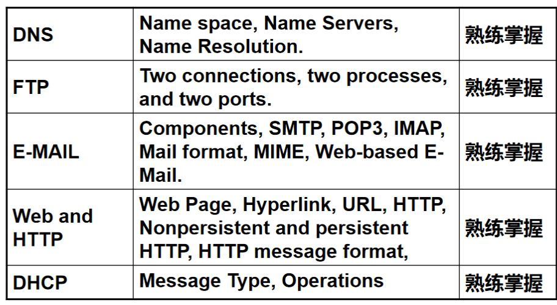

作为用户与网络的接口

### C/S and P2P Application Architectures

应用层模型可分为

- Client-Server（C/S）

  客户从服务器请求数据，比如WWW,FTP

  客户机之间不直接通信

- P2P

  所有节点可以发起连接，提供或消费数据，比如Skype

### DNS

将主机名和电子邮件名映射到IP地址上

- 主机名可映射到多个IP地址上
- 多个主机名也可以映射到一个IP地址上

域名系统 Domain Name System，具有分布式的数据库（域名服务器）

由3部分组成

- 名称空间Namespace
- 服务器Server
- 解析器Resolver（客户端）

树状命名空间

域是指这一命名空间中的子树，域名是从叶子节点到根的路径——唯一的名称。

全称域名FQND：Fully Qualified Domain Name

区域Zones：可以被直接管理的命名空间

授权Delegation：给区域设置一个命名服务器，可以管理主机名和子域

DNS服务器的层次结构

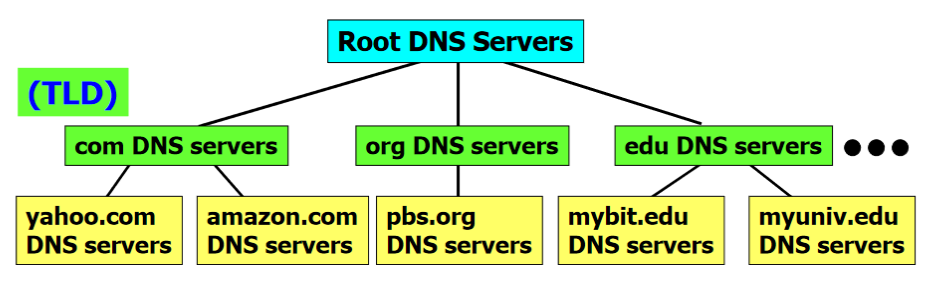

- Root Server
- Top-Level domain Server：顶级域名服务器
- Authoritative DNS servers：授权域名服务器

每个服务器都知道根服务器地址，每个服务器都知道其**直接子节点**的地址

使用方式

- 本地DNS服务器，是指主机上发送DNS请求时的首要目标

- 请求方式

  - 递归请求

    简单来说会从本地DNS服务器经过根服务器沿着**链状**传递请求和地址解析结果

  - 迭代请求（更常用）

    简单来说由本地DNS服务器直接进行多次查询，根据查询结果迭代查找下一个路由器

服务器的缓存机制可以减少负担，但每一个缓存项都存在TTL

优秀特点

- 层次授权：避免了中心化
- 冗余服务器：增强了鲁棒性
- Caching：减少了负载

### FTP

文件传输协议File Transfer Protocol

C/S模型，使用TCP，共需要两个TCP连接

- 端口21：控制连接，持久的
- 端口20：数据连接，非持久的，每次文件传输都要建立连接

服务器控制连接打开过程

- 打开21端口
- 被动等待客户进程发起连接请求
- 处理请求，并行开启数据连接
- 关闭数据连接，回到等待状态

数据连接建立过程（此时已经建立了控制连接）

- 客户端打开临时端口（ephemeral port）x
- 客户端发送**PORT请求**告知服务端x
- 服务端通过20端口与客户端x端口建立数据连接

匿名FTP：可使用匿名FTP登陆获取公共文件

- 用户名：annonymous

- 口令：guest或邮件地址

### E-Mail and SMTP/POP/IMAP

三个主要组成部分

- 用户代理UA

  给用户提供发送和接收邮件的接口

- 邮件传输代理MTA

  邮件服务器，核心组件，发送和接收邮件

  可分为client MTA（发送端邮件服务器）和server MTA（接收端邮件服务器），

- 邮件访问代理MAA

#### SMTP

简单邮件传输协议，负责发送方到发送方邮件服务器、发送方邮件服务器到接收方右键服务器，采用TCP的25端口，负责邮件的PUSH

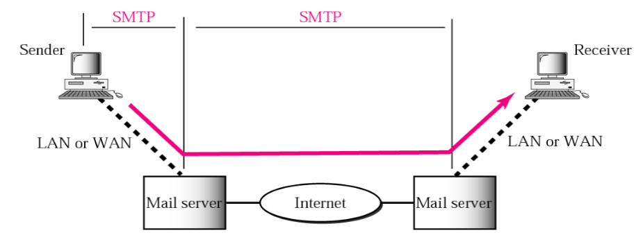

- 连接建立

  发信方定期扫描邮件缓存，如果有右键，则使用SMTP的25端口号与接收方的SMTP服务器建立连接。建立完成后，接收方发送服务就绪，发送方发送HELO指令

- 邮件传送

  

  CRLF.CRLF表示结束

- 连接释放

  SMTP客户发送QUIT命令，服务器返回服务器关闭，释放TCP连接

#### POP3

邮局协议Post Office Protocol version 3

负责PULL，用户代理向邮件服务器发送请求，获取邮箱内的邮件，采用TCP端口号110

两个阶段

-  认证（客户端与服务器之间需要身份认证）
- 下载

### WWW and HTTP

World Wide Web万维网

使用超文本传输协议（Hypertext Transport Protocol，HTTP）进行连接

几个概念

- Web

- Website：网页的集合

- Web browser：浏览器

- Web server：服务器

- URL（Uniform Resource Locator）：指定网页的资源，用/分割

  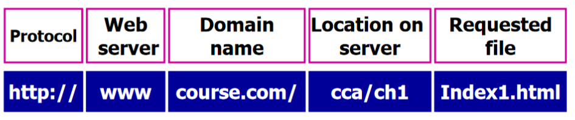

- Links：连接

- Hyperlink：超链接，

- HTML：超文本标记语言

#### HTTP

定义了浏览器如何请求万维网文档，

使用CS模型，采用TCP建立连接，默认端口为80

报文有两类

- 请求报文

  分三部分：请求行，首部行和实体主体

  请求行的方法包括（GET、POST、HEAD、PUT、DELETE）

- 响应报文

可以分为

- 非持久HTTP

  每个HTTP连接诸多发送一个对象（包括网络图形等），

- 持久HTTP

  在HTTP响应后仍保持TCP连接，在一个连接内可以发送多个对象

  又可以分为流水线和非流水线，对于流水线方式，客户可以连续发出对各个对象的请求而不必逐个等待响应

HTTP是无状态协议，不会保留客户机过去请求的任何信息

