# 软件工程基础

这课程的知识点非常模糊，重点分散，在ppt、试卷、课本上对同一问题甚至可能出现三种描述，建议以课本为主

## 软件工程概述

软件工程包括三个要素：方法、工具、过程

### 软件危机

出现的原因

- 对软件开发缺乏正确的理论指导  
- 软件人员与用户缺乏充分的交流  
- 对软件开发过程缺乏整体认识  
- 对软件产品缺乏有效一致的质量评价标准

### 软件与软件过程

软件是计算机系统中与硬件相互依存的另一部分，包括**程序、数据及相关文档**的完整集合  

软件的本质特性

- 复杂性
- 一致性
- 可变性
- 不可见性

#### 软件生命周期

- 可行性与计划阶段
- 需求分析阶段
- 设计阶段
- 实现阶段
- 测试阶段
- 运行和维护阶段

#### 软件过程

是由组织或项目使用的，用以计划、管理、执行、监控和改进其软件相关活动的过程集合

### 软件过程模型

针对软件生命周期各阶段活动的的一般规律，对软件开发过程进行定量度量的量化，为软件工程管理提供阶段性评价，为软件开发过程提供原则和方法

是一种软件开发策略

#### 瀑布模型

线性模型，严格按照软件生命周期的各个阶段展开设计，一次开发得到软件产品

特点：简单、严格、一次性、顺序、质量保证

#### 原型模型

适用于需求不明确的软件

原型是软件开发过程中一个用于实验的、测试的、或早期能运行的简单系统  

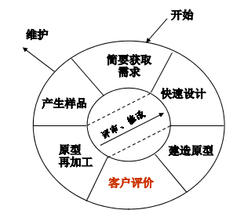

#### 增量模型

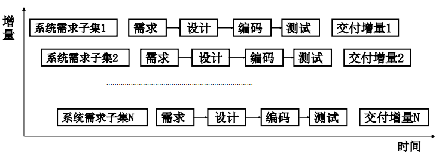

增量模型是对软件项目中功能以一系列增量的方式来开发，是一种**非整体**开发模型

对于系统整体需求，增量模型先将需求分解为若干部分，没部分按照瀑布模型方法开发

#### 螺旋模型

递增式开发模型

每次迭代过程包括：需求定义、风险分析、工程实现、评审

将原型模型和瀑布模型结合，强调风险分析

#### 敏捷过程模型

符合敏捷价值观、遵循敏捷原则的一类过程的统称

主要体现在

- 个体和交互胜过过程和工具
- 可以工作的软件胜过面面俱到的文档
- 客户合作胜过合同谈判
- 响应变化胜过遵循计划

#### 渐进交互迭代模型

面对不明确的需求（原型模型）、非整体的开发（增量模型）、影响软件质量的风险（螺旋模型），迭代模型通过对整个软件系统不断演进的循环往复，完成软件系统的实施过程  

#### 变换模型

## 软件需求工程

### 基本概念

在这一阶段必须给出对目标系统完整、准确、一致的描述，实际上需求工程贯穿软件的生命周期

#### 需求分析的任务

- 确定系统要实现的各项要求
- 数据分析
- 定义逻辑模型
- 适应需求变更

#### 原则

- 软件人员要从**用户角度**考虑软件需求
- 以流程为主线
- 尽量重用
- 划分需求的优先级
- 及时反馈需求变更

#### 需求分析的内容

- 功能需求
- 性能需求
- 领域需求
- 其他需求

### 可行性分析

需求工程最初阶段。确定问题能否解决，主要由技术和效益两方面决定

#### 可行性分析内容

- 经济可行性
- 技术可行性
- 操作可行性：系统是否符合用户操作流程
- 法律可行性

### 需求工程的过程

#### 参与人员

- 管理人员：联络员
- 设计人员：软件开发小组
- 分析人员

#### 需求工程活动

- 可行性分析
- 需求获取：通过获取技术，得到用自然语言描述的问题陈述和功能陈述
- 需求分析与建模：以需求获取文档为基础，逐步细化需求中的软件功能，提炼需求并确认。用形式化或半形式化的定义来描述初步需求，确保需求的**完整性、正确性和一致性**，形成最终的软件需求规格说明和用户手册
- 需求评审：对软件需求规格说明进行技术审查和管理复审，

#### 需求变更管理

需求管理存在两大难题

- 需求确认困难
- 需求不断变更

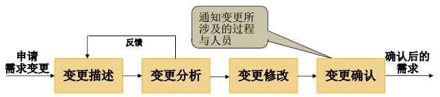

对传统需求变更管理来说，包括

- 软件配置
- 基线
- 变更审查

### 需求获取技术

- 会议访谈：参与人员包括分析员、用户、专家

  - 个别会谈确保了需求获取的正确性
  - 小组会议确保了需求获取的完整性与一致性

- 问卷调查：参与人员包括分析员、用户

  对系统性能、特殊需求做进一步了解

- 场景分析：参与人员包括分析员、用户

  分析员模拟用户操作过程

- 快速原型技术：参与人员包括分析员、开发人员、用户

  分为抛弃型原型法和演化型原型法
  
  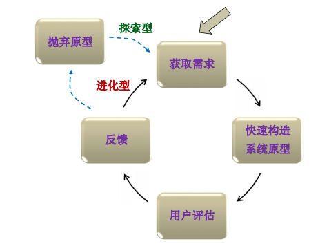

### 结构化需求分析和建模

主要包含三个层次的工作

- 需求分析：用自然语言描述用户的需求  
- **需求建模**：选择适当模型一致地描述需求  
- 需求规格说明文档：有效记录建模的过程和内容  

结构化分析建模主要目的是为了减少分析时的错误，**自顶向下**建立系统逻辑模型，降低系统设计复杂性，提高可维护性

结构化需求分析的**核心是数据**，将这些内容定义在**数据字典**中，围绕数据字典，完成需求建模

结构化需求建模过程主要包括

- 集于ER图的数据建模
- 集于DFD图的功能建模
- 集于STD图的行为建模，针对某个核心对象通过外部事件或条件触发，导致该对象状态变化

#### 面向数据的数据建模

实体关系模型（E-R）描述实体的**静态特征**，包括实体的属性和关系

#### 面向数据流的功能建模

数据流图（DFD）完成对功能、操作流程的分解和抽象，从数据流动的角度描绘系统逻辑模型

注意：DFD 中带箭头的线段表示数据的流动，而不是控制的转移。

有四个基本组成部分

- 数据源：系统的外部接口
- 数据加工
- 数据存储
- 数据流：有方向的

建立步骤

- 确定系统的外部信息源、数据源或与外部系统的接口
- 画出顶层（0层）DFD图
- 第一次精化：划分系统的子系统
- 逐层求精：对各子系统进一步精化。

细化DFD图时，需要注意

- 父图和子图的平衡关系，即输入输出数据一致
- DFD图编号
- 平衡规则，子图中的外部环境需要与顶层图外部环境一致

#### 面向状态转换的行为建模

状态转换图（STD）通过描述系统状态及引起状态转换的时间表示系统行为

- 状态是可观察到的行为，是同一数据对象在系统的不同运行时刻所具有的行为属性值，是事件触发后一系列动作的结果
- 事件是指在某一时刻发生的事情，是触发状态转换的条件或一系列动作。在中间状态的符号中，活动即是事件
- 状态转换用**有向箭头**表示。状态变换是由事件或条件触发的，因而箭头上应说明事件名称或触发条件

#### 数据字典

结构化的方式定义了建模过程中涉及到的所有**数据信息、控制信息**

设计原则

- 按照统一的定义形式编写
- 以实用为基础
- 确保数据字典定义的完整性
- 确保数据字典定义的一致性

包含三个部分

- 词条描述，分为数据流词条、数据元素测条、加工词条、存储文件词条等内容的定义
- 定义式（BF范式）
- 数据表

### 需求评审

需求工程的最后阶段是编写软件**需求规格说明**和**数据规格说明**，形成初步的**用户手册**，并按照评审标准和需求验证对规格说明进行评审

软件需求规格SRS应该具有一下作用

- 便于用户和分析人员进行理解交流
- 便于分析人员和设计人员沟通，作为设计基础
- 支持最终目标系统的确认
- 便于软件开发，有效控制需求变更

#### 需求验证的内容

- 正确性：功能需求是否符合用户所提出的需求
- 一致性：系统功能描述、约束是否一致
- 完整性：是否已包含用户重要的需求、约束，是否已发现所有的领域性质
- 可行性
- 可理解性
- 可验证性：是否能设计出验证方法，并确定检验的标准，至少针对主需求进行检查
- 可修改性
- 可追踪性

#### 需求变更管理

主要包含以下四个阶段

- 确定需求基线
- 需求变更影响分析
- 需求变更维护记录
- 需求变更的稳定性、可控性和延续性

## 软件设计基础

### 概述

设计任务：将需求阶段获得的需求说明（模型）转换为可实现的逻辑系统。

目标：构造一个**高内聚、低耦合**，且具有高可靠性、高可维护性、高理解性和高效性的软件模型

依据需求规格说明和数据规格说明，建立软件设计模型

分为概要设计和详细设计

#### 概要设计

也称总体设计，基于数据流图和数据字典，需完成

- 体系结构设计，系统整体架构，是设计的核心部分，确定子系统间数据传递和调用关系
  - 在结构化设计中表现为模块划分
  - 在面向对象设计中表现为主题划分
- 界面设计，系统外部交互接口的定义，包括人机交互界面和外部系统的接口
  - 在结构化设计中定义模块接口和全局数据结构
  - 在面向对象设计中，定义关联类、接口类、边界类
- 数据设计，软件设计的基础

#### 详细设计

过程设计，包括确定软件各模块内部的具体实现过程与局部数据结构

#### 设计原则

- 分而治之
- 重用设计模式
- 可跟踪性
- 灵活性
- 一致性

### 软件体系结构设计

- 系统静态特征体现了系统的组织结构
- 系统动态特征体现了系统操作流程的拓扑过程

体系结构设计主要体现在以下两点

- 提供软件设计师能预期的体系结构描述
- 数据结构、文件组织、文件结构等

#### 以数据为中心的数据仓库模型

集中式模型，能独立提供数据服务的封闭式环境

#### 客户端 / 服务器模式（C/S）的分布式结构  

分布式模型

- 客户机 向服务器发出请求(数据请求、网页请求、文件传输请求等等)，
- 服务器 响应请求，进行相应的操作，将结果回传给客户机，客户机再将格式化后的结果呈现给用户

目前针对多层逻辑应用，提出了多层分布式模型

#### 层次模型

#### MVC模型

### 模块化设计

模块是程序语句的集合

基本思想：将一个系统或复杂问题，按照功能拆分为一系列小的系统或简单问题

指导思想：分解、抽象、信息隐藏

设计准则

- 软件模块化与分解
- 抽象
- 信息隐藏
- 模块独立性
- 启发式规则

#### 模块化与分解

如果分解过程无限进行，则问题复杂度反而会变大，这是因为模块间接口复杂度提升

#### 抽象

分解是对问题细节的表述，抽象则忽略问题的细节，抓住问题的本质  

- 实体抽象：对实体的归纳
- 接口抽象：通过统一的接口，实现不同的实现过程
- 设计模式抽象：系统的指导性框架

#### 信息隐藏

将数据结构与实现过程放在一起，使得相关内容彼此靠近，对外提供相对完整、独立的功能，对隐藏信息的访问只能通过接口进行操作

- 对于结构化设计，数据结构和操作分离，任何函数都可以访问数据结构，封装性不佳
- 对于面向对象设计，数据结构定义在类私有部分，实现了更高程度的数据封装

#### 模块独立性

度量方式有两种，内聚性和耦合度

- 内聚性：一个模块内部各成分之间相互关联的强度。  

  内聚关系有以下几种，从低到高分别为

  - 偶然内聚：模块内各部分间由于某种偶然因素（节约空间、操作顺序等）组合在一起。  

  - 逻辑内聚：将几个逻辑上**相似的功能**放在一个模块中，调用时由调用模块所传递的**参数**确定执行的功能。  

    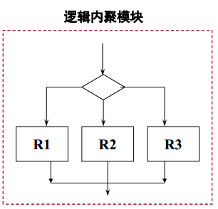

  - 时间内聚：将需要**同时执行**的成分放在一个模块中，因为模块中的各功能与时间有关  

  - 过程内聚：模块内部必须按照过程描述，在同一模块内自上而下地组织各任务。

  - 通信内聚：模块中的成分引用**共同的输入数据**，或者产生**相同的输出数据**，则称为是通信内聚模块

  - 顺序内聚：模块中某个成分的输出是另一成分的输入  

    

  - 功能内聚：模块仅包括为完成某个功能所必须的所有成分( 模块所有成分共同完成一个功能，缺一不可 )  

- 耦合度：模块间的紧密程度  

  耦合关系有以下几种，从低到高分别为

  - 非直接耦合：模块间没有直接的相互调用关系  
  - 数据耦合：一个模块传送给另一个模块的参数是一个**单个的数据项**或者单个数据项组成的**数组**  
  - 特征耦合：一个模块传送给另一个模块的参数是一个**复合数据结构**  
  - 控制耦合：一个模块传递给另一模块的信息，该信息是用于控制该模块**内部逻辑的控制信号**  
  - 公共耦合：是指一组模块访问一个公共的数据环境。  
  - 内容耦合：一模块直接访问另一模块的内部信息(程序代码或数据)  

  模块化设计原则

  - 尽量使用数据耦合
  - 少用控制耦合
  - 限制公共耦合范围
  - 坚决避免使用内容耦合

#### 启发式规则

- 改进软件结构提高模块独立性

- 模块规模适中

- 系统结构宽度、深度、扇入、扇出都应该适当

  - 深度：表示软件结构中控制的层数，深度越大越复杂
  - 宽度：是软件结构内同一个层次上的模块总数的最大值，宽度越大越复杂
  - 扇出：是一个模块直接控制（调用）的模块数目，扇出越大，控制结构越复杂
  - 扇入：表明有多少个上级模块直接调用它，扇出越大，独立性越强

- 模块作用域应在控制域内

  - 作用域：模块内定义的所有元素
  - 控制域：模块所能操作和调用的所有元素

- 设计但入口、但出口的模块，并尽量降低接口复杂度

- 模块功能应可预测

  要求模块尽量避免控制耦合和通信内聚

### 界面设计

界面设计应该与软件需求同步，主要任务包括

- 用户特性分析
- 用户需求分析：对用户功能自顶向下的分解，设计的内容包括数据的传递和变化
- 界面任务分析：根据据用户工作分析的数据操作，设计用户对界面完成控制
- 界面类型分析
- 界面原型评估

#### 界面设计原则

总原则是以人为本、以用户体验为标准、达到美学和功能的统一

- 系统所有界面操作一致
- 提供系统运行过程中必要的反馈信息
- 提供快捷方式和回滚操作

网页界面设计的基本原则

- 提供网页导向
- KISS原则：设计简单易操作的界面
- 页面设计的个性化

黄金原则

- 置用户于控制之下
- 减少用户记忆负担
- 界面一致

#### 界面设计特性

- 简易性
- 帮助性
- 容错性
- 灵活性
- 个性化

### 软件设计评审

软件设计完成前，必须编写软件设计规格说明、数据设计说明和接口设计说明，确定软件界面设计方案

## 结构化设计方法

结构化设计SD的基础是模块

基本思想是：基于模块独立性和信息隐藏原则，自顶向下，逐步求精，分解和抽象

根据数据流图、数据字典和软件需求描述的数据结构，得到对软件系统结构设计

根据得到的系统软件结构图，利用各类详细设计工具实现后一阶段的详细设计

### 概述

结构化设计以数据流图为基础，分为变换分析法、事务分析法和混合分析法

- 变换分析法：系统数据流经过输入、系统变换、输出  

  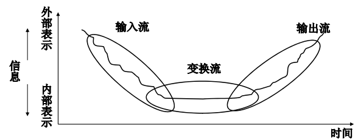

- 事务分析法：是特殊的变换分析法，特征是存在事务中心，处理从多条变换输出路径中选择一条活动路径

  

### 面向数据流的设计方法

基于数据流图自顶向下逐层分解的过程，体现模块化设计思想

#### 层次图

用于描述软件的层次结构

层次图中的编号，清楚的反映了上下层间的调用隶属关系，  层次图只反映上下层间的调用关系，不反映系统的组成关系，也不反映系统执行过程  

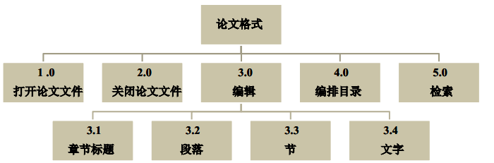

#### 结构图

于层次图类似，增加了对连线的数据流描述

四种模块

#### 变换分析法

- 复审并精化数据流图

- 划分自动化边界，确定数据流特征，判断数据流是变换流还是是物流

  - 变换流特征是数据有明显的输入、处理、输出过程

- 划分数据输入输出边界，分理处处理部分

- 执行一级分解

  划分为如下模块

  - 输入流模块MI
  - 输出流模块MO
  - 变换流控制模块MT
  - 主控模块MC

- 执行二级分解

- 采用启发式规则，精化得到的初步软件结构

#### 事务分析法

- 复审并精化数据流图
- 划分自动化边界，确定数据流特征，判断数据流是变换流还是是物流
  - 事务流的特征是在数据的输出、处理和输出过程中，处理部分有明显的控制或判断中心，后续数据流有较多活动路径
- 设定自动化边界，分离出事务中心和事务路径
- 执行一级分解
- 执行二级分解
- 采用启发式规则，精化得到的初步软件结构

#### 两种方法比较

面向数据流的设计方法得到软件结构图，是概要设计的重要成果

- 从结构组织上分析，变换分析发符合一般意义上对软件的理解，事务分析法符合用户的操作过程，由用户操作选项决定各活动路径
- 从模块独立性，特别是耦合程度上分析，事务分析法耦合程度低，有较好的模块独立性
- 从符合用户需求的角度分析，事务分析法更接近用户需求

### 结构化详细设计的工具

主要完成系统各模块功能的过程描述

#### 程序流程图

可表达顺序、分支、循环三种控制结构

缺点

- 可能导致非结构化的过程设计
- 难以表达数据结构

#### 盒图（NS图）

没有控制流，不可随意转移

#### 问题分析图（PAD）

#### 判定树判定表

#### 过程设计语言PDL（伪码）

## 软件实现

### 代码重用

软件重用包括代码重用、设计模式重用、软件开发过程重用

代码重用的方式包括

- 源代码形式的重用
- 库文件形式的重用
- 面向对象机制下的重用

### 代码评审

通过阅读源代码和相关设计文件，对源代码编码风格、编码标准以及代码质量等活动进行系统性检查的过程。  

分为

- 正式评审，针对代码编写完成之后召开的评审会议。  
- 轻量级评审，采取非正式的代码走查方式不需要组织正式会议  

## 软件测试

### 概念与基础

- 失败：程序不能运行，源于编码错误
- 错误：程序运行得不到正确结果
- 缺陷：错误的表现
- 测试用例：测试用例是为了某种特定目标而设计的一组输入数据或执行条件，以及预期结果的集合。它是测试执行时最小的实体。  

定义：以最小成本检验系统能否按照需求正确运行

#### 软件测试的过程模型

软件测试过程包括**测试对象**和**如何测试**

测试对象分为程序代码和文档

文档分为技术文档和用户文档

- 测试的V模型

  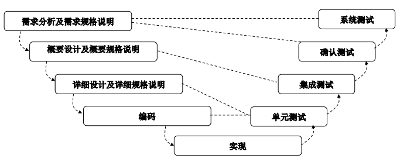

  清楚描述了开发和测试各阶段的关系

- 测试的W模型

  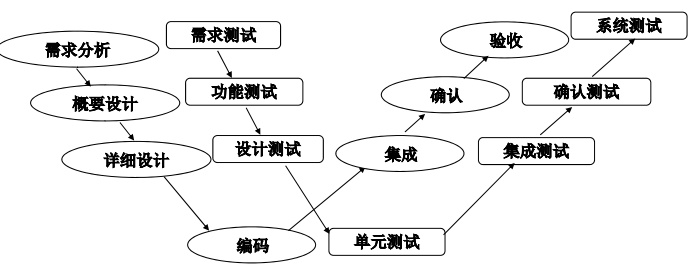

  明确开发各阶段都要进行测试

- 测试的H模型

  W模型在更高层次上的线性抽象

W和H模型的演化特点

- 测试不再是独立阶段，而是贯穿开发流程，并发进行
- 软件测试分阶段、层次、对象，是一个迭代过程
- 测试应尽早准备、执行
- 软件测试需要测试配置、方案、用例和预期结果

#### 软件测试原则

- 尽早并不断进行测试
- 开发人员尽量避免参加测试
- 注重测试用例的设计与选择
- 增量式测试：测试对象粒度从小到大
- 测试的群集现象
- 严格执行测试计划
- 全面统计和分析测试结果
- 保存测试文档并及时更新

#### 软件测试技术

- 静态测试和动态测试

  - 静态测试对象为源程序和文档，不运行程序找出错误

    方法主要包括

    - 桌面检查
    - 代码检查
    - 代码走查

  - 动态测试对象为源程序，通过运行程序找到错误

- 白盒测试和黑盒测试（都是动态测试）

  - 白盒测试：针对模块内部逻辑结构，不考虑功能
  - 黑盒测试：针对模块整体功能，不考虑逻辑细节

- 测试策略和过程划分

  - 单元测试：函数、过程、类、软部件等
  - 集成测试：各单元按系统结构组装是否正确
  - 确认测试：系统的功能和性能是否符合需求
  - 系统测试：

### 白盒测试

又称为结构测试、逻辑驱动测试、基于程序的测试

白盒测试的关键是测试用例的设计，是根据程序内部控制结构进行，设计原则是

- 保证所有判断分支至少执行一次
- 保证所有循环体至少循环一次
- 保证判断和循环的所有边界的可能取值都执行一次
- 保证每条独立路径都执行一次

再以上原则基础上，分为**逻辑覆盖、循环测试、路径测试**

#### 逻辑覆盖

对逻辑判断条件进行的测试

有以下几类覆盖标准

- 语句覆盖：程序中每条语句都至少执行一次

  设计可覆盖所有语句的用例，不考虑条件取值和覆盖的分支，是最弱的逻辑覆盖

- 判定覆盖（分支覆盖）：对程序的所有判定的各个分支都执行至少一次

  仅考虑判定整体逻辑表达式的值，无法发现子条件中存在的错误

- 条件覆盖：程序中每个判定的各个子关系表达式的取值都至少执行一次

  不考虑子条件组合对整体判定取值的影响

- 判定/条件覆盖：程序中的所有判定的每个分支都至少执行一次。同时， 每个判定的各个子关系表达式的取值都至少执行一次。

  判定分支与各子表达式分支之间的取值没有关联起来

- 条件组合覆盖：程序中每个判定中的各子关系表达式的取值组合都至少执行一次。

  没有覆盖逻辑结构的所有路径，因为没有考虑多个判断的组合关系

- 点覆盖：点是语句，即语句覆盖

- 边覆盖：边是判定分支，即判定覆盖

#### 循环测试

对程序逻辑结构中循环结构的测试，存在三种不同形式的循环

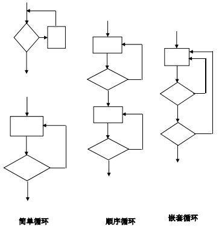

- 简单循环

  有以下循环策略

  - 完全跳过循环  
  - 仅循环一次  
  - 循环两次  
  - 循环m次，m＜n  
  - 分别循环（n-l)次、n次、n＋l次  

- 顺序循环

  如果前后循环独立，可以分解为多个简单循环

  否则按如下步骤尽心测试

  - 前一循环取某一测试值
  - 后一循环按简单循环测试
  - 迭代执行第一步和第二步

- 嵌套循环

  测试方法

  - 从最内层循环开始测试，最内层按简单循环方式测试，外层取循环次数最小值
  - 由内向外的顺序依次测试循环
  - 重复第一步和第二步，知道外层测试完毕

#### 路径测试

通过计算程序流图的唤醒复杂度确定需要进行测试的程序执行路径

测试用例要保证测试路径再测试过程中至少被执行一次，并且每个分支都至少执行一次

流图的目的是使测试关注于**程序执行路径**

- 逻辑表达式的与关系对应流图

  

- 逻辑表达式的或关系对应流图

  

路径测试步骤

- 根据过程设计得出流图

- 计算流图的环形复杂度

  环形复杂度V(G)有三种计算方法

  - 设E为流图中边总数，N为流图中点的总数，则V(G)=E-N+2
  - 设P为流图中判定结点的个数，则V(G)=P+1
  - 流图中封闭区域的个数，注意此时需要引入一个从程序结束处到开始处的虚控制流

- 确定线性独立路径集合

  线性独立路径是每条路径至少引入一条程序的新语句，总数为环形复杂度

- 设计能执行多条独立路径的测试用例

### 黑盒测试

又称为功能测试、行为测试，根据**设计说明**中的功能设计测试程序

主要方法有等价类划分和边界值分析

#### 等价类划分

把所有可能的输入数据，按程序接口定义划分为若干子集，每个子集中选取有代表性的有限数据作为测试用例

等价类划分有两种情形

- 有效等价类：指对于程序来说有意义的合理的组合
- 无效等价类：指对于程序来说有无效的无意义的组合

必须同时考虑有效等价类和无效等价类

- 定义了数据的取值范围，则可划分一个有效等价类（[a. b]间的数据集）和两个无效等价类（-∞, a）以及（b, +∞）
- 定义了输入数据的个数，则可以划分出一个有效等价类（1～N之间）和两个无效等价类（0个）或（N+M个数据）
- 规定了输入数据是特殊值，则特殊值集合是有效等价类，其余取值构成一个无效等价类。  
- 如果输入数据是布尔量，则可划分出一个有效等价类和一个无效等价类。  
- 如果定义了输入数据的规则，则可划分出一个符合规则的有效等价类和一个违反规则的无效等价类。  
- 如果输入的数据是整型，则可划分负数、零和正数三个有效等价类。  
- 对于上述各自划分的有效等价类和无效等价类，可以根据不同角度、规则、程序处理方式等各方面入手，再细分为若干有效或无效的等价子类  

#### 边界值分析

在划分等价类的过程中，有效等价类和无效等价类的边界往往是测试的重点

几项原则

- 如果输入数据给定了范围，则对于范围的边界，定义比边界值少1、边界值、比边界值多1的数值设计测试用例。例如[a, b]区域，则取a-1、a、a+1，b-1, b,b+1作为测试用例。  
- 如果规定了输入数据的个数N，则设计0个数据、1个数据、2个数据、N－1个数据、N个数据和N＋1个数据等的测试用例。  
- 如果没有指定值区域，则应取计算机所能表达的最大值和最小值作为测试用例。  
- 对于浮点数，应该取最大精度和最小精度的浮点数作为测试用例。  
- 如果输入数据是有序集，则取该集中第一、第二，倒数第二和最后一个元素作为测试用例。

### 黑盒测试和白盒测试比较

#### 应用角度

- 测试技术不同
  - 白盒测试面对详细逻辑结构，更关系局部而非全局
  - 黑盒测试将系统模块看作一个整体，测试模块的功能和性能，此外还测试模块间的依赖关系和软件系统，更关系全局而非局部
- 测试人员不同
  - 白盒测试需要程序员和测试人员共同完成
  - 黑盒测试可以有较多人员参与，程序员最好不涉及
- 文档配置不同
  - 白盒测试的对象是源程序，需要设计文档特别是详细设计文档
  - 黑盒测试的对象是源程序与文档，需要需求规格说明和概要设计说明

#### 白盒测试的优点与不足

优点

- 充分性度量手段
- 能发现代码大部分错误
- 有较多工具支持测试过程
- 部分测试用例可自动生成

不足

- 仅适用于**单元测试**
- 不易生成测试数据
- 工作量大

#### 黑盒测试的优点与不足

优点

- 测试人员不需要了解实现细节
- 测试用例容易生成，可参与的测试人员范围更广
- 适用于**测试各个阶段**
- 能发现系统结构问题

不足

- 不了解内部细节，部分代码不会被测试，可能隐藏了部分错误
- 测试可能不充分
- 各类人员参与测试容易重复

### 软件测试策略

主要任务有两类

- 局部模块的测试
- 系统全局结构的测试
- 从局部到全局，经过一系列测试过程转换而成

#### 单元测试

单元是软件测试中的最小单位，具有两个基本属性

- 单元是可独立编译的最小特征
- 单元是由个人开发的软件组件

单元测试的内容主要集中在以下5个方面

- 模块接口
- 局部数据结构
- 执行路径
- 边界条件
- 异常处理

测试策略参考如下

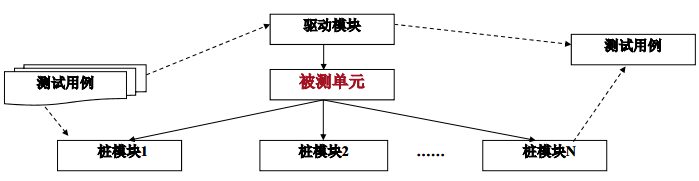

需要辅助模块才能运行单元

- 驱动模块：测试模块的上级模块，调用测试模块
- 桩模块：被测模块的下级模块，被测试模块调用

一般而言桩模块编写更复杂。用户不会知道辅助模块代码的存在

#### 集成测试

在完成单元测试后，将个单元模块按照设计的软件系统结构，按照一定策略进行组装的过程，需要概要设计规格说明

测试的内容包括

- 模块间传递的数据是否会丢失
- 模块间数据传递是否按照期望进行传递  
- 模块组装后，是否能实现所期望的更复杂的功能  
- 模块组装后，是否出现对全局数据结构、公共数据操作的混乱，资源的竞争  
- 模块组装后，集成的误差是否会被快速放大，直到难以接受为止  

集成测试策略分为

- 非渐增式集成

  **一次集成过程**

  优点：测试方法简单，测试过程快速，辅助测试模块少，工作量小

  缺点：对全局数据结构和公共数据测试不足，给错误调试带来困难

- 渐增式集成

  分为

  - 自底向上式集成

    优点：驱动模块较易编写，能尽早查出底层的错误

    缺点：最后发现系统主控方面的问题

  - 自顶向下式集成，注意是**深度优先集成**

    优点：能尽早发现系统主控方面的问题

    缺点：无法验证桩模块是否完全模拟了下属模块的功能

原则

- 尽早测试关键模块
- 尽早测试包含IO的模块

集成测试后，软件系统已建立，构成了可运行的软件部分

#### 确认测试

也称为验收测试，再模拟用户实际操作环境下，运用**黑盒测试**验证软件有效性是否符合需求，配置是**软件需求规格说明**

确认测试完成后，可能产生两种情况

- 软件系统功能、性能、领域等要素满足用户需求规格说明，软件是有效的
- 软件系统功能、性能、领域等要素存在不满足用户需求规格说明的某些方面，确认测试文档中给出了存在的错误或问题  

#### 系统测试

软件系统作为计算机系统的一部分与计算机系统的硬件系统、数据、外部其它软件、文档等要素相结合，在**用户实际运行环境**中进行的确认测试。  

测试的范围包括

- 功能测试
- 性能测试：往往与压力测试结合运行
- 压力测试：也称为强度测试，在系统各种资源超负荷的情况下对运行状况进行的测试
- 容量测试：面向数据的测试，指系统运行时超额处理大数据量时的能力
- 安全测试：验证系统安全保护机制能否在实际运行中保护系统不受非法入侵
- 文档测试：对提交给用户的文档进行测试
- 恢复性测试：在系统出现异常时，能从错误中正确恢复的能力测试
- 备份测试：在系统出现问题时备份数据和恢复数据的能力

此外系统测试分为

- α测试：由用户和软件开发人员、测试人员共同进行
- β测试：由用户独立进行

### 调试

目的是**定位**和**修改**错误，确保软件运行的正确性和可靠性

主要分为三部分内容

- 确定软件系统出现错误的准确位置
- 对发现错误的修改
- 对修改后的内容重新进行测试

### 软件测试报告

在软件测试各阶段**完成之前**，必须编写软件测试报告，并按照评审标准对软件测试报告进行评审。编写测试报告的目的是发现并消除其中存在的遗漏、错误和不足，使得测试用例、测试预期结果等内容符合标注及规范的要求。通过了评审的软件测试报告成为**基线配置项**，纳入项目管理的过程。  

软件测试报告主要包括软件测试说明和软件测试报告两个部分 。  

- 软件测试说明STD描述了执行计算机软件配置项、测试准备、测试用例、测试过程
- 软件测试报告STR实对计算机软件配置项、软件系统系统以及相关内容执行测试的记录

## 统一建模语言UML

UML是体现面向对象建模思想，实现面向对象建模过程的统一建模语言

UML组成

- 视图：系统从不同角度的描述，由多个图构成
- 图：定义了5种类型，9种不同的图
  - 用例图：从用户角度描述系统功能，指出各功能的操作者
  - 静态图：表示系统静态结构，包括类-对象图、包图
  - 行为图：描述系统动态模型和组成对象之间的交互关系，状态图、活动图
  - 交互图：描述对象之间的交互关系，顺序图、协作图
  - 实现图：描述系统物理实现，构件图、配置图
- 模型元素:代表面向对象中的类，对象，关系和消息等概念，是构成图的最基本的常用的元素。
- 通用机制

### 面向对象的基本概念

面向对象=对象+类+继承+消息

#### 对象

也称为实例，与客观世界对象的不同特点

- 逻辑性，是对客观实体的逻辑描述
- 数据基础，数据基础，对象以数据为基础进行操作
- 对数据的封装

#### 类

类是具有相同属性和方法的**对象的集合**

- 当类种的属性对应一组值时，类被实例化为对象
- 类中的方法对应对象的具体行为

#### 属性

类中定义的一组数据特征的集合，反映类与对象的**静态特性**

属性分为基本属性和复合属性

- 基本属性是对类的特征的直接描述
- 复合属性可以是结构体，也可以是其他类类型定义的子对象

#### 方法

类提供的一组操作，反映类与对象的**动态特性**

体现了类两方面的特点

- 类内部功能
  - 类的方法提供了类与外部系统的交互
  - 保护对类内部数据访问的安全性
- 类外部功能
  - 提供了外部对象和内部属性交互的功能
  - 通过继承，实现派生类对象对基类方法的调用

#### 封装性

是指通过类的定义，将与类有关的属性和方法集中在一起，并统一通过类提供的外部接口访问类的机制  

- 私有部分：不可被类外部和派生类访问
- 公有部分：外部访问类内部的开放接口
- 受保护部分：用于继承的环境种，派生类的**成员函数**可以访问基类受保护部分，但基类对象和派生类对象不能访问受保护部分

#### 继承性

是指一个类自动具有其它类的属性和方法的机制

继承将单个类按照层次结构组织成一个类家族，称为类库

继承性体现在

- 软件的重用性
- 类间的组织关系

类的继承方式分为单继承和多继承

#### 多态性

是指类的一个接口对应多种实现机制

通过基类和派生类之间的**虚函数**实现

只能在类的**继承性**中体现

#### 重载

对于同名的方法，通过接口定义的不同，分别有不同实现过程。

#### 消息

是指对象执行某个类中所定义的方法时传递的数据规格说明

### UML视图

#### 用例视图

从**用户角度**描述系统，描述系统外部特征、系统功能，主要包含以下方面

- 具备与外部系统交互的功能
- 设计与系统进行信息交换的外部系统，同时指明用户参与的用例
- 对应系统的一个完整功能或子系统，所有功能都可在用例视图描述
- 主要由**用例图**组成

#### 设计视图

从**系统内部角度**描述实现系统功能，描述系统内部的静态结构和动态行为

- 设计视图描述如何从用例中分析功能
- 设计视图静态结构主要描述类、类间关系，通过类图、包图描述
- 设计视图动态行为主要描述系统的工作流程和异常，通过状态图、顺序图、协作图、活动图

#### 实现视图

表示**系统的组件结构**，通常用独立文件描述，表示系统的逻辑组成

- 表示构成系统构件间的整体结构
- 描述系统构件间的组织结构和分布
- 描述系统构件以及之间的依赖关系
- 通过构件图表示

#### 过程视图

表示系统内部的**控制机制和并发特征**

- 协调线程之间的通信和同步
- 考虑系统资源的有效利用， 防止冲突
- 用类图描述过程的功能与功能间组织结构
- 用状态图、协作图、活动图描述过程实现和异常处理

#### 配置视图

配置视图描述系统软件和物理设备间的配置关系

由配置图描述

### UML的图和模型元素  

#### 用例图

由参与者、用例、关系构成，用于描述系统功能

从系统外部描述系统的功能以及功能间关系

不负责描述功能实现细节和性能约束

- 参与者：系统外部所有与系统交互的角色
- 用例：对一组动作序列的抽象描述，通常用于描述子系统、包、类的功能，一个用例对应用户一个具体的功能目标
- 系统边界：划分了系统内部功能和外部参与者
- 关系：描述用例图模型元素之间的关联
  - <<uses>>：使用关系，一般省略
  - <<include>>：包含关系，表示一个用例包括另一个用例，即必须被执行的用例，耦合性较强
  - <<extend>>：扩展关系，表示扩展用例对基本用例的特殊服务，是可选择执行，耦合性较弱
  - 泛化关系：表示突通参与者或不同用例间的继承关系

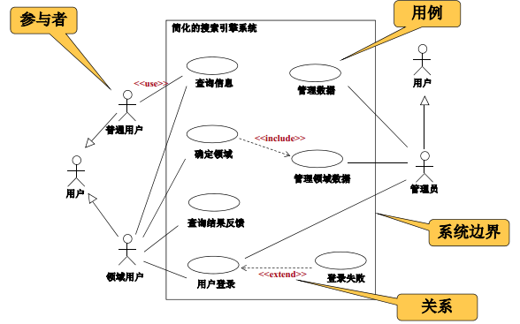

#### 类图

用于描述类的属性、方法和类间关系

类的内部结构包括

- 类名
- 可见性：定义类对象对类的属性和方法的访问权限
  - 公有部分：+
  - 私有部分：-
  - 受保护部分：#
- 属性
- 方法

#### 包图

对UML中用例图、类图、UML关系等模型元素的封装，它用于描述具有相似功能的模型元素的组合，或组织软件系统结构的层次，或展现整个系统的物理部署。

提高模块化程度，降低子系统间的耦合度

- 包图包括包名和包
- 包之间有两类关系
  - 依赖关系：包中**任意两个类**存在依赖关系
  - 泛化关系

#### 状态图

描述一个关键对象在生存周期内的所有可能的状态，以及引起状态改变的事件或条件 ，以描述对象行为

由一系列状态、事件、条件和状态间转换共同构成  

注意和需求分析中状态转换图的不同，状态图是针对系统中某一对象的状态

注意需要加上对象的初态和终态

#### 活动图

用于描述**用例或场景**的活动顺序，或描述一个活动到另一个活动的控制流 

活动图反映在系统功能逻辑中的参与对象，以及对象各自的行为活动

主要图形元素

- 初态，终态
- 对象
- 活动约束，活动的前置和后置条件
- 控制流：活动图中各项活动间的控制转换，用带箭头的直线表示
- 分支：用棱形表示
- 并发：用一条线和多条控制流表示
- 异常处理：用有向折现表示
- 泳道：通过虚线划分活动为若干组，每组活动被指定给相关对象

与状态图的区别

- 状态图面对的是对象，描述对象的状态
- 活动图描述某一用例的具体步骤，反映系统的操作流程，体现系统功能

#### 顺序图

描述对象间的动态协作关系

表现在时间先后顺序上多个对象的交互

- 参与者：包括用户、外部系统

- 对象

- 对象的生命线

- 消息

  

  - 简单消息
  - 同步消息
  - 异步消息

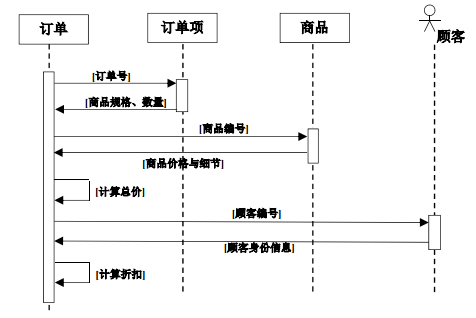

#### 协作图

用于描述类和类间关系，反映的是通过一组类的共同合作来完成系统功能  

组成部分

- 对象
- 链接：于表示对象间的关系  
- 消息

与顺序图侧重点不同

- 顺序图表现对象在时间上的交互顺序
- 协作图表现对象间的链接关系

#### 构件图

描述软件**系统代码**的物理组织结构，该结构用**代码组件**表示，因而也称为组件图  

反映了软件组件间的依赖关系，显示了软件系统的逻辑组成结构  

#### 配置图

描述软件系统在硬件系统中的部署，反映系统硬件的**物理拓扑结构**，以及部署在此结构上的**软构件分布**。  

- 节点：代表一个物理设备，以及在此节点上运行的软件或软件构件。  
- 连接：连接表示节点间交互的通信链路和联系。  
- 构件：构件是可执行程序或软件的逻辑单元，它被分布在节点中  

### UML的关系

#### 关联关系

关联关系通常是双向的，可分为

- 普通关联

  关联的重数表示多少个对象与对方对象相连接  

  - “0..1” 表示零或1  
  - “0..* ”或“ *”表示零或多个
  - “1..*” 表示1或多个
  - “1,3,7” 表示1或3或7（枚举型）

- 限定关联：对关联的含义作出某种限制  

  使用限定词对该关联的另一端的对象进行明确的标识和鉴别  

  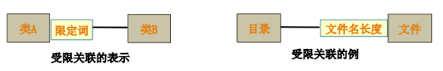

- 关联类：在关联关系比较复杂的情况下，必须详细描述关联属性以及关联行为，需要建立关联类

- 递归关联：类间关系发生在单个类自身上，即类与它自身有关联关系。  

- 聚合关联：描述的多个类之间是**整体和部分**的关联关系 

  可分为

  - 共享聚合：“整体——部分”关系中的“部分”类的对象同时成为多个“整体”类的对象。  

    反映“整体——部分”的**多对多**关系  

  - 复合聚合：“整体——部分”关系中，“部分”类的对象完全参与一个“整体”类的对象。

    反映“整体——部分”的**一对多**的关系

#### 泛化关系

描述一个类自动具有另一个类的属性和方法的机制，常被称为继承关系

派生类不仅具有基类的属性和方法，还能够定义自身的属性和方法  

可分为

- 普通泛化：

  - 泛化关系的访问权限

  - 单继承和多继承

  - 抽象类：在类中定义纯虚函数或接口，没有具体实现，抽象类只能作为其他类的积累被继承。

    体现了面向对象的**多态性**特征，通过统一的接口定义，却能得到不同的实现  

- 受限泛化：对泛化关系增加**约束条件**，强化泛化关系的语义信息  

  约束条件共分四类

  - 交叠overlapping：多个派生类对基类特殊化可以重叠
  - 不相交Disjoint：多个派生类对基类特殊化不可重叠
  - 完全complete：多个派生类完全列举出了基类所有特例
  - 不完全incomplete：多个派生类不能列举出了基类所有特例

#### 依赖关系

依赖关系更多地关注不同对象间，一个对象对**另一个对象数据**的访问。  

#### 实现关系

描述同一模型的不同细化过程，体现的是类间的语义关联

- 从实现层面上看，通过继承体现，实现纯虚函数或接口的过程  
- 从设计层面上看，通过对模型的不断精化过程来体现

### UML通用机制

#### 修饰

修饰用于增加UML模型元素的语义  ，比如公有、私有、受保护部分的符号表示

#### 注释

对UML图中的某个基本元素需要进一步说明，用缺角矩形表示

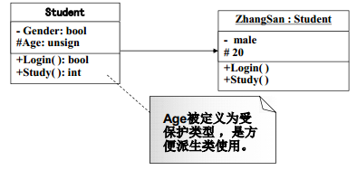

#### 规格说明

规格说明是对UML图形的一个标准化规格描述，它增加对象的图形文字内容。  

#### 拓展机制

可分为

- 构造型

  构造型用于在UML已有模型元素的基础上，通过增加语义信息或说明来建立的一种**新的模型元素**。

- 标签值

  通过增加“属性——值”对，来进一步描述问题域中的事物  

- 约束

## 面向对象分析OOA

以类和对象为基础，以面向对象方法学为指导，建立功能模型、静态模型、动态模型，获得需求规格说明

静态模型是OOA过程中最基本、最重要的部分，是OOA的核心

### 功能模型（用例模型）

基于用例，由用例驱动，目的是分析和建立用户功能的需求信息，确定系统范围和系统功能

过程主要包括

- 识别参与者
- 识别用例和用例间关系
- 用例描述文档

#### 识别参与者

参与者属于系统外部，可从系统使用人员、外部系统和硬件设备获得

参与者可能存在**继承关系**

#### 识别用例

- 从用户视角看，用例是参与者与系统的一次典型交互
- 从系统角度看，用例是一系列行为构成的完整过程

应从系统边界入手，从两个角度识别用例

注意

- 一个用例只描述一个相对完整的功能
-  一个用例是在一个相对完整的时间段中发生的，应尽量避免一个用例涉及多个时间段。  
- 用例不反映用例间在时间上或操作上执行顺序
- 用例不是界面，界面也不是用例。一个用例可以对应多个界面，一个界面也可能对应多个用例。  
- 一个参与者可以对应多个用例，一个用例也可以对应多个参与者  

#### 识别用例间关系

- <<include>>：包含关系，表示一个用例包括另一个用例，即必须被执行的用例，耦合性较强
- <<extend>>：扩展关系，表示扩展用例对基本用例的特殊服务，是可选择执行，耦合性较弱

#### 用例描述文档

### 静态模型（对象模型）

依据用例模型导出静态模型，静态模型是建模中最基本、重要、耗时的

任务是构建问题域的概念模型，把问题域中的实体转变为信息域的类与对象以及它们间的关系  

通过**建立类图及关系**来反映领域概念  

最后会形成类图、包图以及描述文档

#### 静态模型的5个层次

- 类-对象层：基础
- 结构层：表示类间关系
- 属性层：表示类的数据结构和静态关系
- 服务层：提供的方法，体现类的功能和动态关系
- 主题层：分析人员对软件系统的抽象

#### 识别类与对象

- 找出候选的类与对象
- 审查与筛选
- 类的命名

#### 划分主题

降低对系统的理解的复杂度，将大的系统划分为多个主题，通过UML的包图实现，紧密关联的类可确定一个主题。

#### 确定结构

即确定类间关系，给出系统类图描述

- 确定关联关系

  - 确定对象间的静态联系
  - 关联的属性和方法
  - 关联的多重性

- 确定泛化关系

- 确定依赖关系

  - 考虑对象的独立性
  - 对象方法的独立性
  - 消息映射

- 确定实现关系

  主要体现在对泛化关系的细化以及从抽象到具体的实现过程，更适合在**设计阶段**确定

#### 确定属性

#### 确定服务

服务分三类

- 功能服务
- 关联服务，实现类之间的动态关系
- 通用服务，如初始化

### 动态模型（交互模型）

描述系统的控制结构，也称为交互模型，涉及状态图、顺序图、协作图、活动图

描述对象的动态行为

#### 顺序图

强调交互过程中消息发送的顺序

#### 状态图

描述对象状态的转换

#### 协作图

主要刻画对象间的动态链接关系，并表示对象在系统中消息发送的先后关系

#### 活动图

## 面向对象设计OOD

OOA建立了**问题域模型**，OOD是把OOA阶段得到的需求转换为符合的设计方案

OOD将软件设计划分为系统设计和对象设计，以对象设计为主

OOD的特点体现在以下方面

- 与OOA和OOP共同构成面向对象开发的整个过程链，全面体现面向对象特点  
- OO强调对象结构而不是程序结构，增加了信息共享的机制，提高了信息共享的程度。 
-  OOD的设计过程要与OOP所选用的编程语言相结合  
- 因为OOA和OOD的过程都使用UML语言来描述，因而过程间的转换不需要任何映射方法和转换步骤  

OOA和OOD的**原则**

- 信息隐藏和模块化：信息隐藏是为了提高模块的独立性
  - 类的属性，在类的内部被类的方法所共享，在类的外部被隐藏。  
  - 类的方法：统一实现对类的外部操作，并隐藏实现细节。  
  - 模块化：类作为一个不可分割的整体，在系统中提供服务。  
- 重用，将原有事物少量修改就能多次使用
  - 代码重用
  - 设计模式重用，高层次
- 单一原则：一个接口、函数、类、界面等单元模块仅实现与它自身相关的功能，只包含实现功能所需的属性（数据结构）  
- 规划和统一接口
- 优先使用**聚合**：在考虑类的**重用**时，优先使用聚合
- 开放封闭原则
  - 开放原则是指对系统功能扩展的完善设计，应立足原有类基础上提供新属性和行为，避免重新开发
  - 封闭原则是指通过封装性将类组织起来

### 精化类及类间关系

OOD过程的**首要任务**是精化类的设计

#### 设计类的属性

对类的属性设计需要补充完善以下工作

- 复杂属性的分离和描述：单独定义复杂属性为类
- 类间重数的属性表示
  - 在类中定义指针，指向另一个关联类的对象列表 
  - 如果编程语言不支持指针，通过定义关联类的对象数组来实现
- 对属性的约束：类的封装性约束了类的外部对属性和方法的存取权限  
- 对属性的初始化。属性的初始化设计，确保了对象在启动时处于正常初始状态  
- 导出新“属性”：是指通过方法计算出的具有属性特征的结果

#### 设计类的方法

在OOA过程中，明确类所提供的方法和分析类间关系

在OOD过程中，需要细化类的方法，通过类的方法识别、体现类间动态链接

- 具有公共服务性质的方法，应该放在继承结构的高层类中  
- 尽量在已有类中定义新方法，或重用已有代码  
- 反映类间的动态关系，即类间的每个消息都要有相应的操作。  

#### 设计类间泛化\聚合关系

类间泛化关系分为单继承和多继承两种形式

- 在单继承的设计中，可以比较聚合方式与单继承对类的组织结构的利弊。  
- 在多继承的设计中，由于多继承带来的二义性，需要考虑将其进行转换  

对于单继承和聚合

- 泛化的不足在于对基类的任何修改，都将影响到派生类。  
- 在一般情况下，如果只是使用子类提供的方法，聚合要比继承方式好  

多继承使得派生类能同时具备多个类的属性和行为，但多继承过程中可能出现二义性问题，需要将其转化为其他方式

- 将多继承转换为单继承  

  

- 将多继承转换为聚合方式  

  

#### 设计关联类

对于多对多关系的转换，还能通过定义关联类来实现  

### 数据设计

数据设计是OOD模型中的主要部分之一，负责对永久对象的读取、存储等过程进行管理 ，主要方法是基于关系数据库的

将类图作为关系数据库的**概念模型**，兼顾类间的关联关系和泛化关系在数据库中的表示 

对UML的类图，通常**只考虑转换类中的属性**而不考虑类的方法  

在将持久对象转换为关系数据时，类和对象与关系数据库的表之间有如下的基本对应关系  

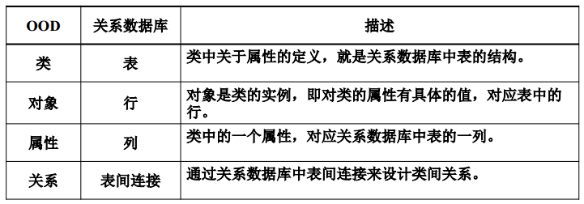

类间关系在数据库中的表现主要涉及**关联关系**和**泛化关系**

#### 关联关系的设计

主要涉及类间重数的描述

- 一对一关联  
- 一对多关联
- 多对多关联

#### 泛化关系的数据设计

- 可以仅将派生类映射为表，将基类中属性定义在派生类中
- 对基类和派生类各子定义表，同时将基类表中的逐渐定义为派生表的外键

### 人机交互设计

策略

- 对用户分类
- 对控制命令分类
- 设计人机交互的界面类

原则

- 保持用户界面一致性
- 显示必要信息
- 提供不同的数据输入方式

### 建立实现模型

### 设计模式

对系统设计要考虑两个方面

- 动态变化：设计所得的模式需要适应将来新的需求
- 静态特征：设计所得的模式要尽可能重用原有的类和模型

设计模式是一套经过规范定义的，有针对性的、能被重复应用的**解决方案**总结

#### Singleton模式

单例模式，在一些应用场景下，有时只需要产生一个系统实例或一个对象实例

Singleton模式使得系统运行时仅有一个受约束的实例存在  

#### Abstract Factory模式

抽象工厂模式，在一些应用场景下，需要用不同的对象操作统一的接口

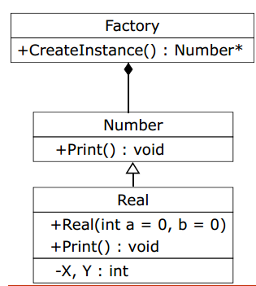

#### Meditor模式

类之间有相互关系，若比较复杂，可以定义中介类专门处理

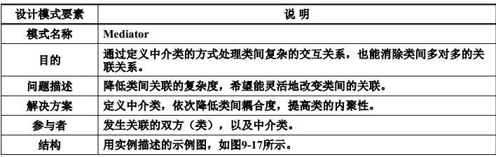

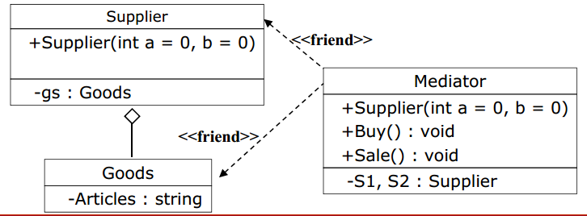

### Adapter模式

适配器模式，为了适应不同类的接口，常常需要修改各自的接口，定义适应不同接口的接口类解决此类问题

#### Iterator模式

迭代器模式，对于保存数据的类来说，需要提供一种便于顺序访问类中的数据，同时又无需暴露
类中数据的存储形式的方法

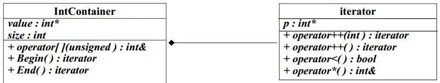

#### State模式

状态模式，根据不同的状态进行不同处理的问题  ，减少实现过程中的分支嵌套，当加入新状态时无需重新编译

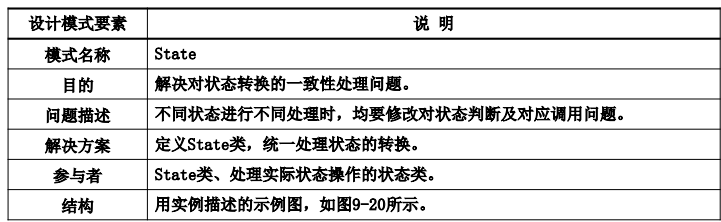

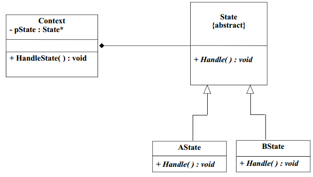

### 面向对象测试

面向对象测试是基于类展开的

- 封装性减少对数据和函数非法操作和调用的测试
- 继承性使得原有代码中的错误得到传播，增加了派生类的测试工作
- 多态性使得在类继承体系的类家族中，对同一接口的函数的操作更为复杂

#### 面向对象的单元测试

- 确保属性的封装性约束

  需要注意两类问题

  - 当类的属性中定义有指针、引用或数组时
  - 当类的成员函数返回指针或引用，而该指针或引用指向类的私有属性时

- 派生类对基类成员函数的测试

  如果出现了以下情况，需要在派生类中重新测试

  - 派生类重定义了基类成员函数
  - 派生类继承的基类成员函数中调用了修改的成员函数

- 对抽象类的测试

  对抽象类的测试，主要是通过对其派生的测试来进行的

#### 集成测试

## 软件维护

软件维护是软件生命周期最后一个阶段，基本任务是保证软件在整个运行期间能正常工作

指软件系统交付使用以后，为了改正错误或满足新的需求而**修改软件**的过程  

软件维护的任务

- 在软件系统运行过程中发现**测试阶段**未能发现的、潜在的软件错误和缺陷  
- 适应软硬件环境的改变
- 根据实际情况发展，改进软件设计，增强软件功能，提高软件性能
- 扩大软件系统的应用范围

软件维护的特点

- 是软件生命周期中，时间最长、工作量最大的活动  
- 软件维护不可避免引入新问题
- 软件维护实际上是**简化**的软件生命周期开发过程  
- 软件维护也要按照软件工程开发过程和评审展开

软件维护的分类

- 完善性维护：扩充原有系统的功能，提高系统的性能，满足新需求，占比最大
- 纠错性维护：针对系统运行过程中暴露出的错误进行纠错
- 适应性维护：使适应计算机的软硬件环境变化、数据变化
- 预防性维护：主动性维护，为提高软件的可靠性和可维护性，为将来的运行和维护打下基础

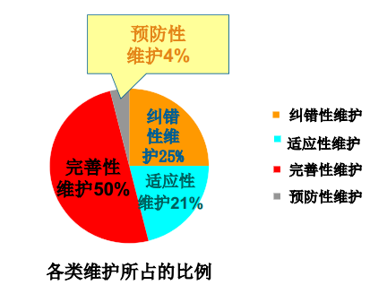

### 软件维护过程

每项维护活动，都要建立维护组织，提出维护报告，并在相应技术指导下，进行论证和有步骤展开维护活动

#### 维护方式

- 结构化维护：有完整的软件配置（需求规格说明、设计规格说明、代码、测试文档以及相关数据说明）
- 非结构化维护：所需软件配置仅仅为程序代码，非常困难

#### 软件维护管理的基本内容

主要涵盖以下几个方面

- 维护的组织结构

  维护组织存在以下几个困难

  - 维护工作的不确定性
  - 维护人员的流动性
  - 为不确定的维护工作确定固定人员的方式涉及系统的成本和效益问题

- 维护的申请报告

  维护开始前都需要提交维护申请报告，统一采用维护申请表MRF

  维护管理员和系统管理员需要就以下方面分析MRF，并对其影响做出评估

  - 类型，例如纠正、改进、预防或对新环境的适应  
  - 范围，类如修改规模、涉及的费用、修改时机  
  - 关键性，例如对性能、安全、保密的影响  

- 维护工作流

  

  无论哪种类型的维护都要进行如下工作：修改软件设计、进行设计复审、重新编码、测试（回归测试）、复查、验收

- 维护成本

  - 非技术因素
    - 开发经验
    - 人员稳定性
    - 应用时间
    - 外部支撑环境
    - 用户需求变化
  - 技术因素
    - 软件复杂程度
    - 软件维护人员能力
    - 软件配置管理能力
    - 软件编程规范

  成本预测公式，通过对年变化冲突ACT的计算得到，是指软件产品一年中变化部分占总规模的比例

  

  其中AMEb为基本年维护成本，通常以人月为单位

  ADT为项目开发成本，通常也以人月为单位

  ACT是年变化冲突，可通过经验值估算

  另一种预测模型为

  

  M是维护所用总工作量，P是生产性总工作量，K是经验常数，c是复杂度（表示设计的好坏及文档完整度），d是对维护软件的熟悉程度。  

- 维护评审

  维护每阶段工作完成，都应进行软件维护评审

  将一些**特征量化**，作为维护评价的参考指标

#### 维护过程中存在的问题

分为几类

- 可维护性问题
  - 代码没有注释
  - 缺乏软件配置
  - 开发人员的流动性
  - 缺少软件维护理念
  - 缺乏软件维护工作认识
- 副作用
  - 修改代码的副作用
  - 修改数据的副作用
  - 修改文档的副作用

### 软件的可维护性

#### 可维护性因素

- 可理解性
- 可测试性
- 可修改性
- 可移植性
- 可重用性

#### 提高软件的可维护性

- 软件文档配置

  文档分为

  - 用户文档：描述系统功能和操作过程
  - 系统文档：从问题定义、需求分析、设计方案、测试计划到维护的整个软件生命周期过程的全部文档
  - 历史文档：在软件生命周i中曾编写的文档

  高质量文档应包含以下方面

  - 正确性
  - 针对性
  - 完整性
  - 可追溯性

- 使用能提高维护效率的开发技术和工具

  - 模块化设计
  - 结构化程序设计
  - 面向对象程序设计
  - 伪码设计规范

- 可维护性复审

  是指在为软件工程各阶段进行技术审查和管理复审的同时，考虑以下可维护性因素

  - 开发阶段各可维护因素
  - 软件维护不是面对源程序代码，而是整个软件文档配置  
  - 编程的风格和代码规范，对软件维护起着重要作用  

### 软件维护评审

在维护工作完成前必须编写软件维护规格说明SMS

软件维护应在软件过程实施的每个阶段进行

- 在需求分析阶段的评审，需要在需求规格说明中对将来可能修改以及能加以改进的部分进行注明
- 在设计阶段的评审，应从易于维护和提高系统质量角度评审
- 在实现阶段的评审中，应主要审查代码风格、代码注释等影响可维护性的因素
- 在测试阶段，应进行测试的配置复审，确保配置的所有成分的可维护性

## 软件项目管理

软件项目管理是通过对软件工程全过程的计划、组织和控制等一系列活动，合理配置和使用与软件项目开发有关的各项资源，并按照预定计划、精度和预算推进软件开发过程，最终得到符合用户需求的软件产品的过程。主要包含以下方面内容

- 软件可行性分析
- 人员的组织与管理
- 软件度量
- 软件生产率
- 风险管理
- 软件质量保证
- 软件配置

软件管理的目标

- 如期完成任务
- 项目成本控制在计划之内
- 妥善处理用户的需求变动
- 保证项目质量
- 保持对项目的跟踪与控制

核心是对人的管理，难点是成本和进度的控制

### 软件规模度量

任何软件项目都需要**定量描述**才能制定软件开发成本。  

对软件产品的度量分为**直接度量**和**间接度量**。 

- 直接度量是指通过对软件产品的简单属性直接计算而得到结果的过程。  
- 间接度量是指通过对软件产品的简单属性、要素的各项特征、准则的经验值间接计算而得到结果的过程  

#### 代码行技术LOC

直接度量

- KL：代码行数用KLOC（千行代码）  
- E：工作量用人月（PM）度量
- S：项目总开销  
- PG：项目文档页数  
- ER：项目代码错误数  

- 生产率：P = KL/E
- 每行代码的平均成本：C = S / KL
- 文档与代码比：D = PG / KL  
- 代码出错率：R = ER / KL  

简单、直观，但缺点有

- 严重依赖程序代码
- 不利于程序算法的优化和设计的精巧化
- 只适用于过程式程序设计语言

#### 功能点计算FP

间接度量

基于定义的五个信息领域特征数以及多项因子进行简介度量

五个信息域

- 输入项数
- 输出项数
- 查询数
- 文档数
- 外部接口数

### 软件项目估算

- 对比已有项目产生的实际成本，结合当前项目的需求估算项目成本和工作量。  
- 总结已有项目的数据，分析并概括软件项目成本和工作量的经验公式  
- 按项目中的问题分解。  
- 按过程分解

### 项目进度管理

软件项目进度安排通过把工作量分配给特定软件工程阶段，并规定完成各项任务的起止日期。  

如果为了缩短开发时间，则会大大增加项目的工作量  

#### 甘特图

难以发现任务间的隐含关系和关键任务

#### 网络工程图

### 软件能力成熟度模型CMM

划分为五个等级

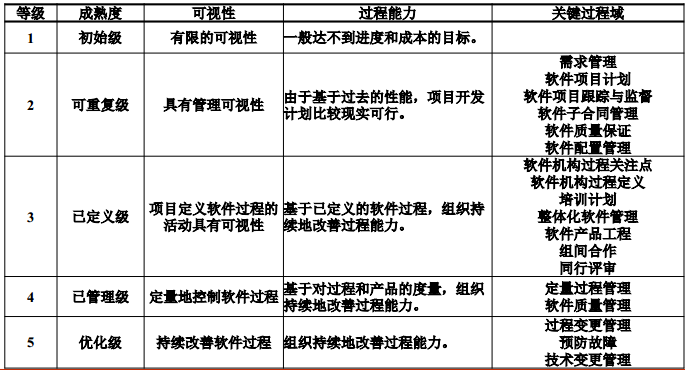